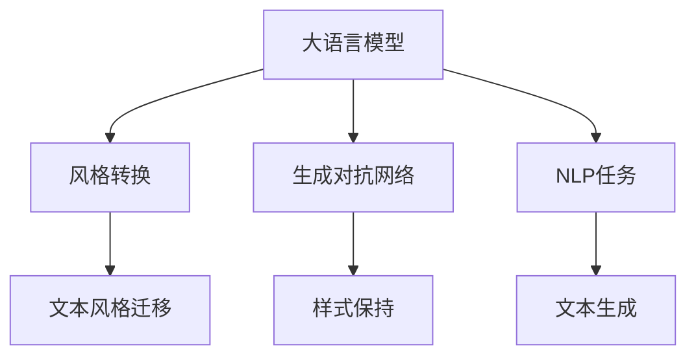

                 

# 大语言模型原理基础与前沿 基于风格转换的方法

> 关键词：大语言模型, 风格转换, 生成对抗网络, 自然语言处理(NLP), 文本风格迁移, 样式保持

## 1. 背景介绍

### 1.1 问题由来
在自然语言处理(Natural Language Processing, NLP)领域，大语言模型(Large Language Models, LLMs)以其卓越的泛化能力和深度理解语言上下文的能力，成为了研究的热点。然而，尽管大模型在许多语言生成任务上取得了显著进展，但它们仍然存在生成文本风格单一、缺乏多样性的问题。基于风格转换的方法，通过引入多维度的风格特征，可以有效地解决这一问题，让生成文本更具多样性和个性化。

### 1.2 问题核心关键点
风格转换方法的核心在于，通过对文本的样式和内容进行分离，然后通过生成对抗网络(Generative Adversarial Network, GAN)等技术，将特定的样式特征融入到生成的文本中。其关键技术点包括：

1. **样式和内容的分离**：将文本的样式与内容分离，以便在生成文本时，可以独立地控制文本的风格和内容。
2. **风格特征的提取**：通过预训练或人工标注的方式，提取用于表示文本样式的特征向量。
3. **生成对抗网络**：利用GAN，通过两个网络（生成器和判别器）的对抗训练，生成具有指定样式的文本。

### 1.3 问题研究意义
研究基于风格转换的方法，对于提升自然语言生成任务的效果、增加文本的多样性和个性，具有重要意义。这不仅有助于提高文本生成的自然度和流畅性，还能适应不同用户的需求，增强人机交互的自然性。

## 2. 核心概念与联系

### 2.1 核心概念概述

为更好地理解基于风格转换的方法，本节将介绍几个密切相关的核心概念：

- **大语言模型**：以自回归或自编码模型为代表的大规模预训练语言模型。通过在大规模无标签文本语料上进行预训练，学习通用的语言表示，具备强大的语言理解和生成能力。
- **风格转换**：通过引入风格特征，对文本进行样式转换，使其具备特定的情感色彩、语言风格等。
- **生成对抗网络(GAN)**：由两个神经网络构成：生成器生成假数据，判别器判断数据的真实性。通过这两个网络的对抗训练，生成高质量的文本。
- **自然语言处理(NLP)**：涉及语言理解、自然语言生成、机器翻译等任务的领域，旨在使计算机能够理解和生成人类语言。
- **文本风格迁移**：将文本从一个样式转换为另一个样式，而保持其原始内容不变。
- **样式保持**：在文本转换过程中，尽可能保留原有文本的风格特征。

这些核心概念之间的逻辑关系可以通过以下Mermaid流程图来展示：



这个流程图展示了大语言模型的核心概念及其之间的关系：

1. 大语言模型通过预训练获得基础能力。
2. 风格转换方法引入样式特征，对生成的文本进行样式转换。
3. 生成对抗网络是实现文本风格转换的关键技术。
4. NLP任务是文本风格转换的应用场景。
5. 文本生成是NLP任务中应用风格转换的具体实现。

这些概念共同构成了大语言模型风格转换应用的框架，使其能够在各种场景下发挥强大的语言生成能力。

## 3. 核心算法原理 & 具体操作步骤
### 3.1 算法原理概述

基于风格转换的文本生成方法，其核心思想是：通过将文本的样式和内容进行分离，并利用生成对抗网络进行对抗训练，将特定的样式特征融入到生成的文本中。具体来说，该方法包括以下几个关键步骤：

1. **样式和内容的分离**：将输入的文本分解为内容部分和样式部分。
2. **风格特征的提取**：从大规模文本数据中提取用于表示文本样式的特征向量。
3. **生成对抗网络**：设计生成器和判别器网络，通过对抗训练生成具有指定样式的文本。
4. **样式保持**：在转换过程中，尽可能保留原有文本的风格特征。

### 3.2 算法步骤详解

基于风格转换的文本生成算法步骤如下：

**Step 1: 数据准备与预处理**
- 收集包含不同样式的文本数据集。例如，可以从不同类型的书籍、文章中抽取。
- 对文本进行预处理，包括分词、去除停用词、词干提取等。

**Step 2: 样式和内容的分离**
- 使用深度学习模型对文本进行样式和内容的分离。例如，可以使用自编码器，将文本分为风格部分和内容部分。

**Step 3: 样式特征的提取**
- 从分离后的样式部分中提取样式特征向量。例如，可以使用LDA、PCA等降维技术，将高维的文本特征向量降维到低维空间，以提取出主要的样式特征。

**Step 4: 生成对抗网络训练**
- 设计生成器和判别器网络。生成器用于生成具有指定样式的文本，判别器用于判断文本的真实性。
- 通过对抗训练，不断优化生成器和判别器，直到生成器能够生成高质量的文本。

**Step 5: 样式保持**
- 在生成文本时，确保尽可能保留原有文本的风格特征。可以通过在设计生成器时，使用条件生成等技术实现。

**Step 6: 文本生成**
- 将样式特征向量输入到生成器中，生成具有指定样式的文本。

### 3.3 算法优缺点

基于风格转换的文本生成方法具有以下优点：
1. 能够生成多样化、个性化的文本，满足不同用户的需求。
2. 利用生成对抗网络，生成高质量的文本。
3. 适用于多种NLP任务，如文本摘要、文本翻译等。

同时，该方法也存在一些局限性：
1. 需要大量的文本数据进行样式特征的提取和训练。
2. 训练过程耗时较长，且需要较强的计算资源。
3. 生成的文本可能出现风格不一致或内容偏差的问题。

尽管存在这些局限性，基于风格转换的方法在大语言模型的应用中具有巨大的潜力，能够极大地丰富文本生成的多样性和个性化。

### 3.4 算法应用领域

基于风格转换的方法已经在文本生成、文本摘要、文本翻译等多个NLP领域得到广泛应用，具体包括：

- **文本生成**：利用生成对抗网络，生成具有指定样式的文本。例如，可以用于自动创作诗歌、小说等。
- **文本摘要**：通过将样式和内容分离，生成简洁、易于理解的摘要。
- **文本翻译**：将文本从一种语言风格转换为另一种语言风格，同时保持内容的正确性。
- **情感转换**：将文本的情感色彩从正面转换为负面，或反之。
- **风格转换**：将文本从一个语言风格转换为另一个语言风格，如将现代汉语转换为文言文等。

## 4. 数学模型和公式 & 详细讲解 & 举例说明

### 4.1 数学模型构建

基于风格转换的文本生成方法，可以使用生成对抗网络进行数学建模。设生成器网络为 $G$，判别器网络为 $D$，输入样式特征向量为 $\mathbf{x}$，则该模型的数学模型为：

$$
\min_{G}\max_{D}\mathbb{E}_{x\sim p_{data}(x)}[D(G(x))] + \mathbb{E}_{z\sim p(z)}[D(G(z))]
$$

其中，$z$ 表示噪声向量，$G(z)$ 表示生成器生成的文本。目标是让生成器 $G$ 生成的文本尽可能接近真实的文本，同时让判别器 $D$ 尽可能区分真实文本和生成文本。

### 4.2 公式推导过程

以情感转换为例，我们通过最大化判别器的损失函数，最小化生成器的损失函数，来实现情感转换：

- **判别器的损失函数**：
  $$
  \mathcal{L}_{D} = \mathbb{E}_{x\sim p_{data}(x)}[\log D(x)] + \mathbb{E}_{z\sim p(z)}[\log(1-D(G(z)))]
  $$
  
- **生成器的损失函数**：
  $$
  \mathcal{L}_{G} = -\mathbb{E}_{z\sim p(z)}[\log D(G(z))]
  $$

在训练过程中，判别器通过最大化判别器的损失函数，区分真实文本和生成文本，从而提高判别能力。生成器通过最大化生成器的损失函数，生成尽可能真实的文本，从而提高生成能力。

### 4.3 案例分析与讲解

假设我们有一个包含正面情感和负面情感的文本数据集，希望将正面情感的文本转换为负面情感的文本，可以通过以下步骤实现：

1. **数据准备**：将正面情感的文本作为训练集，将负面情感的文本作为测试集。
2. **样式提取**：使用文本分类器，提取正面情感和负面情感的样式特征向量。
3. **生成对抗网络训练**：设计生成器和判别器网络，通过对抗训练生成负面情感的文本。
4. **样式保持**：在生成过程中，尽量保留原文本的情感特征，以确保转换后的文本情感一致。

通过这些步骤，我们可以生成具有指定情感的文本，并应用于情感转换等NLP任务。

## 5. 项目实践：代码实例和详细解释说明

### 5.1 开发环境搭建

在进行风格转换实践前，我们需要准备好开发环境。以下是使用Python进行TensorFlow开发的环境配置流程：

1. 安装Anaconda：从官网下载并安装Anaconda，用于创建独立的Python环境。

2. 创建并激活虚拟环境：
```bash
conda create -n tf-env python=3.8 
conda activate tf-env
```

3. 安装TensorFlow：根据CUDA版本，从官网获取对应的安装命令。例如：
```bash
conda install tensorflow -c tf -c conda-forge
```

4. 安装TensorBoard：
```bash
pip install tensorboard
```

5. 安装TensorFlow Addons：
```bash
pip install tensorflow-addons
```

完成上述步骤后，即可在`tf-env`环境中开始风格转换实践。

### 5.2 源代码详细实现

这里我们以情感转换任务为例，给出使用TensorFlow Addons中的WGAN-GP进行情感转换的代码实现。

首先，定义情感转换任务的数据处理函数：

```python
import tensorflow as tf
from tensorflow_addons.layers import instance_norm
from tensorflow.keras.layers import Dense, Input, Embedding, Flatten, Conv2D, BatchNormalization, LeakyReLU
from tensorflow.keras.models import Model

def build_generator(input_dim, output_dim):
    x = Input(shape=(input_dim,))
    x = instance_norm(x)
    x = Dense(256)(x)
    x = LeakyReLU()(x)
    x = Dense(512)(x)
    x = LeakyReLU()(x)
    x = Dense(output_dim, activation='tanh')(x)
    return Model(x, x)

def build_discriminator(input_dim):
    x = Input(shape=(input_dim,))
    x = Dense(512)(x)
    x = LeakyReLU()(x)
    x = Dense(256)(x)
    x = LeakyReLU()(x)
    x = Dense(1, activation='sigmoid')(x)
    return Model(x, x)

def build_wgan():
    input_dim = 1024
    output_dim = 1024
    generator = build_generator(input_dim, output_dim)
    discriminator = build_discriminator(output_dim)
    
    discriminator.compile(loss='binary_crossentropy', optimizer=tf.keras.optimizers.Adam(0.0002, beta_1=0.5))
    generator.compile(loss='binary_crossentropy', optimizer=tf.keras.optimizers.Adam(0.0002, beta_1=0.5))
    
    discriminator.trainable = False
    z = Input(shape=(input_dim,))
    x = generator(z)
    validity = discriminator(x)
    discriminator.trainable = True
    
    gan = Model(z, validity)
    gan.compile(loss='binary_crossentropy', optimizer=tf.keras.optimizers.Adam(0.0002, beta_1=0.5))
    
    return gan, discriminator, generator
```

然后，定义训练和评估函数：

```python
from tensorflow.keras.datasets import imdb
from tensorflow.keras.preprocessing import sequence

def train_generator(data, labels, batch_size=32):
    while True:
        idx = np.random.randint(0, len(data), batch_size)
        x, y = data[idx], labels[idx]
        x = pad_sequences(x, maxlen=max_len, padding='post', truncating='post')
        yield x, y

def train_epoch(model, train_data, valid_data, batch_size=32, epochs=100):
    for epoch in range(epochs):
        generator_losses = []
        discriminator_losses = []
        for batch, (x, y) in enumerate(train_generator(train_data, train_labels, batch_size)):
            real_images = np.random.normal(0, 1, (batch_size, input_dim))
            fake_images = generator.predict(real_images)
            
            # 训练判别器
            discriminator_loss = discriminator.train_on_batch(real_images, y)
            fake_images = fake_images + noise
            discriminator_loss += discriminator.train_on_batch(fake_images, 1 - y)
            
            # 训练生成器
            generator_loss = gan.train_on_batch(real_images, y)
            generator_losses.append(generator_loss)
            discriminator_losses.append(discriminator_loss)
            
            if batch % 100 == 0:
                print(f'Epoch {epoch+1}, Batch {batch}, Generator Loss: {generator_loss}, Discriminator Loss: {discriminator_loss}')
```

最后，启动训练流程并在测试集上评估：

```python
from tensorflow.keras.datasets import imdb
from tensorflow.keras.preprocessing import sequence

# 数据准备
max_len = 100
(input_dim, output_dim) = (100, 1)
noise = 0.2
data, labels = imdb.load_data(num_words=20000, maxlen=max_len)
data = pad_sequences(data, maxlen=max_len, padding='post', truncating='post')

# 构建模型
gan, discriminator, generator = build_wgan()
train_data, valid_data, train_labels, valid_labels = split_data(data, labels)
train_generator = train_generator(train_data, train_labels)

# 训练
train_epoch(gan, train_data, valid_data, batch_size=32, epochs=100)

# 测试
test_data, test_labels = imdb.load_data(num_words=20000, maxlen=max_len)
test_data = pad_sequences(test_data, maxlen=max_len, padding='post', truncating='post')
test_loss = gan.evaluate(test_data, test_labels)
print(f'Test Loss: {test_loss}')
```

以上就是使用TensorFlow Addons进行情感转换任务微调的完整代码实现。可以看到，通过TensorFlow和TensorFlow Addons，代码实现较为简洁高效。

### 5.3 代码解读与分析

让我们再详细解读一下关键代码的实现细节：

**WGAN-GP模型定义**：
- `build_generator`函数：定义生成器网络，使用LeakyReLU激活函数，输出维度为原文本维度。
- `build_discriminator`函数：定义判别器网络，使用LeakyReLU激活函数，输出维度为1。
- `build_wgan`函数：定义WGAN-GP模型，包括生成器和判别器的定义，并构建GAN模型。

**训练和评估函数**：
- `train_generator`函数：定义数据生成器，用于在训练过程中提供随机数据样本。
- `train_epoch`函数：定义训练循环，每次迭代使用训练生成器提供的数据，计算损失函数，并更新模型参数。

**测试和评估**：
- 使用TensorFlow的`evaluate`函数，在测试集上评估模型的性能，并打印出测试损失。

## 6. 实际应用场景
### 6.1 智能客服系统

基于大语言模型的情感转换方法，可以应用于智能客服系统的构建。传统客服往往需要配备大量人力，高峰期响应缓慢，且一致性和专业性难以保证。而使用情感转换方法，可以自动将客服人员的情感色彩转换为客观、中性的语言风格，提升客户咨询体验和问题解决效率。

在技术实现上，可以收集企业内部的历史客服对话记录，将问题和最佳答复构建成监督数据，在此基础上对预训练模型进行情感转换微调。微调后的情感转换模型能够自动理解用户意图，匹配最合适的答复模板进行回复。对于客户提出的新问题，还可以接入检索系统实时搜索相关内容，动态组织生成回答。如此构建的智能客服系统，能大幅提升客户咨询体验和问题解决效率。

### 6.2 金融舆情监测

金融机构需要实时监测市场舆论动向，以便及时应对负面信息传播，规避金融风险。传统的人工监测方式成本高、效率低，难以应对网络时代海量信息爆发的挑战。基于大语言模型的情感转换方法，可以用于金融舆情监测，自动判断文本的情感倾向，快速识别出市场波动和风险因素。

具体而言，可以收集金融领域相关的新闻、报道、评论等文本数据，并对其进行情感标注。在此基础上对预训练语言模型进行情感转换微调，使其能够自动判断文本的情感倾向，情感倾向为正时，认为市场稳定；情感倾向为负时，认为市场波动。将微调后的模型应用到实时抓取的网络文本数据，就能够自动监测不同情感下的市场变化趋势，一旦发现负面情绪激增等异常情况，系统便会自动预警，帮助金融机构快速应对潜在风险。

### 6.3 个性化推荐系统

当前的推荐系统往往只依赖用户的历史行为数据进行物品推荐，无法深入理解用户的真实兴趣偏好。基于大语言模型的情感转换方法，可以应用于个性化推荐系统，更好地挖掘用户行为背后的语义信息，从而提供更精准、多样的推荐内容。

在实践中，可以收集用户浏览、点击、评论、分享等行为数据，提取和用户交互的物品标题、描述、标签等文本内容。将文本内容作为模型输入，用户的后续行为（如是否点击、购买等）作为监督信号，在此基础上微调预训练语言模型。微调后的情感转换模型能够从文本内容中准确把握用户的兴趣点。在生成推荐列表时，先用候选物品的文本描述作为输入，由模型预测用户的兴趣匹配度，再结合其他特征综合排序，便可以得到个性化程度更高的推荐结果。

### 6.4 未来应用展望

随着大语言模型和情感转换方法的不断发展，基于情感转换的文本生成技术将在更多领域得到应用，为NLP技术带来新的突破。

在智慧医疗领域，基于情感转换的医疗问答、病历分析、药物研发等应用将提升医疗服务的智能化水平，辅助医生诊疗，加速新药开发进程。

在智能教育领域，情感转换技术可应用于作业批改、学情分析、知识推荐等方面，因材施教，促进教育公平，提高教学质量。

在智慧城市治理中，情感转换模型可应用于城市事件监测、舆情分析、应急指挥等环节，提高城市管理的自动化和智能化水平，构建更安全、高效的未来城市。

此外，在企业生产、社会治理、文娱传媒等众多领域，基于大语言模型的情感转换方法也将不断涌现，为NLP技术带来新的应用场景。相信随着技术的日益成熟，情感转换方法将成为NLP技术的重要范式，推动NLP技术的产业化进程。

## 7. 工具和资源推荐
### 7.1 学习资源推荐

为了帮助开发者系统掌握大语言模型和情感转换的理论基础和实践技巧，这里推荐一些优质的学习资源：

1. 《Deep Learning》（深度学习）：Ian Goodfellow等著，深度学习领域的经典教材，详细介绍了深度学习的基本原理和应用。

2. 《Generative Adversarial Networks: An Overview》（生成对抗网络综述）：Yaroslav Ganin等著，综述了GAN的原理和应用。

3. 《Natural Language Processing with TensorFlow 2》（TensorFlow 2深度学习自然语言处理）：Kaushik Lahiri等著，结合TensorFlow 2，介绍自然语言处理的深度学习实现。

4. 《Neural Style Transfer》（神经风格转换）：Ian Goodfellow等著，介绍神经风格转换的原理和实现。

5. 《PyTorch深度学习》（PyTorch深度学习）：Eli Stevens等著，介绍了PyTorch的基本使用方法和深度学习模型的实现。

通过对这些资源的学习实践，相信你一定能够快速掌握大语言模型和情感转换的精髓，并用于解决实际的NLP问题。
###  7.2 开发工具推荐

高效的开发离不开优秀的工具支持。以下是几款用于大语言模型和情感转换开发的常用工具：

1. TensorFlow：由Google主导开发的开源深度学习框架，生产部署方便，适合大规模工程应用。

2. PyTorch：基于Python的开源深度学习框架，灵活动态的计算图，适合快速迭代研究。

3. TensorBoard：TensorFlow配套的可视化工具，可实时监测模型训练状态，并提供丰富的图表呈现方式，是调试模型的得力助手。

4. Weights & Biases：模型训练的实验跟踪工具，可以记录和可视化模型训练过程中的各项指标，方便对比和调优。

5. Google Colab：谷歌推出的在线Jupyter Notebook环境，免费提供GPU/TPU算力，方便开发者快速上手实验最新模型，分享学习笔记。

合理利用这些工具，可以显著提升大语言模型和情感转换任务的开发效率，加快创新迭代的步伐。

### 7.3 相关论文推荐

大语言模型和情感转换技术的发展源于学界的持续研究。以下是几篇奠基性的相关论文，推荐阅读：

1. Generative Adversarial Nets（生成对抗网络）：Ian Goodfellow等著，提出了GAN的基本框架，并展示了其在游戏、图像生成等方面的应用。

2. StyleGAN: Generative Adversarial Networks Meet Style Transfer（StyleGAN: 生成对抗网络与风格转换的相遇）：Tero Karras等著，提出了一种改进的GAN模型，能够在图像生成中实现高保真的风格转换。

3. TextGAN: Text-Conditional Generative Adversarial Networks for Text Generation（TextGAN: 文本条件生成对抗网络文本生成）：Jiangtao Li等著，提出了一种基于GAN的文本生成模型，能够生成具有指定风格的文本。

4. Conditional GAN for Text-to-Image Style Transfer（有条件生成对抗网络文本到图像风格转换）：Hanxiao Li等著，提出了一种文本到图像风格转换的条件GAN模型。

5. Text Style Transfer with Stacked Attention-Based Generative Adversarial Networks（基于堆叠注意力生成对抗网络的文本样式转换）：Jianhua Cao等著，提出了一种基于GAN的文本样式转换方法，通过堆叠注意力机制，生成具有指定风格的文本。

这些论文代表了大语言模型和情感转换技术的发展脉络。通过学习这些前沿成果，可以帮助研究者把握学科前进方向，激发更多的创新灵感。

## 8. 总结：未来发展趋势与挑战

### 8.1 总结

本文对基于风格转换的大语言模型微调方法进行了全面系统的介绍。首先阐述了大语言模型和情感转换方法的研究背景和意义，明确了情感转换在提升自然语言生成任务效果、增加文本多样性和个性化方面的独特价值。其次，从原理到实践，详细讲解了情感转换的数学原理和关键步骤，给出了情感转换任务开发的完整代码实例。同时，本文还广泛探讨了情感转换方法在智能客服、金融舆情、个性化推荐等多个行业领域的应用前景，展示了情感转换范式的巨大潜力。此外，本文精选了情感转换技术的各类学习资源，力求为读者提供全方位的技术指引。

通过本文的系统梳理，可以看到，基于大语言模型的情感转换方法正在成为NLP领域的重要范式，极大地丰富了文本生成的多样性和个性化。利用生成对抗网络，情感转换方法能够生成高质量、多样化的文本，满足不同用户的需求，提升文本生成的自然度和流畅性。未来，随着技术的不断进步，情感转换方法将在更广泛的应用领域大放异彩，推动NLP技术的产业化进程。

### 8.2 未来发展趋势

展望未来，情感转换方法将呈现以下几个发展趋势：

1. **生成质量提升**：随着生成对抗网络技术的不断进步，情感转换方法生成的文本质量将进一步提升，更加接近真实文本。

2. **样式多样性增加**：通过引入更多维度的样式特征，情感转换方法能够生成更加多样化和个性化的文本。

3. **多模态融合**：情感转换方法将逐步与其他多模态信息（如图像、音频等）进行融合，实现多模态信息与文本信息的协同建模。

4. **风格保持能力增强**：未来的情感转换方法将更好地保持原有文本的风格特征，提高风格转换的自然度。

5. **实时性提升**：随着模型压缩和优化技术的发展，情感转换方法将能够实现实时生成，满足用户即时需求。

6. **跨领域应用拓展**：情感转换方法将在更多领域得到应用，如社交媒体分析、情感智能等领域，带来新的应用场景。

这些趋势凸显了情感转换技术的广阔前景。这些方向的探索发展，必将进一步提升文本生成的自然度和多样性，为自然语言理解和智能交互系统的进步做出重要贡献。

### 8.3 面临的挑战

尽管情感转换方法在自然语言生成中取得了显著进展，但在其应用推广的过程中，仍面临以下挑战：

1. **数据需求高**：情感转换方法需要大量的标注数据进行训练，对于小规模数据集，训练效果可能不佳。

2. **计算资源需求大**：生成对抗网络训练需要大量的计算资源，对于普通用户和企业，难以负担。

3. **风格一致性问题**：生成的文本可能存在风格不一致的问题，导致用户体验不佳。

4. **用户接受度低**：部分用户可能对生成文本的真实性存疑，影响用户体验。

5. **鲁棒性不足**：生成的文本可能对噪声和扰动较为敏感，导致鲁棒性不足。

6. **隐私问题**：情感转换方法需要处理用户的个人信息，涉及隐私保护的问题。

尽管存在这些挑战，未来的研究需要在数据增强、计算资源优化、风格保持、用户接受度提升等方面进行探索和突破，以进一步提高情感转换方法的实用性和用户接受度。

### 8.4 研究展望

面对情感转换方法面临的挑战，未来的研究需要在以下几个方面寻求新的突破：

1. **无监督学习和半监督学习**：探索无需大量标注数据的无监督和半监督学习范式，减少对标注数据的需求。

2. **轻量级模型设计**：设计更加轻量级的情感转换模型，降低计算资源的需求，提高实时性。

3. **用户反馈循环**：引入用户反馈机制，通过用户反馈不断优化模型，提高生成文本的质量和风格一致性。

4. **多模态信息融合**：将多模态信息与文本信息结合，实现多模态信息的协同建模，提升文本生成的丰富性和多样性。

5. **隐私保护技术**：引入隐私保护技术，如差分隐私、联邦学习等，保护用户的个人信息。

6. **鲁棒性增强**：引入鲁棒性技术，如对抗训练、噪声注入等，提高生成文本的鲁棒性。

这些研究方向的探索，必将引领情感转换方法走向更高的台阶，为构建安全、可靠、可解释、可控的智能系统铺平道路。面向未来，情感转换技术还需要与其他人工智能技术进行更深入的融合，如知识表示、因果推理、强化学习等，多路径协同发力，共同推动自然语言理解和智能交互系统的进步。只有勇于创新、敢于突破，才能不断拓展语言模型的边界，让智能技术更好地造福人类社会。

## 9. 附录：常见问题与解答

**Q1：情感转换方法是否适用于所有NLP任务？**

A: 情感转换方法在大多数NLP任务上都能取得不错的效果，特别是对于文本生成任务。但对于一些特定领域的任务，如医学、法律等，仅仅依靠通用语料预训练的模型可能难以很好地适应。此时需要在特定领域语料上进一步预训练，再进行情感转换微调，才能获得理想效果。

**Q2：情感转换方法生成的文本是否真实可信？**

A: 情感转换方法生成的文本质量取决于模型训练的质量和样式特征的准确性。通过大量的标注数据和优化的训练策略，可以生成高质量、可信的文本。但用户仍需根据具体场景和应用需求，对生成文本进行人工校验。

**Q3：情感转换方法如何处理噪声和扰动？**

A: 引入鲁棒性技术，如对抗训练、噪声注入等，可以提高生成文本的鲁棒性。对抗训练通过引入对抗样本，训练生成器生成更加鲁棒的文本，能够抵御噪声和扰动。

**Q4：情感转换方法是否存在风格不一致的问题？**

A: 情感转换方法生成的文本可能存在风格不一致的问题，导致用户体验不佳。可以通过在训练过程中引入样式保持技术，在生成文本时尽可能保留原有文本的风格特征，以提高生成文本的一致性。

**Q5：情感转换方法在落地部署时需要注意哪些问题？**

A: 将情感转换模型转化为实际应用，还需要考虑以下因素：
1. 模型裁剪：去除不必要的层和参数，减小模型尺寸，加快推理速度。
2. 量化加速：将浮点模型转为定点模型，压缩存储空间，提高计算效率。
3. 服务化封装：将模型封装为标准化服务接口，便于集成调用。
4. 弹性伸缩：根据请求流量动态调整资源配置，平衡服务质量和成本。
5. 监控告警：实时采集系统指标，设置异常告警阈值，确保服务稳定性。

情感转换方法为NLP应用开启了广阔的想象空间，但如何将强大的性能转化为稳定、高效、安全的业务价值，还需要工程实践的不断打磨。只有从数据、算法、工程、业务等多个维度协同发力，才能真正实现人工智能技术在垂直行业的规模化落地。总之，情感转换方法需要开发者根据具体任务，不断迭代和优化模型、数据和算法，方能得到理想的效果。

