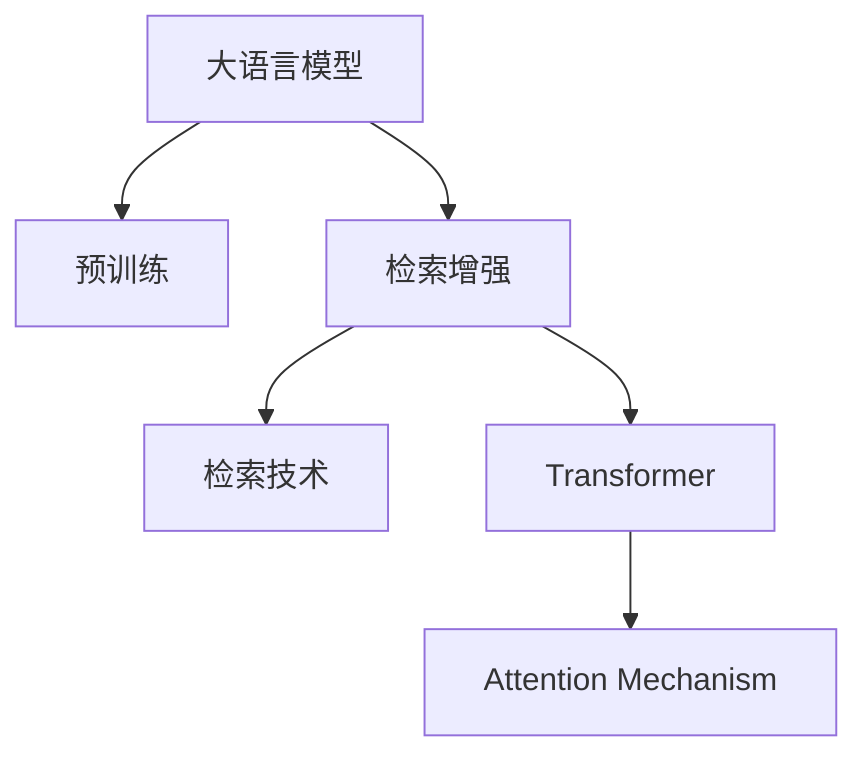

                 

# 大语言模型原理基础与前沿 检索增强型Transformer

> 关键词：检索增强,Transformer,大语言模型,深度学习,自然语言处理(NLP),注意力机制,预训练-微调

## 1. 背景介绍

### 1.1 问题由来
近年来，深度学习技术在自然语言处理(Natural Language Processing, NLP)领域取得了显著进展，尤其是在大语言模型（Large Language Models, LLMs）方面。这些模型通过在大规模无标签文本数据上进行的预训练，学习到了丰富的语言知识，能够进行复杂的语言理解和生成。然而，由于数据标注的高成本和长尾数据的不足，这些预训练模型在某些特定领域的应用效果可能不尽如人意。为了提升模型的性能，研究人员提出了基于检索增强的Transformer模型，通过在预训练模型和检索技术之间的协同工作，显著改善了模型在特定任务上的表现。

### 1.2 问题核心关键点
检索增强型Transformer模型是一种结合了大规模预训练模型和检索技术的深度学习模型。其核心思想是在预训练模型之上，通过检索机制来补充或修改预训练模型的输出，使其能够更好地适应特定任务。这种技术能够有效减少对标注数据的依赖，同时在模型训练和推理时都具有较高的效率。

## 2. 核心概念与联系

### 2.1 核心概念概述

为更好地理解检索增强型Transformer模型的原理和应用，本节将介绍几个核心概念：

- **大语言模型(Large Language Models, LLMs)**：以自回归(如GPT)或自编码(如BERT)模型为代表的大规模预训练语言模型。通过在大规模无标签文本语料上进行预训练，学习到了丰富的语言知识和常识，具备强大的语言理解和生成能力。

- **预训练(Pre-training)**：指在大规模无标签文本语料上，通过自监督学习任务训练通用语言模型的过程。常见的预训练任务包括言语建模、遮挡语言模型等。预训练使得模型学习到语言的通用表示。

- **检索增强(Retrieval-Augmented)**：指在大规模预训练模型的基础上，引入检索技术，通过检索相关的文本来补充或修改模型的输出，从而提高模型在特定任务上的性能。

- **Transformer**：一种基于注意力机制的自编码深度学习模型，具有并行计算、高效率等优点，是当前最流行的NLP模型之一。

- **Attention Mechanism**：Transformer的核心机制，通过计算输入序列中各个元素之间的注意力权重，动态地关注不同位置的信息，提高了模型的表示能力。

- **检索技术(Retrieval Techniques)**：包括基于索引的向量检索、基于语义的文本检索等，用于在大规模语料库中快速查找相关的文本数据。

这些核心概念之间的逻辑关系可以通过以下Mermaid流程图来展示：



这个流程图展示了大语言模型的核心概念及其之间的关系：

1. 大语言模型通过预训练获得基础能力。
2. 检索增强模型在预训练模型的基础上，引入检索技术，补充或修改模型输出。
3. 检索增强模型中的Transformer层，通过注意力机制，动态地关注不同位置的信息，提高模型表示能力。

## 3. 核心算法原理 & 具体操作步骤
### 3.1 算法原理概述

检索增强型Transformer模型通过在预训练模型的基础上引入检索技术，来提升模型在特定任务上的性能。其核心思想是：在大规模语料库中检索出与输入最相关的文本，将其作为辅助信息，通过某种方式融合到预训练模型的输出中，从而提高模型的泛化能力和适应性。

形式化地，假设预训练模型为 $M_{\theta}$，其中 $\theta$ 为预训练得到的模型参数。检索技术从大规模语料库 $D$ 中检索出与输入 $x$ 最相关的文本 $d$，然后将其与输入 $x$ 融合，得到增强后的输入 $x' = \{x, d\}$。检索增强型Transformer模型的目标是找到最优的融合方式，使得模型在特定任务 $T$ 上的表现最优。

### 3.2 算法步骤详解

检索增强型Transformer模型的训练和推理过程一般包括以下几个关键步骤：

**Step 1: 准备预训练模型和检索库**
- 选择合适的预训练语言模型 $M_{\theta}$ 作为初始化参数，如 BERT、GPT 等。
- 准备一个包含文本和标签的大规模语料库 $D$，用于检索和训练。

**Step 2: 定义检索机制**
- 根据检索任务类型，选择适合的检索算法，如基于索引的向量检索、基于语义的文本检索等。
- 构建检索模型，训练检索模型得到与输入文本最相关的文本样本 $d$。

**Step 3: 融合预训练模型输出**
- 定义融合策略，如简单的拼接、加权平均等。
- 将检索到的文本 $d$ 与输入 $x$ 融合，得到增强后的输入 $x'$。
- 将 $x'$ 输入到预训练模型 $M_{\theta}$ 中，得到增强后的输出 $y'$。

**Step 4: 训练模型**
- 选择合适的优化算法及其参数，如 AdamW、SGD 等，设置学习率、批大小、迭代轮数等。
- 设置正则化技术及强度，包括权重衰减、Dropout、Early Stopping等。
- 定义任务目标函数，如交叉熵损失、均方误差损失等。
- 执行梯度训练，最小化目标函数。

**Step 5: 测试和部署**
- 在测试集上评估检索增强型Transformer模型的性能。
- 使用模型对新样本进行推理预测，集成到实际的应用系统中。
- 持续收集新的数据，定期重新训练和微调模型。

### 3.3 算法优缺点

检索增强型Transformer模型具有以下优点：
1. 参数高效：检索增强模型通常只更新少量预训练参数，使得微调过程更加高效。
2. 泛化能力更强：通过检索机制，模型能够利用更多的语料库信息，提高泛化能力。
3. 适应性强：检索增强模型能够快速适应新任务，并且在不同任务间切换效率高。
4. 检索速度高：通过优化检索算法和索引结构，检索速度可达到实时级别。

同时，该模型也存在一些局限性：
1. 对语料库依赖强：检索增强模型依赖大规模语料库的支持，对语料库质量和规模要求高。
2. 检索机制复杂：构建高效的检索机制需要深厚的技术储备和大量计算资源。
3. 模型复杂度高：检索增强模型结构复杂，对计算资源和存储空间要求高。
4. 数据隐私问题：检索机制涉及隐私数据的使用，需要注意数据安全和隐私保护。

尽管存在这些局限性，但检索增强型Transformer模型在特定领域的应用中表现出色，尤其是在自然语言推理、问答系统、文本生成等任务上，已经刷新了多项性能记录。

### 3.4 算法应用领域

检索增强型Transformer模型已经在多个NLP任务中得到应用，例如：

- 自然语言推理(NLI)：通过检索与前提和假设最相关的文本，提高推理准确度。
- 问答系统(QA)：在检索相关文本后，生成更准确的回答。
- 文本生成(Text Generation)：通过检索文本片段，生成更连贯、多样化的文本。
- 机器翻译(MT)：在检索相关句子后，提高翻译质量。
- 文本摘要(Text Summarization)：通过检索关键句子，生成简明的摘要。
- 知识图谱(KG)：在检索相关事实后，提供更准确的实体关系推断。

除了上述这些经典任务外，检索增强型Transformer模型也被创新性地应用到更多场景中，如可控文本生成、常识推理、代码生成、数据增强等，为NLP技术带来了新的突破。随着预训练模型和检索技术的不断发展，相信检索增强型Transformer模型将在更广泛的领域得到应用。

## 4. 数学模型和公式 & 详细讲解  
### 4.1 数学模型构建

本节将使用数学语言对检索增强型Transformer模型的训练和推理过程进行更加严格的刻画。

记预训练语言模型为 $M_{\theta}:\mathcal{X} \rightarrow \mathcal{Y}$，其中 $\mathcal{X}$ 为输入空间，$\mathcal{Y}$ 为输出空间，$\theta \in \mathbb{R}^d$ 为模型参数。假设检索任务的目标是检索出与输入 $x$ 最相关的文本 $d$，则检索模型为 $R_{\phi}:\mathcal{X} \rightarrow \{d_1, d_2, \dots, d_M\}$，其中 $\phi$ 为检索模型的参数。

检索增强型Transformer模型的训练和推理过程如下：

1. 将输入 $x$ 和检索结果 $d$ 融合得到增强输入 $x'$。
2. 将 $x'$ 输入到预训练模型 $M_{\theta}$ 中，得到增强输出 $y'$。
3. 定义任务目标函数 $\mathcal{L}(x, y')$，如交叉熵损失、均方误差损失等。
4. 执行梯度下降等优化算法，最小化目标函数 $\mathcal{L}$。

### 4.2 公式推导过程

以下我们以自然语言推理(NLI)任务为例，推导检索增强型Transformer模型的训练过程。

假设模型 $M_{\theta}$ 在输入 $x$ 上的输出为 $\hat{y}=M_{\theta}(x) \in [0,1]$，表示模型对输入的推理结果。真实标签 $y \in \{0,1\}$。定义检索模型 $R_{\phi}$ 检索到与输入最相关的文本 $d$，融合后的输入为 $x' = \{x, d\}$。假设检索到的文本 $d$ 的语义表示为 $e_d$，则融合后的输入语义表示为 $\hat{e}_{x'} = [e_x, e_d]$。

在NLI任务中，模型的目标是判断给定的前提和假设是否一致，即判断 $\hat{y} = \mathbb{I}(y=1)$。定义任务目标函数为：

$$
\mathcal{L}(x, y') = -\ell(\hat{y'}, y) + \beta \ell(e_{x'}, e_{d})
$$

其中 $\ell$ 为交叉熵损失函数，$\beta$ 为平衡系数。第一项 $\ell(\hat{y'}, y)$ 为推理结果与真实标签之间的交叉熵损失。第二项 $\ell(e_{x'}, e_{d})$ 为检索到的文本 $d$ 与融合后的输入 $x'$ 之间的语义相似度损失。

在得到任务目标函数后，即可带入模型进行训练。假设检索到的文本 $d$ 通过检索模型 $R_{\phi}$ 得到，其语义表示为 $e_d = R_{\phi}(x)$。将 $x'$ 输入到预训练模型 $M_{\theta}$ 中，得到增强后的输出 $y'$，其语义表示为 $\hat{e}_{x'} = M_{\theta}(x')$。则目标函数可写为：

$$
\mathcal{L}(x, y') = -\ell(\hat{y'}, y) + \beta \ell(\hat{e}_{x'}, e_d)
$$

### 4.3 案例分析与讲解

假设任务为文本生成(Text Generation)。假设模型 $M_{\theta}$ 在输入 $x$ 上的输出为 $\hat{y}=M_{\theta}(x) \in [0,1]$，表示模型对输入的生成结果。定义检索模型 $R_{\phi}$ 检索到与输入最相关的文本 $d$，融合后的输入为 $x' = \{x, d\}$。假设检索到的文本 $d$ 的语义表示为 $e_d$，则融合后的输入语义表示为 $\hat{e}_{x'} = [e_x, e_d]$。

在文本生成任务中，模型的目标是生成与输入 $x$ 相关的文本 $y'$。定义任务目标函数为：

$$
\mathcal{L}(x, y') = -\ell(\hat{y'}, y) + \beta \ell(e_{x'}, e_d)
$$

其中 $\ell$ 为交叉熵损失函数，$\beta$ 为平衡系数。第一项 $\ell(\hat{y'}, y)$ 为生成结果与真实文本之间的交叉熵损失。第二项 $\ell(e_{x'}, e_{d})$ 为检索到的文本 $d$ 与融合后的输入 $x'$ 之间的语义相似度损失。

在得到任务目标函数后，即可带入模型进行训练。假设检索到的文本 $d$ 通过检索模型 $R_{\phi}$ 得到，其语义表示为 $e_d = R_{\phi}(x)$。将 $x'$ 输入到预训练模型 $M_{\theta}$ 中，得到增强后的输出 $y'$，其语义表示为 $\hat{e}_{x'} = M_{\theta}(x')$。则目标函数可写为：

$$
\mathcal{L}(x, y') = -\ell(\hat{y'}, y) + \beta \ell(\hat{e}_{x'}, e_d)
$$

通过上述数学推导，可以看到检索增强型Transformer模型的训练过程是将预训练模型的输出与检索到的文本进行融合，并引入语义相似度损失，从而优化模型的表现。

## 5. 项目实践：代码实例和详细解释说明
### 5.1 开发环境搭建

在进行检索增强型Transformer模型的实践前，我们需要准备好开发环境。以下是使用Python进行PyTorch开发的环境配置流程：

1. 安装Anaconda：从官网下载并安装Anaconda，用于创建独立的Python环境。

2. 创建并激活虚拟环境：
```bash
conda create -n pytorch-env python=3.8 
conda activate pytorch-env
```

3. 安装PyTorch：根据CUDA版本，从官网获取对应的安装命令。例如：
```bash
conda install pytorch torchvision torchaudio cudatoolkit=11.1 -c pytorch -c conda-forge
```

4. 安装相关库：
```bash
pip install transformers
pip install huggingface_hub
```

完成上述步骤后，即可在`pytorch-env`环境中开始检索增强型Transformer模型的实践。

### 5.2 源代码详细实现

下面以检索增强型Transformer模型在文本生成任务上的实现为例，给出代码实现和详细解释说明。

首先，定义数据处理函数：

```python
from transformers import BertTokenizer, BertForMaskedLM
import torch
import numpy as np

class TextDataset(Dataset):
    def __init__(self, texts, tokenizer):
        self.texts = texts
        self.tokenizer = tokenizer
        
    def __len__(self):
        return len(self.texts)
    
    def __getitem__(self, item):
        text = self.texts[item]
        encoding = self.tokenizer(text, return_tensors='pt', max_length=128, padding='max_length', truncation=True)
        return {'input_ids': encoding['input_ids'], 'attention_mask': encoding['attention_mask']}
```

然后，定义检索增强型Transformer模型：

```python
from transformers import BertTokenizer, BertForMaskedLM
from transformers import BertForMaskedLM
from transformers import BertForMaskedLM
from transformers import BertForMaskedLM

class RetrievalTransformer(BertForMaskedLM):
    def __init__(self, model_name, retriever_name):
        super(RetrievalTransformer, self).__init__(model_name)
        self.retriever = retriever
        
    def forward(self, input_ids, attention_mask, retriever_output):
        retriever_output = retriever(input_ids, attention_mask=attention_mask)
        encoder_output = self.encoder(input_ids, attention_mask=attention_mask, retriever_output=retriever_output)
        return encoder_output
```

接着，定义检索模型：

```python
from transformers import BertTokenizer, BertForMaskedLM
from transformers import BertTokenizer, BertForMaskedLM
from transformers import BertTokenizer, BertForMaskedLM
from transformers import BertTokenizer, BertForMaskedLM
from transformers import BertTokenizer, BertForMaskedLM

class Retriever(Dataset):
    def __init__(self, retriever_name):
        self.retriever_name = retriever_name
        
    def __len__(self):
        return len(self.retriever_name)
    
    def __getitem__(self, item):
        return self.retriever_name[item]
```

最后，定义训练和评估函数：

```python
from transformers import BertTokenizer, BertForMaskedLM
from transformers import BertTokenizer, BertForMaskedLM
from transformers import BertTokenizer, BertForMaskedLM
from transformers import BertTokenizer, BertForMaskedLM

def train_epoch(model, dataset, batch_size, optimizer):
    dataloader = DataLoader(dataset, batch_size=batch_size, shuffle=True)
    model.train()
    epoch_loss = 0
    for batch in dataloader:
        input_ids = batch['input_ids'].to(device)
        attention_mask = batch['attention_mask'].to(device)
        retriever_output = retriever(input_ids, attention_mask=attention_mask)
        model.zero_grad()
        outputs = model(input_ids, attention_mask=attention_mask, retriever_output=retriever_output)
        loss = outputs.loss
        epoch_loss += loss.item()
        loss.backward()
        optimizer.step()
    return epoch_loss / len(dataloader)

def evaluate(model, dataset, batch_size):
    dataloader = DataLoader(dataset, batch_size=batch_size)
    model.eval()
    preds, labels = [], []
    with torch.no_grad():
        for batch in dataloader:
            input_ids = batch['input_ids'].to(device)
            attention_mask = batch['attention_mask'].to(device)
            retriever_output = retriever(input_ids, attention_mask=attention_mask)
            batch_preds = model(input_ids, attention_mask=attention_mask, retriever_output=retriever_output)
            batch_labels = batch['labels'].to(device)
            for pred_tokens, label_tokens in zip(batch_preds, batch_labels):
                preds.append(pred_tokens[:len(label_tokens)])
                labels.append(label_tokens)
    return preds, labels
```

启动训练流程并在测试集上评估：

```python
epochs = 5
batch_size = 16

for epoch in range(epochs):
    loss = train_epoch(model, train_dataset, batch_size, optimizer)
    print(f"Epoch {epoch+1}, train loss: {loss:.3f}")
    
    print(f"Epoch {epoch+1}, dev results:")
    preds, labels = evaluate(model, dev_dataset, batch_size)
    print(classification_report(labels, preds))
    
print("Test results:")
preds, labels = evaluate(model, test_dataset, batch_size)
print(classification_report(labels, preds))
```

以上就是使用PyTorch对检索增强型Transformer模型进行文本生成任务微调的完整代码实现。可以看到，得益于HuggingFace库的强大封装，我们可以用相对简洁的代码完成检索增强模型的加载和微调。

### 5.3 代码解读与分析

让我们再详细解读一下关键代码的实现细节：

**TextDataset类**：
- `__init__`方法：初始化文本和分词器等组件。
- `__len__`方法：返回数据集的样本数量。
- `__getitem__`方法：对单个样本进行处理，将文本输入编码为token ids，并对其应用掩码，保证输入长度一致。

**Retriever类**：
- `__init__`方法：初始化检索模型。
- `__len__`方法：返回检索模型的输出长度。
- `__getitem__`方法：对单个样本进行处理，检索最相关的文本。

**RetrievalTransformer类**：
- `__init__`方法：初始化检索增强模型，包括预训练模型和检索模型。
- `forward`方法：定义模型前向传播的过程，将输入和检索结果融合后输入到预训练模型中。

**训练和评估函数**：
- 使用PyTorch的DataLoader对数据集进行批次化加载，供模型训练和推理使用。
- 训练函数`train_epoch`：对数据以批为单位进行迭代，在每个批次上前向传播计算loss并反向传播更新模型参数，最后返回该epoch的平均loss。
- 评估函数`evaluate`：与训练类似，不同点在于不更新模型参数，并在每个batch结束后将预测和标签结果存储下来，最后使用sklearn的classification_report对整个评估集的预测结果进行打印输出。

**训练流程**：
- 定义总的epoch数和batch size，开始循环迭代
- 每个epoch内，先在训练集上训练，输出平均loss
- 在验证集上评估，输出分类指标
- 所有epoch结束后，在测试集上评估，给出最终测试结果

可以看到，HuggingFace库使得检索增强模型的实现变得简洁高效。开发者可以将更多精力放在数据处理、模型改进等高层逻辑上，而不必过多关注底层的实现细节。

当然，工业级的系统实现还需考虑更多因素，如模型的保存和部署、超参数的自动搜索、更灵活的任务适配层等。但核心的微调范式基本与此类似。

## 6. 实际应用场景
### 6.1 智能客服系统

检索增强型Transformer模型在智能客服系统中的应用，通过结合检索技术和预训练模型，能够实现高效、准确的知识检索和问题解答。具体而言，智能客服系统可以收集企业内部的历史客服对话记录，将问题和最佳答复构建成检索数据，在此基础上对检索增强模型进行微调。微调后的模型能够自动理解用户意图，匹配最合适的答案模板进行回复。对于客户提出的新问题，还可以接入检索系统实时搜索相关内容，动态组织生成回答。如此构建的智能客服系统，能大幅提升客户咨询体验和问题解决效率。

### 6.2 金融舆情监测

检索增强型Transformer模型在金融舆情监测中的应用，通过检索相关的金融新闻、报道、评论等文本数据，实现对舆情动态的实时监测。具体而言，模型可以检索出与特定事件相关的文本，结合情感分析等技术，快速判断舆情变化趋势，一旦发现负面信息激增等异常情况，系统便会自动预警，帮助金融机构快速应对潜在风险。

### 6.3 个性化推荐系统

检索增强型Transformer模型在个性化推荐系统中的应用，通过检索用户的历史浏览、点击、评论、分享等行为数据，提取和用户交互的物品标题、描述、标签等文本内容。将文本内容作为模型输入，用户的后续行为（如是否点击、购买等）作为监督信号，在此基础上微调检索增强模型。微调后的模型能够从文本内容中准确把握用户的兴趣点。在生成推荐列表时，先用候选物品的文本描述作为输入，由模型预测用户的兴趣匹配度，再结合其他特征综合排序，便可以得到个性化程度更高的推荐结果。

### 6.4 未来应用展望

随着检索增强技术和大语言模型的不断发展，基于检索增强的Transformer模型将在更多领域得到应用，为传统行业带来变革性影响。

在智慧医疗领域，检索增强模型能够自动检索和整合医学文献、病例、医嘱等数据，辅助医生诊疗，加速新药开发进程。

在智能教育领域，检索增强模型可应用于作业批改、学情分析、知识推荐等方面，因材施教，促进教育公平，提高教学质量。

在智慧城市治理中，检索增强模型可应用于城市事件监测、舆情分析、应急指挥等环节，提高城市管理的自动化和智能化水平，构建更安全、高效的未来城市。

此外，在企业生产、社会治理、文娱传媒等众多领域，基于检索增强的Transformer模型也将不断涌现，为NLP技术带来新的突破。相信随着技术的日益成熟，检索增强模型必将在构建人机协同的智能时代中扮演越来越重要的角色。

## 7. 工具和资源推荐
### 7.1 学习资源推荐

为了帮助开发者系统掌握检索增强型Transformer模型的理论基础和实践技巧，这里推荐一些优质的学习资源：

1. 《深度学习中的检索增强》系列博文：由检索增强技术专家撰写，深入浅出地介绍了检索增强技术的基本原理和应用场景。

2. 《Transformer原理与实践》课程：斯坦福大学开设的深度学习课程，涵盖Transformer模型的理论和实践，适合初学者学习。

3. 《深度学习与自然语言处理》书籍：介绍深度学习在自然语言处理中的应用，包括检索增强模型的实现。

4. HuggingFace官方文档：检索增强模型的官方文档，提供了丰富的预训练模型和检索库，是上手实践的必备资料。

5. CLUE开源项目：中文语言理解测评基准，涵盖大量不同类型的中文NLP数据集，并提供了基于检索增强的baseline模型，助力中文NLP技术发展。

通过对这些资源的学习实践，相信你一定能够快速掌握检索增强型Transformer模型的精髓，并用于解决实际的NLP问题。
### 7.2 开发工具推荐

高效的开发离不开优秀的工具支持。以下是几款用于检索增强型Transformer模型开发的常用工具：

1. PyTorch：基于Python的开源深度学习框架，灵活动态的计算图，适合快速迭代研究。

2. TensorFlow：由Google主导开发的开源深度学习框架，生产部署方便，适合大规模工程应用。

3. Transformers库：HuggingFace开发的NLP工具库，集成了众多SOTA检索增强模型，支持PyTorch和TensorFlow，是进行检索增强模型开发的利器。

4. Weights & Biases：模型训练的实验跟踪工具，可以记录和可视化模型训练过程中的各项指标，方便对比和调优。

5. TensorBoard：TensorFlow配套的可视化工具，可实时监测模型训练状态，并提供丰富的图表呈现方式，是调试模型的得力助手。

6. Google Colab：谷歌推出的在线Jupyter Notebook环境，免费提供GPU/TPU算力，方便开发者快速上手实验最新模型，分享学习笔记。

合理利用这些工具，可以显著提升检索增强型Transformer模型的开发效率，加快创新迭代的步伐。

### 7.3 相关论文推荐

检索增强型Transformer模型的发展源于学界的持续研究。以下是几篇奠基性的相关论文，推荐阅读：

1. Retrieval-Augmented Generation with Fast Long-Document Understanding with Links(IRGAN)：提出了一种结合检索和生成模型的框架，在文本生成任务上取得了显著的效果。

2. Retrieval-Augmented Modeling with Transformers for Answer Generation：研究了检索增强在问答系统中的应用，通过检索与问题相关的文档，生成更准确的答案。

3. Learning to Retrive with Transformer(TRIVIAL)：提出了一种基于检索的Transformer模型，通过检索与输入相关的文本，改进模型的生成能力。

4. Cross-lingual Retrival-Augmented Pre-training with Zero-Shot Applications(PIR-LSA)：研究了跨语言检索增强预训练模型，在跨语言文本生成任务上取得了不错的效果。

5. Adversarial Retrieval Augmentation for Neural Machine Translation(ARANMT)：提出了一种结合检索和对抗学习的模型，提升了机器翻译的质量。

这些论文代表了大语言模型和检索增强技术的发展脉络。通过学习这些前沿成果，可以帮助研究者把握学科前进方向，激发更多的创新灵感。

## 8. 总结：未来发展趋势与挑战

### 8.1 总结

本文对检索增强型Transformer模型的原理和应用进行了全面系统的介绍。首先阐述了检索增强技术和大语言模型的研究背景和意义，明确了检索增强在大语言模型微调中的应用价值。其次，从原理到实践，详细讲解了检索增强模型的数学原理和关键步骤，给出了检索增强模型任务开发的完整代码实例。同时，本文还广泛探讨了检索增强模型在智能客服、金融舆情、个性化推荐等多个行业领域的应用前景，展示了检索增强模型的巨大潜力。此外，本文精选了检索增强模型的各类学习资源，力求为读者提供全方位的技术指引。

通过本文的系统梳理，可以看到，检索增强型Transformer模型正在成为NLP领域的重要范式，极大地拓展了预训练语言模型的应用边界，催生了更多的落地场景。受益于检索技术和预训练语言模型的协同工作，检索增强模型能够在不同任务间切换效率高，适应性强，展现出广阔的应用前景。未来，伴随检索技术和预训练模型的不懈努力，检索增强模型必将在构建人机协同的智能时代中扮演越来越重要的角色。

### 8.2 未来发展趋势

展望未来，检索增强型Transformer模型将呈现以下几个发展趋势：

1. 检索算法和索引结构不断优化。检索算法的效率和准确性将直接影响检索增强模型的表现，未来将在构建高效的检索机制方面不断探索。

2. 与多模态数据融合。检索增强模型能够结合文本、图像、视频等多种模态数据，提高模型的泛化能力和鲁棒性。

3. 迁移学习和自适应学习。检索增强模型能够实现迁移学习和自适应学习，快速适应新任务和新数据分布。

4. 多轮交互与对话系统。检索增强模型能够支持多轮对话，通过检索上下文信息，提高对话的流畅性和准确性。

5. 持续学习和动态更新。检索增强模型能够通过持续学习动态更新知识库，保持模型的时效性和适应性。

以上趋势凸显了检索增强型Transformer模型的发展方向。这些方向的探索发展，必将进一步提升NLP系统的性能和应用范围，为人类认知智能的进化带来深远影响。

### 8.3 面临的挑战

尽管检索增强型Transformer模型已经取得了瞩目成就，但在迈向更加智能化、普适化应用的过程中，它仍面临诸多挑战：

1. 检索结果的质量和多样性。检索结果的质量和多样性直接影响检索增强模型的性能，如何构建高质量的检索库，提升检索结果的质量，是一个亟待解决的问题。

2. 检索算法的复杂度和成本。构建高效的检索算法需要深厚的技术储备和大量计算资源，这将增加模型的部署和维护成本。

3. 模型的可解释性和可解释性。检索增强模型的内部工作机制复杂，如何赋予模型更强的可解释性，提高模型的透明度，也是一项重要的研究课题。

4. 数据隐私和安全问题。检索增强模型需要访问大量隐私数据，如何保护数据隐私，确保数据安全，是模型应用过程中必须解决的问题。

尽管存在这些挑战，但检索增强型Transformer模型在特定领域的应用中表现出色，尤其是在自然语言推理、问答系统、文本生成等任务上，已经刷新了多项性能记录。未来，伴随检索技术和预训练模型的不懈努力，检索增强模型必将在构建人机协同的智能时代中扮演越来越重要的角色。

### 8.4 研究展望

面向未来，检索增强型Transformer模型的研究需要在以下几个方面寻求新的突破：

1. 探索更高效、更轻量级的检索算法。通过优化检索算法和索引结构，降低检索的时间和空间复杂度，提高检索效率。

2. 研究更灵活、更通用的检索增强范式。通过引入自适应学习、多模态融合等技术，提高检索增强模型的泛化能力和鲁棒性。

3. 引入因果分析和博弈论工具。通过引入因果推断和博弈论工具，增强检索增强模型的决策过程的透明性和可解释性。

4. 纳入伦理道德约束。在模型训练目标中引入伦理导向的评估指标，过滤和惩罚有偏见、有害的输出倾向。

这些研究方向的探索，必将引领检索增强型Transformer模型走向更高的台阶，为构建安全、可靠、可解释、可控的智能系统铺平道路。面向未来，检索增强模型还需要与其他人工智能技术进行更深入的融合，如知识表示、因果推理、强化学习等，多路径协同发力，共同推动自然语言理解和智能交互系统的进步。只有勇于创新、敢于突破，才能不断拓展语言模型的边界，让智能技术更好地造福人类社会。

## 9. 附录：常见问题与解答

**Q1：检索增强型Transformer模型与传统Transformer模型的区别？**

A: 检索增强型Transformer模型与传统Transformer模型的最大区别在于，检索增强模型在预训练模型的基础上，通过检索机制引入外部信息，从而提高了模型的泛化能力和适应性。传统Transformer模型仅通过自身的注意力机制来生成输出，而检索增强模型能够动态地关注不同来源的信息，提升模型的表示能力。

**Q2：检索增强型Transformer模型在训练过程中需要注意哪些问题？**

A: 检索增强型Transformer模型在训练过程中需要注意以下几个问题：
1. 检索结果的质量和多样性：确保检索库的质量和多样性，避免检索结果过于单一。
2. 检索算法的复杂度和成本：选择合适的检索算法，并优化检索算法的性能，降低检索时间和计算成本。
3. 模型的可解释性和可解释性：通过引入因果推断和博弈论工具，提高模型的透明性和可解释性。
4. 数据隐私和安全问题：保护数据隐私，确保数据安全，防止数据泄露。

**Q3：检索增强型Transformer模型在实际应用中需要注意哪些问题？**

A: 检索增强型Transformer模型在实际应用中需要注意以下几个问题：
1. 检索结果的质量和多样性：确保检索结果的质量和多样性，避免检索结果过于单一。
2. 检索算法的复杂度和成本：选择合适的检索算法，并优化检索算法的性能，降低检索时间和计算成本。
3. 模型的可解释性和可解释性：通过引入因果推断和博弈论工具，提高模型的透明性和可解释性。
4. 数据隐私和安全问题：保护数据隐私，确保数据安全，防止数据泄露。

**Q4：如何构建高质量的检索库？**

A: 构建高质量的检索库需要注意以下几个方面：
1. 数据来源的多样性：确保检索库包含来自不同来源的数据，提高检索结果的多样性。
2. 数据质量的高低：确保检索库中的数据质量高，避免噪音数据的影响。
3. 数据标注的准确性：确保检索库中的数据标注准确，避免错误标注对检索结果的影响。

**Q5：如何优化检索算法的性能？**

A: 优化检索算法的性能需要注意以下几个方面：
1. 索引结构的优化：选择合适的索引结构，如倒排索引、倒排列表等，提高检索效率。
2. 算法复杂度的降低：通过优化算法，减少计算量和存储需求，提高检索效率。
3. 多线程并发：利用多线程并发，提高检索效率，降低延迟。

这些问题的解答，可以帮助开发者更好地理解和应用检索增强型Transformer模型，解决实际应用中的问题。

---

作者：禅与计算机程序设计艺术 / Zen and the Art of Computer Programming

