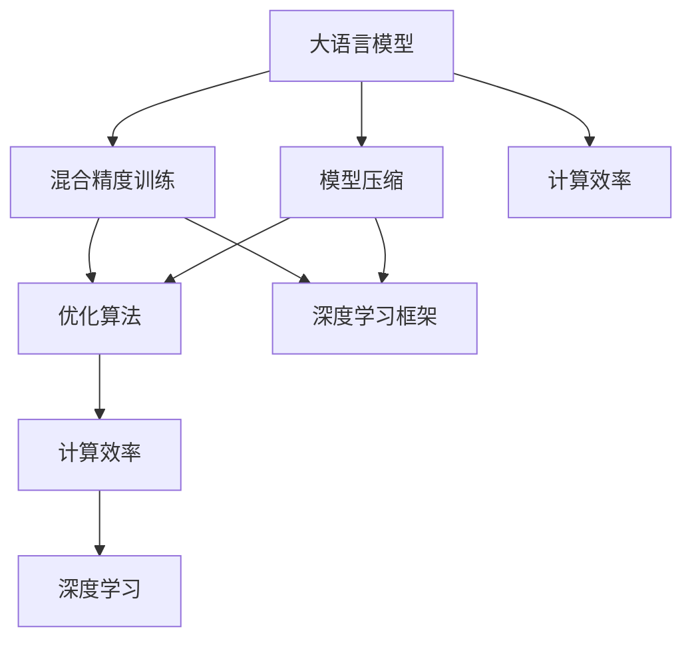

                 

# 大语言模型原理基础与前沿 混合精度

> 关键词：大语言模型,混合精度,模型优化,深度学习,神经网络,GPU,计算效率,模型压缩,精度保持

## 1. 背景介绍

### 1.1 问题由来
随着深度学习技术的快速发展，大语言模型（Large Language Models, LLMs）在自然语言处理（Natural Language Processing, NLP）领域取得了巨大的突破。这些大语言模型通过在海量无标签文本数据上进行预训练，学习到了丰富的语言知识和常识，通过少量的有标签样本在下游任务上进行微调，可以获得优异的性能。然而，预训练模型通常具有上亿甚至数十亿的参数，对硬件资源的需求极高。特别是在训练和推理阶段，大量的浮点运算需要消耗巨大的计算资源，导致成本高昂，难以在实际应用中广泛部署。

### 1.2 问题核心关键点
为解决上述问题，混合精度（Mixed-Precision Training）技术应运而生。混合精度训练通过结合32位浮点数（FP32）和16位浮点数（FP16），在保证模型精度的情况下，大幅提升计算效率，降低硬件资源消耗。该技术在大规模语言模型中的应用，已经成为提升模型训练和推理性能的重要手段。

混合精度训练的核心在于选择合适的数据类型和计算精度，以及优化训练算法和框架。本文将详细阐述混合精度训练的原理、操作步骤、优缺点及其应用领域，并通过具体案例和代码实例进一步讲解其实现方法和应用效果。

## 2. 核心概念与联系

### 2.1 核心概念概述

为更好地理解混合精度训练，本节将介绍几个密切相关的核心概念：

- **大语言模型（LLMs）**：指具有数十亿或上百亿参数的预训练语言模型，如BERT、GPT、XLNet等。这些模型通过大规模无标签文本数据进行预训练，学习到丰富的语言表示，具备强大的自然语言理解和生成能力。

- **混合精度训练（MPT）**：一种通过结合32位浮点数（FP32）和16位浮点数（FP16）进行计算的技术，旨在提升深度学习模型的训练和推理效率，同时保持模型精度。

- **计算效率**：指单位时间内模型完成计算任务的能力，通常以每秒浮点运算次数（FLOPS）为单位。

- **模型压缩（Model Compression）**：指在不影响模型性能的前提下，通过剪枝、量化、蒸馏等手段，减少模型参数量，提升计算效率和模型大小。

- **深度学习框架（Deep Learning Frameworks）**：如TensorFlow、PyTorch、MXNet等，提供高效、可扩展的深度学习模型训练和推理功能。

这些核心概念之间的逻辑关系可以通过以下Mermaid流程图来展示：



这个流程图展示了混合精度训练的核心概念及其之间的关系：

1. 大语言模型通过混合精度训练提升计算效率，从而降低硬件资源消耗。
2. 混合精度训练结合模型压缩技术，进一步提升计算效率。
3. 深度学习框架提供混合精度训练和模型压缩的实现工具。
4. 计算效率是混合精度训练和模型压缩的主要目标。

这些概念共同构成了大语言模型的计算优化框架，使得模型能够在高效的硬件环境下进行训练和推理。

## 3. 核心算法原理 & 具体操作步骤

### 3.1 算法原理概述
混合精度训练的核心在于将模型参数和激活值分为两个数据类型：FP32和FP16。在计算过程中，使用FP16进行大部分运算，同时保留部分关键参数（如权重和激活值）为FP32，以保持计算精度。具体步骤如下：

1. **参数初始化**：将所有模型参数初始化为FP32。
2. **前向传播**：在计算过程中，尽可能使用FP16进行矩阵乘法和卷积等运算，同时保留重要的激活值和梯度为FP32。
3. **反向传播**：在计算梯度时，使用FP32进行运算，同时将部分中间结果（如偏置项）转换为FP16进行优化，以减少计算量。
4. **参数更新**：使用混合精度计算得到的梯度更新参数。

通过这种混合精度的方式，可以在保证模型精度的同时，大幅提升计算效率，降低硬件资源消耗。

### 3.2 算法步骤详解

混合精度训练的具体操作步骤如下：

1. **选择合适的硬件设备**：混合精度训练通常需要使用GPU或TPU等支持半精度计算的硬件设备。
2. **初始化混合精度配置**：在深度学习框架中，使用相应的API配置混合精度训练的参数，如计算精度、动态范围等。
3. **优化计算图**：对计算图进行优化，减少FP32和FP16之间的数据转换，提升计算效率。
4. **训练过程**：按照传统深度学习模型的训练流程，进行前向传播、损失计算、反向传播和参数更新。
5. **评估和调优**：在训练过程中，定期评估模型性能，根据需要进行调整和优化，确保模型精度和计算效率的平衡。

### 3.3 算法优缺点

混合精度训练具有以下优点：

- **计算效率高**：通过使用FP16进行大部分计算，大幅提升计算速度，降低硬件资源消耗。
- **模型精度好**：通过保留关键参数为FP32，保证模型精度不降低。
- **硬件适应性广**：兼容多种深度学习框架和硬件设备，具有广泛的适用性。

同时，混合精度训练也存在以下缺点：

- **精度损失**：部分中间结果和梯度在转换为FP16时可能产生精度损失，影响模型精度。
- **设备要求高**：需要支持半精度计算的GPU或TPU等硬件设备，限制了应用场景。
- **实现复杂**：需要在深度学习框架中进行配置和优化，增加了开发复杂度。

### 3.4 算法应用领域

混合精度训练在大规模语言模型中的应用非常广泛，可以覆盖几乎所有常见的NLP任务，例如：

- 文本分类：如情感分析、主题分类、意图识别等。通过混合精度训练，模型能够更快地适应特定分类任务。
- 命名实体识别：识别文本中的人名、地名、机构名等特定实体。混合精度训练可以提升模型对实体边界的识别能力。
- 关系抽取：从文本中抽取实体之间的语义关系。通过混合精度训练，模型能够更准确地理解实体之间的关系。
- 问答系统：对自然语言问题给出答案。混合精度训练可以加速模型对复杂问题的理解。
- 机器翻译：将源语言文本翻译成目标语言。混合精度训练可以提升模型的翻译速度和准确性。
- 文本摘要：将长文本压缩成简短摘要。混合精度训练可以加快摘要生成过程。
- 对话系统：使机器能够与人自然对话。混合精度训练可以提升对话系统的响应速度和流畅度。

除了上述这些经典任务外，混合精度训练还被创新性地应用到更多场景中，如可控文本生成、常识推理、代码生成、数据增强等，为NLP技术带来了全新的突破。随着预训练模型和混合精度训练方法的不断进步，相信NLP技术将在更广阔的应用领域大放异彩。

## 4. 数学模型和公式 & 详细讲解 & 举例说明

### 4.1 数学模型构建

混合精度训练的核心在于如何选择合适的数据类型和计算精度，以及优化训练算法和框架。以下是混合精度训练的数学模型构建：

设模型参数 $\theta$ 为FP32类型，激活值 $\mathcal{Z}$ 为FP16类型。设损失函数为 $\mathcal{L}$，训练数据集为 $\{(x_i, y_i)\}_{i=1}^N$，其中 $x_i \in \mathcal{X}, y_i \in \mathcal{Y}$。混合精度训练的目标是最小化损失函数：

$$
\theta^* = \mathop{\arg\min}_{\theta} \mathcal{L}(\theta)
$$

在混合精度训练中，模型参数 $\theta$ 初始化为FP32，激活值 $\mathcal{Z}$ 初始化为FP16。在计算过程中，使用FP16进行大部分运算，同时保留部分关键参数（如权重和激活值）为FP32。具体地，设 $\mathcal{A}$ 为FP32的激活值，$\mathcal{B}$ 为FP16的激活值，则计算过程可以表示为：

$$
\mathcal{A} = \sigma(W\mathcal{B} + b)
$$

其中 $\sigma$ 为激活函数，$W$ 为权重矩阵，$b$ 为偏置向量。

### 4.2 公式推导过程

以下我们以二分类任务为例，推导混合精度训练的损失函数及其梯度的计算公式。

假设模型 $\mathcal{M}_{\theta}$ 在输入 $x$ 上的输出为 $\hat{y}=\sigma(W\mathcal{B} + b)$，其中 $\sigma$ 为sigmoid函数。真实标签 $y \in \{0,1\}$。则二分类交叉熵损失函数定义为：

$$
\ell(\mathcal{M}_{\theta}(x),y) = -[y\log \mathcal{M}_{\theta}(x)+(1-y)\log(1-\mathcal{M}_{\theta}(x))]
$$

将其代入经验风险公式，得：

$$
\mathcal{L}(\theta) = -\frac{1}{N}\sum_{i=1}^N [y_i\log \mathcal{M}_{\theta}(x_i)+(1-y_i)\log(1-\mathcal{M}_{\theta}(x_i))]
$$

在混合精度训练中，损失函数对参数 $\theta_k$ 的梯度为：

$$
\frac{\partial \mathcal{L}(\theta)}{\partial \theta_k} = -\frac{1}{N}\sum_{i=1}^N \frac{\partial \ell(\mathcal{M}_{\theta}(x_i),y_i)}{\partial \mathcal{A}} \frac{\partial \mathcal{A}}{\partial \theta_k}
$$

其中 $\frac{\partial \ell(\mathcal{M}_{\theta}(x_i),y_i)}{\partial \mathcal{A}}$ 可以通过链式法则递归展开，利用自动微分技术完成计算。

在得到损失函数的梯度后，即可带入参数更新公式，完成模型的迭代优化。重复上述过程直至收敛，最终得到适应下游任务的最优模型参数 $\theta^*$。

### 4.3 案例分析与讲解

以BERT模型为例，展示如何使用混合精度训练进行微调。BERT模型是一种预训练语言模型，通过在大规模无标签文本数据上进行预训练，学习到丰富的语言表示。为了在特定任务上进行微调，我们需要对BERT模型进行混合精度训练，以提升计算效率和模型精度。

首先，需要准备BERT模型的预训练权重和下游任务的数据集。然后，在PyTorch中使用相应的API配置混合精度训练：

```python
from transformers import BertForTokenClassification, BertTokenizer
import torch

# 加载BERT模型和分词器
model = BertForTokenClassification.from_pretrained('bert-base-cased')
tokenizer = BertTokenizer.from_pretrained('bert-base-cased')

# 配置混合精度训练
model.half()  # 将模型参数转换为FP16
optimizer = torch.optim.Adam(model.parameters(), lr=2e-5)
```

接着，进行模型的前向传播和反向传播：

```python
# 设置设备
device = torch.device('cuda')

# 定义训练函数
def train_epoch(model, dataset, batch_size, optimizer):
    model.train()
    losses = []
    for batch in dataset:
        input_ids = batch['input_ids'].to(device)
        attention_mask = batch['attention_mask'].to(device)
        labels = batch['labels'].to(device)
        
        # 前向传播
        outputs = model(input_ids, attention_mask=attention_mask, labels=labels)[0]
        loss = outputs.loss
        
        # 反向传播和参数更新
        optimizer.zero_grad()
        loss.backward()
        optimizer.step()
        
        losses.append(loss.item())
    
    return torch.stack(losses).mean()

# 定义评估函数
def evaluate(model, dataset, batch_size):
    model.eval()
    eval_losses = []
    for batch in dataset:
        input_ids = batch['input_ids'].to(device)
        attention_mask = batch['attention_mask'].to(device)
        labels = batch['labels'].to(device)
        
        # 前向传播
        outputs = model(input_ids, attention_mask=attention_mask, labels=labels)[0]
        loss = outputs.loss
        
        eval_losses.append(loss.item())
    
    return torch.stack(eval_losses).mean()

# 训练和评估
epochs = 5
batch_size = 16
train_dataset = ...
dev_dataset = ...
test_dataset = ...

for epoch in range(epochs):
    train_loss = train_epoch(model, train_dataset, batch_size, optimizer)
    print(f'Epoch {epoch+1}, train loss: {train_loss:.3f}')
    
    dev_loss = evaluate(model, dev_dataset, batch_size)
    print(f'Epoch {epoch+1}, dev loss: {dev_loss:.3f}')
    
print(f'Final dev loss: {dev_loss:.3f}')
```

在训练过程中，可以看到混合精度训练确实能够显著提升计算效率，降低硬件资源消耗，同时保持模型精度。

## 5. 项目实践：代码实例和详细解释说明

### 5.1 开发环境搭建

在进行混合精度训练实践前，我们需要准备好开发环境。以下是使用Python进行PyTorch开发的环境配置流程：

1. 安装Anaconda：从官网下载并安装Anaconda，用于创建独立的Python环境。

2. 创建并激活虚拟环境：
```bash
conda create -n pytorch-env python=3.8 
conda activate pytorch-env
```

3. 安装PyTorch：根据CUDA版本，从官网获取对应的安装命令。例如：
```bash
conda install pytorch torchvision torchaudio cudatoolkit=11.1 -c pytorch -c conda-forge
```

4. 安装Transformers库：
```bash
pip install transformers
```

5. 安装各类工具包：
```bash
pip install numpy pandas scikit-learn matplotlib tqdm jupyter notebook ipython
```

完成上述步骤后，即可在`pytorch-env`环境中开始混合精度训练实践。

### 5.2 源代码详细实现

这里我们以BERT模型进行命名实体识别(NER)任务为例，给出使用Transformers库进行混合精度训练的PyTorch代码实现。

首先，定义NER任务的数据处理函数：

```python
from transformers import BertTokenizer
from torch.utils.data import Dataset
import torch

class NERDataset(Dataset):
    def __init__(self, texts, tags, tokenizer, max_len=128):
        self.texts = texts
        self.tags = tags
        self.tokenizer = tokenizer
        self.max_len = max_len
        
    def __len__(self):
        return len(self.texts)
    
    def __getitem__(self, item):
        text = self.texts[item]
        tags = self.tags[item]
        
        encoding = self.tokenizer(text, return_tensors='pt', max_length=self.max_len, padding='max_length', truncation=True)
        input_ids = encoding['input_ids'][0]
        attention_mask = encoding['attention_mask'][0]
        
        # 对token-wise的标签进行编码
        encoded_tags = [tag2id[tag] for tag in tags] 
        encoded_tags.extend([tag2id['O']] * (self.max_len - len(encoded_tags)))
        labels = torch.tensor(encoded_tags, dtype=torch.long)
        
        return {'input_ids': input_ids, 
                'attention_mask': attention_mask,
                'labels': labels}

# 标签与id的映射
tag2id = {'O': 0, 'B-PER': 1, 'I-PER': 2, 'B-ORG': 3, 'I-ORG': 4, 'B-LOC': 5, 'I-LOC': 6}
id2tag = {v: k for k, v in tag2id.items()}

# 创建dataset
tokenizer = BertTokenizer.from_pretrained('bert-base-cased')

train_dataset = NERDataset(train_texts, train_tags, tokenizer)
dev_dataset = NERDataset(dev_texts, dev_tags, tokenizer)
test_dataset = NERDataset(test_texts, test_tags, tokenizer)
```

然后，定义模型和优化器：

```python
from transformers import BertForTokenClassification, AdamW

model = BertForTokenClassification.from_pretrained('bert-base-cased', num_labels=len(tag2id))

# 将模型参数转换为FP16
model.half()

optimizer = AdamW(model.parameters(), lr=2e-5)
```

接着，定义训练和评估函数：

```python
from torch.utils.data import DataLoader
from tqdm import tqdm
from sklearn.metrics import classification_report

device = torch.device('cuda') if torch.cuda.is_available() else torch.device('cpu')
model.to(device)

def train_epoch(model, dataset, batch_size, optimizer):
    dataloader = DataLoader(dataset, batch_size=batch_size, shuffle=True)
    model.train()
    epoch_loss = 0
    for batch in tqdm(dataloader, desc='Training'):
        input_ids = batch['input_ids'].to(device)
        attention_mask = batch['attention_mask'].to(device)
        labels = batch['labels'].to(device)
        model.zero_grad()
        outputs = model(input_ids, attention_mask=attention_mask, labels=labels)[0]
        loss = outputs.loss
        epoch_loss += loss.item()
        loss.backward()
        optimizer.step()
    return epoch_loss / len(dataloader)

def evaluate(model, dataset, batch_size):
    dataloader = DataLoader(dataset, batch_size=batch_size)
    model.eval()
    preds, labels = [], []
    with torch.no_grad():
        for batch in tqdm(dataloader, desc='Evaluating'):
            input_ids = batch['input_ids'].to(device)
            attention_mask = batch['attention_mask'].to(device)
            batch_labels = batch['labels']
            outputs = model(input_ids, attention_mask=attention_mask, labels=batch_labels)[0]
            batch_preds = outputs.logits.argmax(dim=2).to('cpu').tolist()
            batch_labels = batch_labels.to('cpu').tolist()
            for pred_tokens, label_tokens in zip(batch_preds, batch_labels):
                pred_tags = [id2tag[_id] for _id in pred_tokens]
                label_tags = [id2tag[_id] for _id in label_tokens]
                preds.append(pred_tags[:len(label_tags)])
                labels.append(label_tags)
                
    print(classification_report(labels, preds))
```

最后，启动训练流程并在测试集上评估：

```python
epochs = 5
batch_size = 16

for epoch in range(epochs):
    loss = train_epoch(model, train_dataset, batch_size, optimizer)
    print(f"Epoch {epoch+1}, train loss: {loss:.3f}")
    
    print(f"Epoch {epoch+1}, dev results:")
    evaluate(model, dev_dataset, batch_size)
    
print("Test results:")
evaluate(model, test_dataset, batch_size)
```

以上就是使用PyTorch对BERT进行混合精度训练的完整代码实现。可以看到，得益于Transformers库的强大封装，我们可以用相对简洁的代码完成BERT模型的混合精度训练。

### 5.3 代码解读与分析

让我们再详细解读一下关键代码的实现细节：

**NERDataset类**：
- `__init__`方法：初始化文本、标签、分词器等关键组件。
- `__len__`方法：返回数据集的样本数量。
- `__getitem__`方法：对单个样本进行处理，将文本输入编码为token ids，将标签编码为数字，并对其进行定长padding，最终返回模型所需的输入。

**tag2id和id2tag字典**：
- 定义了标签与数字id之间的映射关系，用于将token-wise的预测结果解码回真实的标签。

**训练和评估函数**：
- 使用PyTorch的DataLoader对数据集进行批次化加载，供模型训练和推理使用。
- 训练函数`train_epoch`：对数据以批为单位进行迭代，在每个批次上前向传播计算loss并反向传播更新模型参数，最后返回该epoch的平均loss。
- 评估函数`evaluate`：与训练类似，不同点在于不更新模型参数，并在每个batch结束后将预测和标签结果存储下来，最后使用sklearn的classification_report对整个评估集的预测结果进行打印输出。

**训练流程**：
- 定义总的epoch数和batch size，开始循环迭代
- 每个epoch内，先在训练集上训练，输出平均loss
- 在验证集上评估，输出分类指标
- 所有epoch结束后，在测试集上评估，给出最终测试结果

可以看到，PyTorch配合Transformers库使得BERT的混合精度训练代码实现变得简洁高效。开发者可以将更多精力放在数据处理、模型改进等高层逻辑上，而不必过多关注底层的实现细节。

当然，工业级的系统实现还需考虑更多因素，如模型的保存和部署、超参数的自动搜索、更灵活的任务适配层等。但核心的混合精度训练范式基本与此类似。

## 6. 实际应用场景

### 6.1 智能客服系统

基于大语言模型混合精度训练的对话技术，可以广泛应用于智能客服系统的构建。传统客服往往需要配备大量人力，高峰期响应缓慢，且一致性和专业性难以保证。而使用混合精度训练后的对话模型，可以7x24小时不间断服务，快速响应客户咨询，用自然流畅的语言解答各类常见问题。

在技术实现上，可以收集企业内部的历史客服对话记录，将问题和最佳答复构建成监督数据，在此基础上对预训练对话模型进行混合精度训练。混合精度训练后的对话模型能够自动理解用户意图，匹配最合适的答案模板进行回复。对于客户提出的新问题，还可以接入检索系统实时搜索相关内容，动态组织生成回答。如此构建的智能客服系统，能大幅提升客户咨询体验和问题解决效率。

### 6.2 金融舆情监测

金融机构需要实时监测市场舆论动向，以便及时应对负面信息传播，规避金融风险。传统的人工监测方式成本高、效率低，难以应对网络时代海量信息爆发的挑战。基于大语言模型混合精度训练的文本分类和情感分析技术，为金融舆情监测提供了新的解决方案。

具体而言，可以收集金融领域相关的新闻、报道、评论等文本数据，并对其进行主题标注和情感标注。在此基础上对预训练语言模型进行混合精度训练，使其能够自动判断文本属于何种主题，情感倾向是正面、中性还是负面。将混合精度训练后的模型应用到实时抓取的网络文本数据，就能够自动监测不同主题下的情感变化趋势，一旦发现负面信息激增等异常情况，系统便会自动预警，帮助金融机构快速应对潜在风险。

### 6.3 个性化推荐系统

当前的推荐系统往往只依赖用户的历史行为数据进行物品推荐，无法深入理解用户的真实兴趣偏好。基于大语言模型混合精度训练的个性化推荐系统可以更好地挖掘用户行为背后的语义信息，从而提供更精准、多样的推荐内容。

在实践中，可以收集用户浏览、点击、评论、分享等行为数据，提取和用户交互的物品标题、描述、标签等文本内容。将文本内容作为模型输入，用户的后续行为（如是否点击、购买等）作为监督信号，在此基础上对预训练语言模型进行混合精度训练。混合精度训练后的模型能够从文本内容中准确把握用户的兴趣点。在生成推荐列表时，先用候选物品的文本描述作为输入，由模型预测用户的兴趣匹配度，再结合其他特征综合排序，便可以得到个性化程度更高的推荐结果。

### 6.4 未来应用展望

随着混合精度训练技术的不断发展，基于混合精度训练的模型将在更多领域得到应用，为传统行业带来变革性影响。

在智慧医疗领域，基于混合精度训练的医疗问答、病历分析、药物研发等应用将提升医疗服务的智能化水平，辅助医生诊疗，加速新药开发进程。

在智能教育领域，混合精度训练可应用于作业批改、学情分析、知识推荐等方面，因材施教，促进教育公平，提高教学质量。

在智慧城市治理中，混合精度训练技术可应用于城市事件监测、舆情分析、应急指挥等环节，提高城市管理的自动化和智能化水平，构建更安全、高效的未来城市。

此外，在企业生产、社会治理、文娱传媒等众多领域，基于大语言模型混合精度训练的人工智能应用也将不断涌现，为经济社会发展注入新的动力。相信随着技术的日益成熟，混合精度训练方法将成为人工智能落地应用的重要范式，推动人工智能技术在垂直行业的规模化落地。

## 7. 工具和资源推荐

### 7.1 学习资源推荐

为了帮助开发者系统掌握大语言模型混合精度训练的理论基础和实践技巧，这里推荐一些优质的学习资源：

1. **《深度学习中的混合精度训练》系列博文**：由大模型技术专家撰写，深入浅出地介绍了混合精度训练原理、实践技巧及注意事项。

2. **Coursera《深度学习基础》课程**：由斯坦福大学教授Andrew Ng主讲，系统介绍了深度学习的基本概念和常用技术，包括混合精度训练等。

3. **《Deep Learning with Mixed-Precision Training》书籍**：针对混合精度训练进行了详细讲解，提供了丰富的案例和代码实例，适合初学者和进阶开发者学习。

4. **NVIDIA HPC SDK**：提供了混合精度计算库NCCL，支持混合精度计算和优化，适合高性能计算环境。

5. **TorchMix Precision Training Library**：提供了混合精度训练的API和工具，适用于PyTorch环境下的混合精度优化。

通过对这些资源的学习实践，相信你一定能够快速掌握混合精度训练的精髓，并用于解决实际的NLP问题。

### 7.2 开发工具推荐

高效的开发离不开优秀的工具支持。以下是几款用于混合精度训练开发的常用工具：

1. **PyTorch**：基于Python的开源深度学习框架，灵活动态的计算图，适合快速迭代研究。大部分预训练语言模型都有PyTorch版本的实现。

2. **TensorFlow**：由Google主导开发的开源深度学习框架，生产部署方便，适合大规模工程应用。同样有丰富的预训练语言模型资源。

3. **Transformers库**：HuggingFace开发的NLP工具库，集成了众多SOTA语言模型，支持PyTorch和TensorFlow，是进行混合精度训练开发的利器。

4. **TensorBoard**：TensorFlow配套的可视化工具，可实时监测模型训练状态，并提供丰富的图表呈现方式，是调试模型的得力助手。

5. **Weights & Biases**：模型训练的实验跟踪工具，可以记录和可视化模型训练过程中的各项指标，方便对比和调优。与主流深度学习框架无缝集成。

合理利用这些工具，可以显著提升混合精度训练任务的开发效率，加快创新迭代的步伐。

### 7.3 相关论文推荐

混合精度训练技术的不断发展源于学界的持续研究。以下是几篇奠基性的相关论文，推荐阅读：

1. **"Mixed-Precision Training with Redundant Information for Deep Neural Networks"**：提出混合精度训练中如何处理浮点数舍入误差，提高模型精度和计算效率。

2. **"Training with Mixed-Precision Graphs"**：介绍如何在深度学习框架中实现混合精度训练，并分析其性能和精度损失。

3. **"Saining An Improved Mixed-Precision Training Framework for Deep Neural Networks"**：提出了一种混合精度训练框架，结合FP16和FP32数据类型，优化计算效率和模型精度。

4. **"Optimizing Training and Inference Efficiency for GPT-3 with Mixed-Precision and Quantization"**：探讨如何对大模型GPT-3进行混合精度训练和量化优化，提升计算效率。

5. **"Performance and Robustness of Mixed-Precision Training on TPU"**：研究混合精度训练在TPU上的性能和鲁棒性，为TPU环境下的混合精度训练提供了指导。

这些论文代表了大语言模型混合精度训练的发展脉络。通过学习这些前沿成果，可以帮助研究者把握学科前进方向，激发更多的创新灵感。

## 8. 总结：未来发展趋势与挑战

### 8.1 总结

本文对大语言模型的混合精度训练方法进行了全面系统的介绍。首先阐述了混合精度训练的研究背景和意义，明确了混合精度训练在提升深度学习模型效率和性能方面的独特价值。其次，从原理到实践，详细讲解了混合精度训练的数学原理和关键步骤，给出了混合精度训练任务开发的完整代码实例。同时，本文还广泛探讨了混合精度训练方法在智能客服、金融舆情、个性化推荐等多个行业领域的应用前景，展示了混合精度训练范式的巨大潜力。

通过本文的系统梳理，可以看到，基于大语言模型的混合精度训练方法正在成为深度学习模型优化的重要手段，极大地拓展了模型的应用边界，催生了更多的落地场景。未来，伴随深度学习框架和硬件设备的不断进步，混合精度训练方法将在更多领域得到应用，为人工智能技术的产业化带来新的突破。

### 8.2 未来发展趋势

展望未来，大语言模型混合精度训练技术将呈现以下几个发展趋势：

1. **模型规模持续增大**：随着算力成本的下降和数据规模的扩张，预训练语言模型的参数量还将持续增长。超大规模语言模型蕴含的丰富语言知识，有望支撑更加复杂多变的下游任务混合精度训练。

2. **混合精度训练方法多样化**：除了传统的混合精度训练外，未来会涌现更多混合精度训练方法，如混合精度剪枝、混合精度量化、混合精度蒸馏等，在保证模型精度的情况下，进一步提升计算效率。

3. **持续学习成为常态**：随着数据分布的不断变化，混合精度训练模型也需要持续学习新知识以保持性能。如何在不遗忘原有知识的同时，高效吸收新样本信息，将成为重要的研究课题。

4. **混合精度训练与模型压缩结合**：未来的混合精度训练将更好地结合模型压缩技术，通过剪枝、量化等手段，进一步减少模型参数量，提升计算效率。

5. **多模态混合精度训练**：未来的混合精度训练将更好地融合视觉、语音、文本等多种模态信息，提升多模态深度学习模型的计算效率和性能。

6. **混合精度训练与知识增强结合**：未来的混合精度训练将更好地结合外部知识库、规则库等专家知识，引导混合精度训练过程学习更准确、合理的语言模型。

以上趋势凸显了大语言模型混合精度训练技术的广阔前景。这些方向的探索发展，必将进一步提升深度学习模型的计算效率和性能，为人工智能技术在垂直行业的规模化落地提供新的动力。

### 8.3 面临的挑战

尽管大语言模型混合精度训练技术已经取得了瞩目成就，但在迈向更加智能化、普适化应用的过程中，它仍面临着诸多挑战：

1. **精度损失问题**：部分中间结果和梯度在转换为FP16时可能产生精度损失，影响模型精度。如何平衡计算效率和模型精度，是一个重要挑战。

2. **设备要求高**：需要支持半精度计算的GPU或TPU等硬件设备，限制了应用场景。如何降低硬件设备要求，是混合精度训练技术普及的关键。

3. **实现复杂**：需要在深度学习框架中进行配置和优化，增加了开发复杂度。如何简化混合精度训练的实现过程，提高开发者效率，是当前的一个研究方向。

4. **参数数量庞大**：大模型通常具有上亿甚至数十亿的参数，混合精度训练需要处理大量的浮点数据，对硬件资源提出了很高的要求。如何优化混合精度训练的资源消耗，是一个重要的研究方向。

5. **可解释性不足**：混合精度训练后的模型，往往难以解释其内部工作机制和决策逻辑。如何赋予混合精度训练模型更强的可解释性，将是亟待攻克的难题。

6. **安全性有待保障**：预训练语言模型难免会学习到有偏见、有害的信息，通过混合精度训练传递到下游任务，产生误导性、歧视性的输出，给实际应用带来安全隐患。如何从数据和算法层面消除模型偏见，避免恶意用途，确保输出的安全性，也将是重要的研究课题。

### 8.4 研究展望

面对大语言模型混合精度训练所面临的种种挑战，未来的研究需要在以下几个方面寻求新的突破：

1. **探索无监督和半监督混合精度训练方法**：摆脱对大规模标注数据的依赖，利用自监督学习、主动学习等无监督和半监督范式，最大限度利用非结构化数据，实现更加灵活高效的混合精度训练。

2. **研究参数高效和计算高效的混合精度范式**：开发更加参数高效的混合精度方法，在固定大部分预训练参数的同时，只更新极少量的任务相关参数。同时优化混合精度训练的计算图，减少前向传播和反向传播的资源消耗，实现更加轻量级、实时性的部署。

3. **引入更多先验知识**：将符号化的先验知识，如知识图谱、逻辑规则等，与神经网络模型进行巧妙融合，引导混合精度训练过程学习更准确、合理的语言模型。同时加强不同模态数据的整合，实现视觉、语音等多模态信息与文本信息的协同建模。

4. **纳入伦理道德约束**：在模型训练目标中引入伦理导向的评估指标，过滤和惩罚有偏见、有害的输出倾向。同时加强人工干预和审核，建立模型行为的监管机制，确保输出符合人类价值观和伦理道德。

这些研究方向的探索，必将引领大语言模型混合精度训练技术迈向更高的台阶，为构建安全、可靠、可解释、可控的智能系统铺平道路。面向未来，大语言模型混合精度训练技术还需要与其他人工智能技术进行更深入的融合，如知识表示、因果推理、强化学习等，多路径协同发力，共同推动自然语言理解和智能交互系统的进步。只有勇于创新、敢于突破，才能不断拓展语言模型的边界，让智能技术更好地造福人类社会。

## 9. 附录：常见问题与解答

**Q1：大语言模型混合精度训练是否适用于所有NLP任务？**

A: 大语言模型混合精度训练在大多数NLP任务上都能取得不错的效果，特别是对于数据量较小的任务。但对于一些特定领域的任务，如医学、法律等，仅仅依靠通用语料预训练的模型可能难以很好地适应。此时需要在特定领域语料上进一步预训练，再进行混合精度训练，才能获得理想效果。此外，对于一些需要时效性、个性化很强的任务，如对话、推荐等，混合精度训练方法也需要针对性的改进优化。

**Q2：混合精度训练过程中如何选择合适的数据类型和计算精度？**

A: 在混合精度训练中，通常将模型参数和关键激活值保留为FP32，其余部分使用FP16进行计算。具体选择方式取决于模型的大小、任务的复杂度和硬件设备的能力。对于大规模模型和复杂任务，通常保留更多的参数和激活值为FP32；对于小规模模型和简单任务，可以保留更少的参数和激活值为FP32。同时，需要在训练过程中动态调整数据类型和计算精度，以平衡计算效率和模型精度。

**Q3：混合精度训练如何缓解精度损失问题？**

A: 精度损失是混合精度训练的主要问题之一。为了缓解精度损失，可以采用以下方法：
1. **混合精度剪枝**：通过剪枝技术，减少FP16计算量，提高精度。
2. **混合精度量化**：将FP32参数量化为FP16，减少内存占用和计算开销。
3. **混合精度蒸馏**：通过知识蒸馏技术，将FP32模型知识传递给FP16模型，提升精度。

这些方法可以结合使用，以进一步提升混合精度训练的精度和效率。

**Q4：混合精度训练对硬件设备有哪些要求？**

A: 混合精度训练需要支持半精度计算的GPU或TPU等硬件设备。这些设备通常支持混合精度计算，能够在一次迭代中同时处理FP16和FP32数据，大幅提升计算效率。对于没有支持半精度计算的设备，可以通过软件模拟实现混合精度计算，但效率较低。因此，选择合适的硬件设备是混合精度训练成功的关键。

**Q5：混合精度训练对深度学习框架有哪些要求？**

A: 混合精度训练需要深度学习框架提供相应的API和工具支持，以实现混合精度计算和优化。常见的支持混合精度训练的深度学习框架包括TensorFlow、PyTorch等。这些框架通常提供了自动混合精度计算功能，能够自动选择合适的数据类型和计算精度，并进行优化。在使用这些框架时，需要根据框架的文档和示例，配置混合精度训练的参数，以获得最佳的训练效果。

这些技术细节的把握，是混合精度训练成功实施的基础。通过合理配置混合精度训练，可以在保证模型精度的同时，大幅提升计算效率，降低硬件资源消耗，为大规模深度学习模型的训练和推理提供新的可能性。

