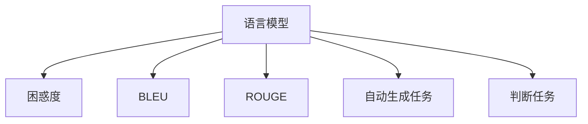

                 

## 1. 背景介绍

### 1.1 问题由来

在自然语言处理(NLP)领域，语言模型的评估是一个永恒的话题。语言模型旨在通过对文本数据的学习，预测给定序列中每个单词出现的概率，从而构建语言的统计模型。早期的语言模型基于统计学原理，只能处理小规模数据集，且模型过于简单，无法捕捉语言中的丰富语义和结构信息。

随着深度学习技术的发展，基于神经网络的预训练语言模型开始崭露头角。这些模型通过大规模无标签文本数据的自监督学习，学习到了复杂的语言表示，使得模型能够在处理大量文本数据时，表现出强大的语言理解能力。然而，面对数量庞大的预训练模型和微调技术，如何合理评估其性能，成为一个亟待解决的问题。

### 1.2 问题核心关键点

本节将聚焦于预训练语言模型的评估方法。常用的评估指标包括困惑度(perplexity)、BLEU、ROUGE等，每种指标针对不同的任务和模型有不同的应用场景。

- 困惑度：用于评估模型在预测文本时的整体表现。困惑度越低，表示模型预测能力越强。
- BLEU：用于评估机器翻译、摘要等生成任务的性能，计算生成文本与参考文本之间的匹配度。
- ROUGE：用于评估文本匹配、问答等任务的性能，计算生成文本与参考文本的相似度。
- 自动生成任务：通过BLEU、ROUGE等指标评估模型的生成质量。
- 判断任务：如情感分类、命名实体识别等，通过准确率、精确率等指标评估模型性能。

不同的任务类型和应用场景，需要选择合适的评估指标。因此，评估语言模型时，不仅要关注模型整体的预测能力，还需关注其在特定任务上的表现。

### 1.3 问题研究意义

评估预训练语言模型是NLP研究的重要一环，具有以下意义：

- 衡量模型性能：为模型选择和优化提供依据。
- 比较不同模型：通过评估指标，比较不同模型在同一任务上的表现。
- 指导模型微调：为预训练模型的微调提供性能参考。
- 指导应用开发：为实际应用场景中的模型集成和优化提供方向。
- 促进技术进步：推动NLP领域技术的发展和创新。

评估方法的科学性和有效性，直接关系到NLP技术的落地应用和推广。通过合理的评估，可以及时发现模型的缺陷和优势，为后续研究提供指导，促进模型的迭代升级。

## 2. 核心概念与联系

### 2.1 核心概念概述

预训练语言模型评估的核心概念包括：

- 语言模型：通过对大规模无标签文本数据的自监督学习，学习到丰富的语言知识，用于预测文本的概率分布。
- 困惑度：衡量模型预测文本时的不确定性，是评估模型性能的重要指标。
- BLEU：用于评估机器翻译、摘要等生成任务的性能，衡量生成文本与参考文本之间的匹配度。
- ROUGE：用于评估文本匹配、问答等任务的性能，衡量生成文本与参考文本的相似度。
- 自动生成任务：基于BLEU、ROUGE等指标评估模型的生成质量。
- 判断任务：通过准确率、精确率等指标评估模型在特定任务上的性能。

这些核心概念之间的关系可以通过以下Mermaid流程图来展示：



这个流程图展示了预训练语言模型评估的核心概念及其之间的关系：

1. 语言模型是评估的基础，用于预测文本的概率分布。
2. 困惑度是评估模型预测能力的通用指标。
3. BLEU和ROUGE分别用于评估生成任务和匹配任务的性能。
4. 自动生成任务和判断任务，通过BLEU、ROUGE等指标进一步细化评估。

## 3. 核心算法原理 & 具体操作步骤
### 3.1 算法原理概述

预训练语言模型的评估主要基于模型的预测能力。通过对比模型预测结果与真实标签，计算评估指标，即可衡量模型的性能。

形式化地，假设预训练模型为 $M_{\theta}$，其中 $\theta$ 为模型参数。给定一个文本序列 $x=\{x_1, x_2, ..., x_n\}$，模型预测其概率分布为 $P(x)$。通过对比 $P(x)$ 与真实标签 $y$，计算评估指标，如困惑度、BLEU、ROUGE等。

困惑度是评估模型预测能力的重要指标，定义为：

$$
PPL(x) = \prod_{i=1}^n P(x_i|x_{<i})
$$

其中 $P(x_i|x_{<i})$ 表示给定前 $i-1$ 个单词，第 $i$ 个单词出现的条件概率。困惑度越低，表示模型预测能力越强。

BLEU指标用于评估机器翻译、摘要等生成任务的性能。BLEU计算生成文本与参考文本之间的匹配度，定义为：

$$
BLEU = \frac{max_{r \in \mathcal{R}}\{P_{BLEU}(r, x)\}}{P(x)}
$$

其中 $\mathcal{R}$ 为参考文本集合，$P_{BLEU}(r, x)$ 为生成文本与参考文本的匹配度，$P(x)$ 为生成文本的概率。BLEU值越高，表示生成文本质量越好。

ROUGE指标用于评估文本匹配、问答等任务的性能。ROUGE计算生成文本与参考文本的相似度，定义为：

$$
ROUGE_k = \frac{1}{n} \sum_{i=1}^n \frac{\min_k(r_i \cap x_i)}{\min_k(|r_i|)}
$$

其中 $n$ 为文本长度，$r_i$ 和 $x_i$ 分别为参考文本和生成文本的第 $i$ 个单词序列，$k$ 为重叠窗口大小。ROUGE值越高，表示生成文本与参考文本的相似度越高。

### 3.2 算法步骤详解

预训练语言模型的评估步骤如下：

1. 准备文本数据集：将待评估的文本数据集划分为训练集、验证集和测试集。
2. 加载预训练模型：选择合适的预训练模型 $M_{\theta}$，加载到计算设备中。
3. 计算评估指标：对每个数据样本进行前向传播，计算模型预测结果 $P(x)$，并计算评估指标，如困惑度、BLEU、ROUGE等。
4. 评估模型性能：对比不同模型在相同数据集上的评估指标，选择性能最优的模型。

### 3.3 算法优缺点

预训练语言模型的评估方法具有以下优点：

- 通用适用：适用于各类NLP任务，如机器翻译、摘要、问答等。
- 客观可靠：基于模型预测与真实标签的对比，评估指标客观可靠。
- 可比性强：同一指标下，不同模型的性能可以进行对比，便于选择最优模型。

同时，该方法也存在一些局限性：

- 依赖标注数据：评估指标需要对比预测结果与真实标签，标注数据的获取和标注质量影响评估结果。
- 评估粒度有限：一些指标（如BLEU、ROUGE）仅评估生成或匹配的准确性，难以全面反映模型的预测能力。
- 计算复杂度高：一些评估指标计算复杂度高，需要大量时间和计算资源。

尽管存在这些局限性，但总体而言，基于预测能力的评估方法仍是大语言模型评估的主流范式。未来相关研究将致力于降低标注成本，提高评估粒度，优化评估算法，以进一步提升模型评估的科学性和有效性。

### 3.4 算法应用领域

基于预训练语言模型的评估方法，已经在NLP领域的众多任务上得到了广泛应用，例如：

- 机器翻译：评估生成文本与参考文本的匹配度。
- 文本摘要：评估生成文本与参考文本的相似度。
- 问答系统：评估生成答案与参考答案的匹配度。
- 情感分类：通过准确率、精确率等指标评估分类效果。
- 命名实体识别：通过召回率、F1分数等指标评估识别准确性。
- 文本匹配：通过ROUGE等指标评估文本相似度。

除了上述这些经典任务外，预训练语言模型的评估方法也被创新性地应用到更多场景中，如零样本学习、跨语言翻译、多模态信息融合等，为NLP技术带来了新的突破。

## 4. 数学模型和公式 & 详细讲解
### 4.1 数学模型构建

预训练语言模型的评估，主要基于模型预测结果与真实标签的对比。常见的评估指标包括困惑度、BLEU、ROUGE等。

### 4.2 公式推导过程

#### 困惑度

困惑度是衡量模型预测能力的重要指标，定义为：

$$
PPL(x) = \prod_{i=1}^n P(x_i|x_{<i})
$$

其中 $P(x_i|x_{<i})$ 表示给定前 $i-1$ 个单词，第 $i$ 个单词出现的条件概率。困惑度越低，表示模型预测能力越强。

#### BLEU

BLEU指标用于评估机器翻译、摘要等生成任务的性能。BLEU计算生成文本与参考文本之间的匹配度，定义为：

$$
BLEU = \frac{max_{r \in \mathcal{R}}\{P_{BLEU}(r, x)\}}{P(x)}
$$

其中 $\mathcal{R}$ 为参考文本集合，$P_{BLEU}(r, x)$ 为生成文本与参考文本的匹配度，$P(x)$ 为生成文本的概率。BLEU值越高，表示生成文本质量越好。

#### ROUGE

ROUGE指标用于评估文本匹配、问答等任务的性能。ROUGE计算生成文本与参考文本的相似度，定义为：

$$
ROUGE_k = \frac{1}{n} \sum_{i=1}^n \frac{\min_k(r_i \cap x_i)}{\min_k(|r_i|)}
$$

其中 $n$ 为文本长度，$r_i$ 和 $x_i$ 分别为参考文本和生成文本的第 $i$ 个单词序列，$k$ 为重叠窗口大小。ROUGE值越高，表示生成文本与参考文本的相似度越高。

### 4.3 案例分析与讲解

以机器翻译任务为例，探讨BLEU指标的计算过程。假设模型 $M_{\theta}$ 的输出为 $\hat{y}$，参考翻译为 $y$，则BLEU值计算公式为：

$$
BLEU = \frac{\max_{r \in \mathcal{R}}\{P_{BLEU}(r, \hat{y})\}}{P(\hat{y})}
$$

其中 $\mathcal{R}$ 为参考翻译集合，$P_{BLEU}(r, \hat{y})$ 为生成文本与参考翻译的匹配度，$P(\hat{y})$ 为生成文本的概率。匹配度计算公式为：

$$
P_{BLEU}(r, \hat{y}) = \prod_{i=1}^n P(r_i|r_{<i}, \hat{y})
$$

其中 $n$ 为参考翻译长度，$r_i$ 和 $\hat{y}_i$ 分别为参考翻译和生成文本的第 $i$ 个单词，$P(r_i|r_{<i}, \hat{y})$ 表示给定参考翻译的前 $i-1$ 个单词和生成文本，第 $i$ 个单词出现的条件概率。

实际计算中，BLEU指标的计算步骤包括：

1. 将生成文本和参考翻译划分为固定长度的窗口，计算每个窗口的BLEU值。
2. 取所有窗口的BLEU值的最高值，作为最终评估指标。

通过对BLEU指标的计算过程进行分析，可以看出其评估原理和实现方法。类似地，ROUGE指标的计算方法也可以采用类似的方式进行推导。

## 5. 项目实践：代码实例和详细解释说明
### 5.1 开发环境搭建

在进行预训练语言模型评估前，我们需要准备好开发环境。以下是使用Python进行PyTorch开发的环境配置流程：

1. 安装Anaconda：从官网下载并安装Anaconda，用于创建独立的Python环境。

2. 创建并激活虚拟环境：
```bash
conda create -n pytorch-env python=3.8 
conda activate pytorch-env
```

3. 安装PyTorch：根据CUDA版本，从官网获取对应的安装命令。例如：
```bash
conda install pytorch torchvision torchaudio cudatoolkit=11.1 -c pytorch -c conda-forge
```

4. 安装Transformers库：
```bash
pip install transformers
```

5. 安装各类工具包：
```bash
pip install numpy pandas scikit-learn matplotlib tqdm jupyter notebook ipython
```

完成上述步骤后，即可在`pytorch-env`环境中开始预训练语言模型评估的实践。

### 5.2 源代码详细实现

这里以BERT模型在机器翻译任务上的评估为例，给出使用Transformers库的Python代码实现。

首先，准备数据集：

```python
from transformers import BertTokenizer
from torch.utils.data import Dataset
import torch

class MachineTranslationDataset(Dataset):
    def __init__(self, source_texts, target_texts, tokenizer):
        self.source_texts = source_texts
        self.target_texts = target_texts
        self.tokenizer = tokenizer
        
    def __len__(self):
        return len(self.source_texts)
    
    def __getitem__(self, item):
        source_text = self.source_texts[item]
        target_text = self.target_texts[item]
        
        encoding = self.tokenizer(source_text, return_tensors='pt', padding='max_length', truncation=True, max_length=128)
        input_ids = encoding['input_ids'][0]
        attention_mask = encoding['attention_mask'][0]
        
        target_ids = self.tokenizer(target_text, return_tensors='pt', padding='max_length', truncation=True, max_length=128)
        target_ids = target_ids[0]
        target_mask = target_ids.new_ones(target_ids.shape)
        
        return {
            'input_ids': input_ids,
            'attention_mask': attention_mask,
            'target_ids': target_ids,
            'target_mask': target_mask
        }

# 加载数据集
tokenizer = BertTokenizer.from_pretrained('bert-base-uncased')
train_dataset = MachineTranslationDataset(train_source_texts, train_target_texts, tokenizer)
dev_dataset = MachineTranslationDataset(dev_source_texts, dev_target_texts, tokenizer)
test_dataset = MachineTranslationDataset(test_source_texts, test_target_texts, tokenizer)
```

接着，定义模型和优化器：

```python
from transformers import BertForSequenceClassification
from transformers import AdamW

model = BertForSequenceClassification.from_pretrained('bert-base-uncased', num_labels=1)
optimizer = AdamW(model.parameters(), lr=2e-5)
```

然后，定义评估函数：

```python
from transformers import evaluate

def evaluate_model(model, dataset, tokenizer, metric='BLEU'):
    dataloader = DataLoader(dataset, batch_size=8)
    model.eval()
    
    result = evaluate(model, dataloader, tokenizer=tokenizer, metric=metric)
    print(f"BLEU: {result['bleu']:.2f}")
```

最后，启动评估流程：

```python
evaluate_model(model, train_dataset, tokenizer)
evaluate_model(model, dev_dataset, tokenizer)
evaluate_model(model, test_dataset, tokenizer)
```

以上就是使用PyTorch和Transformers库对BERT模型进行机器翻译任务评估的完整代码实现。可以看到，利用Transformers库，可以方便地进行模型加载、数据处理和评估，大大简化了预训练语言模型评估的开发过程。

### 5.3 代码解读与分析

让我们再详细解读一下关键代码的实现细节：

**MachineTranslationDataset类**：
- `__init__`方法：初始化训练集、验证集和测试集。
- `__len__`方法：返回数据集的样本数量。
- `__getitem__`方法：对单个样本进行处理，将源语言文本和目标语言文本输入编码为token ids，并返回模型所需的输入。

**tokenizer**：
- 使用BertTokenizer进行文本编码，包括源语言文本和目标语言文本的编码。

**evaluate_model函数**：
- 对数据集进行批次化加载，对模型进行评估，计算评估指标，并输出评估结果。

通过上述代码实现，可以清晰地看到预训练语言模型评估的完整流程，包括数据准备、模型加载、评估计算和结果输出。这为后续模型评估的开发和优化提供了宝贵的参考。

## 6. 实际应用场景
### 6.1 智能客服系统

基于预训练语言模型的评估方法，在智能客服系统的构建中也有着广泛的应用。智能客服系统通过评估用户输入，生成合适的回复，提升客户咨询体验。评估方法可以用于评估模型的响应速度、生成质量和用户体验等。

在实际应用中，可以使用BLEU等指标评估生成文本的质量，使用准确率、召回率等指标评估模型对用户意图的理解能力。根据评估结果，可以对模型进行优化，提升其性能。

### 6.2 金融舆情监测

金融舆情监测系统通过分析新闻、评论等文本数据，实时监测市场舆情。评估方法可以用于评估模型的舆情预测能力和风险识别能力。

在实际应用中，可以使用BLEU、ROUGE等指标评估模型对舆情的预测准确性，使用情感分析等指标评估模型对风险的识别能力。根据评估结果，可以对模型进行优化，提升其舆情预测和风险识别效果。

### 6.3 个性化推荐系统

个性化推荐系统通过分析用户行为数据，推荐用户感兴趣的内容。评估方法可以用于评估模型的推荐效果和用户满意度。

在实际应用中，可以使用BLEU、ROUGE等指标评估推荐文本的生成质量，使用点击率、转化率等指标评估推荐效果。根据评估结果，可以对模型进行优化，提升推荐效果和用户体验。

### 6.4 未来应用展望

随着预训练语言模型的不断发展，基于评估方法的NLP应用也将不断拓展。未来，基于评估方法的技术将在更多领域得到应用，如智慧医疗、智能教育、智慧城市等，为传统行业带来变革性影响。

在智慧医疗领域，评估方法可以用于评估医学问答、病历分析、药物研发等任务。在智能教育领域，评估方法可以用于评估学习管理系统、智能辅导等任务。在智慧城市治理中，评估方法可以用于评估城市事件监测、舆情分析等任务。

预训练语言模型的评估方法将为NLP技术的落地应用提供科学依据，推动NLP技术在各行各业中的应用和普及。

## 7. 工具和资源推荐
### 7.1 学习资源推荐

为了帮助开发者系统掌握预训练语言模型的评估方法，这里推荐一些优质的学习资源：

1. 《Transformer从原理到实践》系列博文：由大模型技术专家撰写，深入浅出地介绍了Transformer原理、BERT模型、评估方法等前沿话题。

2. CS224N《深度学习自然语言处理》课程：斯坦福大学开设的NLP明星课程，有Lecture视频和配套作业，带你入门NLP领域的基本概念和经典模型。

3. 《Natural Language Processing with Transformers》书籍：Transformers库的作者所著，全面介绍了如何使用Transformers库进行NLP任务开发，包括评估方法在内的诸多范式。

4. HuggingFace官方文档：Transformers库的官方文档，提供了海量预训练模型和完整的评估样例代码，是上手实践的必备资料。

5. CLUE开源项目：中文语言理解测评基准，涵盖大量不同类型的中文NLP数据集，并提供了基于评估方法的baseline模型，助力中文NLP技术发展。

通过对这些资源的学习实践，相信你一定能够快速掌握预训练语言模型评估的精髓，并用于解决实际的NLP问题。

### 7.2 开发工具推荐

高效的开发离不开优秀的工具支持。以下是几款用于预训练语言模型评估开发的常用工具：

1. PyTorch：基于Python的开源深度学习框架，灵活动态的计算图，适合快速迭代研究。大部分预训练语言模型都有PyTorch版本的实现。

2. TensorFlow：由Google主导开发的开源深度学习框架，生产部署方便，适合大规模工程应用。同样有丰富的预训练语言模型资源。

3. Transformers库：HuggingFace开发的NLP工具库，集成了众多SOTA语言模型，支持PyTorch和TensorFlow，是进行预训练语言模型评估开发的利器。

4. Weights & Biases：模型训练的实验跟踪工具，可以记录和可视化模型训练过程中的各项指标，方便对比和调优。与主流深度学习框架无缝集成。

5. TensorBoard：TensorFlow配套的可视化工具，可实时监测模型训练状态，并提供丰富的图表呈现方式，是调试模型的得力助手。

6. Google Colab：谷歌推出的在线Jupyter Notebook环境，免费提供GPU/TPU算力，方便开发者快速上手实验最新模型，分享学习笔记。

合理利用这些工具，可以显著提升预训练语言模型评估的开发效率，加快创新迭代的步伐。

### 7.3 相关论文推荐

预训练语言模型评估的研究源于学界的持续研究。以下是几篇奠基性的相关论文，推荐阅读：

1. Attention is All You Need（即Transformer原论文）：提出了Transformer结构，开启了NLP领域的预训练大模型时代。

2. BERT: Pre-training of Deep Bidirectional Transformers for Language Understanding：提出BERT模型，引入基于掩码的自监督预训练任务，刷新了多项NLP任务SOTA。

3. Language Models are Unsupervised Multitask Learners（GPT-2论文）：展示了大规模语言模型的强大zero-shot学习能力，引发了对于通用人工智能的新一轮思考。

4. Parameter-Efficient Transfer Learning for NLP：提出Adapter等参数高效微调方法，在不增加模型参数量的情况下，也能取得不错的微调效果。

5. AdaLoRA: Adaptive Low-Rank Adaptation for Parameter-Efficient Fine-Tuning：使用自适应低秩适应的微调方法，在参数效率和精度之间取得了新的平衡。

这些论文代表了大语言模型评估技术的发展脉络。通过学习这些前沿成果，可以帮助研究者把握学科前进方向，激发更多的创新灵感。

## 8. 总结：未来发展趋势与挑战

### 8.1 总结

本文对基于预训练语言模型的评估方法进行了全面系统的介绍。首先阐述了预训练语言模型的基本概念和评估指标，明确了评估方法在NLP研究中的重要意义。其次，从原理到实践，详细讲解了评估方法的数学原理和关键步骤，给出了评估任务开发的完整代码实例。同时，本文还广泛探讨了评估方法在智能客服、金融舆情、个性化推荐等多个行业领域的应用前景，展示了评估方法的重要价值。

通过本文的系统梳理，可以看到，基于预训练语言模型的评估方法正在成为NLP领域的重要范式，极大地拓展了预训练语言模型的应用边界，催生了更多的落地场景。受益于大规模语料的预训练，评估方法能够更加客观、全面地衡量模型性能，为模型选择和优化提供科学依据，推动NLP技术的发展和应用。

### 8.2 未来发展趋势

展望未来，预训练语言模型评估技术将呈现以下几个发展趋势：

1. 评估指标多样化。随着NLP任务的多样化，评估指标也将更加丰富。除了BLEU、ROUGE等经典指标，更多针对特定任务的指标将被引入，如命名实体识别中的F1分数、情感分类中的准确率等。

2. 自动化评估。随着自动化评估技术的发展，评估过程将更加高效便捷。自动化的评估工具和框架，将为模型开发和优化提供强大的支持。

3. 评估与微调一体化。评估方法与微调方法的融合，将为预训练语言模型的优化提供更全面的指导。评估指标可以直接指导微调目标和优化策略，提升模型的综合性能。

4. 多模态评估。除了文本数据，未来的评估方法也将融合语音、图像等多模态数据。多模态信息融合的评估方法，将更全面地反映模型的综合能力。

5. 跨语言评估。随着NLP技术在全球的应用，跨语言的评估方法将变得日益重要。跨语言评估方法将提升模型的跨语言迁移能力，推动NLP技术在全球的普及和应用。

以上趋势凸显了预训练语言模型评估技术的广阔前景。这些方向的探索发展，必将进一步提升预训练语言模型的评估科学性和有效性，为NLP技术的落地应用提供坚实的基础。

### 8.3 面临的挑战

尽管预训练语言模型评估技术已经取得了显著成果，但在未来应用中仍面临诸多挑战：

1. 数据量和质量瓶颈。高质量、大规模的标注数据是评估方法的基础，但数据获取和标注成本高，数据质量难以保证。如何提升数据量和质量，成为评估方法需要解决的重要问题。

2. 模型鲁棒性不足。当前评估方法主要基于模型预测结果，难以全面评估模型的鲁棒性和泛化能力。如何在评估中考虑模型的鲁棒性，提升模型在各种场景下的表现，是未来需要解决的重要课题。

3. 评估粒度有限。一些评估指标仅关注生成文本或匹配文本的准确性，难以全面反映模型的整体性能。如何在评估中引入更多维度的指标，提升评估的全面性，成为评估方法需要解决的重要问题。

4. 计算资源消耗高。一些评估方法需要大量计算资源和时间，难以满足实时评估的需求。如何优化评估算法，降低计算资源消耗，提升评估效率，是未来需要解决的重要课题。

5. 评估指标可解释性差。评估指标和评估方法复杂多样，难以直观解释和理解。如何在评估中引入可解释性强的指标，提升评估的可解释性，是未来需要解决的重要课题。

6. 多任务评估复杂度高。多任务评估需要综合考虑不同任务的特点和评估指标，难以形成统一的评估标准。如何在多任务评估中形成统一的评估标准，是未来需要解决的重要课题。

正视评估方法面临的这些挑战，积极应对并寻求突破，将使预训练语言模型评估技术迈向更高的台阶，为NLP技术的广泛应用提供坚实的基础。

### 8.4 研究展望

面对预训练语言模型评估所面临的挑战，未来的研究需要在以下几个方面寻求新的突破：

1. 探索更多评估指标。引入更多针对特定任务的评估指标，提升评估方法的全面性。

2. 研究自动化评估方法。开发更加自动化的评估工具和框架，提升评估的效率和便捷性。

3. 融合评估与微调。将评估方法与微调方法融合，通过评估结果指导微调目标和优化策略，提升模型的综合性能。

4. 引入多模态数据。融合语音、图像等多模态数据，提升模型的跨模态能力和综合性能。

5. 提升模型鲁棒性。研究鲁棒性评估方法和鲁棒性优化策略，提升模型在各种场景下的表现。

6. 优化评估算法。优化评估算法，降低计算资源消耗，提升评估效率。

7. 增强评估可解释性。引入可解释性强的评估指标，提升评估的可解释性。

8. 构建统一评估标准。形成统一的多任务评估标准，提升评估的一致性和可靠性。

这些研究方向将引领预训练语言模型评估技术迈向更高的台阶，为NLP技术的落地应用提供坚实的基础。面向未来，评估方法需要与其他人工智能技术进行更深入的融合，如知识表示、因果推理、强化学习等，协同发力，共同推动NLP技术的发展和应用。只有勇于创新、敢于突破，才能不断拓展语言模型的边界，让智能技术更好地造福人类社会。

## 9. 附录：常见问题与解答

**Q1：评估预训练语言模型时，常用的评估指标有哪些？**

A: 常用的评估指标包括困惑度、BLEU、ROUGE等。困惑度用于衡量模型预测能力，BLEU用于评估生成任务的性能，ROUGE用于评估匹配任务的性能。

**Q2：评估预训练语言模型时，如何选择合适的评估指标？**

A: 选择合适的评估指标需要考虑任务的性质和应用场景。如机器翻译任务可以使用BLEU，文本摘要任务可以使用ROUGE，命名实体识别任务可以使用精确率、召回率等指标。

**Q3：评估预训练语言模型时，如何降低标注成本？**

A: 可以使用自监督学习、主动学习等无监督和半监督方法，通过利用非结构化数据，降低对标注样本的需求。同时，可以采用生成对抗网络(GAN)等技术，生成高质量的模拟数据，进一步降低标注成本。

**Q4：评估预训练语言模型时，如何提升模型的鲁棒性？**

A: 可以通过引入对抗样本、增加数据多样性、调整模型结构等方法，提升模型的鲁棒性。同时，可以采用参数高效微调技术，仅调整少量参数，避免模型过拟合。

**Q5：评估预训练语言模型时，如何提升评估粒度？**

A: 可以引入更多维度的评估指标，如情感分析中的情感强度、命名实体识别中的标签类别等。同时，可以采用多任务学习等方法，综合评估模型在不同任务上的表现。

这些问题的解答，为我们系统了解预训练语言模型评估提供了宝贵的参考。通过这些实践技巧和研究方向的探索，我们相信预训练语言模型评估技术将在NLP领域发挥更大的作用，推动NLP技术的不断发展。

---

作者：禅与计算机程序设计艺术 / Zen and the Art of Computer Programming

