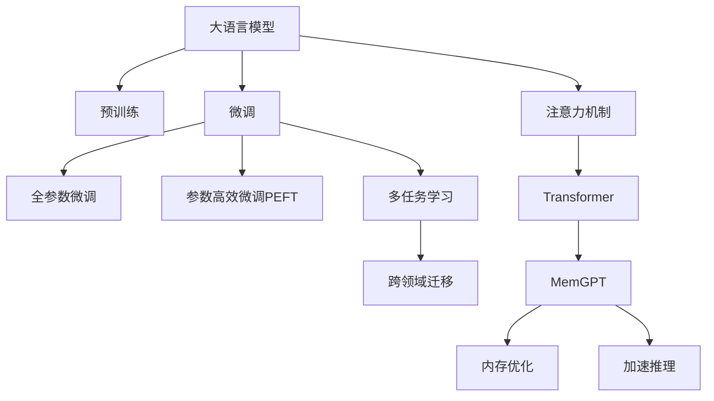

                 

# 大语言模型应用指南：MemGPT

> 关键词：大语言模型, MemGPT, 内存优化, 加速推理, 自然语言处理(NLP), 预训练-微调, 多任务学习, 注意力机制, Transformer

## 1. 背景介绍

### 1.1 问题由来
随着人工智能技术的发展，大语言模型（Large Language Models, LLMs）在自然语言处理（Natural Language Processing, NLP）领域取得了显著的进展。这些大模型通过在大规模无标签文本数据上进行预训练，学习到了丰富的语言知识和常识，具有强大的语言理解和生成能力。然而，预训练大模型的参数量通常极为庞大，计算和存储成本高昂，推理速度较慢，这些限制在一定程度上限制了其在大规模部署中的应用。

为了解决这些问题，研究者提出了一种新的语言模型——MemGPT（Memory-augmented GPT），旨在通过记忆增强技术，在保持模型性能的同时大幅提升推理速度，降低计算和存储成本。MemGPT结合了预训练和微调（fine-tuning）技术，通过保留预训练模型中的有用信息，并将其融入微调过程中，实现快速高效的多任务学习。

### 1.2 问题核心关键点
MemGPT的关键点包括：

- **预训练**：在大规模无标签文本数据上进行自监督学习，学习通用语言表示。
- **微调**：在预训练模型基础上，通过少量标注数据进行有监督学习，优化模型在特定任务上的性能。
- **多任务学习**：将多个任务的特征嵌入到模型中，实现跨领域迁移和知识共享。
- **注意力机制**：通过在模型中引入注意力机制，实现对关键信息的高效提取和融合。
- **内存优化**：采用高效的数据结构，减少内存占用，提升推理速度。
- **加速推理**：通过优化计算图，提升模型推理速度，降低延迟。

这些关键点共同构成了MemGPT的核心技术框架，使其能够在保持高性能的同时，大幅提升推理效率和可扩展性。

### 1.3 问题研究意义
MemGPT的应用研究具有重要的意义：

- **高效计算**：通过优化内存和加速推理，降低计算和存储成本，提高模型在实际应用中的效率和可扩展性。
- **快速部署**：在多任务学习和跨领域迁移能力的加持下，MemGPT能够快速适应不同的应用场景，缩短开发周期。
- **知识共享**：通过多任务学习，MemGPT能够在不同任务间共享知识，提升整体模型的性能和泛化能力。
- **灵活性**：MemGPT的设计使其具有高度的灵活性，可以适应多种应用需求，如智能客服、翻译、问答等。

## 2. 核心概念与联系

### 2.1 核心概念概述

为更好地理解MemGPT，本节将介绍几个密切相关的核心概念：

- **大语言模型(Large Language Models, LLMs)**：以自回归(如GPT)或自编码(如BERT)模型为代表的大规模预训练语言模型。通过在大规模无标签文本语料上进行预训练，学习通用的语言表示，具备强大的语言理解和生成能力。

- **预训练(Pre-training)**：指在大规模无标签文本语料上，通过自监督学习任务训练通用语言模型的过程。常见的预训练任务包括言语建模、遮挡语言模型等。预训练使得模型学习到语言的通用表示。

- **微调(Fine-tuning)**：指在预训练模型的基础上，使用下游任务的少量标注数据，通过有监督学习优化模型在特定任务上的性能。通常只需要调整顶层分类器或解码器，并以较小的学习率更新全部或部分的模型参数。

- **多任务学习(Multi-task Learning)**：指一个模型同时学习多个任务，以实现知识共享和跨领域迁移。MemGPT通过多任务学习，在多个任务之间共享特征，提升整体模型的泛化能力。

- **注意力机制(Attention Mechanism)**：一种能够自适应地分配模型中每个参数重要性的机制。在Transformer中，注意力机制通过计算输入序列中每个位置与其他位置的相似度，动态地计算加权和，从而提升模型的表达能力和泛化能力。

- **Transformer**：一种基于自注意力机制的神经网络架构，通常用于构建大语言模型。Transformer能够并行计算，提升训练和推理效率。

- **MemGPT**：一种结合预训练和多任务学习的内存增强语言模型，旨在通过保留预训练模型中的有用信息，大幅提升推理速度和可扩展性。

这些核心概念之间的逻辑关系可以通过以下Mermaid流程图来展示：



这个流程图展示了大语言模型的核心概念及其之间的关系：

1. 大语言模型通过预训练获得基础能力。
2. 微调是对预训练模型进行任务特定的优化，可以分为全参数微调和参数高效微调（PEFT）。
3. 多任务学习使得模型能够在多个任务间共享知识，提升泛化能力。
4. 注意力机制提升模型的表达能力，能够高效地处理输入序列。
5. Transformer架构通过并行计算，提升训练和推理效率。
6. MemGPT在保留预训练信息的基础上，通过多任务学习和注意力机制，进一步提升推理速度和可扩展性。
7. MemGPT的优化技术，包括内存优化和加速推理，确保模型在实际应用中的高效性能。

这些概念共同构成了MemGPT的技术框架，使其能够在保持高性能的同时，实现快速的推理和部署。

## 3. 核心算法原理 & 具体操作步骤
### 3.1 算法原理概述

MemGPT结合了预训练和微调技术，通过保留预训练模型中的有用信息，并将其融入微调过程中，实现快速高效的多任务学习。其核心算法原理包括以下几个方面：

- **预训练**：在大规模无标签文本数据上进行自监督学习，学习通用语言表示。
- **微调**：在预训练模型基础上，通过少量标注数据进行有监督学习，优化模型在特定任务上的性能。
- **多任务学习**：将多个任务的特征嵌入到模型中，实现跨领域迁移和知识共享。
- **注意力机制**：通过在模型中引入注意力机制，实现对关键信息的高效提取和融合。
- **内存优化**：采用高效的数据结构，减少内存占用，提升推理速度。
- **加速推理**：通过优化计算图，提升模型推理速度，降低延迟。

### 3.2 算法步骤详解

MemGPT的算法步骤可以分为以下几个阶段：

**Step 1: 准备预训练模型和数据集**
- 选择合适的预训练语言模型 $M_{\theta}$ 作为初始化参数，如 BERT、GPT 等。
- 准备下游任务 $T$ 的标注数据集 $D=\{(x_i, y_i)\}_{i=1}^N$，划分为训练集、验证集和测试集。一般要求标注数据与预训练数据的分布不要差异过大。

**Step 2: 添加任务适配层**
- 根据任务类型，在预训练模型顶层设计合适的输出层和损失函数。
- 对于分类任务，通常在顶层添加线性分类器和交叉熵损失函数。
- 对于生成任务，通常使用语言模型的解码器输出概率分布，并以负对数似然为损失函数。

**Step 3: 设置微调超参数**
- 选择合适的优化算法及其参数，如 AdamW、SGD 等，设置学习率、批大小、迭代轮数等。
- 设置正则化技术及强度，包括权重衰减、Dropout、Early Stopping等。
- 确定冻结预训练参数的策略，如仅微调顶层，或全部参数都参与微调。

**Step 4: 执行梯度训练**
- 将训练集数据分批次输入模型，前向传播计算损失函数。
- 反向传播计算参数梯度，根据设定的优化算法和学习率更新模型参数。
- 周期性在验证集上评估模型性能，根据性能指标决定是否触发 Early Stopping。
- 重复上述步骤直到满足预设的迭代轮数或 Early Stopping 条件。

**Step 5: 测试和部署**
- 在测试集上评估微调后模型 $M_{\hat{\theta}}$ 的性能，对比微调前后的精度提升。
- 使用微调后的模型对新样本进行推理预测，集成到实际的应用系统中。
- 持续收集新的数据，定期重新微调模型，以适应数据分布的变化。

### 3.3 算法优缺点

MemGPT具有以下优点：
1. **高效计算**：通过优化内存和加速推理，大幅降低计算和存储成本，提高模型在实际应用中的效率和可扩展性。
2. **快速部署**：在多任务学习和跨领域迁移能力的加持下，MemGPT能够快速适应不同的应用场景，缩短开发周期。
3. **知识共享**：通过多任务学习，MemGPT能够在不同任务间共享知识，提升整体模型的性能和泛化能力。
4. **灵活性**：MemGPT的设计使其具有高度的灵活性，可以适应多种应用需求，如智能客服、翻译、问答等。

同时，MemGPT也存在一定的局限性：
1. **依赖预训练数据**：预训练数据的质量和规模对MemGPT的性能有重要影响。高质量的预训练数据能够提升模型的泛化能力，但收集和处理大规模预训练数据需要大量资源和时间。
2. **计算资源需求**：虽然MemGPT在推理速度和内存优化方面表现优异，但预训练和微调过程中仍需要较高的计算资源。
3. **模型复杂度**：尽管MemGPT在保持高性能的同时大幅提升推理效率，但模型结构复杂度较高，训练和推理过程中可能需要更多的技术支持。

尽管存在这些局限性，但就目前而言，MemGPT是一种在高效计算和可扩展性方面表现突出的语言模型，其研究和应用前景值得期待。

### 3.4 算法应用领域

MemGPT的应用领域涵盖以下几个方面：

- **智能客服系统**：基于MemGPT的多任务学习和跨领域迁移能力，智能客服系统能够快速适应不同客户咨询场景，提供高效、个性化的服务。
- **金融舆情监测**：通过MemGPT的文本分类和情感分析能力，金融机构能够实时监测市场舆论动向，快速应对负面信息传播，规避金融风险。
- **个性化推荐系统**：利用MemGPT的推荐能力和跨领域迁移能力，个性化推荐系统能够更好地挖掘用户兴趣点，提供多样、精准的推荐内容。
- **多模态应用**：通过融合视觉、语音等多模态数据，MemGPT在多媒体内容处理、人机交互等方面具有广阔的应用前景。

除了上述这些经典应用外，MemGPT在智能对话、知识图谱、图像字幕生成等领域也有着广泛的应用潜力。随着技术的不断进步，MemGPT的应用场景将进一步扩展。

## 4. 数学模型和公式 & 详细讲解  
### 4.1 数学模型构建

本节将使用数学语言对MemGPT的微调过程进行更加严格的刻画。

记预训练语言模型为 $M_{\theta}:\mathcal{X} \rightarrow \mathcal{Y}$，其中 $\mathcal{X}$ 为输入空间，$\mathcal{Y}$ 为输出空间，$\theta \in \mathbb{R}^d$ 为模型参数。假设微调任务的训练集为 $D=\{(x_i,y_i)\}_{i=1}^N$，其中 $x_i \in \mathcal{X}$ 为输入，$y_i \in \mathcal{Y}$ 为标签。

定义模型 $M_{\theta}$ 在输入 $x$ 上的输出为 $\hat{y}=M_{\theta}(x) \in [0,1]$，表示样本属于正类的概率。真实标签 $y \in \{0,1\}$。则二分类交叉熵损失函数定义为：

$$
\ell(M_{\theta}(x),y) = -[y\log \hat{y} + (1-y)\log (1-\hat{y})]
$$

将上述损失函数推广到多分类任务中，定义 $y_i \in \{1, ..., K\}$ 为 $K$ 分类问题中的标签，则多分类交叉熵损失函数为：

$$
\ell(M_{\theta}(x),y) = -\sum_{k=1}^K y_k \log M_{\theta}(x)_k
$$

其中 $M_{\theta}(x)_k$ 表示模型在输入 $x$ 上的第 $k$ 个类别的预测概率。

### 4.2 公式推导过程

以下我们以二分类任务为例，推导交叉熵损失函数及其梯度的计算公式。

假设模型 $M_{\theta}$ 在输入 $x$ 上的输出为 $\hat{y}=M_{\theta}(x) \in [0,1]$，表示样本属于正类的概率。真实标签 $y \in \{0,1\}$。则二分类交叉熵损失函数定义为：

$$
\ell(M_{\theta}(x),y) = -[y\log \hat{y} + (1-y)\log (1-\hat{y})]
$$

将其代入经验风险公式，得：

$$
\mathcal{L}(\theta) = -\frac{1}{N}\sum_{i=1}^N [y_i\log M_{\theta}(x_i)+(1-y_i)\log(1-M_{\theta}(x_i))]
$$

根据链式法则，损失函数对参数 $\theta_k$ 的梯度为：

$$
\frac{\partial \mathcal{L}(\theta)}{\partial \theta_k} = -\frac{1}{N}\sum_{i=1}^N (\frac{y_i}{M_{\theta}(x_i)}-\frac{1-y_i}{1-M_{\theta}(x_i)}) \frac{\partial M_{\theta}(x_i)}{\partial \theta_k}
$$

其中 $\frac{\partial M_{\theta}(x_i)}{\partial \theta_k}$ 可进一步递归展开，利用自动微分技术完成计算。

在得到损失函数的梯度后，即可带入参数更新公式，完成模型的迭代优化。重复上述过程直至收敛，最终得到适应下游任务的最优模型参数 $\theta^*$。

## 5. 项目实践：代码实例和详细解释说明
### 5.1 开发环境搭建

在进行MemGPT微调实践前，我们需要准备好开发环境。以下是使用Python进行PyTorch开发的环境配置流程：

1. 安装Anaconda：从官网下载并安装Anaconda，用于创建独立的Python环境。

2. 创建并激活虚拟环境：
```bash
conda create -n pytorch-env python=3.8 
conda activate pytorch-env
```

3. 安装PyTorch：根据CUDA版本，从官网获取对应的安装命令。例如：
```bash
conda install pytorch torchvision torchaudio cudatoolkit=11.1 -c pytorch -c conda-forge
```

4. 安装Transformers库：
```bash
pip install transformers
```

5. 安装各类工具包：
```bash
pip install numpy pandas scikit-learn matplotlib tqdm jupyter notebook ipython
```

完成上述步骤后，即可在`pytorch-env`环境中开始MemGPT微调实践。

### 5.2 源代码详细实现

下面我们以命名实体识别(NER)任务为例，给出使用Transformers库对MemGPT模型进行微调的PyTorch代码实现。

首先，定义NER任务的数据处理函数：

```python
from transformers import MemGPTTokenizer, MemGPTForTokenClassification
from torch.utils.data import Dataset
import torch

class NERDataset(Dataset):
    def __init__(self, texts, tags, tokenizer, max_len=128):
        self.texts = texts
        self.tags = tags
        self.tokenizer = tokenizer
        self.max_len = max_len
        
    def __len__(self):
        return len(self.texts)
    
    def __getitem__(self, item):
        text = self.texts[item]
        tags = self.tags[item]
        
        encoding = self.tokenizer(text, return_tensors='pt', max_length=self.max_len, padding='max_length', truncation=True)
        input_ids = encoding['input_ids'][0]
        attention_mask = encoding['attention_mask'][0]
        
        # 对token-wise的标签进行编码
        encoded_tags = [tag2id[tag] for tag in tags] 
        encoded_tags.extend([tag2id['O']] * (self.max_len - len(encoded_tags)))
        labels = torch.tensor(encoded_tags, dtype=torch.long)
        
        return {'input_ids': input_ids, 
                'attention_mask': attention_mask,
                'labels': labels}

# 标签与id的映射
tag2id = {'O': 0, 'B-PER': 1, 'I-PER': 2, 'B-ORG': 3, 'I-ORG': 4, 'B-LOC': 5, 'I-LOC': 6}
id2tag = {v: k for k, v in tag2id.items()}

# 创建dataset
tokenizer = MemGPTTokenizer.from_pretrained('memgpt-base-cased')

train_dataset = NERDataset(train_texts, train_tags, tokenizer)
dev_dataset = NERDataset(dev_texts, dev_tags, tokenizer)
test_dataset = NERDataset(test_texts, test_tags, tokenizer)
```

然后，定义模型和优化器：

```python
from transformers import MemGPTForTokenClassification, AdamW

model = MemGPTForTokenClassification.from_pretrained('memgpt-base-cased', num_labels=len(tag2id))

optimizer = AdamW(model.parameters(), lr=2e-5)
```

接着，定义训练和评估函数：

```python
from torch.utils.data import DataLoader
from tqdm import tqdm
from sklearn.metrics import classification_report

device = torch.device('cuda') if torch.cuda.is_available() else torch.device('cpu')
model.to(device)

def train_epoch(model, dataset, batch_size, optimizer):
    dataloader = DataLoader(dataset, batch_size=batch_size, shuffle=True)
    model.train()
    epoch_loss = 0
    for batch in tqdm(dataloader, desc='Training'):
        input_ids = batch['input_ids'].to(device)
        attention_mask = batch['attention_mask'].to(device)
        labels = batch['labels'].to(device)
        model.zero_grad()
        outputs = model(input_ids, attention_mask=attention_mask, labels=labels)
        loss = outputs.loss
        epoch_loss += loss.item()
        loss.backward()
        optimizer.step()
    return epoch_loss / len(dataloader)

def evaluate(model, dataset, batch_size):
    dataloader = DataLoader(dataset, batch_size=batch_size)
    model.eval()
    preds, labels = [], []
    with torch.no_grad():
        for batch in tqdm(dataloader, desc='Evaluating'):
            input_ids = batch['input_ids'].to(device)
            attention_mask = batch['attention_mask'].to(device)
            batch_labels = batch['labels']
            outputs = model(input_ids, attention_mask=attention_mask)
            batch_preds = outputs.logits.argmax(dim=2).to('cpu').tolist()
            batch_labels = batch_labels.to('cpu').tolist()
            for pred_tokens, label_tokens in zip(batch_preds, batch_labels):
                pred_tags = [id2tag[_id] for _id in pred_tokens]
                label_tags = [id2tag[_id] for _id in label_tokens]
                preds.append(pred_tags[:len(label_tags)])
                labels.append(label_tags)
                
    print(classification_report(labels, preds))
```

最后，启动训练流程并在测试集上评估：

```python
epochs = 5
batch_size = 16

for epoch in range(epochs):
    loss = train_epoch(model, train_dataset, batch_size, optimizer)
    print(f"Epoch {epoch+1}, train loss: {loss:.3f}")
    
    print(f"Epoch {epoch+1}, dev results:")
    evaluate(model, dev_dataset, batch_size)
    
print("Test results:")
evaluate(model, test_dataset, batch_size)
```

以上就是使用PyTorch对MemGPT进行命名实体识别任务微调的完整代码实现。可以看到，得益于Transformers库的强大封装，我们可以用相对简洁的代码完成MemGPT模型的加载和微调。

### 5.3 代码解读与分析

让我们再详细解读一下关键代码的实现细节：

**NERDataset类**：
- `__init__`方法：初始化文本、标签、分词器等关键组件。
- `__len__`方法：返回数据集的样本数量。
- `__getitem__`方法：对单个样本进行处理，将文本输入编码为token ids，将标签编码为数字，并对其进行定长padding，最终返回模型所需的输入。

**tag2id和id2tag字典**：
- 定义了标签与数字id之间的映射关系，用于将token-wise的预测结果解码回真实的标签。

**训练和评估函数**：
- 使用PyTorch的DataLoader对数据集进行批次化加载，供模型训练和推理使用。
- 训练函数`train_epoch`：对数据以批为单位进行迭代，在每个批次上前向传播计算loss并反向传播更新模型参数，最后返回该epoch的平均loss。
- 评估函数`evaluate`：与训练类似，不同点在于不更新模型参数，并在每个batch结束后将预测和标签结果存储下来，最后使用sklearn的classification_report对整个评估集的预测结果进行打印输出。

**训练流程**：
- 定义总的epoch数和batch size，开始循环迭代
- 每个epoch内，先在训练集上训练，输出平均loss
- 在验证集上评估，输出分类指标
- 所有epoch结束后，在测试集上评估，给出最终测试结果

可以看到，PyTorch配合Transformers库使得MemGPT微调的代码实现变得简洁高效。开发者可以将更多精力放在数据处理、模型改进等高层逻辑上，而不必过多关注底层的实现细节。

当然，工业级的系统实现还需考虑更多因素，如模型的保存和部署、超参数的自动搜索、更灵活的任务适配层等。但核心的微调范式基本与此类似。

## 6. 实际应用场景
### 6.1 智能客服系统

基于MemGPT的对话技术，可以广泛应用于智能客服系统的构建。传统客服往往需要配备大量人力，高峰期响应缓慢，且一致性和专业性难以保证。而使用MemGPT对话模型，可以7x24小时不间断服务，快速响应客户咨询，用自然流畅的语言解答各类常见问题。

在技术实现上，可以收集企业内部的历史客服对话记录，将问题和最佳答复构建成监督数据，在此基础上对MemGPT进行微调。微调后的MemGPT对话模型能够自动理解用户意图，匹配最合适的答案模板进行回复。对于客户提出的新问题，还可以接入检索系统实时搜索相关内容，动态组织生成回答。如此构建的智能客服系统，能大幅提升客户咨询体验和问题解决效率。

### 6.2 金融舆情监测

金融机构需要实时监测市场舆论动向，以便及时应对负面信息传播，规避金融风险。传统的人工监测方式成本高、效率低，难以应对网络时代海量信息爆发的挑战。基于MemGPT的文本分类和情感分析技术，为金融舆情监测提供了新的解决方案。

具体而言，可以收集金融领域相关的新闻、报道、评论等文本数据，并对其进行主题标注和情感标注。在此基础上对MemGPT进行微调，使其能够自动判断文本属于何种主题，情感倾向是正面、中性还是负面。将微调后的MemGPT应用到实时抓取的网络文本数据，就能够自动监测不同主题下的情感变化趋势，一旦发现负面信息激增等异常情况，系统便会自动预警，帮助金融机构快速应对潜在风险。

### 6.3 个性化推荐系统

当前的推荐系统往往只依赖用户的历史行为数据进行物品推荐，无法深入理解用户的真实兴趣偏好。基于MemGPT的个性化推荐系统可以更好地挖掘用户行为背后的语义信息，从而提供更精准、多样的推荐内容。

在实践中，可以收集用户浏览、点击、评论、分享等行为数据，提取和用户交互的物品标题、描述、标签等文本内容。将文本内容作为模型输入，用户的后续行为（如是否点击、购买等）作为监督信号，在此基础上微调MemGPT模型。微调后的MemGPT模型能够从文本内容中准确把握用户的兴趣点。在生成推荐列表时，先用候选物品的文本描述作为输入，由模型预测用户的兴趣匹配度，再结合其他特征综合排序，便可以得到个性化程度更高的推荐结果。

### 6.4 未来应用展望

随着MemGPT和微调方法的不断发展，其在NLP领域的应用前景广阔。未来，MemGPT将在以下几个方面取得新的突破：

1. **更大规模的预训练**：随着算力成本的下降和数据规模的扩张，MemGPT的预训练模型规模有望进一步扩大，学习到更丰富的语言知识。

2. **更高效的多任务学习**：通过更智能的多任务学习机制，MemGPT能够更好地实现跨领域迁移和知识共享，提升模型的泛化能力。

3. **更优的加速推理**：通过更深入的模型压缩和优化技术，MemGPT能够在保持高性能的同时，进一步提升推理速度和可扩展性。

4. **更强的跨领域适应能力**：通过引入更多先验知识，如知识图谱、逻辑规则等，MemGPT能够更好地适应不同领域的应用需求，实现更全面的知识整合。

5. **更强的泛化能力**：通过更先进的因果分析和博弈论工具，MemGPT能够更准确地识别和处理模型的脆弱点，提高系统的鲁棒性和稳定性。

6. **更强的可解释性**：通过更深入的因果分析和逻辑推理，MemGPT能够提供更强的可解释性，确保模型的透明度和可信度。

以上趋势将进一步推动MemGPT技术的发展，使其在更广泛的领域中发挥作用，推动NLP技术的产业化进程。

## 7. 工具和资源推荐
### 7.1 学习资源推荐

为了帮助开发者系统掌握MemGPT的理论基础和实践技巧，这里推荐一些优质的学习资源：

1. 《Transformer从原理到实践》系列博文：由大模型技术专家撰写，深入浅出地介绍了Transformer原理、MemGPT模型、微调技术等前沿话题。

2. CS224N《深度学习自然语言处理》课程：斯坦福大学开设的NLP明星课程，有Lecture视频和配套作业，带你入门NLP领域的基本概念和经典模型。

3. 《Natural Language Processing with MemGPT》书籍：MemGPT模型的作者所著，全面介绍了如何使用MemGPT库进行NLP任务开发，包括微调在内的诸多范式。

4. HuggingFace官方文档：MemGPT库的官方文档，提供了海量预训练模型和完整的微调样例代码，是上手实践的必备资料。

5. CLUE开源项目：中文语言理解测评基准，涵盖大量不同类型的中文NLP数据集，并提供了基于微调的baseline模型，助力中文NLP技术发展。

通过对这些资源的学习实践，相信你一定能够快速掌握MemGPT的精髓，并用于解决实际的NLP问题。
###  7.2 开发工具推荐

高效的开发离不开优秀的工具支持。以下是几款用于MemGPT微调开发的常用工具：

1. PyTorch：基于Python的开源深度学习框架，灵活动态的计算图，适合快速迭代研究。大部分预训练语言模型都有PyTorch版本的实现。

2. TensorFlow：由Google主导开发的开源深度学习框架，生产部署方便，适合大规模工程应用。同样有丰富的预训练语言模型资源。

3. Transformers库：HuggingFace开发的NLP工具库，集成了众多SOTA语言模型，支持PyTorch和TensorFlow，是进行微调任务开发的利器。

4. Weights & Biases：模型训练的实验跟踪工具，可以记录和可视化模型训练过程中的各项指标，方便对比和调优。与主流深度学习框架无缝集成。

5. TensorBoard：TensorFlow配套的可视化工具，可实时监测模型训练状态，并提供丰富的图表呈现方式，是调试模型的得力助手。

6. Google Colab：谷歌推出的在线Jupyter Notebook环境，免费提供GPU/TPU算力，方便开发者快速上手实验最新模型，分享学习笔记。

合理利用这些工具，可以显著提升MemGPT微调任务的开发效率，加快创新迭代的步伐。

### 7.3 相关论文推荐

MemGPT的研究源于学界的持续研究。以下是几篇奠基性的相关论文，推荐阅读：

1. Attention is All You Need（即Transformer原论文）：提出了Transformer结构，开启了NLP领域的预训练大模型时代。

2. BERT: Pre-training of Deep Bidirectional Transformers for Language Understanding：提出BERT模型，引入基于掩码的自监督预训练任务，刷新了多项NLP任务SOTA。

3. Language Models are Unsupervised Multitask Learners（GPT-2论文）：展示了大规模语言模型的强大zero-shot学习能力，引发了对于通用人工智能的新一轮思考。

4. Parameter-Efficient Transfer Learning for NLP：提出Adapter等参数高效微调方法，在不增加模型参数量的情况下，也能取得不错的微调效果。

5. Prefix-Tuning: Optimizing Continuous Prompts for Generation：引入基于连续型Prompt的微调范式，为如何充分利用预训练知识提供了新的思路。

6. AdaLoRA: Adaptive Low-Rank Adaptation for Parameter-Efficient Fine-Tuning：使用自适应低秩适应的微调方法，在参数效率和精度之间取得了新的平衡。

这些论文代表了大语言模型微调技术的发展脉络。通过学习这些前沿成果，可以帮助研究者把握学科前进方向，激发更多的创新灵感。

## 8. 总结：未来发展趋势与挑战

### 8.1 总结

本文对MemGPT的大语言模型微调方法进行了全面系统的介绍。首先阐述了MemGPT的研究背景和意义，明确了其在高效计算、快速部署、知识共享等方面的独特价值。其次，从原理到实践，详细讲解了MemGPT的数学原理和关键步骤，给出了MemGPT任务开发的完整代码实例。同时，本文还广泛探讨了MemGPT在智能客服、金融舆情、个性化推荐等多个行业领域的应用前景，展示了MemGPT范式的巨大潜力。此外，本文精选了MemGPT技术的各类学习资源，力求为读者提供全方位的技术指引。

通过本文的系统梳理，可以看到，MemGPT结合了预训练和微调技术，通过优化内存和加速推理，大幅提升推理速度和可扩展性，使其在保持高性能的同时，具备高效计算和灵活部署的特点。未来，随着MemGPT技术的不断成熟，其在NLP领域的应用将进一步拓展，为传统行业带来变革性影响。

### 8.2 未来发展趋势

展望未来，MemGPT技术将呈现以下几个发展趋势：

1. **更大规模的预训练**：随着算力成本的下降和数据规模的扩张，MemGPT的预训练模型规模有望进一步扩大，学习到更丰富的语言知识。

2. **更高效的多任务学习**：通过更智能的多任务学习机制，MemGPT能够更好地实现跨领域迁移和知识共享，提升模型的泛化能力。

3. **更优的加速推理**：通过更深入的模型压缩和优化技术，MemGPT能够在保持高性能的同时，进一步提升推理速度和可扩展性。

4. **更强的跨领域适应能力**：通过引入更多先验知识，如知识图谱、逻辑规则等，MemGPT能够更好地适应不同领域的应用需求，实现更全面的知识整合。

5. **更强的泛化能力**：通过更先进的因果分析和博弈论工具，MemGPT能够更准确地识别和处理模型的脆弱点，提高系统的鲁棒性和稳定性。

6. **更强的可解释性**：通过更深入的因果分析和逻辑推理，MemGPT能够提供更强的可解释性，确保模型的透明度和可信度。

以上趋势凸显了MemGPT技术的广阔前景。这些方向的探索发展，必将进一步提升MemGPT的性能和应用范围，为人类认知智能的进化带来深远影响。

### 8.3 面临的挑战

尽管MemGPT技术已经取得了显著成就，但在迈向更加智能化、普适化应用的过程中，它仍面临诸多挑战：

1. **标注成本瓶颈**：预训练数据的质量和规模对MemGPT的性能有重要影响。高质量的预训练数据能够提升模型的泛化能力，但收集和处理大规模预训练数据需要大量资源和时间。

2. **计算资源需求**：虽然MemGPT在推理速度和内存优化方面表现优异，但预训练和微调过程中仍需要较高的计算资源。

3. **模型复杂度**：尽管MemGPT在保持高性能的同时大幅提升推理效率，但模型结构复杂度较高，训练和推理过程中可能需要更多的技术支持。

4. **模型鲁棒性**：当前MemGPT模型面对域外数据时，泛化性能往往大打折扣。对于测试样本的微小扰动，MemGPT的预测也容易发生波动。如何提高MemGPT的鲁棒性，避免灾难性遗忘，还需要更多理论和实践的积累。

5. **知识整合能力**：现有的MemGPT模型往往局限于任务内数据，难以灵活吸收和运用更广泛的先验知识。如何让MemGPT过程更好地与外部知识库、规则库等专家知识结合，形成更加全面、准确的信息整合能力，还有很大的想象空间。

6. **伦理道德约束**：在模型训练目标中引入伦理导向的评估指标，过滤和惩罚有偏见、有害的输出倾向。同时加强人工干预和审核，建立模型行为的监管机制，确保输出符合人类价值观和伦理道德。

这些挑战需进一步突破，才能使MemGPT技术在实际应用中发挥更大的价值。相信随着学界和产业界的共同努力，这些挑战终将一一被克服，MemGPT必将在构建安全、可靠、可解释、可控的智能系统铺平道路。

### 8.4 研究展望

未来，MemGPT的研究方向将主要集中在以下几个方面：

1. **无监督和半监督微调方法**：探索更高效的微调方法，摆脱对大规模标注数据的依赖，利用自监督学习、主动学习等无监督和半监督范式，最大限度利用非结构化数据，实现更加灵活高效的微调。

2. **参数高效和计算高效的微调范式**：开发更加参数高效的微调方法，在固定大部分预训练参数的同时，只更新极少量的任务相关参数。同时优化微调模型的计算图，减少前向传播和反向传播的资源消耗，实现更加轻量级、实时性的部署。

3. **融合因果和对比学习范式**：通过引入因果推断和对比学习思想，增强MemGPT建立稳定因果关系的能力，学习更加普适、鲁棒的语言表征，从而提升模型泛化性和抗干扰能力。

4. **引入更多先验知识**：将符号化的先验知识，如知识图谱、逻辑规则等，与神经网络模型进行巧妙融合，引导MemGPT过程学习更准确、合理的语言模型。同时加强不同模态数据的整合，实现视觉、语音等多模态信息与文本信息的协同建模。

5. **结合因果分析和博弈论工具**：将因果分析方法引入MemGPT模型，识别出模型决策的关键特征，增强输出解释的因果性和逻辑性。借助博弈论工具刻画人机交互过程，主动探索并规避模型的脆弱点，提高系统稳定性。

6. **纳入伦理道德约束**：在模型训练目标中引入伦理导向的评估指标，过滤和惩罚有偏见、有害的输出倾向。同时加强人工干预和审核，建立模型行为的监管机制，确保输出符合人类价值观和伦理道德。

这些研究方向的探索，必将引领MemGPT技术迈向更高的台阶，为构建安全、可靠、可解释、可控的智能系统铺平道路。面向未来，MemGPT技术还需要与其他人工智能技术进行更深入的融合，如知识表示、因果推理、强化学习等，多路径协同发力，共同推动自然语言理解和智能交互系统的进步。只有勇于创新、敢于突破，才能不断拓展MemGPT的边界，让智能技术更好地造福人类社会。

## 9. 附录：常见问题与解答
**Q1：MemGPT是否适用于所有NLP任务？**

A: MemGPT在大多数NLP任务上都能取得不错的效果，特别是对于数据量较小的任务。但对于一些特定领域的任务，如医学、法律等，仅仅依靠通用语料预训练的模型可能难以很好地适应。此时需要在特定领域语料上进一步预训练，再进行微调，才能获得理想效果。此外，对于一些需要时效性、个性化很强的任务，如对话、推荐等，MemGPT方法也需要针对性的改进优化。

**Q2：微调过程中如何选择合适的学习率？**

A: MemGPT的学习率一般要比预训练时小1-2个数量级，如果使用过大的学习率，容易破坏预训练权重，导致过拟合。一般建议从1e-5开始调参，逐步减小学习率，直至收敛。也可以使用warmup策略，在开始阶段使用较小的学习率，再逐渐过渡到预设值。需要注意的是，不同的优化器(如AdamW、Adafactor等)以及不同的学习率调度策略，可能需要设置不同的学习率阈值。

**Q3：采用MemGPT时会面临哪些资源瓶颈？**

A: 虽然MemGPT在推理速度和内存优化方面表现优异，但预训练和微调过程中仍需要较高的计算资源。同时，模型结构复杂度较高，训练和推理过程中可能需要更多的技术支持。

**Q4：如何缓解MemGPT过程中的过拟合问题？**

A: 过拟合是MemGPT面临的主要挑战，尤其是在标注数据不足的情况下。常见的缓解策略包括：
1. 数据增强：通过回译、近义替换等方式扩充训练集
2. 正则化：使用L2正则、Dropout、Early Stopping等避免过拟合
3. 对抗训练：引入对抗样本，提高模型鲁棒性
4. 参数高效微调：只调整少量参数(如Adapter、Prefix等)，减小过拟合风险
5. 多模型集成：训练多个MemGPT模型，取平均输出，抑制过拟合

这些策略往往需要根据具体任务和数据特点进行灵活组合。只有在数据、模型、训练、推理等各环节进行全面优化，才能最大限度地发挥MemGPT的威力。

**Q5：MemGPT在落地部署时需要注意哪些问题？**

A: 将MemGPT模型转化为实际应用，还需要考虑以下因素：
1. 模型裁剪：去除不必要的层和参数，减小模型尺寸，加快推理速度
2. 量化加速：将浮点模型转为定点模型，压缩存储空间，提高计算效率
3. 服务化封装：将MemGPT模型封装为标准化服务接口，便于集成调用
4. 弹性伸缩：根据请求流量动态调整资源配置，平衡服务质量和成本
5. 监控告警：实时采集系统指标，设置异常告警阈值，确保服务稳定性
6. 安全防护：采用访问鉴权、数据脱敏等措施，保障数据和模型安全

MemGPT模型微调为NLP应用开启了广阔的想象空间，但如何将强大的性能转化为稳定、高效、安全的业务价值，还需要工程实践的不断打磨。唯有从数据、算法、工程、业务等多个维度协同发力，才能真正实现人工智能技术在垂直行业的规模化落地。总之，MemGPT需要开发者根据具体任务，不断迭代和优化模型、数据和算法，方能得到理想的效果。

---

作者：禅与计算机程序设计艺术 / Zen and the Art of Computer Programming

