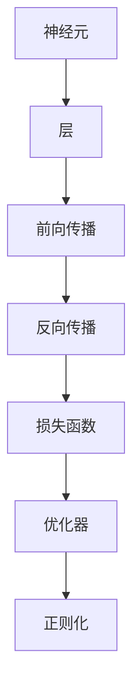

                 

# 大语言模型应用指南：什么是神经网络

## 1. 背景介绍

### 1.1 问题由来

随着人工智能技术的飞速发展，神经网络已成为当前最主流的机器学习架构之一。它模拟了人类大脑的工作方式，通过多层非线性变换，对复杂数据进行高效建模和处理。本文将从基础概念、原理、实践等方面深入探讨神经网络的应用，以期帮助读者更好地理解这一关键技术。

### 1.2 问题核心关键点

神经网络的核心在于其独特的非线性特性和强大的拟合能力。具体来说，包括以下几个关键点：

- **多层结构**：神经网络由多个层次组成，每个层次进行一定的数据变换，层层递进，逐步抽象出更高层次的特征。
- **激活函数**：在每个神经元的输出上应用激活函数，引入非线性变换，增加网络的表达能力。
- **反向传播**：通过反向传播算法，将误差从输出层向输入层传递，优化网络参数，实现端到端的训练。
- **参数共享**：卷积神经网络（CNN）和循环神经网络（RNN）等特殊神经网络，通过参数共享的方式，进一步提升网络性能和计算效率。
- **正则化**：通过L1、L2正则化、Dropout等技术，防止过拟合，提升模型泛化能力。

这些关键点共同构成了神经网络的强大功能和广泛应用基础。了解这些核心概念，可以帮助读者更好地理解神经网络的工作原理和实际应用。

## 2. 核心概念与联系

### 2.1 核心概念概述

为更好地理解神经网络，本节将介绍几个密切相关的核心概念：

- **神经元（Neuron）**：神经网络的基本构成单元，接收输入，进行加权求和并激活，输出结果。
- **层（Layer）**：由一组神经元组成，负责特定的数据变换或特征提取。
- **前向传播（Forward Propagation）**：从输入层开始，逐层进行数据传递和变换的过程。
- **反向传播（Backward Propagation）**：通过计算梯度，反向更新模型参数，优化损失函数的过程。
- **损失函数（Loss Function）**：衡量模型预测与真实标签之间的差异，常见的有均方误差、交叉熵等。
- **优化器（Optimizer）**：通过迭代优化，最小化损失函数，如SGD、Adam等。
- **正则化（Regularization）**：防止模型过拟合，如L1/L2正则、Dropout等。
- **深度学习（Deep Learning）**：指包含多层神经元的神经网络，深度学习通常指使用多层次的非线性变换来提取数据特征。
- **卷积神经网络（CNN）**：一种特殊类型的神经网络，常用于图像识别和处理。
- **循环神经网络（RNN）**：另一种特殊类型的神经网络，适用于处理序列数据，如文本、语音等。

这些核心概念之间的逻辑关系可以通过以下Mermaid流程图来展示：



这个流程图展示了大语言模型中的核心概念及其之间的关系：

1. 神经网络由神经元组成层。
2. 层进行前向传播和反向传播，更新模型参数。
3. 通过损失函数和优化器，最小化预测误差。
4. 正则化技术防止过拟合，提升泛化能力。

这些概念共同构成了神经网络的工作原理，使其能够高效地处理和建模复杂数据。

## 3. 核心算法原理 & 具体操作步骤

### 3.1 算法原理概述

神经网络的训练基于反向传播算法，通过梯度下降等优化算法最小化损失函数。具体步骤如下：

1. 选择适当的神经网络结构，包括层数、每层神经元数量、激活函数等。
2. 初始化模型参数，如权重、偏置等。
3. 通过前向传播计算输出结果，并计算损失函数。
4. 利用反向传播算法计算梯度，更新模型参数。
5. 重复步骤3和4，直至损失函数收敛。

### 3.2 算法步骤详解

以一个简单的全连接神经网络为例，具体介绍神经网络的训练过程：

**Step 1: 初始化模型参数**
- 随机初始化权重矩阵 $W$ 和偏置向量 $b$。
- 选择激活函数，如ReLU、Sigmoid等。

**Step 2: 前向传播**
- 输入样本 $x$，通过层与层之间的加权和和激活函数计算输出 $z$。
- 重复该过程，直至计算到输出层 $y$。

**Step 3: 计算损失函数**
- 计算模型预测结果 $y$ 与真实标签 $t$ 之间的损失，如均方误差、交叉熵等。

**Step 4: 反向传播**
- 从输出层开始，计算误差 $E$ 对每个参数的梯度。
- 使用链式法则，逐层回传误差，更新参数。

**Step 5: 优化**
- 通过优化器（如SGD、Adam等），根据梯度更新参数。

**Step 6: 重复训练**
- 重复Step 2至Step 5，直至损失函数收敛。

### 3.3 算法优缺点

神经网络具有以下优点：

- **高效表达能力**：多层次的非线性变换，使其能够高效建模复杂数据。
- **泛化能力强**：大量训练数据和正则化技术，使其在实际应用中具有较好的泛化性能。
- **灵活性高**：可根据实际问题调整网络结构，适应不同的任务需求。

同时，神经网络也存在一些局限性：

- **计算复杂度高**：大规模神经网络需要大量的计算资源和时间。
- **参数调整困难**：网络结构复杂，参数数量庞大，调试难度大。
- **模型易受输入影响**：对输入数据的微小变化敏感，容易产生过拟合。
- **难以解释**：神经网络黑盒特性，难以解释其内部工作机制和推理过程。

尽管存在这些局限性，神经网络仍然是当前最主流的机器学习架构之一，广泛应用于图像识别、自然语言处理、语音识别等领域。未来，随着计算资源的提升和算法技术的改进，神经网络的性能和应用范围将进一步扩大。

### 3.4 算法应用领域

神经网络在多个领域中得到了广泛应用，以下是几个典型应用场景：

- **图像识别**：使用卷积神经网络（CNN），将图像转化为特征向量，进行分类或检测。
- **自然语言处理**：使用循环神经网络（RNN）或Transformer模型，进行文本分类、情感分析、机器翻译等任务。
- **语音识别**：使用卷积神经网络和RNN，将声音信号转化为文本，进行语音识别和转录。
- **推荐系统**：使用深度神经网络，对用户行为和商品特征进行建模，推荐个性化商品。
- **游戏AI**：使用强化学习神经网络，训练智能体，进行游戏决策和策略优化。
- **自动驾驶**：使用深度神经网络，进行环境感知、路径规划和行为决策，实现自动驾驶。

## 4. 数学模型和公式 & 详细讲解 & 举例说明

### 4.1 数学模型构建

神经网络可以看作一个由线性变换和非线性激活组成的复杂函数。以下以一个简单的全连接神经网络为例，构建数学模型：

设输入为 $x \in \mathbb{R}^{d}$，输出为 $y \in \mathbb{R}^{k}$，网络包含 $L$ 层，第 $l$ 层的神经元数量为 $n_l$，激活函数为 $f$。则第 $l$ 层的输入为 $z_l = W_lx + b_l$，其中 $W_l \in \mathbb{R}^{n_l \times n_{l-1}}$ 为权重矩阵，$b_l \in \mathbb{R}^{n_l}$ 为偏置向量。

最终的输出为：

$$
y = f(W_L \ldots f(W_2 f(W_1 x + b_1) + b_2) + \ldots + b_L)
$$

### 4.2 公式推导过程

以一个简单的全连接神经网络为例，推导前向传播和反向传播公式：

**前向传播公式**：

$$
z_l = W_l x + b_l
$$

**激活函数**：

$$
h_l = f(z_l)
$$

**输出层公式**：

$$
y = W_L h_{L-1} + b_L
$$

其中 $h_l$ 为第 $l$ 层的激活值，$f$ 为激活函数。

**损失函数**：

$$
\mathcal{L} = \frac{1}{N} \sum_{i=1}^N \ell(y_i, t_i)
$$

其中 $t_i$ 为第 $i$ 个样本的真实标签，$\ell$ 为损失函数，如均方误差、交叉熵等。

**反向传播公式**：

设第 $l$ 层的误差为 $\delta_l$，则有：

$$
\delta_L = (y - t) \frac{\partial L}{\partial y}
$$

逐层向后传播，计算误差 $\delta_l$ 对权重 $W_l$ 和偏置 $b_l$ 的梯度：

$$
\frac{\partial \mathcal{L}}{\partial W_l} = \delta_l h_{l-1}^T
$$

$$
\frac{\partial \mathcal{L}}{\partial b_l} = \delta_l
$$

**优化公式**：

$$
\theta_l = \theta_l - \eta \frac{\partial \mathcal{L}}{\partial \theta_l}
$$

其中 $\eta$ 为学习率，$\theta_l$ 为第 $l$ 层的参数，$\frac{\partial \mathcal{L}}{\partial \theta_l}$ 为损失函数对参数的梯度。

### 4.3 案例分析与讲解

以一个简单的二分类问题为例，推导神经网络的前向传播和反向传播公式，并使用梯度下降算法优化模型：

**前向传播**：

设输入为 $x = [1, 2]$，权重矩阵为 $W = \begin{bmatrix} 0.5 & 0.8 \\ -0.3 & 0.1 \end{bmatrix}$，偏置向量为 $b = [0.2, 0.1]$，激活函数为 $f(x) = 1 / (1 + e^{-x})$。则前向传播过程如下：

$$
z_1 = W x + b = [0.5 + 0.8 \cdot 1, -0.3 - 0.1 \cdot 2] = [1.3, -0.5]
$$

$$
h_1 = f(z_1) = \frac{1}{1 + e^{-1.3}} = 0.85
$$

$$
z_2 = W_2 h_1 + b_2 = [0.2, 0.1] \cdot 0.85 + [0.1, 0.2] = [0.25, 0.2]
$$

$$
y = f(z_2) = \frac{1}{1 + e^{-0.25}} = 0.7
$$

**反向传播**：

设真实标签 $t = 1$，损失函数为交叉熵损失：

$$
\mathcal{L} = -\frac{1}{2} \log(0.7) - \frac{1}{2} \log(1 - 0.7) = -0.59
$$

计算误差 $\delta_2$：

$$
\delta_2 = (y - t) \frac{\partial L}{\partial y} = (0.7 - 1) \frac{\partial \log(0.7)}{\partial y} = -0.001
$$

逐层计算误差 $\delta_1$：

$$
\delta_1 = \delta_2 \frac{\partial L}{\partial z_1} = \delta_2 \frac{\partial \log(0.85)}{\partial z_1} \cdot \frac{\partial z_1}{\partial h_1} = -0.001 \cdot 0.15 = -0.0015
$$

计算梯度：

$$
\frac{\partial \mathcal{L}}{\partial W_2} = \delta_2 h_1^T = -0.001 \cdot 0.85 = -0.00085
$$

$$
\frac{\partial \mathcal{L}}{\partial b_2} = \delta_2 = -0.001
$$

使用梯度下降算法更新参数：

$$
W_2 = W_2 - \eta \frac{\partial \mathcal{L}}{\partial W_2} = \begin{bmatrix} 0.5 & 0.8 \\ -0.3 & 0.1 \end{bmatrix} - 0.01 \cdot (-0.00085) \begin{bmatrix} 0.5 & 0.8 \\ -0.3 & 0.1 \end{bmatrix} = \begin{bmatrix} 0.5 & 0.8 \\ -0.3 & 0.1 \end{bmatrix} + \begin{bmatrix} 0.000085 & 0.00014 \\ -0.000085 & -0.00001 \end{bmatrix} = \begin{bmatrix} 0.500085 & 0.80014 \\ -0.300085 & 0.100001 \end{bmatrix}
$$

$$
b_2 = b_2 - \eta \frac{\partial \mathcal{L}}{\partial b_2} = [0.1, 0.2] - 0.01 \cdot (-0.001) = [0.1, 0.2] + [0.0001, 0.0002] = [0.1001, 0.2002]
$$

## 5. 项目实践：代码实例和详细解释说明

### 5.1 开发环境搭建

在进行神经网络实践前，我们需要准备好开发环境。以下是使用Python进行TensorFlow开发的环境配置流程：

1. 安装Anaconda：从官网下载并安装Anaconda，用于创建独立的Python环境。

2. 创建并激活虚拟环境：
```bash
conda create -n tf-env python=3.8 
conda activate tf-env
```

3. 安装TensorFlow：根据CUDA版本，从官网获取对应的安装命令。例如：
```bash
conda install tensorflow -c tf -c conda-forge
```

4. 安装TensorBoard：
```bash
pip install tensorboard
```

5. 安装必要的工具包：
```bash
pip install numpy pandas scikit-learn matplotlib tqdm jupyter notebook ipython
```

完成上述步骤后，即可在`tf-env`环境中开始神经网络实践。

### 5.2 源代码详细实现

下面我们以一个简单的全连接神经网络为例，给出使用TensorFlow实现神经网络的代码实现。

首先，定义神经网络的模型结构：

```python
import tensorflow as tf
import numpy as np

# 定义超参数
input_size = 2
hidden_size = 4
output_size = 1
num_layers = 2
learning_rate = 0.1

# 定义模型
class NeuralNetwork(tf.keras.Model):
    def __init__(self):
        super(NeuralNetwork, self).__init__()
        self.dense1 = tf.keras.layers.Dense(hidden_size, activation='relu')
        self.dense2 = tf.keras.layers.Dense(output_size, activation='sigmoid')
        
    def call(self, x):
        x = self.dense1(x)
        x = self.dense2(x)
        return x

# 创建模型实例
model = NeuralNetwork()
```

然后，定义训练和评估函数：

```python
from tensorflow.keras.datasets import mnist
from tensorflow.keras.utils import to_categorical

# 加载MNIST数据集
(x_train, y_train), (x_test, y_test) = mnist.load_data()

# 数据预处理
x_train = x_train / 255.0
x_test = x_test / 255.0
y_train = to_categorical(y_train, 10)
y_test = to_categorical(y_test, 10)

# 定义训练函数
def train(model, train_data, train_labels, epochs, batch_size):
    dataset = tf.data.Dataset.from_tensor_slices((train_data, train_labels)).shuffle(10000).batch(batch_size)
    model.compile(optimizer=tf.keras.optimizers.Adam(learning_rate), loss='binary_crossentropy', metrics=['accuracy'])
    model.fit(dataset, epochs=epochs, validation_data=(x_test, y_test))

# 定义评估函数
def evaluate(model, test_data, test_labels):
    test_dataset = tf.data.Dataset.from_tensor_slices((test_data, test_labels)).batch(128)
    test_loss, test_acc = model.evaluate(test_dataset)
    print('Test Accuracy:', test_acc)

# 训练模型
train(model, x_train, y_train, epochs=10, batch_size=64)
```

最后，在测试集上评估模型性能：

```python
evaluate(model, x_test, y_test)
```

以上就是使用TensorFlow实现一个简单的全连接神经网络的完整代码实现。可以看到，通过TensorFlow的高级API，神经网络的实现变得简洁高效。

### 5.3 代码解读与分析

让我们再详细解读一下关键代码的实现细节：

**NeuralNetwork类**：
- `__init__`方法：初始化神经网络的层和激活函数。
- `call`方法：定义前向传播过程，计算输出结果。

**训练函数**：
- 使用TensorFlow的数据集API创建数据集，并进行预处理。
- 定义优化器和损失函数，编译模型。
- 使用`fit`方法进行模型训练，并在验证集上评估性能。

**评估函数**：
- 使用TensorFlow的数据集API创建测试集。
- 使用`evaluate`方法计算测试集上的模型性能，输出准确率。

**训练流程**：
- 定义超参数和模型结构，开始模型训练。
- 每个epoch内，在训练集上训练，输出损失和准确率。
- 在测试集上评估模型，输出最终测试结果。

可以看到，TensorFlow的高级API使得神经网络的实现变得更加简洁和高效，开发者可以专注于模型结构和训练流程的设计。

当然，工业级的系统实现还需考虑更多因素，如模型的保存和部署、超参数的自动搜索、更灵活的任务适配层等。但核心的神经网络训练过程基本与此类似。

## 6. 实际应用场景

### 6.1 智能推荐系统

神经网络在智能推荐系统中得到了广泛应用，能够对用户行为和商品特征进行高效建模，推荐个性化商品。

在技术实现上，可以收集用户浏览、点击、评分等行为数据，提取商品标题、描述、标签等文本特征，并将数据输入神经网络进行训练。通过微调模型，使其能够学习用户偏好和商品特征，生成个性化的推荐列表，提升用户满意度。

### 6.2 自然语言处理

神经网络在自然语言处理（NLP）中也有广泛应用，如文本分类、情感分析、机器翻译等任务。

以文本分类为例，可以使用卷积神经网络（CNN）或循环神经网络（RNN）对文本进行建模。通过微调模型，使其能够学习文本特征，自动分类文本内容。在实际应用中，可以用于垃圾邮件过滤、情感分析、新闻分类等任务。

### 6.3 图像识别

神经网络在图像识别任务中表现优异，能够高效识别和分类图像。

以图像分类为例，可以使用卷积神经网络（CNN）对图像进行特征提取，并将提取的特征输入全连接层进行分类。通过微调模型，使其能够学习更准确的图像特征，提升分类精度。在实际应用中，可以用于人脸识别、物体检测、医学影像分析等任务。

### 6.4 未来应用展望

随着神经网络的不断发展和优化，其在多个领域的应用前景广阔。未来，神经网络将可能进一步提升在自然语言处理、图像识别、智能推荐等领域的性能和效果。

- **自然语言处理**：未来可能通过更多的语言模型预训练，提升模型在文本理解、生成等方面的能力，推动智能客服、自动摘要、问答系统等应用的进步。
- **图像识别**：通过更深的卷积神经网络架构，提升图像识别的精度和鲁棒性，推动自动驾驶、医疗影像分析等领域的突破。
- **智能推荐**：通过结合知识图谱、深度学习等技术，提升推荐系统的个性化和效果，推动电商、广告、娱乐等领域的发展。
- **其他领域**：神经网络在金融、医疗、安全等领域的潜在应用也将不断拓展，推动人工智能在这些领域的落地应用。

## 7. 工具和资源推荐

### 7.1 学习资源推荐

为了帮助开发者系统掌握神经网络的基础知识和实践技巧，这里推荐一些优质的学习资源：

1. **《深度学习》书籍**：由Ian Goodfellow、Yoshua Bengio和Aaron Courville合著，系统全面地介绍了深度学习的基本概念、算法和应用。
2. **Coursera深度学习课程**：由Andrew Ng教授主讲，深入浅出地介绍了深度学习的基本原理和应用。
3. **《TensorFlow官方文档》**：TensorFlow的官方文档，包含详细的API和使用示例，是学习TensorFlow的必备资料。
4. **Kaggle竞赛**：参与Kaggle机器学习竞赛，实战练手，提升编程和模型调优能力。
5. **GitHub开源项目**：搜索并学习开源神经网络项目，了解前沿技术和实践经验。

通过对这些资源的学习实践，相信你一定能够快速掌握神经网络的基本概念和应用方法，并用于解决实际的机器学习问题。

### 7.2 开发工具推荐

高效的开发离不开优秀的工具支持。以下是几款用于神经网络开发的常用工具：

1. **TensorFlow**：由Google主导开发的深度学习框架，具有强大的计算图和分布式训练能力，适合大规模深度学习应用。
2. **PyTorch**：由Facebook主导开发的深度学习框架，灵活高效，支持动态计算图，适合快速迭代研究。
3. **MXNet**：由Apache主导开发的深度学习框架，支持多种编程语言和多种硬件平台，适合工程应用。
4. **Keras**：基于TensorFlow和Theano等后端框架构建的高级API，提供简洁的模型构建和训练接口。
5. **JAX**：由Google主导开发的自动微分库，支持动态计算图和高效优化，适合研究高阶优化算法。
6. **HuggingFace Transformers库**：集成了多种预训练语言模型和模型微调技术，方便快速构建NLP应用。

合理利用这些工具，可以显著提升神经网络开发的效率，加快创新迭代的步伐。

### 7.3 相关论文推荐

神经网络的发展离不开学界的持续研究。以下是几篇奠基性的相关论文，推荐阅读：

1. **《深度学习》**：Ian Goodfellow、Yoshua Bengio和Aaron Courville合著，系统全面地介绍了深度学习的基本概念、算法和应用。
2. **《ImageNet分类挑战赛2010》**：Alex Krizhevsky等人，展示了卷积神经网络在图像分类任务上的强大表现，奠定了神经网络在图像处理中的应用基础。
3. **《谷歌的语音识别系统》**：Google团队，展示了深度神经网络在语音识别任务上的突破，推动了语音处理技术的发展。
4. **《Attention is All You Need》**：Vaswani等人，提出Transformer架构，展示了自注意力机制在自然语言处理中的潜力，推动了Transformer等模型的发展。
5. **《理解神经网络中的表示》**：Yaroslav Ganin等人，研究神经网络中特征表示的统计性质，推动了神经网络在解释性、可解释性方面的研究。

这些论文代表了大语言模型中的核心技术的发展脉络，通过学习这些前沿成果，可以帮助研究者把握学科前进方向，激发更多的创新灵感。

## 8. 总结：未来发展趋势与挑战

### 8.1 总结

本文对神经网络的基本概念、原理和实践进行了全面系统的介绍。首先阐述了神经网络的核心特点和应用场景，明确了神经网络在自然语言处理、图像识别、智能推荐等领域的重要作用。其次，从原理到实践，详细讲解了神经网络的前向传播和反向传播过程，并给出了TensorFlow代码实现。同时，本文还探讨了神经网络在多个实际应用中的成功案例，展示了其强大的应用潜力。

通过对神经网络的学习和实践，相信读者能够更好地理解这一关键技术，并用于解决实际的机器学习问题。

### 8.2 未来发展趋势

展望未来，神经网络技术将呈现以下几个发展趋势：

1. **更深更宽的网络架构**：随着计算资源的提升和算法技术的进步，神经网络将逐渐向更深更宽的方向发展，提升其表达能力和模型性能。
2. **自动化模型调优**：未来的神经网络模型调优将更加依赖自动化技术，如自动化超参数搜索、自动机器学习等，提升模型的自动化调优能力。
3. **多模态数据融合**：神经网络将逐渐引入多模态数据，如视觉、听觉、文本等，推动跨模态信息融合技术的发展。
4. **自监督学习**：未来的神经网络将更多地利用自监督学习，通过大量无标签数据进行预训练，提升模型的泛化能力和自适应能力。
5. **联邦学习**：未来的神经网络将更加注重数据隐私和安全，采用联邦学习等技术，在保护数据隐私的前提下进行模型训练。

这些趋势将推动神经网络技术的不断进步，提升其在多个领域的实际应用效果。

### 8.3 面临的挑战

尽管神经网络技术取得了显著进展，但在迈向更加智能化、普适化应用的过程中，仍面临诸多挑战：

1. **数据隐私和伦理问题**：神经网络在处理敏感数据时，需要严格的隐私保护和伦理约束，避免数据泄露和滥用。
2. **模型复杂性和可解释性**：神经网络的复杂性难以解释，如何提升模型的可解释性和透明度，是未来研究的重要课题。
3. **计算资源和训练成本**：大规模神经网络训练需要大量的计算资源和时间，如何降低训练成本，提高训练效率，是未来研究的重要方向。
4. **泛化性能和过拟合**：神经网络在处理新数据时，容易出现过拟合和泛化性能下降的问题，如何提升模型的泛化能力和鲁棒性，是未来研究的重要方向。
5. **公平性和偏见**：神经网络可能学习到固有的偏见和歧视，如何确保模型公平性和鲁棒性，是未来研究的重要课题。

这些挑战需要研究者和开发者共同努力，通过不断的技术创新和优化，推动神经网络技术的进步和发展。

### 8.4 研究展望

面向未来，神经网络研究需要在以下几个方面寻求新的突破：

1. **更高效的算法和模型架构**：开发更高效的神经网络算法和架构，提升模型的训练速度和推理效率。
2. **更强的自适应能力**：通过自监督学习、自适应优化等技术，提升神经网络的自适应能力和泛化性能。
3. **更强大的跨模态融合能力**：开发更强大的跨模态融合算法，推动多模态信息处理技术的发展。
4. **更强的公平性和透明性**：通过公平性约束、可解释性增强等技术，提升神经网络的公平性和透明性。
5. **更广泛的实际应用**：将神经网络技术应用到更多实际场景中，推动各行各业的数字化转型。

这些研究方向将推动神经网络技术的不断进步，推动人工智能技术在各个领域的应用和普及。

## 9. 附录：常见问题与解答

**Q1：神经网络如何处理缺失数据？**

A: 神经网络对于缺失数据的处理通常有以下几种方式：

- **数据插补**：通过数据插补技术，填补缺失值，使其能够参与模型训练。常见的插补方法包括均值插补、回归插补等。
- **缺失值预测**：通过训练预测模型，对缺失值进行预测，替代缺失数据。常见的预测方法包括KNN插值、均值插补等。
- **模型丢弃**：在模型训练过程中，将缺失数据丢弃，仅利用有效数据进行训练。这种方法简单有效，但可能导致信息损失。

选择合适的处理方法需要根据具体任务和数据情况进行评估。

**Q2：神经网络模型如何避免过拟合？**

A: 神经网络模型过拟合的常见解决方法包括：

- **正则化**：通过L1、L2正则化、Dropout等技术，防止模型过拟合。
- **数据增强**：通过数据增强技术，扩充训练集，提升模型的泛化能力。
- **模型简化**：通过简化模型架构，减少参数数量，降低模型复杂性。
- **早停法**：通过早停法，在验证集性能开始下降时停止训练，避免过拟合。
- **批归一化**：通过批归一化技术，稳定模型训练，提高泛化性能。

这些方法需要根据具体任务和数据情况进行选择和组合，以避免过拟合，提升模型的泛化性能。

**Q3：神经网络如何处理高维数据？**

A: 神经网络处理高维数据通常有以下几种方式：

- **降维技术**：通过PCA、LDA等降维技术，将高维数据降低到低维空间，减少计算量。
- **卷积神经网络**：通过卷积神经网络（CNN），对高维数据进行特征提取和降维，提高模型效率。
- **深度学习架构**：通过使用更深的神经网络架构，提升模型的拟合能力，处理高维数据。
- **预训练和微调**：通过预训练和微调技术，使用更高效的神经网络架构，提升模型的泛化能力。

这些方法需要根据具体任务和数据情况进行选择和组合，以提升神经网络处理高维数据的能力。

---

作者：禅与计算机程序设计艺术 / Zen and the Art of Computer Programming

