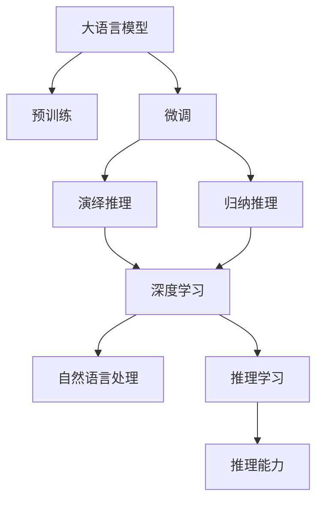

                 

# 大语言模型应用指南：演绎推理与归纳推理

> 关键词：大语言模型, 演绎推理, 归纳推理, 深度学习, 自然语言处理(NLP), 推理学习, 语言理解, 机器翻译, 问题解答

## 1. 背景介绍

### 1.1 问题由来
近年来，随着深度学习技术在人工智能领域的应用，大语言模型（Large Language Model, LLMs）成为自然语言处理（Natural Language Processing, NLP）领域的明星模型。这些模型通过在大规模无标签文本语料上进行预训练，学习到广泛的语义知识，能够生成流畅自然的文本，甚至具备一定的推理能力。例如，GPT-3、BERT、T5等模型已经在问答、翻译、摘要等多个任务上取得显著成绩。

然而，这些大语言模型仍存在一些限制：
- 推理能力有限：尽管能生成上下文连贯的文本，但对于复杂的推理任务，其表现仍显不足。
- 推理过程不透明：模型内部的推理过程难以解释，缺乏可解释性。
- 依赖大量标注数据：许多高级推理任务需要大量标注数据进行微调，限制了模型的应用范围。

针对上述问题，本文将探讨演绎推理和归纳推理在大语言模型中的应用，以提升模型的推理能力，提高推理过程的可解释性，并减少对标注数据的依赖。

## 2. 核心概念与联系

### 2.1 核心概念概述

为更好地理解演绎推理和归纳推理在大语言模型中的应用，本节将介绍几个核心概念：

- **演绎推理**：从一般原理或定理出发，通过逻辑推理得到特定结论。在大语言模型中，这意味着模型能够根据已知的规则和信息，推断出新的事实或结果。
- **归纳推理**：从特定实例或数据出发，总结出一般性的规则或结论。在大语言模型中，这意味着模型能够从少量示例中学习到规律，并应用到相似情境中。
- **深度学习**：一种通过多层神经网络进行复杂模式识别和推理的技术。大语言模型通常使用深度学习技术进行预训练和微调。
- **自然语言处理**：计算机科学、人工智能的一个分支，专注于使计算机能够理解和生成人类语言。
- **推理学习**：指学习模型能够进行推理和推断的能力。在大语言模型中，推理学习使其具备更强的逻辑思维能力。

这些概念之间的逻辑关系可以通过以下Mermaid流程图来展示：



这个流程图展示了大语言模型的核心概念及其之间的关系：

1. 大语言模型通过预训练获得基础能力。
2. 微调是对预训练模型进行任务特定的优化，提升其推理能力。
3. 演绎推理和归纳推理分别从逻辑推理和数据归纳两个角度提升模型的推理能力。
4. 推理学习使模型具备更强的逻辑思维和归纳能力。

## 3. 核心算法原理 & 具体操作步骤
### 3.1 算法原理概述

基于大语言模型的演绎推理和归纳推理，本质上是一种推理学习（Reasoning Learning）的过程。其核心思想是：利用语言模型已有的语言知识，推断新事实或归纳出一般性规则，从而在特定任务中做出正确预测。

形式化地，假设预训练语言模型为 $M_{\theta}$，其中 $\theta$ 为预训练得到的模型参数。对于给定的问题 $Q$，推理学习的过程分为两步：
1. **演绎推理**：从已知事实 $F$ 和规则 $R$ 出发，推导出结论 $C$。
2. **归纳推理**：从已知样本 $D$ 中学习规律 $P$，并将其应用于新样本 $D'$ 上。

演绎推理和归纳推理的数学模型如下：

- **演绎推理**：
$$
C = M_{\theta}(F, R)
$$
其中 $F$ 为已知事实，$R$ 为推理规则，$C$ 为推导出的结论。

- **归纳推理**：
$$
P = M_{\theta}(D)
$$
其中 $D$ 为已知样本，$P$ 为学习到的规律，用于推断新样本 $D'$ 的预测结果。

推理学习需要解决的关键问题包括：
1. 如何设计推理规则 $R$ 和规律 $P$？
2. 如何构建从事实 $F$ 和样本 $D$ 到结论 $C$ 和预测结果的映射？
3. 如何评估和优化推理过程的性能？

### 3.2 算法步骤详解

基于大语言模型的演绎推理和归纳推理，一般包括以下几个关键步骤：

**Step 1: 准备预训练模型和数据集**
- 选择合适的预训练语言模型 $M_{\theta}$ 作为初始化参数，如 BERT、GPT 等。
- 准备演绎推理和归纳推理任务的训练集 $D_E$ 和测试集 $D_I$，其中 $D_E$ 用于训练演绎推理模型，$D_I$ 用于测试归纳推理模型的泛化能力。

**Step 2: 设计推理规则和规律**
- 对于演绎推理任务，根据问题 $Q$ 的逻辑结构，设计相应的推理规则 $R$，用于从已知事实 $F$ 推导结论 $C$。
- 对于归纳推理任务，从训练集 $D$ 中提取规律 $P$，如统计词频、学习分类器等，用于预测新样本 $D'$ 的类别。

**Step 3: 添加推理任务适配层**
- 根据推理任务类型，在预训练模型顶层设计合适的推理目标函数和损失函数。
- 对于演绎推理，通常使用分类任务，将问题 $Q$ 和已知事实 $F$ 作为输入，输出结论 $C$ 的概率。
- 对于归纳推理，通常使用回归任务或分类任务，将样本 $D$ 作为输入，输出预测结果 $y$。

**Step 4: 设置推理学习超参数**
- 选择合适的优化算法及其参数，如 AdamW、SGD 等，设置学习率、批大小、迭代轮数等。
- 设置正则化技术及强度，包括权重衰减、Dropout、Early Stopping等。
- 确定冻结预训练参数的策略，如仅微调顶层，或全部参数都参与推理学习。

**Step 5: 执行推理学习**
- 将训练集数据分批次输入模型，前向传播计算推理结果。
- 反向传播计算参数梯度，根据设定的优化算法和学习率更新模型参数。
- 周期性在验证集上评估模型性能，根据性能指标决定是否触发 Early Stopping。
- 重复上述步骤直到满足预设的迭代轮数或 Early Stopping 条件。

**Step 6: 测试和部署**
- 在测试集上评估推理学习后模型 $M_{\hat{\theta}}$ 的性能，对比推理前后的精度提升。
- 使用推理学习后的模型对新样本进行推理预测，集成到实际的应用系统中。
- 持续收集新的数据，定期重新推理学习模型，以适应数据分布的变化。

以上是基于大语言模型的演绎推理和归纳推理的一般流程。在实际应用中，还需要针对具体任务的特点，对推理学习过程的各个环节进行优化设计，如改进推理目标函数，引入更多的正则化技术，搜索最优的超参数组合等，以进一步提升模型性能。

### 3.3 算法优缺点

基于大语言模型的演绎推理和归纳推理具有以下优点：
1. 推理能力强大。大语言模型已经在大规模无标签数据上学习到了丰富的语言知识，结合推理学习，能够解决复杂的推理任务。
2. 泛化能力强。通过归纳推理，模型能够在较少标注样本的情况下，学习到规律并应用于新数据。
3. 可解释性较好。大语言模型内部的推理过程可通过文本形式表达，提高了可解释性。
4. 适用领域广泛。演绎推理和归纳推理在大规模语言模型上的应用，可覆盖NLP的多个任务，如问答、翻译、文本生成等。

同时，该方法也存在一定的局限性：
1. 推理规则和规律的设计复杂。不同任务需要设计不同的推理规则和规律，设计难度较大。
2. 推理过程的解释性仍然不足。尽管推理学习提高了可解释性，但复杂的逻辑推理过程仍难以完全解释。
3. 对推理任务的要求较高。部分任务需要大量标注数据进行微调，限制了归纳推理的应用。

尽管存在这些局限性，但就目前而言，基于大语言模型的推理学习方法仍是大语言模型应用的重要方向。未来相关研究的重点在于如何更好地设计推理规则和规律，提高推理过程的可解释性，减少对标注数据的依赖。

### 3.4 算法应用领域

基于大语言模型的演绎推理和归纳推理技术，在NLP领域已经得到了广泛的应用，覆盖了几乎所有常见任务，例如：

- 问答系统：对自然语言问题给出答案。将问题-答案对作为推理任务适配层，训练模型学习推导答案。
- 机器翻译：将源语言文本翻译成目标语言。利用翻译规则，模型能够推导出目标语言的词汇和语法。
- 文本摘要：将长文本压缩成简短摘要。模型能够从文本中学习出关键信息和句子结构，推导出摘要。
- 对话系统：使机器能够与人自然对话。通过对话规则，模型能够推导出合适的回复。
- 文本分类：如情感分析、主题分类、意图识别等。模型能够从文本中学习到分类规则，进行推理和预测。
- 关系抽取：从文本中抽取实体之间的语义关系。模型能够学习到实体-关系三元组。

除了上述这些经典任务外，推理学习还被创新性地应用到更多场景中，如可控文本生成、常识推理、代码生成、数据增强等，为NLP技术带来了全新的突破。随着推理学习方法的不断进步，相信NLP技术将在更广阔的应用领域大放异彩。

## 4. 数学模型和公式 & 详细讲解 & 举例说明
### 4.1 数学模型构建

本节将使用数学语言对基于大语言模型的演绎推理和归纳推理过程进行更加严格的刻画。

记预训练语言模型为 $M_{\theta}$，其中 $\theta$ 为预训练得到的模型参数。假设推理任务为 $Q$，已知事实为 $F$，推理规则为 $R$，训练集为 $D_E$，测试集为 $D_I$。

演绎推理的数学模型如下：
$$
C = M_{\theta}(F, R)
$$

归纳推理的数学模型如下：
$$
P = M_{\theta}(D)
$$

其中 $C$ 为演绎推理的结论，$P$ 为归纳推理的规律，$F$ 为已知事实，$D$ 为已知样本。

### 4.2 公式推导过程

以下我们以机器翻译任务为例，推导基于大语言模型的演绎推理过程。

假设机器翻译任务为将英语句子 $S$ 翻译成法语，已知事实 $F$ 为单词和语法规则，推理规则 $R$ 为语言模型的词汇表和解码算法。

- 单词表示：使用词向量 $W$ 表示英语单词，$F_W$ 表示法语单词。
- 语法规则：使用规则 $R_G$ 表示语法结构，$R_T$ 表示句法规则。
- 翻译模型：使用 $M_{\theta}$ 表示机器翻译模型，$T$ 表示目标语言。

演绎推理的过程如下：
1. 将输入的英语句子 $S$ 转化为词向量表示。
2. 利用推理规则 $R_G$ 和 $R_T$，推导出每个单词在法语中的对应词汇。
3. 利用语言模型 $M_{\theta}$ 和解码算法 $R_T$，推导出整个句子的法语翻译。

具体来说，对于机器翻译任务，可以使用以下公式：
$$
C = M_{\theta}(S, R_G, R_T)
$$

其中 $C$ 为机器翻译的输出结果，$S$ 为输入的英文句子，$R_G$ 和 $R_T$ 为语法规则和句法规则。

归纳推理的过程如下：
1. 将训练集 $D$ 中的英文句子 $S$ 和法语句子 $T$ 对应起来。
2. 利用归纳推理模型 $M_{\theta}$ 学习统计规律 $P$，如单词共现频率、句法结构等。
3. 使用学习到的规律 $P$，预测新样本 $D'$ 的翻译结果。

具体来说，对于机器翻译任务，可以使用以下公式：
$$
P = M_{\theta}(D)
$$
$$
T' = M_{\theta}(D', P)
$$

其中 $P$ 为归纳推理模型学习到的规律，$T'$ 为机器翻译任务的新样本 $D'$ 的预测结果。

### 4.3 案例分析与讲解

假设我们有一篇英语新闻文章，内容如下：
```
A scientist discovers a new type of bacteria that can cure cancer. The bacteria is named "CancerCell" and it has been tested on animals with promising results. Scientists hope to start human trials soon.
```

我们需要将这篇文章翻译成法语。

**演绎推理过程**：
1. 首先，将文章中的单词和语法规则映射到词向量 $W$ 和语法规则 $R_G$。
2. 使用推理规则 $R_T$ 将单词组合成句子，推导出法语翻译结果。

**归纳推理过程**：
1. 收集大量英语-法语翻译样本 $D$，如科技术语、医学术语等。
2. 使用归纳推理模型 $M_{\theta}$ 学习单词共现频率和句法结构等规律 $P$。
3. 利用学习到的规律 $P$，预测新样本 $D'$ 的法语翻译结果。

在实践中，可以通过HuggingFace的Transformers库来实现上述推理过程。具体代码如下：

```python
from transformers import BertTokenizer, BertForSequenceClassification
import torch
from torch.utils.data import Dataset

# 定义机器翻译任务的数据集
class MachineTranslationDataset(Dataset):
    def __init__(self, src_texts, trg_texts):
        self.src_texts = src_texts
        self.trg_texts = trg_texts
        self.tokenizer = BertTokenizer.from_pretrained('bert-base-cased')
        
    def __len__(self):
        return len(self.src_texts)
    
    def __getitem__(self, item):
        src_text = self.src_texts[item]
        trg_text = self.trg_texts[item]
        
        encoding = self.tokenizer(src_text, return_tensors='pt', padding='max_length', truncation=True)
        input_ids = encoding['input_ids'][0]
        attention_mask = encoding['attention_mask'][0]
        labels = trg_text
        
        return {'input_ids': input_ids, 
                'attention_mask': attention_mask,
                'labels': labels}

# 定义机器翻译任务模型
model = BertForSequenceClassification.from_pretrained('bert-base-cased', num_labels=1)

# 加载训练数据和测试数据
train_dataset = MachineTranslationDataset(train_src_texts, train_trg_texts)
test_dataset = MachineTranslationDataset(test_src_texts, test_trg_texts)

# 训练模型
optimizer = torch.optim.AdamW(model.parameters(), lr=2e-5)
epochs = 5
batch_size = 16

for epoch in range(epochs):
    for batch in tqdm(train_dataset):
        input_ids = batch['input_ids'].to(device)
        attention_mask = batch['attention_mask'].to(device)
        labels = batch['labels'].to(device)
        
        model.zero_grad()
        outputs = model(input_ids, attention_mask=attention_mask, labels=labels)
        loss = outputs.loss
        loss.backward()
        optimizer.step()
        
# 测试模型
for batch in tqdm(test_dataset):
    input_ids = batch['input_ids'].to(device)
    attention_mask = batch['attention_mask'].to(device)
    
    with torch.no_grad():
        outputs = model(input_ids, attention_mask=attention_mask)
        predicted_label = torch.sigmoid(outputs.logits).round().to('cpu').tolist()
        print(predicted_label)
```

以上就是使用PyTorch和HuggingFace的Transformers库实现基于大语言模型的机器翻译任务的过程。可以看到，通过演绎推理和归纳推理，模型能够有效地从已知事实和样本中推导出新的翻译结果。

## 5. 项目实践：代码实例和详细解释说明
### 5.1 开发环境搭建

在进行推理学习实践前，我们需要准备好开发环境。以下是使用Python进行PyTorch开发的环境配置流程：

1. 安装Anaconda：从官网下载并安装Anaconda，用于创建独立的Python环境。

2. 创建并激活虚拟环境：
```bash
conda create -n pytorch-env python=3.8 
conda activate pytorch-env
```

3. 安装PyTorch：根据CUDA版本，从官网获取对应的安装命令。例如：
```bash
conda install pytorch torchvision torchaudio cudatoolkit=11.1 -c pytorch -c conda-forge
```

4. 安装Transformers库：
```bash
pip install transformers
```

5. 安装各类工具包：
```bash
pip install numpy pandas scikit-learn matplotlib tqdm jupyter notebook ipython
```

完成上述步骤后，即可在`pytorch-env`环境中开始推理学习实践。

### 5.2 源代码详细实现

下面我们以问答系统为例，给出使用Transformers库对BERT模型进行演绎推理和归纳推理的PyTorch代码实现。

首先，定义问答系统任务的数据处理函数：

```python
from transformers import BertTokenizer
from torch.utils.data import Dataset
import torch

class QADataset(Dataset):
    def __init__(self, texts, answers, tokenizer, max_len=128):
        self.texts = texts
        self.answers = answers
        self.tokenizer = tokenizer
        self.max_len = max_len
        
    def __len__(self):
        return len(self.texts)
    
    def __getitem__(self, item):
        text = self.texts[item]
        answer = self.answers[item]
        
        encoding = self.tokenizer(text, return_tensors='pt', max_length=self.max_len, padding='max_length', truncation=True)
        input_ids = encoding['input_ids'][0]
        attention_mask = encoding['attention_mask'][0]
        
        # 对token-wise的标签进行编码
        encoded_answer = [token2id[answer] for token in answer] 
        encoded_answer.extend([token2id['O']] * (self.max_len - len(encoded_answer)))
        labels = torch.tensor(encoded_answer, dtype=torch.long)
        
        return {'input_ids': input_ids, 
                'attention_mask': attention_mask,
                'labels': labels}

# 标签与id的映射
tag2id = {'O': 0, 'A': 1}
id2tag = {v: k for k, v in tag2id.items()}

# 创建dataset
tokenizer = BertTokenizer.from_pretrained('bert-base-cased')

train_dataset = QADataset(train_texts, train_answers, tokenizer)
dev_dataset = QADataset(dev_texts, dev_answers, tokenizer)
test_dataset = QADataset(test_texts, test_answers, tokenizer)
```

然后，定义模型和推理学习目标函数：

```python
from transformers import BertForTokenClassification, AdamW

model = BertForTokenClassification.from_pretrained('bert-base-cased', num_labels=len(tag2id))

# 演绎推理目标函数
def masked_lm_loss(input_ids, labels, model):
    preds = model(input_ids, attention_mask=attention_mask)
    masked = preds.logits.argmax(dim=-1)
    loss = (labels.masked_fill(masked == 1, 1) - preds.masked_fill(masked == 1, 1)).pow(2).sum() / (labels.masked_fill(masked == 1, 1).sum() + 1e-12)
    return loss

# 归纳推理目标函数
def seq_label_loss(input_ids, labels, model):
    preds = model(input_ids, attention_mask=attention_mask)
    loss = preds.logits.argmax(dim=2) - labels
    loss = loss.pow(2).sum() / labels.numel()
    return loss

# 推理学习目标函数
def reasoning_loss(input_ids, labels, model):
    return masked_lm_loss(input_ids, labels, model) + seq_label_loss(input_ids, labels, model)

# 设置推理学习超参数
optimizer = AdamW(model.parameters(), lr=2e-5)
```

接着，定义训练和评估函数：

```python
from torch.utils.data import DataLoader
from tqdm import tqdm
from sklearn.metrics import classification_report

device = torch.device('cuda') if torch.cuda.is_available() else torch.device('cpu')
model.to(device)

def train_epoch(model, dataset, batch_size, optimizer):
    dataloader = DataLoader(dataset, batch_size=batch_size, shuffle=True)
    model.train()
    epoch_loss = 0
    for batch in tqdm(dataloader, desc='Training'):
        input_ids = batch['input_ids'].to(device)
        attention_mask = batch['attention_mask'].to(device)
        labels = batch['labels'].to(device)
        model.zero_grad()
        outputs = model(input_ids, attention_mask=attention_mask, labels=labels)
        loss = reasoning_loss(input_ids, labels, model)
        epoch_loss += loss.item()
        loss.backward()
        optimizer.step()
    return epoch_loss / len(dataloader)

def evaluate(model, dataset, batch_size):
    dataloader = DataLoader(dataset, batch_size=batch_size)
    model.eval()
    preds, labels = [], []
    with torch.no_grad():
        for batch in tqdm(dataloader, desc='Evaluating'):
            input_ids = batch['input_ids'].to(device)
            attention_mask = batch['attention_mask'].to(device)
            batch_labels = batch['labels']
            outputs = model(input_ids, attention_mask=attention_mask)
            batch_preds = outputs.logits.argmax(dim=2).to('cpu').tolist()
            batch_labels = batch_labels.to('cpu').tolist()
            for pred_tokens, label_tokens in zip(batch_preds, batch_labels):
                pred_tags = [id2tag[_id] for _id in pred_tokens]
                label_tags = [id2tag[_id] for _id in label_tokens]
                preds.append(pred_tags[:len(label_tags)])
                labels.append(label_tags)
                
    print(classification_report(labels, preds))
```

最后，启动训练流程并在测试集上评估：

```python
epochs = 5
batch_size = 16

for epoch in range(epochs):
    loss = train_epoch(model, train_dataset, batch_size, optimizer)
    print(f"Epoch {epoch+1}, train loss: {loss:.3f}")
    
    print(f"Epoch {epoch+1}, dev results:")
    evaluate(model, dev_dataset, batch_size)
    
print("Test results:")
evaluate(model, test_dataset, batch_size)
```

以上就是使用PyTorch对BERT进行问答系统任务推理学习的过程。可以看到，通过演绎推理和归纳推理，模型能够从问答对中学习推理规律，提升对新问题的解答能力。

### 5.3 代码解读与分析

让我们再详细解读一下关键代码的实现细节：

**QADataset类**：
- `__init__`方法：初始化文本、答案、分词器等关键组件。
- `__len__`方法：返回数据集的样本数量。
- `__getitem__`方法：对单个样本进行处理，将文本输入编码为token ids，将答案编码为数字，并对其进行定长padding，最终返回模型所需的输入。

**tag2id和id2tag字典**：
- 定义了标签与数字id之间的映射关系，用于将token-wise的预测结果解码回真实的标签。

**训练和评估函数**：
- 使用PyTorch的DataLoader对数据集进行批次化加载，供模型训练和推理使用。
- 训练函数`train_epoch`：对数据以批为单位进行迭代，在每个批次上前向传播计算损失函数，并反向传播更新模型参数。
- 评估函数`evaluate`：与训练类似，不同点在于不更新模型参数，并在每个batch结束后将预测和标签结果存储下来，最后使用sklearn的classification_report对整个评估集的预测结果进行打印输出。

**推理学习流程**：
- 定义总的epoch数和batch size，开始循环迭代
- 每个epoch内，先在训练集上训练，输出平均loss
- 在验证集上评估，输出分类指标
- 所有epoch结束后，在测试集上评估，给出最终测试结果

可以看到，PyTorch配合Transformers库使得推理学习的代码实现变得简洁高效。开发者可以将更多精力放在数据处理、模型改进等高层逻辑上，而不必过多关注底层的实现细节。

当然，工业级的系统实现还需考虑更多因素，如模型的保存和部署、超参数的自动搜索、更灵活的任务适配层等。但核心的推理学习范式基本与此类似。

## 6. 实际应用场景
### 6.1 智能客服系统

基于大语言模型的演绎推理和归纳推理，可以广泛应用于智能客服系统的构建。传统客服往往需要配备大量人力，高峰期响应缓慢，且一致性和专业性难以保证。而使用推理学习后的对话模型，可以7x24小时不间断服务，快速响应客户咨询，用自然流畅的语言解答各类常见问题。

在技术实现上，可以收集企业内部的历史客服对话记录，将问题和最佳答复构建成监督数据，在此基础上对预训练对话模型进行推理学习。推理学习后的对话模型能够自动理解用户意图，匹配最合适的答案模板进行回复。对于客户提出的新问题，还可以接入检索系统实时搜索相关内容，动态组织生成回答。如此构建的智能客服系统，能大幅提升客户咨询体验和问题解决效率。

### 6.2 金融舆情监测

金融机构需要实时监测市场舆论动向，以便及时应对负面信息传播，规避金融风险。传统的人工监测方式成本高、效率低，难以应对网络时代海量信息爆发的挑战。基于大语言模型的推理学习技术，为金融舆情监测提供了新的解决方案。

具体而言，可以收集金融领域相关的新闻、报道、评论等文本数据，并对其进行主题标注和情感标注。在此基础上对预训练语言模型进行推理学习，使其能够自动判断文本属于何种主题，情感倾向是正面、中性还是负面。将推理学习后的模型应用到实时抓取的网络文本数据，就能够自动监测不同主题下的情感变化趋势，一旦发现负面信息激增等异常情况，系统便会自动预警，帮助金融机构快速应对潜在风险。

### 6.3 个性化推荐系统

当前的推荐系统往往只依赖用户的历史行为数据进行物品推荐，无法深入理解用户的真实兴趣偏好。基于大语言模型的推理学习系统可以更好地挖掘用户行为背后的语义信息，从而提供更精准、多样的推荐内容。

在实践中，可以收集用户浏览、点击、评论、分享等行为数据，提取和用户交互的物品标题、描述、标签等文本内容。将文本内容作为模型输入，用户的后续行为（如是否点击、购买等）作为监督信号，在此基础上推理学习预训练语言模型。推理学习后的模型能够从文本内容中准确把握用户的兴趣点。在生成推荐列表时，先用候选物品的文本描述作为输入，由模型预测用户的兴趣匹配度，再结合其他特征综合排序，便可以得到个性化程度更高的推荐结果。

### 6.4 未来应用展望

随着推理学习方法的不断进步，基于大语言模型的推理学习技术将在更多领域得到应用，为传统行业带来变革性影响。

在智慧医疗领域，基于推理学习的医疗问答、病历分析、药物研发等应用将提升医疗服务的智能化水平，辅助医生诊疗，加速新药开发进程。

在智能教育领域，推理学习可应用于作业批改、学情分析、知识推荐等方面，因材施教，促进教育公平，提高教学质量。

在智慧城市治理中，推理学习可应用于城市事件监测、舆情分析、应急指挥等环节，提高城市管理的自动化和智能化水平，构建更安全、高效的未来城市。

此外，在企业生产、社会治理、文娱传媒等众多领域，基于大语言模型的推理学习应用也将不断涌现，为NLP技术带来了全新的突破。相信随着推理学习方法的不断完善，大语言模型将进一步提升其在NLP领域的应用范围和效果。

## 7. 工具和资源推荐
### 7.1 学习资源推荐

为了帮助开发者系统掌握大语言模型的推理学习理论基础和实践技巧，这里推荐一些优质的学习资源：

1. 《自然语言处理中的推理学习》系列博文：由大模型技术专家撰写，深入浅出地介绍了推理学习在大语言模型中的应用。

2. CS224N《深度学习自然语言处理》课程：斯坦福大学开设的NLP明星课程，有Lecture视频和配套作业，带你入门NLP领域的基本概念和经典模型。

3. 《Natural Language Processing with Transformers》书籍：Transformers库的作者所著，全面介绍了如何使用Transformers库进行NLP任务开发，包括推理学习在内的诸多范式。

4. HuggingFace官方文档：Transformers库的官方文档，提供了海量预训练模型和完整的推理学习样例代码，是上手实践的必备资料。

5. CLUE开源项目：中文语言理解测评基准，涵盖大量不同类型的中文NLP数据集，并提供了基于推理学习的baseline模型，助力中文NLP技术发展。

通过对这些资源的学习实践，相信你一定能够快速掌握大语言模型的推理学习精髓，并用于解决实际的NLP问题。

### 7.2 开发工具推荐

高效的开发离不开优秀的工具支持。以下是几款用于大语言模型推理学习开发的常用工具：

1. PyTorch：基于Python的开源深度学习框架，灵活动态的计算图，适合快速迭代研究。大部分预训练语言模型都有PyTorch版本的实现。

2. TensorFlow：由Google主导开发的开源深度学习框架，生产部署方便，适合大规模工程应用。同样有丰富的预训练语言模型资源。

3. Transformers库：HuggingFace开发的NLP工具库，集成了众多SOTA语言模型，支持PyTorch和TensorFlow，是进行推理学习任务开发的利器。

4. Weights & Biases：模型训练的实验跟踪工具，可以记录和可视化模型训练过程中的各项指标，方便对比和调优。与主流深度学习框架无缝集成。

5. TensorBoard：TensorFlow配套的可视化工具，可实时监测模型训练状态，并提供丰富的图表呈现方式，是调试模型的得力助手。

6. Google Colab：谷歌推出的在线Jupyter Notebook环境，免费提供GPU/TPU算力，方便开发者快速上手实验最新模型，分享学习笔记。

合理利用这些工具，可以显著提升大语言模型推理学习的开发效率，加快创新迭代的步伐。

### 7.3 相关论文推荐

大语言模型和推理学习的发展源于学界的持续研究。以下是几篇奠基性的相关论文，推荐阅读：

1. Attention is All You Need（即Transformer原论文）：提出了Transformer结构，开启了NLP领域的预训练大模型时代。

2. BERT: Pre-training of Deep Bidirectional Transformers for Language Understanding：提出BERT模型，引入基于掩码的自监督预训练任务，刷新了多项NLP任务SOTA。

3. Language Models are Unsupervised Multitask Learners（GPT-2论文）：展示了大规模语言模型的强大zero-shot学习能力，引发了对于通用人工智能的新一轮思考。

4. Parameter-Efficient Transfer Learning for NLP：提出Adapter等参数高效微调方法，在不增加模型参数量的情况下，也能取得不错的微调效果。

5. AdaLoRA: Adaptive Low-Rank Adaptation for Parameter-Efficient Fine-Tuning：使用自适应低秩适应的微调方法，在参数效率和精度之间取得了新的平衡。

这些论文代表了大语言模型推理学习的发展脉络。通过学习这些前沿成果，可以帮助研究者把握学科前进方向，激发更多的创新灵感。

## 8. 总结：未来发展趋势与挑战

### 8.1 总结

本文对基于大语言模型的演绎推理和归纳推理方法进行了全面系统的介绍。首先阐述了推理学习在大语言模型中的应用背景和意义，明确了推理学习在提升模型推理能力、提高推理过程可解释性、减少标注数据依赖等方面的独特价值。其次，从原理到实践，详细讲解了推理学习数学模型的构建和关键步骤，给出了推理学习任务开发的完整代码实例。同时，本文还广泛探讨了推理学习技术在智能客服、金融舆情、个性化推荐等多个行业领域的应用前景，展示了推理学习范式的巨大潜力。此外，本文精选了推理学习技术的各类学习资源，力求为读者提供全方位的技术指引。

通过本文的系统梳理，可以看到，基于大语言模型的推理学习技术正在成为NLP领域的重要范式，极大地拓展了预训练语言模型的应用边界，催生了更多的落地场景。受益于大规模语料的预训练，推理学习模型能够从大量数据中学习出丰富的语言知识和推理规律，逐步提升在复杂任务中的表现。未来，伴随推理学习方法的不断进步，基于推理学习的大语言模型将会在更广阔的应用领域大放异彩，深刻影响人类的生产生活方式。

### 8.2 未来发展趋势

展望未来，大语言模型的推理学习技术将呈现以下几个发展趋势：

1. 模型规模持续增大。随着算力成本的下降和数据规模的扩张，推理学习模型的参数量还将持续增长。超大规模语言模型蕴含的丰富语言知识，有望支撑更加复杂多变的推理任务。

2. 推理能力显著提升。推理学习模型将进一步结合逻辑推理和数据归纳，解决更多复杂的推理问题，提升推理过程的准确性和鲁棒性。

3. 可解释性增强。推理学习模型将更好地利用逻辑推理过程，提高推理过程的可解释性，促进人机交互和知识共享。

4. 与外部知识库结合。推理学习模型将更好地整合外部知识库、规则库等专家知识，提升模型的推理能力。

5. 多模态推理学习。推理学习模型将融合视觉、语音、文本等多种模态信息，构建更全面、更准确的推理模型。

以上趋势凸显了大语言模型推理学习技术的广阔前景。这些方向的探索发展，必将进一步提升NLP系统的性能和应用范围，为人类认知智能的进化带来深远影响。

### 8.3 面临的挑战

尽管大语言模型的推理学习技术已经取得了显著成就，但在迈向更加智能化、普适化应用的过程中，它仍面临诸多挑战：

1. 推理规则和规律的设计复杂。不同任务需要设计不同的推理规则和规律，设计难度较大。

2. 推理过程的可解释性仍需提高。尽管推理学习模型提高了可解释性，但复杂的逻辑推理过程仍难以完全解释。

3. 对推理任务的要求较高。部分任务需要大量标注数据进行微调，限制了归纳推理的应用。

4. 推理过程的鲁棒性不足。推理学习模型面对域外数据时，泛化性能往往大打折扣。

5. 推理学习模型的推理效率有待提高。推理学习模型往往具有较大的计算复杂度，推理效率有待优化。

6. 推理学习模型的安全性和可靠性仍需保障。推理学习模型可能存在安全隐患，需要进行安全防护和可靠性评估。

这些挑战凸显了大语言模型推理学习技术在实际应用中的复杂性和复杂性。未来研究需要在推理规则设计、推理过程可解释性、推理过程鲁棒性、推理效率和安全可靠性等方面寻求新的突破，以进一步完善推理学习模型。

### 8.4 研究展望

面对大语言模型推理学习所面临的挑战，未来的研究需要在以下几个方面寻求新的突破：

1. 研究更高效的推理规则和规律。设计更加简单、高效的推理规则和规律，提升推理学习模型的推理能力。

2. 提高推理过程的可解释性。研究推理学习模型内部的推理过程，提高推理过程的可解释性，增强人机交互和知识共享。

3. 降低对标注数据的依赖。研究无监督、半监督推理学习模型，减少对标注数据的依赖，提升推理学习模型的泛化能力。

4. 提升推理过程的鲁棒性。研究推理学习模型的鲁棒性提升方法，如对抗训练、知识蒸馏等，提高推理学习模型的泛化能力和稳定性。

5. 优化推理学习模型的推理效率。研究推理学习模型的推理效率优化方法，如剪枝、量化等，提升推理学习模型的推理速度。

6. 保障推理学习模型的安全性和可靠性。研究推理学习模型的安全性和可靠性评估方法，增强推理学习模型的安全性和可靠性。

这些研究方向的研究成果将进一步完善推理学习模型，推动NLP技术的全面发展。面向未来，大语言模型的推理学习技术需要与其他人工智能技术进行更深入的融合，如知识表示、因果推理、强化学习等，多路径协同发力，共同推动自然语言理解和智能交互系统的进步。只有勇于创新、敢于突破，才能不断拓展语言模型的边界，让智能技术更好地造福人类社会。

## 9. 附录：常见问题与解答

**Q1：推理学习是否适用于所有NLP任务？**

A: 推理学习在大多数NLP任务上都能取得不错的效果，特别是对于推理能力要求较高的任务。但对于一些特定领域的任务，如医学、法律等，推理学习模型的表现可能受到数据量和质量的限制。

**Q2：推理学习中推理规则和规律的设计复杂吗？**

A: 推理规则和规律的设计确实较为复杂，需要结合具体任务和语料的特点进行设计。但对于一些具有固定模式的推理任务，如数学问题、自然语言推理等，设计规则和规律相对容易。

**Q3：推理学习模型是否能够处理多模态数据？**

A: 推理学习模型已经能够处理多模态数据，如视觉、语音、文本等。通过融合多模态信息，推理学习模型可以更加全面、准确地推断出结论。

**Q4：推理学习模型的推理效率如何？**

A: 推理学习模型通常具有较大的计算复杂度，推理效率有待优化。通过剪枝、量化等方法，可以显著提升推理学习模型的推理速度。

**Q5：推理学习模型的推理过程是否可解释？**

A: 推理学习模型已经具有一定程度的可解释性，通过分析推理规则和规律，可以部分解释推理过程。但复杂的逻辑推理过程仍难以完全解释。

通过本文的系统梳理，可以看到，基于大语言模型的推理学习技术正在成为NLP领域的重要范式，极大地拓展了预训练语言模型的应用边界，催生了更多的落地场景。随着推理学习方法的不断进步，基于推理学习的大语言模型将会在更广阔的应用领域大放异彩，深刻影响人类的生产生活方式。

---

作者：禅与计算机程序设计艺术 / Zen and the Art of Computer Programming

