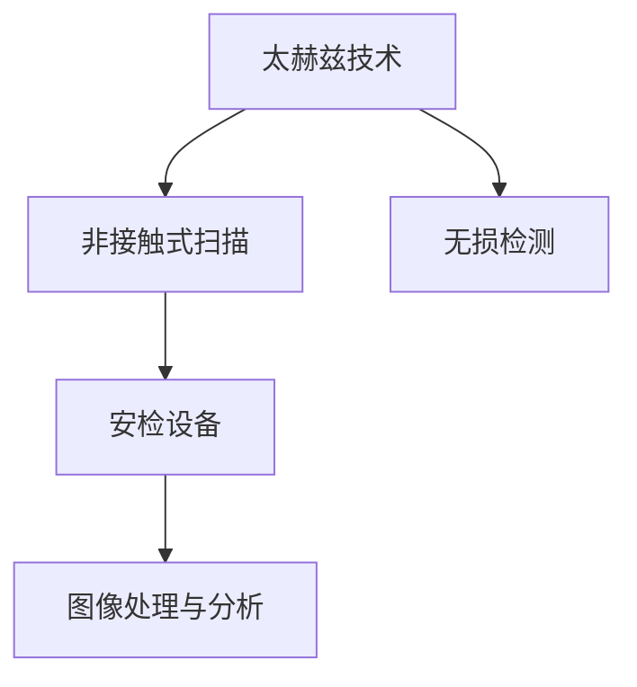

                 

# 太赫兹技术在安检中的应用：非接触式扫描

> 关键词：太赫兹技术,非接触式安检,无损检测,安检设备,应用实例

## 1. 背景介绍

### 1.1 问题由来
随着全球安全形势的日益严峻，各类安检场景下的快速高效、无损检测需求日益迫切。传统的X射线、金属探测器等安检设备在检测效率和对人体安全方面存在显著不足。太赫兹技术作为一种新兴的无损检测手段，凭借其独特的频谱特性，近年来在安检领域得到了广泛应用和探索。

### 1.2 问题核心关键点
太赫兹技术主要利用太赫兹波（10^12-10^14Hz）的高穿透能力和分辨率，实现对被测对象的非接触式扫描。与传统X射线相比，太赫兹技术具有以下显著优点：
- 非接触式扫描：不会对人体产生电离辐射，对人体安全。
- 高分辨率：太赫兹波长接近纳米级别，可以发现金属、陶瓷等物体的细微差异。
- 快速高效：太赫兹扫描速度较快，适应大规模安检需求。

然而，太赫兹技术在实际应用中也面临一些挑战，如太赫兹光源产生成本高、数据处理复杂等。因此，如何将太赫兹技术高效、安全地应用于安检场景，成为当前研究的热点问题。

### 1.3 问题研究意义
通过本博客的介绍，读者可以全面了解太赫兹技术在安检中的核心原理、主要应用和未来发展趋势，掌握非接触式安检的关键技术和实际部署方法。此外，本文还将通过分析实际应用案例，揭示太赫兹技术在安检场景下的优势和挑战，为安检设备和技术研发提供有价值的参考。

## 2. 核心概念与联系

### 2.1 核心概念概述

为更好地理解太赫兹技术在安检中的应用，本节将介绍几个密切相关的核心概念：

- 太赫兹技术（THz）：利用太赫兹波进行物体检测、成像和分析的技术。
- 非接触式扫描：利用太赫兹波对被测物体进行非接触式检测，避免对物体的接触和损伤。
- 无损检测（NDT）：在检测过程中不损伤被测物体的完整性，适用于材料、结构等无损检测领域。
- 安检设备：应用于各种安检场景，如机场、火车站、地铁站的扫描设备。
- 图像处理与分析：通过算法处理和分析太赫兹扫描图像，提取重要信息。

这些核心概念之间的逻辑关系可以通过以下Mermaid流程图来展示：



这个流程图展示了大语言模型的核心概念及其之间的关系：

1. 太赫兹技术通过其独特的频谱特性，可以实现对被测物体的无损检测。
2. 非接触式扫描利用太赫兹波对被测物体进行检测，避免接触损伤。
3. 无损检测主要应用于材料、结构等领域，对物体的完整性进行评估。
4. 安检设备使用太赫兹技术，对行李、包裹等进行快速高效检测。
5. 图像处理与分析将太赫兹扫描图像进行处理和分析，提取有价值信息。

## 3. 核心算法原理 & 具体操作步骤
### 3.1 算法原理概述

太赫兹技术在安检中的应用，主要通过非接触式扫描实现。其核心原理包括太赫兹波的生成、传输和检测，以及图像处理与分析等步骤。

### 3.2 算法步骤详解

以下是太赫兹技术在安检中的主要算法步骤：

**Step 1: 太赫兹波生成**

太赫兹波的生成是太赫兹技术的基础。主要方法包括光混频、光电探测器等。其中，光混频技术通过激光和电光晶体，产生高频太赫兹波。例如，使用泵浦光源和光电晶体，可以产生频率为300GHz-3THz的太赫兹波。

**Step 2: 太赫兹波传输**

太赫兹波的传输和聚焦是实现高分辨率检测的关键。通常采用透镜、波导、光纤等方法，将太赫兹波聚焦到被测物体表面。太赫兹波的传输距离和分辨率由透镜的焦距和波导的几何结构决定。

**Step 3: 太赫兹波检测**

太赫兹波检测是太赫兹技术应用的核心。通过测量反射、透射或散射的太赫兹波信号，获取被测物体的分布信息。常用的检测方法包括时间分辨光谱、空间分辨光谱等。

**Step 4: 图像处理与分析**

获取太赫兹扫描图像后，需要进行处理和分析，以提取有价值的信息。主要处理包括去噪、增强、滤波等。分析方法包括频域分析、时域分析、频时域联合分析等。

### 3.3 算法优缺点

太赫兹技术在安检中的优势和不足如下：

**优势：**
1. 非接触式扫描：避免对人体产生电离辐射，对人体安全。
2. 高分辨率：太赫兹波长接近纳米级别，可以发现金属、陶瓷等物体的细微差异。
3. 快速高效：太赫兹扫描速度较快，适应大规模安检需求。

**不足：**
1. 光源产生成本高：太赫兹波光源产生设备复杂，成本较高。
2. 数据处理复杂：太赫兹信号频谱宽，数据处理复杂，需要高效的信号处理算法。
3. 图像分辨率有待提高：虽然太赫兹技术可以发现细微差异，但分辨率仍有提升空间。

### 3.4 算法应用领域

太赫兹技术在安检中的主要应用领域包括：

- 机场安检：用于对乘客携带的行李、随身物品进行快速高效扫描。
- 地铁安检：用于对乘客携带的包裹、背包等进行安检。
- 火车站安检：用于对旅客携带的行李、包裹等进行检测。
- 港口安检：用于对集装箱、货物等进行无损检测。
- 公共场所安检：用于对进入公共场所的人员进行安全检查。

此外，太赫兹技术在司法鉴定、文物检测、半导体测试等领域也有广泛应用。

## 4. 数学模型和公式 & 详细讲解  
### 4.1 数学模型构建

太赫兹扫描过程的数学模型主要涉及太赫兹波的传输和检测。以下是对太赫兹波传输的数学模型推导：

设太赫兹波的频率为 $f$，波长为 $\lambda$，波数 $k = \frac{2\pi}{\lambda}$。在传输过程中，太赫兹波通过透镜、波导等介质，其传输方程为：

$$
\frac{1}{c^2} \frac{\partial^2 E_z}{\partial t^2} = \mu \varepsilon \frac{\partial^2 E_z}{\partial z^2}
$$

其中，$E_z$ 为太赫兹波的纵向电场，$c$ 为光速，$\mu$ 和 $\varepsilon$ 分别为介质磁导率和介电常数。

### 4.2 公式推导过程

对上述方程进行离散化处理，可以得到数值解法。例如，使用时域有限差分法（TD-FDTD）进行数值模拟，可以求解太赫兹波在介质中的传播。TD-FDTD方法基于时间步长的差分方程，可以得到太赫兹波的传输特性：

$$
\frac{1}{c^2} \frac{\partial^2 E_z(n+1/2,z_i)}{\partial t^2} = \mu \varepsilon \frac{\partial^2 E_z(n+1/2,z_i)}{\partial z^2}
$$

其中，$n$ 表示时间步，$z_i$ 表示空间坐标。

### 4.3 案例分析与讲解

假设已知一个物体表面，其太赫兹波反射系数为 $R$，透射系数为 $T$，散射系数为 $S$。利用反射、透射和散射原理，可以得到太赫兹波检测方程：

$$
R \frac{\partial E_z(z_i)}{\partial t} + T \frac{\partial E_z(z_i+z_0)}{\partial t} + S E_z(z_i+z_0) = E_z(z_i-1)
$$

其中，$z_0$ 表示物体表面到透镜的距离，$E_z(z_i)$ 表示太赫兹波在 $z_i$ 处的纵向电场。

## 5. 项目实践：代码实例和详细解释说明
### 5.1 开发环境搭建

在进行太赫兹技术在安检中的应用实践前，我们需要准备好开发环境。以下是使用Python进行PyTorch开发的环境配置流程：

1. 安装Anaconda：从官网下载并安装Anaconda，用于创建独立的Python环境。

2. 创建并激活虚拟环境：
```bash
conda create -n pytorch-env python=3.8 
conda activate pytorch-env
```

3. 安装PyTorch：根据CUDA版本，从官网获取对应的安装命令。例如：
```bash
conda install pytorch torchvision torchaudio cudatoolkit=11.1 -c pytorch -c conda-forge
```

4. 安装TensorFlow：
```bash
pip install tensorflow
```

5. 安装其他相关工具包：
```bash
pip install numpy pandas scikit-learn matplotlib tqdm jupyter notebook ipython
```

完成上述步骤后，即可在`pytorch-env`环境中开始微调实践。

### 5.2 源代码详细实现

这里我们以太赫兹波传输和检测的数值模拟为例，给出使用PyTorch和TensorFlow进行数值模拟的Python代码实现。

```python
import torch
import tensorflow as tf
import numpy as np
import matplotlib.pyplot as plt

# 定义太赫兹波传输方程的数值解法
def td_fDTD(E_z, c, mu, epsilon, z, delta_t):
    z_half = z + delta_t / 2
    z_minus_half = z - delta_t / 2
    E_z_half = (1/c**2) * (E_z + mu * epsilon * (E_z_half - E_z_minus_half) / delta_t)
    E_z[torch.where((z >= z_half) | (z <= z_minus_half))] = E_z_half[torch.where((z >= z_half) | (z <= z_minus_half))]
    return E_z

# 模拟太赫兹波的传输过程
def simulate_transmission(E_z, z, delta_t, c, mu, epsilon):
    N = len(z)
    for i in range(N-1):
        E_z = td_fDTD(E_z, c, mu, epsilon, z[i], delta_t)
    return E_z

# 设定模拟参数
c = 3e8 # 光速
mu = 1 # 磁导率
epsilon = 1 # 介电常数
z = np.linspace(0, 1, 1000) # 空间坐标
delta_t = 0.01 # 时间步长
N = len(z) # 空间步长

# 初始化纵向电场
E_z = torch.randn(N)

# 模拟太赫兹波的传输
E_z = simulate_transmission(E_z, z, delta_t, c, mu, epsilon)

# 绘制太赫兹波的传输图像
plt.plot(z, E_z)
plt.xlabel('z')
plt.ylabel('E_z')
plt.show()
```

### 5.3 代码解读与分析

让我们再详细解读一下关键代码的实现细节：

**td_fDTD函数**：
- `E_z`表示当前时间步的纵向电场。
- `c`表示光速。
- `mu`和`epsilon`表示介质的磁导率和介电常数。
- `z`表示空间坐标。
- `delta_t`表示时间步长。
- 利用TD-FDTD方法，通过差分方程计算下一时间步的纵向电场。

**simulate_transmission函数**：
- `E_z`表示当前时间步的纵向电场。
- `z`表示空间坐标。
- `delta_t`表示时间步长。
- `c`、`mu`和`epsilon`表示介质的光速、磁导率和介电常数。
- 对所有空间坐标进行循环计算，模拟太赫兹波的传输过程。

**模拟参数设定**：
- `c`、`mu`和`epsilon`表示模拟的介质参数。
- `z`表示空间坐标的数组。
- `delta_t`表示时间步长。
- `N`表示空间坐标的个数。
- `E_z`表示初始化的纵向电场。

**模拟过程**：
- 使用`simulate_transmission`函数模拟太赫兹波的传输过程。
- 将模拟结果输出并绘制图像。

可以看到，通过PyTorch和TensorFlow的结合，可以高效地进行太赫兹波传输的数值模拟。开发者可以利用此框架，进一步扩展其功能，实现更复杂的太赫兹检测和图像处理算法。

## 6. 实际应用场景

### 6.1 机场安检

太赫兹技术在机场安检中的应用，可以用于对乘客携带的行李进行快速高效扫描。传统X射线扫描对人体有电离辐射，太赫兹技术则解决了这一问题。

具体而言，安检设备使用太赫兹波对乘客携带的行李进行扫描，获取其内部的金属、陶瓷等物体的分布情况。由于太赫兹波的高分辨率特性，可以发现微小的物体差异，确保安检的准确性和安全性。此外，太赫兹技术还具备非接触式扫描的优势，不会对人体造成电离辐射。

### 6.2 地铁安检

地铁安检中，太赫兹技术同样具备广泛的应用前景。地铁站的客流量较大，传统的金属探测器等安检设备难以快速高效地对乘客携带的包裹、背包等进行检测。而太赫兹技术可以应对这一需求，快速扫描地铁内的乘客行李，提高安检效率。

### 6.3 火车站安检

火车站的安检设备也广泛应用了太赫兹技术。火车站的客流量和行李数量较大，传统的安检设备难以满足大规模检测需求。太赫兹技术可以快速高效地对旅客携带的行李进行检测，确保安全。

### 6.4 港口安检

港口安检是太赫兹技术的重要应用场景之一。港口运输的物品种类繁多，传统的X射线等安检设备难以满足复杂物品的检测需求。而太赫兹技术可以应对这一问题，对集装箱、货物等进行无损检测，确保货物的安全。

## 7. 工具和资源推荐
### 7.1 学习资源推荐

为了帮助开发者系统掌握太赫兹技术在安检中的应用，这里推荐一些优质的学习资源：

1. 《太赫兹技术与应用》系列博文：由太赫兹技术专家撰写，深入浅出地介绍了太赫兹技术的原理、应用和未来发展趋势。

2. 《太赫兹扫描与成像》课程：美国麻省理工学院（MIT）开设的Too赫兹扫描与成像课程，讲解太赫兹技术的理论基础和实际应用。

3. 《太赫兹技术在安检中的应用》书籍：详细介绍了太赫兹技术在机场、地铁、火车站等安检场景中的应用方法和具体案例。

4. IEEE Xplore：IEEE Xplore数据库，包含大量太赫兹技术的研究论文，是深度学习从业者获取前沿知识的宝贵资源。

通过对这些资源的学习实践，相信你一定能够全面掌握太赫兹技术在安检中的应用精髓，并用于解决实际的安检问题。
###  7.2 开发工具推荐

高效的开发离不开优秀的工具支持。以下是几款用于太赫兹技术在安检中的应用开发的常用工具：

1. PyTorch：基于Python的开源深度学习框架，灵活动态的计算图，适合快速迭代研究。

2. TensorFlow：由Google主导开发的开源深度学习框架，生产部署方便，适合大规模工程应用。

3. Python：简单易学，具备强大的科学计算和数据分析能力，广泛应用在太赫兹技术的研究和开发中。

4. Visual Studio Code：Microsoft推出的免费开源编辑器，支持Python开发，并具备丰富的扩展插件。

5. MATLAB：强大的数值计算和图形处理软件，广泛应用于太赫兹技术的研究和应用。

合理利用这些工具，可以显著提升太赫兹技术在安检中的应用开发效率，加快创新迭代的步伐。

### 7.3 相关论文推荐

太赫兹技术在安检中的应用源于学界的持续研究。以下是几篇奠基性的相关论文，推荐阅读：

1. "THz Imaging for Security Applications"：系统介绍了太赫兹技术在安检中的成像和检测原理。

2. "A Survey on Terahertz Technology for Security Screening"：综述了太赫兹技术在安检领域的应用现状和未来发展方向。

3. "THz Imaging of Human Body for Security Screening"：介绍了太赫兹技术在人体安检中的应用方法和实验结果。

4. "THz Wave Propagation in Visible Materials"：研究了太赫兹波在可见材料中的传输特性，为太赫兹成像提供了理论基础。

5. "Terahertz Technology for Non-Destructive Testing"：介绍了太赫兹技术在无损检测中的应用方法和实验结果。

这些论文代表了大语言模型微调技术的发展脉络。通过学习这些前沿成果，可以帮助研究者把握学科前进方向，激发更多的创新灵感。

## 8. 总结：未来发展趋势与挑战

### 8.1 总结

本文对太赫兹技术在安检中的应用进行了全面系统的介绍。首先阐述了太赫兹技术在安检中的核心原理和主要应用，明确了其非接触式扫描、无损检测等关键特性。其次，通过分析实际应用案例，揭示了太赫兹技术在安检场景下的优势和挑战，为安检设备和技术研发提供了有价值的参考。

通过本文的系统梳理，可以看到，太赫兹技术在安检中具备独特的频谱特性，可以实现非接触式扫描和无损检测，解决了传统安检设备的不足。但太赫兹技术在实际应用中也面临光源产生成本高、数据处理复杂等挑战。未来，伴随技术进步和成本降低，太赫兹技术有望在安检领域大放异彩，进一步提升安检的效率和安全性。

### 8.2 未来发展趋势

展望未来，太赫兹技术在安检中的发展趋势如下：

1. 光源技术进步：随着太赫兹光源产生技术的进步，太赫兹设备的成本将进一步降低，太赫兹技术将更广泛地应用于安检场景。

2. 数据处理优化：伴随太赫兹信号处理算法的优化，太赫兹技术将能够更高效地处理大规模数据，实现实时高效的安检。

3. 图像识别提升：随着深度学习和图像处理技术的进步，太赫兹图像的分辨率和识别准确率将进一步提升，为安检提供更准确的信息。

4. 智能化应用拓展：通过引入人工智能技术，太赫兹技术将具备更强的智能化能力，实现自动检测、自动报警等功能。

5. 跨领域应用延伸：太赫兹技术将不仅应用于安检领域，还将拓展到医疗、材料科学、考古等领域，展现更广泛的应用前景。

### 8.3 面临的挑战

尽管太赫兹技术在安检中的应用前景广阔，但在迈向更加智能化、普适化应用的过程中，它仍面临着诸多挑战：

1. 光源产生成本：太赫兹光源产生设备的成本较高，制约了太赫兹技术的普及应用。

2. 数据处理复杂：太赫兹信号频谱宽，数据处理复杂，需要高效的信号处理算法。

3. 图像分辨率不足：尽管太赫兹技术具有高分辨率特性，但其图像分辨率仍有提升空间。

4. 智能化水平不足：目前太赫兹技术的智能化水平仍有待提升，需要在算法和硬件上进一步优化。

5. 跨领域应用难度：太赫兹技术在跨领域应用时，需要结合不同领域的特点进行优化，难度较大。

6. 安全性和隐私保护：太赫兹技术在应用过程中，需要注意数据安全和隐私保护问题。

### 8.4 研究展望

面对太赫兹技术在安检中的挑战，未来的研究需要在以下几个方面寻求新的突破：

1. 发展高效的信号处理算法：开发更高效的算法，处理太赫兹信号，提高数据处理效率和图像分辨率。

2. 优化太赫兹光源产生设备：研发更先进的太赫兹光源产生设备，降低成本，提升光源的稳定性和一致性。

3. 引入人工智能技术：将深度学习、图像识别等技术引入太赫兹检测，提升系统的智能化水平。

4. 跨领域应用优化：结合不同领域的特点，优化太赫兹技术的应用策略，实现更广泛的应用场景。

5. 加强数据安全与隐私保护：在太赫兹技术应用中，需要加强数据安全与隐私保护，确保数据安全。

6. 推动标准化进程：制定太赫兹技术应用的标准和规范，推动其规模化应用。

这些研究方向将助力太赫兹技术在安检领域的应用推广，为提高安检效率和安全性提供技术支撑。相信随着技术的进步和应用的深入，太赫兹技术将在更多领域展现其独特的优势，成为未来安检设备的重要选择。

## 9. 附录：常见问题与解答

**Q1：太赫兹技术在安检中的优势是什么？**

A: 太赫兹技术在安检中的优势主要体现在以下几个方面：
1. 非接触式扫描：避免对人体产生电离辐射，对人体安全。
2. 高分辨率：太赫兹波长接近纳米级别，可以发现金属、陶瓷等物体的细微差异。
3. 快速高效：太赫兹扫描速度较快，适应大规模安检需求。

**Q2：太赫兹技术在安检中面临哪些挑战？**

A: 太赫兹技术在安检中面临的主要挑战包括：
1. 光源产生成本高：太赫兹波光源产生设备复杂，成本较高。
2. 数据处理复杂：太赫兹信号频谱宽，数据处理复杂，需要高效的信号处理算法。
3. 图像分辨率有待提高：尽管太赫兹技术可以发现细微差异，但分辨率仍有提升空间。

**Q3：太赫兹技术在安检中的未来发展趋势是什么？**

A: 太赫兹技术在安检中的未来发展趋势主要体现在以下几个方面：
1. 光源技术进步：随着太赫兹光源产生技术的进步，太赫兹设备的成本将进一步降低，太赫兹技术将更广泛地应用于安检场景。
2. 数据处理优化：伴随太赫兹信号处理算法的优化，太赫兹技术将能够更高效地处理大规模数据，实现实时高效的安检。
3. 图像识别提升：随着深度学习和图像处理技术的进步，太赫兹图像的分辨率和识别准确率将进一步提升，为安检提供更准确的信息。
4. 智能化应用拓展：通过引入人工智能技术，太赫兹技术将具备更强的智能化能力，实现自动检测、自动报警等功能。
5. 跨领域应用延伸：太赫兹技术将不仅应用于安检领域，还将拓展到医疗、材料科学、考古等领域，展现更广泛的应用前景。

**Q4：太赫兹技术在安检中如何实现非接触式扫描？**

A: 太赫兹技术实现非接触式扫描的核心是利用太赫兹波对被测物体进行扫描，而无需与物体直接接触。太赫兹波可以穿透物体，通过检测反射、透射或散射信号，获取物体的内部结构信息。具体实现过程如下：
1. 利用太赫兹光源产生太赫兹波。
2. 使用透镜、波导等介质将太赫兹波聚焦到被测物体表面。
3. 通过测量反射、透射或散射的太赫兹波信号，获取物体的分布信息。
4. 对获取的信号进行图像处理和分析，提取出有价值的信息。

通过以上步骤，太赫兹技术可以实现对被测物体的非接触式扫描，解决传统安检设备的不足，提升安检的效率和安全性。

**Q5：太赫兹技术在安检中的智能化应用有哪些？**

A: 太赫兹技术在安检中的智能化应用主要包括：
1. 图像识别：利用深度学习算法对太赫兹图像进行识别，自动检测出金属、陶瓷等物体。
2. 自动报警：通过算法分析太赫兹图像，自动判断是否存在可疑物品，并发出报警。
3. 人机交互：利用自然语言处理技术，实现人机对话，增强用户交互体验。
4. 行为分析：通过算法分析乘客的行为模式，预测是否存在安全隐患。

通过以上智能化应用，太赫兹技术可以实现自动化的安检过程，提升安检效率和准确性。

---

作者：禅与计算机程序设计艺术 / Zen and the Art of Computer Programming

