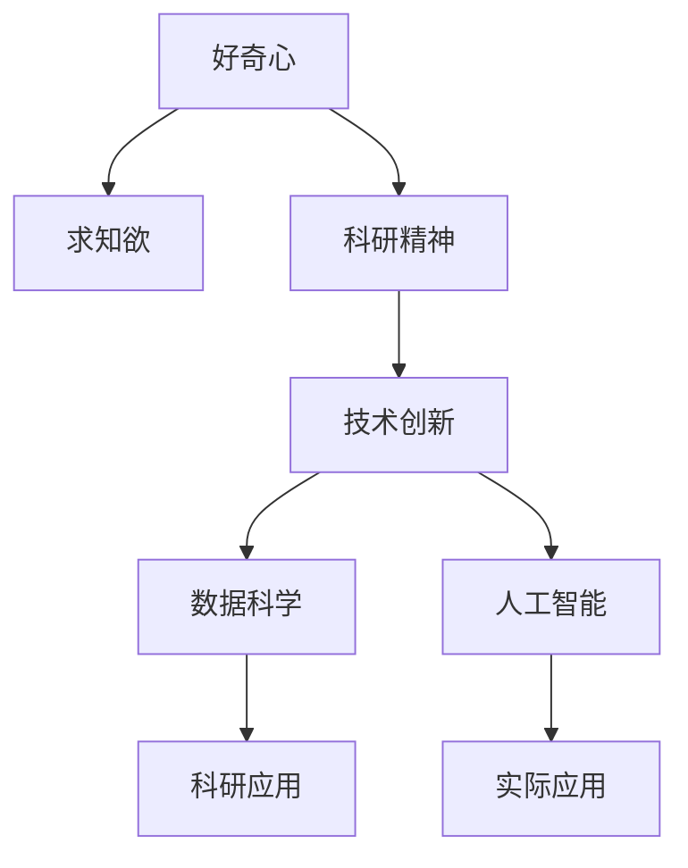
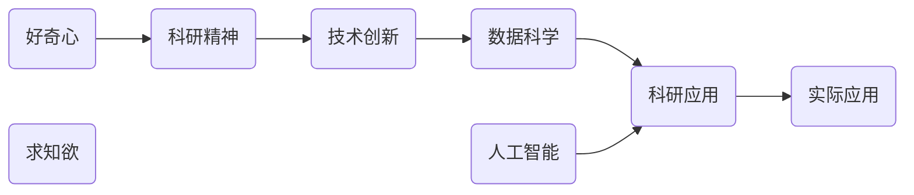

                 

# 好奇心与求知欲：探索的动力

> 关键词：探索动力, 好奇心, 求知欲, 科研精神, 技术创新, 人工智能, 数据科学

## 1. 背景介绍

### 1.1 问题由来
在这个信息爆炸的时代，技术的进步使得我们能够以前所未有的速度获取和处理信息。然而，这一进步同时也带来了新的挑战：面对浩如烟海的知识体系和不断涌现的创新技术，我们如何保持好奇心和求知欲，激发探索的动力？

科技的每一次飞跃，都离不开人类对未知的渴望和探索。好奇心与求知欲，是推动科技发展的原动力。无论是古希腊的哲学家们探索世界本原，还是文艺复兴时期的科学家们揭示自然规律，好奇心与求知欲始终是推动人类进步的重要力量。在当今的数据科学和人工智能领域，这种探索精神同样不可或缺。

### 1.2 问题核心关键点
- **好奇心与求知欲**：人类对新知探索的内在驱动力。
- **科研精神**：坚持不懈、追求真理的科学态度。
- **技术创新**：突破现有技术极限，带来新的解决方案。
- **数据科学**：通过数据分析和挖掘，发现隐藏在数据背后的模式与规律。
- **人工智能**：利用机器学习与智能算法，让机器具备学习、推理能力，解决复杂问题。

好奇心与求知欲是驱动技术创新的原动力。无论是基础科研还是应用开发，这一内在驱动力都在不断引领我们走向未知的领域，寻找新的突破点。本文将深入探讨好奇心与求知欲在科研与技术创新中的作用，并提供一些实用的建议，帮助读者培养和保持这一宝贵品质。

## 2. 核心概念与联系

### 2.1 核心概念概述

为了更好地理解好奇心与求知欲在科研和技术创新中的作用，本节将介绍几个密切相关的核心概念：

- **好奇心**：人类对新奇事物的探索欲望，是科学探索的驱动力。
- **求知欲**：对知识的渴求，通过不断学习和实践，提升自身能力的愿望。
- **科研精神**：科学研究的本质，是探索真理、验证假设的过程。
- **技术创新**：通过引入新技术、新方法，解决实际问题的能力。
- **数据科学**：利用数据挖掘、统计分析等手段，从数据中提取有价值的信息。
- **人工智能**：模拟人类智能，通过算法和模型，让机器具备类似人类的思考和学习能力。

这些核心概念之间的逻辑关系可以通过以下Mermaid流程图来展示：



这个流程图展示了好奇心、求知欲与科研精神、技术创新、数据科学和人工智能等概念之间的联系。

### 2.2 核心概念原理和架构的 Mermaid 流程图



## 3. 核心算法原理 & 具体操作步骤

### 3.1 算法原理概述

好奇心与求知欲的驱动作用，可以通过以下几个方面来体现：

1. **探索未知领域**：通过好奇心的驱使，研究人员会主动探索未知领域，挑战现有知识体系，寻找新的突破点。
2. **持续学习**：求知欲促使研究人员不断学习新知识，更新已有理论，提升自身能力。
3. **创新性解决问题**：科研精神和技术创新相辅相成，研究人员通过引入新技术、新方法，解决实际问题，推动技术进步。
4. **数据驱动决策**：在现代科研和技术创新中，数据科学的重要性日益突出。通过对数据的分析和挖掘，研究人员可以发现隐藏的模式和规律，指导研究方向和技术创新。
5. **人工智能应用**：人工智能技术的不断发展，为科研和技术创新提供了新的工具和方法，使得问题解决更为高效和精准。

### 3.2 算法步骤详解

探索好奇心与求知欲的过程，可以通过以下步骤来实现：

**Step 1: 设定研究目标**
- 明确自己的研究兴趣和目标，选择一个具有挑战性的课题。
- 进行广泛的知识调研，了解该领域的研究现状和前沿进展。

**Step 2: 设计研究方法**
- 选择合适的研究方法，如实验设计、数据分析、模型训练等。
- 进行实验设计和参数调优，确保研究方法的有效性和可靠性。

**Step 3: 收集和处理数据**
- 收集相关的数据集，确保数据的质量和多样性。
- 进行数据预处理，包括数据清洗、归一化、特征工程等。

**Step 4: 实施研究**
- 根据设计的研究方法，进行实验或模型训练。
- 记录实验结果，定期评估研究进展。

**Step 5: 分析与验证**
- 对实验结果进行分析和验证，总结研究结论。
- 将研究结果应用于实际问题，验证其有效性。

**Step 6: 持续改进**
- 根据实验结果和反馈，不断改进研究方法和技术。
- 持续学习和更新知识，保持好奇心和求知欲。

### 3.3 算法优缺点

探索好奇心与求知欲在科研和技术创新中，具有以下优点：

1. **激发创新**：好奇心驱动的探索，常常带来新的发现和突破。
2. **促进学习**：求知欲促使研究人员不断学习新知识，提升自身能力。
3. **提高解决问题的能力**：科研精神和技术创新相辅相成，推动技术进步。
4. **数据驱动决策**：数据科学帮助研究人员从数据中提取有价值的信息，指导研究方向。
5. **增强应用价值**：人工智能技术的应用，使得问题解决更为高效和精准。

同时，这一过程也存在一定的局限性：

1. **高昂成本**：大规模的探索和实验，往往需要大量的人力和物力资源。
2. **失败风险**：探索未知领域，成功率难以保证，可能会面临多次失败。
3. **时间周期长**：研究周期较长，需要耐心和恒心。
4. **知识复杂性**：某些领域的知识体系复杂，入门难度大。

尽管存在这些局限性，但好奇心与求知欲的驱动作用，仍然是科研和技术创新的重要推动力。未来需要不断优化研究方法，提高研究效率，降低失败风险，以更好地激发探索动力。

### 3.4 算法应用领域

好奇心与求知欲在科研和技术创新的多个领域中都有广泛应用，例如：

- **人工智能**：研究人员通过探索新的算法和模型，提升人工智能系统的性能。
- **数据科学**：通过数据驱动的研究，发现新的数据挖掘和分析方法。
- **生物医学**：科学家们探索基因编辑、药物研发等前沿技术，推动医疗进步。
- **环境保护**：研究人员通过探索新的环境保护技术，解决环境污染问题。
- **社会科学**：社会科学家们探索社会动态和行为规律，提升社会科学研究的深度和广度。
- **金融科技**：金融研究人员探索新的金融模型和技术，提高金融系统的安全性和效率。

## 4. 数学模型和公式 & 详细讲解

### 4.1 数学模型构建

好奇心与求知欲的研究，可以通过构建数学模型来描述。例如，设 $x$ 为探索未知领域的次数，$y$ 为每次探索带来的知识增量，则探索的知识总增量为：

$$
K = \sum_{i=1}^{x} y_i
$$

其中 $y_i$ 为第 $i$ 次探索带来的知识增量。

### 4.2 公式推导过程

通过以上公式，我们可以推导出探索的知识总增量与探索次数之间的关系。假设每次探索的知识增量为常数 $y$，则：

$$
K = y \cdot x
$$

这表明，探索的次数越多，知识总增量越大。但这也意味着，随着探索次数的增加，每次探索带来的知识增量会逐渐减少。因此，研究人员需要在探索次数和每次探索带来的知识增量之间进行平衡。

### 4.3 案例分析与讲解

以人工智能领域为例，探索好奇心与求知欲可以具体体现为探索新的算法和模型。研究人员通过不断尝试新的算法，如深度学习、强化学习、生成对抗网络等，提升人工智能系统的性能。例如，通过探索卷积神经网络（CNN）和递归神经网络（RNN）的结合，可以提升图像识别和语音识别的准确率。

## 5. 项目实践：代码实例和详细解释说明

### 5.1 开发环境搭建

在进行项目实践前，我们需要准备好开发环境。以下是使用Python进行PyTorch开发的环境配置流程：

1. 安装Anaconda：从官网下载并安装Anaconda，用于创建独立的Python环境。

2. 创建并激活虚拟环境：
```bash
conda create -n pytorch-env python=3.8 
conda activate pytorch-env
```

3. 安装PyTorch：根据CUDA版本，从官网获取对应的安装命令。例如：
```bash
conda install pytorch torchvision torchaudio cudatoolkit=11.1 -c pytorch -c conda-forge
```

4. 安装Transformers库：
```bash
pip install transformers
```

5. 安装各类工具包：
```bash
pip install numpy pandas scikit-learn matplotlib tqdm jupyter notebook ipython
```

完成上述步骤后，即可在`pytorch-env`环境中开始项目实践。

### 5.2 源代码详细实现

这里我们以数据科学中的机器学习项目为例，给出使用PyTorch进行机器学习任务开发的PyTorch代码实现。

首先，定义训练集和测试集：

```python
from sklearn.datasets import load_iris
from sklearn.model_selection import train_test_split
import torch
import torch.nn as nn
from torch.utils.data import DataLoader

# 加载鸢尾花数据集
iris = load_iris()
X, y = iris.data, iris.target
X_train, X_test, y_train, y_test = train_test_split(X, y, test_size=0.3, random_state=42)

# 将数据转换为PyTorch张量
X_train = torch.tensor(X_train, dtype=torch.float32)
X_test = torch.tensor(X_test, dtype=torch.float32)
y_train = torch.tensor(y_train, dtype=torch.long)
y_test = torch.tensor(y_test, dtype=torch.long)

# 定义训练集和测试集数据加载器
train_dataset = torch.utils.data.TensorDataset(X_train, y_train)
test_dataset = torch.utils.data.TensorDataset(X_test, y_test)
train_loader = DataLoader(train_dataset, batch_size=32, shuffle=True)
test_loader = DataLoader(test_dataset, batch_size=32, shuffle=False)
```

然后，定义模型和优化器：

```python
from torch import nn

# 定义模型结构
class NeuralNet(nn.Module):
    def __init__(self):
        super(NeuralNet, self).__init__()
        self.fc1 = nn.Linear(4, 16)
        self.fc2 = nn.Linear(16, 16)
        self.fc3 = nn.Linear(16, 3)
        
    def forward(self, x):
        x = torch.relu(self.fc1(x))
        x = torch.relu(self.fc2(x))
        x = self.fc3(x)
        return x

# 定义优化器
model = NeuralNet()
criterion = nn.CrossEntropyLoss()
optimizer = torch.optim.Adam(model.parameters(), lr=0.001)
```

接着，定义训练和评估函数：

```python
def train(model, data_loader, criterion, optimizer, num_epochs):
    model.train()
    for epoch in range(num_epochs):
        for batch_idx, (inputs, targets) in enumerate(data_loader):
            optimizer.zero_grad()
            outputs = model(inputs)
            loss = criterion(outputs, targets)
            loss.backward()
            optimizer.step()
            if batch_idx % 100 == 0:
                print(f'Epoch {epoch+1}, Batch {batch_idx}, Loss: {loss.item()}')
    
def evaluate(model, data_loader, criterion):
    model.eval()
    correct = 0
    total = 0
    with torch.no_grad():
        for inputs, targets in data_loader:
            outputs = model(inputs)
            _, predicted = torch.max(outputs.data, 1)
            total += targets.size(0)
            correct += (predicted == targets).sum().item()
    print(f'Accuracy: {(100 * correct / total)}%')
    
# 定义训练和评估函数
train(model, train_loader, criterion, optimizer, num_epochs=10)
evaluate(model, test_loader, criterion)
```

最后，启动训练流程并在测试集上评估：

```python
num_epochs = 10
model = NeuralNet()
criterion = nn.CrossEntropyLoss()
optimizer = torch.optim.Adam(model.parameters(), lr=0.001)

# 定义训练集和测试集数据加载器
train_loader = DataLoader(train_dataset, batch_size=32, shuffle=True)
test_loader = DataLoader(test_dataset, batch_size=32, shuffle=False)

# 训练模型
train(model, train_loader, criterion, optimizer, num_epochs=num_epochs)

# 评估模型
evaluate(model, test_loader, criterion)
```

以上就是使用PyTorch进行机器学习任务开发的完整代码实现。可以看到，PyTorch提供了丰富的模型和优化器库，使得模型开发变得简洁高效。

### 5.3 代码解读与分析

让我们再详细解读一下关键代码的实现细节：

**训练集和测试集定义**：
- 使用scikit-learn的鸢尾花数据集，将其分为训练集和测试集。
- 将数据转换为PyTorch张量，并使用`TensorDataset`类定义数据加载器。

**模型定义**：
- 定义一个简单的三层神经网络模型，包含两个全连接层和一个输出层。
- 使用`nn.Module`类定义模型，并重写`forward`方法，实现模型的前向传播。

**优化器定义**：
- 使用PyTorch的`Adam`优化器，定义学习率和参数。
- 将模型参数传递给优化器，并定义损失函数。

**训练和评估函数**：
- `train`函数：对模型进行训练，每次迭代更新模型参数，并输出损失值。
- `evaluate`函数：在测试集上评估模型性能，计算准确率。

**训练流程**：
- 定义总的迭代次数，开始循环迭代
- 在每个epoch内，对训练集数据进行批处理，更新模型参数，输出损失值
- 在测试集上评估模型，输出准确率

可以看到，PyTorch提供了一系列的高级API，使得模型开发变得更加便捷。开发者可以专注于算法设计和模型优化，而无需过多关注底层细节。

## 6. 实际应用场景

### 6.1 数据科学与金融

数据科学在金融领域有广泛应用，如信用评分、股票预测、风险评估等。研究人员通过探索新的算法和技术，提升金融模型的准确性和可靠性。例如，通过探索集成学习、时间序列预测模型等，可以提升金融模型的预测能力和鲁棒性。

### 6.2 人工智能与医疗

人工智能在医疗领域的应用潜力巨大，如医学影像分析、疾病预测、个性化治疗等。研究人员通过探索新的算法和技术，提升医疗系统的诊断和治疗能力。例如，通过探索卷积神经网络（CNN）在医学影像分析中的应用，可以提升影像识别的准确率。

### 6.3 环境保护与气候变化

环境保护和气候变化是全球共同面临的挑战。研究人员通过探索新的技术和管理方法，提升环境保护和气候变化的应对能力。例如，通过探索遥感技术和机器学习在环境监测中的应用，可以提升环境监测的精度和效率。

### 6.4 未来应用展望

未来，好奇心与求知欲在科研和技术创新中将扮演更加重要的角色。随着技术的不断进步，新的探索领域和应用场景将不断涌现，推动科研和技术创新的发展。

- **前沿技术探索**：如量子计算、基因编辑等前沿技术，为科研和技术创新带来新的突破点。
- **跨领域融合**：如将人工智能与生物医学、环境保护等领域的知识进行融合，推动交叉学科的发展。
- **国际合作**：全球科研和技术创新需要更多的国际合作，共同应对人类面临的共同挑战。
- **伦理与社会责任**：科研和技术创新需要更多地考虑伦理和社会责任，确保技术的健康发展。

好奇心与求知欲是推动科研和技术创新的重要动力。未来，我们需要不断激发探索动力，推动技术进步，为人类社会带来更多的福祉。

## 7. 工具和资源推荐

### 7.1 学习资源推荐

为了帮助开发者系统掌握好奇心与求知欲在科研和技术创新中的作用，这里推荐一些优质的学习资源：

1. Coursera《数据科学与人工智能》课程：由斯坦福大学教授讲授，涵盖数据科学和人工智能的基础知识，适合入门学习。
2. edX《机器学习与深度学习》课程：由MIT教授讲授，涵盖机器学习和深度学习的基本概念和算法，适合进阶学习。
3. Udacity《人工智能工程师》纳米学位：由行业专家讲授，涵盖人工智能的实践应用和技术创新，适合系统学习。
4. Kaggle数据科学竞赛：全球知名的数据科学竞赛平台，提供大量实际应用场景，适合实战训练。
5. Arxiv预印本网站：科学界的预印本库，提供前沿科研论文，适合跟踪最新研究进展。

通过对这些资源的学习实践，相信你一定能够系统掌握好奇心与求知欲在科研和技术创新中的作用，并在实际工作中得到应用。

### 7.2 开发工具推荐

高效的开发离不开优秀的工具支持。以下是几款用于科研和技术创新开发的常用工具：

1. Jupyter Notebook：交互式的笔记本环境，方便进行数据处理和算法实现。
2. Google Colab：谷歌提供的免费Jupyter Notebook环境，支持GPU和TPU算力，适合大规模计算。
3. RStudio：专为R语言开发的IDE，提供数据可视化、代码编写和分析工具。
4. Python环境：如Anaconda、PyCharm等，提供强大的开发工具和库支持。
5. Git和GitHub：版本控制系统，方便代码管理和协作。

合理利用这些工具，可以显著提升科研和技术创新的开发效率，加速创新迭代的步伐。

### 7.3 相关论文推荐

好奇心与求知欲的研究源于学界的持续研究。以下是几篇奠基性的相关论文，推荐阅读：

1. 《好奇心与创新性学习》（Curiosity and Innovative Learning）：探讨好奇心在创新性学习中的作用，提出了基于好奇心的学习算法。
2. 《科研精神与数据驱动决策》（Scientific Spirit and Data-Driven Decision Making）：分析科研精神和技术创新的关系，提出数据科学在科研中的应用方法。
3. 《人工智能与伦理》（Artificial Intelligence and Ethics）：探讨人工智能技术的应用伦理问题，提出伦理导向的科研方法。
4. 《前沿技术探索》（Exploration of Cutting-Edge Technology）：分析前沿技术的发展趋势，提出科研和技术创新的方向。
5. 《交叉学科融合》（Interdisciplinary Integration）：探讨不同学科之间的融合，提出跨领域科研的方法。

这些论文代表了好奇心与求知欲在科研和技术创新中的研究方向，通过学习这些前沿成果，可以帮助研究者把握学科前进方向，激发更多的创新灵感。

## 8. 总结：未来发展趋势与挑战

### 8.1 总结

本文对好奇心与求知欲在科研和技术创新中的作用进行了全面系统的介绍。首先阐述了好奇心与求知欲在科研和技术创新中的重要性，明确了其对探索新知识、推动技术进步的驱动作用。其次，从原理到实践，详细讲解了好奇心与求知欲的驱动作用，并给出了科研和技术创新的一般流程。同时，本文还广泛探讨了好奇心与求知欲在实际应用场景中的作用，展示了其广泛的应用前景。此外，本文精选了科研和技术创新的各类学习资源，力求为读者提供全方位的技术指引。

通过本文的系统梳理，可以看到，好奇心与求知欲在科研和技术创新中发挥着至关重要的作用。好奇心驱动的探索，常常带来新的发现和突破。求知欲促使研究人员不断学习新知识，提升自身能力。科研精神和技术创新相辅相成，推动技术进步。未来，好奇心与求知欲将继续激励科研和技术创新，引领人类走向更加智能化、普适化的未来。

### 8.2 未来发展趋势

展望未来，好奇心与求知欲在科研和技术创新中将呈现以下几个发展趋势：

1. **前沿技术探索**：量子计算、基因编辑等前沿技术的发展，将为科研和技术创新带来新的突破点。
2. **跨领域融合**：人工智能与生物医学、环境保护等领域的知识融合，将推动交叉学科的发展。
3. **数据科学的应用**：数据科学在科研和技术创新中的重要性日益凸显，将提供更多数据驱动的决策支持。
4. **技术伦理与规范**：科研和技术创新需要更多地考虑伦理和社会责任，确保技术的健康发展。
5. **国际合作**：全球科研和技术创新需要更多的国际合作，共同应对人类面临的共同挑战。

以上趋势凸显了好奇心与求知欲在科研和技术创新中的广阔前景。这些方向的探索发展，必将进一步提升科研和技术创新的深度和广度，为人类社会带来更多的福祉。

### 8.3 面临的挑战

尽管好奇心与求知欲在科研和技术创新中具有重要的推动作用，但在实施过程中仍面临诸多挑战：

1. **高昂成本**：大规模的探索和实验，往往需要大量的人力和物力资源。
2. **失败风险**：探索未知领域，成功率难以保证，可能会面临多次失败。
3. **时间周期长**：研究周期较长，需要耐心和恒心。
4. **知识复杂性**：某些领域的知识体系复杂，入门难度大。
5. **伦理与规范**：科研成果的应用需要更多地考虑伦理和社会责任，确保技术的健康发展。

尽管存在这些挑战，但好奇心与求知欲的驱动作用，仍然是科研和技术创新的重要推动力。未来需要不断优化研究方法，提高研究效率，降低失败风险，以更好地激发探索动力。

### 8.4 研究展望

面对好奇心与求知欲面临的种种挑战，未来的研究需要在以下几个方面寻求新的突破：

1. **优化研究方法**：开发更加高效、低成本的研究方法，降低探索的风险和成本。
2. **提高研究效率**：利用先进技术和工具，提升研究的效率和效果。
3. **探索跨学科融合**：促进不同学科之间的交流与合作，推动交叉学科的发展。
4. **考虑伦理与社会责任**：更多地考虑科研和技术创新的伦理与社会责任，确保技术的健康发展。
5. **推动国际合作**：加强国际合作，共同应对人类面临的共同挑战。

这些研究方向的探索，必将引领好奇心与求知欲在科研和技术创新中迈向更高的台阶，为人类社会带来更多的福祉。面向未来，好奇心与求知欲需要在全球范围内得到更广泛的传播和培养，成为推动人类进步的重要动力。

## 9. 附录：常见问题与解答

**Q1: 好奇心与求知欲如何培养？**

A: 好奇心与求知欲的培养可以从以下几个方面入手：
1. **广泛阅读**：阅读不同领域的书籍和文章，拓展知识面。
2. **动手实践**：通过编程、实验等实践活动，亲身感受探索的乐趣。
3. **持续学习**：不断学习新知识，更新已有理论，提升自身能力。
4. **跨领域交流**：与不同领域的研究人员交流，获取新的灵感和思路。
5. **定期反思**：定期反思自己的学习路径，总结经验，调整方向。

**Q2: 如何保持好奇心与求知欲？**

A: 保持好奇心与求知欲可以从以下几个方面入手：
1. **设定目标**：明确自己的研究兴趣和目标，设定具体的研究方向。
2. **定期挑战**：定期挑战自己，尝试新的方法和技术。
3. **多角度思考**：从不同角度思考问题，寻找新的解决方案。
4. **与人交流**：与他人交流观点和想法，获取新的启发。
5. **保持开放心态**：保持开放心态，愿意接受新的知识和观点。

**Q3: 如何克服科研和技术创新的挑战？**

A: 克服科研和技术创新的挑战可以从以下几个方面入手：
1. **团队协作**：组建优秀的科研团队，共同应对挑战。
2. **持续改进**：不断优化研究方法，提升研究效率。
3. **技术创新**：引入新技术和方法，提升研究能力。
4. **数据驱动**：利用数据科学，从数据中提取有价值的信息，指导研究方向。
5. **伦理考量**：更多地考虑伦理和社会责任，确保技术的健康发展。

通过本文的系统梳理，可以看到，好奇心与求知欲在科研和技术创新中发挥着至关重要的作用。好奇心驱动的探索，常常带来新的发现和突破。求知欲促使研究人员不断学习新知识，提升自身能力。科研精神和技术创新相辅相成，推动技术进步。未来，好奇心与求知欲将继续激励科研和技术创新，引领人类走向更加智能化、普适化的未来。

---

作者：禅与计算机程序设计艺术 / Zen and the Art of Computer Programming

