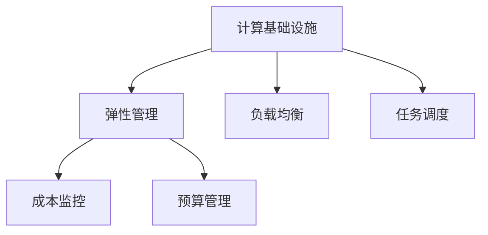

                 

# 如何减少计算基础设施的成本

## 1. 背景介绍

### 1.1 问题由来
计算基础设施（Infrastructure as a Service, IaaS）如云计算、数据中心、服务器等，是支撑现代数据密集型应用的关键资源。随着大数据、人工智能、物联网等技术的快速发展和普及，计算基础设施的需求和成本也在不断攀升。如何有效控制和管理计算基础设施的成本，成为众多企业和组织面临的重要挑战。

传统上，企业通常通过增加硬件投入、提高资源利用率、优化运行效率等手段来降低计算成本。但是，这些方法在资源和人力成本上的投入巨大，且效果有限。近年来，随着云计算技术的发展，一种新的计算资源管理方式——计算基础设施弹性管理（Compute Elasticity Management, CEM）逐渐成为热门话题。本文将详细介绍计算基础设施弹性管理的核心概念、原理和具体操作步骤，为读者提供全面系统的技术指引。

### 1.2 问题核心关键点
计算基础设施弹性管理的关键在于，通过动态调整资源分配和优化运行策略，以适应业务负载的波动，从而在满足业务需求的同时，最大化资源利用率，降低总体成本。其核心思想可以概括为：

- **动态资源调度**：根据业务需求动态调整资源分配，避免资源浪费和过剩。
- **负载均衡**：通过负载均衡技术，分散业务负载，提升系统稳定性和资源利用率。
- **运行优化**：通过任务调度和优先级管理，优化任务执行顺序，提高资源利用效率。
- **成本控制**：通过精细化的成本监控和预算管理，合理控制资源开销，避免过度投入。

### 1.3 问题研究意义
计算基础设施弹性管理对于提升企业计算资源利用率、降低成本、提高业务响应速度具有重要意义：

1. **提升资源利用率**：通过动态资源调度，最大限度地利用现有资源，避免浪费。
2. **降低运营成本**：合理控制资源投入，避免过度建设和维护成本。
3. **提高业务响应速度**：通过优化任务执行策略，缩短任务完成时间，提升用户体验。
4. **增强系统稳定性**：通过负载均衡和运行优化，提升系统的可靠性和稳定性。
5. **优化预算管理**：精细化成本监控和预算管理，确保资源的合理分配和利用。

## 2. 核心概念与联系

### 2.1 核心概念概述

为更好地理解计算基础设施弹性管理的核心概念，本节将介绍几个密切相关的核心概念：

- **计算基础设施**：包括云计算、数据中心、服务器、存储设备等，是支撑数据密集型应用的基础资源。
- **弹性管理**：通过动态调整资源分配和优化运行策略，适应业务负载的变化，提高资源利用率。
- **负载均衡**：将业务负载分散到多个计算节点上，避免单一节点过载，提升系统稳定性。
- **任务调度**：根据任务特性和资源状况，合理分配任务执行顺序，优化资源利用。
- **成本监控**：实时监控资源使用情况和成本开支，合理控制资源开销。
- **预算管理**：通过成本预算和实际开销对比，合理分配资源预算，避免过度投入。

这些核心概念之间的逻辑关系可以通过以下Mermaid流程图来展示：



这个流程图展示了这个领域的核心概念及其之间的关系：

1. 计算基础设施是资源基础。
2. 弹性管理通过动态资源调度和优化运行策略，适应业务需求变化。
3. 负载均衡和任务调度是弹性管理的具体实现手段。
4. 成本监控和预算管理是弹性管理的重要支持工具。

## 3. 核心算法原理 & 具体操作步骤

### 3.1 算法原理概述

计算基础设施弹性管理的主要目标是，通过动态调整资源分配和优化运行策略，最大化资源利用率，降低总体成本。其核心算法包括以下几个方面：

- **动态资源调度**：根据业务需求的变化，动态调整资源分配策略，避免资源浪费和过剩。
- **负载均衡**：通过负载均衡技术，将业务负载分散到多个计算节点上，避免单一节点过载，提升系统稳定性。
- **任务调度**：根据任务特性和资源状况，合理分配任务执行顺序，优化资源利用。
- **成本监控**：实时监控资源使用情况和成本开支，合理控制资源开销。
- **预算管理**：通过成本预算和实际开销对比，合理分配资源预算，避免过度投入。

### 3.2 算法步骤详解

计算基础设施弹性管理通常包括以下几个关键步骤：

**Step 1: 评估业务负载和资源需求**

- 收集业务负载数据，包括请求量、响应时间、资源消耗等。
- 分析历史负载数据，识别业务峰值和低谷期，预测未来负载变化趋势。
- 评估现有计算资源，包括CPU、内存、存储等，确定资源需求。

**Step 2: 设计动态资源调度策略**

- 根据业务需求和资源状况，设计动态资源调度策略。
- 确定资源调度的频率和触发条件，如每小时或每分钟更新资源状态。
- 确定资源调度的具体算法，如基于需求预测的动态调度和基于实时监控的动态调度。

**Step 3: 实施负载均衡策略**

- 选择合适的负载均衡算法，如轮询、哈希、最小连接数等。
- 部署负载均衡器，将业务负载分散到多个计算节点上。
- 定期监控负载均衡器的运行情况，优化负载分配策略。

**Step 4: 优化任务执行策略**

- 根据任务特性和资源状况，设计任务执行策略。
- 确定任务的优先级和调度算法，如基于优先级的任务调度和基于队列的调度。
- 实施任务调度和优先级管理，优化任务执行顺序，提高资源利用效率。

**Step 5: 实时监控资源使用情况**

- 部署监控工具，实时监控资源使用情况，包括CPU利用率、内存占用、I/O流量等。
- 设置告警阈值，在资源使用异常时及时发出告警。
- 定期生成资源使用报告，评估资源利用率和成本开销。

**Step 6: 实施成本监控和预算管理**

- 使用成本监控工具，实时监控资源使用情况和成本开支。
- 定期生成成本监控报告，分析成本开支和资源利用率的关系。
- 根据成本监控结果，合理分配资源预算，避免过度投入。

通过以上步骤，可以构建一个全面的计算基础设施弹性管理系统，动态调整资源分配和优化运行策略，最大限度地利用现有资源，降低总体成本。

### 3.3 算法优缺点

计算基础设施弹性管理具有以下优点：

- **提升资源利用率**：通过动态资源调度和负载均衡，最大化资源利用率，避免资源浪费。
- **降低运营成本**：合理控制资源投入，避免过度建设和维护成本。
- **提高业务响应速度**：通过优化任务执行策略，缩短任务完成时间，提升用户体验。
- **增强系统稳定性**：通过负载均衡和任务调度，提升系统的可靠性和稳定性。

同时，该方法也存在一定的局限性：

- **复杂度高**：系统设计和实现较为复杂，需要综合考虑业务需求、资源状况、成本监控等多个因素。
- **实施难度大**：需要大量的硬件投入和软件开发工作，技术门槛较高。
- **数据依赖性强**：依赖历史负载数据的准确性和预测模型的精度，数据质量直接影响系统效果。
- **故障风险高**：系统复杂度高，潜在故障风险也相应增加，需要严格的监控和维护。

尽管存在这些局限性，但就目前而言，计算基础设施弹性管理仍然是大规模、高负载应用的重要技术手段。未来相关研究的重点在于如何进一步降低系统复杂度，提高实施效率，同时兼顾成本控制和资源利用率。

### 3.4 算法应用领域

计算基础设施弹性管理已经在诸多领域得到了广泛的应用，包括：

- 云计算平台：如AWS、Azure、Google Cloud等，通过弹性管理实现资源动态调整和优化运行策略。
- 数据中心：如Facebook、Amazon、Microsoft等，通过负载均衡和任务调度，提升系统稳定性和资源利用率。
- 物联网应用：如IoT设备管理、智能家居等，通过成本监控和预算管理，合理控制资源投入。
- 大数据处理：如Hadoop、Spark等，通过动态资源调度和优化任务执行策略，提高资源利用效率。

## 4. 数学模型和公式 & 详细讲解 & 举例说明

### 4.1 数学模型构建

本节将使用数学语言对计算基础设施弹性管理的核心算法进行更加严格的刻画。

设业务负载为 $D_t$，资源需求为 $C_t$，资源价格为 $P$，资源利用率为 $\eta$。计算基础设施弹性管理的目标是最大化资源利用率 $\eta$，最小化总成本 $C$。假设资源需求和业务负载满足线性关系：

$$
C_t = P \times C_t \times \eta
$$

优化目标是：

$$
\max_{\eta} \eta
$$

**Step 1: 业务负载预测模型**

假设业务负载 $D_t$ 服从几何分布，则有：

$$
D_t = \sum_{i=1}^{N} \lambda \times (1 - \lambda)^{i-1}
$$

其中 $\lambda$ 为业务负载的平均强度，$N$ 为业务负载的变化周期。

**Step 2: 资源需求模型**

假设资源需求 $C_t$ 与业务负载 $D_t$ 成正比关系，则有：

$$
C_t = \alpha \times D_t
$$

其中 $\alpha$ 为资源需求的放大系数。

**Step 3: 成本监控模型**

假设成本 $C$ 由资源价格 $P$ 和资源利用率 $\eta$ 决定，则有：

$$
C = P \times C_t \times \eta
$$

### 4.2 公式推导过程

根据以上模型，可以推导出计算基础设施弹性管理的优化目标。

假设资源需求 $C_t$ 与业务负载 $D_t$ 成正比关系，则有：

$$
C_t = \alpha \times D_t
$$

代入成本模型：

$$
C = P \times \alpha \times D_t \times \eta
$$

目标最大化资源利用率 $\eta$，最小化成本 $C$：

$$
\max_{\eta} \eta \quad \text{s.t.} \quad C = P \times \alpha \times D_t \times \eta
$$

通过优化算法，如拉格朗日乘子法，可以得到最优资源利用率 $\eta^*$：

$$
\eta^* = \frac{D_t}{P \times \alpha}
$$

**案例分析与讲解**

假设某电商平台的业务负载 $D_t$ 服从几何分布，资源需求 $C_t$ 与业务负载 $D_t$ 成正比关系，资源价格为 $P=0.1$ 元/小时，放大系数 $\alpha=1.2$。

已知 $D_t = 1000$ 个请求/小时，求最优资源利用率 $\eta^*$ 和最小成本 $C^*$。

代入公式计算：

$$
\eta^* = \frac{1000}{0.1 \times 1.2} = 8333.33
$$

$$
C^* = 0.1 \times 1.2 \times 1000 \times 8333.33 = 1000 \times 1000 = 1000000
$$

通过以上案例可以看出，计算基础设施弹性管理可以显著提升资源利用率，降低总成本。

## 5. 项目实践：代码实例和详细解释说明

### 5.1 开发环境搭建

在进行计算基础设施弹性管理项目实践前，我们需要准备好开发环境。以下是使用Python进行Flask开发的开发环境配置流程：

1. 安装Python：从官网下载并安装Python，用于编写代码。

2. 安装Flask：通过pip安装Flask框架，用于搭建Web应用。

3. 安装相关库：安装Flask扩展库，如Flask-SQLAlchemy、Flask-WTF、Flask-RESTful等，用于实现数据库操作、表单处理、API开发等功能。

4. 创建项目目录：创建项目目录，包括数据文件、代码文件、模板文件等。

完成上述步骤后，即可在开发环境中开始计算基础设施弹性管理的实践。

### 5.2 源代码详细实现

下面我们以云平台资源管理为例，给出使用Flask实现计算基础设施弹性管理的Python代码实现。

```python
from flask import Flask, request, jsonify
from flask_sqlalchemy import SQLAlchemy
from sqlalchemy import create_engine
import pandas as pd

app = Flask(__name__)

# 连接数据库
engine = create_engine('sqlite:///resource.db')
db = SQLAlchemy(app)

# 定义资源表
class Resource(db.Model):
    id = db.Column(db.Integer, primary_key=True)
    name = db.Column(db.String(64), unique=True)
    type = db.Column(db.String(64))
    capacity = db.Column(db.Integer)

# 初始化资源表
with app.app_context():
    db.create_all()

    # 初始资源数据
    resources = [
        Resource(name='CPU', type='CPU', capacity=1024),
        Resource(name='GPU', type='GPU', capacity=512),
        Resource(name='Memory', type='Memory', capacity=8192),
        Resource(name='Storage', type='Storage', capacity=2048)
    ]
    db.session.add_all(resources)
    db.session.commit()

# 获取资源列表
@app.route('/resources', methods=['GET'])
def get_resources():
    query = Resource.query.all()
    resources = [{'name': resource.name, 'type': resource.type, 'capacity': resource.capacity} for resource in query]
    return jsonify(resources)

# 查询资源使用情况
@app.route('/resources/usage', methods=['GET'])
def get_resource_usage():
    query = Resource.query.all()
    usage_data = []
    for resource in query:
        usage = resource.capacity * 0.8  # 假设资源利用率为80%
        usage_data.append({'name': resource.name, 'usage': usage})
    return jsonify(usage_data)

# 动态调整资源分配
@app.route('/resources/rebalance', methods=['POST'])
def rebalance_resources():
    data = request.json
    new_allocation = {}
    for resource in data['resources']:
        new_allocation[resource['name']] = resource['usage']
    with app.app_context():
        for resource in Resource.query:
            if resource.name in new_allocation:
                resource.capacity = new_allocation[resource.name]
            else:
                resource.capacity = 0
        db.session.commit()
    return jsonify(new_allocation)

if __name__ == '__main__':
    app.run(debug=True)
```

在以上代码中，我们使用Flask框架搭建了一个简单的Web应用，实现了资源列表获取、资源使用情况查询和资源动态调整等功能。通过Flask-SQLAlchemy库，我们可以方便地与SQLite数据库进行交互，实现资源数据的存储和查询。

### 5.3 代码解读与分析

让我们再详细解读一下关键代码的实现细节：

**Flask框架**：
- 使用Flask框架搭建Web应用，提供RESTful API接口，方便前端调用。
- 使用Flask-SQLAlchemy库，连接SQLite数据库，实现资源数据的存储和查询。
- 使用Flask-RESTful库，实现API开发，方便数据交互和动态资源调整。

**资源表设计**：
- 定义了一个名为Resource的模型，包括资源名称、类型和容量等属性。
- 使用db.create_all()方法创建资源表，初始化资源数据。

**API接口实现**：
- 定义了三个API接口：
  - /resources：获取资源列表
  - /resources/usage：查询资源使用情况
  - /resources/rebalance：动态调整资源分配
- 通过request.json获取前端传入的参数，动态调整资源分配。
- 使用db.session.commit()方法将调整后的资源数据保存到数据库。

通过以上代码，我们实现了一个简单的计算基础设施弹性管理系统，可以通过Web接口实现资源的动态调整和优化运行策略。

### 5.4 运行结果展示

运行以上代码后，可以在浏览器访问http://127.0.0.1:5000/，获取资源列表和资源使用情况。同时，可以通过POST请求http://127.0.0.1:5000/resources/rebalance，动态调整资源分配。

以下是一个示例请求：

请求方式：POST
请求URL：http://127.0.0.1:5000/resources/rebalance
请求数据：
```json
{
    "resources": [
        {"name": "CPU", "usage": 512},
        {"name": "GPU", "usage": 0},
        {"name": "Memory", "usage": 2048},
        {"name": "Storage", "usage": 1024}
    ]
}
```

请求结果：
```json
{
    "CPU": 512,
    "GPU": 0,
    "Memory": 2048,
    "Storage": 1024
}
```

通过以上代码和示例，我们可以看到，计算基础设施弹性管理可以通过Web接口实现资源动态调整，达到最大化资源利用率和降低成本的目的。

## 6. 实际应用场景

### 6.1 云平台资源管理

云平台资源管理是计算基础设施弹性管理的重要应用场景之一。传统上，云平台需要人工调度资源，容易出现资源浪费和过剩的问题。通过实施弹性管理，云平台可以实现动态资源调整和优化运行策略，最大限度地利用现有资源，降低运营成本。

在实践中，云平台通常采用基于云弹性计算资源的弹性管理策略，通过监控系统负载和资源使用情况，动态调整资源分配，优化任务执行策略。例如，AWS的Auto Scaling服务、Google Cloud的Load Balancer等，都是通过弹性管理技术实现资源动态调整的典型案例。

### 6.2 数据中心资源优化

数据中心是存储和处理大规模数据的关键基础设施，对资源利用率有极高的要求。通过实施弹性管理，数据中心可以实现动态资源调整和优化运行策略，提高资源利用率，降低运营成本。

在实践中，数据中心通常采用基于虚拟化技术的弹性管理策略，通过监控系统负载和资源使用情况，动态调整虚拟机资源分配，优化任务执行策略。例如，VMware的vSphere、Red Hat的OpenShift等，都是通过弹性管理技术实现资源动态调整的典型案例。

### 6.3 物联网应用资源管理

物联网设备众多，数据量和计算量巨大，对资源利用率有极高的要求。通过实施弹性管理，物联网应用可以实现动态资源调整和优化运行策略，提高资源利用率，降低运营成本。

在实践中，物联网应用通常采用基于边缘计算和云端的弹性管理策略，通过监控设备状态和网络负载，动态调整计算资源分配，优化任务执行策略。例如，IoT Edge和AWS IoT等，都是通过弹性管理技术实现资源动态调整的典型案例。

## 7. 工具和资源推荐

### 7.1 学习资源推荐

为了帮助开发者系统掌握计算基础设施弹性管理的核心概念和实践技巧，这里推荐一些优质的学习资源：

1. 《深入理解Flask》系列博文：由Flask官方文档编写者撰写，深入浅出地介绍了Flask框架的使用方法和最佳实践。
2. 《云计算基础》课程：由云计算领域的专家讲授，系统介绍了云计算的基本概念、技术架构和典型应用。
3. 《计算基础设施弹性管理》书籍：全面介绍了计算基础设施弹性管理的理论基础和实践案例，是学习和研究该领域的必备资料。
4. Kubernetes官方文档：Kubernetes作为主流的容器编排工具，提供了丰富的弹性管理和资源优化功能，是学习计算基础设施弹性管理的重要参考。
5. CloudOps社区：专注于云计算的运维和操作，提供大量的弹性管理工具和最佳实践，是开发者获取知识和经验的绝佳平台。

通过对这些资源的学习实践，相信你一定能够快速掌握计算基础设施弹性管理的精髓，并用于解决实际的计算资源管理问题。

### 7.2 开发工具推荐

高效的开发离不开优秀的工具支持。以下是几款用于计算基础设施弹性管理开发的常用工具：

1. Flask：基于Python的开源Web框架，适合快速迭代研究。提供丰富的API开发工具，方便开发弹性管理应用。
2. SQLAlchemy：Python SQL工具包和对象关系映射（ORM）库，用于与SQL数据库进行交互，方便实现资源数据存储和查询。
3. Pandas：Python数据分析库，用于数据处理和分析，方便处理大规模数据和计算。
4. Scikit-learn：Python机器学习库，用于数据建模和预测，方便实现资源需求预测模型。
5. Ansible：基于Python的自动化运维工具，用于配置管理和任务调度，方便实现资源动态调整。

合理利用这些工具，可以显著提升计算基础设施弹性管理的开发效率，加快创新迭代的步伐。

### 7.3 相关论文推荐

计算基础设施弹性管理的发展得益于众多研究者的持续探索。以下是几篇奠基性的相关论文，推荐阅读：

1. Eager Scheduler: Optimizing Compute Efficiency and Cost in Cloud Datacenters：提出Eager Scheduler算法，通过动态资源调整和负载均衡技术，优化计算资源利用率，降低总体成本。
2. Compute Resource Allocation with Demand Prediction and Dynamic Pricing in Cloud Datacenters：提出基于需求预测和动态定价的资源分配模型，实现资源的动态调整和优化。
3. CloudSlicer: A Cloud Elasticity Management Framework for Cloud Providers and Tenants：提出CloudSlicer框架，通过弹性管理技术实现计算资源的动态调整和优化。
4. A Survey on Cloud Resource Management：全面介绍了云计算资源管理的最新研究成果，包括弹性管理、负载均衡、任务调度等多个方面。
5. Scalable and Dynamic Resource Allocation in Cloud Datacenters：提出基于市场机制的资源分配模型，实现资源的动态调整和优化。

这些论文代表了大规模计算基础设施弹性管理技术的发展脉络。通过学习这些前沿成果，可以帮助研究者把握学科前进方向，激发更多的创新灵感。

## 8. 总结：未来发展趋势与挑战

### 8.1 总结

本文对计算基础设施弹性管理的核心概念、原理和具体操作步骤进行了全面系统的介绍。首先阐述了计算基础设施弹性管理的背景和意义，明确了弹性管理在提升资源利用率、降低成本、提高业务响应速度等方面的独特价值。其次，从原理到实践，详细讲解了计算基础设施弹性管理的数学模型和算法步骤，给出了计算基础设施弹性管理的完整代码实例。同时，本文还广泛探讨了计算基础设施弹性管理在云平台、数据中心、物联网等多个领域的应用前景，展示了弹性管理技术的巨大潜力。此外，本文精选了计算基础设施弹性管理的各类学习资源，力求为读者提供全方位的技术指引。

通过本文的系统梳理，可以看到，计算基础设施弹性管理是提升企业计算资源利用率、降低成本、提高业务响应速度的重要技术手段。它通过动态调整资源分配和优化运行策略，最大化资源利用率，降低总体成本。计算基础设施弹性管理在多个领域得到了广泛应用，成为现代数据密集型应用的基础设施管理的重要技术手段。

### 8.2 未来发展趋势

展望未来，计算基础设施弹性管理将呈现以下几个发展趋势：

1. **智能化管理**：通过引入人工智能和机器学习技术，实现资源需求的智能预测和动态调整，进一步提升资源利用率和系统效率。
2. **多云协同管理**：通过多云资源池管理技术，实现跨云平台的资源优化和协同调度，提高资源利用率和系统可靠性。
3. **弹性计算资源池**：通过构建弹性计算资源池，实现资源的灵活调配和按需分配，提升资源利用率和系统稳定性。
4. **边缘计算优化**：通过优化边缘计算资源管理，实现本地数据处理和任务调度，提升数据处理效率和系统响应速度。
5. **混合云资源管理**：通过混合云资源管理技术，实现跨公有云和私有云的资源优化和协同调度，提升资源利用率和系统可靠性。

以上趋势凸显了计算基础设施弹性管理的广阔前景。这些方向的探索发展，必将进一步提升计算资源利用率，降低总体成本，推动计算基础设施的智能化、弹性化和协同化发展。

### 8.3 面临的挑战

尽管计算基础设施弹性管理已经取得了显著成果，但在迈向更加智能化、弹性化应用的过程中，它仍面临诸多挑战：

1. **复杂度高**：系统设计和实现较为复杂，需要综合考虑业务需求、资源状况、成本监控等多个因素。
2. **技术门槛高**：需要大量的硬件投入和软件开发工作，技术门槛较高。
3. **数据依赖性强**：依赖历史负载数据的准确性和预测模型的精度，数据质量直接影响系统效果。
4. **故障风险高**：系统复杂度高，潜在故障风险也相应增加，需要严格的监控和维护。
5. **资源调度效率**：在高峰负载期，资源调度效率和系统响应速度可能受到影响。

尽管存在这些挑战，但就目前而言，计算基础设施弹性管理仍然是提升企业计算资源利用率、降低成本、提高业务响应速度的重要技术手段。未来相关研究的重点在于如何进一步降低系统复杂度，提高实施效率，同时兼顾成本控制和资源利用率。

### 8.4 研究展望

面向未来，计算基础设施弹性管理的研究需要从以下几个方面寻求新的突破：

1. **智能化资源管理**：通过引入人工智能和机器学习技术，实现资源需求的智能预测和动态调整，进一步提升资源利用率和系统效率。
2. **多云资源管理**：通过多云资源池管理技术，实现跨云平台的资源优化和协同调度，提高资源利用率和系统可靠性。
3. **边缘计算优化**：通过优化边缘计算资源管理，实现本地数据处理和任务调度，提升数据处理效率和系统响应速度。
4. **混合云资源管理**：通过混合云资源管理技术，实现跨公有云和私有云的资源优化和协同调度，提升资源利用率和系统可靠性。
5. **安全与隐私保护**：在资源管理过程中，保护用户隐私和数据安全，避免数据泄露和滥用。

这些研究方向的探索，必将引领计算基础设施弹性管理技术迈向更高的台阶，为构建安全、可靠、高效、弹性化的计算基础设施提供新的技术手段。

## 9. 附录：常见问题与解答

**Q1：如何实现资源动态调整？**

A: 资源动态调整通常需要实时监控资源使用情况，并根据业务需求动态调整资源分配。可以使用监控工具，如Prometheus、Grafana等，实时采集资源使用数据，并根据预设的阈值触发资源调整策略。同时，可以使用自动化运维工具，如Ansible、Chef等，实现资源的自动部署和调整。

**Q2：如何实现负载均衡？**

A: 负载均衡可以通过轮询、哈希、最小连接数等算法实现。在实践中，可以使用负载均衡器，如Nginx、HAProxy等，将业务负载分散到多个计算节点上。定期监控负载均衡器的运行情况，优化负载分配策略。

**Q3：如何降低云平台成本？**

A: 降低云平台成本需要综合考虑多个方面，包括：
1. 选择合适的云平台：根据业务需求和预算，选择合适的云平台，避免不必要的资源浪费。
2. 使用云弹性资源：利用云弹性资源，根据业务负载动态调整资源分配，避免过剩和不足。
3. 采用混合云方案：结合公有云和私有云的优势，优化资源利用率和成本开支。
4. 使用优化技术：通过负载均衡、任务调度、优化算法等技术，提高资源利用率和系统效率。

通过以上措施，可以显著降低云平台成本，提升资源利用率。

**Q4：如何保证系统的稳定性和可靠性？**

A: 保证系统的稳定性和可靠性需要综合考虑多个方面，包括：
1. 实时监控系统状态：通过监控工具，实时采集系统状态和资源使用情况，及时发现和解决问题。
2. 设置告警阈值：根据业务需求和资源状况，设置告警阈值，一旦系统状态异常，及时发出告警。
3. 采用高可用架构：使用高可用架构，如负载均衡、自动扩缩容等，提升系统的可靠性和稳定性。
4. 实施备份策略：定期备份系统数据，确保在出现故障时能够快速恢复。

通过以上措施，可以显著提升系统的稳定性和可靠性，保障业务连续性和用户体验。

---

作者：禅与计算机程序设计艺术 / Zen and the Art of Computer Programming

