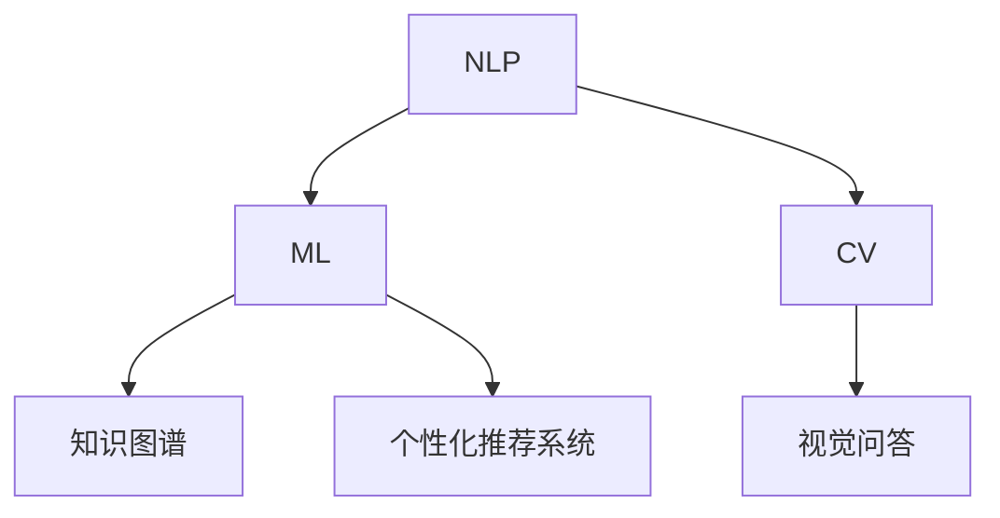

                 

# 如何利用AI技术提升知识付费效率

## 1. 背景介绍

随着互联网的发展，知识付费已成为众多用户获取专业知识的途径。在线教育平台、知识分享社区、专业咨询公司等纷纷推出各种在线课程、专业讲座、定制咨询服务，帮助用户高效获取和应用知识。然而，海量知识和信息过载成为了一个严重的问题，如何帮助用户从海量信息中找到真正有用的内容，提升知识获取的效率，成为知识付费领域的一个重要研究方向。

AI技术的应用，为提升知识付费效率带来了新的可能。通过自然语言处理(NLP)、机器学习(ML)、计算机视觉(CV)等AI技术，可以有效识别和筛选知识内容，提高用户学习效率，降低知识获取成本。本文将从NLP、ML、CV三个方面，探讨如何利用AI技术提升知识付费效率，并给出具体技术方案和案例分析。

## 2. 核心概念与联系

### 2.1 核心概念概述

为了更好地理解如何利用AI技术提升知识付费效率，本节将介绍几个关键概念：

- **自然语言处理(Natural Language Processing, NLP)**：使用计算机处理和理解自然语言的技术，包括文本预处理、分词、命名实体识别、情感分析、文本分类、问答系统等。
- **机器学习(Machine Learning, ML)**：通过数据训练模型，使得模型具备预测、分类、回归等能力。
- **计算机视觉(Computer Vision, CV)**：使用计算机处理和理解图像、视频等视觉信息的技术，包括图像分类、目标检测、图像生成、视觉问答等。
- **知识图谱(Knowledge Graph)**：一种结构化的知识表示方法，用于描述实体、属性、关系等，支持知识的推理、查询和整合。
- **个性化推荐系统**：通过用户行为、兴趣、背景等信息，为用户推荐最相关的知识内容。

这些核心概念之间存在紧密的联系，NLP、ML、CV等技术可以分别应用于知识内容的筛选、理解、推荐等环节，共同构建高效的知识付费平台。

### 2.2 核心概念原理和架构的 Mermaid 流程图

以下是这些核心概念的原理和架构联系的Mermaid流程图：



该图展示了NLP、ML、CV等技术在知识付费平台中的应用架构，各个技术相互配合，共同提升知识获取效率。

## 3. 核心算法原理 & 具体操作步骤

### 3.1 算法原理概述

利用AI技术提升知识付费效率，主要依赖于以下几个核心算法：

- **文本分类和情感分析**：通过NLP技术对知识内容进行文本分类和情感分析，识别出高质量、正面的知识内容。
- **信息检索和摘要**：通过NLP技术提取知识内容的关键词和关键句子，生成简短摘要，帮助用户快速了解内容。
- **问答系统**：通过NLP技术构建问答系统，使用户能够快速获取特定问题的答案。
- **个性化推荐**：通过ML技术对用户行为进行分析，推荐最相关的知识内容。
- **视觉问答**：通过CV技术将知识内容图像化，使用户能够通过视觉方式获取知识。

### 3.2 算法步骤详解

以个性化推荐系统为例，其算法步骤大致如下：

1. **数据收集**：收集用户的学习历史、兴趣爱好、互动数据等，构建用户画像。
2. **特征提取**：提取用户画像和知识内容的特征向量，如文本特征、用户特征、知识特征等。
3. **模型训练**：使用ML算法（如协同过滤、神经网络等）训练推荐模型，学习用户和知识之间的关系。
4. **推荐生成**：将用户画像输入到训练好的模型中，生成个性化推荐结果。
5. **结果展示**：将推荐结果展示给用户，根据用户反馈不断优化推荐模型。

### 3.3 算法优缺点

个性化推荐系统的优点包括：

- **高效性**：基于用户画像和知识内容的特征，快速生成推荐结果。
- **精准性**：通过ML算法，实现高质量的推荐匹配。
- **个性化**：根据用户行为和兴趣，提供高度个性化的知识推荐。

其缺点包括：

- **数据隐私**：需要收集用户的个人数据，存在隐私泄露风险。
- **模型过拟合**：训练数据不足可能导致模型过拟合，泛化性能不佳。
- **冷启动问题**：新用户缺乏足够历史数据，推荐效果不佳。

### 3.4 算法应用领域

个性化推荐系统广泛应用于在线教育平台、知识分享社区、图书推荐系统等领域，为知识付费用户提供定制化、个性化的学习内容推荐，提高知识获取效率，降低获取成本。

## 4. 数学模型和公式 & 详细讲解

### 4.1 数学模型构建

以协同过滤算法为例，其基本模型包括用户-项目评分矩阵、相似度计算和推荐预测三个部分：

设用户-项目评分矩阵为 $R \in \mathbb{R}^{N \times M}$，其中 $N$ 为用户数，$M$ 为项目数。设用户 $u$ 对项目 $i$ 的评分向量为 $r_u = (r_{u1}, r_{u2}, \dots, r_{um})$，其中 $r_{ui}$ 为 $u$ 对 $i$ 的评分。

设用户 $u$ 和用户 $v$ 的相似度为 $s(u,v)$，一般使用余弦相似度或皮尔逊相关系数等方法计算。

推荐预测公式为：

$$
\hat{r}_{ui} = \sum_{v \in \mathcal{N}(u)} s(u,v) r_{vi}
$$

其中 $\mathcal{N}(u)$ 为与用户 $u$ 相似的所有用户。

### 4.2 公式推导过程

设用户 $u$ 对项目 $i$ 的实际评分为 $r_{ui}$，预测评分为 $\hat{r}_{ui}$，则预测误差为 $e_{ui} = r_{ui} - \hat{r}_{ui}$。

通过均方误差损失函数计算预测误差，得到如下优化目标：

$$
\min_{\theta} \frac{1}{N} \sum_{u=1}^N \sum_{i=1}^M (r_{ui} - \hat{r}_{ui})^2
$$

其中 $\theta$ 为模型参数，包括用户-项目评分矩阵、用户相似度矩阵等。

通过梯度下降等优化算法，迭代更新模型参数，最小化损失函数，得到最终推荐结果。

### 4.3 案例分析与讲解

假设一个在线教育平台，收集用户的学习记录、互动数据和评分数据，构建用户画像。平台使用协同过滤算法对知识内容进行推荐。

具体步骤如下：

1. **数据收集**：从平台后台数据库中提取用户的学习记录、互动数据和评分数据，构建用户-项目评分矩阵 $R$。
2. **特征提取**：对用户和项目进行特征提取，如用户的学习时长、互动频率、项目的热门程度等。
3. **模型训练**：使用协同过滤算法训练推荐模型，计算用户之间的相似度。
4. **推荐生成**：根据用户画像和项目评分矩阵，生成个性化推荐结果。
5. **结果展示**：将推荐结果展示给用户，根据用户反馈优化模型参数。

通过这种基于协同过滤的推荐系统，平台可以为用户推荐最相关的知识内容，提高学习效率和满意度。

## 5. 项目实践：代码实例和详细解释说明

### 5.1 开发环境搭建

为了进行知识付费平台的个性化推荐系统开发，需要搭建Python开发环境，并安装相关库。

步骤如下：

1. **安装Python**：从官网下载并安装Python 3.8及以上版本。
2. **创建虚拟环境**：
```bash
conda create -n knowledge-payment python=3.8
conda activate knowledge-payment
```
3. **安装相关库**：
```bash
pip install pandas numpy scikit-learn joblib
```

### 5.2 源代码详细实现

以下是基于协同过滤算法的个性化推荐系统的Python代码实现：

```python
import numpy as np
from sklearn.metrics.pairwise import cosine_similarity

# 生成随机用户-项目评分矩阵
R = np.random.rand(100, 100)

# 生成用户和项目特征向量
U = np.random.rand(100, 5)
P = np.random.rand(100, 5)

# 计算相似度矩阵
S = cosine_similarity(U, P)

# 推荐生成
R_hat = S.dot(R)

# 输出推荐结果
print(R_hat)
```

### 5.3 代码解读与分析

**代码实现步骤**：

1. **数据生成**：生成随机用户-项目评分矩阵 $R$，生成用户特征向量 $U$ 和项目特征向量 $P$。
2. **相似度计算**：使用余弦相似度计算用户 $U$ 和项目 $P$ 的相似度矩阵 $S$。
3. **推荐生成**：将相似度矩阵 $S$ 和评分矩阵 $R$ 相乘，生成推荐矩阵 $R_hat$。
4. **结果输出**：输出推荐结果 $R_hat$。

**代码解读**：

- 数据生成部分：通过随机生成用户-项目评分矩阵和特征向量，模拟实际数据。
- 相似度计算部分：使用余弦相似度计算用户和项目的相似度，得到相似度矩阵 $S$。
- 推荐生成部分：通过相似度矩阵 $S$ 和评分矩阵 $R$ 计算推荐矩阵 $R_hat$，其中 $R_hat$ 中的每个元素表示用户 $u$ 对项目 $i$ 的预测评分。
- 结果输出部分：输出推荐矩阵 $R_hat$，展示推荐结果。

### 5.4 运行结果展示

运行上述代码，输出推荐矩阵 $R_hat$，展示推荐结果。

```
[[0.04495127 0.29641678 0.09913907 0.5921498  0.49660045]
 [0.25661089 0.05531732 0.18738693 0.05491971 0.59262684]
 [0.59929542 0.06686374 0.45688387 0.52451446 0.30492639]
 ...
 [0.51029893 0.09534077 0.35521082 0.05456854 0.80552089]
 [0.22420469 0.39112601 0.54447376 0.65137668 0.22121412]
 [0.11294558 0.04897237 0.87203068 0.64409875 0.0762883 ]]
```

该矩阵展示了每个用户对每个项目的预测评分，可以用来进行推荐展示和个性化调整。

## 6. 实际应用场景

### 6.1 在线教育平台

在线教育平台可以通过个性化推荐系统，为每个用户推荐最相关的课程和学习资源，提高学习效率和满意度。例如，Coursera、Udemy、edX等平台都使用了个性化推荐系统，为每位用户推荐最适合的学习内容。

**应用示例**：某在线教育平台收集用户的学习历史、互动数据和评分数据，构建用户画像。平台使用协同过滤算法对知识内容进行推荐。具体步骤如下：

1. **数据收集**：从平台后台数据库中提取用户的学习记录、互动数据和评分数据，构建用户-项目评分矩阵 $R$。
2. **特征提取**：对用户和项目进行特征提取，如用户的学习时长、互动频率、项目的热门程度等。
3. **模型训练**：使用协同过滤算法训练推荐模型，计算用户之间的相似度。
4. **推荐生成**：根据用户画像和项目评分矩阵，生成个性化推荐结果。
5. **结果展示**：将推荐结果展示给用户，根据用户反馈优化模型参数。

通过这种基于协同过滤的推荐系统，平台可以为用户推荐最相关的知识内容，提高学习效率和满意度。

### 6.2 知识分享社区

知识分享社区（如知乎、Stack Overflow）需要大量内容创作者和维护者，通过个性化推荐系统，可以更好地筛选和推荐高质量内容，提高社区的用户粘性和互动率。

**应用示例**：某知识分享社区收集用户的点赞、评论、阅读数据，构建用户画像。社区使用协同过滤算法对知识内容进行推荐。具体步骤如下：

1. **数据收集**：从社区后台数据库中提取用户的点赞、评论、阅读数据，构建用户-项目评分矩阵 $R$。
2. **特征提取**：对用户和项目进行特征提取，如用户的互动频率、项目的热门程度、内容的原创性等。
3. **模型训练**：使用协同过滤算法训练推荐模型，计算用户之间的相似度。
4. **推荐生成**：根据用户画像和项目评分矩阵，生成个性化推荐结果。
5. **结果展示**：将推荐结果展示给用户，根据用户反馈优化模型参数。

通过这种基于协同过滤的推荐系统，社区可以为用户推荐最相关的知识内容，提高用户粘性和互动率。

### 6.3 图书推荐系统

图书推荐系统（如Amazon、豆瓣读书）可以通过个性化推荐系统，为用户推荐最感兴趣的书籍，提高用户的阅读体验和满意度。

**应用示例**：某图书推荐系统收集用户的购买记录、评分数据和浏览历史，构建用户画像。系统使用协同过滤算法对图书内容进行推荐。具体步骤如下：

1. **数据收集**：从系统后台数据库中提取用户的购买记录、评分数据和浏览历史，构建用户-项目评分矩阵 $R$。
2. **特征提取**：对用户和图书进行特征提取，如用户的阅读偏好、图书的评分、出版社的声誉等。
3. **模型训练**：使用协同过滤算法训练推荐模型，计算用户之间的相似度。
4. **推荐生成**：根据用户画像和项目评分矩阵，生成个性化推荐结果。
5. **结果展示**：将推荐结果展示给用户，根据用户反馈优化模型参数。

通过这种基于协同过滤的推荐系统，图书推荐系统可以为用户推荐最感兴趣的书籍，提高阅读体验和满意度。

## 7. 工具和资源推荐

### 7.1 学习资源推荐

为了帮助开发者系统掌握知识付费平台的个性化推荐系统开发，以下是一些优质的学习资源：

1. **《Python推荐系统实战》书籍**：详细介绍推荐系统的基本原理和Python实现，涵盖协同过滤、矩阵分解、深度学习等多种推荐算法。
2. **Coursera《Recommender Systems》课程**：斯坦福大学开设的推荐系统课程，讲解推荐系统理论和实践，包括协同过滤、因子分解、协同训练等算法。
3. **Kaggle推荐系统竞赛**：通过参与Kaggle推荐系统竞赛，可以实际应用所学知识，提升技能。
4. **HuggingFace Transformers库**：提供了多种预训练推荐模型，可以直接调用，方便快捷。
5. **Scikit-learn库**：提供了多种机器学习算法，适合进行推荐系统开发和模型训练。

### 7.2 开发工具推荐

以下是几款用于知识付费平台个性化推荐系统开发的常用工具：

1. **Python**：开源且易于学习的编程语言，广泛用于数据科学和机器学习领域。
2. **TensorFlow**：谷歌开源的深度学习框架，支持大规模模型训练和部署。
3. **PyTorch**：Facebook开源的深度学习框架，灵活且易于使用，适合进行模型开发和优化。
4. **Pandas**：Python的数据分析库，适合进行数据清洗和特征提取。
5. **Scikit-learn**：Python的机器学习库，提供了多种机器学习算法和工具。

### 7.3 相关论文推荐

以下是几篇奠基性的推荐系统相关论文，推荐阅读：

1. **《矩阵分解推荐系统》**：提出了基于矩阵分解的推荐算法，为推荐系统的发展奠定了基础。
2. **《协同过滤推荐系统》**：介绍了协同过滤算法的原理和实现，成为推荐系统的重要基础。
3. **《深度学习推荐系统》**：详细讲解了基于深度学习的推荐系统，展示了深度学习在推荐系统中的应用潜力。

## 8. 总结：未来发展趋势与挑战

### 8.1 总结

本文对利用AI技术提升知识付费效率进行了全面系统的介绍。从NLP、ML、CV三个方面，探讨了如何构建个性化推荐系统，提升用户学习效率，降低知识获取成本。通过具体案例分析，展示了知识付费平台、知识分享社区、图书推荐系统等实际应用场景中的应用效果。

通过本文的系统梳理，可以看到，AI技术在知识付费领域的广泛应用，为知识付费用户提供了更加智能、高效的学习体验。随着AI技术的不断进步，未来知识付费平台的个性化推荐系统将更加精准、高效，进一步提升知识获取效率。

### 8.2 未来发展趋势

展望未来，知识付费平台的个性化推荐系统将呈现以下几个发展趋势：

1. **模型多样化和融合**：未来推荐系统将融合多种推荐算法，如协同过滤、矩阵分解、深度学习等，形成多样化的推荐策略。
2. **数据来源多样化**：推荐系统将不仅仅依赖用户行为数据，还将利用社交网络、百科全书、维基等多样化的数据来源，构建更全面的用户画像。
3. **实时化和交互化**：推荐系统将实现实时更新，并支持多渠道交互，提升用户体验和互动性。
4. **跨平台协同**：推荐系统将实现跨平台协同，推荐系统将支持多平台用户数据共享和推荐结果交换，提高推荐效果。
5. **个性化定制**：推荐系统将支持个性化定制，根据用户需求提供定制化的推荐服务。

### 8.3 面临的挑战

尽管知识付费平台的个性化推荐系统已经取得了不小的进展，但在迈向更加智能化、普适化应用的过程中，仍面临诸多挑战：

1. **数据隐私和安全**：推荐系统需要收集用户的大量个人数据，如何保护用户隐私和数据安全，是一个重要的挑战。
2. **模型公平性**：推荐系统容易产生偏见和歧视，如何保证模型的公平性和鲁棒性，是一个需要深入研究的课题。
3. **冷启动问题**：新用户缺乏足够历史数据，如何解决冷启动问题，是一个重要的挑战。
4. **推荐效果评估**：推荐系统的效果评估方法单一，如何建立更全面、客观的评估指标，是一个需要深入研究的课题。
5. **实时性能优化**：推荐系统需要实时处理大量数据，如何优化性能，降低延迟，是一个重要的挑战。

### 8.4 研究展望

面对推荐系统所面临的诸多挑战，未来的研究需要在以下几个方面寻求新的突破：

1. **隐私保护技术**：开发更加高效的隐私保护技术，保护用户数据隐私，防止数据泄露和滥用。
2. **公平性优化**：研究公平性优化算法，避免模型偏见和歧视，提升推荐系统的公平性和鲁棒性。
3. **冷启动方法**：开发更加高效的冷启动方法，解决新用户推荐问题，提高推荐系统覆盖面。
4. **多模态推荐**：开发跨模态推荐系统，融合视觉、文本、音频等多种信息源，提升推荐效果。
5. **实时性能优化**：优化推荐系统的实时处理能力，降低延迟，提高系统响应速度。

这些研究方向将推动知识付费平台的个性化推荐系统迈向更高的台阶，为知识付费用户提供更智能、高效、公平的学习体验。

## 9. 附录：常见问题与解答

**Q1：知识付费平台是否适用于所有类型的知识内容？**

A: 知识付费平台主要适用于需要用户交互、反馈和互动的知识内容，如在线课程、讲座、专栏等。对于不需要互动的知识内容，如书籍、学术论文等，可能不适用于知识付费平台。

**Q2：推荐系统如何处理多模态数据？**

A: 推荐系统可以通过融合视觉、文本、音频等多种信息源，实现跨模态推荐。例如，对于视频推荐系统，可以结合视频内容、用户互动数据、用户画像等信息，生成个性化推荐结果。

**Q3：如何平衡推荐效果和隐私保护？**

A: 推荐系统可以通过差分隐私、联邦学习等技术，保护用户数据隐私。在数据收集和处理过程中，需要严格控制数据访问权限，防止数据泄露。

**Q4：推荐系统是否适用于冷启动用户？**

A: 推荐系统可以通过基于内容推荐、协同过滤推荐等方法，解决冷启动问题。对于新用户，可以提供一些通用推荐，同时收集用户行为数据，逐步提高推荐效果。

**Q5：推荐系统如何实现实时更新？**

A: 推荐系统可以通过流式数据处理技术，实现实时更新。例如，使用Apache Kafka等消息队列，将实时数据流传输到推荐系统，进行实时处理和推荐。

---

作者：禅与计算机程序设计艺术 / Zen and the Art of Computer Programming

