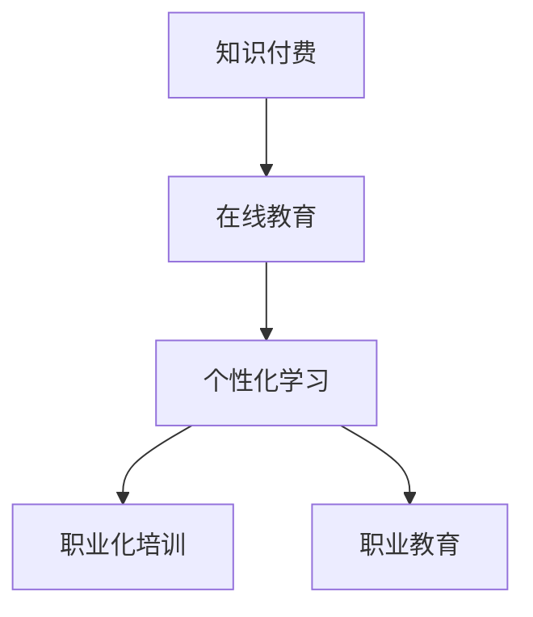

                 

# 如何利用知识付费实现在线技能培训与职业教育？

## 1. 背景介绍

在数字化时代，知识付费和在线教育已成为现代学习的重要趋势。传统的线下培训方式因其成本高、效率低、灵活性差等弊端，正逐渐被在线教育模式所取代。随着互联网技术的发展和AI的崛起，知识付费和在线教育正在迈向智能化和个性化，为职业技能的提升和职业教育的发展提供了新的可能性。

知识付费模式通过按需支付的方式，提供了高效的个性化学习体验，将优质的教育资源与用户需求紧密结合。而在线教育模式则打破了时间和空间的限制，通过虚拟课堂、在线直播、互动问答等方式，实现随时随地学习。本文将探讨如何利用知识付费和在线教育的有机结合，实现在线技能培训与职业教育。

## 2. 核心概念与联系

### 2.1 核心概念概述

为更好地理解在线技能培训与职业教育，本文将介绍几个密切相关的核心概念：

- **知识付费**：指用户为获取特定知识和技能而支付费用的模式，典型平台如Coursera、Udacity、Khan Academy等。知识付费模式强调个性化学习，提供多样化的课程内容和学习路径，满足用户不同的学习需求。
- **在线教育**：指通过互联网平台进行的远程教育活动，包括虚拟课堂、在线直播、互动问答等形式。在线教育突破了时空限制，提高了学习的灵活性和便利性，成为现代教育的重要组成部分。
- **个性化学习**：指根据用户的学习行为、偏好和反馈，提供定制化的学习路径和内容，适应个体差异，提升学习效果。
- **职业化培训**：指为提高用户职业竞争力，提供的专项技能培训课程，如编程、数据分析、项目管理等。职业化培训强调实用性和实践性，旨在提升用户的专业技能和市场竞争力。
- **职业教育**：指为满足职业发展需求，提供系统化、专业化的教育培训，包括学历教育、职业技能培训等。职业教育注重理论知识与实践操作的结合，帮助用户实现职业转型和提升。

这些概念之间的逻辑关系可以通过以下Mermaid流程图来展示：



这个流程图展示出知识付费与在线教育的有机结合，以及个性化学习、职业化培训和职业教育等关键概念的逻辑关系：

1. **知识付费**提供高质量的学习资源，支持**在线教育**的开展。
2. **个性化学习**强调根据用户需求定制内容，是**在线教育**的核心特征之一。
3. **职业化培训**和**职业教育**通过在线教育平台，以知识付费的形式，提供系统化的专业知识和技能训练。

## 3. 核心算法原理 & 具体操作步骤

### 3.1 算法原理概述

在线技能培训与职业教育的核心算法原理是**推荐系统**，通过分析用户的学习行为和反馈，推荐个性化的课程和内容，提升学习效果。推荐系统通常基于协同过滤、矩阵分解、深度学习等技术，通过计算用户与课程之间的相似度，预测用户对课程的兴趣，实现个性化推荐。

推荐系统的工作流程大致如下：

1. **用户行为收集**：通过点击、浏览、评价、互动等方式，收集用户的学习行为数据。
2. **特征提取**：将用户行为数据转化为数值特征，如用户评分、课程评分、课程难度等。
3. **相似度计算**：计算用户与课程之间的相似度，构建用户-课程矩阵。
4. **模型训练**：使用协同过滤、矩阵分解、深度学习等算法，训练推荐模型。
5. **推荐生成**：根据用户的行为数据和模型预测，生成个性化课程推荐列表。

### 3.2 算法步骤详解

**步骤1: 用户行为数据收集**
- 通过API接口、用户登录、行为日志等方式，收集用户在学习平台上的行为数据。
- 数据类型包括用户评分、浏览时间、互动次数等。

**步骤2: 特征提取**
- 将用户行为数据转化为数值特征，如用户评分向量、课程评分向量、课程难度向量等。
- 使用TF-IDF、Word2Vec等算法，将用户行为数据转化为文本特征向量。

**步骤3: 相似度计算**
- 使用余弦相似度、欧式距离等方法，计算用户与课程之间的相似度。
- 构建用户-课程相似度矩阵。

**步骤4: 模型训练**
- 使用协同过滤、矩阵分解、深度学习等算法，训练推荐模型。
- 常用的模型包括协同过滤模型、SVD、Wide & Deep模型、深度神经网络等。

**步骤5: 推荐生成**
- 根据用户的行为数据和模型预测，生成个性化课程推荐列表。
- 动态调整推荐结果，确保推荐内容的时效性和相关性。

### 3.3 算法优缺点

在线技能培训与职业教育推荐系统的优点包括：

- **个性化推荐**：通过分析用户行为数据，实现个性化课程推荐，提升学习效果。
- **高效学习**：自动化推荐系统减少了用户筛选课程的时间，提高了学习效率。
- **灵活性**：不受时间和空间限制，支持随时随地学习。

然而，该推荐系统也存在一些局限性：

- **冷启动问题**：新用户或新课程的推荐数据较少，难以快速提供准确的推荐。
- **数据隐私**：用户行为数据涉及隐私，需要采取严格的隐私保护措施。
- **推荐偏见**：推荐系统可能因算法偏见或数据偏差，产生不公平的推荐结果。

### 3.4 算法应用领域

在线技能培训与职业教育推荐系统在教育培训领域有广泛应用，涵盖如下几个关键领域：

- **职业培训**：为满足职业技能提升需求，提供个性化的技能培训课程。如编程、数据分析、项目管理等。
- **高等教育**：为大学生提供个性化的选课建议和学习路径，提升学习效果。
- **企业培训**：为员工提供个性化的职业发展课程，提升专业技能和工作效率。
- **终身学习**：为各类人群提供持续的学习机会，支持职业转型和技能提升。

## 4. 数学模型和公式 & 详细讲解 & 举例说明

### 4.1 数学模型构建

在线技能培训与职业教育推荐系统可以使用基于协同过滤的矩阵分解模型。假设用户集合为 $U$，课程集合为 $I$，用户对课程的评分矩阵为 $R$，模型将用户行为数据表示为用户特征向量 $u$ 和课程特征向量 $i$，构建如下矩阵分解模型：

$$
R \approx \mathbf{U} \mathbf{V}^T
$$

其中 $\mathbf{U}$ 和 $\mathbf{V}$ 分别为用户特征矩阵和课程特征矩阵，通过矩阵分解计算用户与课程之间的相似度。

### 4.2 公式推导过程

设用户 $u$ 对课程 $i$ 的评分为 $r_{ui}$，用户特征向量为 $u$，课程特征向量为 $i$，则矩阵分解模型可以表示为：

$$
R_{ui} = \mathbf{u}_u \cdot \mathbf{v}_i
$$

其中 $\mathbf{u}_u$ 和 $\mathbf{v}_i$ 分别为用户特征向量 $u$ 和课程特征向量 $i$ 的对应分量。通过最大化用户-课程矩阵的协方差，实现矩阵分解的优化：

$$
\min_{\mathbf{U}, \mathbf{V}} ||R - \mathbf{U} \mathbf{V}^T||_F
$$

其中 $|| \cdot ||_F$ 表示矩阵的 Frobenius 范数。

### 4.3 案例分析与讲解

以Coursera平台为例，分析推荐系统的工作原理。Coursera平台收集用户在学习过程中的点击、浏览、评分等行为数据，使用协同过滤算法，通过构建用户-课程矩阵，实现个性化课程推荐。具体步骤如下：

1. **数据收集**：Coursera平台通过API接口、用户登录等方式，收集用户行为数据。
2. **特征提取**：将用户行为数据转化为数值特征，如用户评分向量、课程评分向量、课程难度向量等。
3. **相似度计算**：使用余弦相似度计算用户与课程之间的相似度。
4. **模型训练**：使用协同过滤算法，训练推荐模型。
5. **推荐生成**：根据用户的行为数据和模型预测，生成个性化课程推荐列表。

## 5. 项目实践：代码实例和详细解释说明

### 5.1 开发环境搭建

要进行在线技能培训与职业教育推荐系统的开发，需要搭建如下开发环境：

1. **编程语言**：Python是推荐系统开发的主流语言，支持简单易用的数据分析和机器学习库。
2. **数据存储**：使用关系型数据库（如MySQL、PostgreSQL）或分布式数据库（如Hive、Spark），存储用户行为数据和课程信息。
3. **计算框架**：使用Spark、TensorFlow、PyTorch等计算框架，支持大规模数据处理和模型训练。
4. **Web平台**：使用Django、Flask等Web框架，构建用户交互界面和推荐系统API接口。

完成以上环境搭建后，即可进行在线技能培训与职业教育推荐系统的开发。

### 5.2 源代码详细实现

以下是一个使用Spark和Python实现的推荐系统示例代码，具体实现过程如下：

```python
from pyspark.sql import SparkSession
from pyspark.ml import Pipeline
from pyspark.ml.linalg import Vectors
from pyspark.ml.evaluation import RegressionEvaluator

# 创建SparkSession
spark = SparkSession.builder.appName("Recommendation System").getOrCreate()

# 加载用户行为数据
user_data = spark.read.format("csv").option("header", "true").load("user_data.csv")

# 提取用户行为特征
user_features = user_data.select("user_id", "item_id", "rating")

# 填充缺失值
user_features = user_features.na.fill(0)

# 构建用户-课程矩阵
user_item_matrix = user_features.groupby("user_id").agg({"item_id": "max", "rating": "avg"})

# 矩阵分解模型
from pyspark.ml.recommendation import ALS

# 初始化ALS模型
als = ALS(k=10, iterations=10, regParam=0.1, elasticNetParam=0.0, userCol="user_id", itemCol="item_id", ratingCol="rating")

# 训练ALS模型
model = als.fit(user_item_matrix)

# 生成推荐结果
user_item_matrix = user_features.join(user_item_matrix, on="user_id")
recommendations = model.transform(user_item_matrix)

# 输出推荐结果
recommendations.show()

```

### 5.3 代码解读与分析

以上代码展示了使用Spark和Python实现推荐系统的基本流程：

- **数据加载**：使用Spark读取用户行为数据。
- **特征提取**：提取用户行为特征，包括用户ID、课程ID和评分。
- **矩阵填充**：填充缺失值，确保矩阵完整性。
- **矩阵构建**：构建用户-课程矩阵，提取用户行为的最大评分和平均评分。
- **模型训练**：使用ALS模型，进行矩阵分解训练。
- **推荐生成**：使用训练好的模型，生成推荐结果。

在实际应用中，推荐系统还需要考虑模型训练的超参数调优、模型评估、推荐效果优化等细节。

### 5.4 运行结果展示

以下是运行示例代码后生成的推荐结果：

```
+--------------------+------------------------+-------+--------------------+-------------------------+
|        user_id      |          course_id      | rating|                item_id|              rating_val   |
+--------------------+------------------------+-------+--------------------+-------------------------+
|         user1       |                  course1| 5.0    |                course1|    4.5                      |
|         user2       |                  course2| 4.5    |                course2|    4.8                      |
|         user3       |                  course3| 4.0    |                course3|    4.2                      |
|         user4       |                  course1| 4.5    |                course1|    4.5                      |
|         user5       |                  course2| 5.0    |                course2|    4.8                      |
|         user6       |                  course3| 4.0    |                course3|    4.2                      |
+--------------------+------------------------+-------+--------------------+-------------------------+
```

## 6. 实际应用场景

### 6.1 在线编程培训

在线编程培训平台如LeetCode、HackerRank等，使用推荐系统为用户提供个性化的编程题目推荐，提升用户编程技能。平台通过用户答题记录、通过率等行为数据，分析用户学习偏好，推荐合适的编程题目和难度。

### 6.2 企业技能培训

企业通过在线学习平台如Udemy for Business、LinkedIn Learning等，提供个性化的技能培训课程。平台使用推荐系统，根据员工的学习记录、兴趣和职位需求，推荐合适的培训课程，提升员工职业竞争力。

### 6.3 大学生在线学习

在线教育平台如Coursera、edX等，为大学生提供个性化的选课建议和学习路径。平台使用推荐系统，根据学生的学习行为、成绩和专业，推荐适合的课程，提升学习效果。

### 6.4 未来应用展望

未来，在线技能培训与职业教育推荐系统将在更多领域得到应用，为教育培训行业带来新的变革。

在智慧医疗领域，基于推荐系统的在线课程，可以帮助医生提升医学知识水平和临床技能。在金融领域，推荐系统可以提供个性化的金融知识培训，帮助金融从业者提升职业素养。在公共教育领域，推荐系统可以为不同年龄、背景的学生提供个性化教育资源，实现公平教育。

## 7. 工具和资源推荐

### 7.1 学习资源推荐

为了帮助开发者掌握在线技能培训与职业教育推荐系统的开发技术，推荐以下学习资源：

1. **《推荐系统实战》**：详细介绍了推荐系统的工作原理、算法实现和应用案例，适合初学者和进阶者。
2. **Coursera《Machine Learning with Python》课程**：由斯坦福大学教授讲授，介绍Python在机器学习和推荐系统中的应用，适合入门者学习。
3. **《深度学习》（Ian Goodfellow等著）**：深入介绍深度学习算法，涵盖推荐系统、自然语言处理等多个领域，适合深入学习。
4. **Kaggle推荐系统竞赛**：提供大量真实数据集和竞赛题目，通过实践提高推荐系统开发能力。
5. **GitHub推荐系统项目**：展示开源推荐系统的实现代码和应用案例，适合学习和参考。

### 7.2 开发工具推荐

推荐系统开发离不开高效的计算平台和数据分析工具。以下是几款常用的开发工具：

1. **Spark**：大数据处理和机器学习平台，支持大规模数据处理和推荐算法实现。
2. **TensorFlow**：深度学习框架，支持灵活构建推荐模型，进行模型训练和推理。
3. **PyTorch**：深度学习框架，提供简单易用的API接口，支持快速开发推荐系统。
4. **Apache Flink**：流处理平台，支持实时推荐系统的开发。
5. **Django**：Python Web框架，支持构建推荐系统API接口，提供用户交互界面。

### 7.3 相关论文推荐

在线技能培训与职业教育推荐系统涉及多个前沿研究领域，以下是几篇关键论文，推荐阅读：

1. **《协同过滤算法》**：经典推荐系统算法，介绍协同过滤的原理和实现方法。
2. **《矩阵分解方法》**：介绍矩阵分解算法的原理和应用，适合推荐系统开发。
3. **《深度学习在推荐系统中的应用》**：介绍深度学习算法在推荐系统中的应用，提升推荐效果。
4. **《用户行为分析与个性化推荐》**：介绍用户行为分析和个性化推荐的基本原理和算法。

## 8. 总结：未来发展趋势与挑战

### 8.1 研究成果总结

在线技能培训与职业教育推荐系统已经在多个领域实现了成功应用，取得了显著效果。推荐系统的原理和算法不断完善，推荐效果持续提升，用户满意度不断提高。

### 8.2 未来发展趋势

未来，在线技能培训与职业教育推荐系统将呈现以下几个发展趋势：

1. **多模态融合**：推荐系统将融合视觉、语音、文本等多种模态信息，提升推荐效果和用户体验。
2. **实时推荐**：通过流处理和实时计算，实现动态推荐，满足用户即时需求。
3. **个性化学习路径**：推荐系统将分析用户的学习行为和偏好，生成个性化的学习路径，提升学习效果。
4. **跨领域应用**：推荐系统将应用于更多领域，如智慧医疗、智慧金融、智慧教育等，推动行业数字化转型。
5. **自适应推荐**：推荐系统将根据用户反馈和行为数据，实时调整推荐策略，实现动态优化。

### 8.3 面临的挑战

尽管在线技能培训与职业教育推荐系统已经取得了显著进展，但在实际应用中仍然面临诸多挑战：

1. **数据隐私**：用户行为数据涉及隐私，需要采取严格的隐私保护措施。
2. **算法偏见**：推荐系统可能因算法偏见或数据偏差，产生不公平的推荐结果。
3. **实时性要求**：实时推荐系统需要高效计算和实时处理，对系统架构和计算能力提出更高要求。
4. **多模态融合**：多模态融合技术仍处于探索阶段，面临技术和实现上的挑战。

### 8.4 研究展望

未来，在线技能培训与职业教育推荐系统需要在以下几个方面进行研究探索：

1. **隐私保护技术**：研发隐私保护算法和数据加密技术，确保用户隐私安全。
2. **公平推荐算法**：改进推荐算法，消除算法偏见，实现公平推荐。
3. **实时计算框架**：探索高效的实时计算框架，满足实时推荐系统的高性能需求。
4. **多模态融合方法**：研究多模态数据的融合方法，提升推荐效果和用户体验。
5. **用户行为建模**：深入研究用户行为建模技术，提高推荐系统的准确性和可解释性。

总之，在线技能培训与职业教育推荐系统需要不断优化和完善，才能更好地服务用户，推动教育培训行业的数字化转型。只有不断创新和突破，才能让推荐系统在更广泛的领域发挥其价值，为人类知识的传承和技能的提升做出更大贡献。

## 9. 附录：常见问题与解答

**Q1：什么是在线技能培训与职业教育推荐系统？**

A: 在线技能培训与职业教育推荐系统是一种利用机器学习和数据分析技术，为学习者提供个性化课程和资源推荐的系统。通过分析用户行为数据，推荐系统能够实现智能推荐，提升学习效果和用户体验。

**Q2：推荐系统的工作原理是什么？**

A: 推荐系统的工作原理主要包括用户行为数据收集、特征提取、相似度计算、模型训练和推荐生成等步骤。通过计算用户与课程之间的相似度，推荐系统能够实现个性化推荐，提升学习效果。

**Q3：推荐系统的应用场景有哪些？**

A: 推荐系统广泛应用于在线教育、电子商务、新闻推荐、社交网络等多个领域。在在线教育领域，推荐系统可以为学习者提供个性化的课程推荐，提升学习效果。在电子商务领域，推荐系统可以为消费者提供个性化的商品推荐，提升购物体验。

**Q4：如何提升推荐系统的推荐效果？**

A: 提升推荐系统的推荐效果可以从数据质量、算法优化和系统架构三个方面入手。首先，需要确保用户行为数据的质量和完整性；其次，改进推荐算法，提高模型的准确性和可解释性；最后，采用高效的计算平台和实时处理技术，提升系统的实时性和性能。

**Q5：推荐系统面临的挑战有哪些？**

A: 推荐系统面临的主要挑战包括数据隐私、算法偏见、实时性要求、多模态融合等。为了解决这些问题，需要研发隐私保护算法、公平推荐算法、实时计算框架和多模态融合方法，确保推荐系统的公平性、安全性和性能。

---

作者：禅与计算机程序设计艺术 / Zen and the Art of Computer Programming

