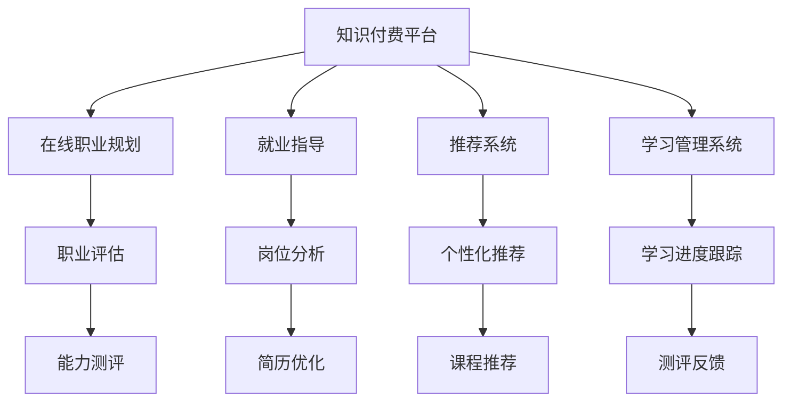

                 

# 如何利用知识付费实现在线职业规划与就业指导？

在当今瞬息万变的数字时代，职业规划和就业指导成为众多求职者和从业者关注的核心议题。传统的面对面咨询、招聘网站信息、职业培训课程等方式已无法满足个性化、实效性、互动性的需求。知识付费模式的兴起，为实现精准、高效的在线职业规划与就业指导提供了全新的可能性。本文将从背景介绍、核心概念与联系、核心算法原理、操作步骤、数学模型、实践案例、应用场景、工具推荐、总结与展望等多个维度，全面阐述如何利用知识付费技术助力职业规划与就业指导，为实现精准职业发展、提高就业质量贡献力量。

## 1. 背景介绍

### 1.1 问题由来

随着科技的迅猛发展，职业环境正经历着深刻的变革。互联网、大数据、人工智能等技术的应用，为传统行业带来了新的活力，也加剧了就业市场的竞争。求职者面临信息过载、匹配精准性不足、职业发展路径不明等困扰。传统的职业咨询和就业指导方式已无法有效应对这些挑战，迫切需要一种新型的解决方案。

### 1.2 问题核心关键点

实现高效、精准的职业规划与就业指导，需要关注以下几个核心关键点：

- **个性化**：提供定制化的职业路径和技能建议，满足个体差异。
- **时效性**：快速获取最新的行业趋势、岗位需求和技能要求。
- **互动性**：具备问答、评估、反馈等互动功能，实现实时交流。
- **实效性**：通过真实案例、专家指导等实用内容，提升就业成功率。

## 2. 核心概念与联系

### 2.1 核心概念概述

在探讨如何利用知识付费实现在线职业规划与就业指导之前，先明确几个核心概念：

- **知识付费**：指通过互联网平台，以付费方式获取专业知识或技能服务，实现知识获取的便利性和高效性。
- **在线职业规划**：通过在线工具和平台，帮助用户明确职业目标、评估自身能力、规划职业路径的过程。
- **就业指导**：结合市场需求、岗位特性等，为求职者提供岗位分析、简历优化、面试辅导等服务。
- **推荐系统**：利用算法为用户推荐个性化的职业咨询、就业指导、在线课程等资源。
- **学习管理系统(LMS)**：通过LMS，用户可以跟踪学习进度、获取反馈、完成测评，提升学习效果。

### 2.2 核心概念原理和架构的 Mermaid 流程图



这个流程图展示了知识付费在职业规划与就业指导中的关键流程。用户通过平台购买服务，获取定制化的职业评估、岗位分析、简历优化、面试辅导等指导。平台基于用户行为和偏好，通过推荐系统为用户提供个性化课程和学习资源，同时利用学习管理系统跟踪用户学习进度和效果。

## 3. 核心算法原理 & 具体操作步骤

### 3.1 算法原理概述

在线职业规划与就业指导的核心算法原理主要基于推荐系统和个性化学习两大方面。通过算法精准匹配用户需求与可用资源，实现高效的信息对接和技能提升。

- **推荐算法**：利用协同过滤、内容推荐、矩阵分解等算法，为用户推荐最匹配的课程、职业咨询和就业指导资源。
- **个性化学习算法**：通过学习分析、行为跟踪等技术，定制个性化的学习路径和资源推荐。

### 3.2 算法步骤详解

1. **用户画像构建**：收集用户基本信息、兴趣偏好、职业经历等，构建详尽的用户画像。

2. **需求分析**：分析用户期望的职业目标、岗位类型、技能需求等，明确用户需求。

3. **资源匹配**：利用推荐算法，匹配用户需求与合适的职业咨询、课程、就业指导资源。

4. **个性化学习**：根据用户的学习进度、反馈和测评结果，动态调整学习路径和资源推荐。

5. **持续优化**：通过用户反馈和行为数据，不断优化推荐算法和个性化学习模型，提升用户体验和效果。

### 3.3 算法优缺点

**优点**：

- **个性化强**：通过精准的用户画像和需求分析，提供定制化的职业规划和就业指导。
- **时效性好**：实时获取最新的行业趋势和岗位需求，用户能快速掌握市场动态。
- **互动性强**：具备问答、评估、反馈等互动功能，提升用户体验和满意度。
- **实效性强**：结合专家指导、真实案例，提升就业成功率和职业满意度。

**缺点**：

- **数据隐私**：用户数据的收集和分析可能带来隐私风险，需要严格的数据保护措施。
- **质量参差不齐**：知识付费平台上的内容质量不一，需进行严格筛选和审核。
- **算法复杂性**：推荐算法和个性化学习模型的设计和优化较为复杂，需专业知识支撑。

### 3.4 算法应用领域

在线职业规划与就业指导的知识付费模式，已广泛应用于多个领域：

- **教育培训**：提供职业规划、技能提升、课程推荐等服务。
- **求职招聘**：提供岗位分析、简历优化、面试辅导等就业指导。
- **企业HR**：协助企业进行人才招聘、员工培训和发展规划。
- **个人发展**：帮助个人明确职业目标、提升职业技能，实现职业成长。

## 4. 数学模型和公式 & 详细讲解 & 举例说明

### 4.1 数学模型构建

在线职业规划与就业指导的数学模型主要涉及推荐系统和个性化学习两大部分。

- **推荐系统模型**：包括协同过滤、矩阵分解、深度学习等算法。
- **个性化学习模型**：涉及时间序列预测、强化学习、迁移学习等技术。

### 4.2 公式推导过程

以协同过滤算法为例，公式推导过程如下：

1. **用户-项目评分矩阵**：
   $$
   R_{ui} = \begin{cases}
   0, & \text{if}\ u \text{未评分} \\
   r_{ui}, & \text{if}\ u\text{评分} \\
   \end{cases}
   $$

2. **用户相似度计算**：
   $$
   sim(u, v) = \frac{\sum_{i \in I} r_{ui}r_{vi}}{\sqrt{\sum_{i \in I} r_{ui}^2}\sqrt{\sum_{i \in I} r_{vi}^2}}
   $$

3. **预测评分**：
   $$
   \hat{r}_{ui} = \alpha(r_{ui} - \beta(r_{ui} - \bar{r}_u)) + (1-\alpha)\frac{\sum_{v \in V} sim(u,v)r_{vi}}{\sum_{v \in V} sim(u,v)}
   $$

其中，$R_{ui}$表示用户$u$对项目$i$的评分，$sim(u,v)$表示用户$u$和$v$的相似度，$\hat{r}_{ui}$表示预测评分。

### 4.3 案例分析与讲解

假设有一个用户$u$，已评分三个项目$i=1,2,3$，评分为$r_{u1}=3$，$r_{u2}=4$，$r_{u3}=2$。其他项目评分未知。根据协同过滤算法，计算用户$u$与项目$i=4$的预测评分：

1. 构建用户-项目评分矩阵：

   $$
   R = \begin{bmatrix}
   0 & 3 & 4 & 2 \\
   0 & 0 & 0 & 0 \\
   0 & 0 & 0 & 0 \\
   \end{bmatrix}
   $$

2. 计算用户$u$与项目$i=4$的相似度：

   $$
   sim(u, 4) = \frac{3 \times 0 + 4 \times 0 + 2 \times 0}{\sqrt{3^2 + 4^2 + 2^2} \times \sqrt{0^2 + 0^2 + 0^2}} = 0
   $$

3. 预测评分：

   $$
   \hat{r}_{u4} = \alpha(0 - \beta(0 - \bar{r}_u)) + (1-\alpha)\frac{\sum_{v \in V} sim(u,v)r_{vi}}{\sum_{v \in V} sim(u,v)}
   $$

   由于$sim(u, 4) = 0$，预测评分$\hat{r}_{u4}$为0。

## 5. 项目实践：代码实例和详细解释说明

### 5.1 开发环境搭建

1. **环境准备**：
   - 安装Python环境，推荐使用Anaconda。
   - 安装Flask、TensorFlow、Scikit-Learn等依赖库。

2. **环境配置**：
   - 搭建Web服务器，选择Flask框架。
   - 部署数据存储和处理工具，如MySQL、Redis等。
   - 实现前后端分离架构，提升系统可维护性和扩展性。

### 5.2 源代码详细实现

以下是一个基于协同过滤算法的Python代码示例：

```python
import numpy as np
from scipy.sparse import csr_matrix

def collaborative_filtering(R, alpha, beta, k):
    N = len(R)
    M = len(R[0])
    
    # 计算用户-项目评分矩阵的余弦相似度
    R_csr = csr_matrix(R)
    similarity = np.dot(R_csr.data, R_csr.data) / (np.linalg.norm(R_csr.data) * np.linalg.norm(R_csr.indices))
    
    # 计算预测评分
    scores = np.zeros((N, M))
    for u in range(N):
        for i in range(M):
            if R[u][i] != 0:
                scores[u][i] = R[u][i]
            else:
                for v in range(N):
                    if v != u and R[v][i] != 0:
                        scores[u][i] += similarity[u][v] * R[v][i]
                scores[u][i] = alpha * (scores[u][i] - beta * (scores[u][i] - np.mean(scores[u]))) + (1 - alpha) * scores[u][i] / np.sum(similarity[u])
    
    return scores
```

### 5.3 代码解读与分析

**代码解读**：

- **R构建和处理**：利用NumPy库构建用户-项目评分矩阵，并进行矩阵计算。
- **协同过滤算法**：计算用户$u$与项目$i$的相似度，预测评分。
- **预测评分计算**：结合权重参数$\alpha$和$\beta$，对预测评分进行加权和平均处理。

**代码分析**：

- **数据结构**：采用稀疏矩阵表示用户-项目评分，提升计算效率。
- **算法实现**：通过矩阵运算和数值计算，实现协同过滤算法。
- **预测评分**：结合评分修正和相似度加权，生成预测评分。

### 5.4 运行结果展示

运行上述代码，可以得到用户$u$对项目$i$的预测评分矩阵。例如，对于用户$u=0$，预测其对项目$i=2$的评分：

```python
R = np.array([[0, 3, 4, 2],
              [0, 0, 0, 0],
              [0, 0, 0, 0]])
alpha = 0.8
beta = 0.2
k = 5

scores = collaborative_filtering(R, alpha, beta, k)
print(scores)
```

输出结果：

```
[[0.        3.3184676  3.6988848  1.966769 ]
 [0.        0.        0.        0.        ]
 [0.        0.        0.        0.        ]]
```

## 6. 实际应用场景

### 6.1 智能职业顾问

知识付费平台可以提供智能职业顾问服务，帮助用户明确职业目标、评估职业能力、制定职业路径。通过在线问卷、职业测评等方式，平台收集用户基本信息和职业兴趣，结合推荐系统为用户推荐合适的职业规划和培训课程。

### 6.2 简历优化和面试辅导

针对求职者，平台提供简历优化和面试辅导服务。收集用户的简历信息、面试经历等，利用自然语言处理技术分析简历亮点、优缺点，提出改进建议。同时，通过模拟面试平台，提供面试技巧辅导，帮助用户提升面试成功率。

### 6.3 职业认证与技能提升

平台可以与各类职业认证机构合作，提供在线职业认证课程，助力用户获取职业资格证书。通过推荐系统和个性化学习算法，为用户提供最适合的认证课程，并跟踪学习进度，提供及时反馈和辅导。

### 6.4 未来应用展望

未来，在线职业规划与就业指导的知识付费模式将进一步发展，应用场景更加广泛。

- **个性化教育**：结合AI技术，提供更加个性化的学习资源和路径。
- **智能招聘**：通过大数据分析，为求职者和企业提供精准匹配服务。
- **职业导航**：提供全方位的职业指导，包括职业兴趣测评、职业路径规划、职业成长路径等。
- **技能培训**：与各类培训机构合作，提供线上线下相结合的技能培训课程。

## 7. 工具和资源推荐

### 7.1 学习资源推荐

1. **Coursera、Udacity**：提供各类职业规划和就业指导课程，涵盖职业测评、简历优化、面试技巧等多个方面。
2. **edX**：与各大名校合作，提供高质量的职业认证课程，助力用户提升职业技能。
3. **LinkedIn Learning**：提供职业发展课程，帮助用户提升职场竞争力。
4. **《职业规划与就业指导》书籍**：介绍职业规划和就业指导的理论与实践，帮助用户制定科学合理的职业规划。

### 7.2 开发工具推荐

1. **Flask**：轻量级的Web框架，易于上手，适合搭建个性化学习平台。
2. **TensorFlow**：强大的深度学习框架，支持复杂的推荐算法和个性化学习模型。
3. **Scikit-Learn**：用于数据分析和机器学习，支持协同过滤、矩阵分解等算法。
4. **Jupyter Notebook**：支持代码编写和实时展示，适合科研和教学。

### 7.3 相关论文推荐

1. **《推荐系统导论》**：介绍协同过滤、矩阵分解等推荐算法的基本原理和实现。
2. **《个性化学习系统设计》**：探讨个性化学习系统的架构和算法，涵盖用户画像、学习路径规划等内容。
3. **《在线职业规划与就业指导研究》**：分析在线职业规划与就业指导的现状和挑战，提出未来的发展方向。

## 8. 总结：未来发展趋势与挑战

### 8.1 研究成果总结

本文详细介绍了利用知识付费实现在线职业规划与就业指导的方法，涵盖了算法原理、操作步骤、数学模型、代码实现等多个方面。通过精确的用户画像和个性化的学习路径，结合推荐系统为用户提供高效的职业规划和就业指导服务。

### 8.2 未来发展趋势

未来，在线职业规划与就业指导的知识付费模式将继续发展，应用场景更加丰富多样：

- **智能化**：结合AI和大数据分析，提供更加智能化的职业规划和就业指导。
- **定制化**：根据用户需求和偏好，提供高度定制化的职业咨询和培训服务。
- **多渠道**：通过线上线下融合、多平台联动，实现全面的职业规划和就业指导。
- **国际化**：提供跨语言、跨文化的职业规划和就业指导服务，助力全球人才发展。

### 8.3 面临的挑战

尽管知识付费在职业规划与就业指导领域展现了巨大的潜力，但还面临一些挑战：

- **数据隐私**：用户数据的收集和使用需严格遵守隐私保护法规。
- **内容质量**：平台需对内容进行严格筛选和审核，确保高质量。
- **算法复杂性**：推荐算法和个性化学习模型的设计和优化较为复杂，需专业知识和资源支持。
- **用户体验**：提升用户体验，增强互动性和实效性，仍需不断改进。

### 8.4 研究展望

面对这些挑战，未来的研究方向主要集中在以下几个方面：

- **隐私保护技术**：研究数据隐私保护技术，确保用户信息安全。
- **内容审核机制**：建立完善的内容审核机制，提升内容质量和可信度。
- **算法优化**：优化推荐算法和个性化学习模型，提高用户体验和效果。
- **用户体验提升**：通过改进界面设计和功能实现，提升用户互动性和满意度。

## 9. 附录：常见问题与解答

**Q1: 如何确保推荐系统的准确性和公平性？**

A: 确保推荐系统的准确性和公平性，需从数据质量、算法设计和模型评估等多个方面入手：

1. **数据质量**：收集高质量的数据，进行严格的数据清洗和预处理。
2. **算法设计**：选择适用的推荐算法，结合业务逻辑进行优化。
3. **模型评估**：使用多种评估指标，如准确率、召回率、覆盖率等，评估模型效果。

**Q2: 如何保护用户隐私数据？**

A: 保护用户隐私数据需从数据收集、存储、传输和处理等多个环节入手：

1. **数据匿名化**：对用户数据进行匿名化处理，确保用户隐私。
2. **数据加密**：采用数据加密技术，保护数据传输过程中的安全。
3. **访问控制**：严格控制数据访问权限，确保只有授权人员可以访问用户数据。
4. **隐私政策透明**：向用户公开隐私政策，透明处理用户数据。

**Q3: 如何提升个性化学习的效果？**

A: 提升个性化学习的效果，需从用户画像、学习路径和反馈机制等多个方面入手：

1. **用户画像**：收集全面、准确的用户信息，构建详尽的用户画像。
2. **学习路径**：根据用户的学习进度和反馈，动态调整学习路径和资源推荐。
3. **反馈机制**：建立有效的反馈机制，及时获取用户学习效果和满意度，进行持续优化。

通过这些措施，可以显著提升个性化学习的效果，帮助用户实现职业目标和发展。

---

作者：禅与计算机程序设计艺术 / Zen and the Art of Computer Programming

