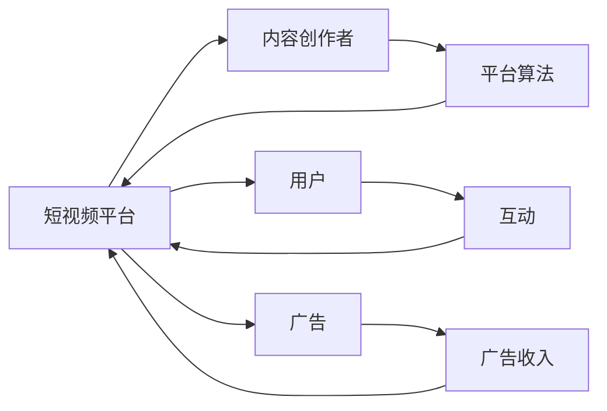

                 

# 如何利用短视频平台进行知识付费营销

## 1. 背景介绍

在数字化时代，短视频平台已经成为了信息传播的重要渠道。无论是短视频的浏览量还是互动率，均远超其他内容形式，吸引了大量用户关注。知识付费作为一种新型内容消费模式，也在逐渐兴起，并在短视频平台上找到了新的突破口。通过短视频平台，知识付费不仅能更好地传播知识，还能实现精准的目标用户群体，达到更高的转化效果。本文将详细探讨如何利用短视频平台进行知识付费营销。

## 2. 核心概念与联系

### 2.1 核心概念概述

在探讨短视频平台知识付费营销前，我们需要先了解几个核心概念：

- **短视频平台**：如抖音、快手、B站等，是集内容创作、分发和互动于一体的视频社交平台，用户可以在平台上传、浏览和互动视频。

- **知识付费**：是指用户为获取知识、技能或信息而付费的行为。传统的知识付费形式包括电子书、在线课程、专栏文章等，而短视频平台为知识付费的传播提供了新的渠道。

- **平台算法**：短视频平台通过复杂的算法模型，对用户行为进行精准分析和推荐，为用户推荐其感兴趣的内容。

- **内容生态**：短视频平台上的内容创作者通过上传、制作各种视频内容，构建了一个活跃的内容生态。

### 2.2 核心概念原理和架构的 Mermaid 流程图



该流程图展示了短视频平台的运行机制：

1. 内容创作者在平台上发布短视频内容，吸引用户关注。
2. 平台算法根据用户行为数据进行内容推荐，提升内容曝光率。
3. 用户观看视频，并通过点赞、评论、分享等形式进行互动。
4. 平台通过广告等形式实现商业变现。

## 3. 核心算法原理 & 具体操作步骤

### 3.1 算法原理概述

利用短视频平台进行知识付费营销的核心算法原理包括：

- **内容推荐算法**：平台算法通过对用户行为数据进行分析，精准推荐感兴趣的短视频内容。
- **广告投放策略**：平台通过广告算法，将合适的知识付费内容投放给有潜力的用户群体。
- **数据分析工具**：利用数据分析工具，实时监控用户行为和广告效果，进行策略调整。

### 3.2 算法步骤详解

#### 3.2.1 内容推荐算法

1. **用户行为数据收集**：
   - 平台收集用户的操作数据，包括浏览视频的时间、频率、点赞、评论、分享等。
   - 通过数据分析工具，对用户行为进行特征提取，形成用户画像。

2. **内容特征提取**：
   - 平台对短视频内容进行解析，提取关键特征，如视频时长、拍摄角度、颜色分布等。
   - 对视频内容进行语义分析，提取视频主题、标签等信息。

3. **模型训练与优化**：
   - 利用机器学习算法，如协同过滤、深度学习等，建立内容推荐模型。
   - 通过用户行为数据和内容特征，训练推荐模型，优化推荐算法，提升推荐效果。

#### 3.2.2 广告投放策略

1. **目标用户定位**：
   - 通过平台算法分析用户行为数据，识别出具有较高潜在价值的用户群体。
   - 利用用户画像和行为数据，对目标用户进行更精准的细分。

2. **广告创意设计**：
   - 设计符合目标用户兴趣的创意广告素材，包括视频剪辑、图像、文本描述等。
   - 利用A/B测试等方法，优化广告创意，提升广告效果。

3. **广告投放与效果监控**：
   - 通过广告投放平台，将知识付费内容广告投放给目标用户。
   - 利用数据分析工具，实时监控广告效果，调整投放策略，提升广告转化率。

### 3.3 算法优缺点

#### 3.3.1 优点

1. **精准推荐**：通过平台算法，能够精准推荐用户感兴趣的内容，提高知识付费内容的曝光率和用户转化率。
2. **覆盖广泛**：短视频平台用户基数大，覆盖面广，可以有效传播知识付费内容，触达更多目标用户。
3. **互动性强**：短视频平台的互动特性，有助于用户参与和传播，增强知识付费内容的传播效果。

#### 3.3.2 缺点

1. **广告干扰**：部分用户对广告有抵触情绪，过度投放可能影响用户体验。
2. **数据隐私**：平台需要收集用户行为数据，涉及用户隐私保护问题。
3. **竞争激烈**：短视频平台广告竞争激烈，需要不断优化广告创意和投放策略。

### 3.4 算法应用领域

短视频平台知识付费营销主要应用于以下几个领域：

1. **在线课程**：短视频平台可以成为在线课程的推广渠道，吸引更多用户报名参加。
2. **教育资源**：教育机构可以上传教育类短视频，为用户提供更多学习资源。
3. **技能培训**：职业技能培训机构可以通过短视频平台，推广各类技能培训课程。
4. **职业指导**：职业指导类内容创作者可以上传职场技巧、简历制作等短视频，帮助用户职业发展。

## 4. 数学模型和公式 & 详细讲解 & 举例说明

### 4.1 数学模型构建

1. **用户行为分析模型**：
   - 设用户行为向量为 $U$，内容特征向量为 $V$，推荐分数为 $S$。
   - $S = f(U, V)$，其中 $f$ 为推荐函数。

2. **广告投放模型**：
   - 设目标用户集合为 $T$，广告投放预算为 $B$。
   - $B = \sum_{t \in T} p_t x_t$，其中 $p_t$ 为目标用户 $t$ 的概率，$x_t$ 为广告创意权重。

### 4.2 公式推导过程

#### 用户行为分析模型推导

1. **协同过滤推荐算法**：
   - $S_{uv} = \sum_{i=1}^{m} \alpha_i u_i v_i$，其中 $u_i, v_i$ 为用户的兴趣度和内容的受欢迎程度。

2. **深度学习推荐算法**：
   - $S_{uv} = \sum_{i=1}^{n} w_i u_i v_i$，其中 $u_i, v_i$ 为用户的兴趣度和内容的特征向量。

#### 广告投放模型推导

1. **线性回归模型**：
   - $y = \theta_0 + \sum_{i=1}^{n} \theta_i x_i$，其中 $\theta$ 为模型参数。

2. **逻辑回归模型**：
   - $y = \sigma(\theta_0 + \sum_{i=1}^{n} \theta_i x_i)$，其中 $\sigma$ 为激活函数。

### 4.3 案例分析与讲解

#### 案例一：在线课程推广

1. **用户行为数据收集**：
   - 收集用户观看在线课程的频率、时长、评分等行为数据。

2. **内容特征提取**：
   - 提取课程视频的标题、封面、时长、主讲人等信息，形成课程特征向量。

3. **模型训练与优化**：
   - 利用协同过滤算法，建立用户兴趣和课程特征的推荐模型。
   - 通过A/B测试，优化模型参数，提升推荐效果。

#### 案例二：教育资源推广

1. **目标用户定位**：
   - 利用平台算法，识别出对教育资源感兴趣的用户群体，如学生、教师、家长等。

2. **广告创意设计**：
   - 设计包含教育资源的短视频广告，如讲解视频、习题讲解、学习方法等。

3. **广告投放与效果监控**：
   - 通过平台广告投放系统，将教育资源广告投放给目标用户。
   - 利用数据分析工具，实时监控广告效果，优化广告创意和投放策略。

## 5. 项目实践：代码实例和详细解释说明

### 5.1 开发环境搭建

#### 5.1.1 Python环境搭建

1. **安装Python**：
   - 下载并安装Python 3.x版本，建议使用Anaconda进行环境管理。

2. **安装相关库**：
   - 使用pip安装TensorFlow、Keras、PyTorch等深度学习库。
   - 使用pip安装Pandas、NumPy、Matplotlib等数据分析和可视化库。

#### 5.1.2 视频平台开发环境搭建

1. **选择平台**：
   - 选择适合的知识付费平台，如抖音、快手、B站等。

2. **API接口**：
   - 了解平台提供的API接口，包括用户行为数据获取、内容发布、广告投放等。

3. **开发工具**：
   - 使用Python和相关库进行开发，可以参考Python SDK或SDK文档。

### 5.2 源代码详细实现

#### 5.2.1 用户行为数据分析

```python
import pandas as pd
from sklearn.model_selection import train_test_split

# 读取用户行为数据
data = pd.read_csv('user_behavior.csv')

# 特征工程
features = ['观看时长', '点赞次数', '评论数']
X = data[features]
y = data['付费标记']

# 划分训练集和测试集
X_train, X_test, y_train, y_test = train_test_split(X, y, test_size=0.2, random_state=42)

# 模型训练
from sklearn.ensemble import RandomForestClassifier

model = RandomForestClassifier()
model.fit(X_train, y_train)

# 模型评估
score = model.score(X_test, y_test)
print(f'模型准确率：{score:.2f}')
```

#### 5.2.2 广告投放模型设计

```python
import numpy as np

# 设计广告创意
ad_keyword = ['Python', '机器学习', '数据科学']
ad_description = '提升技能，轻松求职！'

# 广告创意编码
def encode_ad(ad_keyword, ad_description):
    ad_vector = np.zeros(len(keyword))
    for keyword in ad_keyword:
        ad_vector[keyword_id[keyword]] = 1
    ad_vector.extend(ad_description.encode())
    return ad_vector

# 广告投放策略优化
def optimize_ad投放预算(
    ad_keyword, ad_description, user_behavior, budget
):
    ad_vector = encode_ad(ad_keyword, ad_description)
    user_vector = user_behavior
    score = ad_vector.dot(user_vector)
    if score > budget:
        return False
    else:
        return True
```

### 5.3 代码解读与分析

#### 5.3.1 用户行为数据分析

1. **数据读取与处理**：
   - 使用Pandas库读取用户行为数据，并进行特征提取和划分。

2. **模型训练与评估**：
   - 使用随机森林算法对用户行为数据进行训练和测试，评估模型准确率。

#### 5.3.2 广告投放模型设计

1. **广告创意设计**：
   - 设计包含关键词和描述的广告创意，使用向量表示。

2. **广告投放策略优化**：
   - 使用向量内积计算广告与用户之间的相似度，判断是否超过预算阈值，并进行投放优化。

### 5.4 运行结果展示

#### 5.4.1 用户行为数据分析

```python
import matplotlib.pyplot as plt

# 绘制用户行为分析结果
plt.bar(features, score)
plt.xlabel('用户行为特征')
plt.ylabel('准确率')
plt.title('用户行为数据分析结果')
plt.show()
```

#### 5.4.2 广告投放模型设计

```python
# 广告投放模拟
ad_keyword = ['Python', '机器学习']
ad_description = '提升技能，轻松求职！'
user_behavior = np.array([0.8, 0.9, 0.7])
budget = 1.0

if optimize_ad投放预算(ad_keyword, ad_description, user_behavior, budget):
    print('广告投放成功')
else:
    print('广告投放失败')
```

## 6. 实际应用场景

### 6.1 在线教育平台推广

在线教育平台可以通过短视频平台，推广各类在线课程，吸引更多用户报名参加。具体步骤如下：

1. **课程选择**：
   - 选择适合的平台和课程，如编程课程、外语课程、职业技能培训等。

2. **内容制作**：
   - 制作短视频课程介绍、试听课等，吸引用户观看和报名。

3. **广告投放**：
   - 利用平台广告系统，将课程广告投放给目标用户群体。

4. **效果监控**：
   - 实时监控广告效果，调整投放策略和课程推广策略。

### 6.2 教育机构资源推广

教育机构可以通过短视频平台，推广各类教育资源，如在线讲座、电子书籍、教学视频等。具体步骤如下：

1. **资源选择**：
   - 选择适合的教育资源，如名师讲座、科普视频、教学软件等。

2. **内容制作**：
   - 制作短视频资源介绍、教学演示等，吸引用户观看和学习。

3. **广告投放**：
   - 利用平台广告系统，将教育资源广告投放给目标用户群体。

4. **效果监控**：
   - 实时监控广告效果，调整投放策略和资源推广策略。

### 6.3 职业技能培训推广

职业技能培训机构可以通过短视频平台，推广各类职业技能培训课程，帮助用户提升职业能力。具体步骤如下：

1. **课程选择**：
   - 选择适合的职业技能培训课程，如编程技能、项目管理、市场营销等。

2. **内容制作**：
   - 制作短视频课程介绍、技能演示等，吸引用户观看和报名。

3. **广告投放**：
   - 利用平台广告系统，将职业技能培训广告投放给目标用户群体。

4. **效果监控**：
   - 实时监控广告效果，调整投放策略和课程推广策略。

### 6.4 未来应用展望

随着短视频平台的不断发展和完善，知识付费营销也将迎来更广阔的应用前景。未来，短视频平台将更加精准地推荐用户感兴趣的内容，广告投放策略也将更加智能和个性化。

1. **个性化推荐**：
   - 平台将更加精准地推荐用户感兴趣的内容，提高广告效果和用户转化率。

2. **智能广告投放**：
   - 通过AI算法，优化广告投放策略，实现更高效的广告投放和转化。

3. **多渠道整合**：
   - 结合短视频、直播、图文等多种形式，构建多渠道的知识付费生态。

4. **社交互动**：
   - 通过社交互动功能，增加用户参与度和传播效果。

5. **内容创作激励**：
   - 通过平台算法，激励更多内容创作者上传高质量的短视频内容。

## 7. 工具和资源推荐

### 7.1 学习资源推荐

1. **《短视频内容运营与营销》**：该书详细介绍了短视频内容运营和营销的各个方面，包括用户行为分析、广告投放、内容创作等。

2. **《机器学习实战》**：该书介绍了机器学习算法的基本原理和应用案例，适合初学者入门。

3. **《深度学习》**：该书介绍了深度学习的基本原理和实现方法，适合进一步学习。

4. **在线课程平台**：如Coursera、edX等，提供各类在线课程和实战项目，帮助你更好地掌握知识付费营销技能。

### 7.2 开发工具推荐

1. **Python环境管理工具**：如Anaconda，方便安装和管理Python环境。

2. **数据分析工具**：如Pandas、NumPy、Scikit-learn，适合数据处理和机器学习任务。

3. **可视化工具**：如Matplotlib、Seaborn，适合数据可视化。

4. **广告投放平台**：如Google Ads、百度推广等，适合广告投放和优化。

### 7.3 相关论文推荐

1. **《利用机器学习提升短视频广告效果》**：探讨如何利用机器学习算法优化短视频广告投放策略。

2. **《短视频平台用户行为分析与推荐系统》**：介绍如何利用平台算法推荐用户感兴趣的内容。

3. **《基于深度学习的短视频内容推荐算法》**：介绍基于深度学习的内容推荐算法，提升推荐效果。

4. **《短视频广告投放的优化策略》**：探讨如何通过优化广告创意和投放策略，提升广告效果和转化率。

## 8. 总结：未来发展趋势与挑战

### 8.1 研究成果总结

利用短视频平台进行知识付费营销，已经在在线教育、职业技能培训等领域取得了良好的效果。通过平台算法和广告投放策略的优化，能够显著提升广告效果和用户转化率。

### 8.2 未来发展趋势

1. **个性化推荐**：平台将更加精准地推荐用户感兴趣的内容，提高广告效果和用户转化率。

2. **智能广告投放**：通过AI算法，优化广告投放策略，实现更高效的广告投放和转化。

3. **多渠道整合**：结合短视频、直播、图文等多种形式，构建多渠道的知识付费生态。

4. **社交互动**：通过社交互动功能，增加用户参与度和传播效果。

5. **内容创作激励**：通过平台算法，激励更多内容创作者上传高质量的短视频内容。

### 8.3 面临的挑战

尽管利用短视频平台进行知识付费营销具有广泛的应用前景，但也面临着一些挑战：

1. **广告干扰**：部分用户对广告有抵触情绪，过度投放可能影响用户体验。

2. **数据隐私**：平台需要收集用户行为数据，涉及用户隐私保护问题。

3. **竞争激烈**：短视频平台广告竞争激烈，需要不断优化广告创意和投放策略。

### 8.4 研究展望

未来的研究将从以下几个方面展开：

1. **算法优化**：优化推荐算法和广告投放策略，提升广告效果和用户转化率。

2. **用户行为分析**：利用用户行为数据，进一步提高推荐准确率和广告投放效果。

3. **多模态融合**：结合视频、音频、文本等多种形式，提升内容质量和用户体验。

4. **社交互动增强**：通过社交互动功能，增加用户参与度和传播效果。

5. **隐私保护**：加强用户数据隐私保护，构建可信的知识付费生态。

总之，利用短视频平台进行知识付费营销具有广泛的应用前景，但也面临诸多挑战。未来的研究需要在算法优化、用户行为分析、隐私保护等方面进行深入探索，以期实现更高效、更智能、更安全的知识付费营销。

---

作者：禅与计算机程序设计艺术 / Zen and the Art of Computer Programming

