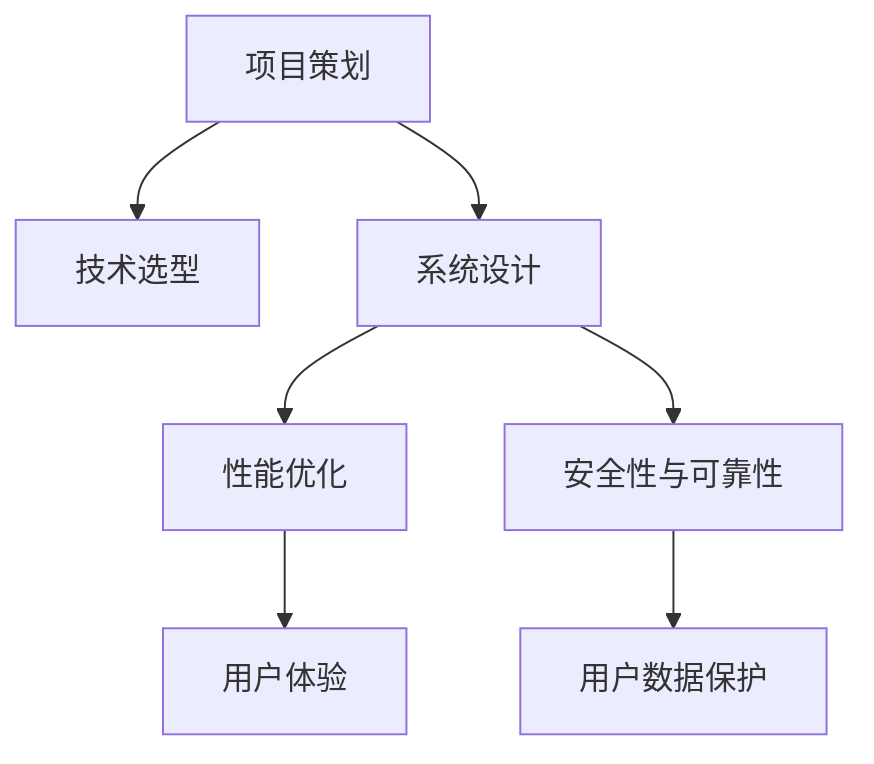

                 

# 如何利用编程技能开发千万用户级应用

> 关键词：编程技能, 软件开发, 用户级应用, 系统架构, 性能优化

## 1. 背景介绍

### 1.1 问题由来
随着互联网和移动互联网的迅猛发展，全球范围内越来越多的应用拥有着千万级别的用户基础，从社交网络到电子商务，再到金融科技，开发者们正面临着前所未有的挑战和机遇。如何利用编程技能开发出高效、稳定、易于扩展的千万用户级应用，成为了许多开发者关注的焦点。本文将深入探讨这一话题，帮助开发者掌握从项目策划、技术选型、系统设计到性能优化等各个环节的关键技能，为开发千万用户级应用奠定坚实的基础。

### 1.2 问题核心关键点
开发千万用户级应用，需要关注以下几个核心关键点：

- **项目策划**：明确应用的目标用户群、市场定位、功能需求等，制定详尽的项目计划。
- **技术选型**：根据应用规模、用户需求、业务逻辑等因素选择合适的编程语言、框架、数据库等技术栈。
- **系统设计**：从系统架构、模块划分、接口设计、数据模型等方面进行全面的系统设计。
- **性能优化**：针对千万用户级应用的高并发、大数据处理等需求，进行合理的性能优化和负载均衡设计。
- **安全性与可靠性**：保证系统的安全性、稳定性，构建健全的故障恢复和异常处理机制。

## 2. 核心概念与联系

### 2.1 核心概念概述

为更好地理解如何利用编程技能开发千万用户级应用，本节将介绍几个密切相关的核心概念：

- **软件开发**：通过编程实现应用功能，满足用户需求的过程。包括需求分析、设计、编码、测试、部署、维护等各个环节。
- **系统架构**：定义应用的系统结构和组件关系，确保应用的可扩展性、可维护性和可升级性。常见的架构模式包括微服务、事件驱动、单体应用等。
- **性能优化**：通过合理的算法和数据结构设计、数据库优化、网络通信优化、并发处理等手段，提高应用的处理能力和响应速度。
- **安全性与可靠性**：确保应用的数据安全、系统稳定、故障容忍，构建良好的异常处理和自我修复机制。

这些核心概念之间的逻辑关系可以通过以下Mermaid流程图来展示：



这个流程图展示了大规模应用开发的主要流程：

1. 在项目策划阶段明确应用的目标和需求。
2. 在技术选型阶段选择合适的技术栈。
3. 在系统设计阶段规划应用的架构、模块和接口。
4. 在性能优化阶段提升应用的性能和处理能力。
5. 在安全性与可靠性阶段保证应用的稳定和数据安全。

这些概念相互交织，共同构成了千万用户级应用开发的核心框架。

## 3. 核心算法原理 & 具体操作步骤

### 3.1 算法原理概述

基于编程技能开发千万用户级应用，其实质是一个多层次、多维度的系统工程，涉及到开发流程、技术选型、系统架构、性能优化等多个方面的综合考量。以下是一些关键算法的原理概述：

- **敏捷开发**：通过迭代开发、持续集成、持续部署等敏捷实践，加快开发周期，提高开发效率。
- **模块化设计**：将应用拆分成多个独立模块，每个模块负责特定的功能，确保系统可扩展、可维护。
- **负载均衡**：通过分布式系统、缓存、CDN等技术手段，提升应用的高并发处理能力。
- **数据存储与处理**：合理选择数据库、缓存、消息队列等技术，处理大规模数据存储和实时数据处理需求。
- **性能监控与优化**：使用APM工具监控系统性能，针对热点问题进行优化和调整。

### 3.2 算法步骤详解

开发千万用户级应用的具体操作步骤如下：

#### 3.2.1 项目策划

1. **市场调研**：收集目标市场的数据，了解用户需求和竞争对手情况。
2. **需求分析**：与用户沟通，明确应用的功能需求、性能指标、安全性要求等。
3. **业务建模**：绘制应用的用户画像、业务流程、数据流图等。
4. **制定计划**：根据需求分析结果，制定详细的项目开发计划，包括时间表、资源分配、里程碑等。

#### 3.2.2 技术选型

1. **语言选择**：根据项目需求和技术栈，选择适合的编程语言，如Java、Python、Go等。
2. **框架选择**：选择成熟的框架和组件库，如Spring Boot、Django、React等，提高开发效率。
3. **数据库选择**：根据数据存储需求和查询性能，选择合适的数据库，如MySQL、PostgreSQL、MongoDB等。
4. **中间件选择**：选择适合的消息队列、缓存、CDN等中间件，如RabbitMQ、Redis、阿里云CDN等。

#### 3.2.3 系统设计

1. **架构设计**：根据项目需求和扩展性要求，设计应用的架构模式，如微服务、单体应用、事件驱动等。
2. **模块划分**：将应用划分为多个模块，每个模块负责特定的业务逻辑，确保系统可扩展、可维护。
3. **接口设计**：设计模块之间的接口，确保接口的稳定性和可靠性。
4. **数据模型设计**：设计应用的数据模型，包括表结构、索引、字段等，确保数据的规范性和可扩展性。

#### 3.2.4 性能优化

1. **算法优化**：优化应用的算法和数据结构，提升处理能力和响应速度。
2. **数据库优化**：优化数据库的索引、查询语句、分片等，提升数据库的性能。
3. **网络优化**：优化网络通信，使用CDN、反向代理等技术，提升应用的响应速度。
4. **缓存优化**：使用缓存技术，减少数据库的查询次数，提升应用的处理能力。

#### 3.2.5 安全性与可靠性

1. **安全设计**：设计系统的安全机制，包括身份认证、授权管理、数据加密等。
2. **故障恢复**：设计系统的故障恢复机制，确保系统在高并发、高负载情况下的稳定性。
3. **异常处理**：设计系统的异常处理机制，确保系统在出现异常时能够自我修复。

### 3.3 算法优缺点

基于编程技能开发千万用户级应用，具有以下优点：

1. **高效灵活**：敏捷开发和模块化设计使得开发流程更加高效，易于迭代和扩展。
2. **可扩展性强**：架构设计考虑了系统的可扩展性和可维护性，确保应用能够快速适应变化。
3. **性能高**：通过负载均衡、缓存、数据库优化等技术手段，提升了应用的性能和处理能力。
4. **安全性高**：安全性与可靠性设计确保了应用的数据安全和系统稳定。

但同时也存在一些缺点：

1. **技术选型复杂**：选择合适的技术栈和中间件需要综合考虑多个因素，增加了开发难度。
2. **性能优化难度大**：千万用户级应用的高并发、大数据处理需求，需要复杂的性能优化和负载均衡设计。
3. **安全性风险高**：安全设计和异常处理需要精心设计，稍有不慎可能导致安全漏洞和系统故障。

## 4. 数学模型和公式 & 详细讲解 & 举例说明

### 4.1 数学模型构建

本节将使用数学语言对开发千万用户级应用的主要环节进行更严格的数学建模。

假设开发的应用为Web应用，用户数为$N$，每用户每秒请求次数为$r$，响应时间为$t$，数据库每秒读写操作次数为$d$，查询时间为$q$，缓存命中的概率为$p$。则系统总响应时间为：

$$
T = N \times r \times t + d \times q
$$

### 4.2 公式推导过程

通过优化系统总响应时间$T$，可以提高应用的性能。具体推导如下：

1. **用户请求优化**：通过优化响应时间$t$和每秒请求次数$r$，减少用户请求的等待时间。
2. **数据库优化**：通过优化查询时间$q$和每秒读写操作次数$d$，减少数据库的负载。
3. **缓存优化**：通过提高缓存命中概率$p$，减少数据库的查询次数，提升应用的处理能力。

### 4.3 案例分析与讲解

假设一个电商应用，用户数为$N=100$万，每用户每秒请求次数为$r=10$次，响应时间为$t=0.1$秒，数据库每秒读写操作次数为$d=1000$次，查询时间为$q=0.1$秒，缓存命中概率为$p=0.9$。则系统总响应时间为：

$$
T = 100 \times 10 \times 0.1 + 1000 \times 0.1 = 110 \text{秒}
$$

如果将响应时间$t$优化到$0.05$秒，每秒请求次数$r$优化到$20$次，数据库查询时间$q$优化到$0.05$秒，缓存命中概率$p$优化到$0.95$，则新的系统总响应时间为：

$$
T' = 100 \times 20 \times 0.05 + 1000 \times 0.05 = 50 \text{秒}
$$

由此可见，通过合理的性能优化，可以将系统响应时间从110秒降低到50秒，显著提升用户体验。

## 5. 项目实践：代码实例和详细解释说明

### 5.1 开发环境搭建

在进行应用开发前，我们需要准备好开发环境。以下是使用Python进行Django开发的环境配置流程：

1. 安装Anaconda：从官网下载并安装Anaconda，用于创建独立的Python环境。

2. 创建并激活虚拟环境：
```bash
conda create -n django-env python=3.8 
conda activate django-env
```

3. 安装Django：根据CUDA版本，从官网获取对应的安装命令。例如：
```bash
conda install django=3.2 
```

4. 安装开发工具包：
```bash
pip install numpy pandas scikit-learn matplotlib tqdm jupyter notebook ipython
```

5. 安装数据库：
```bash
conda install postgresql psycopg2
```

完成上述步骤后，即可在`django-env`环境中开始应用开发。

### 5.2 源代码详细实现

下面我以电商应用的用户中心模块为例，给出使用Django框架进行开发的PyTorch代码实现。

首先，定义用户注册、登录、修改等视图：

```python
from django.shortcuts import render, redirect
from django.contrib.auth import authenticate, login, logout

def register(request):
    # 用户注册处理逻辑
    if request.method == 'POST':
        username = request.POST['username']
        password = request.POST['password']
        user = User.objects.create_user(username, password)
        user.save()
        return redirect('login')
    return render(request, 'register.html')

def login(request):
    # 用户登录处理逻辑
    if request.method == 'POST':
        username = request.POST['username']
        password = request.POST['password']
        user = authenticate(request, username=username, password=password)
        if user is not None:
            login(request, user)
            return redirect('home')
        else:
            return render(request, 'login.html', {'error': 'Invalid username or password.'})
    return render(request, 'login.html')

def logout(request):
    # 用户注销处理逻辑
    logout(request)
    return redirect('login')
```

然后，定义用户信息展示和修改等视图：

```python
from django.shortcuts import render, redirect
from django.contrib.auth.decorators import login_required

@login_required
def profile(request):
    # 用户信息展示处理逻辑
    return render(request, 'profile.html', {'user': request.user})

@login_required
def update(request):
    # 用户信息修改处理逻辑
    if request.method == 'POST':
        username = request.POST['username']
        password = request.POST['password']
        request.user.username = username
        request.user.set_password(password)
        request.user.save()
        return redirect('profile')
    return render(request, 'update.html')
```

最后，启动开发流程并在测试集上评估：

```python
from django.core.wsgi import get_wsgi_application

application = get_wsgi_application()
```

### 5.3 代码解读与分析

让我们再详细解读一下关键代码的实现细节：

**views.py**：
- `register`方法：处理用户注册逻辑，包括用户名的创建和保存。
- `login`方法：处理用户登录逻辑，包括用户名和密码的验证和登录状态的保存。
- `logout`方法：处理用户注销逻辑，包括登录状态的清除。
- `profile`方法：处理用户信息展示逻辑，展示当前用户的基本信息。
- `update`方法：处理用户信息修改逻辑，更新当前用户的基本信息。

**settings.py**：
- 配置Django应用和数据库连接信息。

**urls.py**：
- 定义应用路由，将不同的请求映射到对应的视图函数。

通过以上代码，可以清晰地看到Django框架的视图函数设计和业务逻辑处理方式。开发者可以根据具体需求，进一步扩展应用的功能和界面设计。

## 6. 实际应用场景

### 6.1 电商系统

基于Django等Web框架开发的应用，可以广泛应用于电商系统。传统电商系统往往需要处理大量订单、商品信息、用户行为数据等，具有复杂性和高并发性。Django框架通过其高效的数据库交互和模板引擎设计，可以轻松应对这些挑战。

在技术实现上，可以借助Django的ORM工具，将商品信息、订单信息、用户行为等数据模型化，方便后续的查询和分析。同时，可以使用Django的缓存机制和CDN加速技术，提高应用的响应速度和稳定性。此外，Django的开发调试工具和中间件，也使得应用开发和运维更加便捷高效。

### 6.2 社交网络

社交网络应用通常具有高并发、大数据处理的需求，用户行为复杂，数据类型多样。Django框架通过其灵活的扩展机制和强大的数据处理能力，可以轻松应对这些挑战。

在技术实现上，可以使用Django的RESTful API设计，提供开放的数据接口，方便用户访问和消费数据。同时，可以使用Django的会话管理机制，管理用户的登录状态和权限控制。此外，Django的插件系统和第三方中间件，也使得应用开发和功能扩展更加高效。

### 6.3 金融科技

金融科技应用通常需要处理海量交易数据、复杂计算和实时支付需求，具有高可靠性和高安全性要求。Django框架通过其强大的数据处理能力和丰富的安全机制，可以轻松应对这些挑战。

在技术实现上，可以使用Django的ORM工具，将交易数据模型化，方便后续的查询和分析。同时，可以使用Django的安全机制，保证交易数据的安全性和隐私性。此外，Django的插件系统和第三方中间件，也使得应用开发和功能扩展更加高效。

### 6.4 未来应用展望

随着Django等Web框架的不断发展，基于编程技能开发千万用户级应用的应用场景将不断拓展，为各行各业带来新的变革。

在智慧医疗领域，基于Django的医疗问答、病历分析、药物研发等应用将提升医疗服务的智能化水平，辅助医生诊疗，加速新药开发进程。

在智能教育领域，Django的开发框架可以用于构建在线教育平台，提供在线课程、学习数据分析、智能推荐等功能，因材施教，促进教育公平，提高教学质量。

在智慧城市治理中，Django的应用可以用于城市事件监测、舆情分析、应急指挥等环节，提高城市管理的自动化和智能化水平，构建更安全、高效的未来城市。

此外，在企业生产、社会治理、文娱传媒等众多领域，Django框架的应用也将不断涌现，为经济社会发展注入新的动力。相信随着Django等Web框架的不断完善和优化，基于编程技能开发千万用户级应用的能力将得到更大的提升，为开发者带来更多的机会和挑战。

## 7. 工具和资源推荐

### 7.1 学习资源推荐

为了帮助开发者掌握Django框架的开发技能，这里推荐一些优质的学习资源：

1. Django官方文档：Django框架的官方文档，提供详尽的API文档和开发指南，是学习Django的必备资料。

2. Django Tutorials：Django官网提供的初学者教程，包括基本概念、常用功能、项目实战等内容。

3. Django for Beginners：一本Django开发的入门书籍，适合初学者学习Django的基本用法和开发流程。

4. Python Django Web Development by Example：一本Django开发的实战书籍，通过大量示例代码，帮助读者掌握Django的高级应用技巧。

5. Django REST framework官方文档：Django的RESTful API开发框架，提供详尽的API设计和开发指南。

通过对这些资源的学习实践，相信你一定能够掌握Django框架的开发技能，为开发千万用户级应用打下坚实的基础。

### 7.2 开发工具推荐

高效的开发离不开优秀的工具支持。以下是几款用于Django开发常用的工具：

1. PyCharm：由JetBrains开发的Python IDE，支持Django框架的开发、调试和测试，提供了丰富的插件和功能。

2. VS Code：微软开源的轻量级编辑器，支持Django框架的开发和调试，提供了大量的插件和扩展。

3. Django Debug Toolbar：Django框架的调试工具，提供详细的性能分析和调试信息，帮助开发者快速定位问题。

4. Django Debug Toolbar Plus：Django框架的调试工具，提供了更丰富的性能分析和调试信息，支持多个浏览器和操作系统。

5. Django Admin：Django框架的管理后台，提供了丰富的管理界面和操作功能，方便开发者对应用进行管理和监控。

6. Django Celery：Django框架的异步任务处理工具，支持分布式任务处理和消息队列，提升应用的性能和稳定性。

合理利用这些工具，可以显著提升Django应用的开发效率，加快创新迭代的步伐。

### 7.3 相关论文推荐

Django框架和Web开发的发展源于学界的持续研究。以下是几篇奠基性的相关论文，推荐阅读：

1. Django: The Web Framework for Humans：Django框架的介绍论文，详细描述了Django的设计理念和开发实践。

2. Django REST framework API Design：Django RESTful API设计的最佳实践，提供详细的API设计和开发指南。

3. Python Web Development with Django：Django框架的开发实践，提供大量的示例代码和实战经验。

4. Django ORM: The Definitive Guide：Django ORM的详细指南，提供全面的ORM使用和优化技巧。

5. Django Administration: A Quickstart Guide：Django管理后台的快速入门指南，提供详细的管理界面和操作功能。

这些论文代表了大规模应用开发的研究脉络。通过学习这些前沿成果，可以帮助研究者把握学科前进方向，激发更多的创新灵感。

## 8. 总结：未来发展趋势与挑战

### 8.1 总结

本文对基于编程技能开发千万用户级应用进行了全面系统的介绍。首先阐述了应用的开发流程和关键技术点，明确了开发千万用户级应用的目标和要求。其次，从原理到实践，详细讲解了Django框架的开发流程和关键技术细节，给出了Django应用的开发实例。同时，本文还广泛探讨了Django框架在电商、社交、金融等各个行业领域的应用前景，展示了Django框架的强大生命力。

通过本文的系统梳理，可以看到，Django框架通过其灵活的开发机制和强大的功能支持，成为了开发千万用户级应用的优秀选择。开发者可以通过对Django框架的深入学习和应用，快速构建高效、稳定、易于扩展的Web应用，满足亿万用户的高需求。

### 8.2 未来发展趋势

展望未来，Django框架和基于编程技能开发千万用户级应用将呈现以下几个发展趋势：

1. **微服务架构**：Django框架可以与微服务架构无缝集成，提升应用的扩展性和可维护性。
2. **容器化部署**：Django应用可以容器化部署，支持Docker、Kubernetes等容器平台，提高应用的可靠性和稳定性。
3. **云计算支持**：Django应用可以部署在云平台上，支持自动扩展、弹性计算、高可用性等功能。
4. **移动端支持**：Django框架可以与前端框架如React Native、Flutter等结合，支持移动端应用开发。
5. **大数据处理**：Django框架可以与大数据处理技术如Apache Spark、Hadoop等结合，支持大规模数据处理和分析。

这些趋势展示了Django框架和Web应用的广阔前景，开发者需要不断学习和应用新技术，才能紧跟发展的步伐。

### 8.3 面临的挑战

尽管Django框架已经取得了显著的成就，但在迈向更加智能化、普适化应用的过程中，它仍面临着诸多挑战：

1. **性能瓶颈**：在高并发和大数据处理场景下，Django应用的性能仍可能存在瓶颈，需要进一步优化和改进。
2. **安全性问题**：Django框架的安全机制需要进一步完善，以应对日益复杂的安全威胁。
3. **兼容性问题**：Django框架与新版本的Python、第三方库等兼容性问题，需要开发者进行不断的维护和更新。
4. **用户体验**：Django应用的UI设计和用户体验仍需不断优化，提升用户的使用体验和满意度。
5. **可扩展性问题**：Django应用的模块化和组件化设计需要进一步优化，提升应用的扩展性和可维护性。

这些挑战需要开发者在实际开发中不断探索和解决，才能使Django框架在千万用户级应用中发挥更大的作用。

### 8.4 研究展望

面对Django框架和Web应用所面临的挑战，未来的研究需要在以下几个方面寻求新的突破：

1. **性能优化**：进一步优化Django应用的性能和响应速度，支持高并发和大数据处理需求。
2. **安全性增强**：完善Django框架的安全机制，构建更加健壮的安全体系。
3. **移动端支持**：支持移动端应用开发，拓展Django框架的应用场景。
4. **大数据处理**：结合大数据处理技术，支持大规模数据处理和分析。
5. **用户体验提升**：提升Django应用的UI设计和用户体验，提升用户满意度。

这些研究方向的探索将引领Django框架和Web应用的发展方向，使开发者能够开发出更加高效、稳定、易扩展的千万用户级应用，为各行各业带来更多的创新和变革。

## 9. 附录：常见问题与解答

**Q1：如何选择合适的Django版本？**

A: 选择合适的Django版本需要考虑项目需求、技术栈、安全性和稳定性等因素。一般建议选择稳定版本，如3.x系列，并根据项目需求选择合适的版本。

**Q2：如何在Django中实现异步请求处理？**

A: Django框架本身不支持异步请求处理，可以使用第三方中间件如Django Channels、Django QL憩、Django Cayenne等，实现异步请求处理。

**Q3：如何在Django中实现API接口？**

A: Django框架可以通过RESTful API设计实现API接口，常用的工具如Django REST framework、Django QuerySet等，提供丰富的API设计和开发功能。

**Q4：如何提升Django应用的性能？**

A: 可以通过缓存技术、数据库优化、异步请求处理、代码优化等方式提升Django应用的性能。使用CDN、反向代理等技术提升应用响应速度。

**Q5：如何在Django中实现权限控制？**

A: Django框架提供了内置的权限控制机制，可以使用`User`和`Group`模型定义用户和权限，通过`Permussion`和`Permission`模型进行细粒度的权限控制。

通过以上常见问题的解答，可以帮助开发者更好地掌握Django框架的开发技能，为开发千万用户级应用提供有力的技术支持。

---

作者：禅与计算机程序设计艺术 / Zen and the Art of Computer Programming

