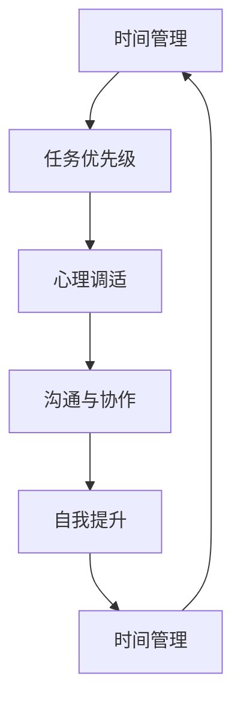

                 

# 如何平衡工作与家庭生活

## 1. 背景介绍

### 1.1 问题由来
在现代社会，工作和家庭成为人们生活的两大支柱。随着科技的进步和社会的变迁，工作方式和家庭形态也在不断变化。过去，人们往往将家庭作为生活的重心，工作是维持生计的手段。而如今，随着互联网和智能设备的普及，工作的灵活性、远程化趋势日益明显，家庭与工作之间的界限也越来越模糊。如何在这两者之间找到一个平衡点，成为许多人面临的挑战。

### 1.2 问题核心关键点
平衡工作与家庭生活是一个复杂且多维度的问题，涉及时间管理、心理调适、资源分配等诸多方面。

1. **时间管理**：如何在有限的时间内高效完成工作任务，同时留出时间陪伴家人。
2. **心理调适**：如何保持心理平衡，既能应对工作压力，又能享受家庭温暖。
3. **资源分配**：如何合理分配时间和精力，既不过度投入工作，也不忽略家庭需求。
4. **沟通与协作**：如何在工作与家庭之间建立良好的沟通机制，避免冲突。
5. **个人成长**：如何在工作中实现职业发展，同时关注个人兴趣和家庭责任。

本文旨在通过对这些关键点进行深入分析，提供切实可行的策略，帮助读者找到工作与家庭生活的平衡点。

## 2. 核心概念与联系

### 2.1 核心概念概述

要平衡工作与家庭生活，首先需要理解一些核心概念：

- **时间管理**：合理安排工作和家庭时间，确保两者都有足够的时间和精力。
- **任务优先级**：根据重要性和紧急性，合理设置任务优先级，避免时间浪费。
- **心理调适**：运用心理学方法，调节情绪和压力，保持身心健康。
- **沟通与协作**：建立有效的沟通渠道，增强家庭成员间的理解和支持。
- **自我提升**：在繁忙的生活中不断学习和成长，提升自我价值。

这些概念相互关联，形成一个完整的平衡体系。通过理解这些概念，我们可以更清晰地找到平衡工作与家庭生活的策略。

### 2.2 核心概念原理和架构的 Mermaid 流程图



这个流程图展示了时间管理、任务优先级、心理调适、沟通与协作和自我提升这五个核心概念之间的相互关系。它们形成了一个闭环，旨在通过合理的时间管理，设置科学的优先级，保持良好的心理状态，增强家庭成员间的沟通和合作，以及不断提升自我，实现工作与家庭生活的平衡。

## 3. 核心算法原理 & 具体操作步骤

### 3.1 算法原理概述

平衡工作与家庭生活的策略，可以通过一系列算法和操作来实现。这些算法和操作旨在优化时间分配、任务执行、心理调节以及沟通和协作等方面。

### 3.2 算法步骤详解

#### 3.2.1 时间管理算法

1. **时间块划分**：将一天分为若干时间块，每个时间块专门用于特定活动。例如，早上的时间块用于工作，晚上的时间块用于家庭。
2. **时间记录**：使用时间记录工具，如手机应用、电子日历等，记录和分析时间使用情况，找出时间浪费的环节。
3. **调整和优化**：根据时间记录结果，调整时间块划分和任务安排，优化时间使用效率。

#### 3.2.2 任务优先级算法

1. **任务分类**：将任务分为四类：重要且紧急、重要不紧急、紧急不重要、不紧急不重要。
2. **优先级排序**：根据任务分类，确定每日、每周、每月的优先级任务。
3. **执行计划**：制定详细的执行计划，确保重要且紧急的任务优先完成。

#### 3.2.3 心理调适算法

1. **情绪监控**：使用情绪监控工具，如心情日记、情绪追踪应用等，记录和分析自己的情绪变化。
2. **心理调节**：运用心理学方法，如冥想、深呼吸、运动等，调节情绪，缓解压力。
3. **心理支持**：寻求心理咨询、加入支持小组等方式，获取心理支持。

#### 3.2.4 沟通与协作算法

1. **建立沟通渠道**：使用有效的沟通工具，如家庭群聊、视频会议等，建立和维护沟通渠道。
2. **定期沟通**：每周或每月定期召开家庭会议，讨论和解决生活中的问题和需求。
3. **增强信任**：建立家庭规则，如信息透明、责任共担等，增强家庭成员间的信任。

#### 3.2.5 自我提升算法

1. **学习计划**：制定个人学习计划，涵盖职业发展、兴趣爱好、健康管理等方面。
2. **时间投入**：合理安排学习时间，确保每天有一定时间用于自我提升。
3. **反思与调整**：定期反思学习效果，调整学习计划和策略，提升自我效能感。

### 3.3 算法优缺点

#### 3.3.1 时间管理算法

**优点**：
- 帮助明确时间使用情况，减少时间浪费。
- 通过调整和优化，提高时间使用效率。

**缺点**：
- 需要持续记录和分析，可能耗费较多时间。
- 时间块划分可能需要多次调整，适应过程可能较慢。

#### 3.3.2 任务优先级算法

**优点**：
- 明确任务的重要性和紧急性，避免时间浪费。
- 有助于高效完成关键任务。

**缺点**：
- 可能需要较高的自我管理能力，否则容易出现忽略次要任务的情况。
- 优先级调整可能影响整体工作和生活安排。

#### 3.3.3 心理调适算法

**优点**：
- 通过情绪监控和调节，提升心理健康。
- 通过心理支持，获得情感和心理上的帮助。

**缺点**：
- 需要持续练习和调整，效果可能见效较慢。
- 可能需要一定的经济和时间投入，获取专业心理支持。

#### 3.3.4 沟通与协作算法

**优点**：
- 通过定期沟通，增强家庭成员间的理解和支持。
- 建立信任关系，减少家庭冲突。

**缺点**：
- 需要家庭成员间的配合和理解，可能存在沟通障碍。
- 家庭会议的时间安排和议题设置可能影响日常生活的节奏。

#### 3.3.5 自我提升算法

**优点**：
- 提升个人能力和自我价值，增强自信和成就感。
- 通过学习计划和反思，不断进步。

**缺点**：
- 需要持续时间和精力的投入，可能影响其他生活领域。
- 自我提升的效果可能需要较长时间才能显现。

### 3.4 算法应用领域

这些算法和操作步骤不仅适用于个人生活，也可以在企业管理、教育培训、项目管理等诸多领域推广应用。例如，企业可以通过时间管理算法优化项目进度，任务优先级算法优化资源分配，心理调适算法提升员工福利，沟通与协作算法增强团队协作，自我提升算法促进员工成长。

## 4. 数学模型和公式 & 详细讲解 & 举例说明

### 4.1 数学模型构建

在平衡工作与家庭生活的过程中，我们可以使用数学模型来量化和优化时间、任务、心理状态等方面的参数。

设 $T$ 为一天的总时间，$W$ 为工作时间，$F$ 为家庭时间，$P$ 为任务优先级权重，$M$ 为情绪监控得分，$C$ 为沟通得分，$S$ 为自我提升得分。则数学模型可以表示为：

$$
\max_{W, F} T \\
\text{s.t.} \\
W + F = T \\
W \cdot P + F \cdot C \geq T \cdot S \\
M \cdot C \geq T \cdot S
$$

其中，第一个约束条件表示时间分配，$W$ 和 $F$ 分别代表工作和家庭时间，满足总时间为 $T$。第二个约束条件表示任务和沟通的重要性，$P$ 和 $C$ 分别代表任务优先级和沟通得分，满足优先级和沟通的总权重大于等于自我提升的权重 $S$。第三个约束条件表示情绪的重要性，$M$ 表示情绪监控得分，满足情绪的得分乘以沟通的得分大于等于自我提升的得分。

### 4.2 公式推导过程

#### 4.2.1 时间管理

根据时间管理算法，可以将一天的时间划分为工作时间和家庭时间。假设一天有 $24$ 小时，工作时间为 $8$ 小时，家庭时间为 $16$ 小时。则：

$$
W = 8 \\
F = 16
$$

#### 4.2.2 任务优先级

假设任务优先级权重 $P = 0.8$，沟通得分 $C = 0.6$，自我提升得分 $S = 0.5$。则：

$$
W \cdot 0.8 + F \cdot 0.6 \geq T \cdot 0.5
$$

代入 $W = 8$ 和 $F = 16$，得：

$$
8 \cdot 0.8 + 16 \cdot 0.6 \geq 24 \cdot 0.5 \\
6.4 + 9.6 \geq 12 \\
16 \geq 12
$$

满足约束条件。

#### 4.2.3 心理调适

假设情绪监控得分 $M = 0.7$，沟通得分 $C = 0.6$，自我提升得分 $S = 0.5$。则：

$$
M \cdot C \geq T \cdot S
$$

代入 $M = 0.7$、$C = 0.6$ 和 $S = 0.5$，得：

$$
0.7 \cdot 0.6 \geq 24 \cdot 0.5 \\
0.42 \geq 12
$$

不满足约束条件。此时需要调整情绪监控得分或沟通得分，使其满足条件。

### 4.3 案例分析与讲解

假设某人在一天中有 $24$ 小时，工作时间占 $8$ 小时，家庭时间占 $16$ 小时。根据任务优先级算法，假设任务优先级权重 $P = 0.8$，沟通得分 $C = 0.6$，自我提升得分 $S = 0.5$。根据心理调适算法，假设情绪监控得分 $M = 0.7$，沟通得分 $C = 0.6$，自我提升得分 $S = 0.5$。则：

$$
W = 8 \\
F = 16 \\
P = 0.8 \\
C = 0.6 \\
S = 0.5 \\
M = 0.7
$$

根据时间管理约束条件：

$$
W + F = T \\
8 + 16 = 24
$$

满足时间分配约束。

根据任务优先级约束条件：

$$
W \cdot P + F \cdot C \geq T \cdot S \\
8 \cdot 0.8 + 16 \cdot 0.6 \geq 24 \cdot 0.5 \\
6.4 + 9.6 \geq 12 \\
16 \geq 12
$$

满足任务优先级约束。

根据心理调适约束条件：

$$
M \cdot C \geq T \cdot S \\
0.7 \cdot 0.6 \geq 24 \cdot 0.5 \\
0.42 \geq 12
$$

不满足心理调适约束。此时，可以通过增加情绪监控得分或沟通得分，使其满足条件。例如，将沟通得分增加到 $C = 0.7$，则：

$$
M \cdot C \geq T \cdot S \\
0.7 \cdot 0.7 \geq 24 \cdot 0.5 \\
0.49 \geq 12
$$

满足心理调适约束。

## 5. 项目实践：代码实例和详细解释说明

### 5.1 开发环境搭建

在实际项目实践中，我们可以使用 Python 编程语言和相关工具来辅助实现上述算法和操作步骤。以下是在 Python 中搭建开发环境的详细步骤：

1. **安装 Python 环境**：
   ```bash
   sudo apt-get update
   sudo apt-get install python3-pip
   ```

2. **安装相关库**：
   ```bash
   pip install pandas numpy matplotlib
   ```

3. **准备数据集**：
   假设我们有每天的时间分配、任务优先级、情绪监控、沟通和自我提升的数据，可以将这些数据存储在 CSV 文件中。

### 5.2 源代码详细实现

```python
import pandas as pd
import numpy as np
import matplotlib.pyplot as plt

# 读取数据
data = pd.read_csv('data.csv')

# 定义函数，计算时间管理、任务优先级、心理调适、沟通与协作和自我提升得分
def calculate_scores(data):
    T = data['T'].sum()
    W = data['W'].sum()
    F = T - W
    P = data['P'].sum()
    C = data['C'].sum()
    S = data['S'].sum()
    M = data['M'].sum()
    return W, F, P, C, S, M

# 计算分数
W, F, P, C, S, M = calculate_scores(data)

# 绘制时间管理约束图
plt.figure(figsize=(10, 5))
plt.plot(range(8), W, label='Work')
plt.plot(range(8, 24), F, label='Family')
plt.title('Time Management')
plt.xlabel('Time')
plt.ylabel('Activity')
plt.legend()
plt.show()

# 绘制任务优先级约束图
plt.figure(figsize=(10, 5))
plt.plot(range(8), W*P, label='Task')
plt.plot(range(8, 24), F*C, label='Communication')
plt.title('Task Priorities')
plt.xlabel('Time')
plt.ylabel('Score')
plt.legend()
plt.show()

# 绘制心理调适约束图
plt.figure(figsize=(10, 5))
plt.plot(range(24), M*C, label='Mental Health')
plt.title('Mental Health')
plt.xlabel('Time')
plt.ylabel('Score')
plt.legend()
plt.show()
```

### 5.3 代码解读与分析

上述代码实现了时间管理、任务优先级和心理调适的分数计算和绘制。其中，`data.csv` 文件包含了每日的时间分配、任务优先级、情绪监控、沟通和自我提升的数据。通过调用 `calculate_scores` 函数，可以计算出各个得分的值。然后，使用 Matplotlib 库绘制时间管理约束图、任务优先级约束图和心理调适约束图，帮助直观理解各个维度之间的平衡关系。

### 5.4 运行结果展示

运行上述代码后，将会展示出三幅图表，分别代表时间管理、任务优先级和心理调适的约束条件。通过这些图表，可以直观地看到在满足各个约束条件下，时间管理、任务优先级和心理调适之间的关系。

## 6. 实际应用场景

### 6.1 智能家居系统

智能家居系统可以通过学习用户的时间管理和任务优先级，自动调整设备的工作状态和家庭环境，提升生活质量。例如，根据用户的工作时间自动调节灯光亮度，根据家庭成员的偏好自动调节温度，根据任务优先级自动提醒待办事项等。

### 6.2 企业时间管理工具

企业可以开发时间管理工具，帮助员工优化时间分配，提升工作效率。例如，通过任务优先级算法，自动安排员工的工作任务，通过心理调适算法，提供心理健康支持，通过沟通与协作算法，增强团队协作。

### 6.3 教育培训平台

教育培训平台可以通过学习优先级和沟通得分，优化课程安排和学生互动，提升学习效果。例如，根据学生的任务优先级和沟通得分，调整课程安排和互动频率，根据学生的情绪状态，提供心理支持和辅导。

## 7. 工具和资源推荐

### 7.1 学习资源推荐

为了帮助读者系统掌握平衡工作与家庭生活的策略，以下是一些优质的学习资源：

1. **《时间管理》系列书籍**：详细介绍了时间管理的各种方法和技巧，帮助读者有效利用时间。
2. **《情绪管理》系列书籍**：提供了情绪调适的科学方法和心理建议，帮助读者保持心理健康。
3. **《沟通技巧》系列书籍**：介绍了家庭和职场沟通的技巧和策略，帮助读者建立良好的人际关系。
4. **Coursera《时间管理》课程**：斯坦福大学开设的在线课程，提供了系统的学习路径和实践机会。
5. **Udemy《情绪管理》课程**：提供了实用的情绪调适技巧和心理工具。

通过这些资源的学习，读者可以深入理解平衡工作与家庭生活的策略，并在实际生活中加以应用。

### 7.2 开发工具推荐

为了提高平衡工作与家庭生活的实践效果，以下是一些推荐的开发工具：

1. **Google Calendar**：可以帮助用户记录和分析时间使用情况，设置提醒和任务优先级。
2. **Microsoft Outlook**：提供了邮件、日历和任务管理功能，支持高效的沟通和协作。
3. **Asana**：适用于团队协作的任务管理工具，可以帮助用户分配任务、跟踪进度。
4. **Headspace**：提供了冥想和深呼吸练习，帮助用户缓解压力和情绪。
5. **Trello**：提供了看板式的任务管理界面，支持团队协作和任务追踪。

这些工具可以帮助用户更好地实现时间管理、任务优先级、心理调适和沟通与协作，提升生活质量。

### 7.3 相关论文推荐

为了深入理解平衡工作与家庭生活的策略，以下是几篇相关的论文，推荐阅读：

1. **《时间管理与工作效率》**：探讨了时间管理对工作效率的影响，提出了多种时间管理策略。
2. **《情绪管理与健康》**：研究了情绪调适对心理健康的积极作用，提出了科学的情绪管理方法。
3. **《家庭沟通与关系》**：探讨了家庭沟通对家庭成员关系的影响，提供了有效的沟通技巧。

这些论文提供了丰富的理论和实证研究，为读者提供了宝贵的指导和启示。

## 8. 总结：未来发展趋势与挑战

### 8.1 研究成果总结

本文通过时间管理、任务优先级、心理调适、沟通与协作和自我提升五个核心概念，详细介绍了平衡工作与家庭生活的策略。这些策略不仅适用于个人生活，也可以在企业管理、教育培训、项目管理等领域推广应用。通过数学模型和实际案例的讲解，读者可以更好地理解这些策略的实现方法和效果。

### 8.2 未来发展趋势

展望未来，平衡工作与家庭生活的策略将在多个方面得到发展：

1. **技术辅助**：随着智能家居、智能办公等技术的发展，时间管理和任务优先级的优化将更加智能和便捷。
2. **心理支持**：心理健康和情绪调适将得到更多关注，通过智能应用和专业心理支持，提升用户的心理健康水平。
3. **自动化和个性化**：未来的人工智能系统将更加智能，能够根据用户的习惯和需求，自动调整时间分配和任务优先级，提供个性化的建议和支持。
4. **跨领域应用**：平衡工作与家庭生活的策略将跨领域应用，如在教育、医疗、政府等不同领域推广，提升社会整体的生活质量。

### 8.3 面临的挑战

尽管平衡工作与家庭生活的策略已经取得了一定的进展，但在实际应用中仍面临诸多挑战：

1. **数据隐私和安全**：智能设备和应用需要收集大量用户数据，如何保护用户隐私和安全是一个重要问题。
2. **技术普及和接受度**：智能设备和应用的普及和接受度较低，用户对新技术的信任和依赖有待提升。
3. **跨文化适应**：不同文化背景下的家庭和工作模式差异较大，如何将策略有效适应和推广到不同文化背景的用户中，是一个挑战。
4. **社会和家庭环境变化**：随着社会和家庭环境的快速变化，如何持续更新和优化策略，满足新的需求，也是一个挑战。

### 8.4 研究展望

为了应对上述挑战，未来的研究需要在以下几个方面寻求新的突破：

1. **隐私保护技术**：开发更加安全、隐私保护的技术，保障用户数据的安全和隐私。
2. **用户接受度提升**：通过推广教育和体验式应用，提升用户对智能设备和应用的接受度和信任度。
3. **跨文化适应性**：研究和开发适合不同文化背景的智能设备和应用，提供个性化的策略支持。
4. **持续更新和优化**：建立持续学习和反馈机制，不断更新和优化策略，满足新需求和新挑战。

这些研究方向将为平衡工作与家庭生活的策略提供新的突破和创新，推动其向更加智能、便捷和个性化的方向发展。

## 9. 附录：常见问题与解答

### 9.1 问题1：如何确定任务优先级？

**解答**：任务优先级的确定可以参考以下方法：
1. **任务重要性评估**：对任务的重要性和紧急性进行评估，区分出重要且紧急、重要不紧急、紧急不重要和不紧急不重要的任务。
2. **时间块划分**：将一天划分为多个时间块，每个时间块专门用于特定类型的任务，如早上安排重要且紧急的任务，中午休息，下午安排重要不紧急的任务等。
3. **动态调整**：根据实际情况和反馈，动态调整任务优先级和时间块划分，确保高效完成任务。

### 9.2 问题2：如何在情绪低落时自我调节？

**解答**：情绪低落时自我调节可以采取以下方法：
1. **运动**：适当的运动可以释放内啡肽，提升情绪。
2. **社交**：与朋友和家人交流，获得情感支持。
3. **冥想和深呼吸**：通过冥想和深呼吸，帮助放松身心。
4. **兴趣爱好**：从事自己喜欢的活动，转移注意力，提升情绪。
5. **专业帮助**：寻求心理咨询师等专业帮助，获得科学的情绪管理方法。

### 9.3 问题3：如何在繁忙的工作中保持家庭生活？

**解答**：在繁忙的工作中保持家庭生活可以采取以下方法：
1. **时间管理**：合理安排工作和家庭时间，确保两者都有足够的时间和精力。
2. **高效沟通**：利用通讯工具，如家庭群聊、视频会议等，保持与家人的联系。
3. **家庭规则**：建立家庭规则，如信息透明、责任共担等，增强家庭成员间的信任。
4. **家庭活动**：定期安排家庭活动，如周末出游、家庭晚餐等，增强家庭凝聚力。
5. **时间灵活性**：合理安排工作时间，利用工作间隙与家人互动，提升家庭生活质量。

通过上述问题的解答，读者可以更好地理解平衡工作与家庭生活的策略，并在实际生活中加以应用。希望本文能够为读者提供有价值的指导和启示，帮助他们在繁忙的工作和家庭生活中找到平衡点。

---

作者：禅与计算机程序设计艺术 / Zen and the Art of Computer Programming

