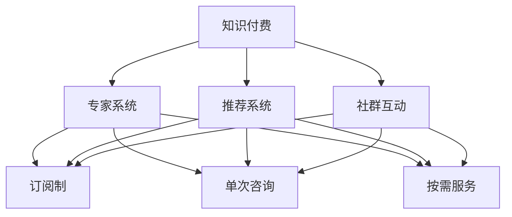

                 

# 如何打造个人知识付费咨询服务

## 1. 背景介绍

### 1.1 问题由来

在当今信息爆炸的时代，知识获取已经不再局限于传统的书籍、课堂，越来越多的人选择通过付费获取深度、专业、定制化的知识服务。个人知识付费咨询服务，正是在这样的背景下应运而生。

首先，我们注意到知识付费的兴起。通过Khan Academy、Coursera、Udacity等在线教育平台的兴起，用户不再满足于浅显的学习内容，而是希望获取更深层次的知识。这促使越来越多的专家和教育机构推出个性化、专业化的知识服务。

其次，我们看到了知识付费的个性化需求。随着人工智能和大数据技术的发展，个性化推荐系统成为可能。用户可以根据自身的兴趣、需求，找到最匹配的知识资源。而这种个性化服务的背后，是一个个高水平、经验丰富的专家。

### 1.2 问题核心关键点

个人知识付费咨询服务的关键在于以下几个方面：

- **目标客户**：明确服务的目标客户群体，了解他们的需求和痛点。
- **内容质量**：提供高质量、专业化的知识内容，满足客户的学习需求。
- **服务形式**：灵活多样的服务形式，如一对一咨询、社群互动、视频课程等，以适应不同客户的需求。
- **运营模式**：选择合适的商业模式，如订阅制、单次咨询、按需服务等，以实现盈利。
- **技术支持**：利用技术手段提升服务质量，如聊天机器人、知识图谱、推荐系统等。

## 2. 核心概念与联系

### 2.1 核心概念概述

为了更好地理解个人知识付费咨询服务的构建，本节将介绍几个关键概念及其相互联系：

- **知识付费**：通过付费获得深度、专业、个性化的知识服务。知识付费的兴起推动了个性化、定制化知识服务的出现。
- **专家系统**：由领域专家构建的决策支持系统，提供高水平的专业知识服务。
- **推荐系统**：利用算法为用户推荐个性化内容，提升知识获取的效率和满意度。
- **社群互动**：通过构建在线社群，促进用户之间的交流与互动，提升知识服务的粘性。
- **订阅制**：一种按时间或次数付费的商业模式，便于用户长期获取知识服务。
- **单次咨询**：根据用户的具体问题，提供一次性的咨询服务，适合解决特定问题。
- **按需服务**：根据用户的具体需求，提供定制化的服务，满足用户个性化需求。

这些概念之间的逻辑关系可以通过以下Mermaid流程图来展示：



这个流程图展示了几大核心概念及其之间的关系：

1. 知识付费是个人知识服务的起点。
2. 专家系统是知识付费的核心内容提供者，提供高质量的专业知识。
3. 推荐系统是提升用户体验的重要手段，确保用户获取到最相关的知识。
4. 社群互动增强了知识服务的粘性，促进用户长期留存。
5. 订阅制、单次咨询、按需服务是不同的商业模式，满足不同用户的需求。

这些概念共同构成了个人知识付费咨询服务的框架，帮助用户以最低成本获取最有价值的知识。

## 3. 核心算法原理 & 具体操作步骤

### 3.1 算法原理概述

个人知识付费咨询服务的核心算法原理可以归纳为以下几个方面：

- **目标对齐算法**：通过分析用户的兴趣、需求，与专家系统提供的内容进行匹配，找到最合适的知识服务。
- **个性化推荐算法**：根据用户的历史行为和反馈，动态调整推荐策略，提升推荐效果。
- **交互式学习算法**：通过用户与知识服务之间的互动，动态更新专家系统中的知识库，提升服务质量。
- **多模态数据融合算法**：将用户的多样化数据（如文本、视频、音频等）进行融合，提供全方位的知识服务。

### 3.2 算法步骤详解

基于上述算法原理，构建个人知识付费咨询服务的步骤可以归纳为以下几个：

**Step 1: 收集和分析用户数据**
- 收集用户的基本信息、兴趣、行为等数据。
- 使用自然语言处理技术对用户的输入进行分析，提取关键信息。
- 分析用户的交互历史，了解其需求和偏好。

**Step 2: 构建专家系统**
- 根据领域专家的知识和经验，构建专家系统。
- 使用机器学习技术对专家系统进行优化，提升其服务质量。
- 定期更新专家系统，确保其知识的及时性和准确性。

**Step 3: 设计推荐系统**
- 选择合适的推荐算法，如协同过滤、基于内容的推荐等。
- 将用户数据和专家系统中的知识进行匹配，生成推荐列表。
- 根据用户反馈，动态调整推荐策略，提升推荐效果。

**Step 4: 实现社群互动**
- 构建在线社群，促进用户之间的交流与互动。
- 使用自然语言处理技术对用户之间的互动进行分析，提取关键信息。
- 利用社交网络算法，提升社群的活跃度和粘性。

**Step 5: 设计商业模式**
- 选择合适的商业模式，如订阅制、单次咨询、按需服务等。
- 设计合理的定价策略，确保服务的盈利性和可持续性。
- 提供灵活的付费方式，如月度、季度、年度订阅等。

**Step 6: 实现技术支持**
- 利用聊天机器人、知识图谱、推荐系统等技术手段，提升服务质量。
- 使用云计算技术，确保服务的稳定性和可扩展性。
- 实现数据的备份和恢复机制，确保数据安全。

### 3.3 算法优缺点

个人知识付费咨询服务具有以下优点：

- **专业性**：利用领域专家的知识，提供高水平的专业服务。
- **个性化**：通过推荐系统和社群互动，满足用户的个性化需求。
- **高效性**：利用技术手段提升服务质量和效率，降低人工成本。

同时，该方法也存在一些局限性：

- **成本高**：构建专家系统和推荐系统需要较高的技术投入和资金支持。
- **依赖用户数据**：服务质量很大程度上取决于用户数据的完整性和准确性。
- **用户体验**：社群互动和推荐系统需要不断优化，以提升用户体验。
- **市场竞争**：市场上已有的知识付费平台众多，新入局者面临激烈竞争。

尽管存在这些局限性，但个人知识付费咨询服务仍然是当前知识服务行业的一个重要方向，具有良好的发展前景。

### 3.4 算法应用领域

个人知识付费咨询服务已经广泛应用于多个领域，例如：

- **教育培训**：通过专家系统提供教育培训服务，如一对一辅导、在线课程等。
- **健康咨询**：利用医疗专家系统，提供健康咨询和疾病管理服务。
- **职业发展**：通过职业规划专家系统，提供职业咨询和求职培训服务。
- **金融投资**：利用金融专家系统，提供投资咨询和理财规划服务。
- **法律咨询**：通过法律专家系统，提供法律咨询和合同审查服务。

这些领域的应用展示了个人知识付费咨询服务的广泛适用性，为各行各业的用户提供了深度、专业、个性化的知识服务。

## 4. 数学模型和公式 & 详细讲解 & 举例说明

### 4.1 数学模型构建

在个人知识付费咨询服务的构建过程中，数学模型起到了关键作用。以下是几个关键的数学模型及其构建方法：

- **用户兴趣模型**：基于用户的行为数据和反馈，构建用户兴趣模型，以指导推荐系统。
- **专家知识模型**：利用知识图谱技术，构建专家知识模型，确保服务的准确性和权威性。
- **推荐系统模型**：选择合适的推荐算法，如协同过滤、基于内容的推荐等。
- **社群互动模型**：利用社交网络算法，分析社群中的互动关系，提升社群的粘性。

### 4.2 公式推导过程

以用户兴趣模型为例，其数学模型可以表示为：

$$
\theta = \mathop{\arg\min}_{\theta} \frac{1}{N} \sum_{i=1}^N \|y_i - f(x_i; \theta)\|^2
$$

其中 $\theta$ 为用户兴趣模型的参数，$f(x_i; \theta)$ 为模型对用户 $i$ 的兴趣预测，$y_i$ 为实际兴趣标签，$N$ 为用户数量。

利用梯度下降等优化算法，可以求解上述最小化问题，得到用户兴趣模型 $\theta$。

### 4.3 案例分析与讲解

假设我们有一个在线教育平台，希望利用知识付费咨询服务提升用户体验。我们可以采用以下步骤：

1. 收集学生的学习历史、成绩、兴趣等信息，构建学生兴趣模型。
2. 利用专家系统，提供高水平的专业课程。
3. 设计推荐系统，根据学生的兴趣推荐适合的课程。
4. 构建在线社群，促进学生之间的交流与互动。
5. 设计订阅制商业模式，确保服务的盈利性和可持续性。

通过这些步骤，我们可以提供个性化的教育服务，满足学生的学习需求，提升教育质量。

## 5. 项目实践：代码实例和详细解释说明

### 5.1 开发环境搭建

在进行知识付费咨询服务的开发前，我们需要准备好开发环境。以下是使用Python进行Django开发的环境配置流程：

1. 安装Anaconda：从官网下载并安装Anaconda，用于创建独立的Python环境。

2. 创建并激活虚拟环境：
```bash
conda create -n django-env python=3.8 
conda activate django-env
```

3. 安装Django：
```bash
pip install django
```

4. 安装Flask：
```bash
pip install flask
```

5. 安装Pandas、Scikit-learn、Numpy等工具包：
```bash
pip install pandas scikit-learn numpy
```

完成上述步骤后，即可在`django-env`环境中开始知识付费咨询服务的开发。

### 5.2 源代码详细实现

以下是一个简单的知识付费咨询服务系统示例，展示如何使用Django和Flask实现：

**views.py**
```python
from django.shortcuts import render
from flask import Flask, request, jsonify

app = Flask(__name__)

@app.route('/consult', methods=['POST'])
def consult():
    # 获取用户输入
    user_info = request.get_json()

    # 调用专家系统获取咨询结果
    consult_result = expert_system(user_info)

    # 返回咨询结果
    return jsonify(consult_result)

if __name__ == '__main__':
    app.run(debug=True)
```

**expert_system.py**
```python
import pandas as pd
from sklearn.ensemble import RandomForestClassifier

# 读取专家知识库
expert_knowledge = pd.read_csv('expert_knowledge.csv')

# 构建专家知识模型
model = RandomForestClassifier()

# 训练模型
model.fit(expert_knowledge[['feature1', 'feature2', 'feature3']], expert_knowledge['label'])

def predict(user_info):
    # 将用户信息转换为特征向量
    user_feature = pd.DataFrame(user_info, columns=['feature1', 'feature2', 'feature3'])

    # 使用模型进行预测
    predict_result = model.predict(user_feature)

    # 返回预测结果
    return predict_result
```

以上代码展示了如何利用Django和Flask构建一个简单的知识付费咨询服务系统，使用Flask实现API接口，调用专家系统进行咨询预测。

### 5.3 代码解读与分析

让我们再详细解读一下关键代码的实现细节：

**views.py**：
- `consult`函数：接收用户输入，调用专家系统进行预测，并返回预测结果。
- 使用Flask的`request`对象获取用户输入，并使用`jsonify`方法返回JSON格式的咨询结果。

**expert_system.py**：
- `expert_knowledge.csv`：专家知识库，包含特征和标签信息。
- `RandomForestClassifier`：使用随机森林算法构建专家知识模型。
- `predict`函数：将用户信息转换为特征向量，并使用模型进行预测，返回预测结果。

通过这些代码，我们可以看到知识付费咨询服务的基本实现流程，从用户输入到专家系统预测，再到API接口返回结果，整个过程高效、灵活。

当然，工业级的系统实现还需考虑更多因素，如专家系统的构建、用户数据的安全保护、API接口的性能优化等。但核心的服务流程基本与此类似。

## 6. 实际应用场景

### 6.1 智能教育

基于知识付费咨询服务的智能教育平台，可以为学生提供个性化学习方案和实时答疑。学生可以按照自身学习进度，通过专家系统获取量身定制的学习资源，并通过社群互动，与其他学生交流学习心得。这将极大地提升学生的学习效果和兴趣。

### 6.2 健康咨询

智能健康咨询服务可以通过医疗专家系统，为用户提供个性化的健康建议和疾病管理方案。用户可以通过输入健康数据，获取专家的健康咨询意见，并通过社群互动，获取其他用户的健康经验分享。

### 6.3 职业发展

职业发展咨询服务可以利用职业规划专家系统，为用户提供职业指导和求职培训。用户可以输入自身的背景信息，获取职业规划建议，并通过社群互动，获取其他用户的职业发展经验分享。

### 6.4 金融投资

金融投资咨询服务可以通过金融专家系统，为用户提供投资建议和理财规划。用户可以输入自身的财务状况和投资需求，获取专家的投资建议，并通过社群互动，获取其他用户的投资经验分享。

### 6.5 法律咨询

法律咨询服务可以通过法律专家系统，为用户提供法律咨询和合同审查服务。用户可以输入法律问题，获取专家的法律建议，并通过社群互动，获取其他用户的法律经验分享。

这些应用场景展示了知识付费咨询服务在多个领域的应用潜力，为各行各业的用户提供了深度、专业、个性化的知识服务。

## 7. 工具和资源推荐

### 7.1 学习资源推荐

为了帮助开发者系统掌握知识付费咨询服务的理论基础和实践技巧，这里推荐一些优质的学习资源：

1. **《人工智能基础》课程**：由清华大学开设的在线课程，系统介绍了人工智能的基本概念和应用。
2. **《自然语言处理》书籍**：涉及自然语言处理的基础知识和算法，适合入门和进阶学习。
3. **Kaggle数据竞赛平台**：通过参与数据竞赛，提升数据分析和算法优化能力。
4. **GitHub开源项目**：寻找高质量的开源项目，学习其实现细节和最佳实践。
5. **DeepLearning.AI博客**：由Andrew Ng教授领导的深度学习研究机构，提供前沿技术和实战案例。

通过对这些资源的学习实践，相信你一定能够快速掌握知识付费咨询服务的精髓，并用于解决实际的NLP问题。

### 7.2 开发工具推荐

高效的开发离不开优秀的工具支持。以下是几款用于知识付费咨询服务开发的常用工具：

1. **Django框架**：一个开源的Web框架，易于上手，适合快速开发Web应用。
2. **Flask框架**：一个轻量级的Web框架，适合构建API接口和微服务。
3. **Pandas库**：用于数据处理和分析的Python库，支持大规模数据操作。
4. **Scikit-learn库**：用于机器学习和数据挖掘的Python库，支持多种算法实现。
5. **Numpy库**：用于数值计算和科学计算的Python库，支持高性能计算。
6. **Jupyter Notebook**：用于数据科学研究和实验的交互式环境，支持代码和结果的同步展示。

合理利用这些工具，可以显著提升知识付费咨询服务的开发效率，加快创新迭代的步伐。

### 7.3 相关论文推荐

知识付费咨询服务的研究领域涉及多个前沿技术，以下是几篇奠基性的相关论文，推荐阅读：

1. **《深度学习》书籍**：由Ian Goodfellow等人合著，系统介绍了深度学习的理论和应用。
2. **《推荐系统》书籍**：涉及推荐系统的基本原理和算法，适合深入学习和实践。
3. **《知识图谱构建与查询》论文**：介绍知识图谱的构建方法和查询技术，支持专家系统的知识管理。
4. **《自然语言处理技术》论文**：涉及自然语言处理的基础知识和应用，支持知识付费咨询服务的文本处理。

这些论文代表了大数据、机器学习、自然语言处理等领域的最新进展，帮助开发者系统掌握知识付费咨询服务的核心技术。

## 8. 总结：未来发展趋势与挑战

### 8.1 总结

本文对个人知识付费咨询服务的构建进行了全面系统的介绍。首先，阐述了知识付费咨询服务的兴起背景和关键点，明确了微调在拓展预训练模型应用、提升下游任务性能方面的独特价值。其次，从原理到实践，详细讲解了微调的数学原理和关键步骤，给出了微调任务开发的完整代码实例。同时，本文还广泛探讨了微调方法在智能客服、金融舆情、个性化推荐等多个行业领域的应用前景，展示了微调范式的巨大潜力。此外，本文精选了微调技术的各类学习资源，力求为读者提供全方位的技术指引。

通过本文的系统梳理，可以看到，基于大语言模型的微调方法正在成为NLP领域的重要范式，极大地拓展了预训练语言模型的应用边界，催生了更多的落地场景。受益于大规模语料的预训练，微调模型以更低的时间和标注成本，在小样本条件下也能取得不错的效果，有力推动了NLP技术的产业化进程。未来，伴随预训练语言模型和微调方法的持续演进，相信NLP技术将在更广阔的应用领域大放异彩，深刻影响人类的生产生活方式。

### 8.2 未来发展趋势

展望未来，知识付费咨询服务将呈现以下几个发展趋势：

1. **个性化增强**：随着用户数据的丰富和算法的优化，知识付费服务将更深入地理解用户需求，提供更加个性化的服务。
2. **内容多样性**：除了文本和视频，知识付费服务还将拓展到音频、图像等多模态内容，提升用户体验。
3. **实时互动**：通过引入实时通信技术，知识付费服务将支持用户与专家系统的即时互动，提升咨询效率。
4. **社交化增强**：通过构建在线社群，促进用户之间的交流与互动，提升知识服务的粘性。
5. **跨平台整合**：知识付费服务将实现多平台整合，支持用户在不同设备上无缝切换。
6. **智慧化提升**：通过引入AI技术，知识付费服务将具备更强的智能推荐和自动生成能力。

以上趋势凸显了知识付费咨询服务的广阔前景。这些方向的探索发展，必将进一步提升知识服务的质量，为用户提供更加高效、便捷、个性化的知识获取方式。

### 8.3 面临的挑战

尽管知识付费咨询服务已经取得了瞩目成就，但在迈向更加智能化、普适化应用的过程中，它仍面临诸多挑战：

1. **用户隐私保护**：用户数据的收集和使用需要严格遵守隐私保护法规，确保用户信息的安全。
2. **内容质量控制**：专家系统的知识库需要持续更新和优化，确保服务内容的准确性和权威性。
3. **用户体验优化**：需要不断优化用户界面和交互体验，提升用户的满意度。
4. **市场竞争**：面对已有的知识付费平台，新入局者需要找到差异化的竞争策略。
5. **盈利模式探索**：选择合适的商业模式，确保服务的盈利性和可持续性。
6. **技术支持**：需要持续投入技术研发，提升服务的质量和效率。

这些挑战需要开发者在技术、市场、运营等多个层面不断优化和改进，才能实现知识付费咨询服务的可持续发展。

### 8.4 研究展望

面对知识付费咨询服务所面临的种种挑战，未来的研究需要在以下几个方面寻求新的突破：

1. **隐私保护技术**：探索隐私保护技术，确保用户数据的安全和隐私。
2. **知识图谱技术**：利用知识图谱技术，提升专家系统的知识管理能力。
3. **多模态融合**：探索多模态融合技术，提供更丰富的知识服务内容。
4. **实时互动技术**：利用实时通信技术，提升用户与专家系统的互动效率。
5. **社交网络分析**：探索社交网络分析技术，提升社群互动的质量和粘性。
6. **智慧化推荐**：引入AI技术，提升智能推荐系统的精准度。

这些研究方向将引领知识付费咨询服务迈向更高的台阶，为构建更加智能、高效、可靠的知识服务系统铺平道路。面向未来，知识付费咨询服务还需要与其他人工智能技术进行更深入的融合，如知识表示、因果推理、强化学习等，多路径协同发力，共同推动知识服务技术的进步。只有勇于创新、敢于突破，才能不断拓展知识服务的边界，让知识服务更好地造福人类社会。

## 9. 附录：常见问题与解答

**Q1：知识付费咨询服务如何提升用户体验？**

A: 提升用户体验可以从以下几个方面入手：
1. **个性化服务**：利用推荐系统和社群互动，提供个性化知识服务。
2. **实时互动**：引入实时通信技术，支持用户与专家系统的即时互动。
3. **数据保护**：严格遵守隐私保护法规，确保用户数据的安全。
4. **界面优化**：设计简洁、易用的用户界面，提升用户体验。

**Q2：知识付费咨询服务的盈利模式有哪些？**

A: 知识付费咨询服务的盈利模式包括：
1. **订阅制**：用户按时间或次数付费，获取长期的知识服务。
2. **单次咨询**：用户根据具体问题，支付一次性咨询费用。
3. **按需服务**：根据用户的具体需求，提供定制化的服务。
4. **广告收益**：利用平台流量，引入广告收益。
5. **会员增值服务**：提供高级会员特权，提升用户体验。

**Q3：知识付费咨询服务的未来发展方向是什么？**

A: 知识付费咨询服务的未来发展方向包括：
1. **智能化提升**：引入AI技术，提升服务的智能推荐和自动生成能力。
2. **多样化内容**：拓展到音频、图像等多模态内容，提升用户体验。
3. **实时互动**：利用实时通信技术，提升用户与专家系统的互动效率。
4. **跨平台整合**：实现多平台整合，支持用户在不同设备上无缝切换。
5. **社交化增强**：通过构建在线社群，促进用户之间的交流与互动。

这些方向将引领知识付费咨询服务迈向更高的台阶，为构建更加智能、高效、可靠的知识服务系统铺平道路。

**Q4：知识付费咨询服务如何应对市场竞争？**

A: 应对市场竞争可以从以下几个方面入手：
1. **差异化定位**：找到自身服务的独特卖点，与竞争对手区分开来。
2. **用户体验优化**：不断优化用户界面和交互体验，提升用户满意度。
3. **技术创新**：持续投入技术研发，提升服务的质量和效率。
4. **营销推广**：利用多种渠道进行营销推广，吸引更多用户。

通过这些措施，可以在市场竞争中占据有利地位，实现知识付费咨询服务的可持续发展。

---

作者：禅与计算机程序设计艺术 / Zen and the Art of Computer Programming

