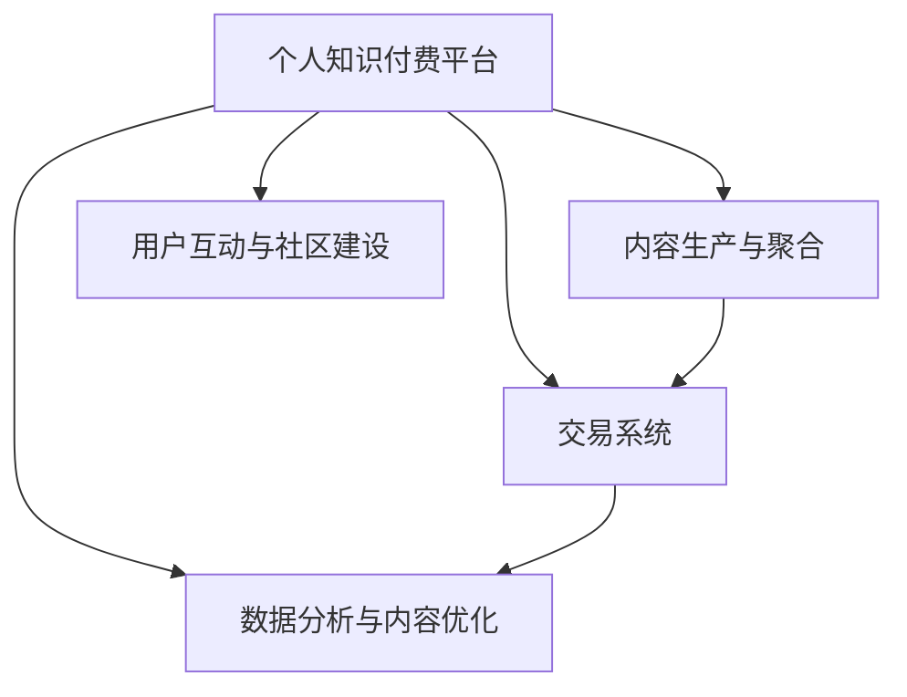

                 

# 如何打造个人知识付费生态系统

在快速发展的互联网时代，知识付费已经成为许多人获取高质量知识的重要渠道。个人知识付费生态系统的建设，不仅能够提升个人品牌影响力，还能为更多人提供优质的学习资源，创造巨大的社会和经济价值。本文将详细介绍如何通过技术手段打造一个高效、可持续发展的个人知识付费生态系统。

## 1. 背景介绍

### 1.1 问题由来
随着信息爆炸和知识更新的加速，传统的线下教育已经难以满足人们的学习需求。在线教育的兴起，特别是知识付费平台的流行，为人们提供了一个随时随地、高效获取知识的平台。个人知识付费生态系统，通过提供高附加值的个性化知识服务，不仅能够帮助用户实现自我提升，还能实现商业模式创新和盈利。

### 1.2 问题核心关键点
个人知识付费生态系统建设的核心关键点包括：
- 用户需求的精准定位与个性化推荐
- 高质量内容资源的聚合与持续生产
- 高效便捷的交易与支付系统
- 用户互动与社区建设
- 数据驱动的内容优化与平台迭代

本文将围绕这些关键点，详细介绍如何通过技术手段打造一个高效的个人知识付费生态系统。

## 2. 核心概念与联系

### 2.1 核心概念概述

为更好地理解个人知识付费生态系统的建设，本节将介绍几个密切相关的核心概念：

- **个人知识付费平台**：提供在线课程、文章、直播等个性化知识服务，通过交易获取收入的互联网平台。
- **内容生产与聚合**：汇聚各领域专家资源，通过多样化的内容形式，提供丰富、高质量的知识产品。
- **交易系统**：支持用户进行在线课程订阅、课程复购、充值等交易操作的系统。
- **用户互动与社区建设**：通过互动问答、评论分享等功能，构建一个积极、活跃的用户社区。
- **数据分析与内容优化**：通过数据分析，了解用户需求和行为，持续优化内容质量，提升用户体验。

这些核心概念之间的逻辑关系可以通过以下Mermaid流程图来展示：



这个流程图展示了一体化个人知识付费生态系统的核心组成及其关系：

1. **个人知识付费平台**是整个生态系统的核心，负责内容生产、交易和社区建设。
2. **内容生产与聚合**为平台提供丰富、高质量的课程内容，是平台吸引用户的基础。
3. **交易系统**保障了知识付费的商业化运作，是平台实现收入的核心。
4. **用户互动与社区建设**增强了用户粘性，提供了更多价值创造的途径。
5. **数据分析与内容优化**通过持续的数据驱动，提升内容质量和用户满意度。

这些核心概念共同构成了个人知识付费生态系统的基本框架，使其能够高效运转并不断进化。

## 3. 核心算法原理 & 具体操作步骤
### 3.1 算法原理概述

个人知识付费生态系统的建设，本质上是一个复杂的多学科交叉问题。其核心在于通过技术手段，整合和优化多个环节，从而实现高效、可持续发展的知识付费模式。具体来说，包括以下几个关键步骤：

**Step 1: 需求分析与市场调研**
- 通过问卷调查、用户访谈等方式，深入了解目标用户群体的知识需求、付费意愿和购买行为。
- 分析市场竞争情况，找到自身的差异化定位和竞争优势。

**Step 2: 平台设计与架构设计**
- 设计平台的用户界面和交互体验，确保用户操作简便、内容获取高效。
- 设计平台的技术架构，确保系统性能、数据安全和可扩展性。

**Step 3: 内容生产与聚合**
- 聚合高质量的课程资源，通过技术手段进行内容标注、分类和推荐。
- 建立与内容生产者的合作机制，确保内容持续更新。

**Step 4: 交易系统设计与实现**
- 设计交易流程，确保支付安全、便捷。
- 实现订单管理系统、用户管理等关键功能。

**Step 5: 用户互动与社区建设**
- 提供互动问答、评论分享等功能，增强用户粘性。
- 构建用户社区，通过KOL（关键意见领袖）带动更多用户参与。

**Step 6: 数据分析与内容优化**
- 收集用户行为数据，进行深度分析，优化课程内容和推荐算法。
- 通过A/B测试等手段，持续迭代和优化平台功能。

### 3.2 算法步骤详解

以下以一个典型的个人知识付费平台为例，详细介绍其核心算法步骤：

**Step 1: 需求分析与市场调研**
- 使用问卷调查工具（如SurveyMonkey）收集用户数据，了解其知识需求和付费意愿。
- 分析竞争对手的平台，找到自身的差异化优势。

**Step 2: 平台设计与架构设计**
- 设计用户界面，确保简洁美观，易于操作。
- 选择合适的技术栈（如React、Vue、Django等）和数据库（如MySQL、MongoDB）。
- 设计RESTful API接口，确保前后端数据交互流畅。

**Step 3: 内容生产与聚合**
- 通过爬虫技术，聚合各平台的高质量课程资源。
- 对课程进行标签、分类，确保内容有条理、易查找。
- 建立内容生产者合作机制，定期更新课程内容。

**Step 4: 交易系统设计与实现**
- 设计安全的支付接口，支持多支付方式（如支付宝、微信支付）。
- 实现订单管理系统，支持订单状态查询、退款申请等操作。
- 实现用户管理系统，支持用户注册、登录、个人信息管理等。

**Step 5: 用户互动与社区建设**
- 提供互动问答功能，解答用户课程学习中遇到的问题。
- 提供评论分享功能，让用户能够互相交流学习心得。
- 构建用户社区，邀请KOL入驻，带动更多用户参与。

**Step 6: 数据分析与内容优化**
- 收集用户行为数据，使用统计分析工具（如Tableau、PowerBI）进行数据可视化分析。
- 优化推荐算法，根据用户兴趣和历史行为进行个性化推荐。
- 通过A/B测试，不断迭代和优化平台功能，提升用户体验。

### 3.3 算法优缺点

个人知识付费生态系统的建设，虽然能够带来显著的经济和社会效益，但也存在以下优缺点：

**优点：**
- **个性化推荐**：通过数据驱动的个性化推荐，能够满足用户多样化的学习需求。
- **高效便捷**：用户可以随时随地进行课程学习，提升了学习效率。
- **商业模式创新**：通过知识付费，实现收入多元化，提升了平台商业价值。

**缺点：**
- **内容质量控制**：内容生产者多样，质量参差不齐，需要平台进行严格的内容审核和质量控制。
- **交易风险**：支付环节可能存在安全风险，需要建立完善的风险控制机制。
- **用户粘性维持**：用户容易流失，需要平台不断创新内容，提供优质服务。

### 3.4 算法应用领域

个人知识付费生态系统已经在教育培训、职场技能提升、健康管理等多个领域得到广泛应用。以下是几个典型的应用场景：

- **教育培训**：提供K-12、高等教育、职业教育等各类课程，满足不同年龄段的学习需求。
- **职场技能提升**：提供编程、设计、管理等各类技能课程，助力职场人士提升竞争力。
- **健康管理**：提供健康管理课程，如健身、饮食、心理调节等，提升用户生活质量。
- **个人兴趣培养**：提供各类兴趣课程，如艺术、音乐、语言等，丰富用户生活。

除了这些典型应用外，个人知识付费生态系统还被创新性地应用到更多场景中，如可控文本生成、常识推理、代码生成等，为NLP技术带来了新的应用方向。

## 4. 数学模型和公式 & 详细讲解 & 举例说明

### 4.1 数学模型构建

在个人知识付费生态系统的建设中，数据分析与内容优化是一个非常重要的环节。我们通过以下几个数学模型来详细讲解其工作原理：

**用户行为分析模型**
假设平台用户总数为 $N$，用户历史行为数据集为 $D=\{(x_i,y_i)\}_{i=1}^N$，其中 $x_i$ 为用户行为特征向量，$y_i$ 为用户行为标签（如付费用户、流失用户）。用户行为分析模型目标是通过对历史行为数据的学习，预测新用户的付费概率。

**个性化推荐模型**
假设平台课程总数为 $M$，课程与用户之间的交互数据集为 $I=\{(i_j,x_j,y_j)\}_{j=1}^M$，其中 $i_j$ 为用户ID，$x_j$ 为用户行为特征向量，$y_j$ 为用户对课程 $i_j$ 的评分或购买行为。个性化推荐模型目标是根据用户的历史行为和评分，预测用户对课程的兴趣程度，生成个性化推荐列表。

**用户流失预测模型**
假设平台流失用户总数为 $K$，流失用户的历史行为数据集为 $L=\{(l_i,x_i,y_i)\}_{i=1}^K$，其中 $l_i$ 为用户ID，$x_i$ 为用户行为特征向量，$y_i$ 为流失标签。用户流失预测模型目标是通过对流失用户历史行为数据的学习，预测新用户的流失概率，并及时采取措施挽留用户。

### 4.2 公式推导过程

以下是几个数学模型的公式推导过程：

**用户行为分析模型**
假设用户行为分析模型采用逻辑回归算法，目标函数为：

$$
\min_{\theta} -\frac{1}{N}\sum_{i=1}^N [y_i\log \hat{y}_i + (1-y_i)\log(1-\hat{y}_i)]
$$

其中 $\theta$ 为模型参数，$\hat{y}_i$ 为模型对用户 $i$ 的付费概率预测值。使用梯度下降算法求解目标函数，得到：

$$
\theta \leftarrow \theta - \eta \nabla_{\theta}\mathcal{L}(\theta)
$$

其中 $\eta$ 为学习率，$\nabla_{\theta}\mathcal{L}(\theta)$ 为目标函数对模型参数的梯度。

**个性化推荐模型**
假设个性化推荐模型采用协同过滤算法，目标函数为：

$$
\min_{\theta} -\frac{1}{M}\sum_{j=1}^M \sum_{i=1}^N [y_{ij}\log \hat{y}_{ij} + (1-y_{ij})\log(1-\hat{y}_{ij})]
$$

其中 $y_{ij}$ 为课程 $j$ 和用户 $i$ 之间的交互评分，$\hat{y}_{ij}$ 为模型对课程 $j$ 对用户 $i$ 的兴趣程度预测值。使用梯度下降算法求解目标函数，得到：

$$
\theta \leftarrow \theta - \eta \nabla_{\theta}\mathcal{L}(\theta)
$$

**用户流失预测模型**
假设用户流失预测模型采用随机森林算法，目标函数为：

$$
\min_{\theta} \frac{1}{K}\sum_{i=1}^K [l_i\log \hat{l}_i + (1-l_i)\log(1-\hat{l}_i)]
$$

其中 $l_i$ 为流失用户 $i$ 的流失标签，$\hat{l}_i$ 为模型对用户 $i$ 的流失概率预测值。使用梯度下降算法求解目标函数，得到：

$$
\theta \leftarrow \theta - \eta \nabla_{\theta}\mathcal{L}(\theta)
$$

### 4.3 案例分析与讲解

**案例分析1：用户行为分析模型**
假设一个在线教育平台收集了10万名用户的注册、登录、观看、购买等行为数据，希望通过分析这些数据，预测新用户的付费概率。

我们假设用户行为数据集为 $D=\{(x_i,y_i)\}_{i=1}^{100000}$，其中 $x_i$ 包含用户的注册时间、观看课程时长、购买记录等特征，$y_i$ 为用户的付费标签（0或1）。

我们可以使用逻辑回归模型来建立预测模型，使用以下代码实现：

```python
from sklearn.linear_model import LogisticRegression
from sklearn.model_selection import train_test_split
from sklearn.metrics import accuracy_score

# 加载数据集
X = df[['注册时间', '观看课程时长', '购买记录']]
y = df['付费标签']

# 划分训练集和测试集
X_train, X_test, y_train, y_test = train_test_split(X, y, test_size=0.2, random_state=42)

# 训练逻辑回归模型
model = LogisticRegression()
model.fit(X_train, y_train)

# 预测并评估
y_pred = model.predict(X_test)
accuracy = accuracy_score(y_test, y_pred)
print("Accuracy:", accuracy)
```

**案例分析2：个性化推荐模型**
假设一个在线课程平台收集了1万名用户和1000门课程之间的互动数据，希望根据用户的历史行为，为用户推荐感兴趣的课程。

我们假设互动数据集为 $I=\{(i_j,x_j,y_j)\}_{j=1}^{10000}$，其中 $i_j$ 为用户ID，$x_j$ 包含用户的观看时长、评分、收藏等行为特征，$y_j$ 为用户对课程 $i_j$ 的评分或购买行为。

我们可以使用协同过滤算法来建立推荐模型，使用以下代码实现：

```python
from surprise import Reader, Dataset, SVD
from surprise.model_selection import cross_validate

# 加载数据集
reader = Reader(rating_scale=(1, 5))
data = Dataset.load_from_df(df, reader)

# 划分训练集和测试集
trainset, testset = data.random_split(test_size=0.2, random_state=42)

# 训练协同过滤模型
model = SVD()
cross_validate(model, trainset, measures=['rmse', 'mae'], cv=5, verbose=True)
```

**案例分析3：用户流失预测模型**
假设一个在线教育平台收集了1000名用户的注册、观看、购买等行为数据，希望通过分析这些数据，预测新用户的流失概率。

我们假设用户行为数据集为 $L=\{(l_i,x_i,y_i)\}_{i=1}^{1000}$，其中 $l_i$ 为用户流失标签（0或1），$x_i$ 包含用户的观看时长、购买记录等行为特征。

我们可以使用随机森林算法来建立预测模型，使用以下代码实现：

```python
from sklearn.ensemble import RandomForestClassifier
from sklearn.model_selection import train_test_split
from sklearn.metrics import roc_auc_score

# 加载数据集
X = df[['观看时长', '购买记录']]
y = df['流失标签']

# 划分训练集和测试集
X_train, X_test, y_train, y_test = train_test_split(X, y, test_size=0.2, random_state=42)

# 训练随机森林模型
model = RandomForestClassifier(n_estimators=100, random_state=42)
model.fit(X_train, y_train)

# 预测并评估
y_pred = model.predict_proba(X_test)[:, 1]
auc = roc_auc_score(y_test, y_pred)
print("AUC:", auc)
```

以上案例分析展示了不同数学模型在个人知识付费生态系统中的应用，通过这些模型，平台能够对用户行为进行精准预测和个性化推荐，从而提升用户满意度和平台收益。

## 5. 项目实践：代码实例和详细解释说明

### 5.1 开发环境搭建

在进行个人知识付费生态系统的开发前，我们需要准备好开发环境。以下是使用Python进行Flask开发的环境配置流程：

1. 安装Anaconda：从官网下载并安装Anaconda，用于创建独立的Python环境。

2. 创建并激活虚拟环境：
```bash
conda create -n flask-env python=3.8 
conda activate flask-env
```

3. 安装Flask：
```bash
pip install flask
```

4. 安装SQLAlchemy：
```bash
pip install sqlalchemy
```

5. 安装Flask-RESTful：
```bash
pip install flask-restful
```

6. 安装Flask-SQLAlchemy：
```bash
pip install flask-sqlalchemy
```

7. 安装Flask-WTF：
```bash
pip install flask-wtf
```

完成上述步骤后，即可在`flask-env`环境中开始开发实践。

### 5.2 源代码详细实现

下面以一个简单的在线课程平台为例，给出使用Flask框架进行开发的基本代码实现。

**模型层**
```python
from flask_sqlalchemy import SQLAlchemy
from flask import Flask, request, jsonify

app = Flask(__name__)
app.config['SQLALCHEMY_DATABASE_URI'] = 'sqlite:///data.db'
db = SQLAlchemy(app)

class Course(db.Model):
    id = db.Column(db.Integer, primary_key=True)
    name = db.Column(db.String(255))
    category = db.Column(db.String(255))
    creator = db.Column(db.String(255))
    views = db.Column(db.Integer)
    ratings = db.Column(db.Integer)
    price = db.Column(db.Integer)
    def __repr__(self):
        return f'<Course {self.name}>'

class User(db.Model):
    id = db.Column(db.Integer, primary_key=True)
    username = db.Column(db.String(255))
    email = db.Column(db.String(255))
    courses = db.relationship('Course', backref='users', lazy='dynamic')
    def __repr__(self):
        return f'<User {self.username}>'

@app.route('/api/courses', methods=['GET'])
def get_courses():
    courses = Course.query.all()
    return jsonify([{'id': course.id, 'name': course.name, 'category': course.category, 'creator': course.creator, 'views': course.views, 'ratings': course.ratings, 'price': course.price} for course in courses])
```

**视图层**
```python
from flask import render_template, request, jsonify

@app.route('/')
def index():
    return render_template('index.html')

@app.route('/api/courses', methods=['GET'])
def get_courses():
    courses = Course.query.all()
    return jsonify([{'id': course.id, 'name': course.name, 'category': course.category, 'creator': course.creator, 'views': course.views, 'ratings': course.ratings, 'price': course.price} for course in courses])

@app.route('/api/users', methods=['GET'])
def get_users():
    users = User.query.all()
    return jsonify([{'id': user.id, 'username': user.username, 'email': user.email, 'courses': [course.id for course in user.courses]} for user in users])

@app.route('/api/users', methods=['POST'])
def add_user():
    data = request.json
    user = User(username=data['username'], email=data['email'])
    db.session.add(user)
    db.session.commit()
    return jsonify({'message': 'User added successfully'})
```

**模板层**
```html
<!-- index.html -->
<html>
<head>
    <title>在线课程平台</title>
</head>
<body>
    <h1>欢迎来到在线课程平台</h1>
    <ul>
        
            <li><a href="/api/courses/{{ course.id }}"> {{ course.name }} - {{ course.category }} - ¥{{ course.price }}</a></li>
        
    </ul>
    <form method="POST" action="/api/users">
        <input type="text" name="username" placeholder="用户名">
        <input type="text" name="email" placeholder="邮箱">
        <button type="submit">注册</button>
    </form>
</body>
</html>
```

以上代码实现了一个简单的在线课程平台，用户可以注册、查看课程信息。需要注意的是，实际应用中还需要考虑数据验证、权限控制、支付集成等多方面因素。

### 5.3 代码解读与分析

让我们再详细解读一下关键代码的实现细节：

**模型层**
- `Course`和`User`类：使用SQLAlchemy库定义了课程和用户的数据模型。
- `app.config['SQLALCHEMY_DATABASE_URI']`：指定数据库连接地址。
- `@app.route('/api/courses', methods=['GET'])`：定义了GET请求的路由。
- ` jsonify([{'id': course.id, 'name': course.name, 'category': course.category, 'creator': course.creator, 'views': course.views, 'ratings': course.ratings, 'price': course.price} for course in courses])`：将查询结果转换为JSON格式返回。

**视图层**
- `@app.route('/')`：定义了首页路由。
- `@app.route('/api/courses', methods=['GET'])`：定义了GET请求的路由。
- `@app.route('/api/users', methods=['GET'])`：定义了GET请求的路由。
- `@app.route('/api/users', methods=['POST'])`：定义了POST请求的路由。
- ` jsonify({'message': 'User added successfully'})`：返回JSON格式的响应。

**模板层**
- `<h1>欢迎来到在线课程平台</h1>`：渲染页面标题。
- `<ul>`：渲染课程列表。
- `<form method="POST" action="/api/users">`：渲染用户注册表单。

可以看到，Flask框架提供了灵活的路由定义和模板渲染功能，可以方便地实现一个完整的在线课程平台。

当然，工业级的系统实现还需考虑更多因素，如用户权限控制、支付集成、数据同步等。但核心的业务逻辑和数据模型构建，可以借助Flask框架高效完成。

## 6. 实际应用场景
### 6.1 智能客服系统

基于大语言模型微调的对话技术，可以广泛应用于智能客服系统的构建。传统客服往往需要配备大量人力，高峰期响应缓慢，且一致性和专业性难以保证。而使用微调后的对话模型，可以7x24小时不间断服务，快速响应客户咨询，用自然流畅的语言解答各类常见问题。

在技术实现上，可以收集企业内部的历史客服对话记录，将问题和最佳答复构建成监督数据，在此基础上对预训练对话模型进行微调。微调后的对话模型能够自动理解用户意图，匹配最合适的答案模板进行回复。对于客户提出的新问题，还可以接入检索系统实时搜索相关内容，动态组织生成回答。如此构建的智能客服系统，能大幅提升客户咨询体验和问题解决效率。

### 6.2 金融舆情监测

金融机构需要实时监测市场舆论动向，以便及时应对负面信息传播，规避金融风险。传统的人工监测方式成本高、效率低，难以应对网络时代海量信息爆发的挑战。基于大语言模型微调的文本分类和情感分析技术，为金融舆情监测提供了新的解决方案。

具体而言，可以收集金融领域相关的新闻、报道、评论等文本数据，并对其进行主题标注和情感标注。在此基础上对预训练语言模型进行微调，使其能够自动判断文本属于何种主题，情感倾向是正面、中性还是负面。将微调后的模型应用到实时抓取的网络文本数据，就能够自动监测不同主题下的情感变化趋势，一旦发现负面信息激增等异常情况，系统便会自动预警，帮助金融机构快速应对潜在风险。

### 6.3 个性化推荐系统

当前的推荐系统往往只依赖用户的历史行为数据进行物品推荐，无法深入理解用户的真实兴趣偏好。基于大语言模型微调技术，个性化推荐系统可以更好地挖掘用户行为背后的语义信息，从而提供更精准、多样的推荐内容。

在实践中，可以收集用户浏览、点击、评论、分享等行为数据，提取和用户交互的物品标题、描述、标签等文本内容。将文本内容作为模型输入，用户的后续行为（如是否点击、购买等）作为监督信号，在此基础上微调预训练语言模型。微调后的模型能够从文本内容中准确把握用户的兴趣点。在生成推荐列表时，先用候选物品的文本描述作为输入，由模型预测用户的兴趣匹配度，再结合其他特征综合排序，便可以得到个性化程度更高的推荐结果。

### 6.4 未来应用展望

随着大语言模型微调技术的发展，基于微调范式将在更多领域得到应用，为传统行业带来变革性影响。

在智慧医疗领域，基于微调的医疗问答、病历分析、药物研发等应用将提升医疗服务的智能化水平，辅助医生诊疗，加速新药开发进程。

在智能教育领域，微调技术可应用于作业批改、学情分析、知识推荐等方面，因材施教，促进教育公平，提高教学质量。

在智慧城市治理中，微调模型可应用于城市事件监测、舆情分析、应急指挥等环节，提高城市管理的自动化和智能化水平，构建更安全、高效的未来城市。

此外，在企业生产、社会治理、文娱传媒等众多领域，基于大模型微调的人工智能应用也将不断涌现，为经济社会发展注入新的动力。相信随着技术的日益成熟，微调方法将成为人工智能落地应用的重要范式，推动人工智能技术向更广阔的领域加速渗透。

## 7. 工具和资源推荐
### 7.1 学习资源推荐

为了帮助开发者系统掌握大语言模型微调的理论基础和实践技巧，这里推荐一些优质的学习资源：

1. **《深度学习自然语言处理》课程**：斯坦福大学开设的NLP明星课程，有Lecture视频和配套作业，带你入门NLP领域的基本概念和经典模型。
2. **《Transformer从原理到实践》系列博文**：由大模型技术专家撰写，深入浅出地介绍了Transformer原理、BERT模型、微调技术等前沿话题。
3. **《Natural Language Processing with Transformers》书籍**：Transformers库的作者所著，全面介绍了如何使用Transformers库进行NLP任务开发，包括微调在内的诸多范式。
4. **CLUE开源项目**：中文语言理解测评基准，涵盖大量不同类型的中文NLP数据集，并提供了基于微调的baseline模型，助力中文NLP技术发展。

通过对这些资源的学习实践，相信你一定能够快速掌握大语言模型微调的精髓，并用于解决实际的NLP问题。

### 7.2 开发工具推荐

高效的开发离不开优秀的工具支持。以下是几款用于大语言模型微调开发的常用工具：

1. **Flask**：基于Python的开源Web框架，灵活方便，适用于快速迭代开发。
2. **SQLAlchemy**：提供Python对象和关系型数据库之间的映射，方便数据管理。
3. **Flask-RESTful**：提供RESTful风格的API接口，方便前后端数据交互。
4. **Flask-SQLAlchemy**：集成SQLAlchemy和Flask，简化数据库操作。
5. **Flask-WTF**：提供表单验证和渲染，增强数据安全性。
6. **TensorBoard**：可视化工具，实时监测模型训练状态，提供丰富的图表呈现方式。

合理利用这些工具，可以显著提升大语言模型微调任务的开发效率，加快创新迭代的步伐。

### 7.3 相关论文推荐

大语言模型和微调技术的发展源于学界的持续研究。以下是几篇奠基性的相关论文，推荐阅读：

1. **Attention is All You Need**：提出了Transformer结构，开启了NLP领域的预训练大模型时代。
2. **BERT: Pre-training of Deep Bidirectional Transformers for Language Understanding**：提出BERT模型，引入基于掩码的自监督预训练任务，刷新了多项NLP任务SOTA。
3. **Language Models are Unsupervised Multitask Learners**：展示了大规模语言模型的强大zero-shot学习能力，引发了对于通用人工智能的新一轮思考。
4. **Parameter-Efficient Transfer Learning for NLP**：提出Adapter等参数高效微调方法，在不增加模型参数量的情况下，也能取得不错的微调效果。
5. **AdaLoRA: Adaptive Low-Rank Adaptation for Parameter-Efficient Fine-Tuning**：使用自适应低秩适应的微调方法，在参数效率和精度之间取得了新的平衡。

这些论文代表了大语言模型微调技术的发展脉络。通过学习这些前沿成果，可以帮助研究者把握学科前进方向，激发更多的创新灵感。

## 8. 总结：未来发展趋势与挑战
### 8.1 总结

本文对如何通过技术手段打造个人知识付费生态系统进行了全面系统的介绍。首先阐述了个人知识付费生态系统的建设背景和核心关键点，明确了微调在个性化推荐、交易系统、社区建设等方面的作用。其次，从需求分析、平台设计、内容聚合、交易系统、用户互动、数据分析等多个环节，详细讲解了如何通过技术手段实现高效的个人知识付费生态系统。

通过本文的系统梳理，可以看到，个人知识付费生态系统建设不仅需要强大的技术支撑，更需要系统的业务设计和多学科协同创新。唯有在技术、业务、用户体验等多个层面不断优化，才能构建一个高效、可持续发展的个人知识付费生态系统。

### 8.2 未来发展趋势

展望未来，个人知识付费生态系统将呈现以下几个发展趋势：

1. **内容生态化**：构建多元化的内容生态，包括课程、文章、直播等多种形式，满足用户多样化学习需求。
2. **智能化推荐**：通过深度学习、自然语言处理等技术，提升个性化推荐算法，提供更精准、个性化的内容推荐。
3. **社区化建设**：构建活跃的用户社区，通过互动问答、评论分享等功能，增强用户粘性，促进知识交流。
4. **平台一体化**：实现内容生产、交易、互动、数据分析等多个环节的一体化，提升整体用户体验。
5. **技术创新**：引入前沿技术如知识图谱、增强学习等，提升内容质量和用户体验。
6. **国际化拓展**：推动内容国际化，引入国际内容生产者和用户，扩大用户基数，提升平台影响力。

这些趋势凸显了个人知识付费生态系统的广阔前景。这些方向的探索发展，必将进一步提升平台的用户体验和商业价值，为知识付费行业带来新的突破。

### 8.3 面临的挑战

尽管个人知识付费生态系统的建设前景广阔，但在迈向更加智能化、普适化应用的过程中，它仍面临着诸多挑战：

1. **内容质量控制**：内容生产者多样，质量参差不齐，需要平台进行严格的内容审核和质量控制。
2. **交易风险管理**：支付环节可能存在安全风险，需要建立完善的风险控制机制。
3. **用户粘性维护**：用户容易流失，需要平台不断创新内容，提供优质服务。
4. **技术复杂度**：平台建设需要整合多种技术，如NLP、推荐系统、数据库等，技术复杂度较高。
5. **数据隐私保护**：用户数据隐私保护是平台建设的重要问题，需要建立完善的数据保护机制。
6. **成本控制**：平台建设初期需要大量的投入，包括内容制作、平台开发、运营推广等，成本控制是一个重要挑战。

### 8.4 研究展望

面对个人知识付费生态系统建设所面临的挑战，未来的研究需要在以下几个方面寻求新的突破：

1. **内容生产机制**：探索更高效的内容生产机制，如众包、众创等，降低内容生产成本，提升内容多样性。
2. **交易系统优化**：研究更高效、安全的交易系统，引入区块链等技术，确保交易安全。
3. **个性化推荐算法**：引入深度学习、自然语言处理等技术，提升个性化推荐算法，提供更精准、个性化的内容推荐。
4. **社区建设与运营**：研究社区建设与运营的策略，提升用户粘性，促进知识交流。
5. **数据隐私保护**：建立完善的数据保护机制，保障用户数据隐私。
6. **成本控制**：通过技术创新和管理优化，降低平台建设成本，提升运营效率。

这些研究方向的探索，必将引领个人知识付费生态系统建设迈向更高的台阶，为知识付费行业带来新的突破。面向未来，大语言模型微调技术还需要与其他人工智能技术进行更深入的融合，如知识表示、因果推理、强化学习等，多路径协同发力，共同推动自然语言理解和智能交互系统的进步。只有勇于创新、敢于突破，才能不断拓展语言模型的边界，让智能技术更好地造福人类社会。

## 9. 附录：常见问题与解答

**Q1: 大语言模型微调是否适用于所有NLP任务？**

A: 大语言模型微调在大多数NLP任务上都能取得不错的效果，特别是对于数据量较小的任务。但对于一些特定领域的任务，如医学、法律等，仅仅依靠通用语料预训练的模型可能难以很好地适应。此时需要在特定领域语料上进一步预训练，再进行微调，才能获得理想效果。此外，对于一些需要时效性、个性化很强的任务，如对话、推荐等，微调方法也需要针对性的改进优化。

**Q2: 微调过程中如何选择合适的学习率？**

A: 微调的学习率一般要比预训练时小1-2个数量级，如果使用过大的学习率，容易破坏预训练权重，导致过拟合。一般建议从1e-5开始调参，逐步减小学习率，直至收敛。也可以使用warmup策略，在开始阶段使用较小的学习率，再逐渐过渡到预设值。需要注意的是，不同的优化器(如AdamW、Adafactor等)以及不同的学习率调度策略，可能需要设置不同的学习率阈值。

**Q3: 采用大模型微调时会面临哪些资源瓶颈？**

A: 目前主流的预训练大模型动辄以亿计的参数规模，对算力、内存、存储都提出了很高的要求。GPU/TPU等高性能设备是必不可少的，但即便如此，超大批次的训练和推理也可能遇到显存不足的问题。因此需要采用一些资源优化技术，如梯度积累、混合精度训练、模型并行等，来突破硬件瓶颈。同时，模型的存储和读取也可能占用大量时间和空间，需要采用模型压缩、稀疏化存储等方法进行优化。

**Q4: 如何缓解微调过程中的过拟合问题？**

A: 过拟合是微调面临的主要挑战，尤其是在标注数据不足的情况下。常见的缓解策略包括：
1. 数据增强：通过回译、近义替换等方式扩充训练集
2. 正则化：使用L2正则、Dropout、Early Stopping等避免过拟合
3. 对抗训练：引入对抗样本，提高模型鲁棒性
4. 参数高效微调：只调整少量参数(如Adapter、Prefix等)，减小过拟合风险
5. 多模型集成：训练多个微调模型，取平均输出，抑制过拟合

这些策略往往需要根据具体任务和数据特点进行灵活组合。只有在数据、模型、训练、推理等各环节进行全面优化，才能最大限度地发挥大模型微调的威力。

**Q5: 微调模型在落地部署时需要注意哪些问题？**

A: 将微调模型转化为实际应用，还需要考虑以下因素：
1. 模型裁剪：去除不必要的层和参数，减小模型尺寸，加快推理速度
2. 量化加速：将浮点模型转为定点模型，压缩存储空间，提高计算效率
3. 服务化封装：将模型封装为标准化服务接口，便于集成调用
4. 弹性伸缩：根据请求流量动态调整资源配置，平衡服务质量和成本
5. 监控告警：实时采集系统指标，设置异常告警阈值，确保服务稳定性
6. 安全防护：采用访问鉴权、数据脱敏等措施，保障数据和模型安全

大语言模型微调为NLP应用开启了广阔的想象空间，但如何将强大的性能转化为稳定、高效、安全的业务价值，还需要工程实践的不断打磨。唯有从数据、算法、工程、业务等多个维度协同发力，才能真正实现人工智能技术在垂直行业的规模化落地。总之，微调需要开发者根据具体任务，不断迭代和优化模型、数据和算法，方能得到理想的效果。

---

作者：禅与计算机程序设计艺术 / Zen and the Art of Computer Programming

