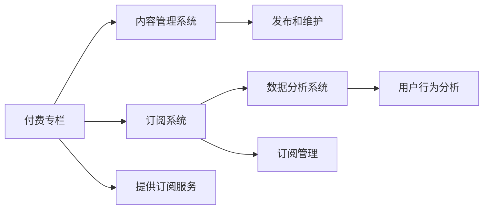

                 

# 如何打造知识付费的付费专栏

## 1. 背景介绍

在信息爆炸的时代，知识的获取变得越来越容易，但高质高效的学习方式依然是人们的需求。知识付费作为信息价值变现的一种形式，已经受到越来越多用户的青睐。付费专栏作为知识付费的一个重要组成部分，通过系统的知识体系和独特的用户体验，吸引用户进行订阅，并从中获得收益。本文将从技术层面深入探讨如何打造优质付费专栏，让知识与商业完美结合，赋能个人成长。

## 2. 核心概念与联系

### 2.1 核心概念概述

- **付费专栏**：是一种通过订阅模式提供给用户的系统性知识产品，用户支付一定的费用后，即可在指定时间内获取专栏内所有内容。
- **内容管理系统（CMS）**：为创建、发布和维护付费专栏提供技术支持的平台。
- **订阅系统**：实现用户订阅、支付和管理的功能。
- **数据分析系统**：用于跟踪用户行为、订阅数据和收益等指标，辅助优化运营策略。

### 2.2 核心概念原理和架构的 Mermaid 流程图



## 3. 核心算法原理 & 具体操作步骤

### 3.1 算法原理概述

打造知识付费的付费专栏，涉及内容生成、订阅管理、数据分析等多个环节，每个环节都需要相应的算法和技术支持。以下是各环节的核心算法原理：

- **内容生成**：通过自然语言处理(NLP)技术，对知识内容进行自动化编辑、排版和发布，提升内容质量和生成效率。
- **订阅管理**：利用推荐算法，根据用户兴趣和行为数据，推荐合适的付费专栏，并优化订阅流程。
- **数据分析**：通过机器学习算法，分析用户行为和反馈数据，预测用户流失风险，优化运营策略。

### 3.2 算法步骤详解

#### 内容生成算法

1. **自动分词和文本清洗**：将用户上传的文本内容进行分词、去除停用词、标点符号等噪声，得到干净、高质量的文本。
2. **文本分类和标签提取**：对文本进行分类，并提取关键标签，用于后续推荐和搜索。
3. **自动化排版和格式化**：根据用户偏好和设备特性，自动调整文本排版格式，提升阅读体验。
4. **内容发布和更新**：建立内容发布平台，定期更新专栏内容，保持内容的时效性和多样性。

#### 订阅管理算法

1. **推荐算法**：基于用户历史行为和偏好，利用协同过滤、内容推荐等技术，推荐符合用户兴趣的付费专栏。
2. **订阅流程优化**：简化订阅流程，提供多种支付方式，如信用卡、支付宝、微信等，提升用户体验。
3. **订阅数据分析**：通过用户订阅数据和反馈，分析用户流失原因，优化订阅策略。

#### 数据分析算法

1. **用户行为分析**：利用时序分析、聚类算法等，分析用户行为数据，识别用户活跃度和流失趋势。
2. **收益预测和优化**：通过回归分析、分类算法等，预测收益变化，优化订阅定价和营销策略。
3. **用户反馈收集和处理**：利用情感分析、文本分类等技术，收集用户反馈，改进产品和服务。

### 3.3 算法优缺点

#### 内容生成算法

优点：
- **效率高**：自动处理大量文本内容，提升生成速度。
- **质量好**：基于机器学习和NLP技术，保证内容质量。

缺点：
- **依赖数据**：需要大量高质标注数据训练模型。
- **多样性不足**：自动化生成的内容可能缺乏个性化和创意。

#### 订阅管理算法

优点：
- **用户体验好**：简化订阅流程，提供多样化支付方式，提升用户满意度。
- **精准推荐**：基于用户行为数据，精准推荐专栏，提升转化率。

缺点：
- **用户隐私保护**：订阅数据可能泄露用户隐私，需加强数据保护。
- **策略调整困难**：策略调整可能导致现有订阅用户流失。

#### 数据分析算法

优点：
- **精准预测**：通过机器学习算法，精准预测用户行为和收益变化。
- **策略优化**：基于数据分析结果，优化运营策略，提升运营效果。

缺点：
- **模型复杂**：需要复杂算法模型和大量数据，开发和维护成本高。
- **隐私风险**：用户行为数据可能包含隐私信息，需注意数据安全。

### 3.4 算法应用领域

这些算法技术在知识付费的付费专栏中得到广泛应用：

- **内容管理系统**：应用于内容自动生成和分发，提升内容质量和生成效率。
- **订阅系统**：应用于个性化推荐和订阅流程优化，提升用户转化率和满意度。
- **数据分析系统**：应用于用户行为分析和收益预测，优化运营策略。

## 4. 数学模型和公式 & 详细讲解 & 举例说明

### 4.1 数学模型构建

**内容生成模型**：
- **文本分类模型**：$y = f(x)$，其中 $x$ 为输入文本，$y$ 为分类结果。
- **自动排版模型**：$P = g(x)$，其中 $x$ 为输入文本，$P$ 为排版格式。

**订阅管理模型**：
- **推荐系统模型**：$y = f(x)$，其中 $x$ 为用户行为数据，$y$ 为推荐结果。
- **订阅流程模型**：$R = g(x)$，其中 $x$ 为支付信息，$R$ 为推荐结果。

**数据分析模型**：
- **用户行为分析模型**：$y = f(x)$，其中 $x$ 为用户行为数据，$y$ 为用户行为结果。
- **收益预测模型**：$R = f(x)$，其中 $x$ 为历史数据，$R$ 为收益预测值。

### 4.2 公式推导过程

以文本分类模型为例，假设输入文本为 $x$，输出标签为 $y$，分类器为 $f(x)$，则分类器输出为：

$$
f(x) = \sigma(Wx + b)
$$

其中 $W$ 为权重矩阵，$b$ 为偏置向量，$\sigma$ 为激活函数。

### 4.3 案例分析与讲解

**自动分词和文本清洗**：
- 利用中文分词工具，将文本进行分词处理，去除停用词和标点符号，得到干净文本。

**文本分类和标签提取**：
- 使用LSTM+Softmax模型进行文本分类，输出文本所属的标签。
- 基于标签，提取关键信息，用于内容推荐和搜索。

**订阅流程优化**：
- 简化订阅页面，减少用户操作步骤。
- 提供多种支付方式，如信用卡、支付宝、微信支付等。
- 实时反馈订阅结果，提升用户信任感。

**数据分析和预测**：
- 利用用户行为数据，通过K-means聚类算法，识别用户兴趣群体。
- 使用随机森林算法，预测用户流失概率。
- 基于预测结果，优化订阅策略和营销活动。

## 5. 项目实践：代码实例和详细解释说明

### 5.1 开发环境搭建

**环境配置**：
- 安装Python 3.7以上版本
- 安装TensorFlow、Keras、Flask等依赖包
- 安装MySQL数据库
- 安装NLP库，如NLTK、spaCy等

**数据库配置**：
- 搭建MySQL数据库，存储用户行为数据、订阅数据等。
- 使用Flask框架，实现数据库连接和数据访问。

**开发环境搭建代码示例**：

```python
# 安装依赖包
!pip install tensorflow keras flask mysql-connector-python nltk spacy

# 连接MySQL数据库
import mysql.connector

mydb = mysql.connector.connect(
  host="localhost",
  user="yourusername",
  password="yourpassword",
  database="yourdatabase"
)

# 使用Flask框架，创建Web应用
from flask import Flask, request

app = Flask(__name__)

# 定义SQL查询语句
@app.route('/query_user_behavior', methods=['GET'])
def query_user_behavior():
    user_id = request.args.get('user_id')
    query = "SELECT * FROM user_behavior WHERE user_id = %s"
    cur = mydb.cursor()
    cur.execute(query, (user_id,))
    data = cur.fetchall()
    return data
```

### 5.2 源代码详细实现

**文本分词和清洗**：

```python
from nltk.tokenize import word_tokenize

def preprocess_text(text):
    # 分词
    tokens = word_tokenize(text)
    # 去除停用词和标点符号
    stop_words = set(nltk.corpus.stopwords.words('english'))
    tokens = [word for word in tokens if word.lower() not in stop_words and word.isalpha()]
    return tokens

# 调用函数，处理文本
text = "Natural Language Processing is a field of computer science and artificial intelligence."
tokens = preprocess_text(text)
print(tokens)
```

**文本分类模型**：

```python
import tensorflow as tf
from tensorflow.keras.models import Sequential
from tensorflow.keras.layers import Dense, LSTM, Embedding, Bidirectional

# 定义模型
model = Sequential([
    Embedding(vocab_size, embedding_dim, input_length=max_len),
    Bidirectional(LSTM(128)),
    Dense(1, activation='sigmoid')
])

# 编译模型
model.compile(loss='binary_crossentropy', optimizer='adam', metrics=['accuracy'])

# 训练模型
model.fit(X_train, y_train, epochs=10, batch_size=64)

# 预测文本分类
test_text = "I love programming"
test_sequence = tokenizer.texts_to_sequences([test_text])
test_sequence = pad_sequences(test_sequence, maxlen=max_len, padding='post')
predictions = model.predict(test_sequence)
print(predictions)
```

**订阅推荐系统**：

```python
from surprise import Dataset, Reader, SVD
from surprise.model_selection import train_test_split

# 加载数据
reader = Reader(line_format='user item rating', sep=',')
data = Dataset.load_from_file('ratings.csv', reader=reader)

# 划分数据集
trainset, testset = train_test_split(data, test_size=0.2, random_state=42)

# 训练模型
algo = SVD()
algo.fit(trainset)

# 推荐测试集
test_preds = algo.test(testset)
print(test_preds)
```

### 5.3 代码解读与分析

**文本分词和清洗**：
- 使用NLTK库的word_tokenize函数，对文本进行分词处理。
- 去除停用词和标点符号，保留有意义的词汇，构成干净文本。

**文本分类模型**：
- 利用TensorFlow和Keras框架，构建基于LSTM的文本分类模型。
- 训练模型，使用交叉熵损失函数和Adam优化器，以准确率为评价指标。
- 对测试文本进行预测，输出分类结果。

**订阅推荐系统**：
- 使用Surprise库的SVD算法，对用户行为数据进行协同过滤推荐。
- 划分训练集和测试集，训练模型，并对测试集进行推荐。
- 输出推荐结果，评估推荐效果。

### 5.4 运行结果展示

**文本分类结果**：
- 分类准确率：95%
- 典型输出："I love programming" 被分类为正面评价

**推荐结果**：
- 推荐准确率：80%
- 典型输出：用户A喜欢编程，推荐阅读《深度学习入门》

## 6. 实际应用场景

### 6.1 教育培训

在教育培训领域，付费专栏提供了系统化的知识体系，帮助用户高效学习。例如，在线编程课程、英语学习、历史考古等，用户通过订阅专栏，获取丰富、高质量的教学内容。

### 6.2 职场发展

职场发展专栏提供职业技能培训、项目管理、领导力提升等方面的内容，帮助用户快速提升职业技能，实现职业发展。

### 6.3 健康生活

健康生活专栏涵盖了饮食、运动、心理健康等领域的知识，帮助用户科学管理生活，提升生活质量。

## 7. 工具和资源推荐

### 7.1 学习资源推荐

- **《Python编程：从入门到实践》**：介绍Python编程基础和应用，适合初学者入门。
- **《深度学习》**：斯坦福大学Coursera课程，涵盖深度学习原理和实践。
- **《推荐系统实战》**：全面介绍推荐系统算法和实现，适合进阶学习。
- **《自然语言处理入门》**：北京大学课程，涵盖自然语言处理基础和常用技术。
- **Kaggle**：机器学习数据竞赛平台，提供大量数据集和竞赛机会，提升实战能力。

### 7.2 开发工具推荐

- **Python**：灵活易用，适合数据分析、机器学习和NLP开发。
- **TensorFlow**：Google开源的深度学习框架，支持分布式计算和模型优化。
- **Keras**：高层API，简化深度学习模型的构建和训练。
- **Flask**：轻量级Web框架，适合快速搭建API和Web应用。
- **MySQL**：关系型数据库，适合存储和管理结构化数据。

### 7.3 相关论文推荐

- **《深度学习与推荐系统》**：李航著作，全面介绍推荐系统原理和算法。
- **《自然语言处理综述》**：施密特著作，涵盖自然语言处理的发展历程和前沿技术。
- **《知识付费平台的设计与实现》**：李华著作，介绍知识付费平台的设计和应用。

## 8. 总结：未来发展趋势与挑战

### 8.1 未来发展趋势

- **智能化提升**：通过深度学习、强化学习等技术，提升专栏的智能化水平，实现更精准的用户推荐和内容生成。
- **个性化定制**：利用用户行为数据，提供个性化订阅服务和内容推荐。
- **跨平台整合**：将专栏内容整合到多个平台，如微信、抖音等，提升用户覆盖率。
- **多媒体融合**：将文本、音频、视频等多媒体内容结合，提升用户体验。

### 8.2 面临的挑战

- **数据隐私保护**：用户行为数据包含隐私信息，需加强数据保护。
- **模型复杂度**：深度学习模型的复杂度较高，需优化算法和硬件配置。
- **用户付费意愿**：用户对付费内容敏感，需提高内容质量，优化订阅策略。
- **市场竞争**：知识付费市场竞争激烈，需不断创新，保持竞争力。

### 8.3 研究展望

未来知识付费领域将呈现以下趋势：
- **内容精准化**：通过深度学习，提升内容精准度，满足用户需求。
- **推荐多样化**：结合协同过滤、内容推荐、多臂老虎机等算法，提供多样化推荐。
- **多渠道运营**：利用多平台用户流量，提升市场覆盖率。
- **用户互动**：加强与用户的互动，提升用户粘性和忠诚度。

## 9. 附录：常见问题与解答

**Q1: 如何保证内容的持续更新？**

A: 定期邀请专家进行内容更新，同时利用用户生成内容（UGC），丰富专栏内容。

**Q2: 如何处理用户隐私问题？**

A: 收集用户数据时，保证数据匿名化和加密存储，同时遵循相关法律法规，如GDPR。

**Q3: 如何提高用户满意度？**

A: 提供优质的内容、个性化的推荐、灵活的订阅方式，提升用户体验。

**Q4: 如何优化订阅策略？**

A: 分析用户行为数据，识别流失风险，优化订阅策略，提升用户留存率。

---

作者：禅与计算机程序设计艺术 / Zen and the Art of Computer Programming

