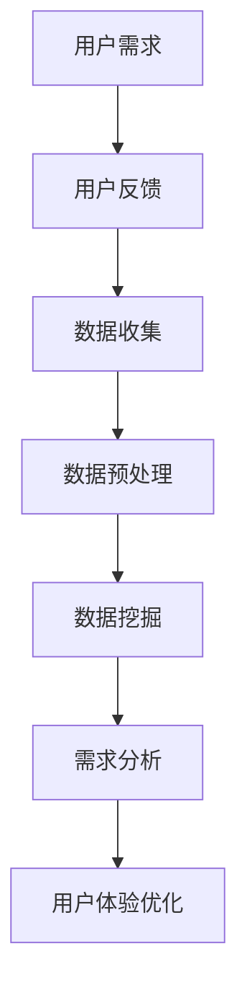

                 

# 如何进行有效的用户需求挖掘

> 关键词：用户需求挖掘, 用户体验优化, 数据收集, 用户反馈分析, 设计思维, 人工智能辅助, 需求分析工具, 数据可视化

## 1. 背景介绍

### 1.1 问题由来

在现代软件开发中，理解并满足用户需求始终是最重要的环节。需求挖掘不仅是获取用户需求的第一步，也是后续设计、开发、测试、部署和维护各个阶段的基础。因此，如何高效、准确地挖掘用户需求，成为每个软件开发者面临的关键挑战。

随着信息技术的发展，用户需求呈现出了多样化和复杂化的趋势，传统的用户需求挖掘方法已难以满足快速变化的市场需求。面对海量用户数据，如何从中提取有价值的信息，利用先进的算法和工具，提高需求挖掘的效率和准确性，成为当今软件工程领域急需解决的问题。

### 1.2 问题核心关键点

用户需求挖掘的核心在于如何高效、准确地从用户反馈中提取关键信息，并将其转化为可执行的产品需求。其中，常见的问题包括：

- **数据收集困难**：用户反馈和行为数据往往分散在不同渠道（如社交媒体、问卷调查、应用评价等），且数据格式和结构不一，收集难度大。
- **数据质量参差不齐**：用户数据中可能存在噪声、冗余和异常值，数据清洗和预处理复杂。
- **用户需求多样性**：用户需求具有高度的多样性和异构性，单一的需求挖掘模型难以满足不同场景下的需求。
- **需求理解的偏差**：需求挖掘过程中可能存在对用户意图的误解，导致需求误解或遗漏。
- **动态需求的应对**：用户需求随时间变化，如何动态跟踪并适应新需求，成为一项长期任务。

为了解决上述问题，本文将深入探讨用户需求挖掘的原理、技术手段和最佳实践，希望为软件开发团队提供一套高效、可靠的用户需求挖掘方法。

## 2. 核心概念与联系

### 2.1 核心概念概述

为了更好地理解用户需求挖掘，本文将介绍几个密切相关的核心概念：

- **用户需求**：指用户在使用产品时希望获得的功能、服务或体验，包括功能性需求和非功能性需求。
- **用户反馈**：用户在使用产品过程中，通过各种方式（如评论、问卷、使用日志等）提供的信息和意见。
- **数据挖掘**：从大量数据中提取有用信息和知识的过程，常用于商业智能、市场分析等领域。
- **人工智能**：利用机器学习和深度学习技术，自动化处理和分析数据，辅助决策。
- **需求分析**：从用户需求中提炼出功能规格和设计要求，指导产品设计和开发。
- **用户体验优化**：通过持续改进产品设计，提高用户满意度和使用体验。

这些核心概念之间的逻辑关系可以通过以下Mermaid流程图来展示：



这个流程图展示了一个完整的用户需求挖掘流程：

1. 通过用户反馈了解用户需求。
2. 从用户反馈中收集数据，并进行清洗和预处理。
3. 利用数据挖掘技术从数据中提取关键信息。
4. 对提取的信息进行分析，提炼出可执行的产品需求。
5. 通过用户体验优化，改进产品设计和功能，提升用户满意度。

## 3. 核心算法原理 & 具体操作步骤

### 3.1 算法原理概述

用户需求挖掘的核心算法包括自然语言处理（NLP）、数据挖掘和机器学习（ML）等。这些算法通过自动化处理和分析用户反馈数据，提取有价值的信息和知识，并提炼出用户需求。

具体而言，用户需求挖掘分为以下几个步骤：

1. **数据收集**：从各种渠道（如社交媒体、问卷调查、应用评价等）收集用户反馈数据。
2. **数据预处理**：对收集到的数据进行清洗、去重、匿名化等处理，确保数据质量和一致性。
3. **数据挖掘**：利用NLP技术（如情感分析、实体识别、主题建模等）从文本中提取关键信息。
4. **需求分析**：对提取的信息进行分类和关联，提炼出功能规格和设计要求。
5. **用户体验优化**：通过用户测试和反馈，不断改进产品设计，提升用户体验。

### 3.2 算法步骤详解

以下将详细介绍用户需求挖掘的具体步骤：

#### 3.2.1 数据收集

用户反馈数据的收集是需求挖掘的基础。常见的数据收集方式包括：

- **问卷调查**：通过设计有针对性的问卷，直接获取用户需求和意见。
- **应用评价**：收集用户在应用商店中的评价和评论，分析其反馈内容。
- **社交媒体**：利用爬虫技术从社交媒体平台（如微博、微信、Twitter等）抓取用户评论和帖子。
- **使用日志**：从应用程序或网站的使用日志中提取用户行为数据。
- **用户访谈**：与目标用户进行面对面或电话访谈，深入了解其需求和痛点。

在数据收集过程中，需要注意以下几点：

- **数据源的多样性**：从多个渠道收集数据，确保数据覆盖全面。
- **数据量的充足性**：收集足够的数据量，以提高分析的准确性和代表性。
- **数据来源的可靠**：选择可靠的数据源，避免虚假或无关信息。

#### 3.2.2 数据预处理

数据预处理是数据挖掘的第一步，主要目的是清洗和格式化数据，以便后续分析和处理。常用的数据预处理技术包括：

- **文本清洗**：去除文本中的噪声、特殊符号和停用词，进行分词和词性标注。
- **去重和匿名化**：删除重复数据，保护用户隐私。
- **数据格式化**：将不同格式的数据转换为标准格式，便于后续处理。
- **特征提取**：从文本中提取关键词、情感极性等特征，用于后续分析。

在数据预处理过程中，需要特别注意以下几点：

- **数据清洗的彻底性**：确保数据质量和一致性，去除噪声和冗余。
- **数据格式的标准化**：统一数据格式，便于分析和处理。
- **数据隐私的保护**：保护用户隐私，避免泄露敏感信息。

#### 3.2.3 数据挖掘

数据挖掘是用户需求挖掘的核心步骤，通过自动化处理和分析数据，提取有用信息和知识。常用的数据挖掘技术包括：

- **情感分析**：通过文本分析技术，判断用户情感倾向（如正面、负面、中性）。
- **实体识别**：从文本中识别出关键实体（如人名、地名、产品名等），并进行分类。
- **主题建模**：利用算法从文本中自动发现主题和话题，提取用户关注的重点。
- **聚类分析**：将用户反馈分为不同类别，发现用户的需求和兴趣。
- **关联规则挖掘**：发现不同需求之间的关系和模式，用于需求关联和分析。

在数据挖掘过程中，需要特别注意以下几点：

- **算法的适用性**：选择适合特定数据集的算法和技术，避免过度拟合或欠拟合。
- **特征的选择**：选择有意义的特征进行分析和处理，避免噪音干扰。
- **结果的解释性**：确保分析结果易于理解和解释，便于需求分析和产品设计。

#### 3.2.4 需求分析

需求分析是将数据挖掘结果转化为可执行的产品需求的重要步骤。常用的需求分析技术包括：

- **功能需求提取**：从用户反馈中提炼出具体的业务需求，转化为功能规格。
- **用户体验改进**：分析用户反馈中的用户体验问题，提出改进建议。
- **优先级排序**：根据需求的重要性和紧急程度，进行优先级排序。
- **用例建模**：构建用例模型，描述用户的使用场景和需求细节。

在需求分析过程中，需要特别注意以下几点：

- **需求的准确性**：确保需求的准确性和可行性，避免误解和遗漏。
- **需求的细化**：对需求进行细化和分解，便于设计和实现。
- **需求的可视化**：使用图表、用例图等工具，直观展示需求细节。

#### 3.2.5 用户体验优化

用户体验优化是需求挖掘的最终目标，通过持续改进产品设计，提高用户满意度和使用体验。常用的用户体验优化技术包括：

- **A/B测试**：通过对比不同版本的产品，优化用户界面和功能。
- **用户测试**：通过用户测试和反馈，验证产品设计的有效性。
- **数据分析**：利用数据分析技术，评估产品性能和用户满意度。
- **迭代改进**：根据用户反馈和数据分析结果，持续改进产品设计和功能。

在用户体验优化过程中，需要特别注意以下几点：

- **迭代速度**：快速迭代，及时响应用户反馈，提高产品更新速度。
- **用户反馈的重视**：重视用户反馈，及时调整和改进产品设计。
- **数据分析的全面性**：全面分析用户数据，了解用户行为和需求变化。

## 4. 数学模型和公式 & 详细讲解 & 举例说明

### 4.1 数学模型构建

用户需求挖掘涉及多个学科领域的知识，包括自然语言处理、数据挖掘和机器学习等。为了更好地理解需求挖掘的数学模型，本文将构建一个简单的数学模型，以情感分析为例。

假设我们有一组用户评论数据 $\{(x_i, y_i)\}_{i=1}^N$，其中 $x_i$ 表示第 $i$ 条评论文本，$y_i \in \{1, -1\}$ 表示评论的情感极性（1 表示正面，-1 表示负面）。我们的目标是通过训练一个模型，预测新评论的情感极性。

### 4.2 公式推导过程

假设我们采用朴素贝叶斯分类器进行情感分析，其公式为：

$$
P(y_i|x_i) = \frac{P(y_i)P(x_i|y_i)}{P(x_i)}
$$

其中 $P(y_i|x_i)$ 表示在评论 $x_i$ 下，情感极性 $y_i$ 的条件概率；$P(y_i)$ 表示情感极性的先验概率；$P(x_i|y_i)$ 表示在情感极性 $y_i$ 下，评论 $x_i$ 的条件概率；$P(x_i)$ 表示评论 $x_i$ 的先验概率。

对于朴素贝叶斯分类器，假设评论文本 $x_i$ 的特征向量为 $\vec{x}_i = (x_{i,1}, x_{i,2}, \ldots, x_{i,d})$，其中 $x_{i,j}$ 表示评论文本的第 $j$ 个特征（如词频、TF-IDF 值等）。则条件概率 $P(x_i|y_i)$ 可以表示为：

$$
P(x_i|y_i) = \prod_{j=1}^d P(x_{i,j}|y_i)
$$

其中 $P(x_{i,j}|y_i)$ 表示在情感极性 $y_i$ 下，特征 $x_{i,j}$ 的条件概率。

将上述公式代入朴素贝叶斯分类器的公式中，得到：

$$
P(y_i|x_i) = \frac{P(y_i)P(x_i|y_i)}{\sum_{k=1}^2 P(y_k)P(x_i|y_k)}
$$

其中 $P(y_k)$ 表示情感极性 $y_k$ 的先验概率，$k=1,2$ 分别表示正面和负面情感。

### 4.3 案例分析与讲解

假设我们有一组电影评论数据集，包含 1000 条电影评论和对应的情感极性标签。我们希望构建一个情感分析模型，预测新评论的情感极性。

首先，我们对评论数据进行预处理，包括文本清洗、分词、去除停用词等步骤。然后，我们提取每个评论的特征向量，包括词频、TF-IDF 值等。最后，我们使用上述公式和朴素贝叶斯分类器，训练模型并评估性能。

训练过程中，我们采用交叉验证的方法，将数据集划分为训练集和验证集，不断调整模型参数，直到在验证集上达到最优性能。最终，我们使用测试集评估模型的性能，计算准确率、召回率和 F1 值等指标。

通过上述案例分析，我们可以看到，用户需求挖掘不仅需要专业的算法和技术，还需要对数据进行全面的预处理和分析。只有从数据源、数据处理、模型训练、需求分析和用户体验优化等多个环节协同发力，才能最终实现高效、准确的需求挖掘。

## 5. 项目实践：代码实例和详细解释说明

### 5.1 开发环境搭建

在进行用户需求挖掘实践前，我们需要准备好开发环境。以下是使用Python进行数据挖掘的开发环境配置流程：

1. 安装Anaconda：从官网下载并安装Anaconda，用于创建独立的Python环境。

2. 创建并激活虚拟环境：
```bash
conda create -n pytdf-env python=3.8 
conda activate pytdf-env
```

3. 安装必要的Python库：
```bash
pip install pandas numpy scikit-learn nltk textblob
```

4. 安装数据挖掘工具包：
```bash
pip install gensim
```

完成上述步骤后，即可在`pytdf-env`环境中开始需求挖掘实践。

### 5.2 源代码详细实现

下面我们以情感分析为例，给出使用Python进行用户需求挖掘的代码实现。

首先，定义数据预处理函数：

```python
import pandas as pd
import numpy as np
from nltk.corpus import stopwords
from nltk.tokenize import word_tokenize
from sklearn.feature_extraction.text import CountVectorizer

def preprocess_text(text):
    # 文本清洗
    text = text.lower()
    text = re.sub(r'[^\w\s]', '', text)
    # 去除停用词
    stop_words = set(stopwords.words('english'))
    words = word_tokenize(text)
    words = [word for word in words if word not in stop_words]
    # 词频统计
    vectorizer = CountVectorizer()
    X = vectorizer.fit_transform([' '.join(words)])
    X = X.toarray()
    return X
```

然后，定义数据挖掘函数：

```python
from sklearn.naive_bayes import MultinomialNB
from sklearn.metrics import accuracy_score

def train_model(X, y):
    # 训练朴素贝叶斯模型
    model = MultinomialNB()
    model.fit(X, y)
    return model

def predict_sentiment(model, X):
    # 使用训练好的模型预测新评论的情感极性
    y_pred = model.predict(X)
    return y_pred
```

最后，启动训练流程并在测试集上评估：

```python
# 加载数据集
data = pd.read_csv('movie_reviews.csv', sep='\t')

# 数据预处理
X = data['review'].apply(preprocess_text)
y = data['label']

# 划分训练集和测试集
train_X, test_X = X[:800], X[800:]
train_y, test_y = y[:800], y[800:]

# 训练模型
model = train_model(train_X, train_y)

# 在测试集上评估模型性能
y_pred = predict_sentiment(model, test_X)
accuracy = accuracy_score(test_y, y_pred)
print(f'Accuracy: {accuracy:.2f}')
```

以上就是使用Python进行情感分析的代码实现。可以看到，通过简单的数据预处理和模型训练，我们可以快速构建一个情感分析模型，并评估其在测试集上的性能。

### 5.3 代码解读与分析

让我们再详细解读一下关键代码的实现细节：

**preprocess_text函数**：
- 对输入的文本进行清洗，包括转换为小写、去除标点符号和停用词，并统计词频。

**train_model函数**：
- 定义朴素贝叶斯分类器，使用训练数据进行模型训练，并返回训练好的模型。

**predict_sentiment函数**：
- 使用训练好的模型对新的评论文本进行情感分类预测，并返回预测结果。

**训练流程**：
- 加载数据集，进行数据预处理。
- 将数据集划分为训练集和测试集。
- 训练朴素贝叶斯分类器模型。
- 在测试集上评估模型性能，并输出准确率。

可以看出，需求挖掘的代码实现并不复杂，但背后蕴含着深厚的数学和算法原理。通过理解这些核心概念和算法，开发者可以更深入地挖掘用户需求，为产品的设计和优化提供有力支持。

## 6. 实际应用场景

### 6.1 智能客服系统

智能客服系统是一种典型的用户需求挖掘应用场景。传统的客服系统依赖人工客服，耗费大量人力和时间，难以满足用户的即时需求。通过用户需求挖掘，智能客服系统可以自动分析用户输入，提供个性化的服务和建议，大幅提升用户体验。

具体而言，智能客服系统通过收集用户的历史对话记录、评价反馈和实时聊天数据，使用自然语言处理技术进行情感分析和实体识别，提炼出用户的具体需求和痛点。系统根据用户反馈不断优化对话流程，提供个性化的回复和建议，从而提升用户的满意度和留存率。

### 6.2 在线教育平台

在线教育平台也广泛应用了用户需求挖掘技术。通过收集用户的学习数据、反馈和评价，系统可以分析用户的个性化需求，提供定制化的学习建议和课程推荐。

具体而言，系统使用数据分析技术对用户的学习行为和反馈进行聚类分析，发现不同用户的学习偏好和需求。系统根据用户偏好推荐个性化的课程和教材，并提供学习路径规划和学习资源推荐，提升学习效果和用户体验。

### 6.3 电子商务平台

电子商务平台通过用户需求挖掘，可以提升用户的购物体验和满意度。通过收集用户的浏览记录、购买行为和评价反馈，系统可以分析用户需求和偏好，提供个性化的商品推荐和促销活动。

具体而言，系统使用协同过滤和聚类分析技术对用户行为进行建模，发现用户之间的相似性。系统根据用户偏好推荐个性化的商品，并提供优惠券和促销活动，提升用户的购买转化率和满意度。

### 6.4 未来应用展望

随着数据挖掘技术的不断进步，用户需求挖掘将在更多领域得到应用，为各行各业带来新的机遇和挑战。未来，用户需求挖掘技术将与人工智能、大数据等技术深度融合，带来更高效、更智能的解决方案。

在智慧医疗领域，用户需求挖掘将帮助医生更准确地理解患者的需求，提供个性化的诊疗方案。在智慧城市治理中，用户需求挖掘将帮助城市管理者更精准地了解市民的需求，提升公共服务的质量和效率。在企业人力资源管理中，用户需求挖掘将帮助企业更有效地吸引和保留人才，提升员工满意度和忠诚度。

总之，用户需求挖掘技术将在未来的各行各业中发挥越来越重要的作用，为用户的个性化需求提供更全面、更精准的支持。

## 7. 工具和资源推荐

### 7.1 学习资源推荐

为了帮助开发者系统掌握用户需求挖掘的理论基础和实践技巧，这里推荐一些优质的学习资源：

1. **《用户需求挖掘与分析》系列课程**：由知名大学和研究机构提供的在线课程，涵盖用户需求挖掘的基本概念、方法和应用案例。

2. **《自然语言处理》书籍**：介绍自然语言处理的基本原理和算法，重点讲解情感分析、实体识别和主题建模等关键技术。

3. **《数据挖掘与统计学习》书籍**：全面介绍数据挖掘的基本方法、算法和工具，涵盖聚类分析、关联规则挖掘等技术。

4. **Kaggle平台**：提供大量公开的数据集和竞赛项目，开发者可以在实际应用中学习和提升数据挖掘技能。

5. **Coursera平台**：提供丰富的在线课程，涵盖机器学习、数据挖掘、自然语言处理等多个领域。

通过对这些学习资源的系统学习，相信你一定能够快速掌握用户需求挖掘的精髓，并用于解决实际的用户需求问题。

### 7.2 开发工具推荐

高效的开发离不开优秀的工具支持。以下是几款用于用户需求挖掘开发的常用工具：

1. **Python**：作为数据科学和机器学习的主流编程语言，Python提供了丰富的第三方库和工具，方便开发者进行数据分析和处理。

2. **Jupyter Notebook**：一个交互式编程环境，支持多种编程语言，适合进行数据挖掘和分析。

3. **Tableau**：一款流行的数据可视化工具，支持数据的探索性分析和可视化展示，帮助开发者更好地理解数据。

4. **RapidMiner**：一款数据挖掘工具，提供直观的操作界面和丰富的分析功能，适合初学者和专业人士使用。

5. **Weka**：一个开源的数据挖掘工具，支持多种算法和模型，适合学术研究和工业应用。

合理利用这些工具，可以显著提升用户需求挖掘任务的开发效率，加快创新迭代的步伐。

### 7.3 相关论文推荐

用户需求挖掘领域的研究历史悠久，涉及多个学科领域，以下几篇论文代表了大方向的研究成果，推荐阅读：

1. **《User-Centric Web Information Retrieval》**：介绍用户需求挖掘的基本概念和算法，重点讲解文本挖掘和推荐系统等技术。

2. **《Neural Collaborative Filtering》**：提出基于深度学习的网络协同过滤算法，提升个性化推荐的效果。

3. **《Text Mining and Statistical Learning》**：介绍文本挖掘和统计学习的原理和应用，涵盖情感分析、实体识别和主题建模等技术。

4. **《User-Centric Information Access and Retrieval》**：介绍用户需求挖掘在信息检索和推荐系统中的应用，涵盖用户建模和个性化推荐等技术。

5. **《Machine Learning Techniques for Recommendation Systems》**：介绍机器学习在推荐系统中的应用，涵盖协同过滤、基于内容的推荐和混合推荐等技术。

这些论文代表了大方向的研究成果，通过学习这些前沿成果，可以帮助研究者把握学科前进方向，激发更多的创新灵感。

## 8. 总结：未来发展趋势与挑战

### 8.1 总结

本文对用户需求挖掘的原理、技术手段和最佳实践进行了全面系统的介绍。首先阐述了用户需求挖掘的重要性，明确了需求挖掘在软件开发和用户体验优化中的关键作用。其次，从原理到实践，详细讲解了数据收集、数据预处理、数据挖掘、需求分析和用户体验优化等核心步骤，给出了用户需求挖掘的完整代码实例。同时，本文还探讨了用户需求挖掘在多个实际应用场景中的应用前景，展示了需求挖掘技术的广泛适用性。此外，本文精选了用户需求挖掘的相关学习资源、开发工具和研究论文，力求为开发者提供全方位的技术指引。

通过本文的系统梳理，可以看到，用户需求挖掘技术正在成为软件开发和用户体验优化不可或缺的重要工具，极大地拓展了软件开发团队的技术能力。未来，伴随技术的不懈探索和应用实践，用户需求挖掘技术必将更加成熟和高效，为软件开发和用户体验优化带来更多创新和突破。

### 8.2 未来发展趋势

展望未来，用户需求挖掘技术将呈现以下几个发展趋势：

1. **自动化与智能化**：自动化和智能化技术将进一步提升需求挖掘的效率和准确性，利用机器学习和深度学习技术，自动化处理和分析用户数据。

2. **多模态数据融合**：未来的需求挖掘将更多地结合图像、视频、语音等多模态数据，从多个维度获取用户需求和反馈，提升分析的全面性和准确性。

3. **跨领域应用**：需求挖掘技术将跨领域应用到更多行业，如智慧医疗、智慧城市、企业人力资源管理等领域，带来新的机遇和挑战。

4. **大数据与云计算**：大数据和云计算技术将为需求挖掘提供更强大、更高效的数据处理和分析能力，提升需求挖掘的规模和深度。

5. **自然语言理解**：自然语言理解技术将进一步提升需求挖掘的智能化水平，通过语义分析和情感分析，更准确地理解用户需求和情感倾向。

6. **用户隐私保护**：用户隐私保护将受到更多关注，需求挖掘过程中将更加注重数据安全和隐私保护，避免敏感信息泄露。

以上趋势凸显了用户需求挖掘技术的广阔前景。这些方向的探索发展，必将进一步提升需求挖掘的效率和准确性，为软件开发和用户体验优化提供更全面、更精准的支持。

### 8.3 面临的挑战

尽管用户需求挖掘技术已经取得了一定的进展，但在迈向更加智能化、普适化应用的过程中，仍面临诸多挑战：

1. **数据质量与多样性**：用户数据质量参差不齐，多样性高，数据清洗和预处理复杂。如何获取高质量、多样性的用户数据，是需求挖掘的重要挑战。

2. **算法复杂性**：需求挖掘涉及多个学科领域的知识，算法复杂度高，难以在实际应用中快速部署和优化。如何简化算法模型，提高实时性，是需求挖掘的另一大挑战。

3. **需求理解的偏差**：需求挖掘过程中可能存在对用户意图的误解，导致需求误解或遗漏。如何提高需求理解的准确性，是需求挖掘亟需解决的问题。

4. **隐私与安全**：用户隐私和安全问题日益受到关注，需求挖掘过程中需更加注重数据安全和隐私保护，避免敏感信息泄露。

5. **跨领域应用**：需求挖掘技术在跨领域应用时，需要考虑不同领域的需求特性和数据特点，难以一概而论。如何提升需求挖掘的跨领域适应性，是需求挖掘的重要挑战。

6. **用户体验优化**：需求挖掘的最终目标是通过优化产品设计，提升用户体验。如何在需求挖掘和用户体验优化之间建立有效的反馈机制，是需求挖掘的重要挑战。

### 8.4 研究展望

面对用户需求挖掘所面临的挑战，未来的研究需要在以下几个方面寻求新的突破：

1. **自动化与智能化技术**：利用机器学习和深度学习技术，自动化处理和分析用户数据，提升需求挖掘的效率和准确性。

2. **多模态数据融合技术**：结合图像、视频、语音等多模态数据，从多个维度获取用户需求和反馈，提升分析的全面性和准确性。

3. **跨领域需求挖掘技术**：根据不同领域的需求特性和数据特点，开发专用的需求挖掘技术，提升需求挖掘的跨领域适应性。

4. **数据隐私保护技术**：在需求挖掘过程中，更加注重数据安全和隐私保护，避免敏感信息泄露。

5. **用户隐私保护技术**：利用差分隐私等技术，保护用户隐私，确保数据安全。

6. **用户体验优化技术**：通过建立有效的反馈机制，将需求挖掘结果转化为可执行的产品需求，提升用户体验。

这些研究方向将引领用户需求挖掘技术迈向更高的台阶，为软件开发和用户体验优化提供更全面、更精准的支持。面向未来，需求挖掘技术还需要与其他人工智能技术进行更深入的融合，如知识表示、因果推理、强化学习等，多路径协同发力，共同推动自然语言理解和智能交互系统的进步。

## 9. 附录：常见问题与解答

**Q1：用户需求挖掘是否适用于所有行业？**

A: 用户需求挖掘技术在各行各业都有广泛的应用前景。不同行业的需求挖掘方法和工具可能有所不同，但总体而言，用户需求挖掘可以显著提升用户满意度和业务效率。

**Q2：如何确保用户数据的隐私和安全？**

A: 用户数据的隐私和安全是需求挖掘过程中必须重视的问题。常见的隐私保护措施包括数据匿名化、差分隐私、数据加密等技术。需要根据具体需求和数据特点，选择适合的隐私保护方案。

**Q3：如何处理用户数据的多样性？**

A: 用户数据的多样性是需求挖掘的重要挑战。可以通过数据清洗、数据标注、数据分类等手段，提升数据质量和一致性。同时，利用多模态数据融合技术，从多个维度获取用户需求和反馈，提升分析的全面性和准确性。

**Q4：如何提升需求挖掘的实时性？**

A: 需求挖掘的实时性需要通过算法优化和模型压缩等手段进行提升。可以选择轻量级算法和模型，使用分布式计算和流式处理技术，优化数据处理和分析效率。

**Q5：如何提高需求理解的准确性？**

A: 提高需求理解的准确性需要多方面的努力，包括改进数据预处理技术、优化模型选择和训练方法、增加领域专家的参与等。同时，通过不断的用户测试和反馈，逐步优化需求挖掘模型，提高需求理解的准确性。

---

作者：禅与计算机程序设计艺术 / Zen and the Art of Computer Programming

