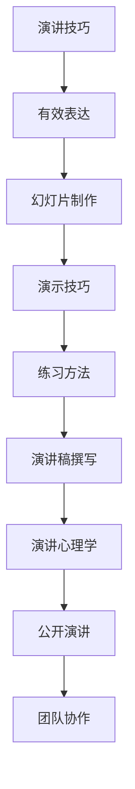

                 

# 如何进行演讲技巧：如何进行有效的演讲和表达？

> 关键词：演讲技巧,有效表达,幻灯片制作,演示技巧,练习方法,演讲稿撰写,演讲心理学,公开演讲,团队协作

## 1. 背景介绍

### 1.1 问题由来
在信息化高速发展的今天，演讲与表达能力成为了个人在职场、学术界、甚至日常生活中不可或缺的核心竞争力。然而，许多人却因为紧张、缺乏经验或缺乏系统训练，在公众场合下显得语无伦次、表达不清。这不仅影响了个人形象，更限制了沟通效率和人际关系的建立。

### 1.2 问题核心关键点
提高演讲和表达能力的关键在于系统的学习和持续的练习。演讲不仅仅是对内容的传达，更是通过非语言因素（如肢体语言、语音语调、情感表现）的综合展现。系统化的学习可以让我们全面了解演讲的各个环节，掌握技巧，从而提升我们的表达能力。

## 2. 核心概念与联系

### 2.1 核心概念概述

为更好地理解如何进行有效的演讲和表达，本节将介绍几个密切相关的核心概念：

- **演讲技巧(Speech Techniques)**：指在演讲过程中运用的各种方法和策略，以提高演讲效果。
- **有效表达(Efficient Expression)**：指在有限的时间内，以清晰、有说服力、有吸引力的方式传达信息的能力。
- **幻灯片制作(PowerPoint Skills)**：指在演讲中制作和呈现PPT的能力，包括排版、字体、颜色、图表等设计原则。
- **演示技巧(Presentation Skills)**：指在演示过程中如何吸引观众注意力、提升互动性的技巧。
- **练习方法(Practice Methods)**：指通过反复练习来提升演讲技能的方法，如角色扮演、录音回放、反馈调整等。
- **演讲稿撰写(Speech Writing)**：指为演讲做准备的过程，包括确定主题、结构安排、素材整理等。
- **演讲心理学(Psychology of Public Speaking)**：指如何在演讲中管理情绪、应对紧张、提升自信的心理学策略。
- **公开演讲(Public Speaking)**：指在非正式场合进行的演讲，可以是个人独白或团队展示。
- **团队协作(Collaborative Work)**：指在演讲或展示中如何通过团队合作提高整体表现。

这些核心概念之间的逻辑关系可以通过以下Mermaid流程图来展示：



这个流程图展示了一系列的演讲和表达相关概念及其关联性：

1. 通过掌握演讲技巧，可以提升有效表达的能力。
2. 幻灯片制作是有效表达的重要组成部分。
3. 演示技巧能够提升演讲的互动性和吸引力。
4. 练习方法是不断提升演讲技能的关键。
5. 演讲稿撰写是演讲内容的基础。
6. 演讲心理学帮助管理演讲中的紧张和自信。
7. 公开演讲是非正式场合演讲的表现形式。
8. 团队协作提升整体表现。

## 3. 核心算法原理 & 具体操作步骤
### 3.1 算法原理概述

进行有效演讲和表达的算法原理可以概括为以下几个步骤：

1. **确定主题(Define Your Topic)**：明确演讲的核心内容。
2. **构建框架(Build a Structure)**：为演讲构建逻辑清晰的框架。
3. **搜集素材(Collect Materials)**：准备相关的事实、数据、案例等支持内容。
4. **撰写稿件(Write the Script)**：撰写清晰、简练的演讲稿件。
5. **制作幻灯片(PowerPoint Design)**：设计布局、选择字体、添加图表等。
6. **练习演讲(Practice)**：反复练习，注意肢体语言、语调、节奏等细节。
7. **准备应对(Prepare for Questions)**：准备可能被问到的问题和回答。
8. **实际演示(Present)**：正式进行演示，利用演示技巧吸引观众。

### 3.2 算法步骤详解

以下详细讲解进行有效演讲和表达的具体操作步骤：

**Step 1: 确定主题**
- **明确目标**：理解演讲的目的和听众的需求。
- **选择角度**：找到一个新颖、有深度的角度，使内容更具吸引力。

**Step 2: 构建框架**
- **引言(Introduction)**：简要介绍主题和演讲结构，吸引听众注意力。
- **主体(Body)**：分段落详细阐述内容，确保逻辑连贯。
- **结论(Conclusion)**：总结要点，强化记忆，留下深刻印象。

**Step 3: 搜集素材**
- **数据和事实**：收集相关数据和事实，增强说服力。
- **案例和故事**：准备案例和故事，使内容更具生动性。
- **引用和文献**：适当引用权威文献，提升演讲的权威性。

**Step 4: 撰写稿件**
- **简洁明了**：避免冗长，使用简单明了的语言。
- **结构清晰**：按照逻辑结构组织内容，使用标题和列表。
- **重点突出**：通过加粗、斜体等方式强调关键信息。

**Step 5: 制作幻灯片**
- **简洁设计**：保持简洁，避免过于花哨的特效。
- **视觉一致**：使用统一的主题、字体和颜色。
- **图表使用**：适当使用图表、图片，增强视觉冲击力。

**Step 6: 练习演讲**
- **录音回放**：录制演讲，回放并分析问题。
- **反馈调整**：向同事或导师寻求反馈，根据意见调整演讲内容。
- **模拟演练**：在小型场合模拟演讲，测试效果。

**Step 7: 准备应对**
- **常见问题**：列出可能被问到的问题，并准备回答。
- **自信表达**：练习自信地表达，减少紧张感。

**Step 8: 实际演示**
- **开场白**：引入话题，简短介绍演讲内容。
- **互动交流**：与听众互动，解答疑问，增强参与感。
- **结尾总结**：简要总结要点，重申演讲目的。

### 3.3 算法优缺点

进行有效演讲和表达的算法具有以下优点：

1. **系统全面**：涵盖从主题选择到演示结束的各个环节，形成完整的演讲流程。
2. **实践性强**：每个步骤都有具体的实施方法，易于操作。
3. **效果显著**：通过系统的练习和反馈，演讲技能可以显著提升。

同时，也存在一些局限性：

1. **个体差异**：不同的人在演讲风格、表达习惯上有所不同，通用方法可能不适用于所有人。
2. **实践难度**：演讲技能的提升需要持续的练习和反馈，对时间和精力要求较高。
3. **情感管理**：演讲中的情绪管理和自信心建立是一个长期过程，需要不断努力。

### 3.4 算法应用领域

进行有效演讲和表达的算法适用于多种场合，包括但不限于：

- **教育培训**：在教学中应用，提高学生的表达能力和思维逻辑。
- **商务交流**：在商业会议、谈判中展示公司的专业形象和创新能力。
- **学术研讨**：在科研会议、报告中分享研究成果，提升学术影响力。
- **公共演讲**：在公开场合分享观点，提升公众认知。
- **非正式交流**：在社交、社交媒体上分享信息，展示个人魅力。

## 4. 数学模型和公式 & 详细讲解 & 举例说明

在进行有效演讲和表达时，并不直接涉及数学模型和公式。然而，我们可以将一些重要的演讲技巧用数学语言进行概括，以帮助理解。

### 4.1 数学模型构建

由于进行有效演讲和表达主要依赖于语言和心理学策略，我们可以从心理学的角度进行数学建模。

定义演讲中表达的清晰度为 $C$，信息传递的准确性为 $A$，观众的参与度为 $P$，演讲者的自信度为 $S$。则有效表达的总体得分 $E$ 可以表示为：

$$ E = \alpha C + \beta A + \gamma P + \delta S $$

其中，$\alpha$、$\beta$、$\gamma$、$\delta$ 为不同因素的权重，取决于具体场合和演讲目标。

### 4.2 公式推导过程

为了最大化 $E$，我们需要优化每个子项。例如，为了提高 $C$，可以采用简洁的语言和清晰的结构；为了提高 $A$，可以确保数据的准确性和论点的逻辑性；为了提高 $P$，可以通过互动和引导性的提问增加观众的参与感；为了提高 $S$，可以通过积极的自我暗示和充分的准备来增强自信心。

### 4.3 案例分析与讲解

以下是一个实际案例：

**案例背景**：在一次科技公司的新产品发布会上，演讲者需要向投资者和客户展示一项创新技术的潜力。

**解决步骤**：

1. **确定主题**：展示新技术的应用场景和市场前景。
2. **构建框架**：分为技术介绍、应用案例、市场潜力、未来展望四个部分。
3. **搜集素材**：收集最新数据、实际应用案例、市场调研报告等。
4. **撰写稿件**：使用简洁的语言，突出技术优势和市场潜力。
5. **制作幻灯片**：设计美观、清晰、易于理解的页面，包含图表和图片。
6. **练习演讲**：反复练习，在模拟场合中测试效果。
7. **准备应对**：准备投资者可能提出的问题，准备详细的数据支持。
8. **实际演示**：开场简要介绍技术背景，通过案例展示技术优势，结束时总结未来展望。

## 5. 项目实践：代码实例和详细解释说明
### 5.1 开发环境搭建

在进行演讲技巧的学习和实践时，需要一个良好的开发环境。以下是使用Python进行演示的开发环境配置流程：

1. **安装Anaconda**：从官网下载并安装Anaconda，用于创建独立的Python环境。
2. **创建并激活虚拟环境**：
```bash
conda create -n pyenv python=3.8
conda activate pyenv
```
3. **安装PyTorch**：使用conda或pip安装PyTorch库。
4. **安装相关库**：安装必要的Python库，如numpy、pandas、matplotlib等。

完成上述步骤后，即可在`pyenv`环境中开始演讲技巧的实践。

### 5.2 源代码详细实现

以下是一个简单的Python代码示例，用于练习演讲稿的撰写和朗读。

```python
import random

def generate_speech(title, topic):
    speech = f"Good evening, everyone. Today I want to talk about {title}. \n\n{topic} is a revolutionary technology that has the potential to change our lives. \n\nFirst, let's look at the basic principles behind {topic}. \n\nNext, I'll show you some real-world applications of {topic}. \n\nFinally, let's discuss the future trends and opportunities in {topic}.\n\nThank you."
    return speech

def read_speech(speech):
    words = speech.split()
    for word in words:
        print(word + " ", end="")
        time.sleep(random.uniform(0.5, 1.5))
    print(".")

title = "The Future of Artificial Intelligence"
topic = "How AI Will Transform Society"

speech = generate_speech(title, topic)
read_speech(speech)
```

**代码解读与分析**：

- **generate_speech函数**：根据给定的标题和主题，生成一段简短的演讲稿。
- **read_speech函数**：逐个朗读演讲稿中的单词，模拟演讲的语调和节奏。
- **sleep函数**：随机休眠一段时间，模拟说话时的自然停顿。

### 5.3 运行结果展示

运行上述代码，可以得到一个模拟的演讲输出。由于使用了随机休眠时间，每次输出的节奏和语调都可能略有不同，展现了演讲的灵活性和表现力。

## 6. 实际应用场景
### 6.1 教育培训

教育培训中，教师可以通过演讲和表达技巧的培训，提升学生的公共演讲能力。例如，在课堂演讲活动中，学生可以学习如何构建演讲结构、搜集素材、撰写稿件等技巧。

### 6.2 商务交流

在商务交流中，良好的演讲和表达能力可以帮助企业在客户面前展示专业形象，提升品牌影响力。例如，销售人员可以通过精心准备的演讲，展示产品的特点和优势，增强客户的购买意愿。

### 6.3 学术研讨

在学术研讨中，研究人员可以通过演讲分享研究成果，提升学术影响力。例如，在学术会议或报告中，利用丰富的数据和案例支持，展示研究的深度和广度。

### 6.4 公共演讲

在公共演讲中，演讲者可以通过演讲技巧，提升公众认知和影响力。例如，在社区活动中，分享社会热点问题，提升公众意识和社会责任感。

### 6.5 非正式交流

在非正式交流中，良好的表达能力可以增强人际关系。例如，在社交场合中，通过简短而有力的演讲，分享个人见解，赢得他人的尊重和认可。

## 7. 工具和资源推荐
### 7.1 学习资源推荐

为了帮助演讲者全面掌握演讲技巧，以下是一些推荐的资源：

1. **《TED演讲艺术》**：TED演讲是全球公认的优秀演讲范例，可以从TED演讲中学习到如何有效地表达观点。
2. **《演讲的艺术》**：罗伯特·麦基的著作，系统介绍了演讲的各个环节，包括准备、结构、表达等。
3. **《公众演讲技巧》**：国际著名演讲教练的线上课程，涵盖从基础到高级的演讲技巧。
4. **Coursera和edX**：提供广泛的公开课程，涵盖演讲、写作、心理等多个方面。
5. **Toastmasters国际演讲俱乐部**：通过实际演讲练习，提升演讲和表达能力。

### 7.2 开发工具推荐

在进行演讲技巧的开发和实践时，需要使用一些专业的工具：

1. **PowerPoint**：常用的演示文稿软件，提供了丰富的设计工具和模板，方便制作幻灯片。
2. **Prezi**：支持创建动态、交互式的演示文稿，适合需要展示复杂内容的场合。
3. **Canva**：在线设计工具，提供大量的模板和设计元素，方便制作吸引人的幻灯片。
4. **Zoom和Teams**：支持远程演讲和互动，方便在虚拟场合进行演示。
5. **Rehearsal Room**：模拟演讲和演示环境，提供反馈和改进建议。

### 7.3 相关论文推荐

以下是一些研究演讲和表达技巧的知名论文：

1. **"The Art of Public Speaking" by Dale Carnegie**：经典的公共演讲指南，提供系统的技巧和案例。
2. **"Effective Communication: A Guide for University Students" by Jacqueline K. Fuehr**：针对大学生的演讲和表达指导，系统而实用。
3. **"Presentation Zen: Simple Ideas on Presentation Design and Delivery" by Garr Reynolds**：专注于演示文稿设计的原则和技巧。
4. **"Speak with Confidence: The Ultimate Guide to Public Speaking Success" by Alan Emmerich**：提供全面的演讲技巧和心理学指导。

## 8. 总结：未来发展趋势与挑战
### 8.1 总结

本文对如何进行有效演讲和表达的方法进行了全面系统的介绍。首先阐述了演讲和表达能力的重要性，明确了演讲技巧、有效表达、幻灯片制作等核心概念及其关联性。其次，从算法原理到具体操作步骤，详细讲解了演讲和表达的过程，并给出了具体的代码实例和运行结果。最后，探讨了演讲和表达技术在多个领域的应用，并推荐了相关学习资源、开发工具和论文，为读者提供了全方位的指导。

通过本文的系统梳理，可以看到，进行有效演讲和表达的方法是科学而系统的，通过系统的学习、反复的练习和不断的优化，演讲者可以显著提升自己的表达能力，进而提升个人和企业的竞争力。

### 8.2 未来发展趋势

展望未来，演讲和表达技术将呈现以下几个发展趋势：

1. **智能化提升**：借助人工智能技术，如语音识别、自然语言处理，提升演讲的智能化水平，实现更高效的信息传递。
2. **虚拟现实应用**：通过虚拟现实技术，提供沉浸式的演讲体验，增强观众的参与感和互动性。
3. **跨平台整合**：演讲和表达技术将与社交媒体、视频会议等多个平台整合，实现无缝衔接。
4. **全球化交流**：随着全球化的推进，跨语言、跨文化的演讲和表达能力将成为重要的软技能。
5. **个性化定制**：根据个人特点和场合需求，提供个性化的演讲和表达指导，提升演讲效果。

### 8.3 面临的挑战

尽管演讲和表达技术的发展取得了一定成就，但在迈向更加智能化、全球化、个性化应用的过程中，仍面临诸多挑战：

1. **技术和工具的普及**：并非所有演讲者都能方便地使用先进技术和工具。
2. **文化和语言差异**：跨语言、跨文化的演讲需要考虑文化和语言的差异，提高适应性。
3. **资源和时间成本**：高质量的演讲和表达培训需要投入大量的资源和时间。
4. **心理压力管理**：如何在演讲中保持自信和镇定，是许多演讲者面临的难题。
5. **持续学习和改进**：演讲和表达技巧需要不断学习和更新，才能跟上时代的发展。

### 8.4 研究展望

未来，演讲和表达技术的研究方向可以集中在以下几个方面：

1. **跨领域应用**：探索演讲和表达技术在教育、医疗、法律等领域的适用性。
2. **自动化辅助**：开发自动生成的演讲稿和演示材料，提升演讲和表达的效率。
3. **情感分析**：利用情感分析技术，分析观众的反应，优化演讲内容和表达方式。
4. **个性化推荐**：根据个人特点和场合需求，推荐适合的演讲和表达策略。
5. **虚拟现实模拟**：开发虚拟现实模拟环境，提供更真实的演讲练习体验。

通过这些研究方向，演讲和表达技术将不断演进，为人们提供更高效、更个性化的表达方式，提升演讲和表达的整体水平。

## 9. 附录：常见问题与解答

**Q1: 演讲时如何避免紧张？**

A: 紧张是演讲者的常见问题，可以通过以下方法缓解：
1. **充分准备**：熟悉演讲内容和结构，减少不确定性。
2. **练习多次**：在熟悉的环境下反复练习，增强自信。
3. **呼吸练习**：进行深呼吸练习，放松身体和心理。
4. **积极自我暗示**：通过积极的心理暗示，增强自信心。

**Q2: 如何制作吸引人的幻灯片？**

A: 制作吸引人的幻灯片需要注意以下几点：
1. **简洁明了**：使用简洁的语言和清晰的结构。
2. **视觉一致**：使用统一的主题、字体和颜色。
3. **图表使用**：适当使用图表和图片，增强视觉冲击力。
4. **动画效果**：适度使用动画效果，避免过于花哨。

**Q3: 如何在演讲中增强互动？**

A: 增强互动可以通过以下方法实现：
1. **提问**：在演讲中设置互动性问题，引导观众思考。
2. **小组讨论**：安排小组讨论环节，增强参与感。
3. **展示调查**：使用在线投票或调查工具，实时收集观众反馈。
4. **实时问答**：安排问答环节，及时解答观众疑问。

**Q4: 如何在演讲中保持专注？**

A: 保持专注可以通过以下方法实现：
1. **明确目标**：在演讲前明确演讲目标和重点。
2. **结构清晰**：使用清晰的逻辑结构，引导观众跟随思路。
3. **节奏控制**：适当控制演讲节奏，避免过于紧凑或松散。
4. **语言生动**：使用生动有趣的语言，吸引观众注意力。

**Q5: 如何评估演讲效果？**

A: 评估演讲效果可以从以下几个方面考虑：
1. **观众反馈**：通过观众的提问和反馈，评估演讲的接受度。
2. **数据分析**：分析观众的参与度和互动数据，评估演讲的效果。
3. **自我评估**：反思演讲过程中遇到的问题和不足，进行改进。
4. **持续改进**：根据反馈和数据分析，持续改进演讲内容和表达方式。

---

作者：禅与计算机程序设计艺术 / Zen and the Art of Computer Programming

