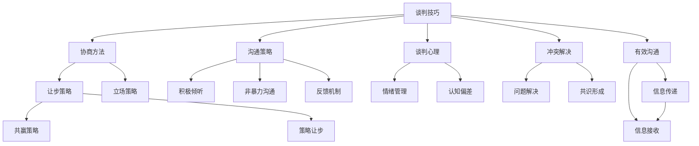

                 

# 如何进行谈判技巧：如何有效地进行谈判和沟通？

> 关键词：谈判技巧, 沟通策略, 协商方法, 冲突解决, 谈判心理, 有效沟通

## 1. 背景介绍

在现代商业和社会活动中，谈判和沟通技能已成为个人和团队成功的关键。无论是商业合同谈判、项目合作协商，还是家庭和个人冲突解决，谈判技巧都能帮助人们达成共识，解决问题。然而，良好的谈判和沟通技巧并不是天生具备的，而是需要通过系统学习和实践来掌握。本文将全面系统地介绍如何进行有效的谈判和沟通，包括核心概念、算法原理、操作步骤、实际应用场景等。

## 2. 核心概念与联系

### 2.1 核心概念概述

为了更好地理解如何进行有效的谈判和沟通，我们将重点介绍几个核心概念：

- **谈判技巧(Negotiation Skills)**：指在协商过程中，通过有效的沟通和策略，达成双方都能接受的协议的能力。
- **沟通策略(Communication Strategies)**：指在交流过程中，如何有效地传达信息、理解对方意图，并推动双方达成共识的策略。
- **协商方法(Negotiation Methods)**：指在谈判中采用的具体方法和手段，如让步策略、立场策略等。
- **冲突解决(Conflict Resolution)**：指在谈判过程中，如何识别、分析和解决双方的分歧和矛盾，以达成一致。
- **谈判心理(Negotiation Psychology)**：指在谈判过程中，如何控制和利用心理因素，如情绪、认知偏差等，以达到更好的结果。
- **有效沟通(Effective Communication)**：指在沟通过程中，如何清晰、准确地传达信息，并有效接收和理解对方的信息。

这些概念相互关联，共同构成了谈判和沟通的核心框架。理解这些概念的基本原理，将有助于掌握谈判技巧，提高沟通效果。

### 2.2 核心概念原理和架构的 Mermaid 流程图



这个流程图展示了谈判技巧与其他核心概念之间的联系和相互影响。谈判技巧是整个框架的核心，通过沟通策略、协商方法、冲突解决、谈判心理和有效沟通等手段，最终实现共赢的谈判结果。

## 3. 核心算法原理 & 具体操作步骤

### 3.1 算法原理概述

有效的谈判和沟通，其核心在于理解双方的需求和意图，并通过有效的沟通策略，达成双方都能接受的协议。以下将介绍基于这一原理的算法框架：

- **需求分析**：通过问卷调查、面谈等手段，理解双方的核心需求和利益。
- **信息共享**：透明地分享信息，减少误解和信息不对称。
- **沟通策略**：采用适当的沟通策略，如积极倾听、非暴力沟通等，确保信息的准确传递和接收。
- **协商方法**：选择适当的协商方法，如共赢策略、策略让步等，灵活应对谈判过程中的各种情况。
- **冲突解决**：识别并解决双方的分歧和矛盾，确保谈判过程的顺畅进行。
- **心理调控**：控制和利用心理因素，如情绪管理、认知偏差等，保持谈判的理性和高效。

### 3.2 算法步骤详解

#### 3.2.1 需求分析

需求分析是谈判的基础。以下是具体的步骤：

1. **问卷调查**：设计详细的问卷，了解双方的核心需求和利益。
2. **面谈交流**：进行一对一面谈，深入了解各方的立场和关注点。
3. **需求总结**：汇总双方的需求，形成初步的需求分析报告。

#### 3.2.2 信息共享

信息共享是建立信任和理解的基础。具体步骤如下：

1. **透明沟通**：公开沟通渠道，鼓励双方透明地交流信息。
2. **信息披露**：自愿披露相关信息，减少信息不对称。
3. **信息核查**：对披露的信息进行核查，确保信息的准确性。

#### 3.2.3 沟通策略

沟通策略是确保信息准确传递和接收的关键。具体步骤如下：

1. **积极倾听**：全神贯注地听取对方意见，不打断，不急于反驳。
2. **非暴力沟通**：使用“我”开头的语句，表达自己的需求和感受，避免指责对方。
3. **反馈机制**：及时反馈对方的信息，确认信息的准确性，并给出反馈。

#### 3.2.4 协商方法

协商方法是达成一致的途径。具体步骤如下：

1. **共赢策略**：寻求双赢的解决方案，满足双方的核心需求。
2. **策略让步**：在非核心问题上作出让步，推动谈判进程。
3. **利益交换**：识别双方的共同利益，进行交换。

#### 3.2.5 冲突解决

冲突解决是谈判中的关键环节。具体步骤如下：

1. **问题识别**：识别双方的分歧和矛盾点。
2. **原因分析**：分析问题产生的原因。
3. **解决方案**：提出可行的解决方案，并讨论可行性。
4. **共识形成**：通过讨论和协商，达成共识。

#### 3.2.6 心理调控

心理调控是确保谈判高效进行的关键。具体步骤如下：

1. **情绪管理**：识别和调节自己的情绪，避免情绪失控。
2. **认知偏差**：识别和纠正自身的认知偏差，保持理性和客观。
3. **心理激励**：通过激励机制，提升自身的谈判动力。

### 3.3 算法优缺点

有效的谈判和沟通算法具有以下优点：

- **高效性**：通过系统化的流程，确保谈判的高效进行。
- **透明性**：通过信息共享和透明沟通，建立信任。
- **灵活性**：通过多样化的协商方法和心理调控手段，灵活应对各种情况。
- **可操作性**：具体的步骤和策略，易于实际操作和实施。

但同时，该算法也存在一些局限：

- **复杂性**：步骤较多，需要系统学习和实践。
- **依赖度**：对双方的配合程度和信息透明度要求较高。
- **不确定性**：谈判过程中可能出现不可预测的情况，需要灵活应对。

### 3.4 算法应用领域

基于上述算法原理和操作步骤，谈判和沟通技巧在多个领域都有广泛应用：

- **商业谈判**：用于企业间的合同签订、投资合作等。
- **项目合作**：用于团队间的项目规划、任务分配等。
- **家庭协商**：用于家庭成员间的教育、经济等决策。
- **国际关系**：用于国家间的条约签订、冲突解决等。

## 4. 数学模型和公式 & 详细讲解 & 举例说明

### 4.1 数学模型构建

谈判和沟通的数学模型可以从优化问题角度进行构建，目标是最大化双方的满意度，同时最小化冲突和矛盾。数学模型可以表示为：

$$
\max_{x,y} U(x,y) - C(x,y)
$$

其中 $U(x,y)$ 表示双方的满意度，$C(x,y)$ 表示冲突和矛盾。

### 4.2 公式推导过程

在谈判过程中，可以通过以下步骤进行模型推导：

1. **满意度函数**：建立双方的满意度函数 $U(x,y)$，可以是双方收益之和、满意度指标等。
2. **冲突函数**：建立冲突函数 $C(x,y)$，可以是双方需求的不一致、信息不对称等。
3. **优化目标**：最大化 $U(x,y)$，同时最小化 $C(x,y)$。
4. **约束条件**：满足双方的核心需求、信息披露等约束条件。

### 4.3 案例分析与讲解

以商业谈判为例，假设甲乙双方在合同签订时，需要决定各自的投入和收益。双方满意度函数可以表示为：

$$
U(x,y) = \alpha x + \beta y
$$

其中 $x$ 表示甲方投入，$y$ 表示乙方投入。$\alpha$ 和 $\beta$ 分别为甲方和乙方的满意度权重。

冲突函数可以表示为：

$$
C(x,y) = |x - y|
$$

表示双方投入的差异。

优化目标为：

$$
\max_{x,y} U(x,y) - C(x,y)
$$

约束条件为：

$$
0 \leq x \leq x_{\text{max}}, 0 \leq y \leq y_{\text{max}}
$$

其中 $x_{\text{max}}$ 和 $y_{\text{max}}$ 分别为甲方和乙方的最大投入。

通过求解上述优化问题，可以找到最优的投入分配，实现双赢。

## 5. 项目实践：代码实例和详细解释说明

### 5.1 开发环境搭建

在进行谈判和沟通的实践时，需要一个良好的开发环境。以下是一个Python环境搭建的步骤：

1. **安装Python**：选择适合的操作系统安装Python，推荐使用Python 3.8以上版本。
2. **安装Pandas**：Pandas是Python中常用的数据处理库，用于处理问卷调查和需求分析的数据。
3. **安装NumPy**：NumPy是Python中常用的数值计算库，用于数学模型推导和分析。
4. **安装Matplotlib**：Matplotlib是Python中常用的数据可视化库，用于图表展示和分析。
5. **安装Scikit-learn**：Scikit-learn是Python中常用的机器学习库，用于构建和评估谈判模型。

### 5.2 源代码详细实现

以下是一个简单的谈判模型实现，用于分析双方的需求和利益：

```python
import pandas as pd
import numpy as np
from sklearn.linear_model import LinearRegression

# 定义需求分析
def analyze_demand(df):
    return df.groupby('Party')['Demand'].mean()

# 定义信息共享
def share_information(df):
    return df.groupby('Party')['Information'].mean()

# 定义沟通策略
def communication(df):
    return df.groupby('Party')['Communication'].mean()

# 定义协商方法
def negotiation(df):
    return df.groupby('Party')['Negotiation'].mean()

# 定义冲突解决
def conflict_resolution(df):
    return df.groupby('Party')['ConflictResolution'].mean()

# 定义心理调控
def psychological调控(df):
    return df.groupby('Party')['PsychologicalControl'].mean()

# 加载数据
data = pd.read_csv('negotiation_data.csv')

# 分析需求
demand_analysis = analyze_demand(data)

# 共享信息
information_sharing = share_information(data)

# 沟通策略
communication_strategy = communication(data)

# 协商方法
negotiation_method = negotiation(data)

# 冲突解决
conflict_resolve = conflict_resolution(data)

# 心理调控
psychological_control = psychological调控(data)

# 输出结果
print("需求分析结果：", demand_analysis)
print("信息共享结果：", information_sharing)
print("沟通策略结果：", communication_strategy)
print("协商方法结果：", negotiation_method)
print("冲突解决结果：", conflict_resolve)
print("心理调控结果：", psychological_control)
```

### 5.3 代码解读与分析

这段代码展示了如何使用Pandas进行数据分析，从而辅助谈判和沟通的实践。首先，定义了几个函数，用于分析双方的需求、共享信息、沟通策略、协商方法、冲突解决和心理调控。然后，加载谈判数据，并对每个环节进行分析和计算，最终输出结果。

## 6. 实际应用场景

### 6.1 商业谈判

商业谈判是谈判技巧的重要应用场景。以下是一个具体的案例：

假设甲乙两家公司需要合作开发一款新产品，双方需求和利益如下：

- 甲公司：希望投入更多研发资源，获得更高的市场份额。
- 乙公司：希望分担研发成本，快速进入市场。

需求分析显示，甲公司对研发资源的需求较高，乙公司对市场份额的需求较高。通过信息共享，双方可以了解对方的需求和期望，建立信任。沟通策略方面，采用非暴力沟通，确保信息的准确传递和接收。协商方法方面，通过共赢策略，双方共享市场份额和研发资源，共同开发新产品。在冲突解决方面，通过问题识别和解决方案讨论，达成一致。心理调控方面，通过情绪管理和认知偏差纠正，保持谈判的理性和高效。

### 6.2 项目合作

项目合作中的谈判技巧，可以确保团队成员之间的沟通顺畅，提高项目执行效率。以下是一个具体的案例：

假设一个软件开发项目，需要四个开发人员共同完成。各开发人员的需求和利益如下：

- 开发人员A：希望获得更高的代码贡献权重，提升技术水平。
- 开发人员B：希望获得更高的薪资待遇，提高生活质量。
- 开发人员C：希望获得更高的项目管理权，提升管理经验。
- 开发人员D：希望获得更多的学习机会，提升技术储备。

需求分析显示，各开发人员对不同方面的需求有所侧重。通过信息共享，确保透明沟通，了解各方的需求和期望。沟通策略方面，采用积极倾听和反馈机制，确保信息的准确传递和接收。协商方法方面，通过共赢策略，各开发人员共享项目资源，共同完成任务。在冲突解决方面，通过问题识别和解决方案讨论，达成一致。心理调控方面，通过情绪管理和认知偏差纠正，保持谈判的理性和高效。

### 6.3 家庭协商

家庭协商中的谈判技巧，可以确保家庭成员之间的和谐关系，提高家庭幸福感。以下是一个具体的案例：

假设一个三口之家，需要在孩子的教育预算分配、家庭成员的日常开销、家庭旅游计划等方面进行协商。各家庭成员的需求和利益如下：

- 父亲：希望在孩子的教育预算上获得更多的决策权。
- 母亲：希望在家庭日常开销上获得更多的控制权。
- 孩子：希望获得更多的教育资源和支持。

需求分析显示，各家庭成员对不同方面的需求有所侧重。通过信息共享，确保透明沟通，了解各方的需求和期望。沟通策略方面，采用非暴力沟通，确保信息的准确传递和接收。协商方法方面，通过共赢策略，各家庭成员共享资源，共同制定家庭预算。在冲突解决方面，通过问题识别和解决方案讨论，达成一致。心理调控方面，通过情绪管理和认知偏差纠正，保持谈判的理性和高效。

## 7. 工具和资源推荐

### 7.1 学习资源推荐

为了帮助开发者系统掌握谈判技巧，以下是一些优质的学习资源：

1. **《谈判技巧》书籍**：系统介绍谈判技巧的理论基础和实践技巧，适合初学者和进阶者阅读。
2. **《沟通的艺术》课程**：介绍沟通策略、非暴力沟通等技巧，帮助提升沟通效果。
3. **《项目管理与谈判》视频**：结合实际项目案例，介绍项目合作中的谈判技巧。
4. **《心理学与谈判》文章**：探讨心理因素对谈判的影响，提供心理调控的实用方法。
5. **《情感智能》课程**：介绍情感智能在谈判和沟通中的应用，提升情感管理能力。

通过对这些资源的学习，相信你一定能够快速掌握谈判和沟通技巧，并在实际应用中取得良好的效果。

### 7.2 开发工具推荐

高效的工具支持是谈判和沟通实践的关键。以下是几款推荐的开发工具：

1. **Microsoft Excel**：用于数据处理和分析，方便进行需求分析和信息共享。
2. **Microsoft Word**：用于文档编写和沟通，方便记录会议纪要和协商方案。
3. **Google Docs**：用于协作编辑，方便多人共同编辑和讨论协商方案。
4. **Zoom**：用于视频会议，方便远程沟通和协作。
5. **Slack**：用于即时通讯，方便团队成员之间的沟通和信息共享。

合理利用这些工具，可以显著提升谈判和沟通的效率，加快创新迭代的步伐。

### 7.3 相关论文推荐

谈判技巧和沟通策略的研究，已有很多经典文献。以下是几篇奠基性的相关论文，推荐阅读：

1. **《谈判心理学》**：探讨心理因素在谈判中的影响，提供实用的心理调控方法。
2. **《团队谈判与冲突管理》**：介绍团队谈判中的关键策略和技巧，提升团队合作效率。
3. **《跨文化谈判》**：探讨跨文化环境中的谈判技巧，帮助在国际商务中取得成功。
4. **《情感智能与谈判》**：探讨情感智能在谈判中的作用，提供提升情感管理能力的策略。
5. **《基于数据驱动的谈判模型》**：通过数据分析和建模，提升谈判效果。

这些论文代表了大语言模型微调技术的发展脉络。通过学习这些前沿成果，可以帮助研究者把握学科前进方向，激发更多的创新灵感。

## 8. 总结：未来发展趋势与挑战

### 8.1 总结

本文对如何进行有效的谈判和沟通进行了全面系统的介绍。首先阐述了谈判技巧、沟通策略、协商方法、冲突解决、谈判心理和有效沟通等核心概念，明确了谈判技巧的重要性。其次，从算法原理和操作步骤，详细讲解了谈判和沟通的核心算法，提供了具体的实践步骤。最后，通过实际应用场景，展示了谈判技巧在商业谈判、项目合作、家庭协商等场景中的广泛应用。

通过本文的系统梳理，可以看到，谈判和沟通技巧是个人和团队成功的关键。掌握这些技巧，可以有效提升决策效率、团队协作和人际关系处理能力。未来，随着谈判和沟通理论的不断发展和实践的不断优化，谈判技巧将更加系统和科学，帮助人们更好地应对各种复杂的谈判场景。

### 8.2 未来发展趋势

展望未来，谈判和沟通技巧将呈现以下几个发展趋势：

1. **数据驱动**：通过大数据和人工智能技术，分析谈判双方的行为和心理，提供更加精准的谈判建议。
2. **情感智能**：结合情感智能技术，提升谈判和沟通中的情感管理能力，增强谈判效果。
3. **跨文化应用**：在全球化背景下，跨文化谈判技巧将更加重要，帮助不同文化背景的谈判者更好地沟通。
4. **技术融合**：结合虚拟现实、增强现实等技术，提升谈判和沟通的沉浸感和互动性。
5. **新兴领域**：谈判和沟通技巧将更多应用于新兴领域，如区块链、人工智能、生物工程等。

这些趋势将进一步推动谈判和沟通技巧的发展，使其在更多领域和场景中发挥重要作用。

### 8.3 面临的挑战

尽管谈判和沟通技巧在许多领域都已广泛应用，但在实际应用中，仍然面临诸多挑战：

1. **情感控制**：在谈判过程中，如何控制和利用情感，保持理性和客观，需要不断学习和实践。
2. **认知偏差**：如何识别和纠正自身的认知偏差，避免在谈判中做出错误的决策，需要系统学习和心理训练。
3. **信息不对称**：在谈判过程中，如何确保信息透明和共享，减少信息不对称，需要透明沟通和信任建立。
4. **文化差异**：在全球化的谈判中，如何理解和应对不同文化背景下的沟通方式和习惯，需要跨文化理解和培训。
5. **技术局限**：当前的谈判和沟通工具和方法，往往缺乏情感智能和跨文化支持，需要进一步优化和创新。

这些挑战需要通过不断的研究和实践，逐步克服，才能进一步提升谈判和沟通的效率和效果。

### 8.4 研究展望

为了应对未来谈判和沟通中的挑战，未来的研究需要在以下几个方面进行探索：

1. **情感智能**：开发更加智能的情感分析工具，提升情感管理能力。
2. **跨文化理解**：研究跨文化谈判中的关键因素和策略，提供跨文化沟通技巧。
3. **数据驱动模型**：结合大数据和人工智能技术，建立谈判和沟通的预测模型。
4. **技术融合**：结合虚拟现实、增强现实等技术，提升谈判和沟通的沉浸感和互动性。
5. **新兴领域应用**：探索谈判和沟通技巧在新兴领域中的应用，如区块链、人工智能等。

这些研究方向的探索，必将引领谈判和沟通技巧的进一步发展，为人类在复杂环境中更好地协作和决策提供新的方法。

## 9. 附录：常见问题与解答

**Q1：谈判和沟通技巧是否适用于所有场景？**

A: 谈判和沟通技巧在不同场景中具有普遍适用性，但需要根据具体情况进行调整。例如，商业谈判和项目合作中的技巧，可能在家庭协商中不太适用。需要根据场景特点，灵活应用。

**Q2：如何在谈判中控制情绪？**

A: 控制情绪是谈判中的关键环节，可以通过以下方法实现：

1. **情绪识别**：及时识别自己的情绪，并找到情绪产生的原因。
2. **情绪调节**：通过深呼吸、短暂休息等方法，缓解情绪波动。
3. **情绪表达**：采用积极的沟通方式，表达自己的情绪，避免指责对方。

**Q3：如何识别和纠正认知偏差？**

A: 识别和纠正认知偏差，可以通过以下步骤：

1. **自我反思**：定期进行自我反思，识别自身的认知偏差。
2. **寻求反馈**：向他人寻求反馈，了解他人的看法和建议。
3. **认知重构**：采用认知重构的方法，重新审视和调整自己的认知。

**Q4：如何在跨文化谈判中取得成功？**

A: 在跨文化谈判中，可以采取以下策略：

1. **文化理解**：深入了解对方的文化背景和习惯。
2. **语言沟通**：使用简单的语言和基本的沟通方式，避免语言障碍。
3. **文化敏感性**：保持文化敏感性，尊重对方的文化和习惯。

**Q5：如何在数据驱动的谈判中提升效果？**

A: 在数据驱动的谈判中，可以采用以下方法：

1. **数据收集**：收集和分析双方的行为和心理数据。
2. **数据分析**：通过机器学习模型，预测和分析谈判结果。
3. **数据反馈**：及时反馈数据分析结果，调整谈判策略。

这些常见问题的解答，将有助于谈判和沟通的实践者更好地应对各种复杂情况，提升谈判效果。

---

作者：禅与计算机程序设计艺术 / Zen and the Art of Computer Programming

