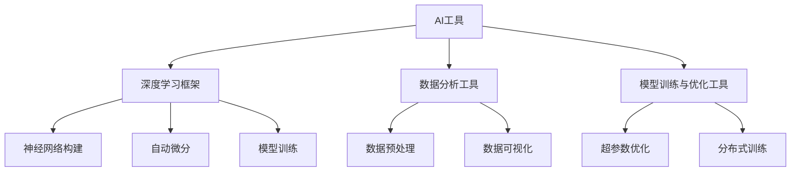

                 

## 1. 背景介绍

在AI领域，选择合适的工具至关重要。这些工具不仅决定了开发效率，还直接影响项目的质量与成败。然而，工具的繁杂、功能的交错，让很多开发者和研究者在选择时陷入困境。本文将深入分析AI工具的核心概念、原理及应用，探讨如何在海量工具中找到最适合自己的那个，助力您在AI开发之路上一路高歌。

## 2. 核心概念与联系

### 2.1 核心概念概述

- **AI工具**：指的是用于人工智能开发的各类软件、库、框架和平台，包括但不限于深度学习框架、数据分析工具、模型训练和优化工具等。
- **深度学习框架**：如TensorFlow、PyTorch、Keras等，提供高效的神经网络构建与训练功能。
- **数据分析工具**：如Pandas、NumPy、Scikit-Learn等，支持数据的处理、分析和可视化。
- **模型训练与优化工具**：如Hyperopt、Ray等，用于超参数优化和分布式训练。

这些概念之间存在紧密联系，共同构建了AI开发的基础设施。了解它们的原理和关系，有助于更好地选择和使用各类工具。

### 2.2 核心概念原理和架构的 Mermaid 流程图



这个图展示了AI工具的核心组成及其相互关系。深度学习框架负责神经网络构建、自动微分与模型训练；数据分析工具用于数据预处理和可视化；而模型训练与优化工具则专注于超参数优化和分布式训练，提升模型性能。

## 3. 核心算法原理 & 具体操作步骤

### 3.1 算法原理概述

AI工具的选择很大程度上取决于算法原理和应用场景的契合度。以下是几个主流AI工具的算法原理概述：

- **TensorFlow**：基于数据流图，支持动态图和静态图，能处理复杂的计算图。
- **PyTorch**：基于操作式编程，强调灵活性，支持动态图，适合快速迭代。
- **Pandas**：基于NumPy，提供高效的数据结构和数据分析工具。
- **Scikit-Learn**：基于NumPy，提供机器学习算法的封装与调用。
- **Hyperopt**：基于贝叶斯优化，用于超参数优化。
- **Ray**：基于分布式计算，支持大规模模型的分布式训练。

### 3.2 算法步骤详解

1. **需求分析**：明确项目目标、数据类型、模型需求等，了解各个工具的特点和适用场景。
2. **工具选择**：根据需求选择合适的深度学习框架、数据分析工具和模型训练与优化工具。
3. **环境搭建**：搭建开发环境，安装所需的工具和库，配置好开发环境。
4. **模型构建**：使用所选工具构建模型，并进行训练与优化。
5. **性能评估**：评估模型性能，根据评估结果调整模型和参数。
6. **部署上线**：将训练好的模型部署到实际应用中，实现业务功能。

### 3.3 算法优缺点

- **TensorFlow**：优点在于强大的社区支持和丰富的功能，缺点是学习曲线陡峭，静态图模式限制了灵活性。
- **PyTorch**：优点在于动态图和易用性，缺点是性能优化较弱。
- **Pandas**：优点在于灵活的数据处理和分析，缺点是计算密集型任务效率较低。
- **Scikit-Learn**：优点在于算法丰富，易于使用，缺点是部分高级算法需要深入理解。
- **Hyperopt**：优点在于高效的超参数优化，缺点是计算成本较高。
- **Ray**：优点在于分布式计算能力，缺点是复杂度高，学习曲线陡峭。

### 3.4 算法应用领域

不同的AI工具适用于不同的应用领域：

- **TensorFlow**：适用于大规模分布式训练和大模型构建。
- **PyTorch**：适用于快速原型开发和科研领域。
- **Pandas**：适用于数据预处理和探索性分析。
- **Scikit-Learn**：适用于机器学习模型的构建和应用。
- **Hyperopt**：适用于模型超参数优化。
- **Ray**：适用于需要分布式计算和模型训练的应用。

## 4. 数学模型和公式 & 详细讲解 & 举例说明

### 4.1 数学模型构建

以线性回归模型为例，数学模型构建如下：

$$ y = \theta_0 + \theta_1x_1 + \theta_2x_2 + \cdots + \theta_nx_n $$

其中，$y$ 为预测结果，$x_i$ 为特征，$\theta_i$ 为权重。

### 4.2 公式推导过程

线性回归模型的推导过程如下：

1. 计算残差 $e_i = y_i - \hat{y}_i$
2. 计算误差项 $E = \frac{1}{2m}\sum_{i=1}^m e_i^2$
3. 求解最小化误差项的权重 $\theta_i$

使用梯度下降算法求解 $\theta_i$，公式为：

$$ \theta_i = \theta_i - \alpha \frac{1}{m} \sum_{i=1}^m (x_{i1} \cdot e_i + \cdots + x_{in} \cdot e_i) $$

### 4.3 案例分析与讲解

以房价预测为例，使用线性回归模型进行数据分析和预测：

1. 收集历史房价数据，包括建筑面积、房间数量、地段等因素。
2. 使用Pandas进行数据预处理和清洗，移除异常值和缺失值。
3. 使用Scikit-Learn的线性回归模型进行训练和预测。
4. 评估模型性能，如均方误差、决定系数等指标。
5. 根据评估结果调整模型参数，优化预测准确性。

## 5. 项目实践：代码实例和详细解释说明

### 5.1 开发环境搭建

1. 安装Python和pip。
2. 安装TensorFlow和Pandas等工具。
3. 配置环境变量和依赖库。

### 5.2 源代码详细实现

以下是使用TensorFlow和Pandas进行房价预测的代码实现：

```python
import tensorflow as tf
import pandas as pd
from sklearn.model_selection import train_test_split

# 加载数据
df = pd.read_csv('housing.csv')

# 数据预处理
X = df.drop(['price'], axis=1)
y = df['price']

# 数据集划分
X_train, X_test, y_train, y_test = train_test_split(X, y, test_size=0.2, random_state=42)

# 定义模型
model = tf.keras.Sequential([
    tf.keras.layers.Dense(64, activation='relu'),
    tf.keras.layers.Dense(1)
])

# 编译模型
model.compile(optimizer=tf.keras.optimizers.Adam(learning_rate=0.001),
              loss='mean_squared_error')

# 训练模型
model.fit(X_train, y_train, epochs=100, batch_size=32, validation_data=(X_test, y_test))

# 评估模型
test_loss = model.evaluate(X_test, y_test)
print('Test loss:', test_loss)
```

### 5.3 代码解读与分析

1. 数据加载和预处理：使用Pandas加载数据，并进行特征选择和数据清洗。
2. 模型定义：使用TensorFlow定义一个包含两个全连接层的神经网络模型。
3. 模型编译：选择Adam优化器和均方误差损失函数。
4. 模型训练：使用训练集进行模型训练，并设置100个epoch和32的batch size。
5. 模型评估：使用测试集评估模型性能。

## 6. 实际应用场景

### 6.1 智能推荐系统

推荐系统可以通过分析用户行为数据，利用机器学习算法为用户推荐商品或内容。常用的工具包括TensorFlow、Pandas、Scikit-Learn等。

- **TensorFlow**：用于构建深度神经网络模型，处理大规模用户行为数据。
- **Pandas**：用于数据清洗和特征工程，构建用户画像。
- **Scikit-Learn**：用于训练和评估推荐模型，进行超参数优化。

### 6.2 自然语言处理

自然语言处理领域包括文本分类、情感分析、机器翻译等任务。常用工具包括TensorFlow、PyTorch、NLTK等。

- **TensorFlow**：用于构建复杂的语言模型，如BERT、GPT等。
- **PyTorch**：用于快速原型开发和实验。
- **NLTK**：用于文本处理和分析。

### 6.3 图像识别

图像识别领域包括目标检测、图像分类等任务。常用工具包括TensorFlow、Keras、OpenCV等。

- **TensorFlow**：用于构建深度神经网络，处理大规模图像数据。
- **Keras**：用于快速构建和训练图像识别模型。
- **OpenCV**：用于图像处理和分析。

## 7. 工具和资源推荐

### 7.1 学习资源推荐

1. TensorFlow官方文档：详细介绍了TensorFlow的各个模块和功能。
2. PyTorch官方文档：提供了全面的PyTorch学习资源和示例代码。
3. Scikit-Learn官方文档：包含丰富的机器学习算法和应用实例。
4. Keras官方文档：介绍了Keras的快速上手方法和应用场景。
5. NLTK官方文档：提供了自然语言处理工具和数据集。
6. OpenCV官方文档：介绍了计算机视觉工具和算法。

### 7.2 开发工具推荐

1. VSCode：支持多种语言和工具集成的开发环境，适合Python开发。
2. PyCharm：专业的Python IDE，提供丰富的开发工具和调试功能。
3. Jupyter Notebook：基于Web的交互式开发环境，适合数据科学和机器学习应用。
4. Anaconda：集成多种Python工具和库的开发环境，方便科学计算和数据分析。
5. TensorBoard：用于可视化模型的训练过程和性能。
6. Ray：用于分布式计算和模型训练。

### 7.3 相关论文推荐

1. TensorFlow论文：深度学习框架的原理和应用。
2. PyTorch论文：操作式编程的深度学习框架。
3. Pandas论文：高效的数据分析和预处理工具。
4. Scikit-Learn论文：机器学习算法的封装与调用。
5. Hyperopt论文：超参数优化算法。
6. Ray论文：分布式计算和模型训练。

## 8. 总结：未来发展趋势与挑战

### 8.1 研究成果总结

AI工具的发展日新月异，未来的趋势包括模型可解释性、高效计算、多模态融合等。开发者需关注这些前沿领域，不断学习新技术，提升自身能力。

### 8.2 未来发展趋势

1. **模型可解释性**：未来的模型将更加注重可解释性，提供透明的决策过程和推理逻辑。
2. **高效计算**：AI工具将引入更多优化技术，提升计算效率，实现快速迭代和实时处理。
3. **多模态融合**：未来的AI工具将支持视觉、语音、文本等多模态数据的融合，提升智能系统的综合能力。
4. **自动化与智能化**：更多自动化工具将出现，辅助开发者快速完成模型构建和优化。
5. **跨平台与跨领域应用**：AI工具将更加通用，支持跨平台、跨领域的部署和应用。

### 8.3 面临的挑战

1. **数据质量与隐私**：高质量标注数据的获取和用户隐私保护是AI工具面临的重大挑战。
2. **计算资源**：大规模模型和高复杂度算法的计算资源需求巨大，对算力提出了更高的要求。
3. **算法偏见**：AI工具中的算法偏见问题需要得到重视和解决，确保模型的公平性和公正性。
4. **伦理与法律**：AI技术的伦理与法律问题日益凸显，如何平衡技术发展与社会责任是重要的课题。
5. **生态系统**：当前AI工具的生态系统较为分散，缺乏统一的规范和标准，需要更多的协同合作。

### 8.4 研究展望

未来的AI研究将更加注重模型的可解释性、高效计算和多模态融合。同时，开发者需要关注数据质量、计算资源、算法偏见、伦理与法律等多方面的问题，构建更安全、可靠、高效的AI生态系统。

## 9. 附录：常见问题与解答

**Q1: 如何选择合适的AI工具？**

A: 选择AI工具时，需考虑项目目标、数据类型、模型需求等，了解各工具的特点和适用场景，进行对比分析，选择最适合的工具。

**Q2: 如何使用TensorFlow进行深度学习开发？**

A: 安装TensorFlow，编写代码定义模型，编译模型，进行训练和评估，调整超参数和优化器。

**Q3: 如何在Pandas中处理大规模数据？**

A: 使用Pandas的数据结构和函数，进行数据清洗、特征选择和可视化。

**Q4: 如何使用Scikit-Learn进行模型训练和优化？**

A: 加载数据，定义模型，编译模型，进行交叉验证和网格搜索，评估模型性能和优化超参数。

**Q5: 如何在Ray中进行分布式计算和模型训练？**

A: 安装Ray，编写代码定义任务和分布式训练，调整资源配置，监控训练进度和性能。

---

作者：禅与计算机程序设计艺术 / Zen and the Art of Computer Programming

