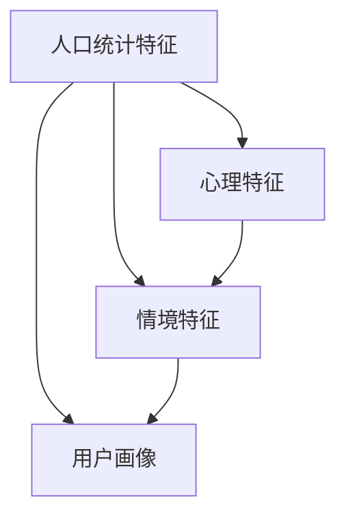

                 

# 如何通过用户画像提升用户满意度

## 1. 背景介绍

在当今数字化时代，企业越来越依赖于网络平台来与用户互动并提供服务。随着用户行为数据的爆炸性增长，如何精准理解用户需求，提供个性化的服务，提升用户满意度，成为各大公司共同面临的重大挑战。用户画像(User Profile)技术，作为一种大数据分析手段，为解决这一问题提供了新的思路。通过构建详尽的用户画像，企业能够深入了解用户的多维特征，制定更符合用户需求的策略，从而在激烈的市场竞争中脱颖而出。

## 2. 核心概念与联系

### 2.1 核心概念概述

用户画像是一种基于数据的抽象模型，用来描绘用户的关键特征。这些特征通常包括人口统计特征（如年龄、性别、职业等）、心理特征（如兴趣、偏好、行为模式等）和情境特征（如在线行为、地理位置、设备类型等）。用户画像可以帮助企业更好地理解目标用户群体，优化产品设计，提高营销效率，提升用户体验。

- 人口统计特征：用户的性别、年龄、职业、收入等基本信息。
- 心理特征：用户的兴趣、价值观、生活方式、消费习惯等。
- 情境特征：用户的在线行为、地理位置、设备类型、网络环境等。
- 用户画像：综合上述特征，形成一个整体的用户模型。

### 2.2 核心概念原理和架构的 Mermaid 流程图



这个流程图展示了用户画像的构建过程。首先，从人口统计特征和心理特征中提取基本数据，然后结合情境特征，最终生成用户画像。

## 3. 核心算法原理 & 具体操作步骤
### 3.1 算法原理概述

用户画像的构建是一个数据挖掘和机器学习过程，主要包含以下几个步骤：

1. **数据收集**：通过各种数据源（如网站日志、社交媒体、在线问卷等）收集用户数据。
2. **数据清洗**：对收集到的数据进行去重、格式化和标准化处理，以提高数据的准确性和可用性。
3. **特征提取**：将清洗后的数据转换成特征向量，供后续算法使用。
4. **模型训练**：使用机器学习算法（如聚类、分类、回归等）训练用户画像模型。
5. **画像更新**：定期更新用户画像，反映最新的用户行为和偏好。

### 3.2 算法步骤详解

#### 3.2.1 数据收集

用户数据通常从以下几个渠道收集：

- **网站/应用日志**：记录用户在网站/应用中的行为（如浏览页面、购买行为等）。
- **社交媒体**：分析用户在社交平台上的活动（如点赞、评论、分享等）。
- **在线调查问卷**：通过问卷收集用户对产品/服务的评价和反馈。
- **交易记录**：分析用户的购买历史和偏好。
- **设备信息**：记录用户的设备类型、操作系统、浏览器等。

#### 3.2.2 数据清洗

数据清洗的目的是提高数据质量，包括：

- **去重**：去除重复的记录，确保数据的唯一性。
- **格式化**：统一数据格式，使其易于处理。
- **标准化**：将不同来源的数据映射到统一的标签和格式。
- **异常值处理**：识别和处理缺失值和异常值，以保证数据的准确性。

#### 3.2.3 特征提取

特征提取是将原始数据转换为机器学习算法可用的形式，包括：

- **文本处理**：将用户评论、描述等文本数据转换为词频向量或TF-IDF向量。
- **时间处理**：将时间序列数据转化为时间戳或周期性特征。
- **数字处理**：将数值型数据进行标准化或归一化处理。
- **图像处理**：将用户上传的图片转换为数字特征。
- **多维数据融合**：将来自不同渠道的数据融合，构建多模态用户画像。

#### 3.2.4 模型训练

常见的用户画像模型包括：

- **聚类算法**：如K-means、层次聚类、DBSCAN等，用于将用户分为不同的群体。
- **分类算法**：如逻辑回归、支持向量机、随机森林等，用于预测用户的行为和偏好。
- **回归算法**：如线性回归、多项式回归等，用于预测用户的行为特征。
- **关联规则学习**：如Apriori、FP-growth等，用于挖掘用户行为之间的关联性。

#### 3.2.5 画像更新

用户画像不是一成不变的，需要定期更新以反映最新的用户行为和偏好。更新过程包括：

- **数据集成**：将新收集的数据与现有画像进行集成。
- **模型重训练**：定期重训练用户画像模型，以反映最新的用户特征。
- **画像验证**：通过对比模型预测和实际行为，验证模型的准确性。

### 3.3 算法优缺点

#### 3.3.1 优点

1. **全面了解用户**：用户画像能够全面反映用户的特征，帮助企业深入了解用户需求。
2. **个性化推荐**：基于用户画像，可以制定更加个性化的推荐策略，提升用户满意度。
3. **提高营销效率**：通过精准的用户画像，企业可以更加精准地定位目标用户，提升广告和营销效果。
4. **优化产品设计**：用户画像可以帮助企业更好地理解用户需求，优化产品设计和服务。

#### 3.3.2 缺点

1. **隐私问题**：收集和处理用户数据时，需要注意隐私保护，防止数据泄露。
2. **数据质量**：用户数据的准确性和完整性对用户画像的构建至关重要。
3. **模型复杂性**：构建和维护用户画像模型需要较高的技术门槛和成本。
4. **动态变化**：用户行为和偏好是动态变化的，需要持续更新和维护用户画像。

### 3.4 算法应用领域

用户画像技术在多个领域都有广泛应用：

- **电子商务**：通过用户画像，企业可以制定个性化推荐策略，提高销售额。
- **金融服务**：金融机构可以基于用户画像，提供个性化的金融产品和定制化服务。
- **健康医疗**：医疗机构可以根据用户画像，制定个性化的健康管理方案。
- **教育培训**：教育机构可以通过用户画像，提供更加个性化的学习资源和课程推荐。
- **媒体广告**：广告公司可以基于用户画像，制定精准的广告投放策略。

## 4. 数学模型和公式 & 详细讲解 & 举例说明

### 4.1 数学模型构建

用户画像的构建可以通过数学模型来描述。我们以一个简单的用户画像为例，其数学模型可以表示为：

$$
\text{User Profile} = f(\text{Demographics}, \text{Psychographics}, \text{Context})
$$

其中：

- $\text{Demographics}$：人口统计特征，如年龄、性别、职业等。
- $\text{Psychographics}$：心理特征，如兴趣、价值观、生活方式等。
- $\text{Context}$：情境特征，如在线行为、地理位置等。
- $f$：映射函数，将特征映射为用户画像。

### 4.2 公式推导过程

假设我们有以下特征向量：

- $\text{Demographics}$：$(d_1, d_2, ..., d_n)$
- $\text{Psychographics}$：$(p_1, p_2, ..., p_m)$
- $\text{Context}$：$(c_1, c_2, ..., c_k)$

则用户画像可以表示为：

$$
\text{User Profile} = \mathbf{U}(d_1, d_2, ..., d_n; p_1, p_2, ..., p_m; c_1, c_2, ..., c_k)
$$

其中，$\mathbf{U}$为映射函数，将输入特征映射为用户画像。

### 4.3 案例分析与讲解

假设我们有一个电子商务网站的用户画像模型，其特征包括：

- $\text{Demographics}$：年龄、性别、职业
- $\text{Psychographics}$：兴趣、消费习惯、品牌偏好
- $\text{Context}$：浏览历史、购买历史、地理位置

我们可以使用K-means算法对用户进行聚类，得到用户画像的模型：

$$
\mathbf{U} = K-means(d_1, d_2, ..., d_n; p_1, p_2, ..., p_m; c_1, c_2, ..., c_k)
$$

其中，$d_i$为第$i$个用户的人口统计特征，$p_j$为第$j$个用户心理特征，$c_k$为第$k$个用户情境特征。

## 5. 项目实践：代码实例和详细解释说明

### 5.1 开发环境搭建

在进行用户画像项目开发时，需要安装以下依赖：

- Python 3.8+
- Pandas
- NumPy
- Scikit-learn
- Matplotlib
- Seaborn
- Jupyter Notebook

可以使用以下命令创建虚拟环境并安装依赖：

```bash
conda create -n user_profile_env python=3.8
conda activate user_profile_env
pip install pandas numpy scikit-learn matplotlib seaborn jupyter notebook
```

### 5.2 源代码详细实现

下面是一个简单的用户画像项目实现示例，包含数据收集、数据清洗、特征提取、模型训练和画像更新的各个步骤。

```python
import pandas as pd
from sklearn.cluster import KMeans
import matplotlib.pyplot as plt

# 数据收集
data = pd.read_csv('user_data.csv')

# 数据清洗
data = data.drop_duplicates()
data = data.dropna()

# 特征提取
features = data[['age', 'gender', 'income', 'interest', 'online_time', 'location']]
features = pd.get_dummies(features, drop_first=True)

# 模型训练
kmeans = KMeans(n_clusters=5)
kmeans.fit(features)

# 画像更新
new_user = pd.DataFrame({'age': 30, 'gender': 'M', 'income': 50000, 'interest': 'sports', 'online_time': 4, 'location': 'Beijing'})
new_user['cluster'] = kmeans.predict(new_user)

# 输出结果
print(new_user)

# 可视化
plt.scatter(features['age'], features['income'], c=kmeans.labels_)
plt.show()
```

### 5.3 代码解读与分析

**数据收集**

```python
import pandas as pd

data = pd.read_csv('user_data.csv')
```

读取CSV文件，将用户数据加载到Pandas DataFrame中。

**数据清洗**

```python
data = data.drop_duplicates()
data = data.dropna()
```

去除重复数据和缺失值。

**特征提取**

```python
features = data[['age', 'gender', 'income', 'interest', 'online_time', 'location']]
features = pd.get_dummies(features, drop_first=True)
```

将用户特征转换为数值特征，并使用one-hot编码，去除冗余列。

**模型训练**

```python
kmeans = KMeans(n_clusters=5)
kmeans.fit(features)
```

使用K-means算法对用户特征进行聚类，将用户分为5个不同的群体。

**画像更新**

```python
new_user = pd.DataFrame({'age': 30, 'gender': 'M', 'income': 50000, 'interest': 'sports', 'online_time': 4, 'location': 'Beijing'})
new_user['cluster'] = kmeans.predict(new_user)
```

使用训练好的模型，对新用户进行聚类，得到用户画像。

**可视化**

```python
plt.scatter(features['age'], features['income'], c=kmeans.labels_)
plt.show()
```

绘制用户画像的散点图，可视化聚类结果。

## 6. 实际应用场景

用户画像技术在实际应用中已经取得了显著成效。以下是几个典型的应用场景：

### 6.1 电子商务

在电子商务中，用户画像可以用于：

- **个性化推荐**：通过用户画像，推荐系统可以生成个性化的商品推荐列表，提高用户满意度。
- **精准营销**：根据用户画像，制定有针对性的广告投放策略，提升广告转化率。
- **流失预测**：通过用户画像，预测用户的流失风险，及时采取措施挽回用户。

### 6.2 金融服务

在金融服务中，用户画像可以用于：

- **风险评估**：根据用户画像，评估用户的信用风险和还款能力。
- **产品定制**：根据用户画像，提供个性化的金融产品和服务，满足用户需求。
- **行为监控**：通过用户画像，监控异常行为，预防金融欺诈。

### 6.3 健康医疗

在健康医疗中，用户画像可以用于：

- **个性化健康管理**：根据用户画像，制定个性化的健康管理方案，提升用户健康水平。
- **疾病预测**：通过用户画像，预测用户患病风险，及时进行干预。
- **医疗资源分配**：根据用户画像，合理分配医疗资源，提高医疗效率。

### 6.4 教育培训

在教育培训中，用户画像可以用于：

- **学习资源推荐**：根据用户画像，推荐个性化的学习资源和课程，提升学习效果。
- **学习行为分析**：通过用户画像，分析学习行为，优化学习路径和教学方法。
- **学习效果评估**：根据用户画像，评估学习效果，及时调整教学策略。

## 7. 工具和资源推荐

### 7.1 学习资源推荐

1. **《数据科学入门与实践》**：这是一本系统介绍数据科学基础知识的书籍，包含数据收集、数据清洗、特征工程等基本概念。
2. **Coursera上的《数据科学专项课程》**：由斯坦福大学开设，系统讲解数据科学的方法和工具。
3. **Kaggle平台**：全球最大的数据科学竞赛平台，提供大量的数据集和实战项目。

### 7.2 开发工具推荐

1. **Python**：Python是数据科学和机器学习的主流语言，拥有丰富的数据处理和机器学习库。
2. **Pandas**：Pandas是Python中的数据处理库，支持数据清洗、转换和分析。
3. **Scikit-learn**：Scikit-learn是Python中的机器学习库，支持各种算法和模型训练。
4. **TensorFlow**：TensorFlow是Google开发的深度学习框架，支持大规模分布式计算。
5. **PyTorch**：PyTorch是Facebook开发的深度学习框架，支持动态图和静态图两种计算图模型。

### 7.3 相关论文推荐

1. **《用户画像：一种数据驱动的用户理解方式》**：文章探讨了用户画像的定义、构建方法和应用场景。
2. **《基于聚类分析的用户画像构建与特征挖掘》**：文章介绍了聚类算法在用户画像构建中的应用。
3. **《个性化推荐系统中的用户画像建模与特征选择》**：文章讨论了用户画像在个性化推荐系统中的应用。

## 8. 总结：未来发展趋势与挑战

### 8.1 研究成果总结

用户画像技术已经成为企业数字化转型的重要手段之一，其应用领域覆盖了电子商务、金融服务、健康医疗等多个行业。通过用户画像，企业可以更好地理解用户需求，提升用户体验，优化产品和服务，提高营销效率。

### 8.2 未来发展趋势

未来用户画像技术的发展趋势包括：

1. **数据融合与多模态融合**：将不同来源的数据进行融合，构建多模态用户画像，提升用户画像的全面性和准确性。
2. **实时更新与动态调整**：用户行为和偏好是动态变化的，需要实时更新和调整用户画像，以反映最新的用户需求。
3. **跨领域应用**：将用户画像技术应用于更多领域，如智能制造、智能家居等，拓展用户画像的应用场景。
4. **隐私保护与数据安全**：在构建和应用用户画像时，需要注重隐私保护和数据安全，确保用户数据的安全性和隐私性。
5. **人工智能与用户画像的结合**：引入人工智能技术，如机器学习、深度学习等，提升用户画像的建模能力和预测准确性。

### 8.3 面临的挑战

用户画像技术在应用过程中也面临一些挑战：

1. **数据质量与获取**：用户数据的准确性和完整性对用户画像的构建至关重要，但数据获取和处理成本较高。
2. **隐私保护**：在收集和处理用户数据时，需要注重隐私保护，防止数据泄露和滥用。
3. **模型复杂性**：构建和维护用户画像模型需要较高的技术门槛和成本。
4. **实时更新**：用户行为和偏好是动态变化的，需要实时更新和调整用户画像，技术实现难度较大。
5. **跨领域应用**：将用户画像技术应用于更多领域时，需要考虑不同领域的特殊需求和技术要求。

### 8.4 研究展望

未来的研究需要关注以下几个方面：

1. **多模态用户画像**：将不同来源的数据进行融合，构建多模态用户画像，提升用户画像的全面性和准确性。
2. **实时更新与动态调整**：研究用户行为和偏好的动态变化规律，实现用户画像的实时更新和调整。
3. **隐私保护与数据安全**：研究隐私保护技术，确保用户数据的安全性和隐私性。
4. **人工智能与用户画像的结合**：引入人工智能技术，提升用户画像的建模能力和预测准确性。

## 9. 附录：常见问题与解答

**Q1：用户画像在实际应用中需要注意哪些问题？**

A: 在实际应用中，用户画像需要注意以下问题：

1. **隐私保护**：在收集和处理用户数据时，需要注重隐私保护，防止数据泄露和滥用。
2. **数据质量**：用户数据的准确性和完整性对用户画像的构建至关重要，但数据获取和处理成本较高。
3. **模型复杂性**：构建和维护用户画像模型需要较高的技术门槛和成本。
4. **实时更新**：用户行为和偏好是动态变化的，需要实时更新和调整用户画像，技术实现难度较大。
5. **跨领域应用**：将用户画像技术应用于更多领域时，需要考虑不同领域的特殊需求和技术要求。

**Q2：用户画像如何与个性化推荐系统结合？**

A: 用户画像可以与个性化推荐系统紧密结合，提升推荐效果。具体来说：

1. **用户画像特征提取**：将用户画像中的特征提取出来，供推荐算法使用。
2. **推荐模型训练**：将用户画像特征输入推荐模型，训练个性化推荐算法。
3. **推荐策略优化**：根据用户画像，优化推荐策略，提升推荐效果。

**Q3：用户画像在电子商务中的应用有哪些？**

A: 用户画像在电子商务中的应用包括：

1. **个性化推荐**：通过用户画像，推荐系统可以生成个性化的商品推荐列表，提高用户满意度。
2. **精准营销**：根据用户画像，制定有针对性的广告投放策略，提升广告转化率。
3. **流失预测**：通过用户画像，预测用户的流失风险，及时采取措施挽回用户。

**Q4：用户画像技术在金融服务中的应用有哪些？**

A: 用户画像在金融服务中的应用包括：

1. **风险评估**：根据用户画像，评估用户的信用风险和还款能力。
2. **产品定制**：根据用户画像，提供个性化的金融产品和服务，满足用户需求。
3. **行为监控**：通过用户画像，监控异常行为，预防金融欺诈。

**Q5：如何构建高质量的用户画像？**

A: 构建高质量的用户画像需要以下几个步骤：

1. **数据收集**：通过各种数据源（如网站日志、社交媒体、在线问卷等）收集用户数据。
2. **数据清洗**：对收集到的数据进行去重、格式化和标准化处理，以提高数据的准确性和可用性。
3. **特征提取**：将原始数据转换为机器学习算法可用的形式，如文本处理、时间处理、数字处理等。
4. **模型训练**：使用机器学习算法（如聚类、分类、回归等）训练用户画像模型。
5. **画像更新**：定期更新用户画像，反映最新的用户行为和偏好。

通过以上步骤，可以构建全面、准确的用户画像，为个性化服务和精准营销提供有力支持。

---

作者：禅与计算机程序设计艺术 / Zen and the Art of Computer Programming

