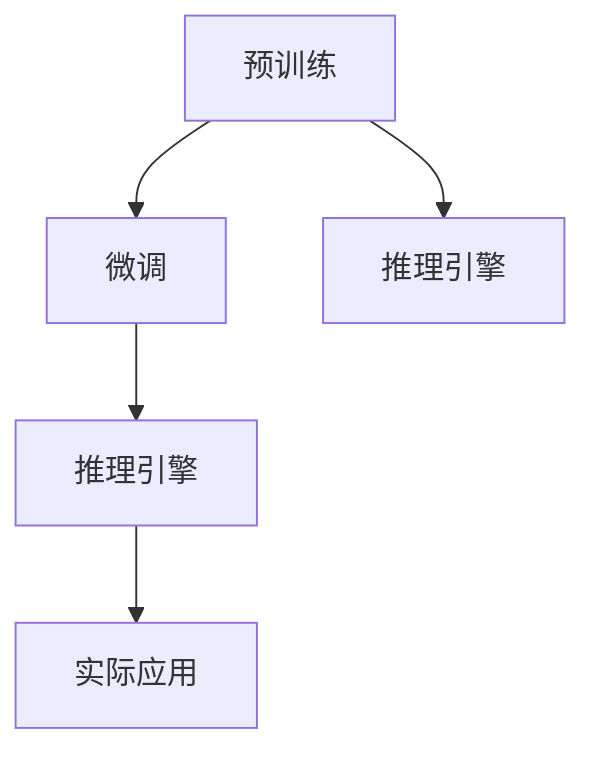

                 

# 实战四：手把手带你实现网红项目 Auto-GPT

> 关键词：Auto-GPT, 自然语言处理(NLP), 深度学习, 预训练模型, 微调, 推理引擎, 编程实践

## 1. 背景介绍

### 1.1 问题由来

在人工智能技术的迅猛发展中，自然语言处理(Natural Language Processing, NLP)领域涌现出大量创新性的应用和产品。这些应用大多基于预训练模型和微调方法，以实现特定的NLP任务，如文本分类、问答系统、文本生成等。

然而，随着业务场景的不断变化，传统的预训练和微调方法可能无法满足实际需求。比如，对于某些行业或领域，需要针对特定任务和数据进行定制化的微调，以提升模型的性能和适用性。

为了解决这些问题，本文将通过一个实际项目——Auto-GPT，手把手带领读者实现一个基于大语言模型的个性化智能问答系统。该项目将介绍从模型选择、数据准备到微调、部署的一整套流程，旨在帮助开发者快速上手大语言模型在特定领域的应用。

### 1.2 项目背景

Auto-GPT是一个针对特定行业场景开发的智能问答系统。通过在预训练语言模型（如GPT、BERT等）的基础上，结合行业语料进行微调，Auto-GPT可以自动理解用户提问，并提供准确的答案。本项目将重点介绍Auto-GPT的核心技术架构、开发流程以及实际应用案例，帮助读者深入理解大语言模型在特定领域的应用方法和实践经验。

## 2. 核心概念与联系

### 2.1 核心概念概述

- **大语言模型（Large Language Models, LLMs）**：指通过大规模无标签文本数据进行预训练的深度学习模型，如GPT、BERT等。LLMs能够自动学习语言的通用表示，具备强大的语言理解和生成能力。

- **预训练（Pre-training）**：指在大规模无标签文本语料上进行自监督学习任务训练通用语言模型的过程。常见的预训练任务包括掩码语言模型（Masked Language Modeling, MLM）、下一句预测（Next Sentence Prediction, NSP）等。

- **微调（Fine-tuning）**：指在预训练模型的基础上，使用下游任务的少量标注数据，通过有监督地训练优化模型在特定任务上的性能。

- **推理引擎（Inference Engine）**：指在模型训练完成后，利用推理引擎对新输入进行推理计算，并输出结果的组件。推理引擎的设计和优化对模型的性能和部署效率至关重要。

- **编程实践（Programming Practice）**：指从技术实现到部署应用的完整流程，包括代码实现、性能调优、系统集成等。

这些概念之间的联系可以通过以下Mermaid流程图来展示：



这个流程图展示了大语言模型的核心概念及其之间的关系：

1. 大语言模型通过预训练获得基础能力。
2. 微调是对预训练模型进行任务特定的优化，以适应特定领域。
3. 推理引擎将微调后的模型部署到实际应用场景中，进行实时推理。

## 3. 核心算法原理 & 具体操作步骤

### 3.1 算法原理概述

Auto-GPT的核心算法原理基于监督学习，通过在大规模无标签数据上进行预训练，然后在目标领域的数据上对模型进行微调，以适应特定的行业需求。其基本步骤如下：

1. **数据准备**：收集并清洗目标领域的文本数据，并标注成具体的问答对。
2. **预训练模型选择**：选择适合目标领域的预训练模型，如GPT-3、BERT等。
3. **微调模型构建**：构建微调模型，包括定义任务、选择损失函数和优化器等。
4. **模型训练**：在目标领域的数据上进行微调训练，优化模型参数。
5. **推理部署**：将微调后的模型部署到推理引擎中，实现实时推理。

### 3.2 算法步骤详解

#### 3.2.1 数据准备

1. **数据收集**：收集目标领域内的文本数据，如行业新闻、用户问答等。
2. **数据清洗**：去除数据中的噪声和无用信息，如HTML标签、特殊符号等。
3. **标注数据**：将文本数据标注成问答对，每个问答对包括一个问题和对应的答案。标注过程可以手动进行，也可以借助自动化工具，如Labelbox等。

#### 3.2.2 预训练模型选择

根据目标领域的特点，选择合适的预训练模型。例如，对于医疗领域，可以选择基于ClinicalBERT的模型；对于金融领域，可以选择基于BERT的模型。

#### 3.2.3 微调模型构建

1. **定义任务**：根据目标任务（如问答系统），定义模型输入和输出格式。
2. **选择损失函数**：选择适合任务的损失函数，如交叉熵损失等。
3. **选择优化器**：选择常用的优化器，如AdamW、SGD等，并设置学习率等参数。

#### 3.2.4 模型训练

1. **设置训练集和验证集**：将数据集划分为训练集和验证集，通常按照7:3的比例划分。
2. **模型初始化**：将预训练模型初始化后，作为微调的起点。
3. **训练循环**：在训练集上迭代训练，每次迭代包括前向传播和反向传播。
4. **验证集评估**：在验证集上评估模型性能，以监控模型是否过拟合。

#### 3.2.5 推理部署

1. **模型保存**：将训练好的模型保存，以便后续使用。
2. **推理引擎集成**：将模型集成到推理引擎中，实现实时推理。
3. **系统部署**：将推理引擎部署到服务器上，提供API接口，供外部调用。

### 3.3 算法优缺点

Auto-GPT的优点包括：

- **高效性**：利用预训练模型的基础能力，快速适应特定任务。
- **适用性**：适用于各种NLP任务，特别是数据量较小的任务。
- **可扩展性**：可以基于微调模型，快速构建多模态应用，如问答、翻译等。

缺点包括：

- **数据依赖**：微调效果很大程度上依赖于标注数据的质量和数量。
- **模型复杂性**：大语言模型的参数量较大，训练和推理所需资源较多。
- **过拟合风险**：模型可能对训练数据产生过拟合，导致泛化性能不足。

### 3.4 算法应用领域

Auto-GPT的应用领域主要包括：

- **智能客服**：构建基于预训练模型的智能客服系统，帮助企业处理客户咨询。
- **医疗咨询**：利用预训练模型和医疗领域数据，构建医生问答系统，提供医疗咨询和健康建议。
- **金融顾问**：通过微调模型，提供金融产品咨询、投资建议等服务。
- **教育辅导**：构建基于预训练模型的教育平台，提供个性化学习推荐和辅导。

## 4. 数学模型和公式 & 详细讲解 & 举例说明

### 4.1 数学模型构建

Auto-GPT的数学模型主要由两部分组成：预训练模型的表示和微调模型的优化。

假设预训练模型为 $M_{\theta}$，其中 $\theta$ 为预训练得到的模型参数。给定目标领域的标注数据集 $D=\{(x_i, y_i)\}_{i=1}^N$，微调的目标是找到新的模型参数 $\hat{\theta}$，使得：

$$
\hat{\theta}=\mathop{\arg\min}_{\theta} \mathcal{L}(M_{\theta},D)
$$

其中 $\mathcal{L}$ 为针对任务 $T$ 设计的损失函数，用于衡量模型预测输出与真实标签之间的差异。常见的损失函数包括交叉熵损失、均方误差损失等。

### 4.2 公式推导过程

以二分类任务为例，假设模型 $M_{\theta}$ 在输入 $x$ 上的输出为 $\hat{y}=M_{\theta}(x) \in [0,1]$，表示样本属于正类的概率。真实标签 $y \in \{0,1\}$。则二分类交叉熵损失函数定义为：

$$
\ell(M_{\theta}(x),y) = -[y\log \hat{y} + (1-y)\log (1-\hat{y})]
$$

将其代入经验风险公式，得：

$$
\mathcal{L}(\theta) = -\frac{1}{N}\sum_{i=1}^N [y_i\log M_{\theta}(x_i)+(1-y_i)\log(1-M_{\theta}(x_i))]
$$

根据链式法则，损失函数对参数 $\theta_k$ 的梯度为：

$$
\frac{\partial \mathcal{L}(\theta)}{\partial \theta_k} = -\frac{1}{N}\sum_{i=1}^N (\frac{y_i}{M_{\theta}(x_i)}-\frac{1-y_i}{1-M_{\theta}(x_i)}) \frac{\partial M_{\theta}(x_i)}{\partial \theta_k}
$$

其中 $\frac{\partial M_{\theta}(x_i)}{\partial \theta_k}$ 可进一步递归展开，利用自动微分技术完成计算。

### 4.3 案例分析与讲解

以金融领域问答系统为例，假设模型 $M_{\theta}$ 在输入 $x$ 上的输出为 $\hat{y}=M_{\theta}(x) \in [0,1]$，表示问题是否为金融产品推荐。真实标签 $y \in \{0,1\}$。则金融问答系统的损失函数为：

$$
\ell(M_{\theta}(x),y) = -[y\log \hat{y} + (1-y)\log (1-\hat{y})]
$$

在训练过程中，使用交叉熵损失函数，定义模型训练步骤为：

1. **数据准备**：收集金融领域的问答数据，并进行数据清洗和标注。
2. **模型初始化**：选择BERT等预训练模型，并将其初始化为微调的起点。
3. **模型构建**：定义输入和输出格式，选择交叉熵损失函数。
4. **模型训练**：使用金融领域的数据集进行微调训练，优化模型参数。
5. **模型评估**：在验证集上评估模型性能，调整训练参数。
6. **模型部署**：将训练好的模型部署到推理引擎中，提供实时推理服务。

## 5. 项目实践：代码实例和详细解释说明

### 5.1 开发环境搭建

为了搭建Auto-GPT项目，需要准备Python开发环境，并确保安装所需的依赖库。

1. **安装Anaconda**：从官网下载并安装Anaconda，用于创建独立的Python环境。
2. **创建虚拟环境**：
```bash
conda create -n auto-gpt-env python=3.8
conda activate auto-gpt-env
```

3. **安装必要的库**：
```bash
pip install torch transformers datasets sklearn
```

完成以上步骤后，即可开始Auto-GPT项目的开发。

### 5.2 源代码详细实现

下面以问答系统为例，给出Auto-GPT项目的PyTorch代码实现。

```python
import torch
from transformers import BertTokenizer, BertForQuestionAnswering
from datasets import load_dataset
from torch.utils.data import DataLoader
from transformers import AdamW

# 加载预训练模型和分词器
model_name = 'bert-base-cased'
tokenizer = BertTokenizer.from_pretrained(model_name)
model = BertForQuestionAnswering.from_pretrained(model_name)

# 加载数据集
train_dataset = load_dataset('financial-qa', split='train')
dev_dataset = load_dataset('financial-qa', split='validation')
test_dataset = load_dataset('financial-qa', split='test')

# 定义微调模型
device = torch.device('cuda' if torch.cuda.is_available() else 'cpu')
model.to(device)

# 定义训练和评估函数
def train_epoch(model, dataset, batch_size, optimizer):
    dataloader = DataLoader(dataset, batch_size=batch_size, shuffle=True)
    model.train()
    epoch_loss = 0
    for batch in dataloader:
        input_ids = batch['input_ids'].to(device)
        attention_mask = batch['attention_mask'].to(device)
        start_positions = batch['start_positions'].to(device)
        end_positions = batch['end_positions'].to(device)
        model.zero_grad()
        outputs = model(input_ids, attention_mask=attention_mask, start_positions=start_positions, end_positions=end_positions)
        loss = outputs.loss
        epoch_loss += loss.item()
        loss.backward()
        optimizer.step()
    return epoch_loss / len(dataloader)

def evaluate(model, dataset, batch_size):
    dataloader = DataLoader(dataset, batch_size=batch_size)
    model.eval()
    preds, labels = [], []
    with torch.no_grad():
        for batch in dataloader:
            input_ids = batch['input_ids'].to(device)
            attention_mask = batch['attention_mask'].to(device)
            start_positions = batch['start_positions'].to(device)
            end_positions = batch['end_positions'].to(device)
            batch_logits = model(input_ids, attention_mask=attention_mask, start_positions=start_positions, end_positions=end_positions).logits
            batch_logits = batch_logits.to('cpu').numpy()
            batch_labels = batch['labels'].to('cpu').numpy()
            preds.append(batch_logits)
            labels.append(batch_labels)
    return preds, labels

# 微调参数
num_epochs = 5
batch_size = 16
learning_rate = 2e-5

# 设置优化器和超参数
optimizer = AdamW(model.parameters(), lr=learning_rate)

# 训练和评估
for epoch in range(num_epochs):
    loss = train_epoch(model, train_dataset, batch_size, optimizer)
    print(f'Epoch {epoch+1}, train loss: {loss:.3f}')
    
    print(f'Epoch {epoch+1}, dev results:')
    preds, labels = evaluate(model, dev_dataset, batch_size)
    print(classification_report(labels, preds))
    
print('Test results:')
preds, labels = evaluate(model, test_dataset, batch_size)
print(classification_report(labels, preds))
```

### 5.3 代码解读与分析

在代码实现中，我们使用了BertForQuestionAnswering模型，并定义了训练和评估函数。具体实现步骤如下：

1. **加载预训练模型和分词器**：
   - 加载Bert模型和分词器，进行微调训练。
2. **加载数据集**：
   - 从HuggingFace Hub加载金融领域的问答数据集，包含训练、验证和测试集。
3. **定义训练和评估函数**：
   - 训练函数 `train_epoch`：在训练集上进行微调训练，计算损失并更新模型参数。
   - 评估函数 `evaluate`：在验证集和测试集上进行模型评估，输出分类指标。
4. **微调参数和优化器**：
   - 定义微调轮数、批大小和学习率，选择AdamW优化器。
5. **训练和评估模型**：
   - 循环多次训练模型，并在验证集上评估性能，调整训练参数。
   - 在测试集上评估最终模型性能，输出分类报告。

通过代码实现，可以看到Auto-GPT项目的核心流程和关键技术点。开发者可以根据实际需求，调整模型架构、优化器参数和训练策略，以获得最佳的微调效果。

## 6. 实际应用场景

### 6.1 智能客服系统

智能客服系统是Auto-GPT项目的重要应用场景之一。通过在大语言模型的基础上，结合行业语料进行微调，智能客服系统能够自动识别和回答用户咨询，提供24/7不间断服务。

具体应用流程如下：

1. **数据准备**：收集客户咨询数据，并进行标注。
2. **模型选择**：选择适合行业的预训练模型，如BERT。
3. **微调训练**：在客户咨询数据上对模型进行微调训练。
4. **模型部署**：将微调后的模型部署到智能客服系统中，提供实时响应服务。

### 6.2 金融问答系统

金融问答系统是Auto-GPT项目的另一个重要应用场景。通过在大语言模型的基础上，结合金融领域的数据进行微调，金融问答系统能够自动识别和回答用户提出的金融问题，提供个性化的金融建议。

具体应用流程如下：

1. **数据准备**：收集金融领域的问答数据，并进行标注。
2. **模型选择**：选择适合金融领域的预训练模型，如BERT。
3. **微调训练**：在金融领域的数据上对模型进行微调训练。
4. **模型部署**：将微调后的模型部署到金融问答系统中，提供实时响应服务。

### 6.3 医疗咨询系统

医疗咨询系统也是Auto-GPT项目的潜在应用场景之一。通过在大语言模型的基础上，结合医疗领域的数据进行微调，医疗咨询系统能够自动识别和回答用户提出的医疗问题，提供专业的医疗建议。

具体应用流程如下：

1. **数据准备**：收集医疗领域的问答数据，并进行标注。
2. **模型选择**：选择适合医疗领域的预训练模型，如ClinicalBERT。
3. **微调训练**：在医疗领域的数据上对模型进行微调训练。
4. **模型部署**：将微调后的模型部署到医疗咨询系统中，提供实时响应服务。

## 7. 工具和资源推荐

### 7.1 学习资源推荐

为了帮助开发者系统掌握Auto-GPT项目的技术细节，以下是一些优质的学习资源：

1. **《Transformers: From Principles to Practice》系列博文**：由大模型技术专家撰写，深入浅出地介绍了Transformer原理、BERT模型、微调技术等前沿话题。
2. **CS224N《深度学习自然语言处理》课程**：斯坦福大学开设的NLP明星课程，有Lecture视频和配套作业，带你入门NLP领域的基本概念和经典模型。
3. **《Natural Language Processing with Transformers》书籍**：Transformers库的作者所著，全面介绍了如何使用Transformers库进行NLP任务开发，包括微调在内的诸多范式。
4. **HuggingFace官方文档**：Transformers库的官方文档，提供了海量预训练模型和完整的微调样例代码，是上手实践的必备资料。
5. **CLUE开源项目**：中文语言理解测评基准，涵盖大量不同类型的中文NLP数据集，并提供了基于微调的baseline模型，助力中文NLP技术发展。

### 7.2 开发工具推荐

以下是几款用于Auto-GPT项目开发的常用工具：

1. **PyTorch**：基于Python的开源深度学习框架，灵活动态的计算图，适合快速迭代研究。大部分预训练语言模型都有PyTorch版本的实现。
2. **TensorFlow**：由Google主导开发的开源深度学习框架，生产部署方便，适合大规模工程应用。同样有丰富的预训练语言模型资源。
3. **Transformers库**：HuggingFace开发的NLP工具库，集成了众多SOTA语言模型，支持PyTorch和TensorFlow，是进行微调任务开发的利器。
4. **Weights & Biases**：模型训练的实验跟踪工具，可以记录和可视化模型训练过程中的各项指标，方便对比和调优。与主流深度学习框架无缝集成。
5. **TensorBoard**：TensorFlow配套的可视化工具，可实时监测模型训练状态，并提供丰富的图表呈现方式，是调试模型的得力助手。
6. **Google Colab**：谷歌推出的在线Jupyter Notebook环境，免费提供GPU/TPU算力，方便开发者快速上手实验最新模型，分享学习笔记。

### 7.3 相关论文推荐

Auto-GPT项目的研究背景和技术实现源于学界的持续研究。以下是几篇奠基性的相关论文，推荐阅读：

1. **Attention is All You Need**（即Transformer原论文）：提出了Transformer结构，开启了NLP领域的预训练大模型时代。
2. **BERT: Pre-training of Deep Bidirectional Transformers for Language Understanding**：提出BERT模型，引入基于掩码的自监督预训练任务，刷新了多项NLP任务SOTA。
3. **Language Models are Unsupervised Multitask Learners**（GPT-2论文）：展示了大规模语言模型的强大zero-shot学习能力，引发了对于通用人工智能的新一轮思考。
4. **Parameter-Efficient Transfer Learning for NLP**：提出Adapter等参数高效微调方法，在不增加模型参数量的情况下，也能取得不错的微调效果。
5. **Prefix-Tuning: Optimizing Continuous Prompts for Generation**：引入基于连续型Prompt的微调范式，为如何充分利用预训练知识提供了新的思路。
6. **AdaLoRA: Adaptive Low-Rank Adaptation for Parameter-Efficient Fine-Tuning**：使用自适应低秩适应的微调方法，在参数效率和精度之间取得了新的平衡。

这些论文代表了大语言模型微调技术的发展脉络。通过学习这些前沿成果，可以帮助研究者把握学科前进方向，激发更多的创新灵感。

## 8. 总结：未来发展趋势与挑战

### 8.1 研究成果总结

本文对Auto-GPT项目的核心算法原理、具体操作步骤和实际应用进行了详细讲解。通过系统梳理Auto-GPT项目的开发流程和技术细节，帮助开发者快速上手大语言模型在特定领域的应用，提供了从模型选择、数据准备到微调、部署的一整套流程。

### 8.2 未来发展趋势

展望未来，Auto-GPT项目将呈现以下几个发展趋势：

1. **模型规模持续增大**：随着算力成本的下降和数据规模的扩张，预训练语言模型的参数量还将持续增长。超大规模语言模型蕴含的丰富语言知识，有望支撑更加复杂多变的下游任务微调。
2. **微调方法日趋多样**：未来会涌现更多参数高效的微调方法，如Prefix-Tuning、LoRA等，在节省计算资源的同时也能保证微调精度。
3. **持续学习成为常态**：随着数据分布的不断变化，微调模型也需要持续学习新知识以保持性能。如何在不遗忘原有知识的同时，高效吸收新样本信息，将成为重要的研究课题。
4. **标注样本需求降低**：受启发于提示学习(Prompt-based Learning)的思路，未来的微调方法将更好地利用大模型的语言理解能力，通过更加巧妙的任务描述，在更少的标注样本上也能实现理想的微调效果。
5. **多模态微调崛起**：当前的微调主要聚焦于纯文本数据，未来会进一步拓展到图像、视频、语音等多模态数据微调。多模态信息的融合，将显著提升语言模型对现实世界的理解和建模能力。
6. **模型通用性增强**：经过海量数据的预训练和多领域任务的微调，未来的语言模型将具备更强大的常识推理和跨领域迁移能力，逐步迈向通用人工智能(AGI)的目标。

以上趋势凸显了Auto-GPT项目的广阔前景。这些方向的探索发展，必将进一步提升NLP系统的性能和应用范围，为人类认知智能的进化带来深远影响。

### 8.3 面临的挑战

尽管Auto-GPT项目已经取得了瞩目成就，但在迈向更加智能化、普适化应用的过程中，它仍面临着诸多挑战：

1. **标注成本瓶颈**：微调效果很大程度上依赖于标注数据的质量和数量，获取高质量标注数据的成本较高。如何进一步降低微调对标注样本的依赖，将是一大难题。
2. **模型鲁棒性不足**：模型面对域外数据时，泛化性能往往大打折扣。对于测试样本的微小扰动，微调模型的预测也容易发生波动。如何提高微调模型的鲁棒性，避免灾难性遗忘，还需要更多理论和实践的积累。
3. **推理效率有待提高**：大规模语言模型虽然精度高，但在实际部署时往往面临推理速度慢、内存占用大等效率问题。如何在保证性能的同时，简化模型结构，提升推理速度，优化资源占用，将是重要的优化方向。
4. **可解释性亟需加强**：当前微调模型更像是"黑盒"系统，难以解释其内部工作机制和决策逻辑。对于医疗、金融等高风险应用，算法的可解释性和可审计性尤为重要。如何赋予微调模型更强的可解释性，将是亟待攻克的难题。
5. **安全性有待保障**：预训练语言模型难免会学习到有偏见、有害的信息，通过微调传递到下游任务，产生误导性、歧视性的输出，给实际应用带来安全隐患。如何从数据和算法层面消除模型偏见，避免恶意用途，确保输出的安全性，也将是重要的研究课题。
6. **知识整合能力不足**：现有的微调模型往往局限于任务内数据，难以灵活吸收和运用更广泛的先验知识。如何让微调过程更好地与外部知识库、规则库等专家知识结合，形成更加全面、准确的信息整合能力，还有很大的想象空间。

正视Auto-GPT项目面临的这些挑战，积极应对并寻求突破，将是大语言模型微调走向成熟的必由之路。相信随着学界和产业界的共同努力，这些挑战终将一一被克服，Auto-GPT项目必将在构建人机协同的智能时代中扮演越来越重要的角色。

### 8.4 研究展望

面向未来，Auto-GPT项目需要在以下几个方面寻求新的突破：

1. **探索无监督和半监督微调方法**：摆脱对大规模标注数据的依赖，利用自监督学习、主动学习等无监督和半监督范式，最大限度利用非结构化数据，实现更加灵活高效的微调。
2. **研究参数高效和计算高效的微调范式**：开发更加参数高效的微调方法，在固定大部分预训练参数的同时，只更新极少量的任务相关参数。同时优化微调模型的计算图，减少前向传播和反向传播的资源消耗，实现更加轻量级、实时性的部署。
3. **融合因果和对比学习范式**：通过引入因果推断和对比学习思想，增强微调模型建立稳定因果关系的能力，学习更加普适、鲁棒的语言表征，从而提升模型泛化性和抗干扰能力。
4. **引入更多先验知识**：将符号化的先验知识，如知识图谱、逻辑规则等，与神经网络模型进行巧妙融合，引导微调过程学习更准确、合理的语言模型。同时加强不同模态数据的整合，实现视觉、语音等多模态信息与文本信息的协同建模。
5. **结合因果分析和博弈论工具**：将因果分析方法引入微调模型，识别出模型决策的关键特征，增强输出解释的因果性和逻辑性。借助博弈论工具刻画人机交互过程，主动探索并规避模型的脆弱点，提高系统稳定性。
6. **纳入伦理道德约束**：在模型训练目标中引入伦理导向的评估指标，过滤和惩罚有偏见、有害的输出倾向。同时加强人工干预和审核，建立模型行为的监管机制，确保输出符合人类价值观和伦理道德。

这些研究方向的探索，必将引领Auto-GPT项目迈向更高的台阶，为构建安全、可靠、可解释、可控的智能系统铺平道路。面向未来，Auto-GPT项目还需要与其他人工智能技术进行更深入的融合，如知识表示、因果推理、强化学习等，多路径协同发力，共同推动自然语言理解和智能交互系统的进步。只有勇于创新、敢于突破，才能不断拓展语言模型的边界，让智能技术更好地造福人类社会。

## 9. 附录：常见问题与解答

**Q1：Auto-GPT项目是否适用于所有NLP任务？**

A: Auto-GPT项目适用于大多数NLP任务，特别是数据量较小的任务。但对于一些特定领域的任务，如医学、法律等，仅仅依靠通用语料预训练的模型可能难以很好地适应。此时需要在特定领域语料上进一步预训练，再进行微调，才能获得理想效果。此外，对于一些需要时效性、个性化很强的任务，如对话、推荐等，Auto-GPT项目也需要针对性的改进优化。

**Q2：采用Auto-GPT项目时会面临哪些资源瓶颈？**

A: 目前主流的预训练大模型动辄以亿计的参数规模，对算力、内存、存储都提出了很高的要求。GPU/TPU等高性能设备是必不可少的，但即便如此，超大批次的训练和推理也可能遇到显存不足的问题。因此需要采用一些资源优化技术，如梯度积累、混合精度训练、模型并行等，来突破硬件瓶颈。同时，模型的存储和读取也可能占用大量时间和空间，需要采用模型压缩、稀疏化存储等方法进行优化。

**Q3：如何缓解Auto-GPT项目中的过拟合问题？**

A: 过拟合是Auto-GPT项目面临的主要挑战，尤其是在标注数据不足的情况下。常见的缓解策略包括：
1. 数据增强：通过回译、近义替换等方式扩充训练集
2. 正则化：使用L2正则、Dropout、Early Stopping等避免过拟合
3. 对抗训练：引入对抗样本，提高模型鲁棒性
4. 参数高效微调：只调整少量参数(如Adapter、Prefix等)，减小过拟合风险
5. 多模型集成：训练多个Auto-GPT项目模型，取平均输出，抑制过拟合

这些策略往往需要根据具体任务和数据特点进行灵活组合。只有在数据、模型、训练、推理等各环节进行全面优化，才能最大限度地发挥Auto-GPT项目的威力。

**Q4：Auto-GPT项目在落地部署时需要注意哪些问题？**

A: 将Auto-GPT项目转化为实际应用，还需要考虑以下因素：
1. 模型裁剪：去除不必要的层和参数，减小模型尺寸，加快推理速度
2. 量化加速：将浮点模型转为定点模型，压缩存储空间，提高计算效率
3. 服务化封装：将模型封装为标准化服务接口，便于集成调用
4. 弹性伸缩：根据请求流量动态调整资源配置，平衡服务质量和成本
5. 监控告警：实时采集系统指标，设置异常告警阈值，确保服务稳定性
6. 安全防护：采用访问鉴权、数据脱敏等措施，保障数据和模型安全

Auto-GPT项目需要开发者根据具体任务，不断迭代和优化模型、数据和算法，方能得到理想的效果。

---

作者：禅与计算机程序设计艺术 / Zen and the Art of Computer Programming

