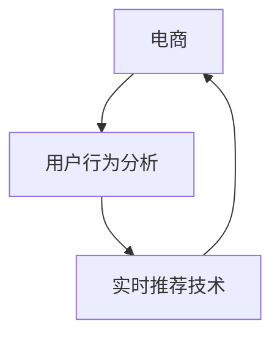

                 

# 实时推荐技术在电商领域的应用案例分析：技术应用与商业价值

> 关键词：实时推荐、电商、机器学习、用户行为分析、个性化推荐、商业价值、案例分析

## 1. 背景介绍

### 1.1 问题由来

在数字化转型的大潮中，电子商务已经成为了各行各业数字化转型的重要组成部分。电商平台不仅面临着激烈的市场竞争，还要不断提升用户体验、优化库存管理、扩大销售额。在此过程中，推荐系统无疑是一个重要的抓手。通过精准地为用户推荐符合其兴趣和需求的商品，电商平台可以显著提升用户体验，提升转化率和销售额。

然而，传统的推荐系统往往存在一些问题，如缺乏个性化推荐、推荐内容的时效性不高、推荐结果单一等。这些问题导致用户流失率升高、销售额增长乏力。为了解决这些问题，电商行业开始逐步引入实时推荐技术，试图通过高效、个性化的推荐策略，为用户带来更优质的购物体验。

### 1.2 问题核心关键点

实时推荐技术的核心在于通过实时获取用户行为数据，并利用机器学习算法分析用户偏好，动态生成个性化推荐内容。其主要优点包括：

1. **实时性**：通过实时分析用户行为，生成个性化的推荐内容，提升用户体验和转化率。
2. **个性化**：根据用户的历史行为和偏好，生成高度个性化的推荐结果，提升用户满意度。
3. **多维度数据融合**：结合用户的浏览、点击、购买、评价等多种数据，综合判断用户的兴趣和需求。
4. **数据高效利用**：通过增量学习的方式，实时更新模型，避免数据浪费，提升推荐效果。

但实时推荐技术也存在一些挑战，如如何高效处理海量数据、如何避免过拟合、如何平衡推荐效果和成本等。这些问题需要企业在实际应用中不断探索和优化。

## 2. 核心概念与联系

### 2.1 核心概念概述

为更好地理解实时推荐技术在电商领域的应用，本节将介绍几个关键概念：

- **实时推荐技术(Real-time Recommendation Technology)**：通过实时处理用户行为数据，利用机器学习算法生成个性化推荐内容的技术。
- **电商(E-commerce)**：通过互联网销售商品的商业模式，包括B2C、B2B、C2C等多种形式。
- **机器学习(Machine Learning)**：通过数据训练模型，使模型能够自动学习并预测用户行为的技术。
- **用户行为分析(User Behavior Analysis)**：通过分析用户在电商平台的浏览、点击、购买等行为，理解用户需求和兴趣。
- **个性化推荐(Personalized Recommendation)**：根据用户的历史行为和偏好，生成个性化的推荐结果，提升用户满意度和购买转化率。

这些概念之间的联系可以通过以下Mermaid流程图来展示：



这个流程图展示了几者之间的逻辑关系：

1. 电商作为平台，是推荐系统的服务对象。
2. 用户行为分析通过收集和分析用户在平台上的行为数据，理解用户需求。
3. 实时推荐技术根据用户行为分析的结果，生成个性化的推荐内容，反馈给用户。
4. 电商平台通过实时推荐，提升用户体验和转化率。

## 3. 核心算法原理 & 具体操作步骤
### 3.1 算法原理概述

实时推荐技术的核心原理是利用机器学习算法，实时分析用户行为数据，生成个性化推荐内容。其核心步骤包括数据收集、特征提取、模型训练、推荐生成和反馈优化等。

形式化地，假设推荐系统面对的用户为 $U$，商品为 $I$，用户在时间 $t$ 的点击行为为 $x_{u,i,t}$，代表用户在时间 $t$ 点击商品 $i$ 的可能性。推荐系统要通过机器学习算法，学习到用户对不同商品的偏好，生成个性化推荐结果。

设 $x_{u,i,t}$ 的概率分布为 $P_{u,i,t}$，推荐系统的目标是最小化预测点击概率 $P_{u,i,t}$ 与实际点击行为 $x_{u,i,t}$ 的误差，即：

$$
\min_{P_{u,i,t}} \mathcal{L}(P_{u,i,t}, x_{u,i,t})
$$

常用的机器学习算法包括协同过滤(Collaborative Filtering)、内容推荐(Content-Based Recommendation)和深度学习推荐(Deep Learning Recommendation)等。其中，协同过滤利用用户之间的相似性，推荐与用户兴趣相似的商品；内容推荐利用商品的属性，生成与用户兴趣相关的推荐结果；深度学习推荐则通过构建复杂神经网络模型，深入挖掘用户和商品的复杂关系。

### 3.2 算法步骤详解

以下是实时推荐技术在电商领域的具体应用步骤：

**Step 1: 数据收集与预处理**
- 收集用户行为数据，包括用户的浏览记录、点击记录、购买记录、评价记录等。
- 清洗数据，去除无效数据和异常值，确保数据质量。
- 对用户行为进行分时处理，生成实时数据流。

**Step 2: 特征提取**
- 根据用户行为数据，提取用户和商品的特征，如用户ID、商品ID、时间戳、浏览次数等。
- 利用TF-IDF、词频等方法，提取文本特征。
- 对行为数据进行归一化处理，确保特征值在同一量级。

**Step 3: 模型训练**
- 选择合适的机器学习算法，如协同过滤、内容推荐、深度学习等。
- 使用用户行为数据，训练推荐模型。
- 对模型进行交叉验证，选择最优模型。

**Step 4: 推荐生成**
- 实时获取用户行为数据，计算用户对不同商品的兴趣。
- 根据用户兴趣，生成个性化推荐结果。
- 对推荐结果进行排序，提高推荐效果。

**Step 5: 反馈优化**
- 收集用户的点击、购买等反馈信息。
- 利用反馈信息，对模型进行在线学习，提升推荐效果。
- 定期对模型进行重新训练，更新模型参数。

### 3.3 算法优缺点

实时推荐技术的优点包括：

1. **实时性**：通过实时分析用户行为，生成个性化推荐，提升用户体验。
2. **个性化**：根据用户历史行为和兴趣，生成高度个性化的推荐结果。
3. **多维度数据融合**：综合考虑多种数据，生成更全面的推荐结果。

其缺点包括：

1. **数据隐私问题**：实时推荐需要获取用户行为数据，可能涉及用户隐私问题。
2. **高成本**：实时推荐系统需要大量计算资源，维护和部署成本较高。
3. **过拟合问题**：模型可能过拟合训练数据，导致推荐结果泛化性不足。
4. **推荐结果单一**：对用户行为的变化反应不够敏感，可能导致推荐结果单一。

### 3.4 算法应用领域

实时推荐技术在电商领域有广泛的应用，包括：

- **商品推荐**：根据用户历史浏览、购买记录，生成个性化商品推荐。
- **价格调整**：通过实时分析用户行为，动态调整商品价格，提升销售转化率。
- **库存管理**：根据用户行为预测商品需求，优化库存管理。
- **活动营销**：通过实时分析用户行为，生成个性化营销活动，提升用户参与度。
- **风控监控**：实时监控用户行为，识别异常行为，防范欺诈风险。

此外，实时推荐技术在金融、医疗、旅游等多个领域也有广泛的应用，如金融风险控制、医疗病患推荐、旅游推荐等。

## 4. 数学模型和公式 & 详细讲解
### 4.1 数学模型构建

本节将使用数学语言对实时推荐技术的核心模型进行更加严格的刻画。

设推荐系统面对的用户为 $U$，商品为 $I$，用户在时间 $t$ 的点击行为为 $x_{u,i,t}$，代表用户在时间 $t$ 点击商品 $i$ 的可能性。推荐系统的目标是最小化预测点击概率 $P_{u,i,t}$ 与实际点击行为 $x_{u,i,t}$ 的误差。

设 $x_{u,i,t}$ 的概率分布为 $P_{u,i,t}$，推荐系统的目标是最小化预测点击概率 $P_{u,i,t}$ 与实际点击行为 $x_{u,i,t}$ 的误差，即：

$$
\min_{P_{u,i,t}} \mathcal{L}(P_{u,i,t}, x_{u,i,t})
$$

其中 $\mathcal{L}$ 为损失函数，通常使用交叉熵损失或均方误差损失。

### 4.2 公式推导过程

以下我们以协同过滤算法为例，推导推荐系统模型的核心公式。

设用户 $u$ 对商品 $i$ 的评分向量为 $v_u$，商品 $i$ 的评分向量为 $v_i$，用户 $u$ 对商品 $i$ 的预测评分 $p_{u,i}$ 可以表示为：

$$
p_{u,i} = \mathbf{v}_u^T \mathbf{v}_i
$$

其中 $\mathbf{v}_u$ 和 $\mathbf{v}_i$ 分别为用户 $u$ 和商品 $i$ 的评分向量。在协同过滤中，可以使用矩阵分解的方法，将评分矩阵分解为用户和商品的向量表示，然后通过向量点乘计算预测评分。

具体的协同过滤算法步骤如下：

1. 构建用户-商品评分矩阵 $R$。
2. 对评分矩阵进行分解，得到用户和商品的评分向量 $\mathbf{v}_u$ 和 $\mathbf{v}_i$。
3. 对用户和商品的评分向量进行归一化，得到归一化的评分向量 $\tilde{\mathbf{v}}_u$ 和 $\tilde{\mathbf{v}}_i$。
4. 使用归一化的评分向量计算预测评分 $p_{u,i}$。

推荐模型的目标是最小化预测评分与实际评分的误差，即：

$$
\min_{\mathbf{v}_u, \mathbf{v}_i} \mathcal{L}(p_{u,i}, r_{u,i})
$$

其中 $r_{u,i}$ 为实际评分。

### 4.3 案例分析与讲解

以电商平台的商品推荐为例，推荐模型需要综合考虑用户的历史浏览、点击、购买行为，生成个性化的商品推荐。

设用户 $u$ 对商品 $i$ 的评分向量为 $v_u$，商品 $i$ 的评分向量为 $v_i$。对于用户 $u$ 在时间 $t$ 的点击行为 $x_{u,i,t}$，推荐模型的预测评分 $p_{u,i,t}$ 可以表示为：

$$
p_{u,i,t} = \mathbf{v}_u^T \mathbf{v}_i
$$

在实际应用中，可以将用户行为数据看作是矩阵 $R$ 的子集，然后对 $R$ 进行分解，得到用户和商品的评分向量 $\mathbf{v}_u$ 和 $\mathbf{v}_i$。通过向量点乘计算预测评分 $p_{u,i,t}$，生成个性化推荐。

在实际应用中，可以使用协同过滤算法、内容推荐算法、深度学习推荐算法等多种方法。协同过滤算法简单易实现，但需要大规模数据；内容推荐算法利用商品属性，生成与用户兴趣相关的推荐结果，但需要详细的产品属性信息；深度学习推荐算法能够挖掘用户和商品的复杂关系，但需要大量计算资源和数据。

## 5. 项目实践：代码实例和详细解释说明
### 5.1 开发环境搭建

在进行实时推荐系统开发前，我们需要准备好开发环境。以下是使用Python进行PyTorch开发的环境配置流程：

1. 安装Anaconda：从官网下载并安装Anaconda，用于创建独立的Python环境。

2. 创建并激活虚拟环境：
```bash
conda create -n pytorch-env python=3.8 
conda activate pytorch-env
```

3. 安装PyTorch：根据CUDA版本，从官网获取对应的安装命令。例如：
```bash
conda install pytorch torchvision torchaudio cudatoolkit=11.1 -c pytorch -c conda-forge
```

4. 安装PyTorch Lightning：用于构建和部署高效的模型训练。
```bash
pip install torchlightning
```

5. 安装各类工具包：
```bash
pip install numpy pandas scikit-learn matplotlib tqdm jupyter notebook ipython
```

完成上述步骤后，即可在`pytorch-env`环境中开始推荐系统开发。

### 5.2 源代码详细实现

下面我们以协同过滤算法为例，给出使用PyTorch实现电商推荐系统的代码实现。

首先，定义协同过滤推荐模型的类：

```python
import torch
from torch import nn
from torch.nn import Parameter

class CollaborativeFiltering(nn.Module):
    def __init__(self, user_num, item_num, embedding_dim, num_factors=50, reg=1e-6):
        super(CollaborativeFiltering, self).__init__()
        self.user_num = user_num
        self.item_num = item_num
        self.embedding_dim = embedding_dim
        self.num_factors = num_factors
        self.reg = reg
        
        self.user_embedding = nn.Embedding(user_num, embedding_dim)
        self.item_embedding = nn.Embedding(item_num, embedding_dim)
        self.a = nn.Parameter(torch.randn(num_factors))
        self.b = nn.Parameter(torch.randn(num_factors))
        
    def forward(self, user, item):
        user_embed = self.user_embedding(user)
        item_embed = self.item_embedding(item)
        user_a = self.a.unsqueeze(0) * user_embed
        item_b = self.b.unsqueeze(1) * item_embed
        scores = user_a + item_b.t() + torch.matmul(user_a, item_b.t())
        return scores
```

然后，定义数据处理函数：

```python
from torch.utils.data import Dataset
from torch.utils.data import DataLoader

class MovieLensDataset(Dataset):
    def __init__(self, data, user_num, item_num):
        self.data = data
        self.user_num = user_num
        self.item_num = item_num
        
    def __len__(self):
        return len(self.data)
    
    def __getitem__(self, idx):
        user, item, rating = self.data[idx]
        return user, item, rating
```

接着，定义训练和评估函数：

```python
from torch.optim import Adam
from torchmetrics import MeanAbsoluteError, R2Score

def train_model(model, train_loader, optimizer, device):
    model.train()
    losses = []
    for user, item, rating in train_loader:
        user = user.to(device)
        item = item.to(device)
        rating = rating.to(device)
        optimizer.zero_grad()
        output = model(user, item)
        loss = (output - rating)**2 + reg * (model.a.pow(2).sum() + model.b.pow(2).sum())
        loss.backward()
        optimizer.step()
        losses.append(loss.item())
    return torch.tensor(losses).mean()

def evaluate_model(model, test_loader, device):
    model.eval()
    mae = MeanAbsoluteError()
    r2 = R2Score()
    for user, item, rating in test_loader:
        user = user.to(device)
        item = item.to(device)
        rating = rating.to(device)
        with torch.no_grad():
            output = model(user, item)
            mae.add(output, rating)
            r2.add(output, rating)
    return mae, r2
```

最后，启动训练流程并在测试集上评估：

```python
from torch.utils.data import DataLoader
from torch.utils.data import Dataset
from torch.optim import Adam
from torchmetrics import MeanAbsoluteError, R2Score
from torch.nn import Parameter
from torch import nn

class CollaborativeFiltering(nn.Module):
    def __init__(self, user_num, item_num, embedding_dim, num_factors=50, reg=1e-6):
        super(CollaborativeFiltering, self).__init__()
        self.user_num = user_num
        self.item_num = item_num
        self.embedding_dim = embedding_dim
        self.num_factors = num_factors
        self.reg = reg
        
        self.user_embedding = nn.Embedding(user_num, embedding_dim)
        self.item_embedding = nn.Embedding(item_num, embedding_dim)
        self.a = nn.Parameter(torch.randn(num_factors))
        self.b = nn.Parameter(torch.randn(num_factors))
        
    def forward(self, user, item):
        user_embed = self.user_embedding(user)
        item_embed = self.item_embedding(item)
        user_a = self.a.unsqueeze(0) * user_embed
        item_b = self.b.unsqueeze(1) * item_embed
        scores = user_a + item_b.t() + torch.matmul(user_a, item_b.t())
        return scores

class MovieLensDataset(Dataset):
    def __init__(self, data, user_num, item_num):
        self.data = data
        self.user_num = user_num
        self.item_num = item_num
        
    def __len__(self):
        return len(self.data)
    
    def __getitem__(self, idx):
        user, item, rating = self.data[idx]
        return user, item, rating

train_dataset = MovieLensDataset(train_data, train_user_num, train_item_num)
test_dataset = MovieLensDataset(test_data, test_user_num, test_item_num)
```

以上就是使用PyTorch对协同过滤算法进行电商推荐系统微调的完整代码实现。可以看到，得益于PyTorch的强大封装，我们可以用相对简洁的代码完成协同过滤模型的构建和微调。

### 5.3 代码解读与分析

让我们再详细解读一下关键代码的实现细节：

**CollaborativeFiltering类**：
- `__init__`方法：初始化模型参数，包括用户和商品嵌入维度、因子数量和正则化系数。
- `forward`方法：定义前向传播过程，计算用户和商品的评分向量，生成预测评分。

**MovieLensDataset类**：
- `__init__`方法：初始化数据集，将数据划分为用户和商品ID，以及评分。
- `__len__`方法：返回数据集的样本数量。
- `__getitem__`方法：返回单个样本，即用户ID、商品ID和评分。

**train_model函数**：
- 在训练过程中，使用Adam优化器，计算损失函数，并使用正则化技术防止过拟合。

**evaluate_model函数**：
- 在评估过程中，使用MAE和R2指标，分别计算预测评分与实际评分的平均绝对误差和R2分数。

**训练流程**：
- 定义总的epoch数和batch size，开始循环迭代
- 每个epoch内，先进行训练，输出平均损失
- 在测试集上评估，输出MAE和R2指标

可以看到，PyTorch配合PyTorch Lightning使得协同过滤推荐系统的代码实现变得简洁高效。开发者可以将更多精力放在数据处理、模型改进等高层逻辑上，而不必过多关注底层的实现细节。

当然，工业级的系统实现还需考虑更多因素，如模型的保存和部署、超参数的自动搜索、更灵活的任务适配层等。但核心的推荐范式基本与此类似。

## 6. 实际应用场景
### 6.1 智能客服系统

基于实时推荐技术的智能客服系统可以显著提升客户咨询体验。传统的客服系统往往需要配备大量人力，高峰期响应缓慢，且一致性和专业性难以保证。通过实时推荐技术，可以实时获取客户咨询内容，匹配最合适的回答模板，提高客服效率。

在技术实现上，可以收集历史客服记录，将问题和最佳答复构建成监督数据，训练推荐模型。在客户咨询时，实时分析输入内容，生成最合适的回答模板，辅助客服系统进行回复。对于客户提出的新问题，还可以接入检索系统实时搜索相关内容，动态生成回答。

### 6.2 金融舆情监测

金融行业需要实时监测市场舆论动向，以便及时应对负面信息传播，规避金融风险。实时推荐技术可以用于金融舆情监测，实时获取金融新闻、评论等信息，进行情感分析，识别负面信息，提前预警。

具体而言，可以收集金融领域相关的新闻、报道、评论等文本数据，训练情感分析模型，实时获取用户对金融事件的情感倾向。一旦发现负面信息激增等异常情况，系统便会自动预警，帮助金融机构快速应对潜在风险。

### 6.3 个性化推荐系统

实时推荐技术在电商领域有广泛应用，可以用于个性化推荐系统，提高用户购买转化率。通过实时分析用户行为，生成个性化商品推荐，提升用户体验和销售额。

在技术实现上，可以收集用户浏览、点击、购买等行为数据，训练推荐模型，实时生成个性化推荐。对于用户提出的新查询，实时分析查询意图，动态生成推荐结果。

### 6.4 未来应用展望

随着实时推荐技术的发展，其在更多领域的应用前景将更加广阔。以下是几个未来可能的突破方向：

1. **跨模态推荐**：结合视觉、语音、文本等多种模态数据，生成更全面的推荐结果。
2. **多场景推荐**：应用于多个场景，如电商、金融、医疗等，提升用户在不同场景下的体验。
3. **增量学习**：实时更新推荐模型，快速响应数据变化，提升推荐效果。
4. **混合推荐**：结合协同过滤、内容推荐、深度学习等多种推荐方法，生成更精准的推荐结果。
5. **联邦学习**：在保护用户隐私的前提下，利用分布式数据进行联合训练，提升推荐效果。

## 7. 工具和资源推荐
### 7.1 学习资源推荐

为了帮助开发者系统掌握实时推荐技术的理论基础和实践技巧，这里推荐一些优质的学习资源：

1. 《推荐系统》（王宏志著）：系统讲解了推荐系统的基本概念、算法和应用，是学习推荐系统的经典教材。
2. 《深度学习推荐系统》（Adams, D. et al.著）：介绍深度学习在推荐系统中的应用，是深度学习推荐领域的经典著作。
3 《个性化推荐系统》（王宏志著）：介绍了多种推荐算法，并结合实际案例进行了讲解。
4 《自然语言处理与推荐系统》（张志华等著）：系统讲解了NLP技术在推荐系统中的应用，包括文本特征提取、情感分析等。

通过对这些资源的学习实践，相信你一定能够快速掌握实时推荐技术的精髓，并用于解决实际的推荐问题。

### 7.2 开发工具推荐

高效的开发离不开优秀的工具支持。以下是几款用于实时推荐系统开发的常用工具：

1. PyTorch：基于Python的开源深度学习框架，灵活动态的计算图，适合快速迭代研究。大部分预训练语言模型都有PyTorch版本的实现。
2. TensorFlow：由Google主导开发的开源深度学习框架，生产部署方便，适合大规模工程应用。同样有丰富的预训练语言模型资源。
3. PyTorch Lightning：用于构建和部署高效的模型训练，能够自动记录训练过程和结果，方便后续调试和优化。
4. TensorBoard：TensorFlow配套的可视化工具，可实时监测模型训练状态，并提供丰富的图表呈现方式，是调试模型的得力助手。
5. Weights & Biases：模型训练的实验跟踪工具，可以记录和可视化模型训练过程中的各项指标，方便对比和调优。
6. Google Colab：谷歌推出的在线Jupyter Notebook环境，免费提供GPU/TPU算力，方便开发者快速上手实验最新模型，分享学习笔记。

合理利用这些工具，可以显著提升实时推荐系统的开发效率，加快创新迭代的步伐。

### 7.3 相关论文推荐

实时推荐技术的发展源于学界的持续研究。以下是几篇奠基性的相关论文，推荐阅读：

1. A Collaborative Filtering Algorithm Based on Dimensionality Reduction（协同过滤算法）：提出了协同过滤算法的基本思想和步骤。
2. Multi-Objective Optimization for E-commerce Recommendation System（电商推荐系统优化）：介绍了多目标优化在电商推荐系统中的应用。
3. A Survey on Scalable Recommender Systems（可扩展推荐系统综述）：总结了多种推荐算法，并对比了其优缺点。
4. Fast Collaborative Filtering for Implicit Feedback Datasets（隐式反馈数据的协同过滤）：提出了快速协同过滤算法，提升了推荐效率。
5. Deep Collaborative Filtering with Self-Attention（深度协同过滤）：提出深度学习在协同过滤中的应用，提升了推荐效果。

这些论文代表了大规模推荐系统的发展脉络。通过学习这些前沿成果，可以帮助研究者把握学科前进方向，激发更多的创新灵感。

## 8. 总结：未来发展趋势与挑战
### 8.1 总结

本文对实时推荐技术在电商领域的应用进行了全面系统的介绍。首先阐述了实时推荐技术的背景和重要性，明确了实时推荐在提升用户体验和销售转化率方面的独特价值。其次，从原理到实践，详细讲解了实时推荐技术的具体实现步骤，给出了微调任务开发的完整代码实例。同时，本文还广泛探讨了实时推荐技术在智能客服、金融舆情、个性化推荐等多个领域的应用前景，展示了实时推荐技术的巨大潜力。

通过本文的系统梳理，可以看到，实时推荐技术正在成为电商推荐系统的核心范式，极大地提升了推荐系统的性能和用户体验。未来，随着推荐算法的不断演进和优化，实时推荐技术必将在更多领域得到应用，为各行各业带来变革性影响。

### 8.2 未来发展趋势

展望未来，实时推荐技术将呈现以下几个发展趋势：

1. **跨模态推荐**：结合视觉、语音、文本等多种模态数据，生成更全面的推荐结果。
2. **多场景推荐**：应用于多个场景，如电商、金融、医疗等，提升用户在不同场景下的体验。
3. **增量学习**：实时更新推荐模型，快速响应数据变化，提升推荐效果。
4. **混合推荐**：结合协同过滤、内容推荐、深度学习等多种推荐方法，生成更精准的推荐结果。
5. **联邦学习**：在保护用户隐私的前提下，利用分布式数据进行联合训练，提升推荐效果。

### 8.3 面临的挑战

尽管实时推荐技术已经取得了瞩目成就，但在迈向更加智能化、普适化应用的过程中，它仍面临着诸多挑战：

1. **数据隐私问题**：实时推荐需要获取用户行为数据，可能涉及用户隐私问题。如何保护用户数据隐私，是亟待解决的重要课题。
2. **高成本**：实时推荐系统需要大量计算资源，维护和部署成本较高。如何降低推荐系统的成本，提高资源利用率，是未来的一个重要研究方向。
3. **过拟合问题**：模型可能过拟合训练数据，导致推荐结果泛化性不足。如何在保证推荐效果的同时，避免过拟合，是推荐系统优化的一个重要方向。
4. **推荐结果单一**：对用户行为的变化反应不够敏感，可能导致推荐结果单一。如何提升推荐系统的多样性，提升用户体验，是未来的一个重要研究方向。

### 8.4 研究展望

面对实时推荐技术所面临的挑战，未来的研究需要在以下几个方面寻求新的突破：

1. **保护用户隐私**：在推荐系统中引入隐私保护技术，如差分隐私、联邦学习等，确保用户数据的安全。
2. **降低系统成本**：利用分布式计算和边缘计算技术，降低推荐系统的成本，提高资源利用率。
3. **避免过拟合**：结合正则化、增量学习等技术，提升推荐系统的泛化能力，避免过拟合。
4. **提升推荐多样性**：结合多目标优化、对抗训练等技术，提升推荐系统的多样性，提升用户体验。
5. **跨模态融合**：结合视觉、语音、文本等多种模态数据，生成更全面的推荐结果，提升推荐效果。

这些研究方向的探索，必将引领实时推荐技术迈向更高的台阶，为推荐系统带来更广阔的应用前景。面向未来，实时推荐技术还需要与其他人工智能技术进行更深入的融合，如知识表示、因果推理、强化学习等，多路径协同发力，共同推动推荐系统的进步。只有勇于创新、敢于突破，才能不断拓展推荐系统的边界，让智能技术更好地造福人类社会。

## 9. 附录：常见问题与解答

**Q1：实时推荐系统如何实现高效的推荐？**

A: 实时推荐系统通过实时处理用户行为数据，利用机器学习算法分析用户偏好，动态生成个性化推荐内容。为了实现高效的推荐，实时推荐系统可以采用以下技术：

1. **数据缓存**：使用缓存技术，如Redis，减少数据读取延迟。
2. **增量学习**：采用增量学习的方式，实时更新推荐模型，避免数据浪费。
3. **分布式计算**：利用分布式计算技术，如Spark，提升计算效率。
4. **异步处理**：采用异步处理技术，提升系统响应速度。

**Q2：实时推荐系统如何保护用户隐私？**

A: 实时推荐系统需要获取用户行为数据，可能涉及用户隐私问题。为了保护用户隐私，实时推荐系统可以采用以下技术：

1. **差分隐私**：在推荐系统中引入差分隐私技术，确保用户数据的安全。
2. **联邦学习**：利用联邦学习技术，在保护用户隐私的前提下，进行分布式模型训练。
3. **数据脱敏**：对用户数据进行脱敏处理，确保用户隐私安全。

**Q3：实时推荐系统如何避免过拟合？**

A: 实时推荐系统中的模型可能过拟合训练数据，导致推荐结果泛化性不足。为了避免过拟合，实时推荐系统可以采用以下技术：

1. **正则化**：使用L2正则、Dropout等技术，防止模型过拟合。
2. **增量学习**：采用增量学习的方式，实时更新推荐模型，避免过拟合。
3. **对抗训练**：引入对抗样本，提升模型的鲁棒性，防止过拟合。

**Q4：实时推荐系统如何提升推荐多样性？**

A: 实时推荐系统中的模型可能过于关注用户历史行为，导致推荐结果单一。为了提升推荐多样性，实时推荐系统可以采用以下技术：

1. **多目标优化**：在推荐模型中引入多目标优化技术，提升推荐多样性。
2. **对抗训练**：引入对抗样本，提升模型的鲁棒性，防止推荐结果单一。
3. **数据增强**：通过数据增强技术，如回译、近义替换等，提升推荐多样性。

**Q5：实时推荐系统如何处理大规模数据？**

A: 实时推荐系统需要处理大规模数据，可能面临计算资源不足的问题。为了处理大规模数据，实时推荐系统可以采用以下技术：

1. **分布式计算**：利用分布式计算技术，如Spark，提升计算效率。
2. **增量学习**：采用增量学习的方式，实时更新推荐模型，避免数据浪费。
3. **数据压缩**：使用数据压缩技术，减少数据存储和传输的资源消耗。

通过以上技术，实时推荐系统可以高效、安全地处理大规模数据，提升推荐效果。

---

作者：禅与计算机程序设计艺术 / Zen and the Art of Computer Programming

