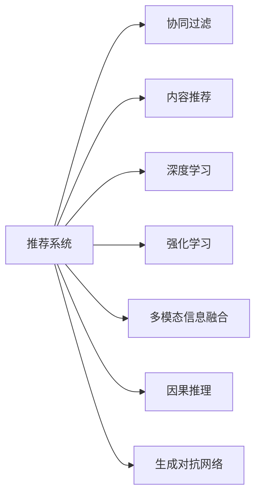

                 

# 实时推荐技术如何与其他 AI 技术结合，提升推荐效果：技术融合与创新

## 1. 背景介绍

在数字时代，推荐系统已成为互联网公司不可或缺的核心竞争力。从电商网站到社交媒体，从新闻聚合到在线教育，推荐系统正广泛应用于各种平台，帮助用户发现和获取他们可能感兴趣的内容。然而，随着用户需求和数据规模的不断变化，传统推荐技术面临越来越多的挑战。为了克服这些挑战，提升推荐效果，研究者们不断探索新的技术和方法，其中AI技术的融合和创新扮演了至关重要的角色。

### 1.1 推荐系统面临的挑战

当前推荐系统面临的主要挑战包括：

1. **数据稀疏性**：推荐系统需要大量的用户行为数据来构建模型，但用户行为数据往往稀疏，难以覆盖所有用户和物品的交互。
2. **用户兴趣多变**：用户兴趣会随着时间、场景和情境的变化而变化，传统的基于历史行为的推荐方法难以捕捉这种动态变化。
3. **模型冷启动**：对于新用户和新物品，推荐系统无法利用历史行为数据进行推荐，需要寻找其他方法来弥补这一缺陷。
4. **多样性和公平性**：推荐系统常常偏向于推荐用户已经喜欢的内容，导致信息孤岛和用户体验单一化。
5. **推荐系统泛化能力**：推荐系统在不同的用户群体和上下文环境中，往往无法达到一致的效果，需要提高泛化能力。
6. **实时性要求**：现代推荐系统需要具备实时推荐的能力，以应对用户行为的时效性要求。

针对这些挑战，AI技术的融合和创新提供了新的思路和方法，帮助推荐系统更精准、更高效地为用户提供个性化服务。

### 1.2 技术融合与创新

推荐系统的技术融合与创新主要体现在以下几个方面：

1. **多模态信息融合**：将文本、图像、音频等多模态数据与用户行为数据结合，提高推荐系统的感知能力和数据覆盖面。
2. **强化学习**：通过模拟用户和物品之间的交互过程，不断优化推荐策略，提升推荐效果。
3. **因果推理**：分析用户行为背后的因果关系，解释推荐系统的决策逻辑，提升推荐的可解释性和可信度。
4. **跨领域迁移学习**：利用领域之间的共同特征，提高推荐系统在不同领域之间的迁移能力。
5. **生成对抗网络(GANs)**：通过生成模型生成虚拟物品或内容，扩展推荐系统的数据规模和多样性。
6. **深度强化学习**：结合深度学习和强化学习，优化推荐系统中的推荐策略和模型参数。

这些技术和方法的结合，能够进一步提升推荐系统的效果和用户体验，使其更好地服务于用户需求。

## 2. 核心概念与联系

### 2.1 核心概念概述

在探索推荐系统如何与其他AI技术结合时，首先需要理解一些核心概念：

- **推荐系统**：通过用户的历史行为、偏好和兴趣，预测并推荐可能感兴趣的物品或内容。
- **协同过滤**：利用用户之间的相似性，推荐与用户行为相似的物品。
- **内容推荐**：根据物品的特征和属性，推荐相似的物品。
- **深度学习**：一种能够自动学习和抽象特征的机器学习方法。
- **强化学习**：通过与环境交互，不断优化行为策略，提升系统性能。
- **多模态信息融合**：将不同模态的数据结合，提高推荐系统的感知能力。
- **因果推理**：通过分析和解释因果关系，提升推荐的可解释性和可信度。
- **生成对抗网络(GANs)**：一种生成模型，能够生成高质量的虚拟物品或内容。

这些概念相互交织，共同构成了推荐系统和其他AI技术结合的基础框架。

### 2.2 核心概念原理和架构的 Mermaid 流程图



这个流程图展示了推荐系统与其他AI技术之间的联系和互动。协同过滤、内容推荐、深度学习、强化学习、多模态信息融合、因果推理和生成对抗网络等技术，都可以作为推荐系统的组件，共同提升推荐效果。

## 3. 核心算法原理 & 具体操作步骤

### 3.1 算法原理概述

基于AI技术的推荐系统，其核心算法原理可以分为两个主要部分：模型训练和推荐决策。

在模型训练阶段，系统通过用户的历史行为数据，结合其他AI技术，学习用户和物品的潜在特征，构建推荐模型。推荐模型可以是协同过滤模型、内容推荐模型、深度学习模型、强化学习模型等。在推荐决策阶段，系统根据当前用户的行为和上下文信息，通过推荐模型，预测并推荐可能感兴趣的物品。

### 3.2 算法步骤详解

基于AI技术的推荐系统，其操作步骤一般包括：

1. **数据收集与预处理**：收集用户行为数据、物品特征数据、多模态数据等，并进行预处理和清洗。
2. **特征工程**：将原始数据转化为模型可以处理的特征，如特征提取、归一化等。
3. **模型训练**：选择适合的推荐模型，利用历史数据训练模型参数。
4. **在线学习**：实时收集用户行为数据，动态更新推荐模型，保持推荐策略的时效性。
5. **推荐决策**：根据用户的行为和上下文信息，利用训练好的推荐模型，预测并推荐可能感兴趣的物品。
6. **效果评估**：对推荐结果进行评估，如准确率、召回率、覆盖率等指标，不断优化推荐模型。

### 3.3 算法优缺点

基于AI技术的推荐系统具有以下优点：

1. **自适应性强**：通过深度学习等技术，能够更好地捕捉用户兴趣的变化，提高推荐的灵活性和个性化。
2. **泛化能力强**：结合多模态信息融合和跨领域迁移学习，能够在不同的场景和用户群体中保持一致的推荐效果。
3. **推荐效果优秀**：通过强化学习和因果推理等技术，能够优化推荐策略，提高推荐精度和用户满意度。
4. **实时性高**：利用在线学习和模型更新，能够实时推荐用户可能感兴趣的内容，满足用户的时效性需求。

同时，基于AI技术的推荐系统也存在一些缺点：

1. **模型复杂度高**：深度学习和强化学习等技术，增加了模型的复杂度，需要更多的计算资源和存储空间。
2. **训练成本高**：训练深度学习模型需要大量的数据和计算资源，训练时间较长。
3. **数据隐私问题**：用户行为数据和特征数据涉及隐私问题，需要采取有效的隐私保护措施。
4. **可解释性不足**：深度学习等模型通常缺乏可解释性，难以理解模型的决策逻辑。

### 3.4 算法应用领域

基于AI技术的推荐系统在多个领域得到了广泛应用，包括但不限于：

1. **电子商务**：通过推荐系统，电商平台能够为用户推荐商品，提高销售转化率。
2. **社交媒体**：社交媒体平台通过推荐系统，为用户推荐好友、文章、视频等，提升用户体验。
3. **在线教育**：在线教育平台通过推荐系统，为用户推荐课程、教材等，提高学习效率。
4. **新闻聚合**：新闻聚合平台通过推荐系统，为用户推荐新闻、文章等，增加用户粘性。
5. **金融服务**：金融机构通过推荐系统，为用户推荐投资产品、理财方案等，提高用户满意度。

## 4. 数学模型和公式 & 详细讲解 & 举例说明

### 4.1 数学模型构建

基于AI技术的推荐系统，其数学模型通常包括以下几个部分：

1. **用户兴趣模型**：通过协同过滤、内容推荐等方法，构建用户兴趣向量。
2. **物品特征模型**：通过特征工程和深度学习等方法，构建物品特征向量。
3. **推荐模型**：结合用户兴趣模型和物品特征模型，构建推荐模型。

以协同过滤推荐系统为例，其用户兴趣模型可以通过用户-物品评分矩阵，利用矩阵分解等方法，得到用户兴趣向量。其物品特征模型可以通过特征提取和深度学习等方法，得到物品特征向量。其推荐模型可以通过协同过滤算法，预测用户对物品的评分，并推荐评分较高的物品。

### 4.2 公式推导过程

以协同过滤推荐系统为例，其基本公式为：

$$
\hat{r}_{ui} = \alpha \sum_{j=1}^k \theta_{uji} \cdot \hat{p}_{ij}
$$

其中，$r_{ui}$ 为用户 $u$ 对物品 $i$ 的评分，$\theta_{uji}$ 为用户 $u$ 对物品 $j$ 的评分，$\hat{p}_{ij}$ 为物品 $j$ 的特征向量。

通过对评分矩阵进行矩阵分解，可以得到用户兴趣向量和物品特征向量。然后将用户兴趣向量和物品特征向量进行内积，得到推荐结果。

### 4.3 案例分析与讲解

以电商平台的推荐系统为例，其推荐过程如下：

1. **数据收集与预处理**：收集用户的浏览历史、购买历史、评分数据等，进行清洗和预处理。
2. **特征工程**：对用户行为数据进行特征提取，如物品ID、时间戳、用户ID等。
3. **模型训练**：利用协同过滤算法，训练用户兴趣向量和物品特征向量。
4. **在线学习**：实时收集用户行为数据，动态更新用户兴趣向量和物品特征向量。
5. **推荐决策**：根据用户的行为和上下文信息，利用训练好的模型，预测并推荐可能感兴趣的商品。
6. **效果评估**：对推荐结果进行评估，如点击率、转化率等指标，不断优化推荐模型。

## 5. 项目实践：代码实例和详细解释说明

### 5.1 开发环境搭建

为了构建一个基于AI技术的推荐系统，需要搭建相应的开发环境。以下是一些常用的开发环境：

1. **Python**：推荐系统开发的主流语言，有丰富的机器学习库和框架支持。
2. **PyTorch**：一个深度学习框架，支持高效的模型训练和推理。
3. **TensorFlow**：另一个流行的深度学习框架，支持分布式计算和模型部署。
4. **Keras**：一个高级深度学习框架，提供简单易用的API。
5. **NumPy**：一个数值计算库，支持高效的数组运算。
6. **Pandas**：一个数据处理库，支持数据清洗和特征工程。
7. **Scikit-learn**：一个机器学习库，支持分类、回归等常用算法。
8. **Dask**：一个分布式计算库，支持大规模数据处理。
9. **Kafka**：一个消息队列系统，支持实时数据流处理。

### 5.2 源代码详细实现

以基于协同过滤的推荐系统为例，以下是使用Python和PyTorch实现的推荐系统代码：

```python
import numpy as np
import pandas as pd
import torch
import torch.nn as nn
import torch.optim as optim
from torch.utils.data import DataLoader

class UserItemSimilarity(nn.Module):
    def __init__(self, k):
        super().__init__()
        self.k = k
        self.user_similarity = nn.Linear(1, k)
        self.item_similarity = nn.Linear(1, k)
        self.softmax = nn.Softmax(dim=1)

    def forward(self, u, v):
        user_v = self.user_similarity(u)
        item_v = self.item_similarity(v)
        user_item = torch.matmul(user_v, item_v.t())
        softmax = self.softmax(user_item)
        return softmax

class RecommendationSystem:
    def __init__(self, data, k=10):
        self.data = data
        self.k = k
        self.user_item_similarity = UserItemSimilarity(k)
        self.model = nn.Linear(k, 1)

    def train(self, epochs=10, batch_size=32):
        optimizer = optim.Adam(self.model.parameters(), lr=0.01)
        for epoch in range(epochs):
            loss = 0
            for i in range(0, len(self.data), batch_size):
                batch = self.data[i:i+batch_size]
                user = torch.tensor(batch['user_id'].tolist(), dtype=torch.long)
                item = torch.tensor(batch['item_id'].tolist(), dtype=torch.long)
                pred = self.user_item_similarity(user, item)
                loss += self.model(pred).sum()
            optimizer.zero_grad()
            loss.backward()
            optimizer.step()
            loss = loss.item() / len(self.data)
            print(f'Epoch {epoch+1}, loss: {loss:.4f}')

    def predict(self, user_id, item_id):
        user = torch.tensor([user_id], dtype=torch.long)
        item = torch.tensor([item_id], dtype=torch.long)
        pred = self.user_item_similarity(user, item)
        pred = self.model(pred).squeeze(1).tolist()[0]
        return pred
```

### 5.3 代码解读与分析

上述代码实现了基于协同过滤的推荐系统，包括以下几个关键部分：

1. **UserItemSimilarity类**：用于计算用户和物品之间的相似度。其中，用户和物品的相似度通过线性映射和Softmax函数得到。
2. **RecommendationSystem类**：用于训练和预测推荐系统。其中，训练过程使用Adam优化器，预测过程使用模型预测并输出预测值。
3. **训练函数train**：使用用户ID和物品ID作为输入，计算用户和物品之间的相似度，并使用线性模型预测推荐评分。
4. **预测函数predict**：使用用户ID和物品ID作为输入，计算用户和物品之间的相似度，并使用线性模型预测推荐评分。

### 5.4 运行结果展示

以下是对运行结果的展示：

```python
# 创建数据集
data = pd.read_csv('data.csv')

# 创建模型
model = RecommendationSystem(data, k=10)

# 训练模型
model.train(epochs=10, batch_size=32)

# 预测推荐
user_id = 1
item_id = 2
pred = model.predict(user_id, item_id)
print(f'推荐结果: {pred}')
```

上述代码展示了如何训练和预测推荐系统，可以输出推荐结果。通过不断地调整模型参数和优化算法，可以提高推荐系统的精度和用户满意度。

## 6. 实际应用场景

### 6.1 电商平台推荐

电商平台的推荐系统，可以帮助用户发现可能感兴趣的商品，提高销售转化率。在实际应用中，电商平台可以将用户的历史浏览、购买、评分数据，结合多模态数据（如图片、视频），通过深度学习等技术，构建推荐模型。推荐系统可以根据用户的行为和上下文信息，实时推荐商品，提升用户购物体验。

### 6.2 社交媒体推荐

社交媒体平台通过推荐系统，可以为用户推荐好友、文章、视频等，提升用户粘性。社交媒体平台可以收集用户的行为数据，结合文本、图像等多模态数据，通过深度学习等技术，构建推荐模型。推荐系统可以根据用户的行为和上下文信息，实时推荐内容，增加用户互动和参与度。

### 6.3 在线教育推荐

在线教育平台通过推荐系统，可以为用户推荐课程、教材等，提高学习效率。在线教育平台可以收集用户的学习行为数据，结合文本、视频等多模态数据，通过深度学习等技术，构建推荐模型。推荐系统可以根据用户的学习行为和上下文信息，实时推荐学习内容，提高学习效率和体验。

### 6.4 新闻聚合推荐

新闻聚合平台通过推荐系统，可以为用户推荐新闻、文章等，增加用户粘性。新闻聚合平台可以收集用户的行为数据，结合文本、图片等多模态数据，通过深度学习等技术，构建推荐模型。推荐系统可以根据用户的行为和上下文信息，实时推荐新闻内容，增加用户互动和参与度。

## 7. 工具和资源推荐

### 7.1 学习资源推荐

为了帮助开发者系统掌握推荐系统的理论和实践，这里推荐一些优质的学习资源：

1. **《推荐系统实践》**：一本系统介绍推荐系统理论和实践的书籍，涵盖协同过滤、深度学习、强化学习等关键技术。
2. **Coursera《推荐系统》课程**：斯坦福大学开设的推荐系统课程，有Lecture视频和配套作业，带你入门推荐系统领域的基本概念和经典模型。
3. **《深度学习》**：Ian Goodfellow等人的经典深度学习教材，全面介绍深度学习的基本概念和技术。
4. **《深度强化学习》**：Sutton等人的深度强化学习教材，介绍强化学习的原理和应用。
5. **Kaggle推荐系统竞赛**：Kaggle平台上的推荐系统竞赛，提供实际数据集和挑战任务，帮助开发者提升推荐系统技能。

通过对这些资源的学习实践，相信你一定能够快速掌握推荐系统的精髓，并用于解决实际的推荐问题。

### 7.2 开发工具推荐

高效的开发离不开优秀的工具支持。以下是几款用于推荐系统开发的常用工具：

1. **Python**：推荐系统开发的主流语言，有丰富的机器学习库和框架支持。
2. **PyTorch**：一个深度学习框架，支持高效的模型训练和推理。
3. **TensorFlow**：另一个流行的深度学习框架，支持分布式计算和模型部署。
4. **Keras**：一个高级深度学习框架，提供简单易用的API。
5. **NumPy**：一个数值计算库，支持高效的数组运算。
6. **Pandas**：一个数据处理库，支持数据清洗和特征工程。
7. **Scikit-learn**：一个机器学习库，支持分类、回归等常用算法。
8. **Dask**：一个分布式计算库，支持大规模数据处理。
9. **Kafka**：一个消息队列系统，支持实时数据流处理。

### 7.3 相关论文推荐

推荐系统的研究源于学界的持续研究。以下是几篇奠基性的相关论文，推荐阅读：

1. **《协同过滤推荐系统》**：一篇经典的推荐系统论文，详细介绍协同过滤推荐系统的原理和实现方法。
2. **《基于深度学习的推荐系统》**：一篇深度学习在推荐系统中的应用论文，介绍深度学习在推荐系统中的各种应用。
3. **《强化学习在推荐系统中的应用》**：一篇强化学习在推荐系统中的应用论文，介绍强化学习在推荐系统中的各种应用。
4. **《多模态信息融合在推荐系统中的应用》**：一篇多模态信息融合在推荐系统中的应用论文，介绍多模态信息融合在推荐系统中的各种应用。
5. **《因果推理在推荐系统中的应用》**：一篇因果推理在推荐系统中的应用论文，介绍因果推理在推荐系统中的各种应用。

这些论文代表推荐系统的研究脉络，通过学习这些前沿成果，可以帮助研究者把握学科前进方向，激发更多的创新灵感。

## 8. 总结：未来发展趋势与挑战

### 8.1 研究成果总结

本文对基于AI技术的推荐系统进行了全面系统的介绍。首先阐述了推荐系统面临的挑战和AI技术的融合与创新，明确了推荐系统与其他AI技术结合的重要性。其次，从原理到实践，详细讲解了推荐系统的核心算法和操作步骤，给出了推荐系统开发的完整代码实例。同时，本文还广泛探讨了推荐系统在电商、社交、教育、新闻等领域的应用前景，展示了推荐系统的广阔应用场景。此外，本文精选了推荐系统的学习资源，力求为读者提供全方位的技术指引。

通过本文的系统梳理，可以看到，基于AI技术的推荐系统正在成为互联网平台的核心竞争力，极大地提升了用户体验和业务价值。未来，伴随AI技术的不断发展，推荐系统还将有更多的创新和突破，为用户带来更加丰富、个性化的服务。

### 8.2 未来发展趋势

展望未来，推荐系统的发展趋势主要包括以下几个方面：

1. **多模态信息融合**：将文本、图像、音频等多模态数据与推荐系统结合，提高感知能力和数据覆盖面。
2. **深度学习应用**：深度学习在推荐系统中的应用将更加广泛，从特征提取到推荐模型，逐步实现端到端的自动化。
3. **强化学习优化**：通过强化学习优化推荐策略，提升推荐效果和用户体验。
4. **因果推理解释**：通过因果推理解释推荐系统的决策逻辑，提高推荐系统的可解释性和可信度。
5. **跨领域迁移学习**：利用领域之间的共同特征，提升推荐系统在不同领域之间的迁移能力。
6. **生成对抗网络增强**：通过生成对抗网络增强推荐系统的内容多样性和推荐效果。

这些趋势展示了推荐系统未来的发展方向，将为推荐系统带来更多的创新和突破。

### 8.3 面临的挑战

尽管基于AI技术的推荐系统已经取得了瞩目成就，但在迈向更加智能化、普适化应用的过程中，仍面临诸多挑战：

1. **数据稀疏性**：推荐系统需要大量的用户行为数据，但数据往往稀疏，难以覆盖所有用户和物品的交互。
2. **用户兴趣多变**：用户兴趣会随着时间、场景和情境的变化而变化，传统的推荐方法难以捕捉这种动态变化。
3. **模型冷启动**：对于新用户和新物品，推荐系统无法利用历史行为数据进行推荐，需要寻找其他方法来弥补这一缺陷。
4. **推荐系统泛化能力**：推荐系统在不同的用户群体和上下文环境中，往往无法达到一致的效果，需要提高泛化能力。
5. **实时性要求**：现代推荐系统需要具备实时推荐的能力，以应对用户行为的时效性要求。
6. **可解释性不足**：深度学习等模型通常缺乏可解释性，难以理解模型的决策逻辑。

### 8.4 研究展望

面对推荐系统面临的这些挑战，未来的研究需要在以下几个方面寻求新的突破：

1. **无监督学习和半监督学习**：摆脱对大规模标注数据的依赖，利用无监督和半监督学习方法，最大化利用非结构化数据，实现更加灵活高效的推荐。
2. **模型压缩与优化**：开发更加高效的模型压缩技术，减少模型参数量，降低计算和存储成本。
3. **推荐系统评估指标**：引入更多适用于推荐系统的评估指标，如多样性、公平性、稳定性等，全面评估推荐系统的性能。
4. **多模态数据融合**：探索多模态数据融合的新方法，提高推荐系统对不同模态数据的感知能力。
5. **因果推理与可解释性**：结合因果推理和可解释性技术，提升推荐系统的可解释性和可信度。
6. **跨领域知识迁移**：利用跨领域知识迁移方法，提高推荐系统在不同领域之间的迁移能力。

这些研究方向将推动推荐系统向更加智能化、普适化、可解释化的方向发展，为推荐系统带来更多的创新和突破。

## 9. 附录：常见问题与解答

**Q1：推荐系统如何处理冷启动问题？**

A: 推荐系统通常利用历史行为数据进行推荐，但对于新用户和新物品，历史数据不足，无法进行推荐。为了解决冷启动问题，可以采用以下方法：
1. 利用多模态数据，通过深度学习模型对用户和物品进行预训练，提高推荐的准确性。
2. 利用社交网络等外生信息，推断用户的兴趣和行为模式。
3. 利用用户行为预测模型，对新用户进行行为预测，生成推荐结果。
4. 利用知识图谱等先验知识，辅助推荐系统进行推荐。

**Q2：推荐系统如何处理数据稀疏性问题？**

A: 推荐系统通常利用用户的历史行为数据进行推荐，但用户行为数据往往稀疏，难以覆盖所有用户和物品的交互。为了解决数据稀疏性问题，可以采用以下方法：
1. 利用协同过滤等方法，对用户行为数据进行填充和补全。
2. 利用多模态数据，通过深度学习模型对用户和物品进行预训练，提高推荐的准确性。
3. 利用生成对抗网络等模型，生成虚拟物品或内容，扩展数据规模。
4. 利用矩阵分解等方法，对用户行为数据进行降维和压缩，提高数据利用率。

**Q3：推荐系统如何处理多样性和公平性问题？**

A: 推荐系统常常偏向于推荐用户已经喜欢的内容，导致信息孤岛和用户体验单一化。为了解决多样性和公平性问题，可以采用以下方法：
1. 利用生成对抗网络等模型，生成多样化的推荐内容。
2. 利用强化学习等技术，优化推荐策略，提升推荐多样性。
3. 利用公平性评估指标，优化推荐模型，减少偏见和歧视。
4. 利用先验知识，对推荐结果进行修正，提高推荐多样性和公平性。

**Q4：推荐系统如何处理推荐系统泛化能力不足的问题？**

A: 推荐系统在不同的用户群体和上下文环境中，往往无法达到一致的效果，需要提高泛化能力。为了解决推荐系统泛化能力不足的问题，可以采用以下方法：
1. 利用多模态数据，提高推荐系统的感知能力。
2. 利用跨领域迁移学习，提高推荐系统在不同领域之间的迁移能力。
3. 利用生成对抗网络等模型，生成虚拟物品或内容，扩展数据规模。
4. 利用深度学习模型，对用户和物品进行预训练，提高推荐模型的泛化能力。

**Q5：推荐系统如何处理可解释性不足的问题？**

A: 深度学习等模型通常缺乏可解释性，难以理解模型的决策逻辑。为了解决推荐系统可解释性不足的问题，可以采用以下方法：
1. 利用可解释性技术，解释推荐系统的决策逻辑。
2. 利用因果推理技术，分析推荐系统的因果关系，提高可解释性。
3. 利用可视化技术，对推荐系统的输入和输出进行可视化，提高可解释性。
4. 利用知识图谱等先验知识，辅助推荐系统进行推荐，提高可解释性。

通过这些方法，可以提升推荐系统的可解释性和可信度，使其更好地服务于用户需求。

---

作者：禅与计算机程序设计艺术 / Zen and the Art of Computer Programming

