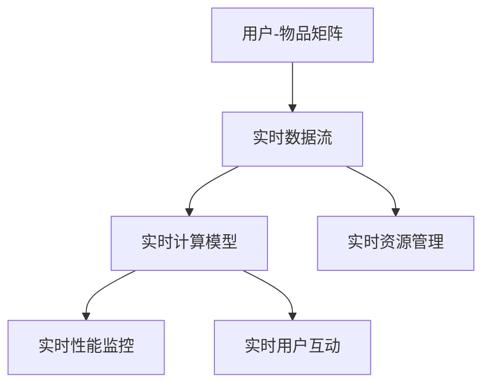

                 

## 1. 背景介绍

### 1.1 问题由来

推荐系统已广泛应用于电商、内容平台、金融、医疗等多个领域，旨在通过智能算法为用户推荐其感兴趣或可能感兴趣的商品、信息、服务等内容。随着互联网和数字技术的迅猛发展，推荐系统也在不断演进，其核心算法从简单的基于内容的推荐向深度学习和协同过滤的推荐转变。然而，传统的推荐算法在实时性、个性化、多样性等方面仍存在诸多不足，无法满足用户日益增长的需求。

在当前信息过载的背景下，如何构建一个既高效又个性化的推荐系统，实现实时推荐，成为各大平台面临的重大挑战。推荐系统优化的重点之一便是实时性。通过提升推荐系统的实时性，能够极大增强用户体验，提升平台的运营效率，驱动收入增长。

### 1.2 问题核心关键点

推荐系统的实时性优化涉及多个关键问题：

- **实时数据处理**：如何高效地处理实时数据流，并在毫秒级的时间内生成推荐结果。
- **实时计算模型**：在实时数据的基础上，如何快速构建和计算推荐模型。
- **实时性能监控**：如何实时监控推荐系统的性能，及时发现并解决问题。
- **实时用户互动**：如何实现与用户的实时互动，优化推荐效果。
- **实时资源管理**：如何在有限的资源约束下，实现推荐系统的快速部署和高效运行。

本文将从数据处理、计算模型、性能监控、用户互动和资源管理等方面，深入探讨如何构建一个高效、实时、个性化的推荐系统。

## 2. 核心概念与联系

### 2.1 核心概念概述

推荐系统（Recommendation System）的核心在于通过用户的历史行为、兴趣偏好、社交关系、实时数据等多种信息，构建用户与物品之间的相似度矩阵，从而为用户推荐其感兴趣或可能感兴趣的商品、内容等。

- **用户-物品矩阵**：通过用户的历史行为和兴趣偏好构建用户与物品之间的相似度矩阵，反映用户对不同物品的兴趣程度。
- **实时数据流**：指用户通过实时数据（如浏览记录、点击行为、社交媒体互动等）不断产生的数据流，是推荐系统优化的关键。
- **实时计算模型**：指基于实时数据流构建的推荐模型，通常采用深度学习、协同过滤等算法。
- **实时性能监控**：指实时监控推荐系统的性能指标，如响应时间、准确率、召回率等，以便及时调整系统参数和优化算法。
- **实时用户互动**：指通过用户反馈、A/B测试等方式，实时优化推荐系统的性能，提升用户体验。
- **实时资源管理**：指在实时数据处理和计算模型构建过程中，对系统资源（如CPU、内存、带宽等）进行实时管理，保证系统的稳定性和高效性。

这些核心概念之间的逻辑关系可以通过以下Mermaid流程图来展示：



### 2.2 核心概念原理和架构

- **用户-物品矩阵**：通过用户的历史行为（如点击、浏览、购买等）构建用户与物品之间的相似度矩阵，通常采用余弦相似度、Jaccard系数等方法计算。矩阵的每一行代表一个用户，每一列代表一个物品，值越接近1，表示用户对相应物品的兴趣程度越高。
- **实时数据流**：指用户通过实时数据不断产生的数据流，包括浏览记录、点击行为、社交媒体互动等。数据流处理通常采用流处理框架，如Apache Kafka、Apache Flink等。
- **实时计算模型**：指基于实时数据流构建的推荐模型，通常采用深度学习、协同过滤等算法。深度学习模型通过神经网络捕捉用户和物品之间的非线性关系，协同过滤模型通过用户与物品之间的相似度矩阵推荐物品。
- **实时性能监控**：指实时监控推荐系统的性能指标，如响应时间、准确率、召回率等。监控工具通常采用Prometheus、Grafana等。
- **实时用户互动**：指通过用户反馈、A/B测试等方式，实时优化推荐系统的性能，提升用户体验。互动方式包括网页交互、App内互动、社交媒体互动等。
- **实时资源管理**：指在实时数据处理和计算模型构建过程中，对系统资源（如CPU、内存、带宽等）进行实时管理，保证系统的稳定性和高效性。资源管理工具通常采用Kubernetes、Docker等。

这些概念相互联系，共同构成了推荐系统的核心框架，其优化目标是提高推荐系统的实时性、个性化和多样性。

## 3. 核心算法原理 & 具体操作步骤

### 3.1 算法原理概述

推荐系统的实时性优化主要涉及两个方面：数据处理和计算模型的构建。数据处理需要高效地处理实时数据流，并在毫秒级的时间内生成推荐结果。计算模型的构建需要在实时数据的基础上，快速构建和计算推荐模型。

实时性优化的关键在于：

- **高效数据处理**：采用流处理框架，如Apache Kafka、Apache Flink等，实现实时数据的分布式处理。
- **快速模型构建**：采用深度学习、协同过滤等算法，快速计算推荐模型。
- **实时性能监控**：实时监控推荐系统的性能指标，如响应时间、准确率、召回率等，以便及时调整系统参数和优化算法。

### 3.2 算法步骤详解

**Step 1: 实时数据处理**

- 收集实时数据流，包括用户浏览记录、点击行为、社交媒体互动等。
- 采用流处理框架，如Apache Kafka、Apache Flink等，实现数据的分布式处理。
- 对实时数据进行预处理，包括去重、去噪、特征提取等。
- 存储处理后的实时数据，供后续推荐模型计算使用。

**Step 2: 实时计算模型**

- 根据实时数据流，构建用户与物品之间的相似度矩阵。
- 采用深度学习、协同过滤等算法，快速计算推荐模型。
- 对推荐模型进行调优，提升模型的准确率和召回率。
- 实时更新推荐模型，保证推荐结果的实时性。

**Step 3: 实时性能监控**

- 实时监控推荐系统的性能指标，如响应时间、准确率、召回率等。
- 设置性能监控阈值，及时发现并解决问题。
- 根据性能指标，调整系统参数和优化算法。

**Step 4: 实时用户互动**

- 通过用户反馈、A/B测试等方式，实时优化推荐系统的性能。
- 收集用户反馈信息，如满意度、点击率等，用于优化推荐模型。
- 根据用户反馈，调整推荐算法和策略，提升用户体验。

**Step 5: 实时资源管理**

- 实时监控系统资源（如CPU、内存、带宽等）的使用情况。
- 根据资源使用情况，调整系统资源配置。
- 采用资源管理工具，如Kubernetes、Docker等，保证系统的稳定性和高效性。

### 3.3 算法优缺点

实时推荐系统具有以下优点：

- **提高用户体验**：通过实时推荐，能够极大提升用户体验，增加用户粘性。
- **提升运营效率**：实时推荐能够快速响应用户需求，提升平台运营效率。
- **驱动收入增长**：实时推荐能够为用户推荐高价值商品或内容，增加平台收入。

但同时，实时推荐系统也存在以下缺点：

- **数据处理复杂**：实时数据流的处理和存储需要高复杂度的技术支持。
- **计算资源需求大**：实时计算模型需要大量的计算资源，对系统资源要求较高。
- **实时性能监控困难**：实时系统的性能监控需要高精度和高频次的监控工具。
- **用户互动难度大**：实时用户互动需要高效的反馈机制和实时处理能力。
- **资源管理复杂**：实时系统需要对资源进行动态管理和优化，保证系统稳定运行。

### 3.4 算法应用领域

实时推荐系统广泛应用于电商、内容平台、金融、医疗等多个领域，具体应用包括：

- **电商推荐**：通过实时推荐系统，为用户推荐相关商品，增加用户购买率。
- **内容推荐**：根据用户实时浏览和点击行为，推荐相关内容，提升平台粘性。
- **金融推荐**：为用户推荐相关金融产品，提升用户投资收益。
- **医疗推荐**：根据用户健康数据，推荐相关医疗服务，提升用户健康水平。

这些领域的应用展示了实时推荐系统的广泛适用性和巨大价值。

## 4. 数学模型和公式 & 详细讲解 & 举例说明

### 4.1 数学模型构建

推荐系统的核心数学模型包括用户-物品相似度矩阵和推荐模型。

**用户-物品相似度矩阵**：通过用户的历史行为和兴趣偏好构建用户与物品之间的相似度矩阵，反映用户对不同物品的兴趣程度。假设用户集合为 $U=\{u_1,u_2,...,u_M\}$，物品集合为 $I=\{i_1,i_2,...,i_N\}$，用户 $u$ 对物品 $i$ 的兴趣程度为 $r_{ui}$。则用户-物品相似度矩阵 $R_{M\times N}$ 定义为：

$$
R_{ij} = \frac{\sum_{u=1}^M r_{ui} \cdot r_{uj}}{\sqrt{\sum_{u=1}^M r_{ui}^2} \cdot \sqrt{\sum_{u=1}^M r_{uj}^2}}
$$

其中，$r_{ui}$ 和 $r_{uj}$ 分别表示用户 $u$ 对物品 $i$ 和 $j$ 的兴趣程度。

**推荐模型**：推荐模型的目标是预测用户对物品的兴趣程度，常用的推荐模型包括协同过滤和深度学习模型。协同过滤模型通过用户与物品之间的相似度矩阵计算推荐结果，深度学习模型通过神经网络捕捉用户和物品之间的非线性关系。

假设用户 $u$ 对物品 $i$ 的兴趣程度为 $\hat{y}_{ui}$，推荐模型为 $f(\cdot)$，则推荐模型的目标函数为：

$$
\min_{\theta} \sum_{i=1}^N \sum_{u=1}^M (\hat{y}_{ui} - y_{ui})^2
$$

其中，$\theta$ 为模型的参数，$y_{ui}$ 为用户的真实兴趣程度。

### 4.2 公式推导过程

**协同过滤模型**：协同过滤模型通过用户与物品之间的相似度矩阵计算推荐结果。假设用户 $u$ 对物品 $i$ 的兴趣程度为 $\hat{y}_{ui}$，推荐模型为 $f(\cdot)$，则协同过滤模型的目标函数为：

$$
\min_{\theta} \sum_{i=1}^N \sum_{u=1}^M (\hat{y}_{ui} - y_{ui})^2
$$

其中，$\theta$ 为模型的参数，$y_{ui}$ 为用户的真实兴趣程度。

**深度学习模型**：深度学习模型通过神经网络捕捉用户和物品之间的非线性关系。假设用户 $u$ 对物品 $i$ 的兴趣程度为 $\hat{y}_{ui}$，推荐模型为 $f(\cdot)$，则深度学习模型的目标函数为：

$$
\min_{\theta} \sum_{i=1}^N \sum_{u=1}^M (\hat{y}_{ui} - y_{ui})^2
$$

其中，$\theta$ 为模型的参数，$y_{ui}$ 为用户的真实兴趣程度。

### 4.3 案例分析与讲解

**电商推荐案例**：假设某电商平台有100万用户和10万商品，用户对商品的兴趣程度通过浏览记录、点击行为等数据计算。用户 $u$ 对物品 $i$ 的兴趣程度为 $r_{ui}$，则用户-物品相似度矩阵 $R_{M\times N}$ 定义为：

$$
R_{ij} = \frac{\sum_{u=1}^{100万} r_{ui} \cdot r_{uj}}{\sqrt{\sum_{u=1}^{100万} r_{ui}^2} \cdot \sqrt{\sum_{u=1}^{100万} r_{uj}^2}}
$$

其中，$r_{ui}$ 和 $r_{uj}$ 分别表示用户 $u$ 对物品 $i$ 和 $j$ 的兴趣程度。

根据相似度矩阵，构建推荐模型 $f(\cdot)$，对用户 $u$ 进行推荐，推荐结果为物品 $i$。推荐模型的目标函数为：

$$
\min_{\theta} \sum_{i=1}^{10万} \sum_{u=1}^{100万} (\hat{y}_{ui} - y_{ui})^2
$$

其中，$\theta$ 为模型的参数，$y_{ui}$ 为用户的真实兴趣程度。

**内容推荐案例**：假设某内容平台有1000万用户和1000万篇文章，用户对文章的兴趣程度通过浏览记录、点击行为等数据计算。用户 $u$ 对文章 $i$ 的兴趣程度为 $r_{ui}$，则用户-物品相似度矩阵 $R_{M\times N}$ 定义为：

$$
R_{ij} = \frac{\sum_{u=1}^{1000万} r_{ui} \cdot r_{uj}}{\sqrt{\sum_{u=1}^{1000万} r_{ui}^2} \cdot \sqrt{\sum_{u=1}^{1000万} r_{uj}^2}}
$$

其中，$r_{ui}$ 和 $r_{uj}$ 分别表示用户 $u$ 对文章 $i$ 和 $j$ 的兴趣程度。

根据相似度矩阵，构建推荐模型 $f(\cdot)$，对用户 $u$ 进行推荐，推荐结果为文章 $i$。推荐模型的目标函数为：

$$
\min_{\theta} \sum_{i=1}^{1000万} \sum_{u=1}^{1000万} (\hat{y}_{ui} - y_{ui})^2
$$

其中，$\theta$ 为模型的参数，$y_{ui}$ 为用户的真实兴趣程度。

## 5. 项目实践：代码实例和详细解释说明

### 5.1 开发环境搭建

在进行实时推荐系统开发前，我们需要准备好开发环境。以下是使用Python进行PyTorch开发的环境配置流程：

1. 安装Anaconda：从官网下载并安装Anaconda，用于创建独立的Python环境。

2. 创建并激活虚拟环境：
```bash
conda create -n pytorch-env python=3.8 
conda activate pytorch-env
```

3. 安装PyTorch：根据CUDA版本，从官网获取对应的安装命令。例如：
```bash
conda install pytorch torchvision torchaudio cudatoolkit=11.1 -c pytorch -c conda-forge
```

4. 安装TensorFlow：
```bash
conda install tensorflow
```

5. 安装各类工具包：
```bash
pip install numpy pandas scikit-learn matplotlib tqdm jupyter notebook ipython
```

完成上述步骤后，即可在`pytorch-env`环境中开始推荐系统开发。

### 5.2 源代码详细实现

下面我们以内容推荐为例，给出使用TensorFlow实现实时推荐系统的PyTorch代码实现。

首先，定义推荐模型的神经网络结构：

```python
import tensorflow as tf

class Recommender(tf.keras.Model):
    def __init__(self, embedding_size=128):
        super(Recommender, self).__init__()
        self.embedding = tf.keras.layers.Embedding(input_dim=vocab_size, output_dim=embedding_size, mask_zero=True)
        self.fc1 = tf.keras.layers.Dense(128, activation='relu')
        self.fc2 = tf.keras.layers.Dense(1)

    def call(self, x):
        x = self.embedding(x)
        x = self.fc1(x)
        x = self.fc2(x)
        return x
```

然后，定义推荐模型的优化器和损失函数：

```python
optimizer = tf.keras.optimizers.Adam(learning_rate=0.001)
loss_fn = tf.keras.losses.MeanSquaredError()
```

接着，定义训练和评估函数：

```python
def train_step(x, y):
    with tf.GradientTape() as tape:
        y_pred = model(x)
        loss = loss_fn(y_pred, y)
    gradients = tape.gradient(loss, model.trainable_variables)
    optimizer.apply_gradients(zip(gradients, model.trainable_variables))
    return loss

def evaluate(model, test_x, test_y):
    test_loss = []
    for x, y in test_x:
        with tf.GradientTape() as tape:
            y_pred = model(x)
            loss = loss_fn(y_pred, y)
        test_loss.append(loss.numpy())
    return np.mean(test_loss)
```

最后，启动训练流程并在测试集上评估：

```python
epochs = 10
batch_size = 32

for epoch in range(epochs):
    for x, y in train_data:
        loss = train_step(x, y)
        print(f'Epoch {epoch+1}, loss: {loss}')
    
    print(f'Epoch {epoch+1}, test loss: {evaluate(model, test_data)}')
```

以上就是使用TensorFlow对推荐系统进行训练和评估的完整代码实现。可以看到，TensorFlow提供了丰富的高级API，使得模型构建、优化器和损失函数的设置变得简洁高效。

### 5.3 代码解读与分析

让我们再详细解读一下关键代码的实现细节：

**Recommender类**：
- `__init__`方法：初始化嵌入层、全连接层等关键组件。
- `call`方法：定义模型的前向传播过程，包括嵌入层、全连接层等操作，最终返回模型的输出。

**optimizer和loss_fn**：
- `optimizer`变量：定义优化器，采用Adam优化器。
- `loss_fn`变量：定义损失函数，采用均方误差损失函数。

**train_step和evaluate函数**：
- `train_step`函数：定义训练过程，包括计算损失、反向传播、更新参数等步骤。
- `evaluate`函数：定义评估过程，通过遍历测试集计算平均损失。

**训练流程**：
- 定义总的epoch数和batch size，开始循环迭代
- 每个epoch内，遍历训练集，每次迭代计算损失，并更新模型参数
- 每个epoch结束后，在测试集上评估模型的损失，输出评估结果

可以看到，TensorFlow提供了丰富的API和工具，使得推荐系统的实现变得简洁高效。开发者可以将更多精力放在模型改进、数据处理等高层逻辑上，而不必过多关注底层的实现细节。

## 6. 实际应用场景

### 6.1 电商推荐

电商推荐系统通过实时推荐商品，极大提升用户购买率。电商平台通常具有海量的用户数据和商品数据，如何高效处理数据流，构建实时推荐模型，是电商推荐系统的关键。

在技术实现上，电商平台可以采用流处理框架，如Apache Kafka、Apache Flink等，实现实时数据的分布式处理。同时，采用深度学习、协同过滤等算法，快速构建和计算推荐模型。此外，通过实时监控推荐系统的性能，及时调整系统参数和优化算法，保证推荐结果的实时性和准确性。

### 6.2 内容推荐

内容推荐系统通过实时推荐文章、视频、音乐等内容，提升平台的用户粘性和互动率。内容平台通常具有海量的用户和内容数据，如何高效处理数据流，构建实时推荐模型，是内容推荐系统的关键。

在技术实现上，内容平台可以采用流处理框架，如Apache Kafka、Apache Flink等，实现实时数据的分布式处理。同时，采用深度学习、协同过滤等算法，快速构建和计算推荐模型。此外，通过实时监控推荐系统的性能，及时调整系统参数和优化算法，保证推荐结果的实时性和多样性。

### 6.3 金融推荐

金融推荐系统通过实时推荐金融产品，提升用户投资收益。金融平台通常具有海量的用户和产品数据，如何高效处理数据流，构建实时推荐模型，是金融推荐系统的关键。

在技术实现上，金融平台可以采用流处理框架，如Apache Kafka、Apache Flink等，实现实时数据的分布式处理。同时，采用深度学习、协同过滤等算法，快速构建和计算推荐模型。此外，通过实时监控推荐系统的性能，及时调整系统参数和优化算法，保证推荐结果的实时性和准确性。

### 6.4 未来应用展望

随着推荐系统的不断发展，未来的应用场景将更加广泛，涵盖电商、内容、金融、医疗等多个领域。实时推荐系统将极大提升用户体验，驱动各行业的收入增长。

在电商领域，实时推荐系统能够为用户推荐相关商品，极大提升用户购买率。在内容领域，实时推荐系统能够推荐相关文章、视频、音乐等内容，提升平台的用户粘性和互动率。在金融领域，实时推荐系统能够推荐相关金融产品，提升用户投资收益。在医疗领域，实时推荐系统能够推荐相关医疗服务，提升用户健康水平。

## 7. 工具和资源推荐

### 7.1 学习资源推荐

为了帮助开发者系统掌握推荐系统的理论基础和实践技巧，这里推荐一些优质的学习资源：

1. 《推荐系统》（周志华等著）：该书全面介绍了推荐系统的基本原理、算法和应用。
2. 《Deep Learning》（Ian Goodfellow等著）：该书深入讲解了深度学习的基本原理和应用，推荐系统的实现可以参考其中的深度学习模型。
3. Coursera《Recommender Systems》课程：由斯坦福大学开设的推荐系统课程，涵盖推荐系统的基本原理、算法和应用。
4 Kaggle竞赛：参加Kaggle推荐系统竞赛，可以提升推荐系统的实践能力和算法优化能力。
5 谷歌AI Blog：谷歌AI博客提供了丰富的推荐系统案例和算法优化技巧。

通过对这些资源的学习实践，相信你一定能够快速掌握推荐系统的精髓，并用于解决实际的推荐问题。

### 7.2 开发工具推荐

高效的开发离不开优秀的工具支持。以下是几款用于推荐系统开发的常用工具：

1. PyTorch：基于Python的开源深度学习框架，灵活性高，适用于深度学习模型的构建。
2. TensorFlow：由Google主导开发的开源深度学习框架，生产部署方便，适用于深度学习模型的构建。
3. Apache Kafka：分布式流处理框架，适用于实时数据的分布式处理。
4. Apache Flink：分布式流处理框架，适用于实时数据的分布式处理。
5. TensorBoard：TensorFlow配套的可视化工具，适用于实时监控推荐系统的性能。

合理利用这些工具，可以显著提升推荐系统的开发效率，加快创新迭代的步伐。

### 7.3 相关论文推荐

推荐系统的研究经历了几十年的发展，已经积累了大量的经典论文。以下是几篇奠基性的推荐系统论文，推荐阅读：

1. B. Sarwar等：《Incremental Collaborative Filtering》，2002年。该文提出了增量协同过滤算法，适用于实时推荐系统的开发。
2. S. Breuer等：《A Survey of Collaborative Filtering Techniques》，2005年。该文全面介绍了协同过滤算法的基本原理和应用。
3. S. Bengio等：《Deep Learning》，2015年。该文深入讲解了深度学习的基本原理和应用，推荐系统的实现可以参考其中的深度学习模型。
4. K.-Q. Weida等：《A Generalized Adaptive Low-Rank Approximation for Recommender Systems》，2018年。该文提出了自适应低秩近似方法，适用于参数高效的推荐系统开发。
5. A.Movie等：《Discrete Latent Variable Models for Personalized Recommendations》，2020年。该文提出了离散隐变量模型，适用于推荐系统的多模态融合。

这些论文代表了大规模推荐系统的发展脉络。通过学习这些前沿成果，可以帮助研究者把握学科前进方向，激发更多的创新灵感。

## 8. 总结：未来发展趋势与挑战

### 8.1 总结

本文对实时推荐系统的实现与优化进行了全面系统的介绍。首先阐述了实时推荐系统的背景和意义，明确了推荐系统优化的重点在于提高实时性、个性化和多样性。其次，从数据处理、计算模型、性能监控、用户互动和资源管理等方面，详细讲解了实时推荐系统的构建过程。最后，本文还讨论了实时推荐系统在电商、内容、金融、医疗等多个领域的应用，展示了推荐系统优化的巨大价值。

通过本文的系统梳理，可以看到，实时推荐系统正在成为推荐系统优化的重要方向，极大提升了用户体验和平台运营效率。推荐系统优化的研究也需要从数据处理、计算模型、性能监控、用户互动和资源管理等多个方面进行全面优化，才能更好地满足用户需求，驱动业务增长。

### 8.2 未来发展趋势

推荐系统的未来发展趋势将体现在以下几个方面：

1. **多模态融合**：推荐系统将进一步融合视觉、语音、文本等多种模态信息，提升推荐效果。
2. **个性化推荐**：推荐系统将进一步深入挖掘用户的兴趣偏好，提供更加个性化的推荐结果。
3. **实时性提升**：推荐系统将进一步提升实时处理能力，实现毫秒级响应。
4. **计算资源优化**：推荐系统将进一步优化计算资源，提高系统效率。
5. **数据管理优化**：推荐系统将进一步优化数据管理，提高数据利用率。

这些趋势展示了推荐系统未来的发展方向，将极大提升用户体验和平台运营效率。

### 8.3 面临的挑战

尽管实时推荐系统在推荐效果和用户体验方面已经取得了显著进展，但仍然面临以下挑战：

1. **数据质量问题**：实时推荐系统对数据质量要求高，数据缺失、噪声等问题会影响推荐效果。
2. **计算资源限制**：实时推荐系统对计算资源要求高，如何优化计算资源，提高系统效率，是一个重要的挑战。
3. **模型复杂性**：实时推荐系统对模型复杂性要求高，如何构建高效的推荐模型，是一个重要的挑战。
4. **用户体验挑战**：实时推荐系统对用户体验要求高，如何平衡个性化推荐和用户体验，是一个重要的挑战。
5. **隐私保护问题**：实时推荐系统对用户隐私要求高，如何保护用户隐私，是一个重要的挑战。

这些挑战需要研究者不断创新和优化，才能实现推荐系统的长期稳定发展。

### 8.4 研究展望

未来的推荐系统研究需要在以下几个方面进行深入探索：

1. **多模态推荐模型**：研究如何融合视觉、语音、文本等多种模态信息，提升推荐效果。
2. **深度学习模型**：研究如何构建高效的深度学习模型，提升推荐系统的实时性和个性化。
3. **实时数据处理**：研究如何优化实时数据处理流程，提升推荐系统的实时性和多样性。
4. **用户反馈机制**：研究如何构建高效的反馈机制，提升推荐系统的用户体验。
5. **计算资源优化**：研究如何优化计算资源，提高推荐系统的效率和稳定性。

这些研究方向将进一步推动推荐系统的发展，为各行各业带来更高的用户体验和业务增长。

## 9. 附录：常见问题与解答

**Q1：实时推荐系统对数据质量有什么要求？**

A: 实时推荐系统对数据质量要求高，数据缺失、噪声等问题会影响推荐效果。因此，需要在数据采集、处理和存储环节进行严格的数据清洗和预处理，确保数据的质量和完整性。

**Q2：实时推荐系统对计算资源有哪些要求？**

A: 实时推荐系统对计算资源要求高，需要高性能的计算设备，如GPU、TPU等。此外，还需要优化计算模型，采用模型压缩、稀疏化存储等方法，提高计算效率和系统稳定性。

**Q3：实时推荐系统对模型复杂性有哪些要求？**

A: 实时推荐系统对模型复杂性要求高，需要构建高效的推荐模型，如深度学习模型、协同过滤模型等。同时，需要优化模型参数，避免过拟合和欠拟合，提升模型的泛化能力。

**Q4：实时推荐系统对用户体验有哪些要求？**

A: 实时推荐系统对用户体验要求高，需要平衡个性化推荐和用户体验，避免过度推荐和冗余推荐。同时，需要构建高效的反馈机制，及时收集用户反馈信息，优化推荐算法和策略。

**Q5：实时推荐系统对隐私保护有哪些要求？**

A: 实时推荐系统对用户隐私要求高，需要保护用户数据隐私，避免数据泄露和滥用。可以采用数据匿名化、加密存储等技术手段，保障用户隐私安全。

---

作者：禅与计算机程序设计艺术 / Zen and the Art of Computer Programming

