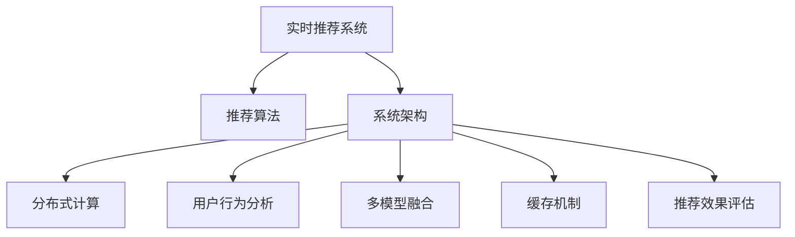

                 

# 实时推荐系统的架构设计

> 关键词：实时推荐系统, 推荐算法, 系统架构, 分布式计算, 用户行为分析, 多模型融合, 缓存机制, 推荐效果评估

## 1. 背景介绍

### 1.1 问题由来
在互联网和移动互联网的时代，信息过载已经成为一个普遍存在的问题。用户在面对海量的内容时，往往需要借助推荐系统的帮助来筛选出最感兴趣的信息。推荐系统不仅能够减轻用户信息获取的压力，还能提升用户体验和平台的活跃度，是提升平台核心竞争力的重要手段。然而，推荐系统不仅仅是一个算法模型，更是一个涉及数据获取、处理、存储、模型训练、服务部署和效果评估的复杂系统架构。构建一个高效、稳定、灵活的推荐系统，需要解决一系列的挑战，如如何高效处理海量数据，如何快速响应用户请求，如何保证推荐效果等。本文将重点介绍实时推荐系统的架构设计，为推荐系统开发者提供一个全面的参考。

### 1.2 问题核心关键点
实时推荐系统的核心在于如何将用户的实时行为与海量数据有效结合，通过算法模型生成并及时推送个性化的推荐内容。具体而言，涉及以下几个关键点：

1. **用户行为数据的实时采集与处理**：实时推荐系统需要持续不断地采集用户的各种行为数据，如点击、浏览、购买、评分等，并对其进行清洗、过滤、归一化等预处理操作。

2. **高并发的数据存储与计算**：推荐系统处理的数据量巨大，需要高效的存储和计算能力，以便快速响应用户请求。

3. **实时性要求**：推荐系统需要实时分析用户行为，并及时推送个性化推荐结果，要求系统架构具备高并发的处理能力。

4. **推荐算法的多样性**：推荐系统通常需要多种推荐算法协同工作，以应对不同类型的推荐任务。

5. **缓存机制的应用**：为了减少计算资源消耗和提高响应速度，推荐系统常常采用缓存机制来存储高频访问的数据。

6. **推荐效果的评估与优化**：推荐系统需要不断调整模型参数和算法策略，以提高推荐效果和用户满意度。

## 2. 核心概念与联系

### 2.1 核心概念概述

为更好地理解实时推荐系统的架构设计，本节将介绍几个密切相关的核心概念：

- **实时推荐系统**：指能够持续不断地分析用户行为数据，并根据实时数据生成个性化推荐结果的系统。

- **推荐算法**：包括协同过滤、基于内容的推荐、深度学习推荐等多种算法，用于模型训练和推荐结果生成。

- **系统架构**：包含数据存储、数据处理、模型训练、服务部署、缓存机制等多个模块，是推荐系统实现的核心部分。

- **分布式计算**：指通过多台计算机协同工作，提高计算能力和数据处理效率的技术，是推荐系统处理大规模数据的核心支撑。

- **用户行为分析**：指通过分析用户的历史行为数据，识别用户的兴趣和偏好，用于推荐模型的训练和优化。

- **多模型融合**：指通过将多个推荐模型的结果进行加权或集成，提升推荐结果的准确性和多样性。

- **缓存机制**：指通过缓存高频访问的数据，提高推荐系统的响应速度和减轻计算压力。

- **推荐效果评估**：指通过各种指标（如点击率、转化率、用户满意度等）评估推荐系统的性能，并据此进行优化。

这些核心概念之间的逻辑关系可以通过以下Mermaid流程图来展示：



这个流程图展示实时推荐系统的核心概念及其之间的关系：

1. 实时推荐系统以推荐算法为核心，通过多模块协同工作实现推荐功能。
2. 推荐算法需要依赖系统架构提供的数据存储、处理和计算能力。
3. 分布式计算是系统架构中处理大规模数据的关键技术。
4. 用户行为分析提供推荐算法训练和优化的依据。
5. 多模型融合提升推荐结果的准确性和多样性。
6. 缓存机制优化推荐系统的响应速度和计算资源消耗。
7. 推荐效果评估指导系统不断优化，提升推荐效果。

## 3. 核心算法原理 & 具体操作步骤
### 3.1 算法原理概述

实时推荐系统的核心算法原理是利用用户的历史行为数据和实时行为数据，通过算法模型生成个性化推荐结果。推荐算法的核心在于学习用户的兴趣和行为模式，并根据这些模式预测用户对未来内容的兴趣。推荐系统通常使用矩阵分解、协同过滤、内容推荐、深度学习等算法。这些算法模型一般需要在大量用户行为数据上进行预训练，以获得良好的推荐效果。

### 3.2 算法步骤详解

实时推荐系统的主要算法步骤包括数据采集、数据处理、模型训练、推荐计算和结果展示，每个步骤的具体操作如下：

1. **数据采集**：
   - 通过API接口、日志记录、网络爬虫等方式，持续不断地采集用户的行为数据，如点击、浏览、购买、评分等。
   - 数据采集需要保证数据的及时性和完整性，以便实时生成推荐结果。

2. **数据处理**：
   - 对采集到的数据进行清洗、过滤、去重、归一化等预处理操作，去除噪声和无效数据。
   - 使用分布式存储和计算框架（如Hadoop、Spark等）处理大规模数据，提高处理效率。

3. **模型训练**：
   - 选择合适的推荐算法，如协同过滤、基于内容的推荐、深度学习推荐等，并使用历史数据进行预训练。
   - 在预训练后，使用实时数据进行微调，更新模型参数，以适应用户的最新行为变化。

4. **推荐计算**：
   - 根据用户的实时行为数据和模型参数，计算出个性化推荐结果。
   - 使用缓存机制存储高频访问的数据，提高计算效率。

5. **结果展示**：
   - 将推荐结果展示给用户，通常以列表或图表形式显示。
   - 根据用户的反馈，不断调整推荐算法和模型参数，优化推荐效果。

### 3.3 算法优缺点

实时推荐系统具有以下优点：

- **实时响应**：能够快速响应用户的请求，提升用户体验。
- **个性化推荐**：利用用户的历史行为数据和实时行为数据，提供个性化的推荐内容。
- **高并发的处理能力**：通过分布式计算框架，能够高效处理大规模数据和用户请求。

同时，该系统也存在一些缺点：

- **数据质量要求高**：推荐系统的推荐效果依赖于用户行为数据的准确性和完整性，数据采集和处理需要严格的质量控制。
- **算法复杂度高**：推荐算法通常比较复杂，需要较高的计算资源和算法优化。
- **缓存机制的维护成本高**：缓存机制需要定期更新和维护，以保证数据的实时性和一致性。
- **推荐效果的评估困难**：推荐效果的评估需要考虑多种指标，如点击率、转化率、用户满意度等，评估过程较为复杂。

### 3.4 算法应用领域

实时推荐系统已经在电子商务、视频流媒体、社交网络、新闻推荐等多个领域得到了广泛应用，为用户的个性化体验提供了强有力的支持：

- **电子商务**：通过推荐系统，用户可以在购物网站或应用中快速找到感兴趣的商品，提高购买转化率。
- **视频流媒体**：视频流媒体平台根据用户观看记录和行为数据，推荐用户可能感兴趣的视频，提高用户粘性和留存率。
- **社交网络**：社交网络平台利用用户的社交关系和行为数据，推荐用户可能感兴趣的内容，促进内容传播和用户互动。
- **新闻推荐**：新闻平台根据用户阅读历史和实时行为，推荐可能感兴趣的新闻文章，提高用户阅读量和平台流量。

除了上述这些典型应用外，实时推荐系统还被创新性地应用到更多场景中，如推荐系统与广告投放的结合、个性化广告推荐等，为各行业带来了全新的业务模式和价值增长点。

## 4. 数学模型和公式 & 详细讲解 & 举例说明

### 4.1 数学模型构建

本节将使用数学语言对实时推荐系统的核心算法进行严格刻画。

假设实时推荐系统包含 $N$ 个用户 $U$ 和 $M$ 个物品 $I$，用户与物品之间的交互矩阵为 $\mathbf{R} \in \mathbb{R}^{N \times M}$，其中 $R_{ij}$ 表示用户 $i$ 对物品 $j$ 的评分或行为数据。

推荐系统的目标是预测用户 $i$ 对物品 $j$ 的评分或行为概率 $p_{ij}$，通常使用以下数学模型进行建模：

$$
p_{ij} = f\left(\mathbf{R}_{i,:}; \mathbf{\theta}\right)
$$

其中 $f$ 为推荐算法模型，$\mathbf{\theta}$ 为模型参数。

### 4.2 公式推导过程

以协同过滤算法为例，其核心思想是通过计算用户之间的相似度，找到与目标用户 $i$ 相似的用户集合，利用这些相似用户对物品的评分预测目标用户对物品的评分。协同过滤算法可以进一步分为基于用户的协同过滤和基于物品的协同过滤两种。

**基于用户的协同过滤**：
1. 计算用户之间的相似度 $s_{ik}$：
   $$
   s_{ik} = \mathbf{u}_i \cdot \mathbf{u}_k
   $$
   其中 $\mathbf{u}_i$ 和 $\mathbf{u}_k$ 分别为用户 $i$ 和用户 $k$ 的特征向量。
2. 利用相似用户对物品的评分进行加权平均，得到目标用户对物品的预测评分 $p_{ij}$：
   $$
   p_{ij} = \frac{1}{\sum_{k \neq i} s_{ik}} \sum_{k \neq i} s_{ik} \times R_{kj}
   $$

**基于物品的协同过滤**：
1. 计算物品之间的相似度 $s_{ij}$：
   $$
   s_{ij} = \mathbf{v}_i \cdot \mathbf{v}_j
   $$
   其中 $\mathbf{v}_i$ 和 $\mathbf{v}_j$ 分别为物品 $i$ 和物品 $j$ 的特征向量。
2. 利用相似物品对用户的评分进行加权平均，得到目标用户对物品的预测评分 $p_{ij}$：
   $$
   p_{ij} = \frac{1}{\sum_{k \neq j} s_{ik}} \sum_{k \neq j} s_{ik} \times R_{ik}
   $$

### 4.3 案例分析与讲解

以下以Amazon推荐系统的实现为例，展示实时推荐系统的核心算法和数据处理过程。

Amazon推荐系统基于协同过滤算法，其核心数据为每个用户的购买历史 $\mathbf{R}_{i,:}$ 和每个物品的销售记录 $\mathbf{R}_{:,j}$。系统首先使用用户-物品交互矩阵 $\mathbf{R}$ 进行奇异值分解（SVD），得到用户和物品的低维特征向量 $\mathbf{u}_i$ 和 $\mathbf{v}_j$，然后使用基于用户的协同过滤算法计算用户 $i$ 对物品 $j$ 的预测评分 $p_{ij}$。

在实现过程中，Amazon使用了多种技术优化推荐性能：

- **实时数据更新**：每小时更新一次用户和物品的评分数据，保证推荐结果的实时性。
- **缓存机制**：使用Redis等缓存机制存储高频访问的数据，提高查询效率。
- **分布式计算**：使用Spark等分布式计算框架处理大规模数据，提高计算效率。
- **模型优化**：使用AdaGrad等优化算法训练模型，提升推荐效果。

## 5. 项目实践：代码实例和详细解释说明
### 5.1 开发环境搭建

在进行实时推荐系统开发前，我们需要准备好开发环境。以下是使用Python进行推荐系统开发的常见环境配置流程：

1. 安装Anaconda：从官网下载并安装Anaconda，用于创建独立的Python环境。

2. 创建并激活虚拟环境：
```bash
conda create -n recsys-env python=3.8 
conda activate recsys-env
```

3. 安装Python依赖包：
```bash
pip install pandas numpy scikit-learn scipy matplotlib scikit-learn
```

4. 安装推荐系统库：
```bash
pip install lightfm
```

完成上述步骤后，即可在`recsys-env`环境中开始推荐系统实践。

### 5.2 源代码详细实现

以下是一个基于LightFM库的协同过滤推荐系统的实现示例，包括数据准备、模型训练、推荐计算和结果展示。

首先，准备数据集，可以使用Amazon购买数据集：

```python
import pandas as pd

# 读取Amazon购买数据集
data = pd.read_csv('amazon-buy-data.csv', index_col='item_id')

# 构建用户-物品评分矩阵
user_ids = data['user_id'].unique().tolist()
item_ids = data['item_id'].unique().tolist()
user_item = pd.DataFrame(index=user_ids, columns=item_ids)
user_item = user_item.fillna(0)

for i, row in data.iterrows():
    user_item.loc[row['user_id'], row['item_id']] = row['rating']
```

然后，使用LightFM进行协同过滤模型训练：

```python
from lightfm import LightFM

# 定义协同过滤模型
model = LightFM(factors=100, loss='squared_error', learning_rate=0.01)

# 拟合训练数据
model.fit(user_item, epochs=20)

# 预测用户对物品的评分
pred = model.predict(user_item)
```

接着，进行推荐计算：

```python
# 获取用户评分预测结果
user_predictions = pred.as_frame()
user_predictions.columns = ['rating']
user_predictions.index.name = 'user_id'
```

最后，将推荐结果展示给用户：

```python
# 对推荐结果进行排序，展示前10个推荐物品
top_items = user_predictions.nlargest(10, columns='rating').index.tolist()
print(top_items)
```

以上就是基于LightFM库的协同过滤推荐系统的完整代码实现。可以看到，通过调用LightFM库的接口，可以方便地实现协同过滤算法的训练和推荐计算。

### 5.3 代码解读与分析

让我们再详细解读一下关键代码的实现细节：

**数据准备**：
- 首先，使用Pandas读取Amazon购买数据集，提取用户ID、物品ID和评分。
- 然后，构建用户-物品评分矩阵，其中缺失值表示用户未购买该物品。

**模型训练**：
- 使用LightFM库定义协同过滤模型，设置因子数和损失函数。
- 通过`fit`方法拟合训练数据，其中`epochs`参数表示训练轮数。

**推荐计算**：
- 使用`predict`方法预测用户对物品的评分。
- 将预测结果转换为Pandas DataFrame，便于后续分析和展示。

**结果展示**：
- 通过`nlargest`方法获取评分最高的前10个物品ID，并打印输出。

可以看到，使用Python和推荐系统库进行推荐系统开发，可以方便地实现模型训练和推荐计算，是推荐系统开发的常见工具。

## 6. 实际应用场景
### 6.1 智能购物助手

智能购物助手是实时推荐系统的一个重要应用场景，通过分析用户的购物行为和偏好，为消费者提供个性化的商品推荐。智能购物助手通常集成在电子商务平台中，如Amazon、淘宝、京东等。

在实际应用中，智能购物助手可以采用多种推荐算法，如协同过滤、基于内容的推荐和深度学习推荐。系统通过实时分析用户的浏览、购买、评分等行为数据，计算出用户的兴趣模型，并利用这些模型生成个性化的商品推荐列表。用户可以根据推荐列表选择商品，提高购买转化率和用户满意度。

### 6.2 视频内容推荐

视频流媒体平台如Netflix、YouTube等，通过实时推荐系统向用户推荐视频内容，提升用户观看体验和平台留存率。视频推荐系统通常采用协同过滤算法，根据用户的历史观看记录和评分数据，生成个性化的视频推荐列表。系统还可以利用深度学习推荐算法，根据视频的元数据和用户行为数据，生成更加精准的推荐结果。

视频推荐系统需要处理大规模视频数据和用户行为数据，因此需要采用分布式计算和缓存机制，提高推荐系统的处理能力和响应速度。此外，系统还可以结合用户画像和视频标签等信息，进行多维度推荐，提高推荐结果的多样性和准确性。

### 6.3 新闻内容推荐

新闻平台如今日头条、Flipboard等，通过实时推荐系统向用户推荐新闻内容，提升用户的阅读体验和平台流量。新闻推荐系统通常采用协同过滤算法和基于内容的推荐算法，根据用户的历史阅读记录和评分数据，生成个性化的新闻推荐列表。系统还可以利用深度学习推荐算法，根据新闻文章的元数据和用户行为数据，生成更加精准的推荐结果。

新闻推荐系统需要处理大规模新闻数据和用户行为数据，因此需要采用分布式计算和缓存机制，提高推荐系统的处理能力和响应速度。此外，系统还可以结合新闻文章的标题、摘要、作者等信息，进行多维度推荐，提高推荐结果的多样性和准确性。

### 6.4 未来应用展望

随着推荐系统技术的不断进步，实时推荐系统将在更多领域得到应用，为各行各业带来变革性影响：

- **智能广告投放**：通过实时推荐系统，广告主可以向用户推送个性化的广告内容，提高广告效果和点击率。
- **个性化内容推荐**：平台可以根据用户的历史行为数据，推荐个性化的文章、视频、音乐等内容，提高用户粘性和留存率。
- **社交网络推荐**：社交网络平台可以根据用户的社交关系和行为数据，推荐个性化的内容和用户，促进用户互动和社区建设。
- **智能家居系统**：智能家居系统可以根据用户的生活习惯和行为数据，推荐个性化的智能设备和服务，提升用户体验和安全性。

除了上述这些典型应用外，实时推荐系统还被创新性地应用到更多场景中，如推荐系统与物联网设备的结合、推荐系统与健康管理的结合等，为各行业带来了全新的业务模式和价值增长点。

## 7. 工具和资源推荐
### 7.1 学习资源推荐

为了帮助开发者系统掌握实时推荐系统的理论基础和实践技巧，这里推荐一些优质的学习资源：

1. 《推荐系统实战》：是一本深入浅出介绍推荐系统的实战书籍，涵盖协同过滤、基于内容的推荐、深度学习推荐等多种推荐算法。
2. 《推荐系统设计》：是斯坦福大学开设的推荐系统课程，涵盖了推荐系统的各个方面，包括数据预处理、模型训练、效果评估等。
3. 《深度学习推荐系统》：是深度学习领域的经典书籍，介绍了深度学习在推荐系统中的应用，包括CTR预估、序列推荐等。
4. 推荐系统开源项目：如TensorFlow推荐系统、Spark推荐系统等，提供了丰富的推荐系统开源代码和实践经验。

通过对这些资源的学习实践，相信你一定能够快速掌握实时推荐系统的精髓，并用于解决实际的推荐问题。

### 7.2 开发工具推荐

高效的开发离不开优秀的工具支持。以下是几款用于推荐系统开发的常用工具：

1. Python：推荐系统开发的常见编程语言，具有丰富的开源库和工具支持。
2. Pandas：Python数据处理库，方便进行数据清洗、过滤、归一化等操作。
3. Scikit-learn：Python机器学习库，提供多种机器学习算法和工具支持。
4. LightFM：基于Python的推荐系统库，支持多种推荐算法和分布式计算框架。
5. Spark：Apache的分布式计算框架，支持大规模数据的处理和计算。
6. Redis：高并发的缓存系统，用于存储高频访问的数据，提高推荐系统的响应速度。

合理利用这些工具，可以显著提升实时推荐系统的开发效率，加快创新迭代的步伐。

### 7.3 相关论文推荐

推荐系统技术的发展源于学界的持续研究。以下是几篇奠基性的相关论文，推荐阅读：

1.《协同过滤推荐系统》（Elasticity: Learning to Re-rank）：提出了协同过滤推荐系统的基本框架，并介绍了Elasticity算法。
2.《基于深度学习的推荐系统》（Deep Neural Networks for Recommender Systems）：介绍了深度学习在推荐系统中的应用，包括CTR预估、序列推荐等。
3.《推荐系统评估》（Personalized Recommendation Algorithms）：介绍了推荐系统的各种评估指标和方法，帮助开发者评估推荐系统的性能。
4.《推荐系统的多模型融合》（Hybrid Recommender Systems）：介绍了多模型融合的方法，提升推荐系统的准确性和多样性。
5.《实时推荐系统》（Streaming Recommendation Algorithms）：介绍了实时推荐系统的基本算法和系统架构，帮助开发者实现实时推荐系统。

这些论文代表推荐系统技术的发展脉络。通过学习这些前沿成果，可以帮助研究者把握学科前进方向，激发更多的创新灵感。

## 8. 总结：未来发展趋势与挑战
### 8.1 总结

本文对实时推荐系统的架构设计进行了全面系统的介绍。首先阐述了实时推荐系统的背景和意义，明确了推荐系统在用户个性化体验和平台流量增长方面的独特价值。其次，从原理到实践，详细讲解了实时推荐系统的核心算法和操作步骤，给出了推荐系统开发的完整代码实例。同时，本文还广泛探讨了推荐系统在智能购物助手、视频内容推荐、新闻内容推荐等多个领域的应用前景，展示了推荐系统范式的巨大潜力。此外，本文精选了推荐系统的各类学习资源，力求为读者提供全方位的技术指引。

通过本文的系统梳理，可以看到，实时推荐系统不仅仅是一个算法模型，更是一个涉及数据采集、处理、存储、模型训练、服务部署和效果评估的复杂系统架构。构建一个高效、稳定、灵活的推荐系统，需要解决一系列的挑战，如如何高效处理海量数据，如何快速响应用户请求，如何保证推荐效果等。只有从数据、算法、工程、业务等多个维度协同发力，才能真正实现推荐系统在垂直行业的规模化落地。总之，推荐系统需要开发者根据具体任务，不断迭代和优化模型、数据和算法，方能得到理想的效果。

### 8.2 未来发展趋势

展望未来，推荐系统技术将呈现以下几个发展趋势：

1. **多模态融合**：推荐系统将融合多种数据模态，如图像、音频、文本等，提升推荐结果的多样性和准确性。
2. **深度学习的应用**：深度学习在推荐系统中的应用将不断深入，包括注意力机制、Transformer结构等。
3. **实时性要求更高**：推荐系统需要更加高效地处理实时数据，以提高用户满意度和平台流量。
4. **个性化推荐**：推荐系统将更加个性化，根据用户的实时行为数据和历史行为数据，提供更加精准的推荐结果。
5. **推荐效果评估**：推荐效果的评估将更加全面和动态，涵盖点击率、转化率、用户满意度等多个指标。
6. **数据隐私保护**：推荐系统将更加注重数据隐私保护，采用差分隐私、联邦学习等技术，保护用户隐私。

以上趋势凸显了推荐系统技术的广阔前景。这些方向的探索发展，必将进一步提升推荐系统的性能和应用范围，为互联网和移动互联网带来更多的用户价值和商业机会。

### 8.3 面临的挑战

尽管推荐系统技术已经取得了瞩目成就，但在迈向更加智能化、普适化应用的过程中，它仍面临着诸多挑战：

1. **数据隐私问题**：推荐系统需要处理大量用户行为数据，涉及用户隐私保护的问题。如何保护用户数据隐私，避免数据泄露和滥用，是推荐系统面临的重要挑战。
2. **算法复杂性**：推荐系统算法复杂度较高，需要较高的计算资源和算法优化。如何在保证推荐效果的前提下，降低算法复杂度，提高系统运行效率，是推荐系统面临的重要挑战。
3. **模型鲁棒性不足**：推荐系统面对域外数据时，泛化性能往往大打折扣。如何提高推荐模型的鲁棒性，避免灾难性遗忘，还需要更多理论和实践的积累。
4. **推荐效果的评估困难**：推荐效果的评估需要考虑多种指标，如点击率、转化率、用户满意度等，评估过程较为复杂。如何在保证推荐效果的同时，减少评估成本，提高评估效率，是推荐系统面临的重要挑战。
5. **用户反馈机制的优化**：推荐系统需要根据用户反馈不断调整模型参数和算法策略，以提高推荐效果和用户满意度。如何设计有效的用户反馈机制，引导用户积极参与，是推荐系统面临的重要挑战。

正视推荐系统面临的这些挑战，积极应对并寻求突破，将是对推荐系统开发者和研究者的重要课题。只有从数据、算法、工程、业务等多个维度协同发力，才能真正实现推荐系统的智能化和普适化。

### 8.4 研究展望

面对推荐系统面临的种种挑战，未来的研究需要在以下几个方面寻求新的突破：

1. **跨模态数据融合**：将视觉、音频、文本等多种数据模态进行融合，提升推荐系统的准确性和多样性。
2. **深度学习与协同过滤的结合**：将深度学习与协同过滤算法结合，提升推荐系统的复杂度和准确性。
3. **实时数据流处理**：利用实时数据流处理技术，提高推荐系统的响应速度和准确性。
4. **用户画像的动态更新**：根据用户的实时行为数据，动态更新用户画像，提升推荐系统的个性化程度。
5. **推荐系统的隐私保护**：采用差分隐私、联邦学习等技术，保护用户隐私。

这些研究方向的探索，必将引领推荐系统技术迈向更高的台阶，为互联网和移动互联网带来更多的用户价值和商业机会。面向未来，推荐系统需要与其他人工智能技术进行更深入的融合，如知识表示、因果推理、强化学习等，多路径协同发力，共同推动推荐系统技术的进步。只有勇于创新、敢于突破，才能不断拓展推荐系统的边界，让推荐系统技术更好地造福人类社会。

## 9. 附录：常见问题与解答
**Q1：推荐系统的数据采集和处理如何保证数据的准确性和完整性？**

A: 推荐系统的数据采集和处理需要严格的质量控制，以确保数据的准确性和完整性。以下是一些常见的数据采集和处理策略：

1. **数据清洗**：去除噪声和无效数据，如缺失值、重复数据等，保证数据的准确性。
2. **数据过滤**：根据业务需求和模型要求，过滤掉无关数据，保证数据的相关性和质量。
3. **数据归一化**：对数据进行归一化和标准化处理，使其符合模型的输入要求。
4. **数据预处理**：使用数据预处理技术，如分词、去停用词、特征提取等，提升数据的可处理性。
5. **数据标注**：对标注数据进行严格标注和验证，保证标注的准确性和一致性。

这些策略可以结合使用，提升数据采集和处理的效率和准确性，为推荐系统的训练和应用提供可靠的数据支撑。

**Q2：推荐系统的模型训练和评估如何进行？**

A: 推荐系统的模型训练和评估通常包括以下步骤：

1. **模型选择**：根据业务需求和数据特征，选择合适的推荐算法模型，如协同过滤、基于内容的推荐、深度学习推荐等。
2. **数据划分**：将数据集划分为训练集、验证集和测试集，用于模型训练、验证和测试。
3. **模型训练**：使用训练集数据，训练推荐模型，并不断调整模型参数和算法策略，提高模型的拟合能力。
4. **模型验证**：使用验证集数据，评估模型的性能指标，如点击率、转化率、用户满意度等，指导模型优化。
5. **模型测试**：使用测试集数据，评估模型的最终性能，确定模型的准确性和鲁棒性。

在模型训练和评估过程中，需要注意以下问题：

- **模型超参数的调整**：选择合适的模型超参数，如学习率、迭代轮数、正则化系数等，提升模型的性能。
- **数据集的划分**：根据数据集的特征和业务需求，合理划分数据集，避免过拟合和欠拟合。
- **模型效果的评估**：采用多种评估指标，如点击率、转化率、用户满意度等，全面评估推荐模型的性能。
- **模型的迭代优化**：根据模型评估结果，不断调整模型参数和算法策略，优化推荐效果。

合理设计模型训练和评估流程，可以有效提升推荐系统的性能和用户满意度。

**Q3：推荐系统的推荐计算和结果展示如何实现？**

A: 推荐系统的推荐计算和结果展示通常包括以下步骤：

1. **推荐计算**：根据用户的行为数据和模型参数，计算出个性化推荐结果。推荐计算可以使用多种算法和数据结构，如协同过滤、矩阵分解、最近邻搜索等。
2. **结果排序**：根据推荐结果的指标，如点击率、转化率、用户满意度等，对推荐结果进行排序，提升推荐的精准性和多样性。
3. **结果展示**：将推荐结果展示给用户，通常以列表或图表形式显示。推荐结果展示需要考虑用户体验，展示方式简洁直观，让用户容易理解和使用。

在推荐计算和结果展示过程中，需要注意以下问题：

- **推荐算法的选择**：根据业务需求和数据特征，选择合适的推荐算法，提升推荐效果。
- **推荐结果的多样性**：在保证推荐结果精准性的同时，引入推荐结果的多样性，提升用户的满意度。
- **推荐结果的排序**：根据推荐结果的指标，对推荐结果进行排序，提升推荐的精准性和多样性。
- **推荐结果的展示**：将推荐结果简洁直观地展示给用户，提升用户体验。

合理设计推荐计算和结果展示流程，可以有效提升推荐系统的性能和用户满意度。

**Q4：推荐系统在实际应用中需要注意哪些问题？**

A: 推荐系统在实际应用中需要注意以下问题：

1. **用户隐私保护**：推荐系统需要处理大量用户行为数据，涉及用户隐私保护的问题。如何保护用户数据隐私，避免数据泄露和滥用，是推荐系统面临的重要挑战。
2. **算法复杂性**：推荐系统算法复杂度较高，需要较高的计算资源和算法优化。如何在保证推荐效果的前提下，降低算法复杂度，提高系统运行效率，是推荐系统面临的重要挑战。
3. **模型鲁棒性不足**：推荐系统面对域外数据时，泛化性能往往大打折扣。如何提高推荐模型的鲁棒性，避免灾难性遗忘，还需要更多理论和实践的积累。
4. **推荐效果的评估困难**：推荐效果的评估需要考虑多种指标，如点击率、转化率、用户满意度等，评估过程较为复杂。如何在保证推荐效果的同时，减少评估成本，提高评估效率，是推荐系统面临的重要挑战。
5. **用户反馈机制的优化**：推荐系统需要根据用户反馈不断调整模型参数和算法策略，以提高推荐效果和用户满意度。如何设计有效的用户反馈机制，引导用户积极参与，是推荐系统面临的重要挑战。

正视推荐系统面临的这些挑战，积极应对并寻求突破，将是对推荐系统开发者和研究者的重要课题。只有从数据、算法、工程、业务等多个维度协同发力，才能真正实现推荐系统的智能化和普适化。

---

作者：禅与计算机程序设计艺术 / Zen and the Art of Computer Programming

