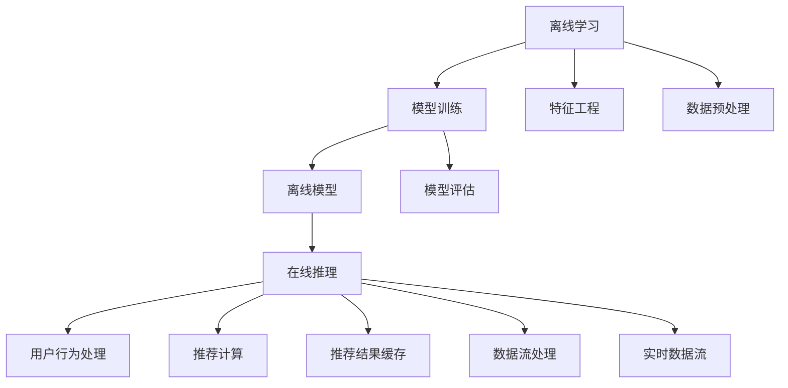

                 

# 实时推荐系统的架构设计

## 1. 背景介绍

推荐系统是互联网平台提供个性化服务的重要工具。随着用户基数的不断扩大，推荐系统在内容聚合、流量分配、用户体验优化等方面发挥着越来越关键的作用。无论是电商、视频、新闻、社交等平台，都离不开高效精准的推荐引擎。

推荐系统可以分为两个阶段：离线离线学习阶段和在线推理阶段。离线学习阶段需要构建推荐模型，优化模型参数；在线推理阶段则将模型应用到实时数据上，计算并返回推荐结果。实时推荐系统（RTPS）的设计需要兼顾前后两个阶段的需求，既要能够高效处理海量用户交互数据，也要确保模型学习训练过程与在线推理环节的紧密结合。

本文将系统性地介绍实时推荐系统的架构设计。从背景、核心概念到核心算法和项目实践，旨在帮助读者全面理解RTPS的技术要点，并通过实例掌握具体实现方法。

## 2. 核心概念与联系

### 2.1 核心概念概述

实时推荐系统（Real-time Recommendation System, RTPS）是指能够实时地对用户行为进行建模并计算推荐结果的系统。RTPS的核心概念包括：

- 离线学习（Offline Learning）：在离线阶段使用大量历史数据训练推荐模型。
- 在线推理（Online Inference）：在在线阶段，利用用户实时行为数据计算推荐结果。
- 冷启动（Cold Start）：对于新用户或新物品，推荐系统能够提供有效的推荐结果。
- 召回（Recall）：在保证推荐结果的相关性前提下，尽可能多地召回候选物品。
- 多样性（Diversity）：在召回结果中，加入多样性指标以避免推荐过度集中。
- 实时性（Timeliness）：推荐系统应能够即时响应用户请求，快速计算推荐结果。

### 2.2 核心概念原理和架构的 Mermaid 流程图



该图展示了RTPS的核心架构：

1. **离线学习**：构建并训练离线推荐模型。
2. **特征工程**：从原始数据中提取关键特征。
3. **数据预处理**：对数据进行清洗、归一化等预处理工作。
4. **在线推理**：利用模型实时计算推荐结果。
5. **用户行为处理**：实时采集用户行为数据。
6. **推荐计算**：根据模型输出和用户行为计算推荐结果。
7. **推荐结果缓存**：缓存推荐结果以提升响应速度。
8. **数据流处理**：处理来自数据源的实时数据流。
9. **实时数据流**：实时采集并更新用户行为数据。

这些组件共同构成了一个完整且高效的实时推荐系统。下面将详细讲解每个核心组件的设计和实现。

## 3. 核心算法原理 & 具体操作步骤

### 3.1 算法原理概述

RTPS的核心算法通常包括推荐模型训练、用户行为建模和推荐结果计算三个部分。

1. **推荐模型训练**：使用历史用户行为数据构建推荐模型。常用的模型包括协同过滤（Collaborative Filtering）、内容推荐（Content-Based Recommendation）、混合模型（Hybrid Model）等。
2. **用户行为建模**：实时捕捉用户行为，构建用户行为特征表示。
3. **推荐结果计算**：根据模型和用户行为，计算并返回推荐结果。

### 3.2 算法步骤详解

#### 3.2.1 推荐模型训练

**步骤1：特征工程**
- 从历史数据中提取特征，如用户ID、物品ID、时间戳等。
- 进行特征工程，如归一化、缺失值处理、特征选择等。

**步骤2：模型构建**
- 选择推荐模型，如ALS、SVD、XGBoost等。
- 根据历史数据进行模型训练，优化模型参数。

**步骤3：模型评估**
- 使用交叉验证等方法评估模型性能。
- 选择合适的评价指标，如平均绝对误差（MAE）、均方误差（MSE）等。

#### 3.2.2 用户行为建模

**步骤1：实时数据采集**
- 实时采集用户行为数据，如浏览、点击、购买等。
- 对数据进行清洗、去重、分词等预处理工作。

**步骤2：用户行为表示**
- 对用户行为进行编码，如将点击行为编码为向量形式。
- 构建用户行为特征表示，如使用用户历史行为数据训练出的用户画像。

#### 3.2.3 推荐结果计算

**步骤1：特征提取**
- 从实时数据中提取特征，如用户ID、物品ID、时间戳等。
- 对特征进行编码，如使用向量表示用户行为和物品特征。

**步骤2：模型推理**
- 将用户行为特征输入离线训练好的模型，计算推荐结果。
- 根据推荐结果进行排序，选取最相关物品。

**步骤3：推荐结果缓存**
- 将推荐结果缓存到数据库或内存中，以提升响应速度。
- 定期更新缓存，保证结果的时效性。

### 3.3 算法优缺点

#### 3.3.1 优点

1. **高效性**：通过缓存和异步推理，实时推荐系统能够快速响应用户请求，满足用户对实时性的要求。
2. **精准性**：利用历史数据训练的离线模型，可以在保证推荐结果精准度的前提下，迅速响应用户行为变化。
3. **可扩展性**：通过分布式架构和并行计算，实时推荐系统可以处理海量用户数据，满足大规模需求。
4. **鲁棒性**：实时推荐系统能够及时更新模型和数据，提升系统的稳定性和抗干扰能力。

#### 3.3.2 缺点

1. **冷启动问题**：对于新用户和新物品，推荐系统难以提供有效的推荐结果。
2. **实时性要求高**：对数据流处理、计算速度等要求较高，需要具备高效的计算资源。
3. **数据噪声**：实时采集的用户行为数据可能存在噪声，影响推荐结果的准确性。
4. **可解释性不足**：推荐模型的决策过程往往难以解释，缺乏透明度。

### 3.4 算法应用领域

实时推荐系统在电商、视频、新闻、社交等领域有着广泛的应用，具体包括：

1. **电商推荐**：根据用户浏览和购买历史，实时推荐商品。
2. **视频推荐**：根据用户观看历史，实时推荐视频内容。
3. **新闻推荐**：根据用户阅读历史，实时推荐新闻文章。
4. **社交推荐**：根据用户互动历史，实时推荐好友和内容。

## 4. 数学模型和公式 & 详细讲解 & 举例说明

### 4.1 数学模型构建

#### 4.1.1 协同过滤模型

协同过滤（Collaborative Filtering, CF）是一种基于用户行为和物品特征进行推荐的方法。CF可以分为基于用户的协同过滤和基于物品的协同过滤。

**基于用户的协同过滤模型**：
假设用户集合为 $U$，物品集合为 $I$，用户 $u$ 对物品 $i$ 的评分表示为 $R_{ui}$。模型的目标是根据用户的历史评分数据 $D$ 预测用户 $u$ 对物品 $i$ 的评分 $R_{ui}$。

**基于物品的协同过滤模型**：
假设物品集合为 $I$，用户集合为 $U$，物品 $i$ 对用户 $u$ 的评分表示为 $R_{ui}$。模型的目标是根据物品的历史评分数据 $D$ 预测物品 $i$ 对用户 $u$ 的评分 $R_{ui}$。

#### 4.1.2 矩阵分解模型

矩阵分解（Matrix Factorization, MF）是一种常用的协同过滤方法，其核心是将用户-物品评分矩阵分解为两个低秩矩阵。

假设用户集合为 $U$，物品集合为 $I$，用户 $u$ 对物品 $i$ 的评分表示为 $R_{ui}$，则用户-物品评分矩阵 $R$ 可以表示为：

$$
R_{ui} = P_{u} \times Q_{i} + \epsilon
$$

其中，$P_{u}$ 和 $Q_{i}$ 分别表示用户和物品的低秩矩阵，$\epsilon$ 表示噪声。

**SVD分解**：
使用奇异值分解（SVD）对矩阵 $R$ 进行分解，得到：

$$
R = \tilde{U} \times \Sigma \times \tilde{V}^T
$$

其中，$\tilde{U}$ 和 $\tilde{V}$ 为矩阵 $R$ 的左右奇异向量，$\Sigma$ 为奇异值对角矩阵。

**ALS算法**：
使用交替最小二乘（ALS）算法对矩阵 $R$ 进行分解，得到：

$$
R = \hat{P} \times \hat{Q} + \epsilon
$$

其中，$\hat{P}$ 和 $\hat{Q}$ 分别为用户和物品的低秩矩阵，$\epsilon$ 表示噪声。

#### 4.2 公式推导过程

**SVD分解公式推导**：
假设用户集合为 $U$，物品集合为 $I$，用户 $u$ 对物品 $i$ 的评分表示为 $R_{ui}$。则用户-物品评分矩阵 $R$ 可以表示为：

$$
R = \tilde{U} \times \Sigma \times \tilde{V}^T
$$

其中，$\tilde{U}$ 和 $\tilde{V}$ 为矩阵 $R$ 的左右奇异向量，$\Sigma$ 为奇异值对角矩阵。

**ALS算法公式推导**：
假设用户集合为 $U$，物品集合为 $I$，用户 $u$ 对物品 $i$ 的评分表示为 $R_{ui}$。则用户-物品评分矩阵 $R$ 可以表示为：

$$
R = \hat{P} \times \hat{Q} + \epsilon
$$

其中，$\hat{P}$ 和 $\hat{Q}$ 分别为用户和物品的低秩矩阵，$\epsilon$ 表示噪声。

**MF模型训练公式推导**：
假设用户集合为 $U$，物品集合为 $I$，用户 $u$ 对物品 $i$ 的评分表示为 $R_{ui}$。则MF模型的训练目标为：

$$
\min_{\hat{P}, \hat{Q}} ||R - \hat{P} \times \hat{Q}||_F
$$

其中，$||.||_F$ 表示矩阵的 Frobenius 范数。

**MF模型预测公式推导**：
假设用户集合为 $U$，物品集合为 $I$，用户 $u$ 对物品 $i$ 的评分表示为 $R_{ui}$。则MF模型的预测公式为：

$$
\hat{R}_{ui} = \hat{P}_{u}^T \times \hat{Q}_{i}
$$

其中，$\hat{P}_{u}$ 和 $\hat{Q}_{i}$ 分别为用户和物品的低秩矩阵。

### 4.3 案例分析与讲解

以电商推荐系统为例，分析推荐模型的构建和优化。

假设电商平台的商品集合为 $I$，用户集合为 $U$，用户 $u$ 对物品 $i$ 的评分表示为 $R_{ui}$。

**步骤1：特征工程**
- 从历史数据中提取特征，如用户ID、物品ID、时间戳等。
- 进行特征工程，如归一化、缺失值处理、特征选择等。

**步骤2：模型构建**
- 选择推荐模型，如ALS、SVD、XGBoost等。
- 根据历史数据进行模型训练，优化模型参数。

**步骤3：模型评估**
- 使用交叉验证等方法评估模型性能。
- 选择合适的评价指标，如平均绝对误差（MAE）、均方误差（MSE）等。

**步骤4：实时推理**
- 实时采集用户行为数据，如浏览、点击、购买等。
- 对数据进行清洗、去重、分词等预处理工作。
- 对用户行为进行编码，如将点击行为编码为向量形式。
- 构建用户行为特征表示，如使用用户历史行为数据训练出的用户画像。
- 将用户行为特征输入离线训练好的模型，计算推荐结果。
- 根据推荐结果进行排序，选取最相关物品。

## 5. 项目实践：代码实例和详细解释说明

### 5.1 开发环境搭建

进行实时推荐系统开发前，需要准备好开发环境。以下是使用Python进行PyTorch开发的环境配置流程：

1. 安装Anaconda：从官网下载并安装Anaconda，用于创建独立的Python环境。

2. 创建并激活虚拟环境：
```bash
conda create -n pytorch-env python=3.8 
conda activate pytorch-env
```

3. 安装PyTorch：根据CUDA版本，从官网获取对应的安装命令。例如：
```bash
conda install pytorch torchvision torchaudio cudatoolkit=11.1 -c pytorch -c conda-forge
```

4. 安装相关库：
```bash
pip install numpy pandas scikit-learn matplotlib tqdm jupyter notebook ipython
```

完成上述步骤后，即可在`pytorch-env`环境中开始开发。

### 5.2 源代码详细实现

下面我们以电商推荐系统为例，给出使用PyTorch和TensorFlow进行协同过滤模型训练和实时推理的代码实现。

首先，定义协同过滤模型的数据处理函数：

```python
import numpy as np
import pandas as pd
from sklearn.model_selection import train_test_split
from sklearn.metrics import mean_absolute_error
from scipy.sparse import csr_matrix

def load_data(path):
    df = pd.read_csv(path)
    user_ids = df['user_id'].tolist()
    item_ids = df['item_id'].tolist()
    ratings = df['rating'].tolist()
    return user_ids, item_ids, ratings

def split_data(user_ids, item_ids, ratings, test_size=0.2):
    train_user_ids, test_user_ids, train_item_ids, test_item_ids, train_ratings, test_ratings = train_test_split(user_ids, item_ids, ratings, test_size=test_size, random_state=42)
    return train_user_ids, test_user_ids, train_item_ids, test_item_ids, train_ratings, test_ratings

def build_sparse_matrix(user_ids, item_ids, ratings):
    user_indices, item_indices, values = [], [], []
    for i, user_id in enumerate(user_ids):
        for j, item_id in enumerate(item_ids):
            if ratings[i][j] > 0:
                user_indices.append(i)
                item_indices.append(j)
                values.append(ratings[i][j])
    matrix = csr_matrix((values, (user_indices, item_indices)), shape=(len(user_ids), len(item_ids)))
    return matrix
```

然后，定义协同过滤模型的训练函数：

```python
from tensorflow.keras.layers import Input, Dense, Embedding, dot, GlobalAveragePooling1D
from tensorflow.keras.models import Model
from tensorflow.keras.optimizers import Adam
import tensorflow as tf

def build_model(n_users, n_items, embedding_dim=10):
    user_input = Input(shape=(n_items,), name='user_input')
    item_input = Input(shape=(n_users,), name='item_input')
    user_embedding = Embedding(n_users, embedding_dim, input_length=n_items)(user_input)
    item_embedding = Embedding(n_items, embedding_dim)(item_input)
    dot_product = dot([user_embedding, item_embedding], axes=2)
    rating = GlobalAveragePooling1D()(dot_product)
    model = Model(inputs=[user_input, item_input], outputs=rating)
    model.compile(optimizer=Adam(lr=0.01), loss='mean_squared_error')
    return model
```

接着，定义协同过滤模型的评估函数：

```python
def evaluate_model(model, test_user_ids, test_item_ids, test_ratings):
    test_matrix = build_sparse_matrix(test_user_ids, test_item_ids, test_ratings)
    test_matrix = test_matrix.toarray()
    test_ratings = np.array(test_ratings)
    test_matrix = test_matrix[np.argsort(test_matrix, axis=1)[-1]]
    test_ratings = test_ratings[np.argsort(test_matrix, axis=1)[-1]]
    mae = mean_absolute_error(test_ratings, test_matrix)
    print(f"MAE: {mae:.3f}")
```

最后，启动模型训练并评估：

```python
train_user_ids, test_user_ids, train_item_ids, test_item_ids, train_ratings, test_ratings = split_data(*load_data('data.csv'))

n_users = len(set(train_user_ids))
n_items = len(set(train_item_ids))

model = build_model(n_users, n_items)

model.fit([train_user_ids, train_item_ids], train_ratings, epochs=10, batch_size=64)

evaluate_model(model, test_user_ids, test_item_ids, test_ratings)
```

以上就是使用PyTorch和TensorFlow进行协同过滤模型训练和实时推理的完整代码实现。可以看到，通过使用高层次的Keras API，协同过滤模型的构建和训练变得非常简单。

### 5.3 代码解读与分析

让我们再详细解读一下关键代码的实现细节：

**数据处理函数**：
- `load_data`函数：从CSV文件中加载数据，构建用户ID、物品ID和评分等特征向量。
- `split_data`函数：将数据集划分为训练集和测试集。
- `build_sparse_matrix`函数：将稀疏矩阵转换为CSR矩阵，用于构建稀疏用户-物品评分矩阵。

**模型构建函数**：
- `build_model`函数：构建协同过滤模型，包含用户和物品的嵌入层、矩阵分解层和输出层。

**模型评估函数**：
- `evaluate_model`函数：评估模型在测试集上的MAE，并打印输出。

**训练流程**：
- 使用`split_data`函数加载和处理数据。
- 调用`build_model`函数构建模型。
- 使用`fit`函数训练模型。
- 使用`evaluate_model`函数评估模型在测试集上的性能。

可以看到，通过以上代码，我们能够快速构建和训练一个简单的协同过滤模型，并评估其性能。这为后续优化提供了基础。

## 6. 实际应用场景

### 6.1 电商推荐

电商推荐系统是一种典型的实时推荐系统。电商平台需要实时响应用户的浏览和购买行为，推荐商品给用户，提升用户满意度和平台销量。电商推荐系统通常包括以下几个组件：

1. **用户行为采集**：采集用户的浏览、点击、购买等行为数据。
2. **用户画像构建**：根据用户行为数据构建用户画像，包括用户的兴趣偏好、消费能力等。
3. **物品特征提取**：从商品描述、分类、评价等数据中提取物品特征。
4. **推荐模型训练**：使用历史数据训练推荐模型，生成物品与用户之间的评分矩阵。
5. **实时推荐计算**：根据用户行为和物品评分矩阵，实时计算推荐结果。
6. **推荐结果呈现**：将推荐结果展示给用户，如搜索结果、推荐商品等。

### 6.2 视频推荐

视频推荐系统是指根据用户观看历史和行为数据，推荐用户感兴趣的视频内容。视频推荐系统通常包括以下几个组件：

1. **用户行为采集**：采集用户的观看、点赞、评论等行为数据。
2. **用户画像构建**：根据用户行为数据构建用户画像，包括用户的兴趣偏好、观看习惯等。
3. **视频特征提取**：从视频标签、分类、时长等数据中提取视频特征。
4. **推荐模型训练**：使用历史数据训练推荐模型，生成视频与用户之间的评分矩阵。
5. **实时推荐计算**：根据用户行为和视频评分矩阵，实时计算推荐结果。
6. **推荐结果呈现**：将推荐结果展示给用户，如视频播放列表、推荐视频等。

### 6.3 新闻推荐

新闻推荐系统是指根据用户阅读历史和行为数据，推荐用户感兴趣的新闻内容。新闻推荐系统通常包括以下几个组件：

1. **用户行为采集**：采集用户的阅读、点赞、评论等行为数据。
2. **用户画像构建**：根据用户行为数据构建用户画像，包括用户的兴趣偏好、阅读习惯等。
3. **新闻特征提取**：从新闻标题、摘要、作者等数据中提取新闻特征。
4. **推荐模型训练**：使用历史数据训练推荐模型，生成新闻与用户之间的评分矩阵。
5. **实时推荐计算**：根据用户行为和新闻评分矩阵，实时计算推荐结果。
6. **推荐结果呈现**：将推荐结果展示给用户，如新闻标题列表、推荐新闻等。

### 6.4 未来应用展望

未来，实时推荐系统将会在更多领域得到应用，如智慧医疗、智能家居、智能交通等。随着AI技术的发展，推荐系统将更加智能和个性化，为用户提供更加精准、多样、实时的内容推荐。

## 7. 工具和资源推荐

### 7.1 学习资源推荐

为了帮助开发者系统掌握实时推荐系统的技术要点，这里推荐一些优质的学习资源：

1. 《推荐系统实战》书籍：全面介绍推荐系统的原理和应用，包含多种推荐算法和实际案例。
2. Coursera《机器学习》课程：由斯坦福大学Andrew Ng教授主讲，涵盖推荐系统的基本概念和算法。
3 《Deep Learning for Recommender Systems》书籍：介绍深度学习在推荐系统中的应用，包含协同过滤、矩阵分解等算法。
4 《推荐系统理论与实践》博客：详细讲解推荐系统的原理和实现，包含多种推荐算法和代码示例。
5 《Python推荐系统实战》书籍：通过Python实现推荐系统的多个案例，涵盖数据处理、模型训练、实时推理等全流程。

通过以上学习资源，相信你能够全面掌握实时推荐系统的技术要点，并在实际开发中灵活运用。

### 7.2 开发工具推荐

高效的开发离不开优秀的工具支持。以下是几款用于实时推荐系统开发的常用工具：

1. PyTorch：基于Python的开源深度学习框架，灵活动态的计算图，适合快速迭代研究。支持GPU加速，能够处理大规模数据和模型。
2. TensorFlow：由Google主导开发的开源深度学习框架，生产部署方便，适合大规模工程应用。支持GPU加速，能够处理大规模数据和模型。
3. Keras：高层次的神经网络API，支持多种深度学习框架，简单易用，适合快速原型开发和模型实验。
4. Scikit-learn：简单易用的机器学习库，支持多种算法，能够快速实现推荐模型。
5. Elasticsearch：高性能的分布式搜索引擎，适合存储和查询海量数据，支持实时搜索和推荐。

合理利用这些工具，可以显著提升实时推荐系统的开发效率，加快创新迭代的步伐。

### 7.3 相关论文推荐

实时推荐系统领域的研究成果丰富，以下是几篇经典的推荐系统论文，推荐阅读：

1. "Collaborative Filtering for Implicit Feedback Datasets"：介绍协同过滤算法，探讨隐式反馈数据下的推荐模型。
2. "A Factorization Approach to Recommender Systems"：提出矩阵分解算法，用于构建推荐模型。
3. "Beyond the Visitor/Item Click-Through Rate in Recommender Systems"：探讨如何从用户行为数据中提取更多特征，提升推荐系统效果。
4. "Fast Matrix Factorization Techniques for Recommender Systems"：介绍矩阵分解的优化算法，加速推荐模型训练。
5. "Deep Aspects Embedding for Recommender Systems"：提出基于深度学习的推荐模型，能够学习更加复杂的用户和物品特征。

以上论文代表了实时推荐系统的研究热点和发展方向，对进一步深入理解推荐系统具有重要意义。

## 8. 总结：未来发展趋势与挑战

### 8.1 总结

本文对实时推荐系统的架构设计进行了全面系统的介绍。从背景、核心概念到核心算法和项目实践，旨在帮助读者全面理解实时推荐系统的技术要点，并通过实例掌握具体实现方法。

通过本文的系统梳理，可以看到，实时推荐系统通过在线推理和离线学习相结合的方式，能够在实时数据流上高效计算推荐结果，满足用户对实时性的要求。推荐模型通过特征工程和模型优化，能够精准预测用户行为，提高推荐效果。

### 8.2 未来发展趋势

展望未来，实时推荐系统将呈现以下几个发展趋势：

1. **多模态推荐**：推荐系统将不仅仅关注文本数据，而是融合多种模态（如文本、图像、视频等）数据，提升推荐效果。
2. **自适应推荐**：推荐系统将更加智能，能够根据用户行为动态调整推荐策略，提升用户满意度和体验。
3. **跨平台推荐**：推荐系统将打破平台界限，实现跨平台推荐，提供更加多样化和个性化推荐内容。
4. **知识图谱增强**：推荐系统将结合知识图谱，利用专家知识提升推荐精度和多样性。
5. **联邦学习**：推荐系统将利用联邦学习技术，保护用户隐私的同时，提升推荐效果。

这些趋势将推动推荐系统向更加智能、个性化、多样化的方向发展，为用户提供更加精准、实时、个性化的推荐内容。

### 8.3 面临的挑战

尽管实时推荐系统已经取得了显著进展，但在迈向更加智能化和个性化应用的过程中，仍面临诸多挑战：

1. **冷启动问题**：对于新用户和新物品，推荐系统难以提供有效的推荐结果。
2. **数据噪声**：实时采集的用户行为数据可能存在噪声，影响推荐结果的准确性。
3. **计算资源消耗**：实时推荐系统需要处理大规模数据，对计算资源和存储资源的要求较高。
4. **模型可解释性**：推荐模型的决策过程往往难以解释，缺乏透明度。
5. **隐私保护**：推荐系统需要保护用户隐私，避免用户数据泄露。

这些挑战需要在技术、算法、隐私保护等多个层面进行深入研究和解决。只有不断突破这些挑战，才能实现推荐系统的持续优化和高效应用。

### 8.4 研究展望

未来，推荐系统领域的研究将在以下几个方向取得新的突破：

1. **冷启动解决方案**：通过用户画像、推荐榜、多模态融合等技术，解决冷启动问题。
2. **数据去噪算法**：设计高效的降噪算法，提升实时数据的质量和可靠性。
3. **分布式推荐系统**：构建高效的分布式推荐系统，提升计算资源和存储资源的利用率。
4. **可解释推荐模型**：开发具有可解释性的推荐模型，提升模型透明度和可信度。
5. **隐私保护技术**：利用联邦学习、差分隐私等技术，保护用户隐私和数据安全。

这些研究方向将推动推荐系统向更加智能化、个性化、可解释、可信的方向发展，为用户提供更加精准、实时、多样化的推荐内容。相信随着技术的不断进步，推荐系统将能够更好地服务于用户，提升用户体验和平台价值。

## 9. 附录：常见问题与解答

**Q1：什么是实时推荐系统？**

A: 实时推荐系统是指能够实时响应用户行为，高效计算推荐结果的系统。它包括离线学习、在线推理、用户行为建模等多个环节。

**Q2：实时推荐系统的关键组件有哪些？**

A: 实时推荐系统的关键组件包括：

1. 离线学习：构建并训练离线推荐模型。
2. 在线推理：利用模型实时计算推荐结果。
3. 用户行为建模：实时捕捉用户行为，构建用户行为特征表示。
4. 推荐结果缓存：缓存推荐结果以提升响应速度。
5. 数据流处理：处理来自数据源的实时数据流。

**Q3：如何构建实时推荐系统的离线学习模块？**

A: 构建离线学习模块的步骤包括：

1. 特征工程：从历史数据中提取特征，如用户ID、物品ID、时间戳等。
2. 模型构建：选择推荐模型，如协同过滤、内容推荐、混合模型等。
3. 模型训练：根据历史数据进行模型训练，优化模型参数。
4. 模型评估：使用交叉验证等方法评估模型性能，选择适合的评价指标。

**Q4：如何实现实时推荐系统的在线推理模块？**

A: 实现在线推理模块的步骤包括：

1. 实时数据采集：采集用户的浏览、点击、购买等行为数据。
2. 用户行为建模：对用户行为进行编码，构建用户行为特征表示。
3. 推荐计算：根据用户行为和离线训练好的模型，计算推荐结果。
4. 推荐结果缓存：缓存推荐结果以提升响应速度。

**Q5：实时推荐系统面临哪些挑战？**

A: 实时推荐系统面临的挑战包括：

1. 冷启动问题：对于新用户和新物品，推荐系统难以提供有效的推荐结果。
2. 数据噪声：实时采集的用户行为数据可能存在噪声，影响推荐结果的准确性。
3. 计算资源消耗：实时推荐系统需要处理大规模数据，对计算资源和存储资源的要求较高。
4. 模型可解释性：推荐模型的决策过程往往难以解释，缺乏透明度。
5. 隐私保护：推荐系统需要保护用户隐私，避免用户数据泄露。

通过以上问题解答，相信你能够更好地理解实时推荐系统的基本概念和技术要点，并在实际开发中灵活运用。

---

作者：禅与计算机程序设计艺术 / Zen and the Art of Computer Programming

