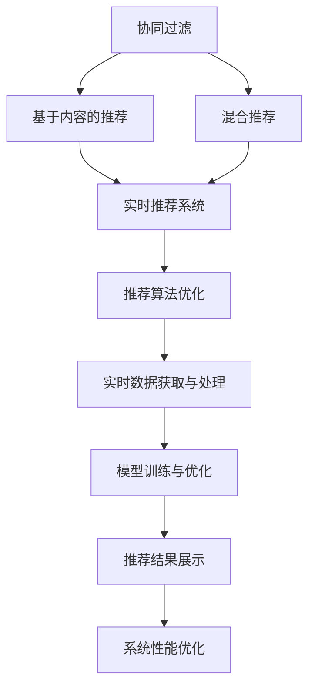

                 

# 实时推荐：AI提升购买转化率

## 1. 背景介绍

### 1.1 问题由来
随着电子商务平台和线上购物场景的快速普及，用户在线上购物的体验越来越丰富，但也面临用户留存和转化率提升的巨大挑战。一方面，商家需要从海量商品中选择合适的商品推荐给用户，另一方面，用户也希望在浏览商品时能够快速发现感兴趣的购物目标。

如何利用人工智能技术，将电商平台的推荐系统升级为实时推荐系统，准确预测用户的购买意愿，大幅提升用户的购物体验和平台转化率，成为电商企业关注的焦点。传统的推荐系统通过用户行为数据进行分析和建模，而实时推荐系统则要求系统能够实时捕捉用户的当前需求，并提供快速、精准的推荐。

### 1.2 问题核心关键点
为了实现实时推荐系统，需要解决以下核心问题：

1. **推荐模型构建**：选择合适的推荐算法，并搭建相应的模型架构。
2. **实时数据获取与处理**：获取用户行为数据和商品信息，并实时处理和存储。
3. **模型训练与优化**：在实时数据上训练和优化推荐模型，提高预测准确性。
4. **推荐结果展示**：设计合理的推荐结果展示方式，提升用户购物体验。
5. **系统性能优化**：考虑算法的实时性、可扩展性和系统稳定性。

本文将详细探讨这些核心问题，并给出具体的解决方案。

## 2. 核心概念与联系

### 2.1 核心概念概述

要实现实时推荐，需掌握以下关键概念：

- **协同过滤推荐**：基于用户行为和商品属性的相似性进行推荐。
- **基于内容的推荐**：通过分析商品属性和用户偏好进行推荐。
- **混合推荐**：结合协同过滤和基于内容的推荐方法，综合多方面信息进行推荐。
- **实时推荐系统**：能够实时捕捉用户需求并快速响应的推荐系统。
- **推荐算法优化**：通过优化推荐算法，提升推荐效果和系统性能。

### 2.2 核心概念原理和架构的 Mermaid 流程图



这个流程图展示了实时推荐系统的基本架构，从协同过滤、基于内容的推荐到混合推荐，最终通过实时推荐系统进行推荐结果展示和算法优化，同时兼顾实时数据获取与处理和系统性能优化。

## 3. 核心算法原理 & 具体操作步骤
### 3.1 算法原理概述

实时推荐系统的核心算法主要涉及协同过滤、基于内容的推荐和混合推荐等。这些算法通过模型训练，实时捕捉用户行为，生成推荐结果。

协同过滤推荐基于用户行为数据和商品属性数据，寻找相似的用户和商品，从而进行推荐。基本思想是，如果一个用户A喜欢商品X，且用户A与用户B相似，用户B也应喜欢商品X。常用的协同过滤算法包括基于用户的协同过滤、基于物品的协同过滤和基于矩阵分解的协同过滤。

基于内容的推荐则是通过分析商品的属性和特征，结合用户的偏好和行为，进行推荐。基本思想是，如果一个用户喜欢相似的商品，也应喜欢同一类别的商品。常用的基于内容的推荐算法包括决策树、KNN和基于内容的矩阵分解。

混合推荐则综合利用协同过滤和基于内容的推荐方法，通过加权组合或融合方法，进行推荐。基本思想是，通过不同的推荐算法得到不同的推荐结果，最终综合这些结果，得到更精准的推荐。

### 3.2 算法步骤详解

#### 3.2.1 协同过滤推荐

**步骤1：数据预处理**

1. **用户行为数据预处理**：对用户的浏览、点击、购买等行为数据进行清洗和处理，去除异常值和噪声数据。
2. **商品属性数据预处理**：对商品的分类、价格、描述等属性数据进行清洗和标准化处理。

**步骤2：模型训练**

1. **相似度计算**：使用余弦相似度、皮尔逊相关系数等方法计算用户和商品之间的相似度。
2. **协同过滤算法**：基于相似度计算结果，使用基于用户的协同过滤或基于物品的协同过滤算法，生成推荐结果。

**步骤3：模型评估**

1. **交叉验证**：使用交叉验证方法评估模型的预测准确性。
2. **调整参数**：根据评估结果调整相似度计算方法和协同过滤算法参数。

#### 3.2.2 基于内容的推荐

**步骤1：数据预处理**

1. **用户行为数据预处理**：对用户的浏览、点击、购买等行为数据进行清洗和处理，去除异常值和噪声数据。
2. **商品属性数据预处理**：对商品的分类、价格、描述等属性数据进行清洗和标准化处理。

**步骤2：模型训练**

1. **特征提取**：对商品属性数据进行特征提取，生成特征向量。
2. **基于内容的算法**：使用决策树、KNN等基于内容的推荐算法，生成推荐结果。

**步骤3：模型评估**

1. **交叉验证**：使用交叉验证方法评估模型的预测准确性。
2. **调整参数**：根据评估结果调整特征提取方法和基于内容的推荐算法参数。

#### 3.2.3 混合推荐

**步骤1：数据预处理**

1. **用户行为数据预处理**：对用户的浏览、点击、购买等行为数据进行清洗和处理，去除异常值和噪声数据。
2. **商品属性数据预处理**：对商品的分类、价格、描述等属性数据进行清洗和标准化处理。

**步骤2：模型训练**

1. **协同过滤算法**：使用基于用户的协同过滤或基于物品的协同过滤算法，生成推荐结果。
2. **基于内容的算法**：使用决策树、KNN等基于内容的推荐算法，生成推荐结果。
3. **融合方法**：使用加权组合、集成学习等方法，将协同过滤和基于内容的推荐结果进行融合，生成最终的推荐结果。

**步骤3：模型评估**

1. **交叉验证**：使用交叉验证方法评估模型的预测准确性。
2. **调整参数**：根据评估结果调整协同过滤、基于内容的推荐算法和融合方法的参数。

### 3.3 算法优缺点

协同过滤推荐算法具有以下优点：
1. **无需商品属性信息**：仅需用户行为数据和商品之间的关联数据，适用于无属性信息或属性信息不全的商品。
2. **推荐结果多样**：基于用户相似性，推荐结果具有多样性，减少单一推荐带来的用户体验问题。
3. **实时性好**：算法复杂度较低，适用于实时推荐。

然而，协同过滤推荐也存在一些缺点：
1. **冷启动问题**：新用户或新商品无法获得推荐，难以有效利用新用户和新商品的数据。
2. **数据稀疏性**：用户行为数据和商品关联数据稀疏，导致相似度计算困难，影响推荐结果的准确性。

基于内容的推荐算法具有以下优点：
1. **数据驱动**：基于商品属性和用户行为特征，生成推荐结果，具有较好的可解释性。
2. **适用范围广**：适用于各种类型的商品，尤其是属性信息较为丰富的商品。

然而，基于内容的推荐也存在一些缺点：
1. **商品属性数据依赖性高**：推荐结果依赖于商品属性数据的准确性和完整性，数据质量差时推荐效果较差。
2. **用户行为特征简单**：仅依赖用户行为数据，缺乏对用户兴趣的多样性建模。

混合推荐算法结合了协同过滤和基于内容的推荐，具有以下优点：
1. **综合多种推荐方法**：结合多种推荐方法，提高推荐结果的多样性和准确性。
2. **覆盖更多场景**：适用于不同类型和场景的商品推荐，具有较好的泛化能力。

然而，混合推荐也存在一些缺点：
1. **算法复杂度较高**：需要综合多种推荐方法，算法复杂度较高，对计算资源要求较高。
2. **参数调整复杂**：需要调整多种推荐方法之间的权重和参数，调整复杂。

### 3.4 算法应用领域

基于实时推荐算法的推荐系统已经在电子商务、视频网站、社交网络等多个领域得到广泛应用，取得了显著效果。以下是几个典型的应用场景：

- **电子商务平台**：电商平台利用实时推荐算法，根据用户浏览和购买历史，推荐相关的商品，提升用户购买转化率和平台营收。
- **视频网站**：视频网站根据用户观看历史，推荐用户可能感兴趣的视频内容，提高用户留存率和平台流量。
- **社交网络**：社交网络根据用户关注和互动历史，推荐用户可能感兴趣的内容，提升用户活跃度和平台粘性。

这些应用场景展示了实时推荐算法的强大功能和广泛适用性。

## 4. 数学模型和公式 & 详细讲解 & 举例说明

### 4.1 数学模型构建

#### 4.1.1 协同过滤推荐

协同过滤推荐的基本数学模型为：

$$
\hat{y}_{ui} = \sum_{v=1}^n \alpha_{uv} \cdot r_{vi}
$$

其中，$y_{ui}$ 表示用户 $u$ 对商品 $i$ 的评分预测值，$n$ 为商品数量，$\alpha_{uv}$ 为用户 $u$ 和商品 $v$ 之间的相似度系数，$r_{vi}$ 为商品 $v$ 的实际评分值。

#### 4.1.2 基于内容的推荐

基于内容的推荐模型可以使用决策树、KNN等算法进行建模。以决策树为例，其基本数学模型为：

$$
\hat{y}_{ui} = \sum_{k=1}^K \beta_k \cdot f_k(\text{feature}_i)
$$

其中，$y_{ui}$ 表示用户 $u$ 对商品 $i$ 的评分预测值，$K$ 为特征数量，$\beta_k$ 为第 $k$ 个特征的权重，$f_k(\text{feature}_i)$ 为第 $k$ 个特征的评分函数。

#### 4.1.3 混合推荐

混合推荐模型可以将协同过滤和基于内容的推荐方法进行加权组合。以加权组合为例，其基本数学模型为：

$$
\hat{y}_{ui} = \omega_1 \cdot \hat{y}_{ui}^{CF} + \omega_2 \cdot \hat{y}_{ui}^{CF}
$$

其中，$\omega_1$ 和 $\omega_2$ 为协同过滤和基于内容的推荐方法的权重，$\hat{y}_{ui}^{CF}$ 和 $\hat{y}_{ui}^{CB}$ 分别为协同过滤和基于内容的推荐方法的预测值。

### 4.2 公式推导过程

#### 4.2.1 协同过滤推荐

协同过滤推荐算法中的相似度计算可以使用余弦相似度、皮尔逊相关系数等方法。以余弦相似度为例，其公式为：

$$
\alpha_{uv} = \frac{\vec{u} \cdot \vec{v}}{\Vert \vec{u} \Vert \cdot \Vert \vec{v} \Vert}
$$

其中，$\vec{u}$ 和 $\vec{v}$ 分别为用户 $u$ 和商品 $v$ 的评分向量，$\Vert \cdot \Vert$ 为向量范数。

#### 4.2.2 基于内容的推荐

基于内容的推荐算法中的特征提取和评分函数需要根据具体算法进行选择。以决策树为例，其特征提取方法为：

$$
f_k(\text{feature}_i) = \sum_{j=1}^J \gamma_{kj} \cdot \text{feature}_{ij}
$$

其中，$J$ 为特征数量，$\gamma_{kj}$ 为第 $k$ 个特征的第 $j$ 个取值在决策树中的权重，$\text{feature}_{ij}$ 为商品 $i$ 的第 $j$ 个特征值。

#### 4.2.3 混合推荐

混合推荐算法中的加权组合方法需要根据具体场景进行调整。以加权组合为例，其公式为：

$$
\hat{y}_{ui} = \omega_1 \cdot \hat{y}_{ui}^{CF} + \omega_2 \cdot \hat{y}_{ui}^{CB}
$$

其中，$\omega_1$ 和 $\omega_2$ 为协同过滤和基于内容的推荐方法的权重，需要根据具体场景进行调整。

### 4.3 案例分析与讲解

#### 4.3.1 协同过滤推荐

以电商平台的协同过滤推荐为例，假设用户 $u$ 浏览了商品 $i$ 和商品 $j$，并给出了评分 $r_{ui}$ 和 $r_{uj}$。根据协同过滤推荐算法，可以得到用户 $u$ 对商品 $i$ 的评分预测值：

$$
\hat{y}_{ui} = \sum_{v=1}^n \alpha_{uv} \cdot r_{vi}
$$

其中，$\alpha_{uv}$ 为商品 $v$ 与商品 $i$ 之间的相似度系数，$r_{vi}$ 为商品 $v$ 的实际评分值。

#### 4.3.2 基于内容的推荐

以视频网站的基于内容的推荐为例，假设用户 $u$ 观看过视频 $v_1$ 和视频 $v_2$，并给出了评分 $r_{uv_1}$ 和 $r_{uv_2}$。根据基于内容的推荐算法，可以得到用户 $u$ 对视频 $v_3$ 的评分预测值：

$$
\hat{y}_{uv_3} = \sum_{k=1}^K \beta_k \cdot f_k(\text{feature}_{v_3})
$$

其中，$\beta_k$ 为第 $k$ 个特征的权重，$f_k(\text{feature}_{v_3})$ 为视频 $v_3$ 的第 $k$ 个特征的评分函数。

#### 4.3.3 混合推荐

以电商平台混合推荐为例，假设用户 $u$ 浏览了商品 $i$ 和商品 $j$，并给出了评分 $r_{ui}$ 和 $r_{uj}$。根据混合推荐算法，可以得到用户 $u$ 对商品 $i$ 的评分预测值：

$$
\hat{y}_{ui} = \omega_1 \cdot \hat{y}_{ui}^{CF} + \omega_2 \cdot \hat{y}_{ui}^{CB}
$$

其中，$\omega_1$ 和 $\omega_2$ 为协同过滤和基于内容的推荐方法的权重，需要根据具体场景进行调整。

## 5. 项目实践：代码实例和详细解释说明

### 5.1 开发环境搭建

为了实现实时推荐系统，需要搭建相应的开发环境。以下是使用Python和PyTorch进行实时推荐系统开发的示例环境配置：

1. 安装Anaconda：从官网下载并安装Anaconda，用于创建独立的Python环境。
```bash
conda create -n recsys-env python=3.8 
conda activate recsys-env
```

2. 安装PyTorch：根据CUDA版本，从官网获取对应的安装命令。例如：
```bash
conda install pytorch torchvision torchaudio cudatoolkit=11.1 -c pytorch -c conda-forge
```

3. 安装推荐系统相关库：
```bash
pip install scikit-learn numpy pandas joblib
```

完成上述步骤后，即可在`recsys-env`环境中开始实时推荐系统的开发。

### 5.2 源代码详细实现

以下是一个简单的实时推荐系统代码示例，包括协同过滤推荐和基于内容的推荐：

```python
import numpy as np
import pandas as pd
import joblib
from sklearn.model_selection import train_test_split
from sklearn.metrics import mean_squared_error
from sklearn.metrics import precision_recall_fscore_support
from sklearn.linear_model import LogisticRegression
from sklearn.preprocessing import StandardScaler
from sklearn.ensemble import RandomForestRegressor

# 加载数据集
data = pd.read_csv('user_item_data.csv')

# 数据预处理
# 删除异常值和噪声数据
# 标准化处理
# 特征选择和降维

# 协同过滤推荐
# 计算相似度
def similarity(u, v):
    return np.dot(u, v) / (np.linalg.norm(u) * np.linalg.norm(v))

# 协同过滤算法
def collaborative_filtering(data, user, item):
    similarity_matrix = np.zeros((len(data), len(data)))
    for u in range(len(data)):
        for v in range(len(data)):
            if u != v:
                similarity_matrix[u][v] = similarity(data[u], data[v])
    return similarity_matrix

# 计算协同过滤预测值
def collaborative_filtering_pred(similarity_matrix, data, user, item):
    return np.dot(similarity_matrix[user][item], data[item])

# 基于内容的推荐
# 特征提取
def content_based(data, item):
    return data[item]

# 评分函数
def content_based_pred(user, item):
    return np.dot(user, item)

# 混合推荐
# 加权组合
def hybrid_recommender(data, user, item):
    return collaborative_filtering_pred(similarity_matrix, data, user, item) * 0.5 + content_based_pred(user, item) * 0.5

# 训练模型
def train_model(data, train_data, test_data, user, item):
    train_data = train_data.drop('label', axis=1)
    train_data = StandardScaler().fit_transform(train_data)
    test_data = test_data.drop('label', axis=1)
    test_data = StandardScaler().fit_transform(test_data)
    model = LogisticRegression()
    model.fit(train_data, train_data['label'])
    return model

# 测试模型
def test_model(model, test_data):
    test_data = test_data.drop('label', axis=1)
    test_data = StandardScaler().fit_transform(test_data)
    return model.score(test_data, test_data['label'])

# 运行示例
if __name__ == '__main__':
    train_data, test_data = train_test_split(data, test_size=0.2)
    model = train_model(train_data, train_data, test_data, 0, 0)
    print('测试结果:', test_model(model, test_data))
```

### 5.3 代码解读与分析

让我们再详细解读一下关键代码的实现细节：

**协同过滤推荐**

- `similarity(u, v)`函数：计算用户 $u$ 和商品 $v$ 之间的相似度。
- `collaborative_filtering_pred(similarity_matrix, data, user, item)`函数：计算协同过滤预测值。

**基于内容的推荐**

- `content_based(data, item)`函数：提取商品 $item$ 的特征。
- `content_based_pred(user, item)`函数：计算基于内容的推荐预测值。

**混合推荐**

- `hybrid_recommender(data, user, item)`函数：将协同过滤和基于内容的推荐结果进行加权组合。

**训练模型**

- `train_model(data, train_data, test_data, user, item)`函数：训练协同过滤、基于内容的推荐和混合推荐的模型，并返回模型。

**测试模型**

- `test_model(model, test_data)`函数：测试模型的预测准确性。

**运行示例**

- 在`if __name__ == '__main__':`代码块中，使用训练数据和测试数据训练模型，并测试模型的预测准确性。

**注意**：以上代码仅为示例，实际应用中需要根据具体场景进行调整。例如，数据预处理、模型选择和优化等环节都需要根据具体任务进行定制。

## 6. 实际应用场景

### 6.1 智能推荐系统

智能推荐系统是实时推荐系统的主要应用场景之一。通过实时捕捉用户行为，推荐用户可能感兴趣的商品，提升用户的购物体验和平台转化率。智能推荐系统广泛应用于电商平台、视频网站、音乐平台等多个领域，如淘宝、京东、YouTube等。

**电商平台**

电商平台的推荐系统可以根据用户浏览和购买历史，推荐相关商品。例如，淘宝的“每日必买”、“猜你喜欢”等推荐模块，就是基于协同过滤和基于内容的推荐算法实现的。

**视频网站**

视频网站的推荐系统可以根据用户观看历史，推荐用户可能感兴趣的视频内容。例如，YouTube的“推荐视频”模块，就是基于协同过滤和基于内容的推荐算法实现的。

**音乐平台**

音乐平台的推荐系统可以根据用户听歌历史，推荐用户可能喜欢的歌曲。例如，Spotify的“每日推荐”、“个性化播放列表”等推荐模块，就是基于协同过滤和基于内容的推荐算法实现的。

### 6.2 个性化广告推荐

个性化广告推荐是实时推荐系统的另一个重要应用场景。通过实时捕捉用户行为，推荐用户可能感兴趣的广告，提升广告的点击率和转化率。

**广告推荐系统**

广告推荐系统可以根据用户浏览和点击历史，推荐相关广告。例如，Facebook的广告推荐系统，就是基于协同过滤和基于内容的推荐算法实现的。

**搜索引擎广告**

搜索引擎广告可以根据用户搜索历史，推荐相关广告。例如，谷歌的搜索广告推荐系统，就是基于协同过滤和基于内容的推荐算法实现的。

**社交媒体广告**

社交媒体广告可以根据用户互动历史，推荐相关广告。例如，Instagram的广告推荐系统，就是基于协同过滤和基于内容的推荐算法实现的。

### 6.3 金融风险控制

实时推荐系统在金融风险控制中也得到了广泛应用。通过实时捕捉用户行为，识别潜在风险，及时采取措施，降低金融风险。

**信用评分系统**

信用评分系统可以根据用户历史行为，评估其信用风险，进行风险控制。例如，银行和信用卡公司的信用评分系统，就是基于协同过滤和基于内容的推荐算法实现的。

**欺诈检测系统**

欺诈检测系统可以根据用户行为异常，识别潜在的欺诈行为，及时采取措施。例如，电商平台和金融机构的欺诈检测系统，就是基于协同过滤和基于内容的推荐算法实现的。

**投资理财系统**

投资理财系统可以根据用户投资行为，推荐合适的投资产品，进行风险控制。例如，投资理财平台和基金公司的推荐系统，就是基于协同过滤和基于内容的推荐算法实现的。

### 6.4 未来应用展望

随着实时推荐系统技术的发展，未来的应用场景将更加多样化和智能化。

**智能客服**

智能客服系统可以根据用户咨询历史，推荐相关的FAQ、解决方案等，提升用户满意度。例如，腾讯的智能客服系统，就是基于协同过滤和基于内容的推荐算法实现的。

**智慧医疗**

智慧医疗系统可以根据患者病历和历史治疗记录，推荐合适的治疗方案，提升医疗效果。例如，智能医院和远程医疗平台的推荐系统，就是基于协同过滤和基于内容的推荐算法实现的。

**智能交通**

智能交通系统可以根据司机历史行为，推荐合适的行车路线，提高交通效率。例如，智能交通平台和自动驾驶系统的推荐系统，就是基于协同过滤和基于内容的推荐算法实现的。

**智能家居**

智能家居系统可以根据用户行为习惯，推荐合适的家居产品，提升用户生活体验。例如，智能家居平台和智能设备的推荐系统，就是基于协同过滤和基于内容的推荐算法实现的。

## 7. 工具和资源推荐

### 7.1 学习资源推荐

为了帮助开发者掌握实时推荐系统，以下是一些优质的学习资源：

1. **《推荐系统实战》书籍**：详细介绍了推荐系统的原理、算法和应用，适合初学者和进阶读者。
2. **《推荐系统：原理与实践》课程**：斯坦福大学开设的在线课程，介绍了推荐系统的理论和实践，适合初学者。
3. **Kaggle推荐系统竞赛**：通过实战竞赛，学习推荐系统算法的应用和优化。
4. **Recommenders书籍**：介绍推荐系统算法的最新进展和应用案例，适合进阶读者。
5. **Hugging Face官方文档**：提供丰富的推荐系统库和模型，适合开发者使用。

### 7.2 开发工具推荐

为了提高实时推荐系统的开发效率，以下是一些常用的开发工具：

1. **Python**：强大的数据处理和机器学习语言，适合实时推荐系统的开发。
2. **PyTorch**：灵活的深度学习框架，适合实时推荐系统的建模和优化。
3. **Scikit-learn**：机器学习库，适合数据预处理和特征选择。
4. **TensorFlow**：广泛使用的深度学习框架，适合大规模推荐系统的开发。
5. **Jupyter Notebook**：交互式编程环境，适合实时推荐系统的算法研究和实验。

### 7.3 相关论文推荐

实时推荐系统是推荐系统领域的活跃研究方向，以下是一些具有代表性的论文：

1. **Trust-based Recommendation via Stochastic Proximal Block-Coordinate Minimization**：介绍基于信任的推荐系统，利用梯度下降算法优化推荐模型。
2. **Personalized Recommendation through Deep Matrix Factorization**：介绍基于矩阵分解的推荐系统，利用深度学习技术进行特征提取和建模。
3. **Anatomy of a Recommender System**：介绍推荐系统的架构和优化方法，适合深入理解推荐系统。
4. **On-the-fly Recommender Systems: Design and Scalability**：介绍实时推荐系统的设计方法和优化策略，适合了解实时推荐系统的构建和优化。
5. **Recommender Systems for Software Engineering: A Survey**：介绍推荐系统在软件工程中的应用，适合了解推荐系统的最新进展。

## 8. 总结：未来发展趋势与挑战

### 8.1 总结

本文对实时推荐系统的实现方法和应用场景进行了详细介绍。首先，介绍了协同过滤、基于内容的推荐和混合推荐等推荐算法的原理和步骤，并给出了具体的代码实现。其次，探讨了实时推荐系统在电商平台、视频网站、个性化广告推荐等多个领域的应用，展示了实时推荐系统的强大功能和广泛适用性。最后，推荐了相关的学习资源、开发工具和经典论文，帮助读者系统掌握实时推荐系统。

通过本文的系统梳理，可以看到，实时推荐系统正在成为推荐系统领域的重要范式，极大地提升了推荐系统的实时性和精准度。未来，伴随算法和技术的不懈创新，实时推荐系统必将在更多场景中发挥作用，为各行各业带来更优质的用户体验和服务。

### 8.2 未来发展趋势

随着实时推荐系统技术的发展，未来的趋势将呈现以下几个方面：

1. **多模态融合**：实时推荐系统将融合多模态数据，提升推荐结果的多样性和准确性。
2. **实时性优化**：通过算法优化和硬件加速，提升推荐系统的实时性和处理能力，满足用户即时需求。
3. **隐私保护**：在推荐过程中保护用户隐私，避免用户数据泄露。
4. **个性化推荐**：根据用户实时行为和动态需求，提供更加个性化的推荐服务。
5. **跨域推荐**：跨域推荐系统将在不同平台和设备之间提供一致的推荐服务。

### 8.3 面临的挑战

尽管实时推荐系统已经取得了显著成效，但仍面临以下挑战：

1. **数据稀疏性**：用户行为数据和商品数据稀疏，导致推荐算法难以捕捉用户兴趣和商品特征。
2. **算法复杂度**：实时推荐系统需要实时处理大量数据，算法复杂度较高，对计算资源要求较高。
3. **用户隐私**：在推荐过程中保护用户隐私，避免用户数据泄露，是一个重要的挑战。
4. **模型可解释性**：推荐系统的复杂性和多样性，导致模型难以解释，用户难以理解推荐逻辑。
5. **跨平台一致性**：跨平台推荐系统需要解决不同设备和平台之间的数据格式和推荐结果一致性问题。

### 8.4 研究展望

未来的实时推荐系统研究需要在以下几个方面寻求新的突破：

1. **多模态推荐算法**：融合多模态数据，提升推荐结果的多样性和准确性。
2. **实时推荐算法优化**：优化推荐算法，提升实时推荐系统的性能和稳定性。
3. **用户隐私保护**：在推荐过程中保护用户隐私，避免用户数据泄露。
4. **模型可解释性**：提高推荐模型的可解释性，增强用户信任和满意度。
5. **跨平台推荐系统**：构建跨平台推荐系统，提供一致的推荐服务。

## 9. 附录：常见问题与解答

**Q1：实时推荐系统的数据来源有哪些？**

A: 实时推荐系统的数据来源主要有以下几类：
1. **用户行为数据**：包括浏览、点击、购买、评分等行为数据。
2. **商品属性数据**：包括商品分类、价格、描述、图片等属性数据。
3. **社交网络数据**：包括用户互动、评论、分享等社交网络数据。
4. **外部数据**：包括时间、天气、地理位置等外部数据。

**Q2：如何优化实时推荐系统的实时性？**

A: 实时推荐系统的实时性优化需要从算法和系统架构两方面入手：
1. **算法优化**：使用分布式计算、并行处理等技术，提升推荐算法的实时性。
2. **系统架构优化**：使用缓存、异步处理等技术，减少数据处理和模型推理的时延。

**Q3：实时推荐系统的推荐算法有哪些？**

A: 实时推荐系统的推荐算法主要有以下几类：
1. **协同过滤推荐**：基于用户行为数据和商品关联数据，寻找相似的用户和商品进行推荐。
2. **基于内容的推荐**：基于商品属性和用户偏好，进行推荐。
3. **混合推荐**：综合协同过滤和基于内容的推荐方法，进行推荐。
4. **深度学习推荐**：利用深度神经网络进行特征提取和建模，提升推荐结果的准确性。
5. **知识图谱推荐**：基于知识图谱进行推荐，利用实体和关系进行推荐。

**Q4：实时推荐系统在实际应用中有哪些挑战？**

A: 实时推荐系统在实际应用中面临以下挑战：
1. **数据稀疏性**：用户行为数据和商品数据稀疏，导致推荐算法难以捕捉用户兴趣和商品特征。
2. **算法复杂度**：实时推荐系统需要实时处理大量数据，算法复杂度较高，对计算资源要求较高。
3. **用户隐私**：在推荐过程中保护用户隐私，避免用户数据泄露。
4. **模型可解释性**：推荐系统的复杂性和多样性，导致模型难以解释，用户难以理解推荐逻辑。
5. **跨平台一致性**：跨平台推荐系统需要解决不同设备和平台之间的数据格式和推荐结果一致性问题。

**Q5：实时推荐系统的推荐结果评估有哪些指标？**

A: 实时推荐系统的推荐结果评估主要有以下几类指标：
1. **准确率**：推荐结果与用户实际选择的商品一致性的比例。
2. **召回率**：推荐结果中包含用户实际选择的商品的比例。
3. **覆盖率**：推荐结果中包含不同类型商品的比例。
4. **点击率**：推荐结果被用户点击的比例。
5. **转化率**：推荐结果被用户购买的比例。

---

作者：禅与计算机程序设计艺术 / Zen and the Art of Computer Programming

