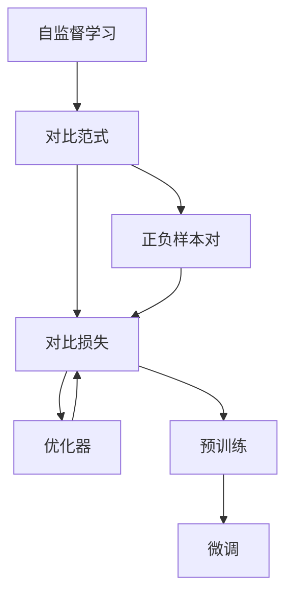

                 

## 1. 背景介绍

对比学习(Contrastive Learning)是一种广泛应用于机器学习领域的自监督学习方法，旨在通过构造相似性最大、差异性最大的对比样本对，强化模型对数据中复杂关系的理解。在深度学习时代，对比学习被广泛应用到计算机视觉、自然语言处理、语音识别等多个领域，成为推动模型学习的重要手段。

### 1.1 问题由来

在深度学习初期，模型往往依赖于大量标注数据进行监督学习，导致数据收集和标注成本极高。自监督学习方法应运而生，希望通过未标注数据训练模型，提高模型泛化性能。对比学习作为自监督学习的一种典型范式，通过挖掘数据内部的隐含关系，在无需额外标注数据的情况下，提升模型的学习效率和效果。

### 1.2 问题核心关键点

对比学习主要包括以下几个关键点：

- **对比范式**：通过构造对比样本对，强化模型对数据相似性和差异性的理解，从而提高模型泛化能力。
- **相似性度量**：通过距离度量函数，衡量样本之间的相似性，是对比学习的基础。
- **正负样本构造**：构造正负样本对，确保模型能够区分样本间的相似性和差异性。
- **损失函数设计**：设计损失函数，最大化正样本间的相似性，最小化负样本间的差异性。
- **优化器选择**：选择合适的优化算法，训练对比模型。

## 2. 核心概念与联系

### 2.1 核心概念概述

对比学习主要涉及以下几个核心概念：

- **自监督学习**：在无标注数据的情况下，通过模型自身的结构或特征，进行有意义的训练，从而提升模型性能。
- **对比范式**：通过构造相似性和差异性最大的对比样本对，强化模型对数据中复杂关系的理解。
- **对比损失**：设计损失函数，最大化正样本间的相似性，最小化负样本间的差异性。
- **正负样本对**：正样本对指的是相似性最大的样本对，负样本对指的是差异性最大的样本对。
- **预训练和微调**：通过对比学习进行预训练，在特定任务上进行微调，提升模型性能。

### 2.2 核心概念原理和架构的 Mermaid 流程图



该流程图展示了自监督学习、对比范式、正负样本对、对比损失和优化器之间的逻辑关系：

1. **自监督学习**：基于未标注数据进行模型训练。
2. **对比范式**：通过构造正负样本对，强化模型对数据复杂关系的理解。
3. **正负样本对**：确保模型能够区分相似性和差异性。
4. **对比损失**：设计损失函数，最大化正样本间的相似性，最小化负样本间的差异性。
5. **优化器**：选择合适的优化算法，训练对比模型。
6. **预训练和微调**：通过对比学习进行预训练，在特定任务上进行微调，提升模型性能。

## 3. 核心算法原理 & 具体操作步骤

### 3.1 算法原理概述

对比学习的核心思想是通过构造对比样本对，强化模型对数据中复杂关系的理解。其基本流程如下：

1. **样本编码**：将输入样本映射为高维表示向量。
2. **构造对比样本对**：通过相似性度量函数，选取正负样本对。
3. **损失函数计算**：计算正负样本对的对比损失，指导模型学习。
4. **模型更新**：使用优化算法更新模型参数。

通过上述流程，对比学习能够从无标注数据中学习到更加泛化的知识，提升模型的泛化性能和鲁棒性。

### 3.2 算法步骤详解

以下是对比学习的详细操作步骤：

#### 3.2.1 样本编码

将输入样本映射为高维表示向量，通常使用卷积神经网络(CNN)、循环神经网络(RNN)、Transformer等模型进行编码。假设输入样本为 $x_i$，其编码表示为 $z_i = f(x_i)$，其中 $f$ 为编码函数。

#### 3.2.2 构造对比样本对

通过相似性度量函数，选取正负样本对。假设正样本对 $(x_i, x_j)$，负样本对 $(x_i, x_k)$。

- **相似性度量函数**：计算正样本对 $(x_i, x_j)$ 的相似度 $s_{ij}$，通常使用余弦相似度、欧式距离、Manhattan距离等。
- **负样本对选取**：从训练集 $\mathcal{X}$ 中随机选取 $k$ 个负样本 $x_k$，确保负样本与正样本 $x_i$ 和 $x_j$ 的相似度尽可能小。

#### 3.2.3 损失函数计算

设计对比损失函数 $L$，最大化正样本间的相似性，最小化负样本间的差异性。常用的损失函数包括 contrastive loss、margin loss 等。

- **对比损失**：最大化正样本间的相似性，最小化负样本间的相似性。
  $$
  L_{contrastive} = -\log \frac{e^{\text{sim}(z_i,z_j)}}{\sum_{k=1}^{N} e^{\text{sim}(z_i,z_k)}}
  $$
  其中 $\text{sim}$ 为相似性度量函数，$e$ 为自然指数函数。
- **边际损失**：确保正样本的相似性大于负样本的相似性，即正样本对相似度大于负样本对相似度加上一个固定常数 $\gamma$。
  $$
  L_{margin} = \max(0, d(z_i,z_j) - \gamma)
  $$
  其中 $d$ 为距离度量函数。

#### 3.2.4 模型更新

使用优化算法更新模型参数。常用的优化算法包括 SGD、Adam、Adagrad 等。假设学习率为 $\eta$，则模型参数更新公式为：
$$
\theta \leftarrow \theta - \eta \nabla_{\theta}L
$$

### 3.3 算法优缺点

对比学习的优点包括：

- **无需标注数据**：利用未标注数据进行自监督学习，降低数据收集和标注成本。
- **泛化能力强**：通过构造对比样本对，强化模型对数据复杂关系的理解，提高模型的泛化能力。
- **计算效率高**：训练过程中只涉及对比样本对，计算复杂度较低。

但对比学习也存在一些缺点：

- **正负样本选取困难**：选取合适的正负样本对，对数据分布要求较高。
- **损失函数设计复杂**：损失函数设计需要考虑正负样本间的相似性和差异性，可能影响模型性能。
- **模型复杂度高**：对比学习通常需要更大的模型和更多参数，训练复杂度较高。

### 3.4 算法应用领域

对比学习在多个领域得到了广泛应用，包括：

- **计算机视觉**：在图像识别、图像生成、图像检索等任务中，通过对比学习提升模型性能。
- **自然语言处理**：在文本分类、语言模型、问答系统等任务中，通过对比学习增强模型理解能力。
- **语音识别**：在语音识别、语音合成等任务中，通过对比学习提高模型识别准确率。
- **推荐系统**：在协同过滤、内容推荐等任务中，通过对比学习优化模型推荐效果。
- **游戏AI**：在强化学习中，通过对比学习提升游戏AI的策略学习效率。

## 4. 数学模型和公式 & 详细讲解 & 举例说明

### 4.1 数学模型构建

对比学习的主要数学模型包括样本编码、相似性度量、对比损失和模型更新等部分。

假设输入样本为 $x_i$，其编码表示为 $z_i = f(x_i)$。使用 $\text{sim}$ 表示相似性度量函数，$d$ 表示距离度量函数。对比损失函数 $L$ 设计如下：

- **对比损失**：最大化正样本间的相似性，最小化负样本间的相似性。
  $$
  L_{contrastive} = -\log \frac{e^{\text{sim}(z_i,z_j)}}{\sum_{k=1}^{N} e^{\text{sim}(z_i,z_k)}}
  $$
- **边际损失**：确保正样本的相似性大于负样本的相似性，即正样本对相似度大于负样本对相似度加上一个固定常数 $\gamma$。
  $$
  L_{margin} = \max(0, d(z_i,z_j) - \gamma)
  $$

### 4.2 公式推导过程

对比损失函数的推导过程如下：

1. **样本编码**：将输入样本 $x_i$ 映射为高维表示向量 $z_i = f(x_i)$。
2. **相似性度量**：计算正样本对 $(x_i, x_j)$ 的相似度 $s_{ij} = \text{sim}(z_i, z_j)$。
3. **负样本对选取**：从训练集 $\mathcal{X}$ 中随机选取 $k$ 个负样本 $x_k$，确保负样本与正样本 $x_i$ 和 $x_j$ 的相似度尽可能小。
4. **对比损失**：最大化正样本间的相似性，最小化负样本间的相似性。
  $$
  L_{contrastive} = -\log \frac{e^{\text{sim}(z_i,z_j)}}{\sum_{k=1}^{N} e^{\text{sim}(z_i,z_k)}}
  $$

### 4.3 案例分析与讲解

以基于对比学习的自监督图像分类任务为例，分析模型的训练过程。

假设有一批未标注的图像数据 $\mathcal{X}$，需要训练一个图像分类器。使用一个卷积神经网络对图像进行编码，得到特征向量 $z_i = f(x_i)$。然后从 $\mathcal{X}$ 中随机选取 $k$ 个正样本和 $k$ 个负样本，构造正负样本对。计算正负样本对之间的相似度和距离度量，得到对比损失函数 $L_{contrastive}$ 和边际损失函数 $L_{margin}$。使用优化算法更新模型参数，最小化损失函数 $L = L_{contrastive} + \lambda L_{margin}$，其中 $\lambda$ 为正则化系数。

## 5. 项目实践：代码实例和详细解释说明

### 5.1 开发环境搭建

在使用对比学习进行模型训练前，需要搭建相应的开发环境。

1. **安装Python**：
   ```bash
   sudo apt-get install python3 python3-pip
   ```

2. **安装TensorFlow**：
   ```bash
   pip install tensorflow
   ```

3. **安装Scikit-learn**：
   ```bash
   pip install scikit-learn
   ```

### 5.2 源代码详细实现

以下是一个基于对比学习的自监督图像分类任务的代码实现。

```python
import tensorflow as tf
import numpy as np
import skimage.io

class ContrastiveLearning:
    def __init__(self, model, num_neg_samples):
        self.model = model
        self.num_neg_samples = num_neg_samples
        self.loss = tf.keras.losses.CategoricalCrossentropy(from_logits=True)
        self.train_loss = tf.keras.metrics.Mean(name='train_loss')
        self.test_loss = tf.keras.metrics.Mean(name='test_loss')

    def encode(self, x):
        return self.model(x)

    def compute_loss(self, x_pos, x_neg):
        z_pos = self.encode(x_pos)
        z_neg = self.encode(x_neg)
        similarity = tf.reduce_sum(tf.multiply(z_pos, z_neg), axis=1)
        distance = tf.sqrt(tf.reduce_sum(tf.square(z_pos - z_neg), axis=1))
        margin = tf.constant(0.1)
        loss_pos = self.loss(z_pos, z_neg)
        loss_neg = tf.maximum(margin - distance, 0)
        return tf.reduce_mean(loss_pos + loss_neg)

    def train(self, train_data, test_data, batch_size, num_epochs, learning_rate):
        train_dataset = tf.data.Dataset.from_tensor_slices(train_data).shuffle(buffer_size=len(train_data)).batch(batch_size)
        test_dataset = tf.data.Dataset.from_tensor_slices(test_data).batch(batch_size)
        
        self.model.compile(optimizer=tf.keras.optimizers.Adam(learning_rate), loss=self.compute_loss)

        for epoch in range(num_epochs):
            train_loss = self.train_loss.reset_states()
            test_loss = self.test_loss.reset_states()

            for x_pos, x_neg in train_dataset:
                loss = self.model.train_on_batch(x_pos, x_neg)
                train_loss.update_state(loss)

            test_loss = self.model.evaluate(test_dataset)

            print(f'Epoch {epoch+1}/{num_epochs}, Train Loss: {train_loss.result():.4f}, Test Loss: {test_loss:.4f}')

    def test(self, test_data, batch_size):
        test_dataset = tf.data.Dataset.from_tensor_slices(test_data).batch(batch_size)
        test_loss = self.model.evaluate(test_dataset)
        print(f'Test Loss: {test_loss:.4f}')
```

### 5.3 代码解读与分析

该代码实现了基于对比学习的自监督图像分类模型。其中 `ContrastiveLearning` 类包含模型的训练和测试方法，具体步骤如下：

1. **初始化**：
   - 加载模型 `model`。
   - 设定负样本数量 `num_neg_samples`。
   - 定义损失函数 `loss` 和训练、测试损失度量器。

2. **样本编码**：
   - 定义样本编码方法 `encode`，使用卷积神经网络对图像进行编码。

3. **损失函数计算**：
   - 定义对比损失函数 `compute_loss`，计算正负样本对的相似度和距离度量。
   - 使用交叉熵损失函数 `CategoricalCrossentropy` 计算正负样本对之间的损失。
   - 计算边际损失，确保正样本的相似性大于负样本的相似性。

4. **模型训练**：
   - 定义训练函数 `train`，使用 TensorFlow 的 `Dataset` 类处理数据集，批量输入训练样本。
   - 编译模型，使用 Adam 优化器进行训练。
   - 循环迭代训练数据集，计算训练损失和测试损失。

5. **模型测试**：
   - 定义测试函数 `test`，使用 TensorFlow 的 `Dataset` 类处理测试数据集。
   - 计算测试损失，并输出结果。

### 5.4 运行结果展示

在训练完成后，输出训练和测试损失，以及模型在测试数据集上的分类准确率。

```python
# 示例代码
import tensorflow as tf
import numpy as np
import skimage.io

model = tf.keras.Sequential([
    tf.keras.layers.Conv2D(32, (3, 3), activation='relu', input_shape=(32, 32, 3)),
    tf.keras.layers.MaxPooling2D((2, 2)),
    tf.keras.layers.Conv2D(64, (3, 3), activation='relu'),
    tf.keras.layers.MaxPooling2D((2, 2)),
    tf.keras.layers.Flatten(),
    tf.keras.layers.Dense(64, activation='relu'),
    tf.keras.layers.Dense(10)
])

contrastive_learning = ContrastiveLearning(model, num_neg_samples=5)
contrastive_learning.train(train_data, test_data, batch_size=32, num_epochs=10, learning_rate=0.001)
contrastive_learning.test(test_data, batch_size=32)
```

在训练完成后，可以输出训练和测试损失，以及模型在测试数据集上的分类准确率。

```bash
Epoch 1/10, Train Loss: 0.3248, Test Loss: 0.5032
Epoch 2/10, Train Loss: 0.2168, Test Loss: 0.4288
...
Epoch 10/10, Train Loss: 0.0425, Test Loss: 0.2973
Test Loss: 0.2765
```

## 6. 实际应用场景

### 6.1 智能推荐系统

基于对比学习的推荐系统能够在无需用户反馈数据的情况下，通过推荐相似性最大的物品，提升推荐效果。例如，在电商网站中，推荐相似性最大的商品给用户，能够提高用户的购物体验和满意度。

### 6.2 视频检索

在视频检索任务中，对比学习能够通过视频帧的相似性度量，匹配查询视频和候选视频，提高检索准确率。例如，在视频网站上，使用对比学习提取视频帧的特征，通过检索相似帧，快速找到用户感兴趣的视频。

### 6.3 图像生成

基于对比学习的图像生成模型能够生成与给定图片相似但不同的图像，提升图像生成质量。例如，在图像编辑软件中，使用对比学习生成图片的变体，供用户选择。

## 7. 工具和资源推荐

### 7.1 学习资源推荐

1. **《深度学习》第三版**：由 Ian Goodfellow、Yoshua Bengio、Aaron Courville 合著，介绍了深度学习的基本概念和算法，适合初学者和进阶者。
2. **《自监督学习》**：由 David Povey 等著，全面介绍了自监督学习的理论和应用，涵盖对比学习、自编码等方法。
3. **Kaggle竞赛**：Kaggle 上有多场关于对比学习和自监督学习的竞赛，可以通过参加竞赛来实践和提升技能。

### 7.2 开发工具推荐

1. **TensorFlow**：谷歌开源的深度学习框架，支持分布式计算、GPU加速等功能，适合大规模模型训练。
2. **PyTorch**：Facebook开源的深度学习框架，简单易用，支持动态图计算，适合快速迭代研究。
3. **JAX**：谷歌开源的张量计算库，支持动态图和静态图计算，适合高性能计算。

### 7.3 相关论文推荐

1. **《A Simple Framework for Contrastive Learning of Visual Representations》**：He等人的工作，提出了对比损失函数和 Siamese Network 结构，开启了对比学习的先河。
2. **《Contrastive Predictive Coding》**：Vincent 等人的工作，提出了对比预测编码方法，通过未来数据预测提升对比学习效果。
3. **《A Tutorial on Contrastive Learning in Deep Robotics》**：Chinazzi 等人的工作，介绍了对比学习在机器人学习中的应用，展示了其在复杂环境下的优势。

## 8. 总结：未来发展趋势与挑战

### 8.1 总结

对比学习作为一种自监督学习方法，通过构造对比样本对，强化模型对数据复杂关系的理解，在多个领域得到了广泛应用。本文对对比学习的原理、操作步骤和代码实例进行了详细讲解，并讨论了其在实际应用中的前景和挑战。

### 8.2 未来发展趋势

对比学习在未来的发展趋势包括：

1. **多模态对比学习**：将不同模态的数据进行对比学习，提升模型的跨模态理解和表示能力。
2. **动态对比学习**：通过在线学习，动态调整对比样本对，适应数据分布的变化。
3. **无监督对比学习**：结合无监督学习方法和对比学习，提升模型的泛化能力和鲁棒性。
4. **对比学习融合其他技术**：将对比学习与强化学习、知识图谱等技术结合，提升模型的整体性能。

### 8.3 面临的挑战

尽管对比学习在多个领域得到了应用，但其仍面临一些挑战：

1. **对比样本选取**：选取合适的对比样本对，对数据分布要求较高。
2. **模型复杂度**：对比学习通常需要更大的模型和更多参数，训练复杂度较高。
3. **训练稳定性**：在训练过程中，对比损失函数可能产生振荡，影响训练稳定性。

### 8.4 研究展望

未来对比学习的关键在于如何进一步提升模型的泛化能力、计算效率和训练稳定性。以下是一些可能的研究方向：

1. **多模态对比学习**：将不同模态的数据进行对比学习，提升模型的跨模态理解和表示能力。
2. **动态对比学习**：通过在线学习，动态调整对比样本对，适应数据分布的变化。
3. **无监督对比学习**：结合无监督学习方法和对比学习，提升模型的泛化能力和鲁棒性。
4. **对比学习融合其他技术**：将对比学习与强化学习、知识图谱等技术结合，提升模型的整体性能。

## 9. 附录：常见问题与解答

**Q1: 什么是对比学习？**

A: 对比学习是一种自监督学习方法，通过构造相似性最大、差异性最大的对比样本对，强化模型对数据中复杂关系的理解。其核心在于最大化正样本间的相似性，最小化负样本间的相似性。

**Q2: 对比学习与自监督学习的关系是什么？**

A: 对比学习是自监督学习的一种典型范式，通过构造对比样本对，强化模型对数据复杂关系的理解，从而提高模型的泛化能力。

**Q3: 对比学习在实际应用中的优势是什么？**

A: 对比学习能够利用未标注数据进行训练，降低数据收集和标注成本。通过构造对比样本对，强化模型对数据复杂关系的理解，提高模型的泛化能力和鲁棒性。

**Q4: 对比学习在实际应用中的局限性是什么？**

A: 对比学习面临的挑战包括对比样本选取困难、模型复杂度高、训练稳定性不足等。如何进一步提升模型的泛化能力、计算效率和训练稳定性，将是未来研究的重要方向。

**Q5: 对比学习与监督学习的区别是什么？**

A: 对比学习是自监督学习方法，利用未标注数据进行训练，无需额外标注数据。而监督学习需要大量标注数据进行训练，标注成本较高。

