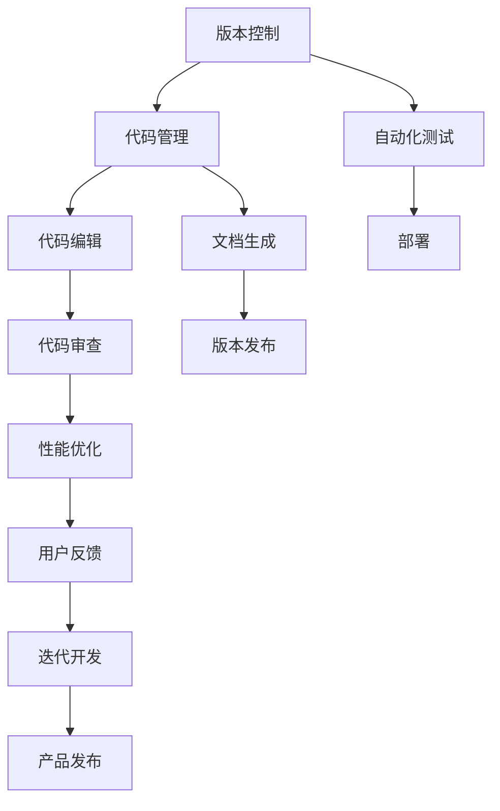

                 

## 1. 背景介绍

### 1.1 问题由来

在信息技术快速发展的今天，工具和平台在软件开发生命周期中的作用日益凸显。无论是架构设计、开发调试，还是部署上线，高效的工具和合理的规划都是项目成功的关键。然而，许多开发者在工具选择和规划时往往遇到难题：如何在种类繁多的工具中做出最优选择，如何根据项目需求灵活调整规划。本文旨在为开发者提供全面的工具和规划应用指导，帮助他们在实际开发中游刃有余。

### 1.2 问题核心关键点

合理规划和有效使用工具，可以显著提升开发效率和项目质量。本文将探讨：

1. **工具选择**：如何根据项目需求和自身偏好选择合适的开发工具。
2. **规划流程**：如何制定和调整项目开发规划，确保项目顺利进行。
3. **工具集成**：如何将多个工具有机整合，构建高效开发环境。
4. **应用实例**：以具体项目为例，展示工具和规划的综合应用。
5. **未来展望**：探讨工具和规划的发展趋势，为开发者指明方向。

### 1.3 问题研究意义

掌握工具使用和规划的精髓，能够极大提升开发效率和项目成功率，帮助开发者更好地应对挑战，推动技术创新。此外，合理的规划还能有效规避风险，确保项目按时交付。

## 2. 核心概念与联系

### 2.1 核心概念概述

工具使用和规划的核心概念包括：

- **开发工具**：用于支持软件开发生命周期的各类工具，如版本控制、代码编辑、测试、部署等。
- **项目管理**：制定项目计划、跟踪进度、评估风险等活动，确保项目按时、按质完成。
- **敏捷开发**：一种迭代、增量的开发方式，强调团队协作、快速响应变化。
- **持续集成/持续部署**：通过自动化工具，在代码提交后自动进行测试和部署，提升开发效率。
- **DevOps**：将开发和运维流程紧密集成，提升团队协作效率和系统稳定性。

这些概念相互关联，共同构成软件开发的生态系统。

### 2.2 核心概念原理和架构的 Mermaid 流程图



这个流程图展示了软件开发过程中各个环节的工具和活动，强调了版本控制、代码编辑、自动化测试、性能优化等关键环节的相互依赖。

## 3. 核心算法原理 & 具体操作步骤

### 3.1 算法原理概述

工具和规划的应用涉及多个环节，包括需求分析、工具选择、规划制定、实施执行等。核心算法原理主要包括以下几个方面：

- **需求分析**：确定项目需求，识别关键功能点和性能指标。
- **工具选择**：根据项目需求和自身偏好选择合适的开发工具。
- **规划制定**：制定详细项目计划，包括任务分配、时间安排、资源调配等。
- **实施执行**：按照规划执行开发任务，跟踪进度，调整计划。
- **评估优化**：对项目进行评估，识别问题，优化规划和工具选择。

### 3.2 算法步骤详解

#### 3.2.1 需求分析

- **识别需求**：通过用户访谈、竞品分析等方式，明确项目目标和关键功能点。
- **制定指标**：根据需求制定关键性能指标，如响应时间、并发用户数、数据安全性等。

#### 3.2.2 工具选择

- **技术栈调研**：评估不同技术栈的优势和劣势，选择最适合项目的工具。
- **开发者偏好**：考虑开发者对工具的熟悉程度，提升开发效率。

#### 3.2.3 规划制定

- **任务分解**：将项目分解为可执行的小任务，分配到具体团队或个人。
- **时间安排**：根据任务复杂度和资源情况，制定详细时间表。
- **资源调配**：根据任务需求，调配人力资源和技术资源。

#### 3.2.4 实施执行

- **任务执行**：按照规划执行任务，跟踪进度，记录完成情况。
- **问题解决**：及时解决执行过程中遇到的问题，调整计划。

#### 3.2.5 评估优化

- **评估项目**：根据项目指标评估项目进展和质量。
- **优化规划**：根据评估结果，调整工具选择和规划方案。

### 3.3 算法优缺点

工具和规划的应用具有以下优点：

- **提升效率**：选择合适的工具和合理的规划，可以显著提升开发效率和项目成功率。
- **降低风险**：合理规划可以规避项目风险，确保项目按时、按质完成。
- **优化资源**：有效利用资源，提升团队协作效率和系统稳定性。

同时，工具和规划的应用也存在以下缺点：

- **工具依赖**：依赖特定的工具和平台，可能增加技术债和迁移成本。
- **规划复杂**：复杂的规划方案可能导致执行难度增加，影响团队协作。
- **迭代周期长**：在需求变化频繁的项目中，工具和规划的调整可能带来较大的影响。

### 3.4 算法应用领域

工具和规划的应用广泛，涵盖多个领域：

- **软件开发**：从需求分析到部署上线，涵盖版本控制、代码编辑、测试、部署等环节。
- **项目管理**：用于项目计划、进度跟踪、风险评估等。
- **持续集成/持续部署**：通过自动化工具提升开发效率和系统稳定性。
- **DevOps**：将开发和运维流程紧密集成，提升团队协作效率。

## 4. 数学模型和公式 & 详细讲解 & 举例说明

### 4.1 数学模型构建

假设项目总任务量为 $T$，分配给 $n$ 个团队，每个团队的每日工作效率为 $e_i$，任务完成时间为 $t_i$，项目总时间为 $T_{total}$。则数学模型可表示为：

$$
\min \sum_{i=1}^n \frac{T_i}{e_i} \\
s.t. \sum_{i=1}^n T_i = T \\
\sum_{i=1}^n e_i = \frac{T_{total}}{T}
$$

其中，$T_i$ 为第 $i$ 个团队的任务量，$e_i$ 为每日工作效率，$T_{total}$ 为项目总时间。

### 4.2 公式推导过程

对于上述模型，推导过程如下：

1. 将每个团队的任务量 $T_i$ 与每日工作效率 $e_i$ 相除，得到该团队完成任务所需的时间 $t_i = \frac{T_i}{e_i}$。
2. 将所有团队的任务完成时间之和设置为等于项目总时间 $T_{total}$，即 $\sum_{i=1}^n t_i = \frac{T_{total}}{T}$。
3. 通过求解上述优化问题，得到每个团队的任务分配方案，使得项目总时间最短。

### 4.3 案例分析与讲解

以一个电商平台的开发项目为例，该项目总任务量为 $T=1000$ 小时，总时间为 $T_{total}=2000$ 小时，四个团队的工作效率分别为 $e_1=e_2=e_3=1$，$e_4=1.2$。通过上述模型求解，得到每个团队的任务量分配为：

$$
T_1 = 500, T_2 = 500, T_3 = 500, T_4 = 300
$$

这表明前三个团队每天可以完成 $500/1=500$ 小时的任务，第四个团队每天可以完成 $300/1.2=250$ 小时的任务。

## 5. 项目实践：代码实例和详细解释说明

### 5.1 开发环境搭建

1. **安装开发环境**：
   - 安装 Python 3.8，建议使用虚拟环境。
   - 安装 Git、Visual Studio Code、Docker 等工具。

2. **环境配置**：
   - 设置 Git 仓库、SSH 密钥等。
   - 配置 VS Code 插件，如 Git Extension、Markdown Preview Plus 等。

3. **版本控制**：
   - 在 Git 仓库中添加 README.md、LICENSE、README-zh 文件。
   - 配置 .gitignore 文件，排除不需要的文件和目录。

### 5.2 源代码详细实现

以下是一个使用 Flask 框架开发 Web 应用的示例：

```python
from flask import Flask, request

app = Flask(__name__)

@app.route('/')
def index():
    return 'Hello, World!'

if __name__ == '__main__':
    app.run(debug=True)
```

### 5.3 代码解读与分析

**Flask 框架**：
- **安装**：通过 pip 安装 Flask。
- **使用**：在 Python 脚本中创建 Flask 应用实例，定义路由和视图函数，运行应用。

**路由**：
- **定义**：使用 `@app.route` 装饰器定义路由，指定 URL 路径和视图函数。
- **访问**：通过浏览器或 curl 等工具访问指定 URL，触发视图函数。

**视图函数**：
- **实现**：定义视图函数，处理 HTTP 请求，返回响应数据。
- **调试**：使用 `debug=True` 参数启用调试模式，输出调试信息。

### 5.4 运行结果展示

启动应用后，在浏览器中访问 `http://localhost:5000`，可以看到 "Hello, World!" 的响应。

## 6. 实际应用场景

### 6.1 电商平台开发

电商平台的开发是一个典型的软件项目，涉及前端、后端、数据库等多个模块。合理规划和有效使用工具可以显著提升开发效率：

- **版本控制**：使用 Git 管理代码版本，方便团队协作。
- **代码编辑**：使用 VS Code 编辑代码，支持语法高亮、代码补全等功能。
- **测试部署**：使用 Docker 容器化应用，快速搭建测试和部署环境。
- **DevOps**：集成 CI/CD 工具，自动化测试和部署，提升开发效率。

### 6.2 物联网系统集成

物联网系统集成涉及硬件驱动、协议栈、应用层等多个层面，合理规划和有效使用工具同样重要：

- **版本控制**：使用 Git 管理驱动和应用代码，确保版本一致。
- **代码编辑**：使用 Atom 或 Sublime Text 编辑代码，支持多种编程语言。
- **测试部署**：使用 LabVIEW 等工具进行硬件驱动调试，使用 Docker 进行系统集成测试。
- **DevOps**：使用 Jenkins 等 CI/CD 工具，自动化测试和部署。

## 7. 工具和资源推荐

### 7.1 学习资源推荐

1. **《Effective Python: 59 Specific Ways to Write Better Python》**：介绍 Python 编程的最佳实践。
2. **《The Pragmatic Programmer》**：涵盖软件开发各环节的实用建议。
3. **《Flask Web Development: With Python and UNIX》**：详细讲解 Flask 框架的使用。
4. **《Designing Data-Intensive Applications》**：涵盖数据库、缓存、消息队列等多个技术领域的经典著作。
5. **《Clean Code: A Handbook of Agile Software Craftsmanship》**：介绍编写干净、可维护的代码。

### 7.2 开发工具推荐

1. **Python**：Python 语言本身及其生态系统（如 Flask、Django、PyTorch 等）。
2. **Git**：版本控制系统，广泛用于项目管理。
3. **Visual Studio Code**：功能强大的代码编辑器，支持多种语言和插件。
4. **Docker**：容器化工具，支持应用快速部署和运行。
5. **Jenkins**：开源 CI/CD 工具，支持自动化构建、测试和部署。

### 7.3 相关论文推荐

1. **《Software Engineering: Processes, Tools, and Technologies》**：详细介绍软件开发中的过程、工具和技术。
2. **《Continuous Integration/Continuous Deployment in Practice》**：探讨 CI/CD 实践中的挑战和解决方案。
3. **《Agile Development with Scrum》**：介绍敏捷开发方法论和实践。
4. **《Design Patterns: Elements of Reusable Object-Oriented Software》**：经典设计模式书籍，涵盖软件开发中常用的设计思路。

## 8. 总结：未来发展趋势与挑战

### 8.1 研究成果总结

本文从工具选择、规划制定、工具集成、应用实例等方面，系统介绍了软件开发中的工具使用和规划方法。通过具体案例展示工具和规划的综合应用，帮助开发者提升开发效率和项目成功率。

### 8.2 未来发展趋势

未来，工具和规划的发展趋势主要体现在以下几个方面：

1. **自动化**：越来越多的开发任务将被自动化工具替代，提升开发效率。
2. **智能化**：通过 AI 和机器学习技术，提升工具的智能化水平，提供更好的用户体验。
3. **云计算**：云计算平台将提供更便捷、高效的软件开发和部署环境。
4. **DevOps**：DevOps 理念进一步推广，提升团队协作效率和系统稳定性。

### 8.3 面临的挑战

尽管工具和规划的发展带来了诸多便利，但仍面临以下挑战：

1. **工具复杂度**：选择工具和配置环境复杂，可能导致技术债和迁移成本。
2. **团队协作**：复杂的工具和流程可能影响团队协作效率。
3. **需求变化**：在需求变化频繁的项目中，工具和规划的调整可能带来较大的影响。

### 8.4 研究展望

未来研究应在以下几个方面寻求突破：

1. **工具集成**：开发更易用、更灵活的工具集成平台，提升开发效率。
2. **智能规划**：引入 AI 和机器学习技术，提升规划的智能化水平，减少人为干预。
3. **无代码开发**：推广低代码和无代码开发工具，降低开发门槛。
4. **标准化**：制定软件开发和项目管理的标准化流程，提升项目的可维护性和可扩展性。

## 9. 附录：常见问题与解答

**Q1：如何选择合适的开发工具？**

A: 根据项目需求和自身偏好，综合考虑工具的功能、易用性、性能等因素，选择合适的工具。可以参考社区评价和使用体验，选择评价较高的工具。

**Q2：如何在复杂项目中制定合理的规划？**

A: 将项目分解为可执行的小任务，明确任务优先级和时间安排，考虑团队成员的负荷和工作效率。根据任务进展和反馈，及时调整规划，确保项目按时完成。

**Q3：如何有效集成多个工具？**

A: 采用配置管理工具（如 Ansible、Puppet 等），自动化配置和管理工具环境。通过脚本和自动化流程，实现工具的无缝集成和协同工作。

**Q4：如何在快速变化的项目中保持规划的灵活性？**

A: 采用敏捷开发方法，通过短周期的迭代和持续集成，快速响应需求变化。保持规划的灵活性，及时调整和优化规划方案。

**Q5：如何提升开发工具的智能化水平？**

A: 引入 AI 和机器学习技术，开发智能化工具，如自动化测试、代码生成、需求分析等。通过数据分析和用户反馈，不断优化工具的智能化水平。

---

作者：禅与计算机程序设计艺术 / Zen and the Art of Computer Programming

