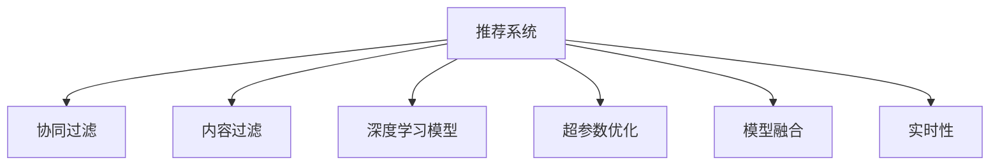

                 

# 工具使用机制在智能推荐系统中的应用

## 1. 背景介绍

### 1.1 问题由来

随着互联网和数字技术的发展，智能推荐系统在电子商务、社交媒体、内容平台等众多领域中得到了广泛应用。其核心目标是根据用户的历史行为和偏好，推荐其可能感兴趣的内容。这类推荐系统通过收集和分析用户数据，应用机器学习和数据挖掘技术，形成算法模型，从而实现个性化推荐。

智能推荐系统的应用极大地提高了用户体验，促进了商品销售，推动了网络流量的增长。然而，现有推荐系统面临一些挑战：

1. **数据稀疏性**：用户行为数据往往不完整，推荐模型需要应对数据稀疏性问题，保证推荐质量。
2. **冷启动问题**：新用户或新物品缺乏足够的历史数据，难以准确推荐。
3. **多样性和新颖性**：推荐系统需要兼顾多样性和新颖性，避免推荐同质化或过时的内容。
4. **模型公平性和透明性**：推荐模型的决策过程需要具有公平性和可解释性，避免偏见和歧视。
5. **计算效率**：随着数据量和模型复杂度的增加，推荐系统的计算效率和实时性成为瓶颈。

这些问题亟需新的解决方案和工具机制来解决，其中工具使用机制在智能推荐系统中扮演着越来越重要的角色。

### 1.2 问题核心关键点

工具使用机制在智能推荐系统中，通过集成和调度各种推荐工具，实现模型的自动化构建和优化。这一机制的核心在于：

- 集成多种推荐工具，如协同过滤、内容过滤、深度学习模型等。
- 根据任务需求，动态选择和组合推荐工具。
- 利用模型调优工具，如超参数优化、特征工程、模型融合等，提高推荐系统性能。
- 实现推荐系统的自动化部署和维护，确保其稳定性和可扩展性。

工具使用机制通过集成多种推荐工具和技术手段，极大地提升了智能推荐系统的灵活性和适应性。

## 2. 核心概念与联系

### 2.1 核心概念概述

为了更好地理解工具使用机制在智能推荐系统中的应用，本节将介绍几个关键概念：

- **推荐系统(Recommendation System)**：利用用户历史数据和物品属性数据，通过计算模型预测用户可能感兴趣物品的系统。
- **协同过滤(Collaborative Filtering)**：基于用户与物品的交互历史，通过计算相似度推荐物品。
- **内容过滤(Content-Based Filtering)**：基于物品的属性特征，通过计算物品之间的相似度推荐给用户。
- **深度学习模型(Deep Learning Model)**：使用深度神经网络模型，通过用户行为数据和物品特征数据进行推荐。
- **超参数优化(Hyperparameter Optimization)**：通过调整模型训练过程中的超参数，优化模型性能。
- **模型融合(Model Fusion)**：通过组合多个推荐模型的输出，提高推荐质量。
- **实时性(Real-time)**：推荐系统需要在用户实时访问时快速响应用户请求，提供即时推荐。

这些概念之间的逻辑关系可以通过以下Mermaid流程图来展示：



这个流程图展示了一个推荐系统的核心概念及其之间的关系：

1. 推荐系统通过多种推荐工具构建推荐模型。
2. 协同过滤、内容过滤和深度学习模型是推荐系统的三大支柱。
3. 超参数优化和模型融合用于提升推荐模型的精度。
4. 实时性是推荐系统的重要属性，确保推荐结果的及时性。

这些概念共同构成了智能推荐系统的架构和功能，使其能够实现多样、个性化、高效的推荐服务。

## 3. 核心算法原理 & 具体操作步骤

### 3.1 算法原理概述

工具使用机制在智能推荐系统中，主要通过集成和调度多种推荐工具，实现模型的自动化构建和优化。其核心思想是：根据用户行为和物品属性数据，利用协同过滤、内容过滤和深度学习模型，构建多个推荐模型，并通过模型融合和超参数优化，提高推荐系统性能。

工具使用机制的流程包括：
1. 数据预处理：收集和清洗用户行为数据和物品属性数据。
2. 推荐模型构建：使用协同过滤、内容过滤和深度学习模型，构建多个推荐模型。
3. 模型融合：通过组合多个推荐模型的输出，提高推荐质量。
4. 超参数优化：通过调整模型训练过程中的超参数，优化模型性能。
5. 部署与评估：将优化后的推荐模型部署到推荐系统中，并进行性能评估。

### 3.2 算法步骤详解

工具使用机制在智能推荐系统中的应用，主要包括以下几个关键步骤：

**Step 1: 数据预处理**

推荐系统的数据预处理主要包括以下几个步骤：

1. 数据收集：收集用户行为数据（如浏览记录、购买记录）和物品属性数据（如商品描述、类别）。
2. 数据清洗：去除不完整、不一致、重复的数据，处理缺失值和异常值。
3. 数据转换：对用户行为数据进行归一化、标准化处理，对物品属性数据进行特征提取和编码。

**Step 2: 推荐模型构建**

推荐系统通常采用多种推荐工具进行模型构建，包括：

1. 协同过滤：通过用户与物品的交互历史，计算相似度，推荐相似物品。
2. 内容过滤：基于物品的属性特征，通过计算物品之间的相似度推荐给用户。
3. 深度学习模型：使用深度神经网络模型，通过用户行为数据和物品特征数据进行推荐。

协同过滤和内容过滤适用于处理数据稀疏性较大的推荐场景，而深度学习模型则适合处理数据丰富、特征多样的推荐任务。

**Step 3: 模型融合**

推荐系统可以通过模型融合技术，将多个推荐模型的输出进行组合，提高推荐质量。常用的模型融合方法包括：

1. 加权平均：对多个模型的输出进行加权平均，综合考虑各模型的性能。
2. 投票融合：对多个模型的输出进行投票，选择出现次数最多的物品作为推荐结果。
3. 特征级融合：通过组合不同模型的特征，生成新的特征，用于构建新的推荐模型。

**Step 4: 超参数优化**

超参数优化是提高推荐模型性能的重要手段。常见的超参数包括学习率、正则化参数、批量大小等。常用的超参数优化方法包括：

1. 网格搜索：在预设的超参数空间中，通过穷举搜索找到最优超参数组合。
2. 随机搜索：在预设的超参数空间中，随机选取超参数进行试验，找到最优超参数组合。
3. 贝叶斯优化：利用贝叶斯方法，通过样本选择和模型评估，逐步优化超参数。

**Step 5: 部署与评估**

推荐系统需要将优化后的模型部署到生产环境中，并进行性能评估。常见的评估指标包括：

1. 准确率：推荐结果与用户实际行为的一致性。
2. 召回率：推荐结果覆盖用户实际兴趣的广度。
3. F1分数：综合考虑准确率和召回率，衡量推荐模型的性能。
4. AUC-ROC：评估推荐模型在不同阈值下的性能。

### 3.3 算法优缺点

工具使用机制在智能推荐系统中的应用，具有以下优点：

1. **灵活性高**：通过集成多种推荐工具和技术手段，推荐系统能够适应不同的数据和任务需求。
2. **适应性强**：能够动态调整推荐策略，提高推荐系统的实时性和个性化程度。
3. **提升性能**：通过模型融合和超参数优化，可以显著提升推荐系统的效果。
4. **稳定性好**：通过自动化部署和维护，推荐系统能够保持稳定性和可扩展性。

同时，该方法也存在一些局限性：

1. **计算复杂度高**：集成和融合多个推荐模型增加了计算复杂度，可能导致实时性下降。
2. **模型解释性差**：多种推荐模型的集成使得模型决策过程复杂，难以进行解释和调试。
3. **超参数调优难度大**：超参数优化通常需要大量的试验和计算资源，调优难度较大。
4. **数据隐私风险**：推荐系统需要处理大量的用户数据，数据隐私和安全问题不容忽视。

尽管存在这些局限性，但工具使用机制在大规模、复杂推荐场景中具有明显的优势，是推荐系统领域的重要技术手段。

### 3.4 算法应用领域

工具使用机制在智能推荐系统中的应用，覆盖了多个行业和领域，具体包括：

1. **电子商务**：根据用户浏览记录、购买历史推荐商品。
2. **社交媒体**：根据用户互动历史，推荐相关内容。
3. **内容平台**：根据用户阅读历史，推荐新闻、视频、文章等。
4. **广告投放**：根据用户行为数据，推荐广告位。
5. **金融投资**：根据用户投资历史，推荐投资组合。

除了上述这些经典应用外，工具使用机制还被应用于智能家居、教育培训、健康医疗等多个领域，为各行各业带来了变革性影响。

## 4. 数学模型和公式 & 详细讲解  
### 4.1 数学模型构建

在本节中，我们将使用数学语言对工具使用机制在智能推荐系统中的应用进行更加严格的刻画。

记推荐系统的输入为 $X$（用户行为数据），$Y$（物品属性数据），输出为 $Z$（推荐结果）。推荐系统的数学模型可以表示为：

$$
Z = f(X, Y; \theta)
$$

其中 $f$ 表示推荐函数，$\theta$ 为模型参数，通过最小化损失函数 $\mathcal{L}(\theta)$ 来优化模型。

在推荐系统中，常见的损失函数包括均方误差损失、交叉熵损失等。以均方误差损失为例，推荐函数可以表示为：

$$
f(X, Y; \theta) = XW + YV
$$

其中 $W$ 为用户的权重矩阵，$V$ 为物品的权重矩阵。模型的损失函数为：

$$
\mathcal{L}(\theta) = \frac{1}{N}\sum_{i=1}^N (Z_i - f(X_i, Y_i; \theta))^2
$$

通过优化损失函数，可以调整模型参数 $\theta$，得到最优的推荐结果 $Z$。

### 4.2 公式推导过程

在推荐系统中，推荐函数的形式多样。以协同过滤为例，假设用户 $u$ 与物品 $i$ 的交互次数为 $r_{ui}$，物品 $i$ 和物品 $j$ 的相似度为 $s_{ij}$，则协同过滤的推荐函数可以表示为：

$$
f(X, Y; \theta) = \sum_{i=1}^n \alpha_ir_{ui}s_{ij}
$$

其中 $\alpha_i$ 为物品 $i$ 的权重。模型的损失函数为：

$$
\mathcal{L}(\theta) = \frac{1}{N}\sum_{i=1}^N \sum_{j=1}^n (Z_i - \sum_{k=1}^n \alpha_kr_{kj}s_{kj})^2
$$

通过优化损失函数，可以调整模型参数 $\alpha$，得到最优的推荐结果 $Z$。

### 4.3 案例分析与讲解

以内容过滤为例，假设用户 $u$ 对物品 $i$ 的评分 $r_{ui}$ 为 $\frac{1}{\sigma(\theta^T\phi_i)}$，物品 $i$ 和物品 $j$ 的相似度为 $s_{ij} = \exp(\theta^T\phi_i\phi_j^T)$，其中 $\phi_i$ 为物品 $i$ 的特征向量，$\sigma$ 为 sigmoid 函数。则内容过滤的推荐函数可以表示为：

$$
f(X, Y; \theta) = \sum_{i=1}^n \alpha_ir_{ui}s_{ij}
$$

其中 $\alpha_i$ 为物品 $i$ 的权重。模型的损失函数为：

$$
\mathcal{L}(\theta) = \frac{1}{N}\sum_{i=1}^N \sum_{j=1}^n (Z_i - \sum_{k=1}^n \alpha_kr_{kj}s_{kj})^2
$$

通过优化损失函数，可以调整模型参数 $\alpha$ 和 $\theta$，得到最优的推荐结果 $Z$。

## 5. 项目实践：代码实例和详细解释说明
### 5.1 开发环境搭建

在进行推荐系统开发前，我们需要准备好开发环境。以下是使用Python进行TensorFlow开发的环境配置流程：

1. 安装Anaconda：从官网下载并安装Anaconda，用于创建独立的Python环境。

2. 创建并激活虚拟环境：
```bash
conda create -n tf-env python=3.8 
conda activate tf-env
```

3. 安装TensorFlow：根据CUDA版本，从官网获取对应的安装命令。例如：
```bash
pip install tensorflow-gpu
```

4. 安装各类工具包：
```bash
pip install numpy pandas scikit-learn matplotlib tqdm jupyter notebook ipython
```

完成上述步骤后，即可在`tf-env`环境中开始推荐系统开发。

### 5.2 源代码详细实现

下面我们以协同过滤推荐系统为例，给出使用TensorFlow对协同过滤模型进行代码实现。

首先，定义协同过滤模型的数据处理函数：

```python
import tensorflow as tf
from tensorflow.keras.layers import Dense, Input
from tensorflow.keras.models import Model

def collaborative_filtering_model(n_users, n_items, n_factors):
    user_input = Input(shape=(n_factors,))
    item_input = Input(shape=(n_factors,))
    latent_factor = Dense(n_factors, activation='relu')(user_input)
    latent_factor = Dense(n_factors, activation='relu')(latent_factor)
    rating_predict = Dense(1, activation='sigmoid')(latent_factor)
    user_bias = tf.Variable(tf.zeros([n_users]))
    item_bias = tf.Variable(tf.zeros([n_items]))
    rating_predict = rating_predict + user_bias + item_bias
    model = Model(inputs=[user_input, item_input], outputs=[rating_predict])
    return model
```

然后，定义数据集：

```python
train_dataset = tf.data.Dataset.from_tensor_slices((user_ids, item_ids, ratings)).batch(batch_size)
test_dataset = tf.data.Dataset.from_tensor_slices((user_ids, item_ids, ratings)).batch(batch_size)
```

接着，定义训练和评估函数：

```python
def train_epoch(model, dataset, optimizer, batch_size):
    model.compile(optimizer=optimizer, loss='binary_crossentropy', metrics=['accuracy'])
    model.fit(dataset, epochs=epochs, validation_data=val_dataset, batch_size=batch_size)
    
def evaluate(model, dataset, batch_size):
    model.evaluate(dataset, batch_size=batch_size)
```

最后，启动训练流程并在测试集上评估：

```python
epochs = 10
batch_size = 32
learning_rate = 0.001

model = collaborative_filtering_model(n_users, n_items, n_factors)
optimizer = tf.keras.optimizers.Adam(learning_rate=learning_rate)

train_epoch(model, train_dataset, optimizer, batch_size)
evaluate(model, test_dataset, batch_size)
```

以上就是使用TensorFlow对协同过滤推荐模型进行代码实现的完整流程。可以看到，TensorFlow提供了丰富的深度学习工具和组件，使得协同过滤模型的实现变得相对简单高效。

### 5.3 代码解读与分析

让我们再详细解读一下关键代码的实现细节：

**collaborative_filtering_model函数**：
- `user_input`和`item_input`：定义输入层，分别代表用户和物品的隐含特征。
- `latent_factor`：通过两个全连接层，将用户和物品的隐含特征转换为更丰富的表示。
- `rating_predict`：输出层，使用sigmoid函数预测用户对物品的评分。
- `user_bias`和`item_bias`：用户和物品的偏置项，用于补偿用户的固有偏好和物品的固有属性。
- `model`：构建协同过滤模型，并将输入和输出层连接起来。

**数据集定义**：
- `train_dataset`和`test_dataset`：使用`from_tensor_slices`方法创建数据集，其中`user_ids`、`item_ids`和`ratings`分别为用户ID、物品ID和评分。
- `batch_size`：定义批处理大小，加快训练速度。

**训练和评估函数**：
- `train_epoch`：使用`compile`方法配置模型，使用`fit`方法训练模型，同时使用`val_dataset`进行验证。
- `evaluate`：使用`evaluate`方法评估模型性能。

**训练流程**：
- 定义总训练轮数`epochs`，批处理大小`batch_size`，学习率`learning_rate`。
- 构建协同过滤模型`model`和优化器`optimizer`。
- 在训练集上进行训练，并在测试集上评估。

可以看到，TensorFlow使得推荐系统的模型实现变得简洁高效。开发者可以专注于业务逻辑和特征工程，而不必过多关注底层的实现细节。

当然，工业级的系统实现还需考虑更多因素，如模型的保存和部署、超参数的自动搜索、更灵活的任务适配层等。但核心的推荐过程的代码实现基本与此类似。

## 6. 实际应用场景
### 6.1 智能电商推荐

智能推荐系统在电商领域中得到广泛应用，根据用户的历史浏览、购买记录，推荐用户可能感兴趣的商品。通过协同过滤和深度学习模型，智能推荐系统可以预测用户的购买行为，提升用户购买转化率和满意度。

在技术实现上，可以收集用户的历史行为数据和物品的属性数据，构建协同过滤和深度学习推荐模型，并进行模型融合和超参数优化。最终的推荐结果可以用于电商网站的个性化推荐和广告投放，提升用户体验和商家收益。

### 6.2 社交媒体内容推荐

社交媒体平台需要实时推荐用户感兴趣的内容，以提高用户活跃度和平台粘性。智能推荐系统可以通过用户的历史互动数据，推荐相关的文章、视频、图片等内容。

在技术实现上，可以构建基于协同过滤和内容过滤的推荐模型，根据用户对不同内容的互动行为，预测用户对未曝光内容的兴趣。推荐系统可以实时响应用户请求，提供个性化的内容推荐。

### 6.3 在线视频推荐

在线视频平台需要根据用户的历史观看记录，推荐用户可能感兴趣的视频。通过协同过滤和深度学习模型，智能推荐系统可以预测用户的观看行为，提升用户观看体验和平台留存率。

在技术实现上，可以收集用户的历史观看数据和视频的属性数据，构建协同过滤和深度学习推荐模型，并进行模型融合和超参数优化。最终的推荐结果可以用于视频平台的个性化推荐和视频广告投放，提升用户观看率和广告投放效果。

### 6.4 未来应用展望

随着推荐系统技术的不断发展，其在更多领域的应用前景将更加广阔：

1. **金融推荐**：根据用户的历史投资行为，推荐投资组合和金融产品。
2. **医疗推荐**：根据用户的健康数据，推荐医生、药品和治疗方案。
3. **教育推荐**：根据学生的学习行为，推荐课程和教材。
4. **城市规划**：根据市民的出行数据，推荐交通路线和公共交通工具。
5. **旅游推荐**：根据用户的旅游历史，推荐旅游目的地和旅游路线。

未来，智能推荐系统将在更多领域中发挥作用，为各行各业带来新的机遇和变革。

## 7. 工具和资源推荐
### 7.1 学习资源推荐

为了帮助开发者系统掌握推荐系统技术，这里推荐一些优质的学习资源：

1. 《推荐系统实践》系列书籍：涵盖推荐系统的理论基础、算法设计和工程实践，是入门推荐系统的必备参考书。
2. CS-229《机器学习》课程：斯坦福大学开设的经典机器学习课程，介绍了推荐系统的各种算法和模型。
3. 《Deep Learning for Recommender Systems》论文：介绍了深度学习在推荐系统中的应用，是深度学习推荐系统的经典论文。
4. Kaggle推荐系统竞赛：通过实际比赛数据和任务，锻炼推荐系统开发和调优技能。
5. TensorFlow官方文档：提供了丰富的TensorFlow教程和示例，是TensorFlow推荐系统开发的常用资源。

通过对这些资源的学习实践，相信你一定能够快速掌握推荐系统的核心技术和工程实践。

### 7.2 开发工具推荐

高效的开发离不开优秀的工具支持。以下是几款用于推荐系统开发的常用工具：

1. TensorFlow：由Google主导开发的开源深度学习框架，生产部署方便，适合大规模工程应用。
2. PyTorch：基于Python的开源深度学习框架，灵活动态的计算图，适合快速迭代研究。
3. Scikit-learn：Python中的机器学习库，提供了丰富的模型和算法，适合数据预处理和特征工程。
4. Weights & Biases：模型训练的实验跟踪工具，可以记录和可视化模型训练过程中的各项指标，方便对比和调优。
5. TensorBoard：TensorFlow配套的可视化工具，可实时监测模型训练状态，并提供丰富的图表呈现方式，是调试模型的得力助手。

合理利用这些工具，可以显著提升推荐系统开发效率，加快创新迭代的步伐。

### 7.3 相关论文推荐

推荐系统领域的研究持续活跃，以下是几篇奠基性的相关论文，推荐阅读：

1. Implicit Collaborative Filtering：介绍隐式协同过滤算法，用于处理用户行为数据。
2. Factorization Machines for Personalized Recommendation：介绍因子分解机算法，用于推荐系统中的特征提取和建模。
3. Deep Neural Networks for Recommendation：介绍深度神经网络在推荐系统中的应用，显著提升推荐系统效果。
4. Item-Item Collaborative Filtering：介绍物品物品协同过滤算法，用于推荐系统的多样性和新颖性建模。
5. Attention-Based Recommender Systems：介绍注意力机制在推荐系统中的应用，提升推荐系统对用户上下文的理解。

这些论文代表了大推荐系统领域的发展脉络。通过学习这些前沿成果，可以帮助研究者把握学科前进方向，激发更多的创新灵感。

## 8. 总结：未来发展趋势与挑战

### 8.1 总结

本文对工具使用机制在智能推荐系统中的应用进行了全面系统的介绍。首先阐述了推荐系统的背景和问题，明确了推荐系统工具使用机制的灵活性和优势。其次，从原理到实践，详细讲解了推荐系统的核心算法和操作步骤，给出了推荐系统开发和评估的完整代码实例。同时，本文还广泛探讨了推荐系统在电子商务、社交媒体、在线视频等多个领域的应用前景，展示了推荐系统技术的广泛应用。此外，本文精选了推荐系统的学习资源、开发工具和相关论文，力求为读者提供全方位的技术指引。

通过本文的系统梳理，可以看到，工具使用机制在大规模、复杂推荐场景中具有明显的优势，是推荐系统领域的重要技术手段。推荐系统工具使用机制的不断发展，必将推动推荐系统技术的持续进步，为各行各业带来更多的价值。

### 8.2 未来发展趋势

展望未来，推荐系统技术将呈现以下几个发展趋势：

1. **个性化推荐**：推荐系统将更加注重个性化，通过深度学习和协同过滤技术，提供更加精准、多样的推荐内容。
2. **实时推荐**：推荐系统需要能够实时响应用户请求，提供即时的推荐结果。实时推荐系统将得到更广泛的应用。
3. **跨平台推荐**：推荐系统将跨越不同平台，提供统一的推荐服务。跨平台推荐系统将进一步提升用户体验。
4. **数据隐私保护**：推荐系统需要加强数据隐私保护，使用差分隐私等技术，确保用户数据的安全性。
5. **自动化推荐**：推荐系统将更加自动化，使用自动推荐系统、自动超参数优化等技术，提高推荐系统的工作效率。

以上趋势凸显了推荐系统技术的广阔前景。这些方向的探索发展，必将进一步提升推荐系统的性能和应用范围，为经济社会发展注入新的动力。

### 8.3 面临的挑战

尽管推荐系统技术已经取得了瞩目成就，但在迈向更加智能化、普适化应用的过程中，它仍面临着诸多挑战：

1. **数据稀疏性**：推荐系统需要处理大规模数据，数据稀疏性是一个重要的挑战。如何有效处理稀疏数据，提升推荐效果，需要更多的研究。
2. **冷启动问题**：新用户或新物品缺乏足够的历史数据，难以进行准确的推荐。如何通过零样本学习、图网络等方法解决冷启动问题，仍然是一个挑战。
3. **计算复杂度**：推荐系统的计算复杂度较高，特别是在深度学习推荐系统中。如何提高推荐系统的计算效率，需要更多的优化技术。
4. **模型可解释性**：推荐系统通常被视为黑盒模型，难以解释其决策过程。如何提高推荐模型的可解释性，需要更多的研究。
5. **数据隐私安全**：推荐系统需要处理大量的用户数据，数据隐私和安全问题不容忽视。如何保护用户数据隐私，防止数据泄露和滥用，需要更多的技术手段。

尽管存在这些挑战，但推荐系统技术的不断进步和优化，使得其在推荐领域的应用前景依然广阔。

### 8.4 研究展望

面对推荐系统面临的诸多挑战，未来的研究需要在以下几个方面寻求新的突破：

1. **多模态推荐**：将视觉、语音、文本等多种模态数据融合，提升推荐系统的感知和理解能力。
2. **混合推荐**：将协同过滤、内容过滤和深度学习等多种推荐方法进行混合，提升推荐系统的性能和鲁棒性。
3. **自适应推荐**：根据用户的行为变化和偏好变化，动态调整推荐策略，提升推荐系统的实时性和适应性。
4. **公平性推荐**：保证推荐系统的公平性和透明性，避免偏见和歧视，确保推荐结果的公正性和合理性。
5. **强化推荐**：结合强化学习等技术，提升推荐系统的动态优化能力，优化推荐策略，提高推荐系统的效果。

这些研究方向的探索，必将引领推荐系统技术迈向更高的台阶，为构建智能推荐系统提供新的方法和思路。面向未来，推荐系统技术还需要与其他人工智能技术进行更深入的融合，如知识表示、因果推理、强化学习等，多路径协同发力，共同推动推荐系统的进步。只有勇于创新、敢于突破，才能不断拓展推荐系统的边界，让智能推荐技术更好地服务人类社会。

## 9. 附录：常见问题与解答

**Q1：推荐系统如何处理数据稀疏性？**

A: 推荐系统通常使用协同过滤和内容过滤等方法来处理数据稀疏性问题。协同过滤通过用户与物品的交互历史计算相似度，推荐相似物品；内容过滤通过物品的属性特征计算相似度，推荐相似物品。此外，深度学习模型也可以用于处理数据稀疏性，通过模型学习特征之间的关联关系，提升推荐效果。

**Q2：推荐系统如何解决冷启动问题？**

A: 推荐系统可以通过以下方法解决冷启动问题：
1. 零样本学习：使用深度学习模型，通过迁移学习和预训练技术，利用其他领域的数据进行推荐。
2. 图网络推荐：使用图网络算法，根据用户和物品的关系构建图结构，利用图结构信息进行推荐。
3. 多模态推荐：结合视觉、语音、文本等多种模态数据，提升推荐系统的感知和理解能力。

**Q3：推荐系统的计算效率如何优化？**

A: 推荐系统的计算效率可以通过以下方法进行优化：
1. 特征压缩：通过特征降维、稀疏化等技术，减少模型的计算复杂度。
2. 并行计算：使用分布式计算、GPU加速等技术，提升推荐系统的计算效率。
3. 增量学习：通过在线学习、增量更新等技术，减少推荐系统的计算资源消耗。
4. 近似计算：使用矩阵分解、SVD等技术，近似计算推荐结果，提升推荐系统的实时性。

**Q4：推荐系统的模型可解释性如何提升？**

A: 推荐系统的模型可解释性可以通过以下方法提升：
1. 特征工程：使用可解释的特征，减少模型复杂度，提高模型的可解释性。
2. 模型简化：使用简单模型，减少模型的复杂度，提升模型的可解释性。
3. 透明算法：使用透明算法，如线性回归、决策树等，提升模型的可解释性。
4. 可视化工具：使用可视化工具，如TensorBoard，展示模型训练过程中的各项指标，提升模型的可解释性。

这些方法可以帮助提升推荐系统的模型可解释性，增强用户对推荐结果的理解和信任。

**Q5：推荐系统如何保护数据隐私？**

A: 推荐系统可以通过以下方法保护数据隐私：
1. 差分隐私：使用差分隐私技术，保护用户数据的隐私性，防止数据泄露和滥用。
2. 数据匿名化：对用户数据进行匿名化处理，防止用户身份信息被识别。
3. 数据加密：对用户数据进行加密处理，防止数据被非法访问和篡改。
4. 隐私计算：使用隐私计算技术，如多方计算、同态加密等，保护用户数据的隐私性。

这些方法可以帮助保护推荐系统的数据隐私，增强用户对系统的信任。

