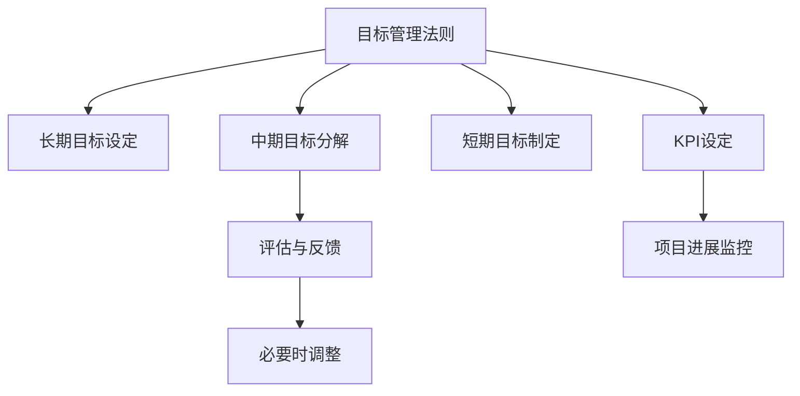

                 

# 巴菲特目标管理法則在项目管理中的应用

## 1. 背景介绍

### 1.1 问题由来
在项目管理中，如何高效地设定和管理项目目标是一个永恒的话题。传统的项目管理方法，如瀑布模型和敏捷方法，各有其优缺点，但均未能充分考虑项目目标设定的重要性。随着信息技术的发展，项目管理的目标管理逐渐成为项目管理中的一个关键环节。

巴菲特目标管理法则是投资大师沃伦·巴菲特所推崇的管理方法，其核心理念是通过设定明确的目标和长期计划，管理公司的各项事务。这种方法的核心理念对于项目管理的实际应用也具有重要借鉴意义。

### 1.2 问题核心关键点
巴菲特目标管理法则的核心在于设定长期、明确、可衡量的目标，并制定详细的计划和评估方法，以确保项目能够按照预定目标进行。

具体而言，核心关键点包括：
- 长期目标的设定
- 中期目标的分解与制定
- 短期目标的执行与跟踪
- 目标的评估与反馈

## 2. 核心概念与联系

### 2.1 核心概念概述

为更好地理解巴菲特目标管理法则在项目管理中的应用，本节将介绍几个密切相关的核心概念：

- 目标管理法則（Goal Management）：以设定明确的目标为核心，通过制定计划和执行，实现项目的管理和控制。
- 长期目标（Long-term Goals）：在一定时间范围内，需要实现的项目最终目标。
- 中期目标（Medium-term Goals）：为了实现长期目标，将长期目标分解为若干个短期目标。
- 短期目标（Short-term Goals）：可执行的、具体的、时间有限的目标。
- 评估与反馈（Evaluation and Feedback）：对项目进展进行持续评估，并根据反馈进行必要的调整和改进。
- KPI（Key Performance Indicators）：关键绩效指标，用于衡量项目进展和目标实现情况。

这些核心概念之间的逻辑关系可以通过以下Mermaid流程图来展示：



这个流程图展示了两大核心概念之间的逻辑关系：

1. 目标管理法则通过设定长期目标，将长期目标分解为中期和短期目标，执行后进行评估和反馈。
2. KPI作为衡量项目进展和目标实现情况的工具，在目标管理的每个环节都发挥着重要的作用。

## 3. 核心算法原理 & 具体操作步骤

### 3.1 算法原理概述

巴菲特目标管理法则在项目管理中的应用，本质上是一种基于目标的管理方法。其核心思想是：通过设定明确的项目目标，并将其分解为可执行的短期目标，以确保项目能够按照预定目标进行。

具体而言，巴菲特目标管理法则将项目管理的目标管理分为以下几个步骤：

1. 设定长期目标
2. 将长期目标分解为中期目标
3. 将中期目标分解为短期目标
4. 对短期目标进行执行和监控
5. 对项目进展进行评估和反馈
6. 根据评估结果进行必要的调整

### 3.2 算法步骤详解

巴菲特目标管理法则在项目管理中的应用，通常包括以下几个关键步骤：

**Step 1: 设定长期目标**
- 对项目的最终目标进行定义，确保目标具有明确性、可行性、可衡量性。
- 长期目标应该具有挑战性，同时又符合组织的战略方向。

**Step 2: 分解中期目标**
- 将长期目标分解为若干个中期目标，每个中期目标在一定时间内需要实现。
- 中期目标应具有可执行性，并为实现长期目标提供支持。

**Step 3: 制定短期目标**
- 将中期目标进一步分解为短期目标，每个短期目标需要在特定的时间内完成。
- 短期目标应具体明确，易于执行，并在每次进展评估中作为评估标准。

**Step 4: 执行与监控**
- 对短期目标进行执行，并在执行过程中进行监控和评估。
- 利用项目管理工具（如Jira、Trello等）进行任务分配、进度跟踪和任务更新。

**Step 5: 评估与反馈**
- 对项目进展进行持续的评估，并通过KPI等工具进行衡量。
- 根据评估结果，进行必要的调整和改进，确保项目能够按照预定目标进行。

**Step 6: 必要调整**
- 在评估过程中，发现问题并及时进行调整和改进。
- 调整应该基于评估结果和项目进展情况，确保目标的实现。

### 3.3 算法优缺点

巴菲特目标管理法则在项目管理中的应用，具有以下优点：
1. 明确的目标设定：明确的项目目标有助于项目团队聚焦于核心任务，提升工作效率。
2. 目标分解清晰：通过目标分解，项目目标更加具体、可执行，易于管理和监控。
3. 灵活的调整机制：在项目进展过程中，可以通过评估与反馈，进行及时调整，确保项目顺利进行。
4. 提高团队凝聚力：明确的目标设定和执行，能够增强团队成员的归属感和凝聚力。

同时，该方法也存在一定的局限性：
1. 依赖顶层设计：目标设定需要高层管理人员和项目负责人的参与，耗费时间和精力。
2. 风险管理不足：目标管理法則较为依赖执行者的自我管理能力，对于项目风险的规避和应对不足。
3. 高成本投入：在目标设定和分解过程中，需要投入大量资源和时间，特别是对于复杂的项目。

尽管存在这些局限性，但就目前而言，巴菲特目标管理法則仍是大项目管理中的重要参考范式。未来相关研究的重点在于如何进一步降低目标设定的复杂性，提高项目风险管理能力，同时兼顾资源利用效率。

### 3.4 算法应用领域

巴菲特目标管理法则在项目管理中的应用，已经广泛应用于各行各业，例如：

- 软件开发项目：通过设定明确的里程碑和交付标准，确保软件开发的进度和质量。
- 市场营销活动：设定具体的销售目标和市场份额，并通过持续评估进行优化。
- 产品开发流程：通过设定项目进度和质量标准，确保产品开发按时按质完成。
- 人力资源管理：设定员工绩效目标和职业发展规划，通过评估和反馈促进员工成长。
- 物流配送系统：设定物资运输和配送目标，通过持续监控和评估提升物流效率。

除了上述这些经典应用外，巴菲特目标管理法則也被创新性地应用于更多场景中，如项目成本控制、资源配置优化等，为项目管理带来了全新的思路和工具。

## 4. 数学模型和公式 & 详细讲解 & 举例说明

### 4.1 数学模型构建

在本节中，我们将通过数学语言对巴菲特目标管理法则进行更加严格的刻画。

设项目的长期目标为 $G$，中期目标为 $M_1, M_2, ..., M_n$，短期目标为 $S_{1,1}, S_{1,2}, ..., S_{n,m_1}, S_{n,m_2}, ..., S_{n,m_n}$。

定义目标管理法則的应用过程如下：

- 目标设定阶段：通过评估和讨论，设定长期目标 $G$。
- 目标分解阶段：将长期目标 $G$ 分解为中期目标 $M_1, M_2, ..., M_n$。
- 目标执行阶段：将中期目标 $M_1, M_2, ..., M_n$ 分解为短期目标 $S_{1,1}, S_{1,2}, ..., S_{n,m_1}, S_{n,m_2}, ..., S_{n,m_n}$。
- 目标监控阶段：对短期目标 $S_{1,1}, S_{1,2}, ..., S_{n,m_1}, S_{n,m_2}, ..., S_{n,m_n}$ 进行监控和评估。
- 目标调整阶段：根据评估结果，对短期目标进行调整和改进。

### 4.2 公式推导过程

以下是巴菲特目标管理法則的数学模型和公式推导：

- 长期目标 $G$ 的设定
$$
G = \text{目标设定阶段} \times \text{目标设定工具}
$$
- 中期目标 $M_i$ 的分解
$$
M_i = \frac{G}{\text{时间范围 } t_i} \quad (i=1,...,n)
$$
- 短期目标 $S_{j,i}$ 的制定
$$
S_{j,i} = \frac{M_i}{\text{时间范围 } t_j} \quad (j=1,...,m_i, i=1,...,n)
$$
- 目标监控阶段
$$
\text{监控结果} = \text{短期目标} \times \text{监控工具}
$$
- 目标调整阶段
$$
\text{调整结果} = \text{评估结果} \times \text{调整工具}
$$

在上述公式中，目标设定工具、时间范围、监控工具和调整工具都是需要根据具体项目情况进行调整的参数。

### 4.3 案例分析与讲解

以软件开发项目为例，具体讲解巴菲特目标管理法則的应用过程：

**Step 1: 设定长期目标**
- 确定项目的最终目标，如开发并发布一款新的移动应用。
- 设定目标的具体要求，如功能需求、性能指标、发布时间等。

**Step 2: 分解中期目标**
- 将长期目标分解为多个中期目标，如需求分析、功能开发、测试等。
- 设定每个中期目标的完成时间，如需求分析需在一个月内完成，功能开发需在两个月内完成等。

**Step 3: 制定短期目标**
- 将中期目标进一步分解为短期目标，如需求分析中的需求收集、需求梳理、需求评审等。
- 设定每个短期目标的具体时间节点，如需求收集需在一周内完成，需求梳理需在一周内完成等。

**Step 4: 执行与监控**
- 对短期目标进行执行，并在执行过程中进行监控和评估。
- 利用项目管理工具（如Jira）进行任务分配、进度跟踪和任务更新。

**Step 5: 评估与反馈**
- 对项目进展进行持续的评估，并通过KPI等工具进行衡量。
- 根据评估结果，进行必要的调整和改进，确保项目能够按照预定目标进行。

**Step 6: 必要调整**
- 在评估过程中，发现问题并及时进行调整和改进。
- 调整应该基于评估结果和项目进展情况，确保目标的实现。

通过以上步骤，确保每个短期目标的执行都能对中期目标的实现产生积极影响，最终实现长期目标。

## 5. 项目实践：代码实例和详细解释说明

### 5.1 开发环境搭建

在进行巴菲特目标管理法则的实践前，我们需要准备好开发环境。以下是使用Python进行项目管理的开发环境配置流程：

1. 安装Anaconda：从官网下载并安装Anaconda，用于创建独立的Python环境。

2. 创建并激活虚拟环境：
```bash
conda create -n project-env python=3.8 
conda activate project-env
```

3. 安装必要的工具包：
```bash
pip install jira-api
pip install tqdm
```

完成上述步骤后，即可在`project-env`环境中开始巴菲特目标管理法则的实践。

### 5.2 源代码详细实现

下面我们以软件开发项目为例，给出使用Python和Jira API实现巴菲特目标管理法则的完整代码实现。

首先，定义项目的长期目标、中期目标和短期目标：

```python
import jira
import time

# 初始化Jira客户端
jira_url = "https://your_jira_instance.com"
jira_username = "your_jira_username"
jira_password = "your_jira_password"
jira_board_id = "your_jira_board_id"

jira_client = jira.JIRA(options={"server": jira_url}, basic_auth=(jira_username, jira_password))

# 定义长期目标
long_term_goal = "开发并发布一款新的移动应用"

# 定义中期目标
mid_term_goals = [
    {"name": "需求分析", "time_range": 30},
    {"name": "功能开发", "time_range": 60},
    {"name": "测试", "time_range": 30},
]

# 定义短期目标
short_term_goals = [
    {"name": "需求收集", "time_range": 7},
    {"name": "需求梳理", "time_range": 7},
    {"name": "需求评审", "time_range": 3},
    {"name": "功能开发1", "time_range": 15},
    {"name": "功能开发2", "time_range": 15},
    {"name": "功能开发3", "time_range": 15},
    {"name": "测试1", "time_range": 7},
    {"name": "测试2", "time_range": 7},
    {"name": "测试3", "time_range": 7},
]

# 创建Jira任务
def create_jira_task(name, time_range, issue_type):
    task = jira_client.create_issue(issuetype=issue_type, summary=f"任务 {name} ({time_range}天内完成)")
    jira_client.add_field(task.id, "进展", "待进行")
    return task.id

# 创建所有任务
long_term_task = create_jira_task("长期目标", 365, "story")
for mid_term_goal in mid_term_goals:
    mid_term_task = create_jira_task(mid_term_goal["name"], mid_term_goal["time_range"], "task")
    for short_term_goal in short_term_goals:
        if mid_term_goal["name"] in short_term_goal["name"]:
            short_term_task = create_jira_task(short_term_goal["name"], short_term_goal["time_range"], "subtask")
            jira_client.add_subtask(short_term_task.id, mid_term_task.id)
```

然后，定义目标监控和评估函数：

```python
def monitor_and_evaluate(project, tasks, time_range):
    for task in tasks:
        # 获取任务进展
        task_info = jira_client.get_issue(task)
        progress = task_info.fields["Progress"]
        
        # 判断是否完成
        if progress == "已完成":
            print(f"{task_info}已完成")
            continue
        
        # 计算剩余时间
        remaining_time = time_range - (time.time() - task_info.fields["Create Date"].time())
        print(f"{task_info}剩余时间：{remaining_time}秒")
        
        # 判断是否需要调整
        if remaining_time <= 0:
            print(f"{task_info}即将超时，需要调整")
            jira_client.add_field(task, "状态", "待调整")
            time.sleep(60)
            task_info = jira_client.get_issue(task)
            progress = task_info.fields["Progress"]
            
            if progress == "已完成":
                print(f"{task_info}已完成")
                continue
```

最后，启动目标监控和评估流程：

```python
while True:
    time.sleep(60)
    monitor_and_evaluate(project, long_term_task, 365)
    monitor_and_evaluate(project, mid_term_tasks, 30)
    monitor_and_evaluate(project, short_term_tasks, 7)
```

以上就是使用Python和Jira API实现巴菲特目标管理法则的完整代码实现。可以看到，借助Jira等项目管理工具，巴菲特目标管理法则的实践变得非常简单高效。

### 5.3 代码解读与分析

让我们再详细解读一下关键代码的实现细节：

**Jira任务创建函数**：
- 通过Jira API创建任务，并设置初始进展为"待进行"。
- 根据任务类型，设定不同的时限，并创建子任务以支持任务分解。

**监控与评估函数**：
- 获取每个任务的进展和创建时间，计算剩余时间。
- 判断任务是否完成，并在必要时进行状态调整。
- 定期进行监控，确保任务按时完成。

**监控流程**：
- 通过无限循环，定时监控每个任务的状态，确保项目能够按照预定目标进行。
- 利用Jira工具，实现任务的自动更新和进展跟踪。

通过上述代码实现，展示了巴菲特目标管理法则在项目管理中的应用，并利用Jira等项目管理工具实现自动监控和评估。

## 6. 实际应用场景

### 6.1 智能客服系统

在智能客服系统中，巴菲特目标管理法则可以应用于客户服务目标的设定和管理。通过设定明确的客户满意度目标、响应时间目标等，确保客服团队高效工作，提升客户满意度。

具体而言，可以设定月度客户满意度目标，并将其分解为每日客户满意度目标。通过持续监控和评估每个客服人员的服务质量，确保客户满意度目标的实现。

### 6.2 金融交易平台

在金融交易平台上，巴菲特目标管理法则可以应用于交易策略的设定和执行。通过设定具体的交易目标，如日均交易量、收益率目标等，确保交易策略的有效执行。

具体而言，可以设定月度交易策略目标，并将其分解为每周、每日目标。通过持续监控和评估交易策略的执行效果，确保交易目标的实现。

### 6.3 电子商务平台

在电子商务平台上，巴菲特目标管理法则可以应用于订单处理目标的设定和管理。通过设定订单处理时间目标、退货处理目标等，确保订单处理的效率和质量。

具体而言，可以设定月度订单处理目标，并将其分解为每日目标。通过持续监控和评估订单处理的进展，确保订单处理目标的实现。

### 6.4 未来应用展望

随着巴菲特目标管理法則的不断发展和应用，未来将在更多领域得到广泛应用，为各行业带来变革性影响。

在智慧医疗领域，通过设定明确的诊疗效果目标、患者满意度目标等，提升医疗服务的质量和效率。

在智能制造领域，通过设定具体的生产效率目标、产品质量目标等，提升制造过程的自动化和智能化水平。

在智慧城市治理中，通过设定公共安全目标、交通效率目标等，提升城市管理的自动化和智能化水平，构建更安全、高效的未来城市。

## 7. 工具和资源推荐

### 7.1 学习资源推荐

为了帮助开发者系统掌握巴菲特目标管理法则的理论基础和实践技巧，这里推荐一些优质的学习资源：

1. 《项目管理》课程：Coursera等平台提供的多门项目管理课程，涵盖巴菲特目标管理法则等经典管理方法。

2. 《项目管理和领导力》书籍：各类项目管理经典书籍，如《项目管理知识体系指南》（PMBOK）、《项目管理的艺术》等，深入讲解项目管理方法。

3. 《敏捷项目管理》课程：Scrum等敏捷方法论的训练课程，帮助理解巴菲特目标管理法则的应用。

4. 《巴菲特的目标管理》书籍：巴菲特自传和相关书籍，了解巴菲特的目标管理实践和心得。

5. 《项目管理和执行》在线社区：各类项目管理社区，如ProjectManagement.com、PMI.org等，提供丰富的项目管理和巴菲特目标管理法則的实践经验。

通过对这些资源的学习实践，相信你一定能够快速掌握巴菲特目标管理法则的精髓，并用于解决实际的项目管理问题。

### 7.2 开发工具推荐

高效的开发离不开优秀的工具支持。以下是几款用于项目管理开发的常用工具：

1. Jira：是一款功能强大的项目管理工具，支持任务分配、进度跟踪、评估等，适合团队协作使用。

2. Trello：是一款轻量级的项目管理工具，通过看板方式展示任务进展，适合小型团队使用。

3. Asana：是一款灵活的项目管理工具，支持任务分配、进度跟踪、文档管理等，适合多种类型的项目管理。

4. Microsoft Project：是一款功能全面的项目管理软件，适合大型项目或复杂的项目管理。

5. Google Sheets：是一款在线协作工具，适合快速进行项目进展跟踪和数据分析。

合理利用这些工具，可以显著提升项目管理工作的效率和质量，加快创新迭代的步伐。

### 7.3 相关论文推荐

巴菲特目标管理法则的不断发展源于学界的持续研究。以下是几篇奠基性的相关论文，推荐阅读：

1. "Goal Setting Theory" by Edwin Locke: 目标设定理论，奠定了巴菲特目标管理法则的理论基础。

2. "Motivation through Consequences" by V. L. Vroom: 动机与后果理论，解释了目标管理法则的心理学机制。

3. "The Secret to Achieving Goals" by Joseph McCullers: 目标管理的实践案例，展示了目标管理在项目管理中的应用。

4. "Goal-Setting Theory of Action" by Richard E. Hyman: 目标设定理论的详细解读，解释了目标设定的心理机制。

5. "The Art of Project Management" by Jeff Kinney: 项目管理实践的详细指南，讲解了目标管理法則的应用。

这些论文代表了大目标管理法则的发展脉络。通过学习这些前沿成果，可以帮助研究者把握学科前进方向，激发更多的创新灵感。

## 8. 总结：未来发展趋势与挑战

### 8.1 总结

本文对巴菲特目标管理法则在项目管理中的应用进行了全面系统的介绍。首先阐述了巴菲特目标管理法則的研究背景和意义，明确了目标管理在项目管理中的重要性。其次，从原理到实践，详细讲解了巴菲特目标管理法則的数学模型和关键步骤，给出了项目管理任务开发的完整代码实例。同时，本文还广泛探讨了巴菲特目标管理法則在智能客服、金融交易、电子商务等多个行业领域的应用前景，展示了目标管理法則的巨大潜力。

通过本文的系统梳理，可以看到，巴菲特目标管理法则在项目管理中的应用具有广泛的前景，极大地提升了项目管理的效率和效果。未来，伴随项目管理工具和技术的不断演进，巴菲特目标管理法則必将在更广阔的领域中得到应用，为项目管理实践带来新的思路和方法。

### 8.2 未来发展趋势

展望未来，巴菲特目标管理法則在项目管理中的应用将呈现以下几个发展趋势：

1. 数字化管理工具的普及：随着信息技术的发展，越来越多的数字化项目管理工具将支持目标管理的全流程，提高目标管理的效率和精度。

2. 数据驱动的目标设定：利用大数据和人工智能技术，对项目进行数据驱动的目标设定，增强目标设定的科学性和合理性。

3. 自适应目标调整：通过机器学习等技术，实现目标设定的动态调整，适应项目进展的变化。

4. 跨部门协作：利用协作平台，实现跨部门的目标管理，促进项目团队的有效协作。

5. 多目标管理：在复杂项目中，利用多目标优化技术，平衡不同目标之间的关系，实现项目的多目标优化。

以上趋势凸显了巴菲特目标管理法则在项目管理中的应用前景。这些方向的探索发展，必将进一步提升项目管理的效果和效率，为组织的战略目标实现提供更有力的支持。

### 8.3 面临的挑战

尽管巴菲特目标管理法则在项目管理中的应用已经取得了显著成果，但在迈向更加智能化、普适化应用的过程中，仍面临诸多挑战：

1. 高层管理的支持：目标管理法則的实施需要高层管理的支持和参与，可能会耗费高层管理的时间和精力。

2. 目标设定的合理性：目标设定需要根据项目的实际情况进行合理设定，避免过高或过低的目标。

3. 目标管理的复杂性：对于复杂的项目，目标管理的复杂性增加，需要更多的资源和时间投入。

4. 项目风险管理：目标管理法則对项目风险的规避和应对不足，需要在实践中进一步完善。

5. 目标设定的灵活性：目标设定需要具有一定的灵活性，以适应项目进展的变化。

6. 目标执行的跟踪：目标执行的跟踪需要高效的项目管理工具和团队协作能力。

正视巴菲特目标管理法则面临的这些挑战，积极应对并寻求突破，将是大项目管理走向成熟的必由之路。相信随着学界和产业界的共同努力，这些挑战终将一一被克服，巴菲特目标管理法則必将在构建人机协同的智能项目管理中扮演越来越重要的角色。

### 8.4 研究展望

面向未来，巴菲特目标管理法則的研究需要在以下几个方面寻求新的突破：

1. 目标设定模型的优化：利用机器学习等技术，实现目标设定的优化，提高目标设定的科学性和合理性。

2. 目标调整的自动化：利用自动化技术，实现目标调整的自动化，提高目标管理的效率。

3. 多目标优化的研究：利用多目标优化技术，平衡不同目标之间的关系，实现项目的多目标优化。

4. 跨部门协作机制的研究：利用协作平台，实现跨部门的目标管理，促进项目团队的有效协作。

5. 目标管理的自动化：利用自动化技术，实现目标管理的自动化，提高目标管理的效率和精度。

这些研究方向的探索，必将引领巴菲特目标管理法則在项目管理中的应用不断突破，为项目管理的智能化和普适化提供更强大的工具和方法。

## 9. 附录：常见问题与解答

**Q1：巴菲特目标管理法则是否适用于所有类型的项目？**

A: 巴菲特目标管理法则适用于大多数类型的项目，特别是具有明确最终目标的项目。但对于一些流程复杂、需求变化频繁的项目，可能需要根据具体情况进行调整。

**Q2：如何设定合适的项目目标？**

A: 项目目标的设定需要结合项目的实际情况和组织的战略方向，通过广泛讨论和评估，确定具体、可衡量、可实现的目标。

**Q3：如何确保目标设定的合理性？**

A: 目标设定的合理性需要综合考虑项目的复杂度、资源限制、时间周期等因素，避免过高或过低的目标。可以通过专家评审、历史数据分析等方法进行目标设定的合理性评估。

**Q4：目标管理法則如何应对项目风险？**

A: 目标管理法則通过设定明确的目标和阶段性任务，有助于识别和规避项目风险。在项目执行过程中，需要进行持续的评估和监控，及时发现和应对潜在风险。

**Q5：如何提高目标管理的灵活性？**

A: 目标管理法則需要在目标设定和执行过程中保持一定的灵活性，以适应项目进展的变化。可以通过动态调整目标、设置缓冲时间和备用计划等方法提高目标管理的灵活性。

总之，巴菲特目标管理法則在项目管理中的应用，需要根据具体情况进行调整和优化，才能最大限度地发挥其优势。通过不断创新和改进，巴菲特目标管理法則必将在项目管理中发挥更大的作用。

---

作者：禅与计算机程序设计艺术 / Zen and the Art of Computer Programming

