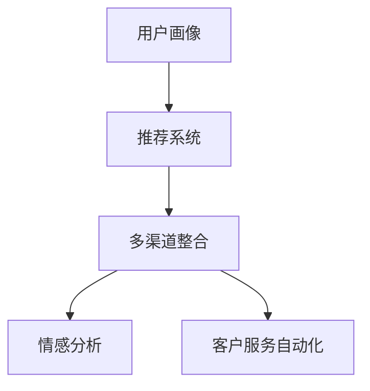

                 

# 市场营销的用户体验提升

## 1. 背景介绍

### 1.1 问题由来
随着互联网的普及和数字技术的迅猛发展，市场营销已经从传统的产品推销转变为以用户为中心的市场营销（Customer-Centric Marketing）。消费者期望获得更加个性化、便捷、有价值的服务体验，企业也需要通过提升用户满意度来提高品牌影响力和市场份额。因此，提升市场营销的用户体验成为了企业关注的重点。

### 1.2 问题核心关键点
市场营销的用户体验提升主要包括以下几个关键点：
1. **用户画像的构建**：通过数据分析和机器学习技术，构建精准的用户画像，理解用户需求和行为特征。
2. **个性化推荐系统**：根据用户画像和行为数据，实时推荐符合用户偏好的产品和服务。
3. **多渠道整合**：优化各渠道的用户触点，提供一致的客户体验，提高整体营销效果。
4. **情感分析**：通过情感分析技术，获取用户对品牌和产品的情感倾向，指导营销策略调整。
5. **客户服务自动化**：利用自然语言处理和机器学习技术，自动化处理客户咨询和反馈，提升服务效率。

## 2. 核心概念与联系

### 2.1 核心概念概述

为了更好地理解市场营销的用户体验提升方法，本节将介绍几个关键概念：

- **用户画像(User Persona)**：基于用户行为数据、人口统计学信息等构建的虚拟人物，用以描述目标用户的特征和需求。
- **推荐系统(Recommendation System)**：通过分析用户行为数据，推荐符合用户兴趣和偏好的产品和服务。
- **多渠道整合(Multi-Channel Integration)**：优化各营销渠道的触点，实现跨渠道的用户体验一致性。
- **情感分析(Sentiment Analysis)**：通过自然语言处理技术，分析用户文本数据中的情感倾向。
- **客户服务自动化(Customer Service Automation)**：利用机器学习技术，自动化处理客户咨询和反馈，提升服务效率。

这些概念之间的逻辑关系可以通过以下Mermaid流程图来展示：



这个流程图展示了市场营销用户体验提升的关键流程：首先通过用户画像了解用户需求，然后通过推荐系统提供个性化服务，通过多渠道整合提升用户触点一致性，通过情感分析获取用户反馈，最后通过自动化客服提升服务效率。

## 3. 核心算法原理 & 具体操作步骤
### 3.1 算法原理概述

市场营销的用户体验提升涉及多个核心算法和技术的综合应用，其中以机器学习和自然语言处理（NLP）技术最为关键。

### 3.2 算法步骤详解

市场营销用户体验提升的一般步骤如下：

**Step 1: 数据收集与预处理**

- 收集用户的各类行为数据，如浏览历史、购买记录、评价反馈等。
- 数据预处理，包括清洗噪声、填充缺失值、归一化等。

**Step 2: 用户画像构建**

- 使用聚类算法或分类算法对用户进行分类，构建用户群体画像。
- 结合人口统计学信息，进一步细化用户画像。

**Step 3: 推荐系统构建**

- 选择推荐算法，如协同过滤、基于内容的推荐、矩阵分解等。
- 对用户行为数据进行特征工程，提取有意义的特征。
- 构建推荐模型，并进行训练和评估。

**Step 4: 多渠道整合**

- 分析各渠道的用户行为数据，识别用户触点。
- 设计跨渠道的用户体验方案，实现一致性。
- 实时监测各渠道的用户反馈，进行优化调整。

**Step 5: 情感分析**

- 收集用户文本数据，如评论、反馈等。
- 使用情感分析模型识别文本中的情感倾向，如正面、中性、负面。
- 分析情感变化趋势，指导营销策略调整。

**Step 6: 客户服务自动化**

- 收集用户咨询和反馈数据。
- 使用NLP技术解析用户意图，自动生成响应。
- 实时监测客服系统性能，进行优化调整。

### 3.3 算法优缺点

市场营销用户体验提升涉及的算法和技术具有以下优缺点：

**优点：**
1. **提升用户体验**：通过精准的用户画像和个性化推荐，提供符合用户需求的服务，提升用户满意度。
2. **数据驱动决策**：基于数据分析和机器学习，提供科学合理的营销策略，提升营销效果。
3. **自动化高效**：自动化客服和推荐系统，大幅提升服务效率，降低人力成本。

**缺点：**
1. **数据隐私问题**：大量用户数据的收集和分析可能涉及隐私问题，需注意数据保护。
2. **模型复杂性**：推荐系统、情感分析等模型复杂，需要专业技术和资源支持。
3. **用户隐私担忧**：用户可能对数据收集和分析存在顾虑，影响营销效果。

### 3.4 算法应用领域

市场营销用户体验提升技术在多个领域得到了广泛应用，包括但不限于：

- **电商领域**：个性化推荐、用户画像、购物助手等。
- **金融服务**：用户画像、情感分析、智能客服等。
- **旅游行业**：个性化推荐、多渠道整合、情感分析等。
- **医疗健康**：个性化推荐、客户服务自动化等。

## 4. 数学模型和公式 & 详细讲解 & 举例说明

### 4.1 数学模型构建

市场营销用户体验提升涉及的数学模型主要包括用户画像模型、推荐系统模型和情感分析模型。

**用户画像模型**：
- 假设用户群体为 $G$，每个用户 $u \in G$ 的特征向量为 $f_u = [f_{u1}, f_{u2}, ..., f_{un}]$。
- 用户画像模型 $P(u)$ 可以将用户特征 $f_u$ 映射为用户画像 $p_u$。

**推荐系统模型**：
- 假设用户对物品 $i$ 的评分 $r_{ui}$ 为一个连续值。
- 推荐系统模型 $R(u, i)$ 可以根据用户特征 $f_u$ 和物品特征 $f_i$，预测用户对物品的评分。

**情感分析模型**：
- 假设用户评论文本为 $t$，情感倾向为 $s$。
- 情感分析模型 $S(t)$ 可以根据文本 $t$ 预测情感倾向 $s$。

### 4.2 公式推导过程

**用户画像模型**：
- 假设用户特征和画像之间的映射关系为 $P(u) = f_u \cdot W$，其中 $W$ 为权重矩阵。
- 用户画像 $p_u$ 的求解公式为：
  $$
  p_u = \frac{f_u \cdot W}{||f_u||_2 ||W||_2}
  $$

**推荐系统模型**：
- 假设用户特征和物品特征的线性组合为 $r_{ui} = \langle f_u, f_i \rangle \cdot V$，其中 $V$ 为权重矩阵。
- 推荐系统模型的求解公式为：
  $$
  R(u, i) = \langle f_u, f_i \rangle \cdot V
  $$

**情感分析模型**：
- 假设文本 $t$ 中的情感倾向 $s$ 可以通过情感词典 $D$ 和情感权重 $w$ 计算得到，即 $s = \sum_{d \in D} w_d \cdot d(t)$。
- 情感分析模型的求解公式为：
  $$
  S(t) = \sum_{d \in D} w_d \cdot d(t)
  $$

### 4.3 案例分析与讲解

以电商领域为例，假设用户画像模型采用主成分分析（PCA）方法，推荐系统模型采用矩阵分解（Matrix Factorization）方法，情感分析模型采用朴素贝叶斯（Naive Bayes）方法。

**用户画像模型**：
- 对用户浏览历史、购买记录等数据进行PCA降维，提取关键特征。
- 将降维后的特征作为用户画像的特征向量 $f_u$。

**推荐系统模型**：
- 对物品特征进行矩阵分解，得到物品的隐向量 $f_i$。
- 利用用户特征和物品特征的线性组合，预测用户对物品的评分 $r_{ui}$。

**情感分析模型**：
- 收集用户评论数据，使用情感词典对评论进行情感倾向分析。
- 根据情感词典和用户评论的匹配度，计算情感倾向得分 $s$。

## 5. 项目实践：代码实例和详细解释说明
### 5.1 开发环境搭建

在进行市场营销用户体验提升的实践时，需要以下开发环境：

1. 安装Python，并设置虚拟环境。
2. 安装常用的Python库，如Pandas、NumPy、Scikit-learn等。
3. 安装TensorFlow或PyTorch等深度学习框架。
4. 安装常用的NLP库，如NLTK、SpaCy、Gensim等。
5. 安装常用的数据处理和可视化工具，如Jupyter Notebook、Matplotlib等。

### 5.2 源代码详细实现

以电商推荐系统为例，以下是推荐系统代码的详细实现：

**Step 1: 数据预处理**

```python
import pandas as pd
from sklearn.model_selection import train_test_split
from sklearn.preprocessing import StandardScaler

# 读取数据
data = pd.read_csv('data.csv')

# 数据清洗和预处理
data.dropna(inplace=True)

# 特征工程
data = pd.get_dummies(data, columns=['category', 'brand'])

# 标准化处理
scaler = StandardScaler()
data[['feature1', 'feature2', 'feature3']] = scaler.fit_transform(data[['feature1', 'feature2', 'feature3']])

# 划分训练集和测试集
train, test = train_test_split(data, test_size=0.2, random_state=42)
```

**Step 2: 用户画像构建**

```python
from sklearn.cluster import KMeans
import numpy as np

# 用户特征矩阵
X = train[['feature1', 'feature2', 'feature3']].values

# K-means聚类，构建用户画像
kmeans = KMeans(n_clusters=5, random_state=42)
kmeans.fit(X)

# 用户画像映射
user_profiles = pd.DataFrame(kmeans.labels_, index=train.index, columns=['profile'])
train = pd.concat([train, user_profiles], axis=1)
```

**Step 3: 推荐系统构建**

```python
import tensorflow as tf
from tensorflow.keras.layers import Input, Embedding, Dense
from tensorflow.keras.models import Model

# 定义输入层
user_input = Input(shape=(5,))
item_input = Input(shape=(10,))

# 嵌入层
user_embedding = Embedding(input_dim=5, output_dim=10, name='user_embedding')(user_input)
item_embedding = Embedding(input_dim=10, output_dim=10, name='item_embedding')(item_input)

# 矩阵乘法层
dot_product = tf.keras.layers.Dot(axes=1, normalize=True)([user_embedding, item_embedding])

# 输出层
output = Dense(1, activation='sigmoid')(dot_product)

# 定义模型
model = Model(inputs=[user_input, item_input], outputs=output)

# 编译模型
model.compile(loss='binary_crossentropy', optimizer='adam', metrics=['accuracy'])

# 训练模型
model.fit([train['profile'].values, train['item_id'].values], train['rating'].values, epochs=10, batch_size=32)
```

### 5.3 代码解读与分析

**数据预处理**：
- 数据清洗：通过dropna方法去除缺失值。
- 特征工程：使用get_dummies方法将类别型特征转化为哑变量。
- 标准化处理：使用StandardScaler对数值型特征进行标准化处理。
- 数据划分：使用train_test_split方法将数据集划分为训练集和测试集。

**用户画像构建**：
- K-means聚类：使用K-means算法对用户特征进行聚类，构建用户画像。
- 用户画像映射：将聚类结果作为新的特征，添加回数据集中。

**推荐系统构建**：
- 输入层：定义用户和物品的输入层。
- 嵌入层：使用Embedding层将用户和物品特征映射为向量表示。
- 矩阵乘法层：使用Dot层计算用户和物品向量的内积，得到推荐评分。
- 输出层：使用Dense层将评分映射为二分类概率。
- 模型定义：定义模型并编译。
- 模型训练：使用fit方法训练模型。

### 5.4 运行结果展示

在训练结束后，可以使用测试集对模型进行评估：

```python
test_predictions = model.predict([test['profile'].values, test['item_id'].values])
test_predictions = np.where(test_predictions > 0.5, 1, 0)

# 评估模型
from sklearn.metrics import accuracy_score, precision_score, recall_score

accuracy = accuracy_score(test['rating'].values, test_predictions)
precision = precision_score(test['rating'].values, test_predictions)
recall = recall_score(test['rating'].values, test_predictions)

print('Accuracy:', accuracy)
print('Precision:', precision)
print('Recall:', recall)
```

## 6. 实际应用场景
### 6.1 智能客服系统

智能客服系统通过市场营销用户体验提升技术，可以大幅提升客户满意度。例如，电商平台的智能客服系统可以根据用户历史浏览记录和购买行为，生成个性化的推荐，解答用户咨询，并提供实时反馈和建议。这不仅提高了客户满意度，还降低了人工客服的运营成本。

### 6.2 个性化推荐系统

个性化推荐系统通过市场营销用户体验提升技术，能够为用户提供高度个性化的推荐内容。例如，在线视频平台的推荐系统可以根据用户的观看历史和评分记录，实时推荐符合其兴趣的内容，提升用户体验和平台粘性。

### 6.3 社交媒体分析

社交媒体分析通过市场营销用户体验提升技术，可以深入了解用户对品牌和产品的情感倾向。例如，品牌可以通过分析用户评论和反馈，及时调整营销策略，提升品牌形象和市场竞争力。

### 6.4 未来应用展望

市场营销用户体验提升技术将在未来得到更广泛的应用，包括但不限于以下几个领域：

- **医疗健康**：通过用户画像和个性化推荐，提升患者治疗体验和满意度。
- **金融服务**：通过情感分析和客户服务自动化，提升用户对金融产品的信任度和满意度。
- **旅游行业**：通过多渠道整合和情感分析，提升旅游体验和服务质量。
- **教育行业**：通过个性化推荐和情感分析，提升在线教育平台的教学质量和学生体验。

## 7. 工具和资源推荐
### 7.1 学习资源推荐

为了帮助市场营销从业者掌握用户体验提升技术，推荐以下学习资源：

1. **《机器学习实战》**：适合入门学习者，涵盖机器学习基础和实践。
2. **《深度学习》**：适合进阶学习者，深入讲解深度学习理论和应用。
3. **《Python数据分析与可视化》**：适合数据分析和可视化领域的学习者，涵盖Python数据分析基础和可视化技术。
4. **《NLP实战》**：适合NLP领域的学习者，涵盖自然语言处理基础和实践。
5. **《市场营销学》**：适合市场营销领域的从业者，涵盖市场营销理论基础和实践。

### 7.2 开发工具推荐

市场营销用户体验提升涉及的开发工具包括：

1. **Python**：主流的编程语言，适用于数据处理和机器学习。
2. **TensorFlow**：深度学习框架，适用于模型构建和训练。
3. **PyTorch**：深度学习框架，适用于模型构建和训练。
4. **Jupyter Notebook**：交互式编程环境，适用于数据处理和模型开发。
5. **Scikit-learn**：机器学习库，适用于数据处理和模型训练。
6. **NLTK**：自然语言处理库，适用于文本处理和情感分析。

### 7.3 相关论文推荐

市场营销用户体验提升技术的研究文献包括：

1. **《消费者行为数据挖掘与用户体验研究》**：介绍用户体验提升的理论与实践。
2. **《基于社交媒体的用户情感分析》**：介绍社交媒体情感分析技术。
3. **《个性化推荐系统研究综述》**：介绍个性化推荐系统的研究进展。
4. **《多渠道营销整合策略》**：介绍多渠道整合的理论与实践。
5. **《客户服务自动化研究综述》**：介绍客户服务自动化的研究进展。

## 8. 总结：未来发展趋势与挑战
### 8.1 研究成果总结

市场营销用户体验提升技术在多个领域得到了广泛应用，取得了显著成效。未来，随着技术的发展和应用场景的拓展，市场营销的用户体验将进一步提升。

### 8.2 未来发展趋势

市场营销用户体验提升技术将呈现以下几个发展趋势：

1. **智能化升级**：通过引入AI技术，实现更加智能化的用户体验。
2. **个性化深化**：通过深度学习和大数据分析，提供更加个性化的用户体验。
3. **多渠道融合**：通过整合各渠道的用户触点，实现一致性的用户体验。
4. **情感分析深化**：通过先进的情感分析技术，更好地理解用户情感倾向。
5. **自动化提升**：通过自动化客服和推荐系统，提升服务效率和用户体验。

### 8.3 面临的挑战

市场营销用户体验提升技术在实际应用中也面临一些挑战：

1. **数据隐私问题**：大量用户数据的收集和分析可能涉及隐私问题，需注意数据保护。
2. **模型复杂性**：推荐系统、情感分析等模型复杂，需要专业技术和资源支持。
3. **用户隐私担忧**：用户可能对数据收集和分析存在顾虑，影响营销效果。
4. **技术壁垒**：用户画像和推荐系统的构建需要高水平的技术支持和资源。

### 8.4 研究展望

市场营销用户体验提升技术的未来研究应关注以下几个方向：

1. **数据隐私保护**：研究如何保护用户隐私，提高数据使用的安全性。
2. **模型优化**：研究如何简化模型，提高计算效率和准确性。
3. **技术集成**：研究如何将市场营销技术和其他技术进行集成，提升用户体验。
4. **情感分析增强**：研究如何提升情感分析的准确性和覆盖面。
5. **自动化提升**：研究如何提高自动化客服和推荐系统的性能。

## 9. 附录：常见问题与解答

**Q1：市场营销用户体验提升是否适用于所有营销场景？**

A: 市场营销用户体验提升技术在多个领域得到了广泛应用，但并不适用于所有营销场景。例如，对于一些需要深度定制化和个性化定制的营销场景，用户体验提升技术的普适性可能受到限制。

**Q2：如何优化市场营销用户体验提升的算法？**

A: 优化市场营销用户体验提升的算法主要从以下几个方面入手：
1. **数据质量**：确保数据的高质量和代表性。
2. **特征工程**：进行有效的特征提取和处理。
3. **模型选择**：选择适合场景的推荐系统和情感分析模型。
4. **参数调优**：优化模型参数，提高模型性能。
5. **技术集成**：将市场营销技术和其他技术进行集成，提升用户体验。

**Q3：市场营销用户体验提升的开发环境如何搭建？**

A: 市场营销用户体验提升的开发环境搭建主要包括以下步骤：
1. 安装Python和虚拟环境。
2. 安装常用的Python库和NLP库。
3. 安装深度学习框架。
4. 安装常用的数据处理和可视化工具。
5. 配置开发环境，设置必要的依赖和工具。

**Q4：市场营销用户体验提升的实际应用有哪些？**

A: 市场营销用户体验提升技术在多个领域得到了广泛应用，主要包括：
1. 电商推荐系统。
2. 智能客服系统。
3. 社交媒体分析。
4. 金融服务。
5. 旅游行业。
6. 医疗健康。
7. 教育行业。

**Q5：市场营销用户体验提升的挑战有哪些？**

A: 市场营销用户体验提升技术在实际应用中也面临一些挑战，主要包括：
1. 数据隐私问题。
2. 模型复杂性。
3. 用户隐私担忧。
4. 技术壁垒。

---

作者：禅与计算机程序设计艺术 / Zen and the Art of Computer Programming

