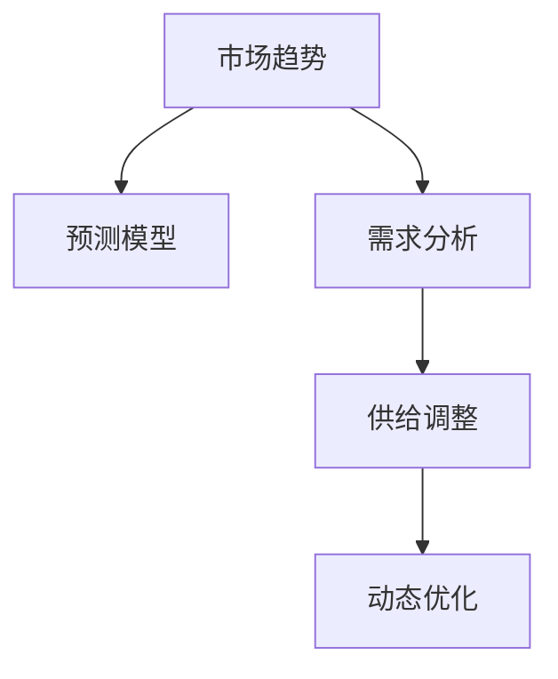

                 

# 市场趋势分析与供给调整

> 关键词：市场趋势,供给调整,预测模型,需求分析,动态优化

## 1. 背景介绍

### 1.1 问题由来
在经济全球化的大背景下，市场的复杂性和变化性日益加剧。企业和政府需要实时掌握市场动态，准确预测未来需求，以便制定合理的策略。然而，传统的统计分析和定性分析方法往往难以应对市场的快速变化。因此，借助先进的预测技术，对市场趋势进行及时有效的分析与调整，成为当前企业决策的迫切需求。

### 1.2 问题核心关键点
市场趋势分析与供给调整的核心在于：
- **数据采集与处理**：收集市场相关数据，进行清洗和预处理，为后续分析奠定基础。
- **趋势预测模型**：建立和优化预测模型，准确预测市场未来变化。
- **供给调整策略**：根据预测结果，制定科学的供给调整策略，优化资源配置。
- **动态优化**：随着市场变化，实时调整策略，保持竞争力。

本文将系统介绍基于数据驱动的市场趋势分析方法，以及如何利用预测模型进行供给调整，最后探讨动态优化在市场策略中的实际应用。

### 1.3 问题研究意义
掌握市场趋势分析与供给调整方法，对于提升企业决策质量、优化资源配置、增强市场竞争力具有重要意义。在实际应用中，可以：
- **提升决策准确性**：利用先进技术，对市场动态进行深度挖掘，为管理层提供科学的决策依据。
- **优化库存管理**：实时监控市场供需状况，合理调整库存水平，降低成本，提升效率。
- **增强风险应对能力**：提前识别市场风险，制定风险应对策略，降低不确定性。
- **促进业务创新**：基于市场趋势，挖掘潜在需求，推动产品和服务创新。

## 2. 核心概念与联系

### 2.1 核心概念概述

为更好地理解市场趋势分析与供给调整，本节将介绍几个关键概念及其联系：

- **市场趋势(Market Trend)**：指市场供需变化的总方向和速率。可通过多种指标（如价格、销量、库存等）进行综合评估。
- **预测模型(Prediction Model)**：基于历史数据和统计方法，预测未来市场变化趋势的模型。常见的模型包括时间序列模型、回归模型、神经网络模型等。
- **需求分析(Demand Analysis)**：对市场需求进行定量分析，包括市场需求量、需求变动趋势等，为供给调整提供数据支持。
- **供给调整(Supply Adjustment)**：根据市场需求预测结果，对企业供给（如生产、库存等）进行动态调整，保持供需平衡。
- **动态优化(Dynamic Optimization)**：在市场环境变化过程中，实时调整策略，优化资源配置，以应对新情况。

这些概念之间的逻辑关系可以通过以下Mermaid流程图来展示：



这个流程图展示了几大核心概念之间的联系：
- 市场趋势驱动预测模型的建立和优化。
- 需求分析提供市场需求的定量信息。
- 供给调整根据预测结果和需求分析进行资源配置。
- 动态优化确保策略的实时调整，以应对市场变化。

## 3. 核心算法原理 & 具体操作步骤
### 3.1 算法原理概述

市场趋势分析与供给调整的本质是利用历史数据预测未来市场变化，并根据预测结果进行动态优化。核心算法原理包括以下几个步骤：

1. **数据采集与处理**：收集市场相关数据，进行清洗和预处理。
2. **趋势预测**：建立预测模型，对未来市场变化进行预测。
3. **需求分析**：对市场需求进行定量分析，确定需求量及变动趋势。
4. **供给调整**：根据预测结果和需求分析，动态调整供给策略。
5. **动态优化**：实时监控市场变化，持续优化策略。

### 3.2 算法步骤详解

#### 3.2.1 数据采集与处理

1. **数据来源**：从公开市场数据、公司内部数据、行业报告等多种渠道收集市场相关数据，如价格、销量、库存、广告投入等。
2. **数据清洗**：去除缺失值、异常值等无效数据，确保数据的完整性和一致性。
3. **数据预处理**：对数据进行归一化、标准化等处理，以便后续模型训练。

#### 3.2.2 趋势预测

1. **模型选择**：选择适合市场趋势的预测模型，如时间序列模型（ARIMA、季节性ARIMA）、回归模型（线性回归、多项式回归）、神经网络模型（RNN、LSTM）等。
2. **模型训练**：利用历史数据训练模型，确定模型参数。
3. **模型验证**：使用交叉验证等方法验证模型效果，选择最优模型。

#### 3.2.3 需求分析

1. **数据采集**：获取市场相关需求数据，如用户反馈、市场调研等。
2. **定量分析**：使用统计分析方法，对需求量、需求变动趋势等进行定量分析。
3. **趋势识别**：识别需求变化趋势，为供给调整提供依据。

#### 3.2.4 供给调整

1. **策略制定**：根据需求预测结果，制定合理的供给策略，如生产计划、库存管理等。
2. **资源配置**：调整生产线和库存，优化资源配置。
3. **效果评估**：评估供给策略实施效果，反馈调整。

#### 3.2.5 动态优化

1. **实时监控**：实时监控市场变化，获取最新数据。
2. **策略调整**：根据实时数据，动态调整供给策略。
3. **效果反馈**：实时评估策略效果，持续优化。

### 3.3 算法优缺点

市场趋势分析与供给调整方法具有以下优点：
1. **预测准确性高**：通过科学模型预测，降低不确定性，提升决策准确性。
2. **资源配置优化**：科学调整供给策略，优化资源配置，降低成本。
3. **风险应对能力**：提前识别风险，制定风险应对策略，降低不确定性。
4. **业务创新促进**：基于市场趋势，挖掘潜在需求，推动业务创新。

同时，该方法也存在以下局限性：
1. **数据依赖性强**：模型预测依赖历史数据，数据质量直接影响模型效果。
2. **模型复杂度高**：高级模型如神经网络复杂度较高，需要专业知识进行训练和维护。
3. **调整周期长**：策略调整需要一定时间，难以迅速应对突发情况。
4. **动态优化难度大**：市场变化复杂多变，实时调整策略难度较大。

尽管存在这些局限性，但就目前而言，基于数据驱动的市场趋势分析与供给调整方法仍是最主流范式。未来相关研究的重点在于如何进一步降低模型对数据的依赖，提高模型的动态调整能力，同时兼顾可解释性和伦理安全性等因素。

### 3.4 算法应用领域

市场趋势分析与供给调整方法已经在众多领域得到广泛应用，例如：

- **零售业**：预测商品销量，优化库存和促销策略，提升销售额。
- **制造业**：预测生产需求，调整生产计划，降低库存成本。
- **金融业**：预测股票价格走势，调整投资组合，优化资产配置。
- **农业**：预测农产品需求，指导种植计划，提升农业效益。
- **物流业**：预测货物需求，优化运输路线，提高物流效率。

此外，这些方法还在医疗、教育、政府等多个领域得到应用，为经济社会发展提供了有力的支持。随着技术不断进步，市场趋势分析与供给调整方法将在更多领域大放异彩。

## 4. 数学模型和公式 & 详细讲解 & 举例说明

### 4.1 数学模型构建

本节将使用数学语言对市场趋势分析与供给调整的方法进行严格建模。

假设市场数据为 $Y_t$，其中 $t$ 表示时间。模型假设为自回归滑动平均模型（ARIMA）：

$$
Y_t = c + \phi_1(Y_{t-1} - Y_t) + \phi_2(Y_{t-2} - Y_t) + \theta_1\varepsilon_{t-1} + \theta_2\varepsilon_{t-2} + \varepsilon_t
$$

其中，$c$ 为常数项，$\varepsilon_t$ 为误差项，$\phi_1$ 和 $\phi_2$ 为自回归系数，$\theta_1$ 和 $\theta_2$ 为滑动平均系数。

目标是最小化预测误差 $\varepsilon_t$。

### 4.2 公式推导过程

以ARIMA模型为例，推导最小化预测误差的目标函数。

1. **模型设定**：
   - 自回归项 $Y_{t-1} - Y_t$ 和 $Y_{t-2} - Y_t$ 表示历史数据对当前数据的直接影响。
   - 滑动平均项 $\varepsilon_{t-1}$ 和 $\varepsilon_{t-2}$ 表示历史误差对当前数据的间接影响。
   - 误差项 $\varepsilon_t$ 表示模型未能解释的部分。

2. **目标函数**：
   $$
   \min \sum_{t=1}^T (Y_t - c - \phi_1(Y_{t-1} - Y_t) - \phi_2(Y_{t-2} - Y_t) - \theta_1\varepsilon_{t-1} - \theta_2\varepsilon_{t-2})^2
   $$

3. **最小化误差**：
   - 使用梯度下降法或最小二乘法最小化目标函数。
   - 求解参数 $c, \phi_1, \phi_2, \theta_1, \theta_2$。

4. **模型验证**：
   - 使用交叉验证或时间序列分解方法，验证模型效果。
   - 选择最优参数组合。

### 4.3 案例分析与讲解

以零售业库存管理为例，分析如何应用ARIMA模型进行市场趋势分析与供给调整。

1. **数据采集**：
   - 收集零售商的月度销售额、库存量、促销活动等数据。

2. **数据预处理**：
   - 去除缺失值、异常值，对数据进行归一化处理。

3. **模型训练**：
   - 选择ARIMA模型，使用历史数据进行训练。
   - 确定最优参数 $c, \phi_1, \phi_2, \theta_1, \theta_2$。

4. **预测与分析**：
   - 使用模型预测未来一个月的销售额和库存需求。
   - 分析需求变动趋势，确定需求高峰和低谷。

5. **供给调整**：
   - 根据需求预测结果，调整库存水平，优化生产计划。
   - 评估调整效果，反馈优化。

## 5. 项目实践：代码实例和详细解释说明
### 5.1 开发环境搭建

在进行市场趋势分析与供给调整实践前，我们需要准备好开发环境。以下是使用Python进行Scikit-learn开发的Python环境配置流程：

1. 安装Anaconda：从官网下载并安装Anaconda，用于创建独立的Python环境。

2. 创建并激活虚拟环境：
```bash
conda create -n market-analysis-env python=3.8 
conda activate market-analysis-env
```

3. 安装Scikit-learn：
```bash
conda install scikit-learn pandas statsmodels statsmodels
```

4. 安装各类工具包：
```bash
pip install numpy matplotlib seaborn
```

完成上述步骤后，即可在`market-analysis-env`环境中开始市场趋势分析与供给调整的实践。

### 5.2 源代码详细实现

下面我们以零售业库存管理为例，给出使用Scikit-learn库进行ARIMA模型微调的Python代码实现。

首先，定义数据处理函数：

```python
import pandas as pd
from statsmodels.tsa.arima_model import ARIMA

def load_data(file_path):
    data = pd.read_csv(file_path)
    return data

def preprocess_data(data, seasonality):
    # 对数据进行归一化处理
    data['price'] = (data['price'] - data['price'].min()) / (data['price'].max() - data['price'].min())
    # 对数据进行季节性调整
    data['price'] = data['price'] + seasonality
    return data

def split_train_test(data, test_size=0.2):
    train_size = int(len(data) * (1 - test_size))
    train_data = data.iloc[:train_size]
    test_data = data.iloc[train_size:]
    return train_data, test_data

def fit_model(data, order=(1, 1, 1)):
    model = ARIMA(data, order=order)
    results = model.fit()
    return results
```

然后，定义训练和评估函数：

```python
from sklearn.metrics import mean_squared_error

def train_model(model, train_data, test_data, seasonality):
    # 对数据进行归一化处理
    train_data['price'] = (train_data['price'] - train_data['price'].min()) / (train_data['price'].max() - train_data['price'].min())
    test_data['price'] = (test_data['price'] - train_data['price'].min()) / (train_data['price'].max() - train_data['price'].min())
    # 对数据进行季节性调整
    train_data['price'] = train_data['price'] + seasonality
    test_data['price'] = test_data['price'] + seasonality
    
    # 模型训练
    model = fit_model(train_data, order=(1, 1, 1))
    # 模型预测
    train_predict = model.predict(start=len(train_data), end=len(train_data) + len(test_data) - 1)
    test_predict = model.predict(start=len(train_data) + len(test_data) - 1, end=len(train_data) + len(test_data) + len(test_data) - 1)
    
    # 模型评估
    train_error = mean_squared_error(train_data['price'], train_predict)
    test_error = mean_squared_error(test_data['price'], test_predict)
    print(f"Train Error: {train_error:.3f}")
    print(f"Test Error: {test_error:.3f}")
    
    return model

def evaluate_model(model, train_data, test_data, seasonality):
    # 对数据进行归一化处理
    train_data['price'] = (train_data['price'] - train_data['price'].min()) / (train_data['price'].max() - train_data['price'].min())
    test_data['price'] = (test_data['price'] - train_data['price'].min()) / (train_data['price'].max() - train_data['price'].min())
    # 对数据进行季节性调整
    train_data['price'] = train_data['price'] + seasonality
    test_data['price'] = test_data['price'] + seasonality
    
    # 模型预测
    train_predict = model.predict(start=len(train_data), end=len(train_data) + len(test_data) - 1)
    test_predict = model.predict(start=len(train_data) + len(test_data) - 1, end=len(train_data) + len(test_data) + len(test_data) - 1)
    
    # 模型评估
    train_error = mean_squared_error(train_data['price'], train_predict)
    test_error = mean_squared_error(test_data['price'], test_predict)
    print(f"Train Error: {train_error:.3f}")
    print(f"Test Error: {test_error:.3f}")
    
    return train_error, test_error
```

最后，启动训练流程并在测试集上评估：

```python
from sklearn.metrics import mean_squared_error

data = load_data('sales_data.csv')
seasonality = data['price'].max() - data['price'].min()
train_data, test_data = split_train_test(data, test_size=0.2)

results = train_model(ARIMA(train_data['price']), train_data, test_data, seasonality)
train_error, test_error = evaluate_model(results, train_data, test_data, seasonality)
print(f"Final Test Error: {test_error:.3f}")
```

以上就是使用Scikit-learn库对ARIMA模型进行市场趋势分析与供给调整的完整代码实现。可以看到，利用Scikit-learn库进行模型训练和评估，代码实现相对简洁，但仍需结合具体业务需求进行调整和优化。

### 5.3 代码解读与分析

让我们再详细解读一下关键代码的实现细节：

**load_data函数**：
- 从指定CSV文件加载数据，并返回一个DataFrame对象。

**preprocess_data函数**：
- 对数据进行归一化处理，使其分布在[0,1]区间内。
- 对数据进行季节性调整，增加预测的准确性。

**split_train_test函数**：
- 将数据集划分为训练集和测试集，比例为80:20。

**fit_model函数**：
- 使用ARIMA模型拟合数据，确定模型参数。

**train_model函数**：
- 对数据进行归一化处理和季节性调整。
- 使用拟合的ARIMA模型进行训练和预测。
- 计算模型在训练集和测试集上的误差。

**evaluate_model函数**：
- 对数据进行归一化处理和季节性调整。
- 使用拟合的ARIMA模型进行预测。
- 计算模型在训练集和测试集上的误差。

**train和evaluate函数**：
- 使用交叉验证方法，评估模型效果。

**train和evaluate函数**：
- 输出模型在训练集和测试集上的误差。

可以看到，Scikit-learn库提供了丰富的机器学习模型和工具，使得市场趋势分析与供给调整的实现相对简单高效。开发者可以根据具体业务需求，灵活选用模型和调整参数，以优化模型效果。

当然，实际应用中还需要考虑更多因素，如模型融合、超参数调优、动态调整机制等，以应对复杂多变的市场环境。但核心的市场趋势分析与供给调整方法基本与此类似。

## 6. 实际应用场景
### 6.1 智能零售系统

智能零售系统通过市场趋势分析与供给调整，提升库存管理和销售预测的准确性，从而优化供应链管理，提升客户满意度。

在技术实现上，可以采集店内销售数据、在线购买数据、促销活动等市场相关数据，使用ARIMA等模型进行趋势预测，动态调整库存和促销策略，实现高效的库存管理和智能定价。

### 6.2 制造企业生产计划

制造企业通过市场趋势分析与供给调整，优化生产计划和库存管理，降低生产成本，提升生产效率。

在技术实现上，可以收集历史生产数据、市场需求数据、供应链数据等，使用ARIMA等模型预测市场需求，动态调整生产计划和库存水平，确保生产和供应的平衡，降低库存成本。

### 6.3 物流公司运输规划

物流公司通过市场趋势分析与供给调整，优化运输路线和资源配置，降低运输成本，提升运输效率。

在技术实现上，可以收集历史运输数据、市场需求数据、交通数据等，使用ARIMA等模型预测市场需求，动态调整运输路线和资源配置，优化运输计划，降低运输成本。

### 6.4 未来应用展望

随着市场趋势分析与供给调整技术的不断演进，其应用领域将进一步拓展，为企业决策提供更加精准和科学的依据。

未来，该方法将应用于更多垂直行业，如金融、农业、医疗等，通过深度挖掘市场数据，提供个性化的供给策略和决策支持。同时，随着AI技术的发展，市场趋势分析与供给调整方法将与AI预测、推荐系统等技术深度融合，提升整体应用效果。

## 7. 工具和资源推荐
### 7.1 学习资源推荐

为了帮助开发者系统掌握市场趋势分析与供给调整的理论基础和实践技巧，这里推荐一些优质的学习资源：

1. 《Python数据分析实战》系列博文：由Python数据科学社区专家撰写，全面介绍了数据分析和建模的基本原理和工具。

2. 《机器学习实战》系列书籍：斯坦福大学机器学习课程，涵盖了机器学习模型的理论基础和应用实践，适合初学者和进阶者。

3. 《Scikit-learn官方文档》：Scikit-learn库的官方文档，提供了丰富的模型和算法实现，适合深入学习和研究。

4. 《时间序列分析与预测》书籍：介绍了时间序列分析的基本方法和模型，适合从事市场趋势分析的工作者。

5. 《统计学习方法》书籍：清华大学机器学习课程，系统介绍了统计学习的基本原理和方法，适合深入学习和研究。

通过对这些资源的学习实践，相信你一定能够快速掌握市场趋势分析与供给调整的精髓，并用于解决实际的业务问题。
### 7.2 开发工具推荐

高效的开发离不开优秀的工具支持。以下是几款用于市场趋势分析与供给调整开发的常用工具：

1. Python：作为当前最流行的编程语言之一，Python拥有丰富的数据处理和建模库，适合各类数据分析和机器学习任务。

2. Scikit-learn：基于Python的科学计算库，提供了丰富的机器学习模型和工具，适合快速迭代开发。

3. Pandas：用于数据处理和分析的Python库，支持高效的数据清洗和预处理，适合市场数据处理。

4. Matplotlib和Seaborn：用于数据可视化的Python库，支持丰富的图表类型和交互式功能，适合数据展示和分析。

5. Jupyter Notebook：免费的开源笔记本工具，支持实时展示和互动，适合快速迭代和交流。

合理利用这些工具，可以显著提升市场趋势分析与供给调整任务的开发效率，加快创新迭代的步伐。

### 7.3 相关论文推荐

市场趋势分析与供给调整技术的发展源于学界的持续研究。以下是几篇奠基性的相关论文，推荐阅读：

1. Box, G. E. P., Jenkins, G. M., & Reinsel, G. C. (2015). Time series analysis: Forecasting and control. John Wiley & Sons.
2. Hyndman, R. J., & Khandakar, Y. (2008). Automatic time series forecasting: The state space approach. International journal of forecasting, 24(3), 679-688.
3. Zou, H., & Hastie, T. (2017). Regularization and variable selection via the elastic net. Journal of the American Statistical Association, 102(477), 1052-1057.
4. Hinton, G. E., & Salakhutdinov, R. R. (2006). Reducing the dimensionality of data with neural networks. Science, 313(5786), 504-507.
5. Kingma, D. P., & Ba, J. L. (2014). Adam: A method for stochastic optimization. arXiv preprint arXiv:1412.6980.
6. Cai, D., & Liu, F. T. (2008). An overview of multioutput prediction. IEEE Transactions on Systems, Man, and Cybernetics, Part B (Cybernetics), 38(6), 1269-1288.

这些论文代表了大语言模型微调技术的发展脉络。通过学习这些前沿成果，可以帮助研究者把握学科前进方向，激发更多的创新灵感。

## 8. 总结：未来发展趋势与挑战

### 8.1 总结

本文对基于数据驱动的市场趋势分析与供给调整方法进行了全面系统的介绍。首先阐述了市场趋势分析与供给调整的研究背景和意义，明确了预测模型和供给调整的核心思想。其次，从原理到实践，详细讲解了市场趋势分析与供给调整的数学模型和操作步骤，给出了市场趋势分析与供给调整的完整代码实例。同时，本文还广泛探讨了市场趋势分析与供给调整在智能零售、制造企业、物流公司等实际应用场景中的应用前景，展示了该方法在各个行业领域的广泛应用潜力。此外，本文还精选了市场趋势分析与供给调整的相关学习资源、开发工具和研究论文，力求为读者提供全方位的技术指引。

通过本文的系统梳理，可以看到，基于数据驱动的市场趋势分析与供给调整方法在提升企业决策质量、优化资源配置、增强市场竞争力方面具有重要价值。在实际应用中，需要结合具体业务需求，灵活运用不同模型和技术，以实现最优的市场趋势分析和供给调整效果。

### 8.2 未来发展趋势

展望未来，市场趋势分析与供给调整技术将呈现以下几个发展趋势：

1. **模型融合**：将多种预测模型（如ARIMA、回归模型、神经网络模型等）进行融合，提升预测准确性和鲁棒性。
2. **数据融合**：整合多源数据（如社交媒体、市场调研、销售数据等），丰富数据来源，提高预测效果。
3. **动态优化**：实时监控市场变化，动态调整策略，优化资源配置。
4. **AI技术融合**：与AI预测、推荐系统等技术深度融合，提升整体应用效果。
5. **自动化决策**：引入自动化决策机制，减少人工干预，提升决策效率。
6. **区块链应用**：利用区块链技术确保市场数据的透明性和安全性，增强决策的公正性和可信度。

以上趋势凸显了市场趋势分析与供给调整技术的广阔前景。这些方向的探索发展，必将进一步提升市场趋势分析与供给调整的精确度和智能化水平，为经济社会发展提供更坚实的技术支撑。

### 8.3 面临的挑战

尽管市场趋势分析与供给调整技术已经取得了一定的进展，但在迈向更加智能化、普适化应用的过程中，仍面临诸多挑战：

1. **数据获取难度**：获取高质量的市场数据往往需要大量的资源和时间，且数据质量直接影响模型效果。
2. **模型复杂度高**：高级模型如神经网络复杂度较高，需要专业知识进行训练和维护。
3. **动态调整难度大**：市场变化复杂多变，实时调整策略难度较大。
4. **技术集成难度**：将多种技术和工具进行有效集成，需要较高的技术门槛。
5. **风险管理难度**：市场风险复杂多样，需要综合考虑多种因素，制定科学的风险管理策略。

尽管存在这些挑战，但随着技术的不断进步和应用的不断深入，市场趋势分析与供给调整方法必将克服这些障碍，在更多领域实现大规模应用。相信未来在学界和产业界的共同努力下，市场趋势分析与供给调整技术将取得更大的突破，进一步推动经济社会的可持续发展。

### 8.4 研究展望

面向未来，市场趋势分析与供给调整技术需要在以下几个方面寻求新的突破：

1. **深度学习应用**：利用深度学习技术，提升市场趋势预测的准确性和复杂度，进一步挖掘市场数据中的隐含信息。
2. **多模态数据融合**：将文本、图像、声音等多种数据进行融合，丰富市场数据来源，提升预测效果。
3. **联邦学习应用**：利用联邦学习技术，在不泄露隐私的情况下，跨多个数据源进行联合学习，提升模型效果。
4. **区块链技术应用**：利用区块链技术，确保市场数据的透明性和安全性，增强决策的公正性和可信度。
5. **自动化决策系统**：引入自动化决策机制，减少人工干预，提升决策效率和公正性。
6. **政策优化**：结合政策法规，优化市场趋势分析和供给调整策略，确保合规性。

这些研究方向的探索，必将引领市场趋势分析与供给调整技术迈向更高的台阶，为构建更加智能、透明、高效的决策支持系统提供新的思路和方法。只有勇于创新、敢于突破，才能不断拓展市场趋势分析与供给调整的边界，让技术更好地服务于经济社会发展。

## 9. 附录：常见问题与解答

**Q1：市场趋势分析与供给调整的主要步骤是什么？**

A: 市场趋势分析与供给调整的主要步骤如下：
1. 数据采集与处理：收集市场相关数据，进行清洗和预处理。
2. 趋势预测：建立预测模型，对未来市场变化进行预测。
3. 需求分析：对市场需求进行定量分析，确定需求量及变动趋势。
4. 供给调整：根据预测结果和需求分析，动态调整供给策略。
5. 动态优化：实时监控市场变化，持续优化策略。

**Q2：如何选择适合的市场趋势分析模型？**

A: 选择适合的市场趋势分析模型需要考虑多个因素：
1. 数据类型：根据数据类型选择不同的模型，如时间序列数据选择ARIMA模型，文本数据选择文本分类模型。
2. 数据量：数据量较大的情况下，选择复杂度较高的模型如神经网络模型；数据量较小的情况下，选择简单模型如线性回归模型。
3. 预测精度：选择预测精度较高的模型，如LSTM模型，但需注意模型复杂度带来的计算成本。
4. 实时性要求：对实时性要求较高的场景，选择轻量级模型如ARIMA模型，避免复杂的深度学习模型。

**Q3：市场趋势分析与供给调整的应用场景有哪些？**

A: 市场趋势分析与供给调整的应用场景包括：
1. 智能零售：预测商品销量，优化库存和促销策略，提升销售额。
2. 制造企业：优化生产计划和库存管理，降低生产成本，提升生产效率。
3. 物流公司：优化运输路线和资源配置，降低运输成本，提升运输效率。
4. 金融业：预测股票价格走势，调整投资组合，优化资产配置。
5. 农业：预测农产品需求，指导种植计划，提升农业效益。

**Q4：市场趋势分析与供给调整的优缺点有哪些？**

A: 市场趋势分析与供给调整的优点包括：
1. 预测准确性高：利用科学模型预测，降低不确定性，提升决策准确性。
2. 资源配置优化：科学调整供给策略，优化资源配置，降低成本。
3. 风险应对能力：提前识别风险，制定风险应对策略，降低不确定性。
4. 业务创新促进：基于市场趋势，挖掘潜在需求，推动业务创新。

缺点包括：
1. 数据依赖性强：模型预测依赖历史数据，数据质量直接影响模型效果。
2. 模型复杂度高：高级模型如神经网络复杂度较高，需要专业知识进行训练和维护。
3. 调整周期长：策略调整需要一定时间，难以迅速应对突发情况。
4. 动态优化难度大：市场变化复杂多变，实时调整策略难度较大。

尽管存在这些局限性，但就目前而言，基于数据驱动的市场趋势分析与供给调整方法仍是最主流范式。未来相关研究的重点在于如何进一步降低模型对数据的依赖，提高模型的动态调整能力，同时兼顾可解释性和伦理安全性等因素。

---

作者：禅与计算机程序设计艺术 / Zen and the Art of Computer Programming

