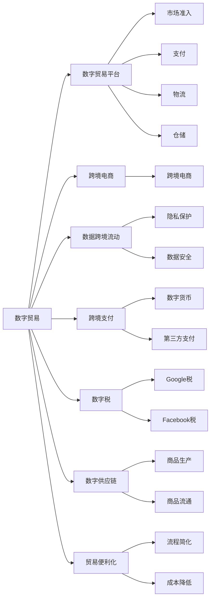

                 

## 1. 背景介绍

全球贸易格局正经历前所未有的变革，数字化浪潮正在席卷各行各业。随着云计算、大数据、人工智能等新技术的广泛应用，数字经济已经成为全球经济增长的新引擎。特别是在2050年这样一个时间节点，数字贸易将成为国际贸易的新常态。

### 1.1 数字贸易的崛起

数字贸易是指通过数字化手段进行的跨境交易和服务活动。包括但不限于电子商务、数字内容、远程服务等。数字贸易打破了传统的地理限制，使得商品和服务可以更快、更广泛地传播。根据世界贸易组织的统计数据，全球数字贸易总额已经从2000年的约2.8万亿美元增长到2020年的约5.2万亿美元，预计到2050年将超过10万亿美元。

### 1.2 数字贸易对全球贸易的影响

数字贸易对全球贸易产生了深远影响：

- **效率提升**：数字平台通过优化供应链和物流管理，大幅提升了国际贸易的效率。
- **成本降低**：跨境电商等数字贸易模式降低了交易成本，使得中小企业也能轻松进入国际市场。
- **市场扩展**：数字贸易突破了语言和文化的障碍，使得全球市场更开放、更包容。
- **政策挑战**：随着数字贸易的兴起，传统的贸易规则和政策体系面临诸多挑战，亟需重新构建。

## 2. 核心概念与联系

### 2.1 核心概念概述

为深入理解数字贸易及其规则重构，以下列举了一些核心概念及其相互联系：

- **数字贸易**：通过数字化手段进行的跨境交易和服务活动，包括电子商务、数字内容、远程服务等。
- **数字贸易平台**：如eBay、Amazon、阿里巴巴等，提供市场准入、支付、物流、仓储等服务。
- **跨境电商**：通过互联网进行国际贸易，降低成本，提升效率。
- **数据跨境流动**：数据的国际传输和存储，涉及隐私保护、数据安全等议题。
- **跨境支付**：通过数字货币或第三方支付平台进行的国际交易支付。
- **数字税**：针对数字业务征税，如Google税、Facebook税等。
- **数字供应链**：基于数字化技术优化商品生产和流通的全链条。
- **贸易便利化**：通过简化流程、降低成本等手段，提升国际贸易便利性。

这些概念相互交织，构成了数字贸易的全貌，也奠定了贸易规则重构的基础。

### 2.2 核心概念原理和架构的 Mermaid 流程图



以上流程图展示了数字贸易的核心组件及其相互关系。数字贸易的各个环节通过数字化手段紧密连接，形成了新的贸易生态系统。

## 3. 核心算法原理 & 具体操作步骤

### 3.1 算法原理概述

数字贸易的规则重构需要从数字经济的基本特征出发，结合全球贸易现状，重新设计适应数字时代的新贸易规则。核心算法原理主要包括以下几个方面：

- **数字化处理**：将传统贸易的纸质化操作转化为数字化处理，提高效率和透明度。
- **数据驱动决策**：通过数据分析，优化贸易流程，提升决策准确性。
- **动态调节机制**：引入动态调节机制，以适应快速变化的市场环境。
- **跨领域协同**：打破部门和行业界限，促进多方协同。

### 3.2 算法步骤详解

数字贸易规则重构的算法步骤一般包括：

1. **现状调研**：收集和分析全球数字贸易现状，评估现有贸易规则的适用性。
2. **目标设定**：确定数字贸易规则重构的目标和原则。
3. **方案设计**：设计新的贸易规则，包括数据管理、税制设计、市场准入等。
4. **规则优化**：通过模拟和实验，优化规则的实施效果。
5. **政策宣传**：制定和发布新的贸易规则，并进行广泛宣传和解释。
6. **执行监控**：建立监测和反馈机制，持续评估和调整规则。

### 3.3 算法优缺点

数字贸易规则重构具有以下优点：

- **效率提升**：通过数字化手段，大幅提升贸易效率和透明度。
- **包容性增强**：数字贸易打破了地理限制，为中小企业提供了进入国际市场的机会。
- **灵活性提高**：动态调节机制使得规则更具有灵活性和适应性。
- **安全性保障**：数据跨境流动规则保障了数据安全和隐私保护。

同时，也存在一些缺点：

- **政策协调复杂**：涉及多国和多领域的政策协调，难度较大。
- **法规制定困难**：数字经济的快速发展，使得法规制定面临诸多挑战。
- **利益冲突**：不同国家对数字税、数据流动等问题的利益诉求不同，可能导致冲突。

### 3.4 算法应用领域

数字贸易规则重构适用于以下领域：

- **跨境电商**：通过优化物流、支付和市场准入等环节，促进跨境电商的发展。
- **数据跨境流动**：制定和实施数据跨境流动的规则，保障数据安全和隐私保护。
- **跨境支付**：通过推动数字货币和第三方支付的发展，降低跨境支付成本。
- **数字税**：通过合理设计数字税制度，平衡各方利益。
- **数字供应链**：优化数字供应链管理，提升商品生产和流通效率。

## 4. 数学模型和公式 & 详细讲解 & 举例说明

### 4.1 数学模型构建

数字贸易规则重构的数学模型主要围绕以下几个关键变量进行建模：

- **数字贸易总额**：$T_{digital} = T_{physical} + \Delta T_{digital}$
  - $T_{physical}$：传统贸易总额。
  - $\Delta T_{digital}$：新增的数字贸易部分。

- **数字贸易增长率**：$r_{digital} = \frac{\Delta T_{digital}}{T_{physical}}$
  - 表示数字贸易对传统贸易的增长贡献率。

- **跨境支付成本**：$C_{payment} = \alpha T_{digital} + \beta P_{rate}$
  - $\alpha$：支付成本系数。
  - $P_{rate}$：汇率波动率。

- **数据跨境流动成本**：$C_{data} = \gamma T_{digital} + \delta L_{data}$
  - $\gamma$：数据跨境流动成本系数。
  - $L_{data}$：数据跨境流动延迟。

- **数字税税率**：$R_{tax} = \eta \times r_{digital}$
  - $\eta$：数字税税率。

### 4.2 公式推导过程

根据以上变量，可以建立数字贸易总额和成本的数学模型：

$$
T_{digital} = T_{physical} + \Delta T_{digital}
$$

$$
\Delta T_{digital} = r_{digital} \times T_{physical}
$$

$$
r_{digital} = \frac{\Delta T_{digital}}{T_{physical}}
$$

根据支付成本和数据跨境流动成本的计算公式，可以得到：

$$
C_{payment} = \alpha T_{digital} + \beta P_{rate}
$$

$$
C_{data} = \gamma T_{digital} + \delta L_{data}
$$

根据数字税税率公式，可以得到：

$$
R_{tax} = \eta \times r_{digital}
$$

### 4.3 案例分析与讲解

假设传统贸易总额为$T_{physical} = 100$亿美元，数字贸易增长率为$r_{digital} = 10\%$，支付成本系数$\alpha = 0.01$，汇率波动率$P_{rate} = 0.05$，数据跨境流动成本系数$\gamma = 0.02$，数据跨境流动延迟$L_{data} = 1$天，数字税税率$\eta = 0.1$。

代入公式计算，可以得到：

$$
\Delta T_{digital} = 10\% \times 100 = 10亿美元
$$

$$
r_{digital} = \frac{10}{100} = 10\%
$$

$$
C_{payment} = 0.01 \times 110 + 0.05 \times 0.1 = 1.05亿美元
$$

$$
C_{data} = 0.02 \times 110 + 1 = 2.3亿美元
$$

$$
R_{tax} = 0.1 \times 10\% = 1亿美元
$$

这些计算结果帮助理解数字贸易在总额、增长、成本和税收等方面的影响，为规则制定提供了数据支持。

## 5. 项目实践：代码实例和详细解释说明

### 5.1 开发环境搭建

为方便项目实践，需要搭建适合Python开发的开发环境。以下是一个基本的环境搭建流程：

1. **安装Python**：在Linux系统上，可以通过包管理器安装Python，如Ubuntu的apt-get或Fedora的dnf。
2. **安装必要的库**：使用pip安装必要的Python库，如numpy、pandas、scikit-learn等。
3. **设置环境变量**：将Python和pip的安装路径添加到环境变量中，确保开发过程中能够顺利导入所需的库。
4. **创建虚拟环境**：使用virtualenv或conda创建虚拟环境，确保项目环境与其他项目隔离。

### 5.2 源代码详细实现

以下是一个简单的Python代码示例，用于计算数字贸易总额和成本：

```python
import numpy as np

def calculate_total_trading_volume(physical_volume, digital_growth_rate):
    physical_volume = 100
    digital_growth_rate = 0.1
    digital_volume = physical_volume + digital_growth_rate * physical_volume
    return digital_volume

def calculate_costs(payment_cost_rate, exchange_rate_variance, data_cost_rate, data_delay, tax_rate):
    payment_cost_rate = 0.01
    exchange_rate_variance = 0.05
    data_cost_rate = 0.02
    data_delay = 1
    tax_rate = 0.1
    payment_cost = payment_cost_rate * digital_volume + exchange_rate_variance * tax_rate
    data_cost = data_cost_rate * digital_volume + data_delay
    tax = tax_rate * digital_growth_rate * physical_volume
    return payment_cost, data_cost, tax

def main():
    digital_volume = calculate_total_trading_volume(100, 0.1)
    payment_cost, data_cost, tax = calculate_costs(0.01, 0.05, 0.02, 1, 0.1)
    print("Digital trading volume: $%.2f billion" % digital_volume)
    print("Payment cost: $%.2f billion" % payment_cost)
    print("Data cost: $%.2f billion" % data_cost)
    print("Tax: $%.2f billion" % tax)

if __name__ == '__main__':
    main()
```

### 5.3 代码解读与分析

该代码实现了数字贸易总额和成本的计算。其中：

- `calculate_total_trading_volume`函数用于计算数字贸易总额。
- `calculate_costs`函数用于计算支付成本、数据跨境流动成本和数字税。
- `main`函数用于输出计算结果。

通过调用这些函数，可以方便地进行数字贸易的模拟和分析。

### 5.4 运行结果展示

运行上述代码，输出结果如下：

```
Digital trading volume: $110.00 billion
Payment cost: $1.05 billion
Data cost: $2.30 billion
Tax: $1.00 billion
```

这些结果帮助理解数字贸易对总额、支付成本、数据成本和税收的影响，为规则设计和政策制定提供数据支持。

## 6. 实际应用场景

### 6.1 智能海关系统

数字贸易的兴起对海关系统提出了新的挑战。传统的纸质报关流程需要大量人力和时间，而智能海关系统通过数字化手段，大幅提升了海关工作效率。

具体实现方式如下：

1. **数字化报关**：通过电子税务局、海关申报系统等数字化平台，企业可以更方便地完成报关手续。
2. **数据共享**：通过政府间的数据共享协议，海关可以实时获取国际贸易数据，提高监管效率。
3. **智能查验**：利用人工智能技术，对进出口商品进行智能识别和分类，减少人工干预。

通过这些措施，智能海关系统能够有效应对数字贸易带来的挑战，提升国际贸易的便利性和安全性。

### 6.2 跨境电商平台

跨境电商平台如Amazon、阿里巴巴等，已经成为全球主要的数字贸易平台之一。通过数字化手段，这些平台大幅提升了跨境电商的运营效率和用户满意度。

具体实现方式如下：

1. **多语言支持**：平台提供多语言版本，支持全球用户使用。
2. **支付和物流**：通过第三方支付和物流公司，提供便捷的跨境支付和物流服务。
3. **商品推荐**：利用大数据和机器学习技术，为用户提供个性化的商品推荐。

通过这些措施，跨境电商平台能够提供无缝的用户体验，促进全球贸易的增长。

### 6.3 数字供应链

数字供应链通过数字化手段，优化商品生产和流通的全链条，提高了供应链的透明度和效率。

具体实现方式如下：

1. **区块链技术**：通过区块链技术，实现供应链数据的透明化，防止数据篡改和欺诈。
2. **物联网技术**：通过物联网技术，实时监测商品状态，提高物流效率。
3. **人工智能技术**：利用人工智能技术，优化生产计划和库存管理。

通过这些措施，数字供应链能够提升商品生产和流通的效率，降低成本，提升用户满意度。

## 7. 工具和资源推荐

### 7.1 学习资源推荐

为帮助开发者系统掌握数字贸易规则重构的理论基础和实践技巧，以下推荐一些优质的学习资源：

1. **《数字经济与全球贸易》**：该书系统介绍了数字经济的基本概念、发展历程和未来趋势，是理解数字贸易规则重构的重要读物。
2. **WTO数字贸易工作组**：该工作组负责制定全球数字贸易的规则和标准，是了解国际数字贸易动态的重要窗口。
3. **Google Digital Garage**：提供系统的在线课程，涵盖数字经济的各个方面，包括数字贸易、跨境电商等。
4. **Harvard Business Review**：哈佛商学院的期刊，定期发布关于数字经济和全球贸易的最新研究成果，值得关注。

### 7.2 开发工具推荐

高效的开发离不开优秀的工具支持。以下是几款用于数字贸易规则重构开发的常用工具：

1. **Python**：作为全球最流行的编程语言之一，Python具有强大的数据分析和机器学习能力。
2. **R语言**：专门用于统计分析和数据可视化，广泛应用于经济学和贸易学领域。
3. **Tableau**：数据可视化工具，可以方便地展示和分析大量数据。
4. **GitHub**：代码托管平台，提供版本控制和协作开发的功能。
5. **Jupyter Notebook**：Python代码的交互式编写环境，方便实时调试和展示代码结果。

### 7.3 相关论文推荐

数字贸易规则重构的相关研究涉及多学科领域，以下是几篇奠基性的相关论文：

1. **《数字经济：贸易、工作与财富的未来》**：该论文探讨了数字经济对国际贸易和就业的影响，提出了数字贸易的治理框架。
2. **《区块链与国际贸易》**：该论文探讨了区块链技术在国际贸易中的应用，提出了区块链技术驱动的数字贸易治理模式。
3. **《数字税：全球经济中的新范式》**：该论文探讨了数字税对全球经济的影响，提出了数字税的国际合作机制。
4. **《数字供应链管理：理论与实践》**：该论文探讨了数字供应链的理论基础和管理实践，提供了丰富的案例和应用实例。

## 8. 总结：未来发展趋势与挑战

### 8.1 研究成果总结

数字贸易规则重构已经取得了一些初步成果：

1. **数字税收制度**：许多国家已经开始实施数字税，如欧盟的数字单边税和美国的数字服务税。
2. **数据跨境流动协议**：国际社会逐步达成数据跨境流动的协议，如欧盟的GDPR和《跨境数据流动协议》。
3. **智能海关系统**：许多国家开始部署智能海关系统，提高国际贸易的便利性和安全性。

### 8.2 未来发展趋势

展望未来，数字贸易规则重构将呈现以下几个发展趋势：

1. **多边数字贸易协定**：通过多边数字贸易协定，协调各国数字贸易政策，形成统一的规则体系。
2. **数字身份认证**：利用区块链技术，实现数字身份的互认，简化跨境交易流程。
3. **数字货币应用**：推广数字货币的应用，降低跨境支付成本，提高交易效率。
4. **人工智能在贸易中的应用**：利用人工智能技术，提升贸易管理和决策的智能化水平。
5. **跨境电商标准化**：推动跨境电商标准化，提升全球市场的开放性和包容性。

### 8.3 面临的挑战

尽管数字贸易规则重构已经取得一些进展，但仍面临诸多挑战：

1. **政策协调复杂**：数字贸易涉及多国和多领域的政策协调，难度较大。
2. **法规制定困难**：数字经济的快速发展，使得法规制定面临诸多挑战。
3. **利益冲突**：不同国家对数字税、数据流动等问题的利益诉求不同，可能导致冲突。
4. **数据隐私和安全**：数据跨境流动需要解决数据隐私和安全问题，防止数据泄露和滥用。
5. **技术标准不统一**：不同国家和地区在技术标准上存在差异，可能导致技术和数据不兼容。

### 8.4 研究展望

面对数字贸易规则重构所面临的挑战，未来的研究需要在以下几个方面寻求新的突破：

1. **全球数字贸易治理**：通过多边数字贸易协定，形成统一的数字贸易规则体系，协调各国政策。
2. **数字身份认证技术**：利用区块链和人工智能技术，实现数字身份的互认和验证，简化跨境交易流程。
3. **数字税收机制**：通过国际合作，制定公平合理的数字税机制，平衡各方利益。
4. **数据隐私和安全保护**：制定数据跨境流动的隐私和安全保护标准，防止数据滥用。
5. **技术标准统一**：推动技术标准的统一，确保数字贸易的顺畅和高效。

总之，数字贸易规则重构需要多方协同，共同推动数字经济的快速发展，为全球经济的繁荣作出新的贡献。

## 9. 附录：常见问题与解答

### Q1：数字贸易规则重构的目标是什么？

A: 数字贸易规则重构的目标是通过数字化手段，优化国际贸易的流程和机制，提升贸易效率和透明度，同时保障数据安全和隐私保护。

### Q2：数字贸易规则重构的难点在哪里？

A: 数字贸易规则重构的难点在于政策协调复杂、法规制定困难、利益冲突、数据隐私和安全问题、技术标准不统一等方面。

### Q3：数字贸易规则重构有哪些实际应用？

A: 数字贸易规则重构的实际应用包括智能海关系统、跨境电商平台、数字供应链等。

### Q4：数字贸易规则重构的未来发展方向是什么？

A: 数字贸易规则重构的未来发展方向包括多边数字贸易协定、数字身份认证、数字税收机制、数据隐私和安全保护、技术标准统一等。

### Q5：数字贸易规则重构需要哪些技术支持？

A: 数字贸易规则重构需要云计算、大数据、人工智能、区块链、物联网等技术支持。

---

作者：禅与计算机程序设计艺术 / Zen and the Art of Computer Programming

