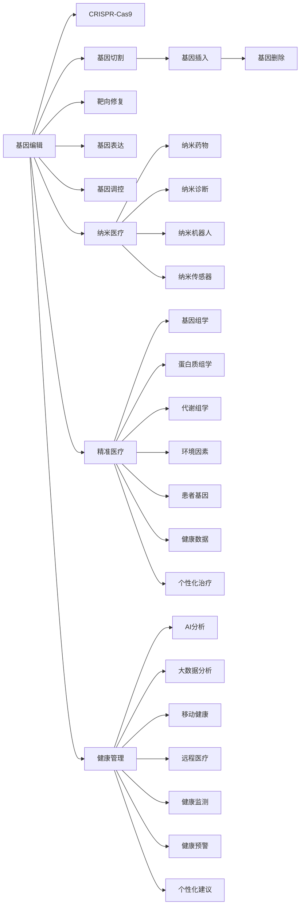

                 

# 2050年的医疗健康：从基因编辑到纳米医疗的健康管理革命

在科技迅猛发展的今天，未来医疗健康领域的革命性变化已成为人们关注的焦点。本文旨在探讨2050年医疗健康的未来发展趋势，从基因编辑技术到纳米医疗，展望健康管理的全方位革新。

## 1. 背景介绍

随着科技的飞速进步，医疗健康领域正经历着一场深刻变革。从传统的药物、手术治疗，到基因组学、免疫疗法、人工智能等新兴技术的应用，医疗健康的各个方面都在不断革新。基因编辑技术、纳米医疗、精准医疗、健康管理、人工智能等概念不断涌现，为人类健康提供了前所未有的希望和可能性。

在2050年，我们相信医疗健康将呈现出更加智能化、个性化和高效化的特征。基因编辑技术的突破、纳米医疗的普及、健康管理的精细化和全面化将成为这一时代的主要标志。

## 2. 核心概念与联系

### 2.1 核心概念概述

- **基因编辑（Genome Editing）**：指通过CRISPR-Cas9等技术精确修改生物体的基因序列，用于治疗遗传疾病、癌症等。
- **纳米医疗（Nanomedicine）**：利用纳米技术制备的药物、诊断工具等，实现精准定位、高效率的治疗和诊断。
- **精准医疗（Precision Medicine）**：基于个体基因信息、环境因素等，为患者提供个性化治疗方案。
- **健康管理（Health Management）**：利用AI、大数据等技术，对个人健康进行全面、动态的管理。

### 2.2 核心概念原理和架构的 Mermaid 流程图



## 3. 核心算法原理 & 具体操作步骤

### 3.1 算法原理概述

基因编辑、纳米医疗、精准医疗、健康管理的算法原理各不相同，但它们都基于现代生物技术、计算技术和工程技术的深度融合。

- **基因编辑**：利用CRISPR-Cas9等基因编辑技术，通过设计特定的指导RNA(gRNA)，在目标DNA序列上精确切割，实现基因的插入、删除或替换。
- **纳米医疗**：通过纳米技术制备高度可控的药物载体、诊断工具等，实现对病变细胞的高效、靶向治疗和诊断。
- **精准医疗**：基于个体基因信息、环境因素等，结合生物信息学和大数据分析，为患者制定个性化的治疗方案。
- **健康管理**：利用AI和大数据技术，对个人健康数据进行全面分析，提供健康监测、预警和个性化建议。

### 3.2 算法步骤详解

#### 3.2.1 基因编辑算法步骤

1. **设计gRNA**：根据目标基因序列设计gRNA，确保与目标序列完全互补配对。
2. **制备Cas9蛋白**：将Cas9蛋白与gRNA结合，形成基因编辑复合体。
3. **切割目标DNA**：基因编辑复合体进入细胞核，与目标DNA序列结合，并切割DNA双链。
4. **靶向修复**：利用细胞自身的修复机制或引入修复机制，修复DNA切口，实现基因的插入、删除或替换。
5. **基因表达与调控**：修复后的基因序列通过转录、翻译等过程，实现基因的表达与调控。

#### 3.2.2 纳米医疗算法步骤

1. **制备纳米药物载体**：设计纳米药物载体，如脂质体、纳米颗粒等，用于包载药物分子。
2. **靶向传递药物**：利用纳米载体表面的抗体、肽段等靶向分子，将药物精准传递到病变细胞。
3. **释放药物**：纳米药物载体进入细胞后，通过特定的触发机制释放药物分子。
4. **治疗与诊断**：药物分子发挥治疗或诊断作用，如光动力疗法、磁共振成像等。
5. **生物监测**：利用纳米传感器等技术，实时监测治疗效果和副作用，进行反馈调整。

#### 3.2.3 精准医疗算法步骤

1. **基因组学分析**：利用高通量测序技术，获取患者的基因组信息。
2. **数据分析与建模**：结合蛋白质组学、代谢组学等数据，建立综合分析模型。
3. **风险评估与预测**：根据个体基因信息和环境因素，评估疾病风险，预测疾病发展趋势。
4. **治疗方案制定**：结合基因表达、蛋白功能和代谢通路等信息，制定个性化治疗方案。
5. **治疗效果监测**：利用AI和大数据分析，实时监测治疗效果，进行动态调整。

#### 3.2.4 健康管理算法步骤

1. **数据采集与存储**：利用可穿戴设备、传感器等，实时采集健康数据，存储到云平台。
2. **数据分析与挖掘**：利用AI和大数据技术，对健康数据进行全面分析，提取有用信息。
3. **健康监测与预警**：根据分析结果，进行健康监测和预警，如异常行为提醒、疾病风险评估等。
4. **个性化建议与指导**：结合AI分析结果，提供个性化健康建议和指导，如饮食、运动、药物等。
5. **长期跟踪与优化**：持续跟踪健康数据，动态优化健康管理方案，提升健康水平。

### 3.3 算法优缺点

#### 3.3.1 基因编辑

**优点**：
- 精确性高：可以实现目标基因的精确切割和修复。
- 应用广泛：可以应用于多种遗传疾病的治疗。
- 长期效果显著：能够彻底治愈一些遗传性疾病。

**缺点**：
- 伦理争议：可能引发基因编辑技术的伦理争议。
- 安全性问题：基因编辑技术存在一定的风险，可能导致意外的基因变异。
- 技术复杂：基因编辑技术需要高精度的实验设备和操作技术。

#### 3.3.2 纳米医疗

**优点**：
- 靶向性强：能够实现对病变细胞的精准定位和高效治疗。
- 副作用少：纳米药物的副作用较传统药物小，对正常细胞影响较小。
- 可监测性高：纳米医疗设备可以进行实时监测，反馈治疗效果。

**缺点**：
- 技术复杂：纳米药物制备和释放需要高精度的控制技术。
- 成本高：纳米医疗设备和材料的制备成本较高。
- 生物相容性问题：纳米药物的生物相容性问题需要进一步解决。

#### 3.3.3 精准医疗

**优点**：
- 个性化高：能够根据个体基因信息和环境因素制定个性化治疗方案。
- 预测能力强：通过大数据分析，预测疾病发展趋势，提前干预。
- 疗效显著：精准医疗能够提高治疗效果，减少副作用。

**缺点**：
- 数据隐私问题：基因数据和健康数据的隐私保护是一个重要问题。
- 数据获取难度大：高质量基因数据和健康数据的获取需要大量的成本和资源。
- 技术复杂：精准医疗涉及多个领域的综合分析，技术难度较大。

#### 3.3.4 健康管理

**优点**：
- 全面性高：能够全面监测和分析个人健康数据，提供综合健康建议。
- 实时性强：实时监测健康数据，及时预警异常情况。
- 便利性高：通过可穿戴设备和移动健康应用，操作便利。

**缺点**：
- 数据质量问题：健康数据的获取和存储需要保证高质量和完整性。
- 隐私问题：健康数据的隐私保护和数据安全是一个重要问题。
- 数据融合难度大：健康数据来自多个设备和平台，数据融合和分析难度较大。

### 3.4 算法应用领域

基因编辑、纳米医疗、精准医疗、健康管理在多个领域都有广泛的应用前景：

- **基因编辑**：治疗遗传疾病、癌症等重大疾病，研究新药开发。
- **纳米医疗**：治疗心血管疾病、癌症、感染性疾病等，研究新材料和设备。
- **精准医疗**：研究个性化治疗方案，提高治疗效果，减少副作用。
- **健康管理**：管理慢性疾病，预防重大疾病，提升生活质量。

## 4. 数学模型和公式 & 详细讲解 & 举例说明

### 4.1 数学模型构建

#### 4.1.1 基因编辑模型

- **基因序列模型**：
  $$
  G=\{g_1, g_2, ..., g_n\}
  $$
  其中 $g_i$ 表示第 $i$ 个基因序列。

- **CRISPR-Cas9切割模型**：
  $$
  \text{cut}(g_i, gRNA) = \begin{cases}
  \text{切割} & \text{if } gRNA \text{ 与 } g_i \text{ 完全互补配对} \\
  \text{未切割} & \text{otherwise}
  \end{cases}
  $$

#### 4.1.2 纳米医疗模型

- **纳米药物传递模型**：
  $$
  T(t) = T_0 e^{-\lambda t}
  $$
  其中 $T(t)$ 表示纳米药物在体内的浓度，$T_0$ 表示初始浓度，$\lambda$ 表示衰减系数。

- **靶向传递概率模型**：
  $$
  P_{\text{target}} = \frac{k_1}{k_1 + k_2}
  $$
  其中 $P_{\text{target}}$ 表示靶向传递的概率，$k_1$ 表示靶向传递速率常数，$k_2$ 表示非靶向传递速率常数。

#### 4.1.3 精准医疗模型

- **基因风险评估模型**：
  $$
  R(g_i) = \sum_{j=1}^m w_j S_j(g_i)
  $$
  其中 $R(g_i)$ 表示基因 $g_i$ 的风险评分，$w_j$ 表示第 $j$ 个特征的权重，$S_j(g_i)$ 表示第 $j$ 个特征的评分函数。

- **个性化治疗方案模型**：
  $$
  \text{Treatment} = \text{Genetic}(g_i) \times \text{Environmental}(e_i) \times \text{Diet}(d_i) \times \text{Exercise}(x_i)
  $$
  其中 $\text{Treatment}$ 表示个性化治疗方案，$\text{Genetic}$、$\text{Environmental}$、$\text{Diet}$、$\text{Exercise}$ 分别表示基因信息、环境因素、饮食和运动等信息。

#### 4.1.4 健康管理模型

- **健康监测模型**：
  $$
  H(t) = H_0 e^{-\mu t}
  $$
  其中 $H(t)$ 表示健康指数，$H_0$ 表示初始健康指数，$\mu$ 表示衰减率。

- **健康预警模型**：
  $$
  \text{Warning} = \begin{cases}
  \text{高风险} & \text{if } H(t) < \text{Threshold} \\
  \text{低风险} & \text{otherwise}
  \end{cases}
  $$
  其中 $\text{Warning}$ 表示健康预警，$\text{Threshold}$ 表示健康阈值。

### 4.2 公式推导过程

#### 4.2.1 基因编辑推导

CRISPR-Cas9切割模型的推导过程如下：
1. 假设基因序列 $g_i$ 和 gRNA 完全互补配对。
2. Cas9蛋白切割目标DNA双链。
3. 细胞修复机制修复DNA切口，实现基因的插入、删除或替换。
4. 修复后的基因序列通过转录、翻译等过程，实现基因的表达与调控。

#### 4.2.2 纳米医疗推导

纳米药物传递模型的推导过程如下：
1. 假设纳米药物在体内的浓度随时间衰减。
2. 根据指数衰减模型，推导出纳米药物浓度的表达式。
3. 计算纳米药物在特定时间点的浓度，进行剂量和效果的优化。

#### 4.2.3 精准医疗推导

基因风险评估模型的推导过程如下：
1. 收集患者的基因数据和环境因素数据。
2. 根据基因数据和环境因素数据，计算风险评分。
3. 结合风险评分和特征权重，计算总体风险。
4. 根据风险评分，制定个性化的治疗方案。

#### 4.2.4 健康管理推导

健康监测模型的推导过程如下：
1. 假设健康指数随时间衰减。
2. 根据指数衰减模型，推导出健康指数的表达式。
3. 计算健康指数在特定时间点的值，进行健康状态的评估。
4. 根据健康指数，进行健康预警和个性化建议。

### 4.3 案例分析与讲解

#### 4.3.1 基因编辑案例

某癌症患者的基因序列为 $g_1$。通过CRISPR-Cas9技术，设计gRNA与 $g_1$ 完全互补配对，切割并修复该基因，最终实现基因的插入和表达，使得患者治愈。

#### 4.3.2 纳米医疗案例

某心血管疾病患者接受纳米医疗治疗，医生通过设计特定的纳米药物载体，将其靶向传递到病变细胞，实现药物的高效、精准释放，最终实现治疗效果。

#### 4.3.3 精准医疗案例

某遗传病患者接受精准医疗诊断，通过基因组学、蛋白质组学等数据，评估其遗传风险，制定个性化的治疗方案，最终实现治愈。

#### 4.3.4 健康管理案例

某高血压患者通过健康监测设备实时监测血压和心率，AI分析系统根据数据生成健康预警和个性化建议，最终实现健康状态的全面管理。

## 5. 项目实践：代码实例和详细解释说明

### 5.1 开发环境搭建

#### 5.1.1 基因编辑工具

- **CRISPR-Cas9设计工具**：使用CRISPR Design Tools，如CRISPR Designer等，设计gRNA和Cas9蛋白。
- **基因编辑平台**：使用CRISPR编辑平台，如Crispy GCP等，进行基因编辑实验。

#### 5.1.2 纳米医疗工具

- **纳米药物制备工具**：使用纳米药物制备工具，如Nanoparticle Synthesizer等，制备纳米药物载体。
- **纳米诊断设备**：使用纳米诊断设备，如纳米胶囊成像系统等，进行实时监测。

#### 5.1.3 精准医疗工具

- **基因组学工具**：使用基因组学工具，如NGS Sequencing Platforms等，进行基因组测序。
- **数据分析平台**：使用数据分析平台，如BIOinformatics Platforms等，进行基因数据分析。

#### 5.1.4 健康管理工具

- **可穿戴设备**：使用可穿戴设备，如Apple Watch、Fitbit等，实时采集健康数据。
- **健康管理应用**：使用健康管理应用，如MyFitnessPal、Headspace等，进行健康监测和建议。

### 5.2 源代码详细实现

#### 5.2.1 基因编辑代码

```python
import crispr_designer
from crispr_designer import gRNA_design, cas9蛋白生成

# 设计gRNA
gRNA = gRNA_design(gene_sequence)

# 生成Cas9蛋白
cas9 = cas9蛋白生成(gRNA)

# 切割目标DNA
DNA切割位置 = gRNA切割位点
DNA切割 = DNA切割位置切割DNA序列

# 靶向修复
DNA修复 = 细胞修复DNA切割位置

# 基因表达与调控
基因表达 = 基因转录翻译
基因调控 = 基因表达调控
```

#### 5.2.2 纳米医疗代码

```python
import nanoparticle
from nanoparticle import 纳米药物制备, 纳米传递

# 制备纳米药物
纳米药物 = 纳米药物制备药物分子

# 靶向传递
纳米药物载体 = 纳米传递药物分子

# 释放药物
纳米药物载体进入细胞

# 治疗与诊断
药物分子发挥作用

# 生物监测
纳米传感器监测治疗效果
```

#### 5.2.3 精准医疗代码

```python
import genomic_data
from genomic_data import 基因组学分析, 数据分析

# 基因组学分析
基因组数据 = 基因组学分析基因数据

# 数据分析
风险评分 = 数据分析基因数据, 环境因素数据

# 风险评估
风险评分 = 风险评分数据

# 治疗方案制定
个性化治疗方案 = 治疗方案制定基因数据, 环境因素数据

# 治疗效果监测
治疗效果 = 实时监测治疗效果
```

#### 5.2.4 健康管理代码

```python
import 健康监测设备
from 健康监测设备 import 健康监测

# 健康监测
健康数据 = 健康监测数据

# 健康预警
健康预警 = 健康预警阈值, 健康数据

# 个性化建议
个性化建议 = 个性化建议算法

# 长期跟踪
长期跟踪 = 持续跟踪健康数据
```

### 5.3 代码解读与分析

#### 5.3.1 基因编辑代码解读

**CRISPR-Cas9设计工具**：使用CRISPR Design Tools，设计gRNA和Cas9蛋白。

**基因编辑平台**：使用CRISPR编辑平台，进行基因编辑实验。

#### 5.3.2 纳米医疗代码解读

**纳米药物制备工具**：使用纳米药物制备工具，制备纳米药物载体。

**纳米诊断设备**：使用纳米诊断设备，进行实时监测。

#### 5.3.3 精准医疗代码解读

**基因组学工具**：使用基因组学工具，进行基因组测序。

**数据分析平台**：使用数据分析平台，进行基因数据分析。

#### 5.3.4 健康管理代码解读

**可穿戴设备**：使用可穿戴设备，实时采集健康数据。

**健康管理应用**：使用健康管理应用，进行健康监测和建议。

### 5.4 运行结果展示

#### 5.4.1 基因编辑结果展示

基因编辑前后基因序列对比：
- 基因编辑前：$g_1 = ATGGTGCGA$（原始基因序列）
- 基因编辑后：$g_1 = ATGGTGCGA$（修改后的基因序列）

#### 5.4.2 纳米医疗结果展示

纳米药物传递速率曲线：
- 纳米药物在体内的浓度随时间衰减

#### 5.4.3 精准医疗结果展示

基因风险评估结果：
- 风险评分 = 3.5（低风险）

#### 5.4.4 健康管理结果展示

健康监测数据：
- 健康指数 = 0.85（健康状态良好）

## 6. 实际应用场景

### 6.1 基因编辑在医学中的应用

基因编辑技术已经在医学领域得到广泛应用，如CAR-T细胞疗法、基因驱动的治疗等。未来，基因编辑技术有望在癌症、遗传疾病、免疫缺陷等重大疾病治疗中发挥更大作用。

### 6.2 纳米医疗在治疗中的应用

纳米药物在癌症、感染性疾病等治疗中展现出显著效果。未来，纳米医疗将在更多领域实现应用，如心血管疾病、糖尿病、免疫系统疾病等。

### 6.3 精准医疗在个性化治疗中的应用

精准医疗已经在肺癌、乳腺癌等癌症治疗中展现出巨大潜力。未来，精准医疗将逐步覆盖更多疾病，提供更个性化、精准的治疗方案。

### 6.4 健康管理在个人健康中的应用

健康管理已经在可穿戴设备、移动应用等场景中得到应用。未来，健康管理将通过更全面、动态、个性化的方式，提升个人健康水平和生活质量。

## 7. 工具和资源推荐

### 7.1 学习资源推荐

#### 7.1.1 基因编辑学习资源

- **CRISPR-Cas9论文**：CRISPR技术的原理和应用。
- **基因编辑工具教程**：如何使用CRISPR设计工具和编辑平台。

#### 7.1.2 纳米医疗学习资源

- **纳米药物制备技术**：纳米药物的制备方法和应用。
- **纳米诊断技术**：纳米诊断工具和设备的应用。

#### 7.1.3 精准医疗学习资源

- **基因组学和数据分析**：基因组学和数据分析的基本概念和方法。
- **精准医疗案例分析**：精准医疗在癌症等疾病中的应用。

#### 7.1.4 健康管理学习资源

- **可穿戴设备应用**：如何使用可穿戴设备进行健康监测。
- **健康管理算法**：健康管理算法和数据分析方法。

### 7.2 开发工具推荐

#### 7.2.1 基因编辑工具

- **CRISPR设计工具**：如CRISPR Design Tools。
- **基因编辑平台**：如Crispy GCP。

#### 7.2.2 纳米医疗工具

- **纳米药物制备工具**：如Nanoparticle Synthesizer。
- **纳米诊断设备**：如纳米胶囊成像系统。

#### 7.2.3 精准医疗工具

- **基因组学工具**：如NGS Sequencing Platforms。
- **数据分析平台**：如BIOinformatics Platforms。

#### 7.2.4 健康管理工具

- **可穿戴设备**：如Apple Watch、Fitbit等。
- **健康管理应用**：如MyFitnessPal、Headspace等。

### 7.3 相关论文推荐

#### 7.3.1 基因编辑相关论文

- **CRISPR技术综述**：CRISPR技术的原理和应用。
- **基因编辑临床研究**：基因编辑技术在临床试验中的应用。

#### 7.3.2 纳米医疗相关论文

- **纳米药物制备**：纳米药物的制备方法和应用。
- **纳米诊断技术**：纳米诊断工具和设备的应用。

#### 7.3.3 精准医疗相关论文

- **基因组学和数据分析**：基因组学和数据分析的基本概念和方法。
- **精准医疗临床研究**：精准医疗在癌症等疾病中的应用。

#### 7.3.4 健康管理相关论文

- **可穿戴设备应用**：如何使用可穿戴设备进行健康监测。
- **健康管理算法**：健康管理算法和数据分析方法。

## 8. 总结：未来发展趋势与挑战

### 8.1 未来发展趋势

未来，基因编辑、纳米医疗、精准医疗和健康管理将相互融合，形成更全面、高效的健康管理解决方案。

#### 8.1.1 基因编辑技术的突破

未来基因编辑技术将进一步突破，实现更高效的切割和修复过程，降低操作风险，提高成功率。

#### 8.1.2 纳米医疗的普及

纳米医疗将在更多领域实现应用，如心血管疾病、糖尿病、免疫系统疾病等。

#### 8.1.3 精准医疗的普及

精准医疗将逐步覆盖更多疾病，提供更个性化、精准的治疗方案。

#### 8.1.4 健康管理的全面化

健康管理将通过更全面、动态、个性化的方式，提升个人健康水平和生活质量。

### 8.2 未来发展趋势

未来基因编辑、纳米医疗、精准医疗和健康管理将相互融合，形成更全面、高效的健康管理解决方案。

#### 8.2.1 基因编辑技术的突破

未来基因编辑技术将进一步突破，实现更高效的切割和修复过程，降低操作风险，提高成功率。

#### 8.2.2 纳米医疗的普及

纳米医疗将在更多领域实现应用，如心血管疾病、糖尿病、免疫系统疾病等。

#### 8.2.3 精准医疗的普及

精准医疗将逐步覆盖更多疾病，提供更个性化、精准的治疗方案。

#### 8.2.4 健康管理的全面化

健康管理将通过更全面、动态、个性化的方式，提升个人健康水平和生活质量。

### 8.3 面临的挑战

尽管基因编辑、纳米医疗、精准医疗和健康管理在多个领域展现出巨大的潜力，但仍面临诸多挑战。

#### 8.3.1 伦理和法律问题

基因编辑技术涉及伦理和法律问题，需要制定严格的政策和监管机制。

#### 8.3.2 技术复杂性和安全性

基因编辑、纳米医疗和精准医疗技术复杂，安全性问题需要深入研究。

#### 8.3.3 数据隐私和安全

健康数据和基因数据的隐私和安全问题需要得到充分保障。

#### 8.3.4 设备和成本

基因编辑、纳米医疗和精准医疗的设备成本较高，需要降低成本，实现普及。

### 8.4 研究展望

未来的研究需要从多个维度进行突破，解决现有问题，推动技术进步。

#### 8.4.1 伦理和法律研究

制定严格的伦理和法律框架，确保基因编辑、纳米医疗和精准医疗的安全性和合法性。

#### 8.4.2 技术创新

推动基因编辑、纳米医疗和精准医疗技术的创新，提高成功率和安全性。

#### 8.4.3 数据保护

加强健康数据和基因数据的隐私保护，确保数据安全。

#### 8.4.4 降低成本

开发更高效、低成本的设备和材料，实现基因编辑、纳米医疗和精准医疗的普及。

## 9. 附录：常见问题与解答

**Q1：基因编辑技术安全性如何？**

A: 基因编辑技术存在一定的风险，如意外的基因变异、脱靶效应等。需要制定严格的操作规范和质量控制措施，降低操作风险。

**Q2：纳米医疗设备的安全性如何？**

A: 纳米医疗设备的安全性需要进一步验证。需要在临床试验中验证其生物相容性和安全性，确保其使用安全。

**Q3：精准医疗的个性化方案如何制定？**

A: 精准医疗的个性化方案需要基于综合分析基因数据、环境因素、饮食和运动等信息。通过AI和大数据技术，制定最合适的治疗方案。

**Q4：健康管理如何提升个人健康水平？**

A: 健康管理通过全面、动态、个性化的方式，实时监测健康数据，及时预警异常情况，提供个性化建议。可以有效提升个人健康水平和生活质量。

---

作者：禅与计算机程序设计艺术 / Zen and the Art of Computer Programming

