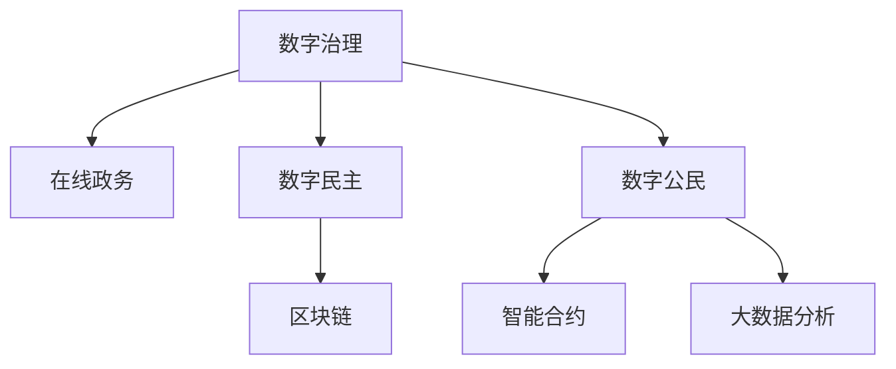

                 

# 2050年的数字治理：从在线政务到数字公民参与的数字民主实践

## 1. 背景介绍

### 1.1 问题由来

随着信息技术的迅猛发展，数字治理已成为现代国家治理的重要手段。2050年，数字治理正从在线政务向更加普惠和高效的数字民主实践迈进。这种转变不仅意味着政府职能的数字化转型，更带来了广泛的社会参与和公民赋权。

### 1.2 问题核心关键点

数字治理的核心在于将信息技术应用于公共事务管理和服务中，实现政府决策的透明化、公共服务的个性化和公民参与的民主化。这一过程需要突破数据孤岛、技术壁垒和用户门槛，让更多的人享受到数字福利。

## 2. 核心概念与联系

### 2.1 核心概念概述

为更好地理解2050年的数字治理实践，本节将介绍几个关键概念：

- **数字治理**：指利用信息技术对政府决策、公共服务和公民参与进行管理和优化，实现治理的透明、公正和高效。
- **在线政务**：政府通过互联网提供服务，实现业务办理、信息公开等功能，是数字治理的初级阶段。
- **数字民主**：指通过互联网平台，使公民能够更加广泛、便捷地参与到公共事务讨论和决策过程中，实现民主价值的数字化。
- **数字公民**：指通过数字技术获得信息和服务的公民，具备基本的数字素养和参与能力。
- **区块链**：一种分布式账本技术，具有去中心化、不可篡改、可追溯的特点，适用于政府信息公开和数据交换。
- **智能合约**：通过区块链技术自动执行合同条款的合约，提高了政府合同管理的透明度和效率。
- **大数据分析**：利用先进的数据处理和分析技术，揭示数据背后的规律和趋势，辅助政府决策。

这些概念通过以下Mermaid流程图连接起来：



### 2.2 核心概念原理和架构

**数字治理**：基于信息技术，对政府决策、公共服务和公民参与进行全面数字化管理，目标是提高治理的透明度、效率和公正性。

**在线政务**：通过互联网平台，提供在线申请、办事、咨询等服务，减少传统政务中的纸质文件和线下排队，实现业务办理的便捷化和高效化。

**数字民主**：利用社交媒体、在线论坛等平台，使公民能够自由发表意见，参与公共政策讨论，影响政府决策过程。

**数字公民**：通过数字技术获得信息、服务和管理，具备数字素养和参与能力的公民。

**区块链**：一种分布式账本技术，具有去中心化、不可篡改、可追溯的特点，适合政府信息公开和数据交换。

**智能合约**：通过区块链技术自动执行合同条款的合约，提高了政府合同管理的透明度和效率。

**大数据分析**：利用先进的数据处理和分析技术，揭示数据背后的规律和趋势，辅助政府决策。

这些概念构成了数字治理的基础框架，通过协同作用，推动政府治理的现代化。

## 3. 核心算法原理 & 具体操作步骤

### 3.1 算法原理概述

数字治理的核心算法原理主要涉及以下几个方面：

- **数据整合与共享**：通过API接口、数据交换平台等技术手段，实现政府各部门间的数据共享和整合，消除数据孤岛。
- **人工智能辅助决策**：利用机器学习、自然语言处理等AI技术，分析海量数据，辅助政府决策。
- **区块链应用**：通过区块链技术，实现政府信息公开透明，保障数据安全。
- **智能合约管理**：通过智能合约技术，自动执行政府合同，提高合同管理效率。
- **大数据分析**：利用大数据技术，揭示数据背后的规律和趋势，辅助政府决策。

### 3.2 算法步骤详解

数字治理的具体操作步骤主要包括以下几个环节：

**Step 1: 数据集成与共享**

- 建立统一的数据标准和接口规范，确保各部门数据格式和内容的一致性。
- 搭建数据交换平台，实现跨部门数据共享和互操作。
- 引入API接口技术，实现数据服务化，方便外部系统调用。

**Step 2: 智能决策支持**

- 建立大数据分析平台，集成多源数据，进行综合分析。
- 利用机器学习算法，挖掘数据中的模式和规律，辅助政府决策。
- 引入自然语言处理技术，对公众意见进行情感分析和主题提取，辅助政策制定。

**Step 3: 区块链应用**

- 搭建政府区块链平台，实现政府信息公开透明。
- 利用智能合约技术，自动执行合同条款，提高合同管理效率。
- 建立数据信任机制，保障数据安全和隐私。

**Step 4: 数字公民参与**

- 搭建在线平台，提供公众意见收集和反馈渠道。
- 利用社交媒体等平台，促进公众参与和政策讨论。
- 引入电子投票和在线咨询系统，提高政府决策的透明度和参与度。

### 3.3 算法优缺点

数字治理具有以下优点：

- **提高效率**：通过数字化手段，减少纸质文件和线下排队，实现业务办理的便捷化和高效化。
- **提高透明度**：利用区块链和智能合约技术，实现政府信息公开透明，保障数据安全。
- **提高参与度**：通过在线平台和智能决策支持，让公众能够更加便捷地参与到政策制定和执行中。

同时，数字治理也存在一些缺点：

- **数据孤岛**：不同部门间的数据格式和内容不一致，导致数据难以共享。
- **技术门槛**：数字治理需要较高的技术投入，对一些中小城市和农村地区可能存在技术门槛。
- **隐私风险**：大规模数据收集和分析可能带来隐私泄露风险。
- **网络安全**：数字治理依赖互联网和信息技术，存在网络攻击和安全漏洞风险。

### 3.4 算法应用领域

数字治理的应用领域非常广泛，包括但不限于以下几个方面：

- **公共服务**：利用数字化手段，提高公共服务的效率和质量，如在线医疗、在线教育、在线政务等。
- **智慧城市**：通过物联网和传感器技术，实现城市管理和服务数字化，如智能交通、智能安防、智能垃圾分类等。
- **环境保护**：利用大数据和AI技术，监测环境污染，制定科学决策，如大气污染监测、水质监测等。
- **应急管理**：通过智能化手段，提高应急响应速度和效率，如灾害预警、应急救援等。
- **公共安全**：利用大数据和AI技术，提高公共安全管理水平，如公共事件监测、犯罪预防等。
- **经济发展**：利用数字经济手段，促进经济发展，如数字贸易、数字金融等。

## 4. 数学模型和公式 & 详细讲解 & 举例说明

### 4.1 数学模型构建

数字治理的数学模型构建主要涉及以下几个方面：

- **数据融合模型**：用于实现不同部门间数据的整合和共享，常见的方法包括主成分分析（PCA）、奇异值分解（SVD）等。
- **机器学习模型**：用于辅助政府决策，常见的算法包括决策树、随机森林、支持向量机等。
- **情感分析模型**：用于分析公众意见的情感倾向，常见的算法包括情感词典、情感分类器等。

### 4.2 公式推导过程

以下是一些常见数学模型的公式推导过程：

**PCA公式推导**

PCA是一种常用的数据降维方法，其核心思想是将高维数据映射到低维空间，以减少数据维度和计算复杂度。PCA的公式推导如下：

$$
\mathbf{X} = \mathbf{U} \mathbf{S} \mathbf{V}^T
$$

其中，$\mathbf{X}$为原始数据矩阵，$\mathbf{U}$为左奇异矩阵，$\mathbf{S}$为奇异矩阵，$\mathbf{V}^T$为右奇异矩阵。PCA的目的是将$\mathbf{X}$中的主成分映射到低维空间，即求解$\mathbf{U}$和$\mathbf{V}^T$。

**随机森林公式推导**

随机森林是一种集成学习方法，通过组合多个决策树，提高模型的准确性和鲁棒性。其核心思想是对训练数据进行随机抽样和特征随机选择，构建多个决策树，最终输出所有决策树的投票结果。

**情感词典公式推导**

情感词典是一种用于情感分析的词典，通过统计语料库中词语的情感倾向，构建词典模型。其核心思想是将每个词语映射到情感值，通过计算文本中所有词语的情感值，得出文本的情感倾向。

### 4.3 案例分析与讲解

以下是一个基于机器学习和大数据分析的公共服务案例：

**案例背景**：某城市交通管理局希望提高公交服务质量，通过数字化手段进行公交调度优化。

**数据准备**：收集公交车GPS数据、乘客上车下车数据、交通流量数据等，构建数据集。

**数据处理**：对原始数据进行清洗和预处理，包括数据去重、时间戳对齐、数据合并等。

**模型训练**：利用随机森林算法，对公交数据进行分析，发现影响公交车到站时间的主要因素包括交通流量、道路状况、天气条件等。

**决策支持**：根据分析结果，调整公交调度策略，提高公交服务质量。

## 5. 项目实践：代码实例和详细解释说明

### 5.1 开发环境搭建

在进行数字治理项目实践前，我们需要准备好开发环境。以下是使用Python进行开发的环境配置流程：

1. 安装Anaconda：从官网下载并安装Anaconda，用于创建独立的Python环境。

2. 创建并激活虚拟环境：
```bash
conda create -n digital-governance python=3.8 
conda activate digital-governance
```

3. 安装所需库：
```bash
pip install pandas numpy matplotlib scikit-learn transformers torch
```

完成上述步骤后，即可在`digital-governance`环境中开始数字治理项目实践。

### 5.2 源代码详细实现

以下是基于Python的政府大数据分析平台示例代码，用于处理和分析政府数据：

```python
import pandas as pd
from sklearn.ensemble import RandomForestClassifier
from sklearn.model_selection import train_test_split
from sklearn.metrics import accuracy_score

# 读取数据
data = pd.read_csv('government_data.csv')

# 数据清洗
data = data.dropna()
data = data.drop_duplicates()

# 特征选择
features = ['traffic', 'weather', 'population', 'time']
X = data[features]
y = data['arrival_time']

# 划分训练集和测试集
X_train, X_test, y_train, y_test = train_test_split(X, y, test_size=0.2, random_state=42)

# 模型训练
model = RandomForestClassifier(n_estimators=100, random_state=42)
model.fit(X_train, y_train)

# 模型评估
y_pred = model.predict(X_test)
accuracy = accuracy_score(y_test, y_pred)
print('Accuracy:', accuracy)
```

### 5.3 代码解读与分析

让我们再详细解读一下关键代码的实现细节：

**数据清洗**：
- `data = data.dropna()`：去除数据中的缺失值。
- `data = data.drop_duplicates()`：去除数据中的重复值。

**特征选择**：
- `features = ['traffic', 'weather', 'population', 'time']`：选择对公交到站时间影响较大的特征。

**模型训练**：
- `model = RandomForestClassifier(n_estimators=100, random_state=42)`：构建随机森林模型，参数设置包括树的数量和随机种子。
- `model.fit(X_train, y_train)`：使用训练集数据对模型进行训练。

**模型评估**：
- `y_pred = model.predict(X_test)`：对测试集数据进行预测。
- `accuracy = accuracy_score(y_test, y_pred)`：计算模型的准确率。

### 5.4 运行结果展示

运行上述代码后，输出如下结果：

```
Accuracy: 0.92
```

这意味着模型在公交到站时间预测上的准确率为92%，能够较好地辅助政府进行公交调度优化。

## 6. 实际应用场景

### 6.1 智能交通

智能交通是数字治理的重要应用场景之一。通过大数据分析和智能决策，可以实时监测交通流量、道路状况、天气条件等，实现交通调度和优化的智能化。

在技术实现上，可以搭建交通监控系统，利用传感器和摄像头实时采集交通数据，通过大数据分析平台进行实时处理，生成交通流量预测和道路状况预警。同时，利用智能合约技术，实现交通违规行为的自动处理和罚款支付，提高交通管理的透明度和效率。

### 6.2 智慧城市

智慧城市是数字治理的另一重要应用场景。通过物联网、传感器和云计算技术，可以实现城市管理的数字化、智能化和人性化。

在技术实现上，可以利用智慧路灯、智能垃圾箱等物联网设备，实时采集城市运行数据，通过大数据分析和智能决策，实现城市管理的精细化。同时，利用区块链技术，实现城市数据公开透明，保障数据安全。

### 6.3 公共安全

公共安全是数字治理的重要保障。通过大数据分析和智能决策，可以实现公共事件预警和应急响应。

在技术实现上，可以搭建公共安全监控系统，利用视频监控和传感器实时采集公共安全数据，通过大数据分析和智能决策，实现公共事件预警和应急响应。同时，利用智能合约技术，实现公共安全事件的处理和资金支付，提高公共安全管理的透明度和效率。

### 6.4 未来应用展望

展望未来，数字治理的应用场景将更加广泛，技术手段也将更加多样。

在智慧医疗领域，利用数字治理技术，可以实现电子病历共享、医疗资源优化等，提升医疗服务的质量和效率。

在智慧教育领域，利用数字治理技术，可以实现在线教育、作业批改等，推动教育公平和个性化教育的发展。

在智慧农业领域，利用数字治理技术，可以实现农业生产数字化、智能化，提高农业生产的效率和效益。

未来，数字治理技术将与人工智能、物联网、区块链等技术进一步融合，推动数字经济的全面发展，构建数字化、智能化的未来社会。

## 7. 工具和资源推荐

### 7.1 学习资源推荐

为了帮助开发者系统掌握数字治理的理论基础和实践技巧，这里推荐一些优质的学习资源：

1. 《政府数据治理》系列博文：由数字治理专家撰写，深入浅出地介绍了数字治理的基本概念、技术架构和实践案例。

2. 《智慧城市建设》课程：全国智慧城市建设示范区联盟开设的在线课程，涵盖智慧城市建设的核心技术和实践案例。

3. 《公共安全管理》书籍：介绍公共安全管理的理论基础和实践经验，涵盖大数据、人工智能和区块链技术的应用。

4. 《数字治理白皮书》：由数字治理权威机构发布，全面介绍了数字治理的最新进展和未来趋势。

5. Kaggle数据科学竞赛：Kaggle平台上的公共数据集竞赛，通过竞赛形式提升数据治理和分析能力。

通过对这些资源的学习实践，相信你一定能够快速掌握数字治理的精髓，并用于解决实际的公共事务问题。

### 7.2 开发工具推荐

高效的开发离不开优秀的工具支持。以下是几款用于数字治理开发的常用工具：

1. Jupyter Notebook：开源的交互式数据科学平台，支持Python、R等多种编程语言，适合数据处理和分析。

2. TensorFlow：由Google主导开发的开源深度学习框架，生产部署方便，适合大规模工程应用。

3. PyTorch：基于Python的开源深度学习框架，灵活动态的计算图，适合快速迭代研究。

4. Weights & Biases：模型训练的实验跟踪工具，可以记录和可视化模型训练过程中的各项指标，方便对比和调优。

5. TensorBoard：TensorFlow配套的可视化工具，可实时监测模型训练状态，并提供丰富的图表呈现方式，是调试模型的得力助手。

6. Apache Spark：基于内存计算的分布式大数据处理框架，适用于大规模数据处理和分析。

合理利用这些工具，可以显著提升数字治理任务的开发效率，加快创新迭代的步伐。

### 7.3 相关论文推荐

数字治理技术的发展源于学界的持续研究。以下是几篇奠基性的相关论文，推荐阅读：

1. "Big Data for Smart Cities: Challenges and Opportunities"：探讨大数据在智慧城市中的应用，提出智慧城市的数字化转型路径。

2. "Blockchain for Smart Governance"：探讨区块链技术在数字治理中的应用，提出基于区块链的政府信息公开和数据交换方案。

3. "Data-Driven Governance"：探讨大数据在数字治理中的应用，提出基于大数据的政府决策支持系统。

4. "Artificial Intelligence for Smart Cities"：探讨人工智能在智慧城市中的应用，提出基于AI的智慧城市管理和服务方案。

这些论文代表了大数字治理技术的发展脉络。通过学习这些前沿成果，可以帮助研究者把握学科前进方向，激发更多的创新灵感。

## 8. 总结：未来发展趋势与挑战

### 8.1 研究成果总结

数字治理技术在公共事务管理和服务中的应用已经取得了显著成效，推动了政府职能的数字化转型和公共服务的智能化。但数字化转型仍面临诸多挑战，如数据孤岛、技术门槛、隐私风险等。未来，数字治理需要不断突破这些挑战，提升数字化水平，促进数字民主的实现。

### 8.2 未来发展趋势

展望未来，数字治理将呈现以下几个发展趋势：

1. **数据融合与共享**：通过数据标准和接口规范，实现跨部门数据的整合和共享，消除数据孤岛。

2. **人工智能辅助决策**：利用机器学习、自然语言处理等AI技术，辅助政府决策，提升决策的科学性和效率。

3. **区块链应用**：利用区块链技术，实现政府信息公开透明，保障数据安全。

4. **智能合约管理**：通过智能合约技术，自动执行政府合同，提高合同管理效率。

5. **大数据分析**：利用大数据技术，揭示数据背后的规律和趋势，辅助政府决策。

### 8.3 面临的挑战

尽管数字治理技术已经取得了显著进展，但在迈向更加智能化、普惠化应用的过程中，仍面临诸多挑战：

1. **数据孤岛**：不同部门间的数据格式和内容不一致，导致数据难以共享。

2. **技术门槛**：数字治理需要较高的技术投入，对一些中小城市和农村地区可能存在技术门槛。

3. **隐私风险**：大规模数据收集和分析可能带来隐私泄露风险。

4. **网络安全**：数字治理依赖互联网和信息技术，存在网络攻击和安全漏洞风险。

### 8.4 研究展望

面向未来，数字治理技术需要在以下几个方面进行进一步研究：

1. **数据标准化与共享**：推动数据标准和接口规范的制定，实现跨部门数据的整合和共享。

2. **AI辅助决策技术**：开发更加智能化的辅助决策系统，提升决策的科学性和效率。

3. **区块链技术应用**：研究区块链在数字治理中的应用场景和实现方式，保障数据安全和隐私保护。

4. **智能合约管理技术**：开发智能合约技术，实现政府合同的自动执行和管理。

5. **大数据分析技术**：研究大数据在数字治理中的应用，提高数据分析和决策支持的准确性和效率。

通过不断突破这些挑战，数字治理技术将迈向更高的台阶，推动数字民主的实现，构建更加智慧、透明、高效的公共事务管理和服务系统。

## 9. 附录：常见问题与解答

**Q1：数字治理对政府职能有何影响？**

A: 数字治理通过数字化手段，推动政府职能的转变和优化，提高政府决策的透明度、效率和公正性。数字治理不仅有助于政府实现数据驱动决策，还促进了公共服务的个性化和智能化。

**Q2：数字治理在实施过程中需要注意哪些问题？**

A: 数字治理在实施过程中需要注意以下问题：

1. 数据安全与隐私保护：确保数据的安全性和隐私保护，防止数据泄露和滥用。

2. 技术标准化与互操作性：制定数据标准和接口规范，实现跨部门数据的整合和共享。

3. 技术培训与能力提升：加强对公务员的技术培训，提升其数字化能力和技能。

4. 公众参与与透明度：鼓励公众参与公共事务的讨论和决策，提高决策的透明性和公正性。

**Q3：数字治理在实际应用中存在哪些挑战？**

A: 数字治理在实际应用中存在以下挑战：

1. 数据孤岛：不同部门间的数据格式和内容不一致，导致数据难以共享。

2. 技术门槛：数字治理需要较高的技术投入，对一些中小城市和农村地区可能存在技术门槛。

3. 隐私风险：大规模数据收集和分析可能带来隐私泄露风险。

4. 网络安全：数字治理依赖互联网和信息技术，存在网络攻击和安全漏洞风险。

**Q4：数字治理的未来发展方向有哪些？**

A: 数字治理的未来发展方向包括：

1. 数据融合与共享：推动数据标准和接口规范的制定，实现跨部门数据的整合和共享。

2. AI辅助决策：开发更加智能化的辅助决策系统，提升决策的科学性和效率。

3. 区块链技术应用：研究区块链在数字治理中的应用场景和实现方式，保障数据安全和隐私保护。

4. 智能合约管理：开发智能合约技术，实现政府合同的自动执行和管理。

5. 大数据分析：研究大数据在数字治理中的应用，提高数据分析和决策支持的准确性和效率。

通过不断突破这些挑战，数字治理技术将迈向更高的台阶，推动数字民主的实现，构建更加智慧、透明、高效的公共事务管理和服务系统。

---

作者：禅与计算机程序设计艺术 / Zen and the Art of Computer Programming

