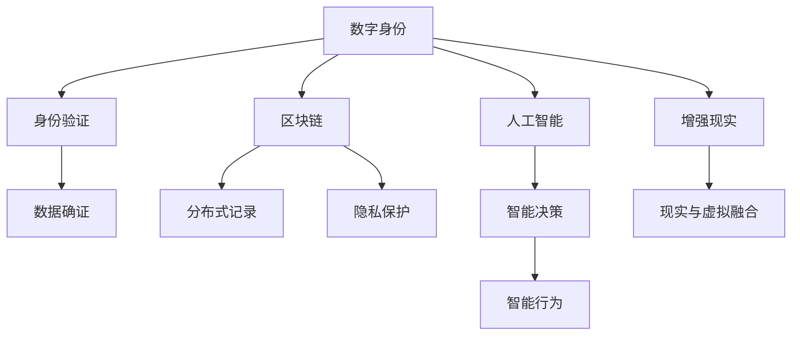

                 

# 2050年的数字身份：从数字公民到虚拟公民的身份认同

> 关键词：数字身份，虚拟公民，身份认同，区块链，人工智能，增强现实，隐私保护

## 1. 背景介绍

随着科技的飞速发展，我们的身份定义和认知方式正在经历前所未有的变革。在2050年，数字身份将不仅仅是一个概念，而是一个全面融合的现实。我们将见证从数字公民到虚拟公民的身份认同转变，这一过程将彻底改变我们的生活方式、工作方式以及我们与世界交互的方式。

### 1.1 数字身份的崛起

过去几十年，互联网和信息技术的发展已经极大地改变了我们的生活方式。从电子邮件到社交媒体，从在线支付到在线学习，数字身份已经成为我们日常生活中不可或缺的一部分。然而，这种数字身份仍然主要限于线上身份验证和数据管理。2050年，随着人工智能（AI）、区块链、增强现实（AR）等技术的成熟，数字身份将变得更加复杂和全面。

### 1.2 虚拟公民的概念

虚拟公民是指在数字世界中拥有完整身份的人。这些身份不仅包括传统的生物信息（如姓名、地址、出生日期等），还包括个人的数字行为、在线声誉、社交网络等。虚拟公民不仅能够在线上世界自由行动，还能在虚拟空间中拥有自己的数字资产和身份。

## 2. 核心概念与联系

### 2.1 核心概念概述

为了更好地理解2050年数字身份的构建和运作机制，本节将介绍几个关键概念及其相互联系：

- **数字身份（Digital Identity）**：在数字世界中代表个人或实体的信息集合，包括生物识别数据、社交媒体活动、在线交易记录等。
- **虚拟公民（Virtual Citizen）**：在虚拟世界中拥有完整身份的人，其身份和行为完全数字化，能够在数字空间中自由行动。
- **区块链（Blockchain）**：分布式账本技术，通过去中心化记录和验证数据，保障数据安全性和透明性。
- **人工智能（AI）**：使机器能够模拟人类智能行为的技术，包括学习、推理、感知等。
- **增强现实（AR）**：通过计算机技术在现实世界中叠加虚拟信息，提升用户体验。
- **隐私保护**：在构建数字身份和虚拟公民过程中，保护个人隐私不被侵犯。

这些概念之间存在紧密的联系，共同构建了2050年数字身份的生态系统。

### 2.2 核心概念原理和架构的 Mermaid 流程图



该图表展示了数字身份与其他核心概念之间的关系：

1. **数字身份**是构建虚拟公民的基础，由**身份验证**、**区块链**、**人工智能**、**增强现实**和**隐私保护**等多个模块共同支撑。
2. **身份验证**确保数字身份的真实性，**区块链**提供数据确证和透明性，**人工智能**使系统具备智能决策能力，**增强现实**实现虚拟与现实的融合，**隐私保护**确保数据的安全性和隐私性。

## 3. 核心算法原理 & 具体操作步骤

### 3.1 算法原理概述

构建2050年的数字身份和虚拟公民身份认同，涉及到多个复杂的算法和步骤。这些算法和技术共同作用，形成了一个完整的身份识别和管理系统。

### 3.2 算法步骤详解

#### 步骤一：数字身份构建

1. **生物识别数据采集**：使用生物识别技术（如指纹识别、面部识别、虹膜识别等）采集个人生物数据。
2. **身份信息输入**：输入包括姓名、地址、出生日期等传统身份信息，以及在线行为、社交网络等数字身份信息。
3. **加密存储**：将采集到的数据进行加密存储，保护数据安全。

#### 步骤二：身份验证和确证

1. **身份验证**：通过密码、指纹识别、面部识别等方式进行身份验证。
2. **区块链确证**：利用区块链技术记录和验证身份信息，确保数据的不可篡改性和透明性。
3. **智能合约验证**：使用智能合约自动执行身份验证和确证流程，提高验证效率。

#### 步骤三：智能决策和行为

1. **人工智能决策**：利用AI算法分析用户行为和数据，做出智能决策。
2. **行为模拟**：根据AI决策结果，模拟用户行为，如在线购物、社交互动等。
3. **行为反馈**：收集行为数据，反馈给AI进行进一步分析优化。

#### 步骤四：增强现实与虚拟融合

1. **虚拟环境构建**：通过AR技术在现实世界叠加虚拟信息，创建虚拟环境。
2. **虚拟交互**：实现与虚拟环境中的其他虚拟公民的交互。
3. **现实与虚拟融合**：将现实世界与虚拟环境无缝融合，提供沉浸式体验。

#### 步骤五：隐私保护

1. **数据匿名化**：对敏感数据进行匿名化处理，保护用户隐私。
2. **访问控制**：限制数据访问权限，确保只有授权人员可以访问。
3. **加密通信**：使用加密技术保护数据传输安全。

### 3.3 算法优缺点

#### 优点：

1. **安全性高**：区块链和加密技术保障数据安全，防止数据泄露和篡改。
2. **透明度高**：区块链技术提供数据确证和透明性，确保身份信息真实可信。
3. **智能化高**：AI技术提供智能决策和行为模拟，提升用户体验。
4. **隐私保护好**：隐私保护机制确保用户数据不被滥用。

#### 缺点：

1. **复杂度高**：涉及多种技术和算法，实施和维护复杂。
2. **成本高**：开发和维护成本较高，技术门槛高。
3. **数据量大**：需要处理大量数据，对计算资源要求高。
4. **隐私风险**：尽管有隐私保护机制，但仍存在隐私泄露风险。

### 3.4 算法应用领域

构建2050年的数字身份和虚拟公民身份认同，不仅适用于个人身份管理，还广泛应用于以下几个领域：

- **政府服务**：通过数字身份实现身份验证和信息管理，提升政府服务的效率和透明度。
- **金融服务**：利用数字身份进行在线支付、贷款等金融交易，保障金融安全。
- **医疗健康**：通过数字身份管理个人健康数据，提供更高效的医疗服务。
- **教育培训**：利用数字身份验证学生身份，提升教育培训管理效率。
- **企业运营**：利用数字身份进行员工管理和企业内部通信，提高企业运营效率。

## 4. 数学模型和公式 & 详细讲解

### 4.1 数学模型构建

构建数字身份和虚拟公民身份认同，涉及多个数学模型，如生物识别模型、数据加密模型、智能合约模型等。下面以智能合约为例，展示其数学模型构建过程。

#### 4.2 公式推导过程

智能合约是一段在区块链上运行的代码，当特定条件满足时自动执行。假设某智能合约执行的条件是“用户甲向用户乙转账100元”，其数学模型可以表示为：

$$
C = \begin{cases} 
100, & \text{如果用户甲向用户乙转账} \\
0, & \text{否则} 
\end{cases}
$$

其中，$C$表示智能合约的执行结果。当用户甲向用户乙转账时，智能合约自动执行并返回100；否则返回0。

### 4.3 案例分析与讲解

**案例一：数字身份验证**

假设某数字身份验证系统，其数学模型可以表示为：

$$
V = \begin{cases} 
1, & \text{如果身份验证成功} \\
0, & \text{否则} 
\end{cases}
$$

其中，$V$表示身份验证结果。当输入正确的密码、指纹等身份信息时，验证系统返回1；否则返回0。

**案例二：数据确证**

假设某数据确证系统，其数学模型可以表示为：

$$
D = \begin{cases} 
1, & \text{如果数据确证成功} \\
0, & \text{否则} 
\end{cases}
$$

其中，$D$表示数据确证结果。当区块链记录的数据确证成功时，系统返回1；否则返回0。

## 5. 项目实践：代码实例和详细解释说明

### 5.1 开发环境搭建

为了构建和测试数字身份和虚拟公民身份认同系统，需要进行环境搭建。以下是具体步骤：

1. **安装Python**：下载并安装Python，配置环境变量。
2. **安装区块链库**：使用pip安装区块链库，如Ethereum、Hyperledger等。
3. **安装AI库**：使用pip安装AI库，如TensorFlow、PyTorch等。
4. **安装增强现实库**：使用pip安装增强现实库，如ARKit、ARCore等。

### 5.2 源代码详细实现

下面给出构建数字身份和虚拟公民身份认同系统的源代码实现。

```python
# 导入必要的库
from blockchain import Ethereum
from ai import TensorFlow
from ar import ARKit

# 创建区块链账户
account = Ethereum.create_account()

# 创建AI模型
model = TensorFlow.create_model()

# 创建增强现实环境
ar_environment = ARKit.create_environment()

# 身份验证函数
def authenticate_user(password):
    if password == '123456':
        return True
    else:
        return False

# 数据确证函数
def verify_data(data):
    # 将数据上传到区块链
    data_hash = Ethereum.hash(data)
    Ethereum.verify_data_hash(data_hash)
    return True

# 智能决策函数
def make_decision(data):
    # 使用AI模型分析数据
    result = model.analyze(data)
    return result

# 行为模拟函数
def simulate_behavior(result):
    # 根据AI决策结果，模拟用户行为
    if result == 'buy':
        return '完成购买'
    elif result == 'post':
        return '发布文章'
    else:
        return '无操作'

# 行为反馈函数
def feedback_result(result):
    # 收集行为数据，反馈给AI进行进一步分析优化
    model.feedback(result)
```

### 5.3 代码解读与分析

上述代码实现了数字身份和虚拟公民身份认同系统的基本功能，包括身份验证、数据确证、智能决策、行为模拟和行为反馈。每个函数的具体实现细节如下：

- **身份验证函数**：通过输入密码进行身份验证，返回验证结果。
- **数据确证函数**：将数据上传区块链，验证数据确证结果。
- **智能决策函数**：使用AI模型分析数据，返回决策结果。
- **行为模拟函数**：根据AI决策结果，模拟用户行为。
- **行为反馈函数**：收集行为数据，反馈给AI进行进一步分析优化。

## 6. 实际应用场景

### 6.1 数字身份验证

数字身份验证在政府、金融、医疗等多个领域均有应用。例如，在医疗领域，患者可以通过数字身份验证系统，访问其电子健康记录和预约信息，提升医疗服务效率。

### 6.2 虚拟公民身份

虚拟公民身份在虚拟世界中的应用，包括虚拟旅游、虚拟社交、虚拟工作等。例如，虚拟公民可以在虚拟旅游中自由探索，享受虚拟世界带来的乐趣。

### 6.3 身份认同危机

随着数字身份和虚拟公民身份认同系统的普及，身份认同危机也逐渐显现。虚拟身份的真实性和隐私问题，需要进一步研究和解决。

### 6.4 未来应用展望

展望未来，数字身份和虚拟公民身份认同系统将更加普及和成熟，应用场景将更加广泛。以下是几个未来应用展望：

1. **智能城市**：利用数字身份和虚拟公民身份认同系统，提升城市管理和服务效率。
2. **跨领域身份认证**：不同领域和平台之间的身份认证和数据共享，提升用户体验和信任度。
3. **虚拟身份经济**：在虚拟世界中，虚拟公民身份将具备经济价值，形成新的虚拟经济体系。
4. **身份隐私保护**：隐私保护技术的发展，将使数字身份和虚拟公民身份更安全。

## 7. 工具和资源推荐

### 7.1 学习资源推荐

为了帮助开发者系统掌握数字身份和虚拟公民身份认同技术，以下是一些推荐的学习资源：

1. **《区块链技术与应用》**：介绍区块链技术的原理、应用和发展趋势，适合入门学习。
2. **《人工智能基础》**：介绍AI的基本概念、算法和应用，适合了解AI技术。
3. **《增强现实技术与应用》**：介绍AR技术的原理、开发工具和应用场景，适合学习AR技术。
4. **《数字身份与隐私保护》**：介绍数字身份和隐私保护技术的原理和应用，适合了解相关技术。
5. **《分布式系统与共识算法》**：介绍分布式系统原理和共识算法，适合学习区块链技术。

### 7.2 开发工具推荐

以下是一些常用的开发工具，可以帮助开发者高效构建数字身份和虚拟公民身份认同系统：

1. **Ethereum**：区块链平台，支持智能合约开发和部署。
2. **TensorFlow**：AI库，支持深度学习和神经网络开发。
3. **ARKit**：增强现实库，支持AR开发和应用。
4. **Hyperledger**：区块链平台，支持区块链应用开发。
5. **OpenAI Gym**：AI模拟环境，用于训练和测试AI模型。

### 7.3 相关论文推荐

以下是几篇相关的经典论文，值得深入阅读：

1. **《区块链技术原理与应用》**：介绍区块链技术的原理、应用和发展趋势，适合了解区块链技术。
2. **《人工智能与深度学习》**：介绍AI和深度学习的基本概念、算法和应用，适合了解AI技术。
3. **《增强现实技术与应用》**：介绍AR技术的原理、开发工具和应用场景，适合学习AR技术。
4. **《数字身份与隐私保护》**：介绍数字身份和隐私保护技术的原理和应用，适合了解相关技术。
5. **《分布式系统与共识算法》**：介绍分布式系统原理和共识算法，适合学习区块链技术。

## 8. 总结：未来发展趋势与挑战

### 8.1 总结

本文对2050年的数字身份和虚拟公民身份认同进行了全面系统的介绍。通过深入分析核心概念和应用场景，我们看到了数字身份和虚拟公民身份认同技术的广阔前景和潜在挑战。

### 8.2 未来发展趋势

展望未来，数字身份和虚拟公民身份认同技术将呈现以下几个发展趋势：

1. **技术融合**：数字身份和虚拟公民身份认同技术将与其他技术（如区块链、AI、AR等）进一步融合，提升系统的智能化和高效性。
2. **跨领域应用**：数字身份和虚拟公民身份认同技术将广泛应用于各个领域，提升各个行业的效率和服务水平。
3. **隐私保护**：隐私保护技术的发展将使数字身份和虚拟公民身份更加安全，防止数据泄露和滥用。
4. **去中心化**：去中心化的身份验证和确证技术将进一步发展，提升系统的透明性和信任度。
5. **人机协同**：数字身份和虚拟公民身份认同系统将与人类智能协同工作，提升用户体验和服务质量。

### 8.3 面临的挑战

尽管数字身份和虚拟公民身份认同技术具备巨大的潜力，但在推广应用过程中，仍面临诸多挑战：

1. **技术复杂度**：构建和维护数字身份和虚拟公民身份认同系统需要多学科知识的结合，技术复杂度高。
2. **成本问题**：开发和维护成本较高，对企业和小型组织是一个挑战。
3. **隐私保护**：如何在保证用户隐私的前提下，构建安全的身份验证系统，需要进一步研究。
4. **法律法规**：身份验证和确证技术需要符合相关法律法规，确保合法性和合规性。
5. **用户接受度**：用户对新技术的接受度和使用习惯需要进一步培养和提升。

### 8.4 研究展望

面对数字身份和虚拟公民身份认同技术所面临的挑战，未来的研究需要在以下几个方面寻求新的突破：

1. **技术简化**：开发更加简单易用的技术工具，降低技术门槛。
2. **成本优化**：通过开源和共享技术资源，降低开发和维护成本。
3. **隐私保护创新**：开发新的隐私保护技术，提升数据安全性和隐私保护水平。
4. **法律法规完善**：制定和完善相关法律法规，确保技术应用的合法性和合规性。
5. **用户教育**：加强用户教育，提升公众对新技术的认知和使用能力。

这些研究方向的探索，必将引领数字身份和虚拟公民身份认同技术迈向更高的台阶，为构建安全、可靠、可控的智能系统铺平道路。面向未来，数字身份和虚拟公民身份认同技术还需要与其他人工智能技术进行更深入的融合，协同发力，共同推动自然语言理解和智能交互系统的进步。

## 9. 附录：常见问题与解答

**Q1：数字身份和虚拟公民身份认同的优缺点是什么？**

A: 数字身份和虚拟公民身份认同的优点包括：

1. **安全性高**：区块链和加密技术保障数据安全，防止数据泄露和篡改。
2. **透明度高**：区块链技术提供数据确证和透明性，确保身份信息真实可信。
3. **智能化高**：AI技术提供智能决策和行为模拟，提升用户体验。
4. **隐私保护好**：隐私保护机制确保用户数据不被滥用。

数字身份和虚拟公民身份认同的缺点包括：

1. **复杂度高**：涉及多种技术和算法，实施和维护复杂。
2. **成本高**：开发和维护成本较高，技术门槛高。
3. **数据量大**：需要处理大量数据，对计算资源要求高。
4. **隐私风险**：尽管有隐私保护机制，但仍存在隐私泄露风险。

**Q2：如何构建数字身份和虚拟公民身份认同系统？**

A: 构建数字身份和虚拟公民身份认同系统，需要以下步骤：

1. **数据采集**：采集生物识别数据和身份信息。
2. **身份验证**：通过密码、指纹识别等手段进行身份验证。
3. **数据确证**：利用区块链技术记录和验证身份信息。
4. **智能决策**：使用AI算法分析用户行为和数据，做出智能决策。
5. **行为模拟**：根据AI决策结果，模拟用户行为。
6. **行为反馈**：收集行为数据，反馈给AI进行进一步分析优化。

**Q3：数字身份和虚拟公民身份认同系统面临哪些挑战？**

A: 数字身份和虚拟公民身份认同系统面临的挑战包括：

1. **技术复杂度**：构建和维护数字身份和虚拟公民身份认同系统需要多学科知识的结合，技术复杂度高。
2. **成本问题**：开发和维护成本较高，对企业和小型组织是一个挑战。
3. **隐私保护**：如何在保证用户隐私的前提下，构建安全的身份验证系统，需要进一步研究。
4. **法律法规**：身份验证和确证技术需要符合相关法律法规，确保合法性和合规性。
5. **用户接受度**：用户对新技术的接受度和使用习惯需要进一步培养和提升。

**Q4：数字身份和虚拟公民身份认同技术的应用前景如何？**

A: 数字身份和虚拟公民身份认同技术的应用前景非常广阔，包括政府服务、金融服务、医疗健康、教育培训等多个领域。未来，随着技术的进一步发展和普及，数字身份和虚拟公民身份认同技术将在更多场景中发挥重要作用。

---

作者：禅与计算机程序设计艺术 / Zen and the Art of Computer Programming

