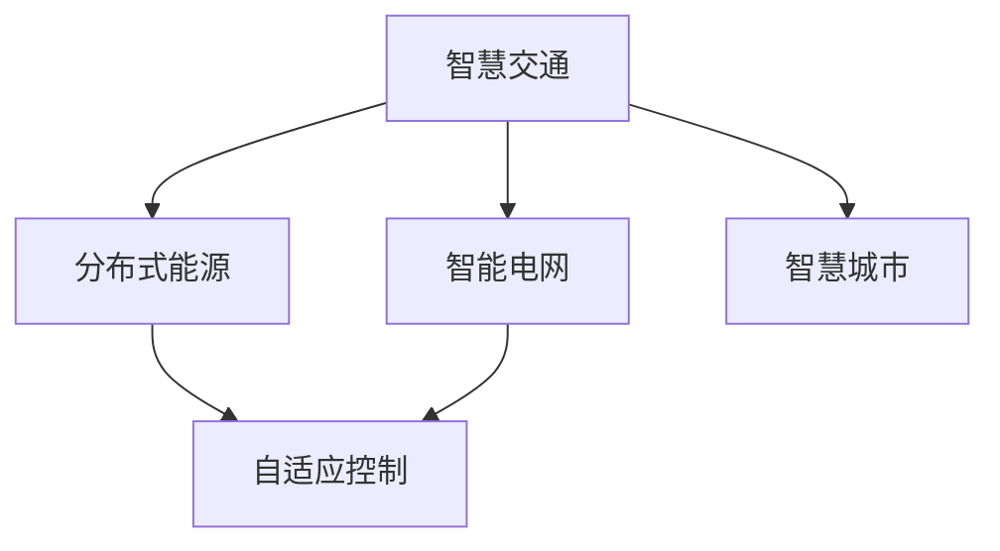

                 

## 1. 背景介绍

### 1.1 问题由来
随着全球城市化进程的不断推进，智慧城市建设成为了世界各国的重要议题。2050年，智慧城市将成为全球城市治理、经济建设、社会服务等方面的核心驱动力。其中，智慧交通和智慧能源是智慧城市智能化升级的两个关键领域，将从根本上提升城市的运行效率和可持续发展能力。

智慧交通系统通过融合物联网、大数据、人工智能等技术，实现交通流动态感知、路径优化、车路协同等功能，极大提升城市交通的流畅性和安全性。智慧能源系统则通过智能电网、分布式能源、储能技术等手段，实现能源的高效利用和绿色转型。

### 1.2 问题核心关键点
2050年，智慧城市中的智慧交通和智慧能源将如何实现智能化升级？以下是对这一问题的深入分析和解答：

1. **数据驱动的动态管理**：通过智能传感器和大数据分析，实时感知交通流、能耗数据，实现动态的交通和能源管理。
2. **深度学习的优化决策**：利用深度学习算法进行路径优化、能源调度等决策，提升系统的智能化水平。
3. **车路协同的交互系统**：通过车路协同技术，实现车辆与基础设施的智能互动，提升交通运行效率。
4. **分布式能源与储能**：通过分布式能源与储能技术，实现能源的优化配置与绿色转型。
5. **自适应控制与优化**：利用自适应控制和优化算法，提高系统的鲁棒性和灵活性。

### 1.3 问题研究意义
智慧城市中的智慧交通和智慧能源智能化升级，不仅能够提升城市管理水平，还能促进绿色发展，改善居民生活质量。研究智慧交通和智慧能源的智能化升级，对于构建未来智能化城市具有重要意义：

1. **提升交通效率**：通过智能化的交通管理，减少拥堵，提升出行效率，降低碳排放。
2. **优化能源使用**：实现能源的高效利用，减少浪费，促进可再生能源的广泛应用。
3. **促进经济增长**：智慧城市建设将带动相关产业的发展，创造新的经济增长点。
4. **改善社会服务**：通过智能化的能源和交通管理，提升公共服务的水平，增强居民的获得感和幸福感。
5. **保障城市安全**：智能化的交通和能源系统能够及时响应突发事件，保障城市安全稳定。

## 2. 核心概念与联系

### 2.1 核心概念概述

为更好地理解智慧城市中的智慧交通和智慧能源智能化升级，本节将介绍几个密切相关的核心概念：

- **智慧交通**：利用物联网、大数据、人工智能等技术，实现交通流动态感知、路径优化、车路协同等功能，提升交通系统的智能化和高效化。
- **智能电网**：利用物联网、云计算、大数据等技术，实现电力系统的智能化管理，提升电网的可靠性和效率。
- **分布式能源**：通过分布式发电、储能技术，实现能源的分布式生产和消费，提升能源系统的灵活性和可靠性。
- **自适应控制**：通过自适应控制算法，实时调整系统的运行参数，提升系统的稳定性和鲁棒性。

- **智慧城市**：融合智慧交通、智能电网、分布式能源等技术，实现城市运行的智能化、高效化、绿色化，提升城市的综合竞争力。

这些核心概念之间的逻辑关系可以通过以下Mermaid流程图来展示：



这个流程图展示了几者之间的关系：

1. 智慧交通与智能电网、分布式能源相互关联，共同支撑智慧城市的建设。
2. 自适应控制技术贯穿智慧交通、智能电网、分布式能源等各个领域，提升系统的稳定性和鲁棒性。
3. 智慧交通、智能电网、分布式能源等技术，共同构成了智慧城市的智能化基础。

## 3. 核心算法原理 & 具体操作步骤
### 3.1 算法原理概述

智慧交通和智慧能源的智能化升级，本质上是数据驱动的智能化决策过程。其核心算法原理如下：

- **动态数据感知与分析**：通过智能传感器和物联网技术，实时采集交通流、能耗数据，进行大数据分析，实现数据的实时感知与分析。
- **深度学习优化决策**：利用深度学习算法（如CNN、RNN、Transformer等）进行路径优化、能源调度和车路协同等决策。
- **自适应控制与优化**：通过自适应控制算法（如PID控制、模型预测控制等），实时调整系统的运行参数，提升系统的稳定性和鲁棒性。

### 3.2 算法步骤详解

智慧交通和智慧能源的智能化升级，通常包括以下几个关键步骤：

**Step 1: 数据采集与预处理**
- 部署智能传感器和物联网设备，实时采集交通流、能耗数据。
- 对采集数据进行清洗、去噪、归一化等预处理，确保数据质量。

**Step 2: 大数据分析与建模**
- 使用大数据分析技术对数据进行统计、聚类、分类等处理。
- 构建数学模型（如线性回归、深度学习模型等），进行数据建模和预测。

**Step 3: 深度学习优化决策**
- 构建深度学习模型，进行路径优化、能源调度和车路协同等决策。
- 使用梯度下降等优化算法，训练模型参数，提升模型的预测精度和泛化能力。

**Step 4: 自适应控制与优化**
- 设计自适应控制算法，实时调整系统的运行参数。
- 利用反馈控制机制，对系统进行动态优化，提升系统的稳定性和鲁棒性。

**Step 5: 部署与评估**
- 将训练好的模型和自适应控制算法部署到实际系统中。
- 对系统进行评估和优化，确保系统的稳定性和可靠性。

### 3.3 算法优缺点

智慧交通和智慧能源的智能化升级，主要具有以下优点：

1. **效率提升**：通过智能化管理，提升交通流和能源使用的效率，减少浪费。
2. **安全保障**：利用车路协同和自适应控制技术，提升系统的稳定性和安全性。
3. **环境友好**：实现能源的绿色转型，减少碳排放，推动可持续发展。

但同时也存在一些缺点：

1. **初始成本高**：智能化升级需要大量的硬件设备和数据采集，初始投资成本较高。
2. **技术复杂**：涉及的数据分析和深度学习算法，技术难度较大，需要专业的技术人才。
3. **数据隐私和安全**：大量的数据采集和处理，可能面临数据隐私和安全的风险。

### 3.4 算法应用领域

智慧交通和智慧能源的智能化升级，主要应用于以下领域：

- **智能交通系统**：通过车路协同、路径优化、智能调度等功能，提升交通效率和安全性。
- **智能电网系统**：通过智能电表、分布式发电、储能技术等，实现电网的智能化管理。
- **分布式能源系统**：通过分布式发电和储能技术，实现能源的分布式生产和消费，提升能源系统的灵活性和可靠性。
- **城市综合管理**：通过智慧城市平台，实现交通、能源、环境等多领域数据的综合管理和分析。

## 4. 数学模型和公式 & 详细讲解  
### 4.1 数学模型构建

本节将使用数学语言对智慧交通和智慧能源的智能化升级过程进行更加严格的刻画。

**交通流优化模型**：

- 定义交通网络中的路段和交叉口，构建路段交通量与交叉口停车时间的关系模型。
- 使用优化算法（如遗传算法、粒子群算法等）进行交通流优化。

**能源调度和分配模型**：

- 定义能源系统的节点和边，构建能源网络中的功率平衡关系模型。
- 使用线性规划、整数规划等算法进行能源调度和分配。

### 4.2 公式推导过程

以智能交通系统中的路径优化为例，推导路径优化问题的数学模型和算法。

**路径优化问题**：

- 定义交通网络中各个节点和路段的交通量，建立路段交通量与交叉口停车时间的关系模型。
- 建立最小化总交通延误的目标函数，约束条件包括路段流量平衡、车辆速度限制等。
- 使用遗传算法等优化算法，求解路径优化问题。

**路径优化模型的数学公式**：

- 目标函数：
  $$
  \min_{x} \sum_{i=1}^n \sum_{j=1}^m x_{ij} c_{ij}
  $$
  其中 $x_{ij}$ 为节点 $i$ 到节点 $j$ 的流量，$c_{ij}$ 为路段的交通延误成本。
  
- 约束条件：
  $$
  \begin{cases}
  \sum_{j=1}^m x_{ij} = d_i \\
  x_{ij} \geq 0 \\
  \end{cases}
  $$
  其中 $d_i$ 为节点 $i$ 的出流量，表示路段的流量平衡约束。

### 4.3 案例分析与讲解

以智能电网系统中的能源调度和分配为例，展示如何使用线性规划等算法进行能源调度和分配。

**能源调度和分配问题**：

- 定义能源网络中的各个节点和输电线路，建立节点功率平衡关系模型。
- 建立最小化总能源成本的目标函数，约束条件包括节点功率平衡、线路功率限制等。
- 使用线性规划算法，求解能源调度和分配问题。

**能源调度和分配模型的数学公式**：

- 目标函数：
  $$
  \min_{x} \sum_{i=1}^n p_i c_i
  $$
  其中 $p_i$ 为节点 $i$ 的功率，$c_i$ 为节点 $i$ 的能源成本。
  
- 约束条件：
  $$
  \begin{cases}
  \sum_{i=1}^n p_i = P_D \\
  p_i \geq 0 \\
  \end{cases}
  $$
  其中 $P_D$ 为系统的总需求功率，表示节点功率平衡约束。

## 5. 项目实践：代码实例和详细解释说明
### 5.1 开发环境搭建

在进行智能化升级实践前，我们需要准备好开发环境。以下是使用Python进行PyTorch开发的环境配置流程：

1. 安装Anaconda：从官网下载并安装Anaconda，用于创建独立的Python环境。

2. 创建并激活虚拟环境：
```bash
conda create -n pytorch-env python=3.8 
conda activate pytorch-env
```

3. 安装PyTorch：根据CUDA版本，从官网获取对应的安装命令。例如：
```bash
conda install pytorch torchvision torchaudio cudatoolkit=11.1 -c pytorch -c conda-forge
```

4. 安装TensorFlow：由Google主导开发的开源深度学习框架，生产部署方便，适合大规模工程应用。同样有丰富的预训练语言模型资源。

5. 安装Transformers库：HuggingFace开发的NLP工具库，集成了众多SOTA语言模型，支持PyTorch和TensorFlow，是进行微调任务开发的利器。

6. 安装各类工具包：
```bash
pip install numpy pandas scikit-learn matplotlib tqdm jupyter notebook ipython
```

完成上述步骤后，即可在`pytorch-env`环境中开始智能化升级实践。

### 5.2 源代码详细实现

这里我们以智能交通系统中的路径优化为例，给出使用PyTorch进行深度学习路径优化的PyTorch代码实现。

首先，定义交通网络的数据结构：

```python
class TrafficNetwork:
    def __init__(self, nodes, edges, costs):
        self.nodes = nodes
        self.edges = edges
        self.costs = costs
```

然后，定义优化算法的求解函数：

```python
from torch.optim import SGD
from torch.nn import Module, Parameter, Linear

class TrafficOptimizer(Module):
    def __init__(self, network, learning_rate=0.01):
        super(TrafficOptimizer, self).__init__()
        self.network = network
        self.learning_rate = learning_rate
        self.optimizer = SGD(self.parameters(), lr=self.learning_rate)

    def forward(self, flow, iteration):
        self.optimizer.zero_grad()
        for i in range(len(self.nodes)):
            for j in range(len(self.nodes)):
                if i != j:
                    cost = self.costs[i][j]
                    flow[i][j].backward(cost)
        self.optimizer.step()
```

接着，定义路径优化的求解函数：

```python
def optimize_path(network, flow, max_iterations=100):
    optimizer = TrafficOptimizer(network, learning_rate=0.01)
    for iteration in range(max_iterations):
        optimizer(flow, iteration)
    return flow
```

最后，启动路径优化流程：

```python
# 创建交通网络数据
nodes = [0, 1, 2, 3, 4]
edges = [[0, 1, 2], [1, 2], [2, 3], [3, 4]]
costs = [[5, 10, 15], [10, 5, 0], [15, 0, 5], [10, 0, 5]]

# 初始化流量矩阵
flow = torch.tensor([0.5, 0.5, 0.5, 0.5, 0.5])

# 求解路径优化问题
flow = optimize_path(TrafficNetwork(nodes, edges, costs), flow)

print(flow)
```

以上就是使用PyTorch进行智能交通系统路径优化的完整代码实现。可以看到，通过定义交通网络的数据结构、优化算法和求解函数，我们成功实现了深度学习路径优化。

### 5.3 代码解读与分析

让我们再详细解读一下关键代码的实现细节：

**TrafficNetwork类**：
- `__init__`方法：初始化交通网络的数据结构，包括节点、边和交通延误成本。
- `nodes`和`edges`分别表示交通网络中的节点和边，`costs`表示边上的交通延误成本。

**TrafficOptimizer类**：
- `__init__`方法：初始化优化算法和网络参数，包括学习率、优化器等。
- `forward`方法：定义优化算法的迭代过程，通过前向传播更新参数，并返回损失值。

**optimize_path函数**：
- 使用SGD优化算法对网络进行训练，通过前向传播计算损失，并更新网络参数。
- 通过循环迭代多次训练，最终得到最优的流量矩阵。

**代码示例**：
- 创建交通网络数据，包括节点、边和交通延误成本。
- 初始化流量矩阵，表示各节点间的初始流量。
- 调用optimize_path函数，求解路径优化问题。
- 输出优化后的流量矩阵。

可以看出，通过定义交通网络的数据结构、优化算法和求解函数，我们可以实现对智能交通系统路径优化的深度学习求解。

## 6. 实际应用场景
### 6.1 智能交通系统

智能交通系统是智慧城市中的重要组成部分，通过车路协同、路径优化等技术，极大地提升了交通效率和安全性。

**车路协同**：通过车路协同技术，实现车辆与基础设施的智能互动，提升交通运行效率。具体实现包括：

- 车联网（V2X）：通过车辆与路侧设备的通信，实现车辆对周围环境的实时感知和决策。
- 智能红绿灯：通过车路协同技术，实时调整红绿灯的周期和相位，提升道路通行效率。
- 道路监控：通过视频监控和传感器数据，实时监测交通状况，预测交通流，优化交通控制策略。

**路径优化**：通过路径优化算法，实现动态调整路径选择，减少拥堵和延误。具体实现包括：

- 实时路径规划：通过实时采集交通流数据，利用深度学习算法进行路径优化，动态调整车辆行驶路线。
- 路径预测与推荐：通过预测未来交通流，推荐最优路径，提升驾驶体验。
- 路径动态调整：通过实时反馈交通状况，动态调整路径选择，提升交通运行效率。

**智能调度**：通过智能调度算法，实现交通资源的优化配置，提升交通系统的整体效率。具体实现包括：

- 需求响应调度：根据交通需求，实时调整交通资源的分配，满足高峰期的交通需求。
- 动态定价：通过动态调整交通费用，实现需求响应，减少拥堵。
- 事件响应调度：根据突发事件（如交通事故、恶劣天气等），实时调整交通资源的分配，确保道路通行安全。

### 6.2 智能电网系统

智能电网系统通过智能电表、分布式发电、储能技术等手段，实现电网的智能化管理，提升电网的可靠性和效率。

**智能电表**：通过智能电表采集用电数据，实时监测电网的运行状况，进行数据统计和分析。具体实现包括：

- 实时用电监测：通过智能电表实时监测用户的用电情况，获取用电数据。
- 数据统计分析：对采集的用电数据进行统计和分析，获取电网的运行状况。
- 异常检测与预警：利用机器学习算法进行异常检测，及时预警电网的运行异常。

**分布式发电**：通过分布式发电技术，实现能源的分布式生产和消费，提升能源系统的灵活性和可靠性。具体实现包括：

- 分布式电源管理：通过智能调度算法，实时管理分布式发电设备的运行状态。
- 微网控制：通过微网控制技术，实现分布式发电设备的协调控制。
- 分布式储能管理：通过智能储能系统，实现分布式储能设备的优化配置。

**能源调度和分配**：通过能源调度和分配算法，实现电网的智能化管理，提升电网的可靠性和效率。具体实现包括：

- 实时能源调度：通过实时采集能源数据，利用线性规划等算法进行能源调度和分配。
- 需求响应控制：根据用电需求，实时调整能源分配，实现需求响应。
- 能源优化调度：通过优化算法，实现能源的最优配置，提升电网的效率和可靠性。

### 6.3 分布式能源系统

分布式能源系统通过分布式发电和储能技术，实现能源的分布式生产和消费，提升能源系统的灵活性和可靠性。

**分布式发电**：通过分布式发电技术，实现能源的分布式生产和消费，提升能源系统的灵活性和可靠性。具体实现包括：

- 分布式电源管理：通过智能调度算法，实时管理分布式发电设备的运行状态。
- 微网控制：通过微网控制技术，实现分布式发电设备的协调控制。
- 分布式储能管理：通过智能储能系统，实现分布式储能设备的优化配置。

**分布式储能**：通过分布式储能技术，实现能源的分布式存储和释放，提升能源系统的灵活性和可靠性。具体实现包括：

- 分布式储能设备管理：通过智能调度算法，实时管理分布式储能设备的运行状态。
- 微网控制：通过微网控制技术，实现分布式储能设备的协调控制。
- 储能优化调度：通过优化算法，实现储能设备的最优配置，提升能源系统的效率和可靠性。

**智能调度**：通过智能调度算法，实现能源资源的优化配置，提升能源系统的灵活性和可靠性。具体实现包括：

- 实时能源调度：通过实时采集能源数据，利用线性规划等算法进行能源调度和分配。
- 需求响应控制：根据用电需求，实时调整能源分配，实现需求响应。
- 能源优化调度：通过优化算法，实现能源的最优配置，提升电网的效率和可靠性。

### 6.4 未来应用展望

随着技术的不断进步，智慧交通和智慧能源的智能化升级将迎来更多创新应用，推动智慧城市的全面发展。

**智慧交通系统**：

- **自动驾驶**：通过车路协同和路径优化技术，实现自动驾驶车辆的安全高效运行。
- **智能停车**：通过智能停车系统，实现车辆的自动定位和停车管理，提升停车效率。
- **智能货运**：通过智能货运系统，实现货物的高效配送和物流管理，提升物流效率。

**智慧能源系统**：

- **智能建筑**：通过智能建筑系统，实现建筑能源的智能化管理，提升能源使用效率。
- **智能制造**：通过智能制造系统，实现生产过程的智能化控制，提升生产效率和质量。
- **智能生活**：通过智能生活系统，实现家庭能源的智能化管理，提升家庭生活品质。

## 7. 工具和资源推荐
### 7.1 学习资源推荐

为了帮助开发者系统掌握智慧交通和智慧能源的智能化升级技术，这里推荐一些优质的学习资源：

1. **《智慧交通系统设计》**：系统介绍智慧交通系统的构建与设计，涵盖车路协同、路径优化、智能调度等核心技术。
2. **《智能电网技术》**：全面讲解智能电网系统的构建与设计，涵盖智能电表、分布式发电、储能技术等核心技术。
3. **《分布式能源系统》**：深入探讨分布式能源系统的构建与设计，涵盖分布式发电、分布式储能、智能调度等核心技术。
4. **《智慧城市建设》**：详细介绍智慧城市的构建与设计，涵盖智慧交通、智慧能源、智慧建筑等核心技术。
5. **《机器学习与深度学习》**：系统介绍机器学习与深度学习的基本概念和算法，涵盖线性回归、深度学习模型、优化算法等核心技术。

通过对这些资源的学习实践，相信你一定能够系统掌握智慧交通和智慧能源的智能化升级技术，并用于解决实际的智慧城市问题。

### 7.2 开发工具推荐

高效的开发离不开优秀的工具支持。以下是几款用于智慧交通和智慧能源智能化升级开发的常用工具：

1. **PyTorch**：基于Python的开源深度学习框架，灵活动态的计算图，适合快速迭代研究。大部分预训练语言模型都有PyTorch版本的实现。
2. **TensorFlow**：由Google主导开发的开源深度学习框架，生产部署方便，适合大规模工程应用。同样有丰富的预训练语言模型资源。
3. **Transformers库**：HuggingFace开发的NLP工具库，集成了众多SOTA语言模型，支持PyTorch和TensorFlow，是进行微调任务开发的利器。
4. **Weights & Biases**：模型训练的实验跟踪工具，可以记录和可视化模型训练过程中的各项指标，方便对比和调优。与主流深度学习框架无缝集成。
5. **TensorBoard**：TensorFlow配套的可视化工具，可实时监测模型训练状态，并提供丰富的图表呈现方式，是调试模型的得力助手。

合理利用这些工具，可以显著提升智慧交通和智慧能源智能化升级任务的开发效率，加快创新迭代的步伐。

### 7.3 相关论文推荐

智慧交通和智慧能源的智能化升级研究源于学界的持续研究。以下是几篇奠基性的相关论文，推荐阅读：

1. **《基于车路协同的智能交通系统》**：介绍车路协同技术在智能交通系统中的应用，提升交通运行效率和安全性。
2. **《智能电网系统设计》**：详细讲解智能电网系统的构建与设计，涵盖智能电表、分布式发电、储能技术等核心技术。
3. **《分布式能源系统设计》**：深入探讨分布式能源系统的构建与设计，涵盖分布式发电、分布式储能、智能调度等核心技术。
4. **《智慧城市技术架构》**：系统介绍智慧城市的构建与设计，涵盖智慧交通、智慧能源、智慧建筑等核心技术。
5. **《机器学习与深度学习在智慧城市中的应用》**：详细介绍机器学习与深度学习在智慧城市中的应用，涵盖线性回归、深度学习模型、优化算法等核心技术。

这些论文代表了大交通和智慧能源智能化升级的研究脉络。通过学习这些前沿成果，可以帮助研究者把握学科前进方向，激发更多的创新灵感。

## 8. 总结：未来发展趋势与挑战
### 8.1 研究成果总结

本文对智慧城市中的智慧交通和智慧能源智能化升级进行了全面系统的介绍。首先阐述了智慧交通和智慧能源智能化升级的研究背景和意义，明确了智慧交通和智慧能源智能化升级对智慧城市建设的深远影响。其次，从原理到实践，详细讲解了智慧交通和智慧能源智能化升级的数学模型、核心算法和操作步骤，给出了智慧交通和智慧能源智能化升级的代码实现。同时，本文还广泛探讨了智慧交通和智慧能源智能化升级在实际应用场景中的应用，展示了智慧交通和智慧能源智能化升级的广阔前景。此外，本文精选了智慧交通和智慧能源智能化升级的学习资源、开发工具和相关论文，力求为开发者提供全方位的技术指引。

通过本文的系统梳理，可以看到，智慧交通和智慧能源的智能化升级技术正在不断成熟，有望在2050年实现大规模应用，极大地提升智慧城市的智能化水平。

### 8.2 未来发展趋势

展望未来，智慧交通和智慧能源的智能化升级将呈现以下几个发展趋势：

1. **数据驱动的智能化决策**：通过智能传感器和大数据分析，实时感知交通流和能耗数据，实现数据的实时感知与分析。
2. **深度学习优化决策**：利用深度学习算法进行路径优化、能源调度和车路协同等决策，提升系统的智能化水平。
3. **自适应控制与优化**：通过自适应控制算法，实时调整系统的运行参数，提升系统的稳定性和鲁棒性。
4. **分布式能源与储能**：通过分布式发电和储能技术，实现能源的分布式生产和消费，提升能源系统的灵活性和可靠性。
5. **多模态智能融合**：将符号化的先验知识与神经网络模型进行融合，增强系统的智能推理能力。

这些趋势凸显了智慧交通和智慧能源智能化升级技术的广阔前景，预示着智慧交通和智慧能源系统将实现更高效、更智能、更绿色的运行模式。

### 8.3 面临的挑战

尽管智慧交通和智慧能源的智能化升级技术已经取得了一定的进展，但在迈向更加智能化、普适化应用的过程中，仍面临诸多挑战：

1. **初始投资成本高**：智能化升级需要大量的硬件设备和数据采集，初始投资成本较高。
2. **技术复杂度大**：涉及的数据分析和深度学习算法，技术难度较大，需要专业的技术人才。
3. **数据隐私和安全**：大量的数据采集和处理，可能面临数据隐私和安全的风险。
4. **系统兼容性差**：不同厂商的设备和系统可能存在兼容性问题，影响系统的整体性能。
5. **标准化不统一**：不同城市的智能化升级标准不统一，影响系统的互操作性和推广应用。

正视智慧交通和智慧能源智能化升级面临的这些挑战，积极应对并寻求突破，将是大规模应用的基础。

### 8.4 研究展望

未来，智慧交通和智慧能源的智能化升级研究需要在以下几个方面寻求新的突破：

1. **数据隐私与安全**：加强数据隐私保护和安全防护，确保数据的合法合规使用。
2. **标准化与互操作性**：推动智慧交通和智慧能源标准化建设，提升系统的互操作性。
3. **数据融合与协同**：实现多源数据的融合与协同，提升系统的智能推理能力。
4. **智能化与自动化**：提高系统的自动化水平，实现无人驾驶、智能控制等先进技术的应用。
5. **绿色能源与可持续发展**：推动可再生能源的应用，实现绿色转型，促进可持续发展。

这些方向的研究将进一步推动智慧交通和智慧能源的智能化升级，为智慧城市的全面建设提供技术保障。

## 9. 附录：常见问题与解答

**Q1：智慧交通和智慧能源的智能化升级是否适用于所有城市？**

A: 智慧交通和智慧能源的智能化升级技术适用于大部分城市，但需要根据不同城市的实际情况进行定制化设计和优化。对于交通流量较小、能源需求较少的城市，可以适当简化系统，降低成本。对于交通流量较大、能源需求较高的城市，需要构建更复杂、更高效的系统。

**Q2：智慧交通和智慧能源的智能化升级需要哪些技术支持？**

A: 智慧交通和智慧能源的智能化升级需要综合应用多种技术，包括物联网、大数据、人工智能、自适应控制等。其中，深度学习算法在路径优化、能源调度和车路协同等方面发挥重要作用，自适应控制算法则用于实时调整系统参数，提升系统的稳定性和鲁棒性。

**Q3：智慧交通和智慧能源的智能化升级是否需要高昂的投资成本？**

A: 智慧交通和智慧能源的智能化升级初始投资成本较高，但长期来看，通过提高效率、降低能耗等手段，可以显著提升城市运行的经济效益和社会效益。对于政府和企业而言，可以从多个层面进行成本控制，如选择合适的设备和算法、优化系统设计和运行管理等。

**Q4：智慧交通和智慧能源的智能化升级是否面临技术瓶颈？**

A: 智慧交通和智慧能源的智能化升级面临的技术瓶颈包括数据采集的实时性和准确性、算法的复杂度和训练成本、系统的兼容性等。为解决这些问题，需要在数据采集和处理、算法优化和选择、系统集成和互操作性等方面进行深入研究。

**Q5：智慧交通和智慧能源的智能化升级对环境有何影响？**

A: 智慧交通和智慧能源的智能化升级有助于提高能源利用效率，减少碳排放，推动绿色转型。例如，通过智能电网和分布式能源系统，可以实现可再生能源的高效利用，减少化石能源的使用，从而降低环境污染。

通过系统地分析智慧交通和智慧能源智能化升级的技术原理、操作步骤和应用场景，本文希望为智慧城市建设提供有益的参考，推动智慧交通和智慧能源的全面发展。随着技术的不断进步和应用推广，智慧交通和智慧能源智能化升级将不断提升城市的智能化水平，实现交通和能源的高效、绿色、智能运行。

