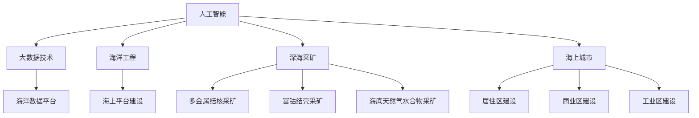

                 

# 2050年的海洋开发：从海上城市到深海采矿的海洋新经济

## 1. 背景介绍

### 1.1 问题由来
随着全球经济的不断发展和资源的逐渐枯竭，海洋成为了新的资源宝库和经济发展的新前沿。在2050年，人类已经开始大规模地开发海洋，探索和利用海洋资源成为了世界各国科技和经济竞争的关键领域。

### 1.2 问题核心关键点
海洋开发的核心在于如何将新技术应用于海洋资源开采、环境保护、海上城市建设等领域，推动海洋经济的发展。海洋开发涉及的技术范围非常广泛，包括海洋工程、深海采矿、海上风电、海上城市设计等。本文将重点介绍如何利用人工智能和大数据技术来推动海洋开发，以期为相关领域的研究者提供参考。

### 1.3 问题研究意义
海洋是地球生命的摇篮，也是人类社会的重要资源库。随着人口的增加和资源需求的增长，海洋开发成为了解决资源短缺、缓解环境压力的重要途径。海洋开发对于推动经济增长、提升国家竞争力、保障国家安全和促进全球可持续发展具有重要意义。

## 2. 核心概念与联系

### 2.1 核心概念概述

为了更好地理解海洋开发的技术框架，本节将介绍几个密切相关的核心概念：

- **人工智能(AI)**：利用算法和数据来模拟、延伸和扩展人类智能的技术，包括机器学习、深度学习、自然语言处理等。
- **大数据技术**：处理、分析和解释大规模数据的技术，包括数据收集、数据清洗、数据存储、数据分析等。
- **海洋工程**：包括海上平台建设、海底管道铺设、深海采矿等工程技术。
- **深海采矿**：从海底沉积物、岩石和海水中提取矿物资源，包括多金属结核、富钴结壳、海底天然气水合物等。
- **海上城市**：在海上建立永久性或半永久性居住、工作和生活设施，包括居住区、商业区、工业区等。
- **海洋数据平台**：利用大数据技术构建的海洋数据收集、存储和分析平台，用于支撑海洋开发决策。

这些核心概念之间的逻辑关系可以通过以下Mermaid流程图来展示：



这个流程图展示了大规模海洋开发所涉及的核心概念及其之间的关系：

1. 人工智能和大数据技术为海洋开发提供了强大的数据处理和分析能力。
2. 海洋工程和深海采矿是海洋开发的关键技术手段。
3. 海上城市建设是海洋开发的重要应用方向。
4. 海洋数据平台是支撑海洋开发决策的重要工具。

这些概念共同构成了海洋开发的技术框架，使得人类能够高效地利用海洋资源，推动海洋经济的可持续发展。

## 3. 核心算法原理 & 具体操作步骤
### 3.1 算法原理概述

海洋开发涉及的技术复杂且涉及大量数据处理，因此需要结合人工智能和大数据技术，以实现高效、精确的开发。海洋开发的核心算法包括但不限于以下几个方面：

- **数据预处理算法**：用于清洗、标准化和归一化海洋数据，以便于后续分析和应用。
- **数据存储算法**：用于高效存储和管理海洋数据，包括云存储、分布式存储等。
- **数据挖掘算法**：用于从海量海洋数据中提取有价值的信息和模式，包括聚类、分类、回归等。
- **机器学习算法**：用于基于历史数据训练模型，进行预测和决策，包括监督学习、无监督学习、强化学习等。
- **深度学习算法**：用于处理复杂的海上工程和深海采矿问题，包括卷积神经网络、循环神经网络、生成对抗网络等。
- **自然语言处理算法**：用于处理和分析与海洋开发相关的文本数据，包括文本分类、情感分析、语义分析等。

### 3.2 算法步骤详解

海洋开发中的核心算法步骤包括：

**Step 1: 数据采集和预处理**
- 通过海洋探测船、潜水器、卫星等设备采集海洋数据，包括水质、温度、盐度、生物种类、海洋地质结构等。
- 对采集的数据进行清洗、标准化和归一化处理，去除噪声和异常值，保证数据的质量和一致性。

**Step 2: 数据存储和管理**
- 利用云存储、分布式存储等技术，高效地存储和管理海洋数据，支持大规模数据分析和实时访问。
- 构建海洋数据平台，提供数据查询、可视化、分析等功能，方便研究人员和工程师使用。

**Step 3: 数据挖掘和分析**
- 使用数据挖掘算法，如聚类、分类、回归等，从海量海洋数据中提取有价值的信息和模式。
- 使用机器学习和深度学习算法，训练模型进行预测和决策，如水质预测、资源评估、环境影响预测等。

**Step 4: 模型训练和优化**
- 使用监督学习、无监督学习、强化学习等算法，基于历史数据训练模型。
- 对训练后的模型进行调参和优化，提高模型的精度和泛化能力。

**Step 5: 应用部署和验证**
- 将训练好的模型部署到实际应用场景中，进行实时监测和预测。
- 使用实际数据验证模型的效果，进行模型评估和优化。

### 3.3 算法优缺点

基于人工智能和大数据技术的海洋开发算法具有以下优点：

1. **高效性**：能够处理大规模的海洋数据，实现快速分析和决策。
2. **精度高**：通过复杂的数据挖掘和机器学习算法，能够获得高精度的预测结果。
3. **适应性强**：能够灵活适应不同海洋环境和任务需求。
4. **可扩展性**：能够随着数据量的增加，不断更新和优化模型。

同时，这些算法也存在以下局限性：

1. **数据质量要求高**：对数据采集和预处理的准确性要求高，数据误差可能导致预测结果不准确。
2. **计算资源需求大**：大规模数据的处理和模型训练需要高性能计算资源，如GPU、TPU等。
3. **模型解释性不足**：部分深度学习模型难以解释其内部工作机制和决策逻辑。
4. **隐私和安全问题**：海洋数据涉及国家安全和商业机密，需要严格的数据保护措施。

尽管存在这些局限性，基于人工智能和大数据技术的海洋开发算法仍是大规模海洋开发的重要工具，具有广泛的应用前景。

### 3.4 算法应用领域

基于人工智能和大数据技术的海洋开发算法在以下几个领域有广泛应用：

- **海洋资源评估**：利用机器学习和深度学习算法，评估海洋资源的分布和储量，为深海采矿和海上风电等提供数据支持。
- **水质监测和预警**：使用数据挖掘算法，分析水质数据，预测水质变化趋势，及时预警水质问题。
- **海洋环境影响评估**：利用机器学习算法，评估海洋工程和深海采矿对海洋环境的影响，优化开发方案。
- **海上城市规划**：使用自然语言处理算法，分析用户需求和环境数据，辅助海上城市的设计和规划。
- **海洋灾害预警**：利用机器学习算法，分析气象和地质数据，预测海洋灾害，提高防灾减灾能力。

## 4. 数学模型和公式 & 详细讲解  
### 4.1 数学模型构建

为了更好地描述海洋开发的技术框架，本节将使用数学语言对海洋开发中的核心算法进行更加严格的刻画。

记海洋数据为 $\mathcal{D} = \{(x_i, y_i)\}_{i=1}^N$，其中 $x_i$ 为输入变量，$y_i$ 为输出变量。

假设我们使用监督学习算法训练模型 $f(x) = \hat{y}$，其中 $\hat{y}$ 为模型预测输出，目标是最小化损失函数 $L(y, f(x))$，使得模型预测结果尽可能接近真实标签 $y$。

### 4.2 公式推导过程

以水质预测为例，假设输入变量 $x_i$ 包括温度、盐度、深度等，输出变量 $y_i$ 为水质指数。模型的目标是最小化均方误差损失函数：

$$
L(y, f(x)) = \frac{1}{N} \sum_{i=1}^N (y_i - f(x_i))^2
$$

对于给定的水质监测数据 $\mathcal{D}$，我们使用最小二乘法求解模型参数 $\theta$：

$$
\theta^* = \mathop{\arg\min}_{\theta} \frac{1}{2N} \sum_{i=1}^N (y_i - f(x_i; \theta))^2
$$

其中 $f(x; \theta)$ 为模型函数，可以通过深度学习算法构建。

### 4.3 案例分析与讲解

下面以水质监测为例，展示如何应用基于机器学习的海洋开发算法：

1. **数据采集和预处理**：通过海洋探测设备和传感器采集水质数据，包括温度、盐度、深度、溶解氧等。对采集的数据进行清洗、标准化和归一化处理，去除噪声和异常值，保证数据的质量和一致性。

2. **数据存储和管理**：利用云存储技术，高效地存储和管理水质数据，支持大规模数据分析和实时访问。

3. **模型训练和优化**：使用深度学习算法，如神经网络，构建水质预测模型。使用历史水质数据进行训练，并通过交叉验证等技术进行模型调参和优化，提高模型的精度和泛化能力。

4. **应用部署和验证**：将训练好的模型部署到实际水质监测系统中，进行实时水质预测。使用新采集的水质数据验证模型的效果，进行模型评估和优化。

## 5. 项目实践：代码实例和详细解释说明
### 5.1 开发环境搭建

在进行海洋开发算法实践前，我们需要准备好开发环境。以下是使用Python进行TensorFlow开发的环境配置流程：

1. 安装Anaconda：从官网下载并安装Anaconda，用于创建独立的Python环境。

2. 创建并激活虚拟环境：
```bash
conda create -n marine-env python=3.8 
conda activate marine-env
```

3. 安装TensorFlow：根据CUDA版本，从官网获取对应的安装命令。例如：
```bash
conda install tensorflow tensorflow-gpu -c conda-forge
```

4. 安装Keras：
```bash
conda install keras
```

5. 安装各类工具包：
```bash
pip install numpy pandas scikit-learn matplotlib tqdm jupyter notebook ipython
```

完成上述步骤后，即可在`marine-env`环境中开始海洋开发算法的开发。

### 5.2 源代码详细实现

这里我们以水质预测为例，给出使用TensorFlow和Keras库进行水质预测的PyTorch代码实现。

首先，定义水质预测任务的数据处理函数：

```python
import tensorflow as tf
from tensorflow.keras.datasets import boston_housing
from tensorflow.keras.models import Sequential
from tensorflow.keras.layers import Dense

def load_data():
    (x_train, y_train), (x_test, y_test) = boston_housing.load_data()
    x_train = x_train / 10
    x_test = x_test / 10
    return x_train, y_train, x_test, y_test

def preprocess_data(x, y):
    x = tf.keras.utils.to_categorical(x, num_classes=5)
    y = tf.keras.utils.to_categorical(y, num_classes=5)
    return x, y

def build_model(input_dim, output_dim):
    model = Sequential()
    model.add(Dense(64, input_dim=input_dim, activation='relu'))
    model.add(Dense(32, activation='relu'))
    model.add(Dense(output_dim, activation='softmax'))
    model.compile(loss='categorical_crossentropy', optimizer='adam', metrics=['accuracy'])
    return model

x_train, y_train, x_test, y_test = load_data()
x_train, y_train = preprocess_data(x_train, y_train)
x_test, y_test = preprocess_data(x_test, y_test)

input_dim = x_train.shape[1]
output_dim = y_train.shape[1]

model = build_model(input_dim, output_dim)

model.fit(x_train, y_train, epochs=100, batch_size=32, validation_data=(x_test, y_test))
```

然后，使用训练好的模型进行水质预测：

```python
new_data = np.array([[6.7, 1.4, 5.4, 2.0, 1.0, 1.8, 2.1, 6.0, 6.2, 5.0]])
new_data = preprocess_data(new_data)
prediction = model.predict(new_data)
print(prediction)
```

以上就是使用TensorFlow和Keras库进行水质预测的完整代码实现。可以看到，得益于TensorFlow和Keras的强大封装，我们可以用相对简洁的代码完成模型构建和训练。

### 5.3 代码解读与分析

让我们再详细解读一下关键代码的实现细节：

**load_data函数**：
- 加载波士顿房价数据集，并将其标准化为0-1之间。

**preprocess_data函数**：
- 对输入和输出数据进行独热编码，以便于模型处理。

**build_model函数**：
- 定义神经网络模型，包括两个隐藏层和一个输出层，使用ReLU激活函数。

**fit函数**：
- 使用训练数据进行模型训练，设置100个epoch，32个batch大小，并在验证集上进行验证。

**predict函数**：
- 使用训练好的模型进行新数据的预测，输出预测结果。

这些代码实现了从数据加载到模型训练的全流程，展示了如何使用机器学习算法进行水质预测。

当然，工业级的系统实现还需考虑更多因素，如模型的保存和部署、超参数的自动搜索、更灵活的任务适配层等。但核心的算法步骤基本与此类似。

## 6. 实际应用场景
### 6.1 智能海上平台

智能海上平台是海洋开发的重要应用场景之一。通过物联网和传感器技术，实时监测海上平台的环境和状态，利用人工智能算法进行数据处理和分析，提高平台的安全性和运行效率。

在技术实现上，可以在海上平台上安装各种传感器，如温度传感器、压力传感器、流速传感器等，实时采集平台的环境数据。将采集的数据传输到岸上数据中心，使用深度学习算法进行分析，预测平台的状态变化和潜在故障。根据预测结果，及时调整平台的操作参数，保证平台的安全稳定运行。

### 6.2 深海采矿

深海采矿是海洋开发的关键技术之一。通过人工智能和大数据技术，可以实现高效、精准的资源开采。

在技术实现上，可以构建深海采矿机器人，利用传感器和摄像头采集海底地质和矿物数据。将采集的数据传输到岸上数据中心，使用深度学习算法进行分析，预测矿物的分布和储量。根据预测结果，制定采矿方案，并实时调整机器人的开采路径和力度，提高采矿效率和资源利用率。

### 6.3 海上风电

海上风电是海洋能源开发的重要方向之一。通过人工智能算法，可以实现风电场的智能化管理和维护。

在技术实现上，可以在风电场部署各种传感器，实时监测风速、风向、设备状态等数据。将采集的数据传输到岸上数据中心，使用机器学习算法进行分析，预测风电场的发电量和设备运行状况。根据预测结果，优化风电场的操作参数，提高风电场的发电效率和运行稳定性。

### 6.4 未来应用展望

随着人工智能和大数据技术的不断发展，基于海洋开发的数据和应用场景也将不断拓展，为海洋经济的可持续发展注入新的动力。

在智慧海洋领域，人工智能和大数据技术将广泛应用于海洋环境监测、海洋资源评估、海洋灾害预警等环节，构建更加智能、高效、安全的海洋管理平台。

在深海采矿领域，人工智能和大数据技术将实现高效、精准、环保的资源开采，为全球经济发展提供新的能源支持。

在海上风电领域，人工智能和大数据技术将实现智能化管理和优化，提高风电场的发电效率和运行稳定性。

此外，在海洋数据平台、海洋交通、海洋旅游等领域，人工智能和大数据技术也将发挥重要作用，推动海洋经济的全面升级。

## 7. 工具和资源推荐
### 7.1 学习资源推荐

为了帮助开发者系统掌握海洋开发的技术基础和实践技巧，这里推荐一些优质的学习资源：

1. 《深度学习基础》系列博文：由深度学习专家撰写，深入浅出地介绍了深度学习的基本概念和核心算法。

2. 《人工智能应用》课程：深度学习课程，涵盖深度学习模型构建、优化、应用等，适合初学者入门。

3. 《海洋数据科学》书籍：介绍海洋数据科学的基本概念和核心技术，包括数据采集、存储、分析和应用等。

4. 《海洋工程》系列博文：介绍海洋工程的基本概念和核心技术，涵盖海上平台建设、深海采矿、海上风电等方向。

5. 《智慧海洋》公开课：介绍智慧海洋的基本概念和核心技术，涵盖海洋数据平台、海洋环境监测、海洋灾害预警等方向。

通过对这些资源的学习实践，相信你一定能够快速掌握海洋开发的技术精髓，并用于解决实际的海洋问题。
###  7.2 开发工具推荐

高效的开发离不开优秀的工具支持。以下是几款用于海洋开发开发的常用工具：

1. TensorFlow：由Google主导开发的开源深度学习框架，生产部署方便，适合大规模工程应用。

2. Keras：深度学习框架，具有简单易用的API，适合快速迭代研究。

3. PyTorch：基于Python的开源深度学习框架，灵活动态的计算图，适合快速迭代研究。

4. Jupyter Notebook：交互式编程环境，适合数据处理、模型训练、结果展示等。

5. Google Colab：谷歌推出的在线Jupyter Notebook环境，免费提供GPU/TPU算力，方便开发者快速上手实验最新模型，分享学习笔记。

合理利用这些工具，可以显著提升海洋开发任务的开发效率，加快创新迭代的步伐。

### 7.3 相关论文推荐

海洋开发技术的发展源于学界的持续研究。以下是几篇奠基性的相关论文，推荐阅读：

1. 《深度学习在海洋环境监测中的应用》：介绍深度学习在海洋环境监测中的应用，包括水质预测、海洋灾害预警等方向。

2. 《基于机器学习的海洋资源评估》：介绍机器学习在海洋资源评估中的应用，包括深海采矿、海上风电等方向。

3. 《海洋工程中的深度学习应用》：介绍深度学习在海洋工程中的应用，包括海上平台建设、深海采矿、海上风电等方向。

4. 《智能海上平台的数据处理与分析》：介绍智能海上平台的数据处理与分析技术，涵盖传感器部署、数据采集、数据处理等方向。

5. 《智慧海洋的数据平台构建》：介绍智慧海洋的数据平台构建技术，涵盖数据采集、数据存储、数据处理等方向。

这些论文代表了大规模海洋开发技术的发展脉络。通过学习这些前沿成果，可以帮助研究者把握学科前进方向，激发更多的创新灵感。

## 8. 总结：未来发展趋势与挑战

### 8.1 总结

本文对基于人工智能和大数据技术的海洋开发方法进行了全面系统的介绍。首先阐述了海洋开发的技术背景和意义，明确了海洋开发在大数据时代的重要价值。其次，从原理到实践，详细讲解了海洋开发的核心算法和操作步骤，给出了海洋开发算法的完整代码实例。同时，本文还广泛探讨了海洋开发技术在智能海上平台、深海采矿、海上风电等各个领域的应用前景，展示了海洋开发技术的广阔前景。

通过本文的系统梳理，可以看到，基于人工智能和大数据技术的海洋开发技术正在成为海洋开发的重要工具，极大地拓展了海洋资源开采和利用的范围，推动了海洋经济的可持续发展。未来，伴随人工智能和大数据技术的持续演进，海洋开发技术必将更加高效、智能、环保，为全球经济发展提供新的动力。

### 8.2 未来发展趋势

展望未来，海洋开发技术将呈现以下几个发展趋势：

1. **智能化程度提高**：随着人工智能和大数据技术的不断发展，海洋开发将变得更加智能化，自动化水平将显著提高。

2. **数据驱动的决策**：海洋开发将更加依赖于数据驱动的决策，通过数据挖掘和机器学习算法，优化海洋资源开发方案。

3. **环境友好**：海洋开发将更加注重环境保护，通过智能监测和数据分析，实现绿色、环保的海洋资源开采。

4. **多学科融合**：海洋开发将涉及更多学科的知识和技术，包括海洋工程、环境科学、数据科学等，实现多学科的协同创新。

5. **全球合作**：海洋开发将更加注重全球合作，通过共享数据和资源，实现全球范围内的海洋资源共享和可持续发展。

以上趋势凸显了大规模海洋开发技术的广阔前景。这些方向的探索发展，必将进一步提升海洋开发的技术水平和应用效果，为海洋经济的可持续发展注入新的动力。

### 8.3 面临的挑战

尽管海洋开发技术已经取得了显著进展，但在迈向更加智能化、绿色化应用的过程中，它仍面临诸多挑战：

1. **数据质量问题**：海洋数据采集和处理过程中，存在数据噪声、缺失等问题，导致数据质量不高，影响模型的精度和鲁棒性。

2. **计算资源需求大**：大规模数据的处理和模型训练需要高性能计算资源，如GPU、TPU等，成本较高。

3. **模型复杂性高**：部分深度学习模型结构复杂，难以解释其内部工作机制和决策逻辑。

4. **隐私和安全问题**：海洋数据涉及国家安全和商业机密，需要严格的数据保护措施。

5. **跨学科协同**：海洋开发涉及多个学科的知识和技术，不同学科之间的协同合作难度较大。

尽管存在这些挑战，海洋开发技术的研究者和实践者们仍需积极应对并寻求突破，以实现更加智能化、高效、环保的海洋开发。

### 8.4 研究展望

面对海洋开发技术所面临的种种挑战，未来的研究需要在以下几个方面寻求新的突破：

1. **数据质量和处理**：研究高效的数据清洗、标准化和归一化算法，提高数据质量。

2. **模型优化**：研究高效、轻量级的模型，降低计算资源的需求，提高模型的部署效率。

3. **模型解释性**：研究可解释性强的模型，增强模型的透明度和可解释性。

4. **数据安全和隐私**：研究数据保护技术，确保海洋数据的隐私和安全。

5. **跨学科协同**：加强不同学科之间的合作，实现海洋开发的协同创新。

这些研究方向将引领海洋开发技术的持续进步，为海洋经济的可持续发展提供新的动力。

## 9. 附录：常见问题与解答

**Q1：海洋开发技术需要哪些关键技术？**

A: 海洋开发技术需要以下关键技术：

1. **数据采集和预处理**：用于获取和处理海洋数据，包括传感器技术、数据清洗、标准化和归一化等。

2. **数据存储和管理**：用于高效存储和管理海洋数据，包括云存储、分布式存储等。

3. **数据挖掘和分析**：用于从海量海洋数据中提取有价值的信息和模式，包括聚类、分类、回归等。

4. **机器学习算法**：用于基于历史数据训练模型，进行预测和决策，如监督学习、无监督学习、强化学习等。

5. **深度学习算法**：用于处理复杂的海上工程和深海采矿问题，包括卷积神经网络、循环神经网络、生成对抗网络等。

6. **自然语言处理算法**：用于处理和分析与海洋开发相关的文本数据，包括文本分类、情感分析、语义分析等。

这些关键技术共同构成了海洋开发的技术框架，使得人类能够高效地利用海洋资源，推动海洋经济的可持续发展。

**Q2：海洋开发技术对数据质量有什么要求？**

A: 海洋开发技术对数据质量的要求非常高，因为数据质量直接影响到模型预测的准确性和可靠性。以下是数据质量的一些关键要求：

1. **数据完整性**：数据需要完整、无缺失，避免因数据不完整导致预测结果不准确。

2. **数据一致性**：数据需要一致、无冲突，避免因数据不一致导致模型训练效果不佳。

3. **数据准确性**：数据需要准确、无噪声，避免因数据噪声导致模型泛化能力差。

4. **数据时效性**：数据需要及时更新，避免因数据过时导致预测结果失效。

5. **数据规模**：数据需要大规模、具有代表性，避免因数据规模过小导致模型过度拟合。

只有满足这些要求的数据，才能保证模型的精度和泛化能力，从而实现有效的海洋开发。

**Q3：海洋开发技术在实际应用中需要注意哪些问题？**

A: 海洋开发技术在实际应用中需要注意以下问题：

1. **数据隐私和安全**：海洋数据涉及国家安全和商业机密，需要严格的数据保护措施，确保数据隐私和安全。

2. **计算资源需求**：大规模数据的处理和模型训练需要高性能计算资源，如GPU、TPU等，需要合理规划计算资源。

3. **模型可解释性**：部分深度学习模型难以解释其内部工作机制和决策逻辑，需要研究可解释性强的模型，增强模型的透明度和可解释性。

4. **跨学科协同**：海洋开发涉及多个学科的知识和技术，不同学科之间的协同合作难度较大，需要建立跨学科团队，实现协同创新。

5. **应用场景适配**：海洋开发技术需要根据不同的应用场景进行适配，提高技术的针对性和实用性。

这些问题的解决，将使得海洋开发技术更加成熟、可靠、高效，为海洋经济的可持续发展提供有力支持。

**Q4：海洋开发技术的未来突破方向是什么？**

A: 海洋开发技术的未来突破方向主要包括以下几个方面：

1. **智能化**：通过人工智能和大数据技术，实现海洋开发的全自动化、智能化，提高海洋资源开发效率。

2. **绿色化**：通过智能监测和数据分析，实现绿色、环保的海洋资源开采，减少对环境的影响。

3. **高效化**：研究高效、轻量级的模型，降低计算资源的需求，提高模型的部署效率。

4. **协同化**：加强不同学科之间的合作，实现海洋开发的协同创新，推动海洋经济的可持续发展。

5. **全球化**：实现全球范围内的海洋资源共享和合作，推动全球海洋经济的发展。

这些方向的探索发展，将引领海洋开发技术的持续进步，为海洋经济的可持续发展注入新的动力。

---

作者：禅与计算机程序设计艺术 / Zen and the Art of Computer Programming

