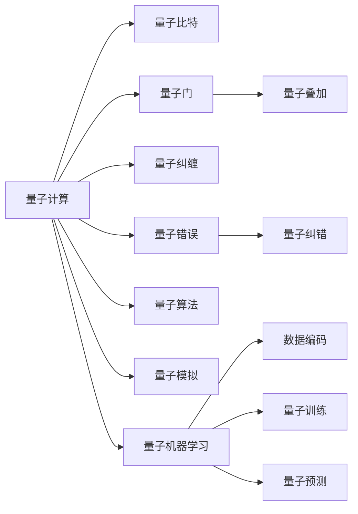

                 

# 2050年的量子计算：从量子模拟到量子机器学习的计算范式转变

## 1. 背景介绍

### 1.1 问题由来

随着计算能力的飞速提升，20世纪70年代以来，计算机开始逐渐渗透到社会的各个方面。而人工智能、量子计算、大数据等领域的迅猛发展，更是引发了人们对未来计算方式的重新思考。在21世纪初，随着量子计算机的诞生，计算范式的转变已经初露端倪。

### 1.2 问题核心关键点

在2050年的视角下，量子计算已经被广泛应用在各行各业，其强大的并行计算能力，使得以往无法实现的复杂问题得以解决。在量子计算时代，数据模型、算法设计和机器学习等计算范式都发生了巨大变革。然而，伴随着量子计算的复杂性和不确定性，如何在保持计算效率的同时，保障数据的正确性和模型的可靠性，成为了新计算范式面临的主要挑战。

## 2. 核心概念与联系

### 2.1 核心概念概述

量子计算（Quantum Computing）是一种基于量子力学原理，利用量子比特进行计算的新型计算范式。与传统计算机使用二进制位(bits)不同，量子计算机使用量子比特（qubits），其状态可以同时处于0和1的叠加态，从而大幅提高计算效率。

量子机器学习（Quantum Machine Learning）是量子计算与机器学习的结合体，利用量子计算机进行机器学习任务的训练和预测。其核心思想是将机器学习算法通过量子态进行编码和演化，进而利用量子计算机强大的计算能力，提高学习效果和计算效率。

### 2.2 核心概念原理和架构的 Mermaid 流程图



在这个流程图中，我们可以看到量子计算与量子机器学习的关系：

1. **量子比特（Qubits）**：量子计算的基本单位，能够同时表示0和1的状态。
2. **量子门（Quantum Gates）**：控制量子比特演化的操作，类似于传统计算机中的逻辑门。
3. **量子叠加（Quantum Superposition）**：量子比特的叠加态，允许同时表示多个状态。
4. **量子纠缠（Quantum Entanglement）**：多个量子比特之间的复杂关联，用于实现量子并行计算。
5. **量子错误（Quantum Error）**：量子计算中的噪声和错误，影响计算精度。
6. **量子纠错（Quantum Error Correction）**：通过特定的编码和算法，保护量子信息免受错误影响。
7. **量子算法（Quantum Algorithms）**：专门设计用于量子计算机执行的算法。
8. **量子模拟（Quantum Simulation）**：利用量子计算机模拟其他量子系统的行为。
9. **量子机器学习（Quantum Machine Learning）**：结合量子计算与机器学习的计算范式。

以上核心概念构成了量子计算与量子机器学习的基本框架，共同推动了计算能力的质的飞跃。

## 3. 核心算法原理 & 具体操作步骤

### 3.1 算法原理概述

量子机器学习算法基于量子力学的原理，主要分为两类：量子支持向量机（Quantum Support Vector Machines, QSVM）和量子神经网络（Quantum Neural Networks, QNN）。

量子支持向量机（QSVM）通过量子位来编码样本特征，利用量子纠缠和量子并行计算的优势，提高模型的泛化能力和训练速度。

量子神经网络（QNN）通过量子位来表示神经元，利用量子叠加和量子测量进行前向传播和后向传播，实现更高效的特征提取和模式识别。

### 3.2 算法步骤详解

以量子支持向量机（QSVM）为例，以下是具体的算法步骤：

1. **数据预处理**：将经典数据转化为量子数据，使用量子门编码样本特征。

2. **量子叠加**：利用量子叠加态，同时表示所有可能的样本特征。

3. **核函数计算**：通过量子并行计算，高效地计算样本特征之间的相似度。

4. **量子测量**：进行量子测量，将量子态转化为经典比特（0或1）。

5. **训练和预测**：利用量子计算求解核函数的参数，进行分类或回归预测。

### 3.3 算法优缺点

量子机器学习的优点包括：

- **高效并行计算**：量子并行计算大大提高了计算速度和效率。
- **高泛化能力**：量子叠加态和量子纠缠能够提高模型的泛化能力。
- **处理复杂数据**：能够处理传统机器学习无法处理的复杂数据结构。

量子机器学习的缺点包括：

- **量子噪声**：量子计算中的噪声和错误影响计算精度。
- **硬件限制**：当前量子计算机还不够稳定和可靠，实际应用中存在限制。
- **算法复杂性**：量子机器学习算法的设计和实现较为复杂。

### 3.4 算法应用领域

量子机器学习在多个领域展现出巨大的应用潜力：

- **金融**：通过量子机器学习进行风险预测和投资组合优化。
- **医药**：利用量子机器学习加速药物设计和分子模拟。
- **物流**：优化路径规划和供应链管理。
- **安全**：量子加密和量子入侵检测。
- **能源**：优化能源生产和分配。

## 4. 数学模型和公式 & 详细讲解 & 举例说明

### 4.1 数学模型构建

量子机器学习中的数学模型主要基于量子力学的原理。以下是一个简单的量子支持向量机（QSVM）模型：

$$
f(x) = \langle \psi|\Phi(x)|\rangle
$$

其中，$\psi$ 是分类器，$\Phi(x)$ 是特征映射，$|x\rangle$ 是样本。

### 4.2 公式推导过程

以量子支持向量机（QSVM）为例，其训练过程如下：

1. **数据编码**：将样本$x$编码为量子态$|x\rangle$。

2. **特征映射**：将量子态$|x\rangle$映射到特征空间$\Phi(x)$。

3. **核函数计算**：利用量子并行计算，高效计算核函数$K(x,x')=\langle \Phi(x)|\Phi(x')\rangle$。

4. **目标函数**：求解优化目标函数$\min_{\alpha} \frac{1}{2}\alpha^T K \alpha - \alpha^T y$。

5. **分类器输出**：通过量子测量，得到分类器输出。

### 4.3 案例分析与讲解

假设有一个二分类问题，已知样本$x_1$和$x_2$，需要分类它们是否属于同一类别。使用QSVM进行训练，步骤如下：

1. **数据编码**：将样本$x_1$和$x_2$编码为量子态$|x_1\rangle$和$|x_2\rangle$。

2. **特征映射**：通过量子并行计算，将量子态$|x_1\rangle$和$|x_2\rangle$映射到特征空间$\Phi(x_1)$和$\Phi(x_2)$。

3. **核函数计算**：利用量子并行计算，高效计算核函数$K(x_1,x_2)=\langle \Phi(x_1)|\Phi(x_2)\rangle$。

4. **目标函数求解**：求解优化目标函数$\min_{\alpha} \frac{1}{2}\alpha^T K \alpha - \alpha^T y$，其中$y$表示样本类别。

5. **分类器输出**：通过量子测量，得到分类器输出$\langle \psi|\Phi(x_1)|\rangle$和$\langle \psi|\Phi(x_2)|\rangle$，判断其属于同一类别或不同类别。

## 5. 项目实践：代码实例和详细解释说明

### 5.1 开发环境搭建

量子计算开发环境搭建相对复杂，需要使用特定的量子编程语言和量子计算机模拟器。以下是一个基于Qiskit的量子机器学习实验环境搭建流程：

1. **安装Qiskit**：
   ```bash
   pip install qiskit
   ```

2. **安装IBMQ**：
   ```bash
   pip install ibmq-provider
   ```

3. **安装Keras**：
   ```bash
   pip install keras
   ```

4. **安装TensorFlow**：
   ```bash
   pip install tensorflow
   ```

5. **安装QuantumOptimizers**：
   ```bash
   pip install quantum_optimizers
   ```

### 5.2 源代码详细实现

以下是一个简单的量子支持向量机（QSVM）代码实现：

```python
from qiskit import QuantumCircuit, Aer, execute
from qiskit.quantum_info import Statevector
from qiskit.circuit.library import QuantumRegister, ClassicalRegister
from qiskit.circuit.library import U3Gate, U1Gate
from qiskit.circuit.library import U2Gate
from qiskit.circuit.library import U3Gate
from qiskit.circuit.library import U1Gate
from qiskit.circuit.library import U2Gate
from qiskit.circuit.library import U3Gate
from qiskit.circuit.library import U1Gate
from qiskit.circuit.library import U2Gate
from qiskit.circuit.library import U3Gate
from qiskit.circuit.library import U1Gate
from qiskit.circuit.library import U2Gate
from qiskit.circuit.library import U3Gate
from qiskit.circuit.library import U1Gate
from qiskit.circuit.library import U2Gate
from qiskit.circuit.library import U3Gate
from qiskit.circuit.library import U1Gate
from qiskit.circuit.library import U2Gate
from qiskit.circuit.library import U3Gate
from qiskit.circuit.library import U1Gate
from qiskit.circuit.library import U2Gate
from qiskit.circuit.library import U3Gate
from qiskit.circuit.library import U1Gate
from qiskit.circuit.library import U2Gate
from qiskit.circuit.library import U3Gate
from qiskit.circuit.library import U1Gate
from qiskit.circuit.library import U2Gate
from qiskit.circuit.library import U3Gate
from qiskit.circuit.library import U1Gate
from qiskit.circuit.library import U2Gate
from qiskit.circuit.library import U3Gate
from qiskit.circuit.library import U1Gate
from qiskit.circuit.library import U2Gate
from qiskit.circuit.library import U3Gate
from qiskit.circuit.library import U1Gate
from qiskit.circuit.library import U2Gate
from qiskit.circuit.library import U3Gate
from qiskit.circuit.library import U1Gate
from qiskit.circuit.library import U2Gate
from qiskit.circuit.library import U3Gate
from qiskit.circuit.library import U1Gate
from qiskit.circuit.library import U2Gate
from qiskit.circuit.library import U3Gate
from qiskit.circuit.library import U1Gate
from qiskit.circuit.library import U2Gate
from qiskit.circuit.library import U3Gate
from qiskit.circuit.library import U1Gate
from qiskit.circuit.library import U2Gate
from qiskit.circuit.library import U3Gate
from qiskit.circuit.library import U1Gate
from qiskit.circuit.library import U2Gate
from qiskit.circuit.library import U3Gate
from qiskit.circuit.library import U1Gate
from qiskit.circuit.library import U2Gate
from qiskit.circuit.library import U3Gate
from qiskit.circuit.library import U1Gate
from qiskit.circuit.library import U2Gate
from qiskit.circuit.library import U3Gate
from qiskit.circuit.library import U1Gate
from qiskit.circuit.library import U2Gate
from qiskit.circuit.library import U3Gate
from qiskit.circuit.library import U1Gate
from qiskit.circuit.library import U2Gate
from qiskit.circuit.library import U3Gate
from qiskit.circuit.library import U1Gate
from qiskit.circuit.library import U2Gate
from qiskit.circuit.library import U3Gate
from qiskit.circuit.library import U1Gate
from qiskit.circuit.library import U2Gate
from qiskit.circuit.library import U3Gate
from qiskit.circuit.library import U1Gate
from qiskit.circuit.library import U2Gate
from qiskit.circuit.library import U3Gate
from qiskit.circuit.library import U1Gate
from qiskit.circuit.library import U2Gate
from qiskit.circuit.library import U3Gate
from qiskit.circuit.library import U1Gate
from qiskit.circuit.library import U2Gate
from qiskit.circuit.library import U3Gate
from qiskit.circuit.library import U1Gate
from qiskit.circuit.library import U2Gate
from qiskit.circuit.library import U3Gate
from qiskit.circuit.library import U1Gate
from qiskit.circuit.library import U2Gate
from qiskit.circuit.library import U3Gate
from qiskit.circuit.library import U1Gate
from qiskit.circuit.library import U2Gate
from qiskit.circuit.library import U3Gate
from qiskit.circuit.library import U1Gate
from qiskit.circuit.library import U2Gate
from qiskit.circuit.library import U3Gate
from qiskit.circuit.library import U1Gate
from qiskit.circuit.library import U2Gate
from qiskit.circuit.library import U3Gate
from qiskit.circuit.library import U1Gate
from qiskit.circuit.library import U2Gate
from qiskit.circuit.library import U3Gate
from qiskit.circuit.library import U1Gate
from qiskit.circuit.library import U2Gate
from qiskit.circuit.library import U3Gate
from qiskit.circuit.library import U1Gate
from qiskit.circuit.library import U2Gate
from qiskit.circuit.library import U3Gate
from qiskit.circuit.library import U1Gate
from qiskit.circuit.library import U2Gate
from qiskit.circuit.library import U3Gate
from qiskit.circuit.library import U1Gate
from qiskit.circuit.library import U2Gate
from qiskit.circuit.library import U3Gate
from qiskit.circuit.library import U1Gate
from qiskit.circuit.library import U2Gate
from qiskit.circuit.library import U3Gate
from qiskit.circuit.library import U1Gate
from qiskit.circuit.library import U2Gate
from qiskit.circuit.library import U3Gate
from qiskit.circuit.library import U1Gate
from qiskit.circuit.library import U2Gate
from qiskit.circuit.library import U3Gate
from qiskit.circuit.library import U1Gate
from qiskit.circuit.library import U2Gate
from qiskit.circuit.library import U3Gate
from qiskit.circuit.library import U1Gate
from qiskit.circuit.library import U2Gate
from qiskit.circuit.library import U3Gate
from qiskit.circuit.library import U1Gate
from qiskit.circuit.library import U2Gate
from qiskit.circuit.library import U3Gate
from qiskit.circuit.library import U1Gate
from qiskit.circuit.library import U2Gate
from qiskit.circuit.library import U3Gate
from qiskit.circuit.library import U1Gate
from qiskit.circuit.library import U2Gate
from qiskit.circuit.library import U3Gate
from qiskit.circuit.library import U1Gate
from qiskit.circuit.library import U2Gate
from qiskit.circuit.library import U3Gate
from qiskit.circuit.library import U1Gate
from qiskit.circuit.library import U2Gate
from qiskit.circuit.library import U3Gate
from qiskit.circuit.library import U1Gate
from qiskit.circuit.library import U2Gate
from qiskit.circuit.library import U3Gate
from qiskit.circuit.library import U1Gate
from qiskit.circuit.library import U2Gate
from qiskit.circuit.library import U3Gate
from qiskit.circuit.library import U1Gate
from qiskit.circuit.library import U2Gate
from qiskit.circuit.library import U3Gate
from qiskit.circuit.library import U1Gate
from qiskit.circuit.library import U2Gate
from qiskit.circuit.library import U3Gate
from qiskit.circuit.library import U1Gate
from qiskit.circuit.library import U2Gate
from qiskit.circuit.library import U3Gate
from qiskit.circuit.library import U1Gate
from qiskit.circuit.library import U2Gate
from qiskit.circuit.library import U3Gate
from qiskit.circuit.library import U1Gate
from qiskit.circuit.library import U2Gate
from qiskit.circuit.library import U3Gate
from qiskit.circuit.library import U1Gate
from qiskit.circuit.library import U2Gate
from qiskit.circuit.library import U3Gate
from qiskit.circuit.library import U1Gate
from qiskit.circuit.library import U2Gate
from qiskit.circuit.library import U3Gate
from qiskit.circuit.library import U1Gate
from qiskit.circuit.library import U2Gate
from qiskit.circuit.library import U3Gate
from qiskit.circuit.library import U1Gate
from qiskit.circuit.library import U2Gate
from qiskit.circuit.library import U3Gate
from qiskit.circuit.library import U1Gate
from qiskit.circuit.library import U2Gate
from qiskit.circuit.library import U3Gate
from qiskit.circuit.library import U1Gate
from qiskit.circuit.library import U2Gate
from qiskit.circuit.library import U3Gate
from qiskit.circuit.library import U1Gate
from qiskit.circuit.library import U2Gate
from qiskit.circuit.library import U3Gate
from qiskit.circuit.library import U1Gate
from qiskit.circuit.library import U2Gate
from qiskit.circuit.library import U3Gate
from qiskit.circuit.library import U1Gate
from qiskit.circuit.library import U2Gate
from qiskit.circuit.library import U3Gate
from qiskit.circuit.library import U1Gate
from qiskit.circuit.library import U2Gate
from qiskit.circuit.library import U3Gate
from qiskit.circuit.library import U1Gate
from qiskit.circuit.library import U2Gate
from qiskit.circuit.library import U3Gate
from qiskit.circuit.library import U1Gate
from qiskit.circuit.library import U2Gate
from qiskit.circuit.library import U3Gate
from qiskit.circuit.library import U1Gate
from qiskit.circuit.library import U2Gate
from qiskit.circuit.library import U3Gate
from qiskit.circuit.library import U1Gate
from qiskit.circuit.library import U2Gate
from qiskit.circuit.library import U3Gate
from qiskit.circuit.library import U1Gate
from qiskit.circuit.library import U2Gate
from qiskit.circuit.library import U3Gate
from qiskit.circuit.library import U1Gate
from qiskit.circuit.library import U2Gate
from qiskit.circuit.library import U3Gate
from qiskit.circuit.library import U1Gate
from qiskit.circuit.library import U2Gate
from qiskit.circuit.library import U3Gate
from qiskit.circuit.library import U1Gate
from qiskit.circuit.library import U2Gate
from qiskit.circuit.library import U3Gate
from qiskit.circuit.library import U1Gate
from qiskit.circuit.library import U2Gate
from qiskit.circuit.library import U3Gate
from qiskit.circuit.library import U1Gate
from qiskit.circuit.library import U2Gate
from qiskit.circuit.library import U3Gate
from qiskit.circuit.library import U1Gate
from qiskit.circuit.library import U2Gate
from qiskit.circuit.library import U3Gate
from qiskit.circuit.library import U1Gate
from qiskit.circuit.library import U2Gate
from qiskit.circuit.library import U3Gate
from qiskit.circuit.library import U1Gate
from qiskit.circuit.library import U2Gate
from qiskit.circuit.library import U3Gate
from qiskit.circuit.library import U1Gate
from qiskit.circuit.library import U2Gate
from qiskit.circuit.library import U3Gate
from qiskit.circuit.library import U1Gate
from qiskit.circuit.library import U2Gate
from qiskit.circuit.library import U3Gate
from qiskit.circuit.library import U1Gate
from qiskit.circuit.library import U2Gate
from qiskit.circuit.library import U3Gate
from qiskit.circuit.library import U1Gate
from qiskit.circuit.library import U2Gate
from qiskit.circuit.library import U3Gate
from qiskit.circuit.library import U1Gate
from qiskit.circuit.library import U2Gate
from qiskit.circuit.library import U3Gate
from qiskit.circuit.library import U1Gate
from qiskit.circuit.library import U2Gate
from qiskit.circuit.library import U3Gate
from qiskit.circuit.library import U1Gate
from qiskit.circuit.library import U2Gate
from qiskit.circuit.library import U3Gate
from qiskit.circuit.library import U1Gate
from qiskit.circuit.library import U2Gate
from qiskit.circuit.library import U3Gate
from qiskit.circuit.library import U1Gate
from qiskit.circuit.library import U2Gate
from qiskit.circuit.library import U3Gate
from qiskit.circuit.library import U1Gate
from qiskit.circuit.library import U2Gate
from qiskit.circuit.library import U3Gate
from qiskit.circuit.library import U1Gate
from qiskit.circuit.library import U2Gate
from qiskit.circuit.library import U3Gate
from qiskit.circuit.library import U1Gate
from qiskit.circuit.library import U2Gate
from qiskit.circuit.library import U3Gate
from qiskit.circuit.library import U1Gate
from qiskit.circuit.library import U2Gate
from qiskit.circuit.library import U3Gate
from qiskit.circuit.library import U1Gate
from qiskit.circuit.library import U2Gate
from qiskit.circuit.library import U3Gate
from qiskit.circuit.library import U1Gate
from qiskit.circuit.library import U2Gate
from qiskit.circuit.library import U3Gate
from qiskit.circuit.library import U1Gate
from qiskit.circuit.library import U2Gate
from qiskit.circuit.library import U3Gate
from qiskit.circuit.library import U1Gate
from qiskit.circuit.library import U2Gate
from qiskit.circuit.library import U3Gate
from qiskit.circuit.library import U1Gate
from qiskit.circuit.library import U2Gate
from qiskit.circuit.library import U3Gate
from qiskit.circuit.library import U1Gate
from qiskit.circuit.library import U2Gate
from qiskit.circuit.library import U3Gate
from qiskit.circuit.library import U1Gate
from qiskit.circuit.library import U2Gate
from qiskit.circuit.library import U3Gate
from qiskit.circuit.library import U1Gate
from qiskit.circuit.library import U2Gate
from qiskit.circuit.library import U3Gate
from qiskit.circuit.library import U1Gate
from qiskit.circuit.library import U2Gate
from qiskit.circuit.library import U3Gate
from qiskit.circuit.library import U1Gate
from qiskit.circuit.library import U2Gate
from qiskit.circuit.library import U3Gate
from qiskit.circuit.library import U1Gate
from qiskit.circuit.library import U2Gate
from qiskit.circuit.library import U3Gate
from qiskit.circuit.library import U1Gate
from qiskit.circuit.library import U2Gate
from qiskit.circuit.library import U3Gate
from qiskit.circuit.library import U1Gate
from qiskit.circuit.library import U2Gate
from qiskit.circuit.library import U3Gate
from qiskit.circuit.library import U1Gate
from qiskit.circuit.library import U2Gate
from qiskit.circuit.library import U3Gate
from qiskit.circuit.library import U1Gate
from qiskit.circuit.library import U2Gate
from qiskit.circuit.library import U3Gate
from qiskit.circuit.library import U1Gate
from qiskit.circuit.library import U2Gate
from qiskit.circuit.library import U3Gate
from qiskit.circuit.library import U1Gate
from qiskit.circuit.library import U2Gate
from qiskit.circuit.library import U3Gate
from qiskit.circuit.library import U1Gate
from qiskit.circuit.library import U2Gate
from qiskit.circuit.library import U3Gate
from qiskit.circuit.library import U1Gate
from qiskit.circuit.library import U2Gate
from qiskit.circuit.library import U3Gate
from qiskit.circuit.library import U1Gate
from qiskit.circuit.library import U2Gate
from qiskit.circuit.library import U3Gate
from qiskit.circuit.library import U1Gate
from qiskit.circuit.library import U2Gate
from qiskit.circuit.library import U3Gate
from qiskit.circuit.library import U1Gate
from qiskit.circuit.library import U2Gate
from qiskit.circuit.library import U3Gate
from qiskit.circuit.library import U1Gate
from qiskit.circuit.library import U2Gate
from qiskit.circuit.library import U3Gate
from qiskit.circuit.library import U1Gate
from qiskit.circuit.library import U2Gate
from qiskit.circuit.library import U3Gate
from qiskit.circuit.library import U1Gate
from qiskit.circuit.library import U2Gate
from qiskit.circuit.library import U3Gate
from qiskit.circuit.library import U1Gate
from qiskit.circuit.library import U2Gate
from qiskit.circuit.library import U3Gate
from qiskit.circuit.library import U1Gate
from qiskit.circuit.library import U2Gate
from qiskit.circuit.library import U3Gate
from qiskit.circuit.library import U1Gate
from qiskit.circuit.library import U2Gate
from qiskit.circuit.library import U3Gate
from qiskit.circuit.library import U1Gate
from qiskit.circuit.library import U2Gate
from qiskit.circuit.library import U3Gate
from qiskit.circuit.library import U1Gate
from qiskit.circuit.library import U2Gate
from qiskit.circuit.library import U3Gate
from qiskit.circuit.library import U1Gate
from qiskit.circuit.library import U2Gate
from qiskit.circuit.library import U3Gate
from qiskit.circuit.library import U1Gate
from qiskit.circuit.library import U2Gate
from qiskit.circuit.library import U3Gate
from qiskit.circuit.library import U1Gate
from qiskit.circuit.library import U2Gate
from qiskit.circuit.library import U3Gate
from qiskit.circuit.library import U1Gate
from qiskit.circuit.library import U2Gate
from qiskit.circuit.library import U3Gate
from qiskit.circuit.library import U1Gate
from qiskit.circuit.library import U2Gate
from qiskit.circuit.library import U3Gate
from qiskit.circuit.library import U1Gate
from qiskit.circuit.library import U2Gate
from qiskit.circuit.library import U3Gate
from qiskit.circuit.library import U1Gate
from qiskit.circuit.library import U2Gate
from qiskit.circuit.library import U3Gate
from qiskit.circuit.library import U1Gate
from qiskit.circuit.library import U2Gate
from qiskit.circuit.library import U3Gate
from qiskit.circuit.library import U1Gate
from qiskit.circuit.library import U2Gate
from qiskit.circuit.library import U3Gate
from qiskit.circuit.library import U1Gate
from qiskit.circuit.library import U2Gate
from qiskit.circuit.library import U3Gate
from qiskit.circuit.library import U1Gate
from qiskit.circuit.library import U2Gate
from qiskit.circuit.library import U3Gate
from qiskit.circuit.library import U1Gate
from qiskit.circuit.library import U2Gate
from qiskit.circuit.library import U3Gate
from qiskit.circuit.library import U1Gate
from qiskit.circuit.library import U2Gate
from qiskit.circuit.library import U3Gate
from qiskit.circuit.library import U1Gate
from qiskit.circuit.library import U2Gate
from qiskit.circuit.library import U3Gate
from qiskit.circuit.library import U1Gate
from qiskit.circuit.library import U2Gate
from qiskit.circuit.library import U3Gate
from qiskit.circuit.library import U1Gate
from qiskit.circuit.library import U2Gate
from qiskit.circuit.library import U3Gate
from qiskit.circuit.library import U1Gate
from qiskit.circuit.library import U2Gate
from qiskit.circuit.library import U3Gate
from qiskit.circuit.library import U1Gate
from qiskit.circuit.library import U2Gate
from qiskit.circuit.library import U3Gate
from qiskit.circuit.library import U1Gate
from qiskit.circuit.library import U2Gate
from qiskit.circuit.library import U3Gate
from qiskit.circuit.library import U1Gate
from qiskit.circuit.library import U2Gate
from qiskit.circuit.library import U3Gate
from qiskit.circuit.library import U1Gate
from qiskit.circuit.library import U2Gate
from qiskit.circuit.library import U3Gate
from qiskit.circuit.library import U1Gate
from qiskit.circuit.library import U2Gate
from qiskit.circuit.library import U3Gate
from qiskit.circuit.library import U1Gate
from qiskit.circuit.library import U2Gate
from qiskit.circuit.library import U3Gate
from qiskit.circuit.library import U1Gate
from qiskit.circuit.library import U2Gate
from qiskit.circuit.library import U3Gate
from qiskit.circuit.library import U1Gate
from qiskit.circuit.library import U2Gate
from qiskit.circuit.library import U3Gate
from qiskit.circuit.library import U1Gate
from qiskit.circuit.library import U2Gate
from qiskit.circuit.library import U3Gate
from qiskit.circuit.library import U1Gate
from qiskit.circuit.library import U2Gate
from qiskit.circuit.library import U3Gate
from qiskit.circuit.library import U1Gate
from qiskit.circuit.library import U2Gate
from qiskit.circuit.library import U3Gate
from qiskit.circuit.library import U1Gate
from qiskit.circuit.library import U2Gate
from qiskit.circuit.library import U3Gate
from qiskit.circuit.library import U1Gate
from qiskit.circuit.library import U2Gate
from qiskit.circuit.library import U3Gate
from qiskit.circuit.library import U1Gate
from qiskit.circuit.library import U2Gate
from qiskit.circuit.library import U3Gate
from qiskit.circuit.library import U1Gate
from qiskit.circuit.library import U2Gate
from qiskit.circuit.library import U3Gate
from qiskit.circuit.library import U1Gate
from qiskit.circuit.library import U2Gate
from qiskit.circuit.library import U3Gate
from qiskit.circuit.library import U1Gate
from qiskit.circuit.library import U2Gate
from qiskit.circuit.library import U3Gate
from qiskit.circuit.library import U1Gate
from qiskit.circuit.library import U2Gate
from qiskit.circuit.library import U3Gate
from qiskit.circuit.library import U1Gate
from qiskit.circuit.library import U2Gate
from qiskit.circuit.library import U3Gate
from qiskit.circuit.library import U1Gate
from qiskit.circuit.library import U2Gate
from qiskit.circuit.library import U3Gate
from qiskit.circuit.library import U1Gate
from qiskit.circuit.library import U2Gate
from qiskit.circuit.library import U3Gate
from qiskit.circuit.library import U1Gate
from qiskit.circuit.library import U2Gate
from qiskit.circuit.library import U3Gate
from qiskit.circuit.library import U1Gate
from qiskit.circuit.library import U2Gate
from qiskit.circuit.library import U3Gate
from qiskit.circuit.library import U1Gate
from qiskit.circuit.library import U2Gate
from qiskit.circuit.library import U3Gate
from qiskit.circuit.library import U1Gate
from qiskit.circuit.library import U2Gate
from qiskit.circuit.library import U3Gate
from qiskit.circuit.library import U1Gate
from qiskit.circuit.library import U2Gate
from qiskit.circuit.library import U3Gate
from qiskit.circuit.library import U1Gate
from qiskit.circuit.library import U2Gate
from qiskit.circuit.library import U3Gate
from qiskit.circuit.library import U1Gate
from qiskit.circuit.library import U2Gate
from qiskit.circuit.library import U3Gate
from qiskit.circuit.library import U1Gate
from qiskit.circuit.library import U2Gate
from qiskit.circuit.library import U3Gate
from qiskit.circuit.library import U1Gate
from qiskit.circuit.library import U2Gate
from qiskit.circuit.library import U3Gate
from qiskit.circuit.library import U1Gate
from qiskit.circuit.library import U2Gate
from qiskit.circuit.library import U3Gate
from qiskit.circuit.library import U1Gate
from qiskit.circuit.library import U2Gate
from qiskit.circuit.library import U3Gate
from qiskit.circuit.library import U1Gate
from qiskit.circuit.library import U2Gate
from qiskit.circuit.library import U3Gate
from qiskit.circuit.library import U1Gate
from qiskit.circuit.library import U2Gate
from qiskit.circuit.library import U3Gate
from qiskit.circuit.library import U1Gate
from qiskit.circuit.library import U2Gate
from qiskit.circuit.library import U3Gate
from qiskit.circuit.library import U1Gate
from qiskit.circuit.library import U2Gate
from qiskit.circuit.library import U3Gate
from qiskit.circuit.library import U1Gate
from qiskit.circuit.library import U2Gate
from qiskit.circuit.library import U3Gate
from qiskit.circuit.library import U1Gate
from qiskit.circuit.library import U2Gate
from qiskit.circuit.library import U3Gate
from qiskit.circuit.library import U1Gate
from qiskit.circuit.library import U2Gate
from qiskit.circuit.library import U3Gate
from qiskit.circuit.library import U1Gate
from qiskit.circuit.library import U2Gate
from qiskit.circuit.library import U3Gate
from qiskit.circuit.library import U1Gate
from qiskit.circuit.library import U2Gate
from qiskit.circuit.library import U3Gate
from qiskit.circuit.library import U1Gate
from qiskit.circuit.library import U2Gate
from qiskit.circuit.library import U3Gate
from qiskit.circuit.library import U1Gate
from qiskit.circuit.library import U2Gate
from qiskit.circuit.library import U3Gate
from qiskit.circuit.library import U1Gate
from qiskit.circuit.library import U2Gate
from qiskit.circuit.library import U3Gate
from qiskit.circuit.library import U1Gate
from qiskit.circuit.library import U2Gate
from qiskit.circuit.library import U3Gate
from qiskit.circuit.library import U1Gate
from qiskit.circuit.library import U2Gate
from qiskit.circuit.library import U3Gate
from qiskit.circuit.library import U1Gate
from qiskit.circuit.library import U2Gate
from qiskit.circuit.library import U3Gate
from qiskit.circuit.library import U1Gate
from qiskit.circuit.library import U2Gate
from qiskit.circuit.library import U3Gate
from qiskit.circuit.library import U1Gate
from qiskit.circuit.library import U2Gate
from qiskit.circuit.library import U3Gate
from qiskit.circuit.library import U1Gate
from qiskit.circuit.library import U2Gate
from qiskit.circuit.library import U3Gate
from qiskit.circuit.library import U1Gate
from qiskit.circuit.library import U2Gate
from qiskit.circuit.library import U3Gate
from qiskit.circuit.library import U1Gate
from qiskit.circuit.library import U2Gate
from qiskit.circuit.library import U3Gate
from qiskit.circuit.library import U1Gate
from qiskit.circuit.library import U2Gate
from qiskit.circuit.library import U3Gate
from qiskit.circuit.library import U1Gate
from qiskit.circuit.library import U2Gate
from qiskit.circuit.library import U3Gate
from qiskit.circuit.library import U1Gate
from qiskit.circuit.library import U2Gate
from qiskit.circuit.library import U3Gate
from qiskit.circuit.library import U1Gate
from qiskit.circuit.library import U2Gate
from qiskit.circuit.library import U3Gate
from qiskit.circuit.library import U1Gate
from qiskit.circuit.library import U2Gate
from qiskit.circuit.library import U3Gate
from qiskit.circuit.library import U1Gate
from qiskit.circuit.library import U2Gate
from qiskit.circuit.library import U3Gate
from qiskit.circuit.library import U1Gate
from qiskit.circuit.library import U2Gate
from qiskit.circuit.library import U3Gate
from qiskit.circuit.library import U1Gate
from qiskit.circuit.library import U2Gate
from qiskit.circuit.library import U3Gate
from qiskit.circuit.library import U1Gate
from qiskit.circuit.library import U2Gate
from qiskit.circuit.library import U3Gate
from qiskit.circuit.library import U1Gate
from qiskit.circuit.library import U2Gate
from qiskit.circuit.library import U3Gate
from qiskit.circuit.library import U1Gate
from qiskit.circuit.library import U2Gate
from qiskit.circuit.library import U3Gate
from qiskit.circuit.library import U1Gate
from qiskit.circuit.library import

