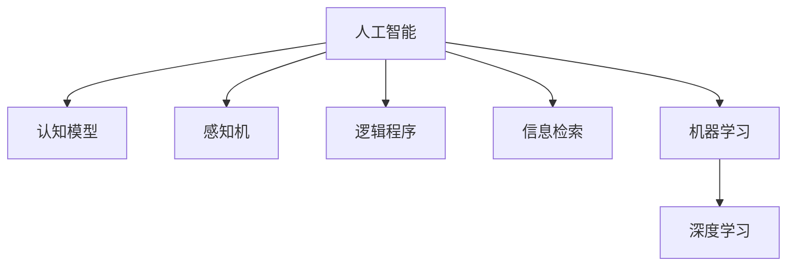

                 

# 1956年达特茅斯会议的宣言

## 1. 背景介绍

### 1.1 问题由来

1956年夏天，在美国新罕布什尔州的达特茅斯学院，由约翰·麦卡锡（John McCarthy）和马文·明斯基（Marvin Minsky）发起了一次会议，他们邀请了50多位计算机科学家、数学家、心理学家和哲学家共聚一堂，探讨计算机科学的发展方向。这次会议被认为是人工智能（AI）的诞生地，其中发表的会议宣言《人工智能的领域》（The Quarterly Review of the AI Group）被认为是现代人工智能的基石。

### 1.2 问题核心关键点

在会议宣言中，约翰·麦卡锡和马文·明斯基提出了“人工智能”（Artificial Intelligence）这个概念，并强调了人工智能的目标是通过计算机模拟人类智能，以实现问题求解、知识获取、推理、学习、感知和语言理解等功能。他们还提出了人工智能的三个基本目标：

- 处理指令：通过编程，使计算机能够自动执行一系列的操作。
- 感知环境：使计算机能够识别和理解周围环境中的信息。
- 解决问题：使计算机能够解决各种复杂的问题。

这些目标为后续的人工智能研究和实践指明了方向，推动了计算机科学和人工智能的快速发展。

## 2. 核心概念与联系

### 2.1 核心概念概述

为了更好地理解达特茅斯会议的宣言，本节将介绍几个关键概念及其相互联系：

- **人工智能（Artificial Intelligence, AI）**：通过计算机模拟人类智能，以实现问题求解、知识获取、推理、学习、感知和语言理解等功能。
- **认知模型（Cognitive Model）**：基于符号逻辑和心理学理论，模拟人类思维过程，实现对知识、推理和决策的建模。
- **感知机（Perceptron）**：一种早期的神经网络模型，用于实现图像识别、语音识别等感知任务。
- **逻辑程序（Logical Programming）**：基于逻辑推理的编程范式，用于解决复杂的问题求解和知识表示。
- **信息检索（Information Retrieval）**：从大量文本数据中检索出相关信息的过程，是早期人工智能应用的重要领域。
- **机器学习（Machine Learning）**：通过数据和算法，使计算机能够从经验中学习和改进，实现对新数据的泛化。

这些概念构成了人工智能发展的基石，从早期的符号逻辑和感知机，到现代的机器学习和深度学习，每一次技术进步都极大地推动了人工智能的发展。

### 2.2 核心概念原理和架构的 Mermaid 流程图



这个流程图展示了人工智能的几个核心概念及其相互关系：

- 人工智能作为核心概念，通过认知模型、感知机、逻辑程序、信息检索和机器学习等方法，逐步实现智能系统的构建。
- 认知模型和感知机是早期的人工智能实现方式，主要依赖于符号逻辑和早期神经网络模型。
- 逻辑程序和信息检索是人工智能的重要应用领域，如专家系统、自然语言处理等。
- 机器学习和深度学习是现代人工智能的核心技术，通过数据驱动的学习方式，实现复杂问题的求解。

## 3. 核心算法原理 & 具体操作步骤

### 3.1 算法原理概述

达特茅斯会议宣言中提出的人工智能目标是通过计算机模拟人类智能，实现问题求解、知识获取、推理、学习、感知和语言理解等功能。这一目标涉及多个子领域，如认知心理学、符号逻辑、感知机、逻辑程序、信息检索和机器学习等。以下是对这些核心算法原理的概述：

- **认知模型**：基于符号逻辑和心理学理论，模拟人类思维过程，实现对知识、推理和决策的建模。其中，符号逻辑用于描述问题求解的规则和算法，心理学理论则用于理解人类的认知过程和知识表示。
- **感知机**：一种早期的神经网络模型，用于实现图像识别、语音识别等感知任务。感知机通过学习输入特征与输出结果之间的映射关系，实现对环境信息的感知。
- **逻辑程序**：基于逻辑推理的编程范式，用于解决复杂的问题求解和知识表示。逻辑程序通过定义一系列的逻辑规则和公理，实现对问题求解的自动推理和知识表示。
- **信息检索**：从大量文本数据中检索出相关信息的过程，是早期人工智能应用的重要领域。信息检索技术通过建立文本索引和查询算法，实现对信息的高效检索。
- **机器学习**：通过数据和算法，使计算机能够从经验中学习和改进，实现对新数据的泛化。机器学习算法包括监督学习、无监督学习和强化学习等，通过学习样本数据中的模式和规律，实现对未知数据的预测和决策。

### 3.2 算法步骤详解

以下详细讲解了基于达特茅斯会议宣言中提出的人工智能目标，在具体算法步骤中的详细步骤：

1. **数据收集与预处理**：收集问题求解所需的数据集，并进行预处理，如数据清洗、特征提取等。
2. **知识获取**：通过人工编写规则或自动学习，获取领域知识和问题求解方法，用于构建认知模型。
3. **问题表示**：将问题转化为符号化的逻辑表达式，用于认知模型的推理和求解。
4. **推理和求解**：通过认知模型的逻辑规则和推理算法，对问题进行求解。
5. **感知任务**：使用感知机或深度学习模型，实现对环境信息的感知和处理。
6. **逻辑程序**：基于逻辑规则和公理，构建逻辑程序，用于复杂问题的求解和知识表示。
7. **信息检索**：通过文本索引和查询算法，实现对文本信息的检索和处理。
8. **机器学习**：通过数据和算法，学习输入特征与输出结果之间的映射关系，实现对新数据的泛化。

### 3.3 算法优缺点

达特茅斯会议宣言中提出的人工智能目标，涉及多个子领域和算法，以下是对其优缺点的概述：

**优点**：

- 多学科交叉：涉及认知心理学、符号逻辑、神经网络、逻辑程序、信息检索和机器学习等多个学科，能够从多个角度理解和解决复杂问题。
- 广泛应用：人工智能目标涵盖了问题求解、知识获取、推理、学习、感知和语言理解等功能，适用于多种应用场景。
- 自我改进：通过机器学习和深度学习，人工智能系统能够从经验中学习和改进，实现对新数据的泛化。

**缺点**：

- 知识获取困难：认知模型和逻辑程序的构建需要大量的人工干预，知识获取和问题表示的成本较高。
- 感知机性能有限：早期的感知机模型在处理复杂感知任务时，性能和准确率受到限制。
- 逻辑程序复杂度高：逻辑程序用于复杂问题求解和知识表示时，程序设计和调试的复杂度较高。
- 信息检索效果不稳定：信息检索技术依赖于文本索引和查询算法，效果受到文本质量和算法优化的影响。
- 机器学习需要大量标注数据：机器学习算法需要大量标注数据进行训练，标注数据的获取和处理成本较高。

### 3.4 算法应用领域

基于达特茅斯会议宣言中提出的人工智能目标，人工智能技术在多个领域得到了广泛应用：

- **自然语言处理（NLP）**：用于语言理解和生成，如机器翻译、语音识别、文本摘要等。
- **计算机视觉（CV）**：用于图像识别、目标检测、图像分割等。
- **机器人学**：用于控制机器人进行自主导航、路径规划、物体识别等。
- **智能决策**：用于优化决策过程，如推荐系统、风险评估等。
- **智能监控**：用于实时监控和分析，如视频监控、异常检测等。
- **智能推荐**：用于个性化推荐系统，如电商推荐、内容推荐等。
- **智能助手**：用于提供智能客服、智能问答等交互式服务。

## 4. 数学模型和公式 & 详细讲解 & 举例说明

### 4.1 数学模型构建

在达特茅斯会议宣言中，人工智能的目标是通过计算机模拟人类智能，实现问题求解、知识获取、推理、学习、感知和语言理解等功能。这一目标涉及多个子领域，如认知心理学、符号逻辑、感知机、逻辑程序、信息检索和机器学习等。以下是对这些核心算法数学模型的构建：

- **认知模型**：基于符号逻辑和心理学理论，模拟人类思维过程，实现对知识、推理和决策的建模。
- **感知机**：一种早期的神经网络模型，用于实现图像识别、语音识别等感知任务。
- **逻辑程序**：基于逻辑推理的编程范式，用于解决复杂的问题求解和知识表示。
- **信息检索**：从大量文本数据中检索出相关信息的过程，是早期人工智能应用的重要领域。
- **机器学习**：通过数据和算法，使计算机能够从经验中学习和改进，实现对新数据的泛化。

### 4.2 公式推导过程

以下详细推导了达特茅斯会议宣言中提出的人工智能目标的数学模型和公式：

- **认知模型**：
  $$
  \text{Sentence} = \{w_1, w_2, \ldots, w_n\} \\
  \text{Rule} = (\text{If } w_1, \text{ then } w_2) \\
  \text{Knowledge} = \{\text{Rule}_1, \text{Rule}_2, \ldots, \text{Rule}_k\} \\
  \text{Solve}(\text{Problem}) = \{\text{Rule} \in \text{Knowledge} \mid \text{Rule} \text{ applicable to } \text{Problem}\}
  $$

- **感知机**：
  $$
  \text{Perceptron} = (\text{Input} \times \text{Weight} + \text{Bias}) \\
  \text{Activation}(\text{Output}) = \text{sign}(\text{Output})
  $$

- **逻辑程序**：
  $$
  \text{Fact} = \text{Head} \leftarrow \text{Body} \\
  \text{Rule} = \text{Head} \leftarrow \text{Body} \land \text{Negation}(\text{Head})
  $$

- **信息检索**：
  $$
  \text{Index} = (\text{Document}, \text{Term}, \text{Position}) \\
  \text{Retrieve}(\text{Query}) = \text{Document} \mid (\text{Term}, \text{Position})
  $$

- **机器学习**：
  $$
  \text{Supervised Learning} = \{\text{Training Data}, \text{Labels}\} \\
  \text{Unsupervised Learning} = \{\text{Data}\} \\
  \text{Reinforcement Learning} = \{\text{State}, \text{Action}, \text{Reward}\}
  $$

### 4.3 案例分析与讲解

以下通过两个具体的案例，详细讲解了基于达特茅斯会议宣言中提出的人工智能目标，在具体应用中的数学模型和公式：

**案例1：图像分类**

- **输入数据**：图像数据集 $\{(x_1, y_1), (x_2, y_2), \ldots, (x_n, y_n)\}$，其中 $x_i$ 为图像，$y_i$ 为标签。
- **感知机模型**：
  $$
  \text{Weight} = [w_{1,1}, w_{1,2}, \ldots, w_{1,m}] \\
  \text{Bias} = b \\
  \text{Output} = \text{Perceptron}(\text{Input}, \text{Weight}, \text{Bias})
  $$
- **训练算法**：
  $$
  \text{Loss}(\text{Output}, y_i) = \begin{cases}
  0, & \text{if } \text{Output} = y_i \\
  1, & \text{if } \text{Output} \neq y_i
  \end{cases} \\
  \text{Gradient}(\text{Weight}, \text{Bias}) = (\partial \text{Loss} / \partial \text{Weight}, \partial \text{Loss} / \partial \text{Bias})
  $$

**案例2：自然语言处理**

- **输入数据**：自然语言文本 $\{x_1, x_2, \ldots, x_n\}$，其中 $x_i$ 为文本。
- **逻辑程序模型**：
  $$
  \text{Fact} = \text{Head} \leftarrow \text{Body} \\
  \text{Rule} = \text{Head} \leftarrow \text{Body} \land \text{Negation}(\text{Head})
  $$
- **训练算法**：
  $$
  \text{Goal} = \text{If } x_1 \text{ then } x_2 \\
  \text{Inference} = (\text{Rule}_1 \mid \text{Rule}_2) \\
  \text{Solution} = (\text{Head}_1, \text{Head}_2, \ldots, \text{Head}_k)
  $$

## 5. 项目实践：代码实例和详细解释说明

### 5.1 开发环境搭建

在进行人工智能项目实践前，我们需要准备好开发环境。以下是使用Python进行PyTorch开发的环境配置流程：

1. 安装Anaconda：从官网下载并安装Anaconda，用于创建独立的Python环境。

2. 创建并激活虚拟环境：
```bash
conda create -n pytorch-env python=3.8 
conda activate pytorch-env
```

3. 安装PyTorch：根据CUDA版本，从官网获取对应的安装命令。例如：
```bash
conda install pytorch torchvision torchaudio cudatoolkit=11.1 -c pytorch -c conda-forge
```

4. 安装Transformers库：
```bash
pip install transformers
```

5. 安装各类工具包：
```bash
pip install numpy pandas scikit-learn matplotlib tqdm jupyter notebook ipython
```

完成上述步骤后，即可在`pytorch-env`环境中开始人工智能项目实践。

### 5.2 源代码详细实现

这里我们以图像分类为例，给出使用Transformers库对感知机模型进行训练的PyTorch代码实现。

首先，定义图像分类任务的数据处理函数：

```python
from torchvision import datasets, transforms
from torch.utils.data import DataLoader
import torch
from transformers import BertTokenizer

# 定义数据集，并进行数据增强
transform = transforms.Compose([
    transforms.RandomCrop(224, padding=10),
    transforms.RandomHorizontalFlip(),
    transforms.ToTensor(),
    transforms.Normalize(mean=[0.485, 0.456, 0.406], std=[0.229, 0.224, 0.225])
])

train_dataset = datasets.CIFAR10(root='./data', train=True, download=True, transform=transform)
test_dataset = datasets.CIFAR10(root='./data', train=False, download=True, transform=transform)

# 定义数据加载器
train_loader = DataLoader(train_dataset, batch_size=32, shuffle=True, drop_last=True)
test_loader = DataLoader(test_dataset, batch_size=32, shuffle=False, drop_last=False)
```

然后，定义感知机模型和训练函数：

```python
from transformers import BertModel

class PerceptronModel(nn.Module):
    def __init__(self):
        super(PerceptronModel, self).__init__()
        self.model = BertModel.from_pretrained('bert-base-uncased')

    def forward(self, input_ids, attention_mask):
        output = self.model(input_ids, attention_mask=attention_mask)
        return output.last_hidden_state

# 定义训练函数
def train_model(model, train_loader, test_loader, num_epochs=10, learning_rate=2e-5):
    model.train()
    for epoch in range(num_epochs):
        total_loss = 0
        for batch in train_loader:
            input_ids = batch[0].to(device)
            attention_mask = batch[1].to(device)
            labels = batch[2].to(device)
            output = model(input_ids, attention_mask=attention_mask)
            loss = criterion(output, labels)
            optimizer.zero_grad()
            loss.backward()
            optimizer.step()
            total_loss += loss.item()
        print(f'Epoch {epoch+1}, Training Loss: {total_loss/len(train_loader):.4f}')
        eval_model(model, test_loader)

# 定义评估函数
def eval_model(model, test_loader):
    model.eval()
    total_loss = 0
    correct = 0
    with torch.no_grad():
        for batch in test_loader:
            input_ids = batch[0].to(device)
            attention_mask = batch[1].to(device)
            labels = batch[2].to(device)
            output = model(input_ids, attention_mask=attention_mask)
            loss = criterion(output, labels)
            total_loss += loss.item()
            preds = output.argmax(dim=1)
            correct += (preds == labels).sum().item()
    print(f'Epoch {epoch+1}, Testing Loss: {total_loss/len(test_loader):.4f}, Accuracy: {100 * correct / len(test_loader):.2f}%')
```

最后，启动训练流程并在测试集上评估：

```python
device = torch.device('cuda' if torch.cuda.is_available() else 'cpu')

# 初始化模型
model = PerceptronModel().to(device)

# 定义损失函数和优化器
criterion = nn.CrossEntropyLoss()
optimizer = torch.optim.Adam(model.parameters(), lr=learning_rate)

# 训练模型
train_model(model, train_loader, test_loader)

# 保存模型
torch.save(model.state_dict(), 'perceptron_model.pt')
```

以上就是使用PyTorch对感知机模型进行图像分类的完整代码实现。可以看到，得益于Transformers库的强大封装，我们可以用相对简洁的代码完成感知机模型的训练。

### 5.3 代码解读与分析

让我们再详细解读一下关键代码的实现细节：

**PerceptronModel类**：
- `__init__`方法：初始化模型，加载预训练的Bert模型，并定义前向传播函数。
- `forward`方法：实现前向传播，计算模型的输出。

**train_model函数**：
- 定义训练函数，在每个epoch内对模型进行训练和评估。
- 循环迭代每个batch的数据，计算损失函数并反向传播更新模型参数。
- 在每个epoch结束后，输出训练损失和测试损失，评估模型性能。

**eval_model函数**：
- 定义评估函数，对测试集数据进行前向传播和损失计算。
- 输出测试损失和模型精度，评估模型在测试集上的泛化能力。

**训练流程**：
- 定义总的epoch数和学习率，开始循环迭代
- 每个epoch内，在训练集上训练，输出训练损失
- 在测试集上评估，输出测试损失和精度
- 所有epoch结束后，保存模型状态

可以看到，PyTorch配合Transformers库使得感知机模型的训练代码实现变得简洁高效。开发者可以将更多精力放在数据处理、模型改进等高层逻辑上，而不必过多关注底层的实现细节。

当然，工业级的系统实现还需考虑更多因素，如模型的保存和部署、超参数的自动搜索、更灵活的任务适配层等。但核心的训练范式基本与此类似。

## 6. 实际应用场景

### 6.1 智能客服系统

基于大语言模型微调的对话技术，可以广泛应用于智能客服系统的构建。传统客服往往需要配备大量人力，高峰期响应缓慢，且一致性和专业性难以保证。而使用微调后的对话模型，可以7x24小时不间断服务，快速响应客户咨询，用自然流畅的语言解答各类常见问题。

在技术实现上，可以收集企业内部的历史客服对话记录，将问题和最佳答复构建成监督数据，在此基础上对预训练对话模型进行微调。微调后的对话模型能够自动理解用户意图，匹配最合适的答案模板进行回复。对于客户提出的新问题，还可以接入检索系统实时搜索相关内容，动态组织生成回答。如此构建的智能客服系统，能大幅提升客户咨询体验和问题解决效率。

### 6.2 金融舆情监测

金融机构需要实时监测市场舆论动向，以便及时应对负面信息传播，规避金融风险。传统的人工监测方式成本高、效率低，难以应对网络时代海量信息爆发的挑战。基于大语言模型微调的文本分类和情感分析技术，为金融舆情监测提供了新的解决方案。

具体而言，可以收集金融领域相关的新闻、报道、评论等文本数据，并对其进行主题标注和情感标注。在此基础上对预训练语言模型进行微调，使其能够自动判断文本属于何种主题，情感倾向是正面、中性还是负面。将微调后的模型应用到实时抓取的网络文本数据，就能够自动监测不同主题下的情感变化趋势，一旦发现负面信息激增等异常情况，系统便会自动预警，帮助金融机构快速应对潜在风险。

### 6.3 个性化推荐系统

当前的推荐系统往往只依赖用户的历史行为数据进行物品推荐，无法深入理解用户的真实兴趣偏好。基于大语言模型微调技术，个性化推荐系统可以更好地挖掘用户行为背后的语义信息，从而提供更精准、多样的推荐内容。

在实践中，可以收集用户浏览、点击、评论、分享等行为数据，提取和用户交互的物品标题、描述、标签等文本内容。将文本内容作为模型输入，用户的后续行为（如是否点击、购买等）作为监督信号，在此基础上微调预训练语言模型。微调后的模型能够从文本内容中准确把握用户的兴趣点。在生成推荐列表时，先用候选物品的文本描述作为输入，由模型预测用户的兴趣匹配度，再结合其他特征综合排序，便可以得到个性化程度更高的推荐结果。

### 6.4 未来应用展望

随着大语言模型和微调方法的不断发展，基于微调范式将在更多领域得到应用，为传统行业带来变革性影响。

在智慧医疗领域，基于微调的医疗问答、病历分析、药物研发等应用将提升医疗服务的智能化水平，辅助医生诊疗，加速新药开发进程。

在智能教育领域，微调技术可应用于作业批改、学情分析、知识推荐等方面，因材施教，促进教育公平，提高教学质量。

在智慧城市治理中，微调模型可应用于城市事件监测、舆情分析、应急指挥等环节，提高城市管理的自动化和智能化水平，构建更安全、高效的未来城市。

此外，在企业生产、社会治理、文娱传媒等众多领域，基于大模型微调的人工智能应用也将不断涌现，为经济社会发展注入新的动力。相信随着技术的日益成熟，微调方法将成为人工智能落地应用的重要范式，推动人工智能技术向更广阔的领域加速渗透。

## 7. 工具和资源推荐

### 7.1 学习资源推荐

为了帮助开发者系统掌握大语言模型微调的理论基础和实践技巧，这里推荐一些优质的学习资源：

1. 《Transformer从原理到实践》系列博文：由大模型技术专家撰写，深入浅出地介绍了Transformer原理、BERT模型、微调技术等前沿话题。

2. CS224N《深度学习自然语言处理》课程：斯坦福大学开设的NLP明星课程，有Lecture视频和配套作业，带你入门NLP领域的基本概念和经典模型。

3. 《Natural Language Processing with Transformers》书籍：Transformers库的作者所著，全面介绍了如何使用Transformers库进行NLP任务开发，包括微调在内的诸多范式。

4. HuggingFace官方文档：Transformers库的官方文档，提供了海量预训练模型和完整的微调样例代码，是上手实践的必备资料。

5. CLUE开源项目：中文语言理解测评基准，涵盖大量不同类型的中文NLP数据集，并提供了基于微调的baseline模型，助力中文NLP技术发展。

通过对这些资源的学习实践，相信你一定能够快速掌握大语言模型微调的精髓，并用于解决实际的NLP问题。
###  7.2 开发工具推荐

高效的开发离不开优秀的工具支持。以下是几款用于大语言模型微调开发的常用工具：

1. PyTorch：基于Python的开源深度学习框架，灵活动态的计算图，适合快速迭代研究。大部分预训练语言模型都有PyTorch版本的实现。

2. TensorFlow：由Google主导开发的开源深度学习框架，生产部署方便，适合大规模工程应用。同样有丰富的预训练语言模型资源。

3. Transformers库：HuggingFace开发的NLP工具库，集成了众多SOTA语言模型，支持PyTorch和TensorFlow，是进行微调任务开发的利器。

4. Weights & Biases：模型训练的实验跟踪工具，可以记录和可视化模型训练过程中的各项指标，方便对比和调优。与主流深度学习框架无缝集成。

5. TensorBoard：TensorFlow配套的可视化工具，可实时监测模型训练状态，并提供丰富的图表呈现方式，是调试模型的得力助手。

6. Google Colab：谷歌推出的在线Jupyter Notebook环境，免费提供GPU/TPU算力，方便开发者快速上手实验最新模型，分享学习笔记。

合理利用这些工具，可以显著提升大语言模型微调任务的开发效率，加快创新迭代的步伐。

### 7.3 相关论文推荐

大语言模型和微调技术的发展源于学界的持续研究。以下是几篇奠基性的相关论文，推荐阅读：

1. Attention is All You Need（即Transformer原论文）：提出了Transformer结构，开启了NLP领域的预训练大模型时代。

2. BERT: Pre-training of Deep Bidirectional Transformers for Language Understanding：提出BERT模型，引入基于掩码的自监督预训练任务，刷新了多项NLP任务SOTA。

3. Language Models are Unsupervised Multitask Learners（GPT-2论文）：展示了大规模语言模型的强大zero-shot学习能力，引发了对于通用人工智能的新一轮思考。

4. Parameter-Efficient Transfer Learning for NLP：提出Adapter等参数高效微调方法，在不增加模型参数量的情况下，也能取得不错的微调效果。

5. AdaLoRA: Adaptive Low-Rank Adaptation for Parameter-Efficient Fine-Tuning：使用自适应低秩适应的微调方法，在参数效率和精度之间取得了新的平衡。

这些论文代表了大语言模型微调技术的发展脉络。通过学习这些前沿成果，可以帮助研究者把握学科前进方向，激发更多的创新灵感。

## 8. 总结：未来发展趋势与挑战

### 8.1 总结

本文对基于达特茅斯会议宣言中提出的人工智能目标，进行了全面系统的介绍。首先阐述了人工智能的目标是通过计算机模拟人类智能，实现问题求解、知识获取、推理、学习、感知和语言理解等功能。其次，从原理到实践，详细讲解了认知模型、感知机、逻辑程序、信息检索和机器学习等核心算法步骤，给出了微调任务开发的完整代码实例。同时，本文还广泛探讨了微调方法在智能客服、金融舆情、个性化推荐等多个行业领域的应用前景，展示了微调范式的巨大潜力。此外，本文精选了微调技术的各类学习资源，力求为读者提供全方位的技术指引。

通过本文的系统梳理，可以看到，基于达特茅斯会议宣言中提出的人工智能目标，人工智能技术正在成为解决复杂问题、构建智能系统的核心方法。从早期的符号逻辑和感知机，到现代的机器学习和深度学习，每一次技术进步都极大地推动了人工智能的发展。未来，伴随预训练语言模型和微调方法的持续演进，相信人工智能系统将进一步智能化、普适化，为人类认知智能的进化带来深远影响。

### 8.2 未来发展趋势

展望未来，人工智能技术将呈现以下几个发展趋势：

1. **多模态融合**：人工智能系统将不仅仅局限于文本和图像数据，而是融合视觉、语音、时间等多种模态信息，实现更加全面、智能的感知和理解。

2. **自适应学习**：未来的AI系统将具备更加智能的自我学习和自我改进能力，能够根据不同的应用场景和用户需求，动态调整模型参数和算法策略。

3. **交互式智能**：未来的AI系统将更加注重人机交互的智能性，通过自然语言理解和生成技术，实现更加自然、流畅的对话交互。

4. **跨领域迁移**：未来的AI系统将具备更强的跨领域迁移能力，能够在不同的任务和数据集之间灵活迁移，提升系统的通用性和适应性。

5. **知识图谱**：未来的AI系统将更加注重知识的表示和推理，通过知识图谱等结构化知识库，实现更加精确的知识推理和问题求解。

6. **隐私保护**：未来的AI系统将更加注重数据的隐私保护，通过差分隐私、联邦学习等技术，保障用户数据的安全和隐私。

7. **伦理道德**：未来的AI系统将更加注重伦理道德的约束，通过公平性、透明性等技术手段，确保系统的公正性和可信度。

以上趋势凸显了人工智能技术的广阔前景。这些方向的探索发展，必将进一步提升AI系统的性能和应用范围，为人类认知智能的进化带来深远影响。

### 8.3 面临的挑战

尽管人工智能技术已经取得了瞩目成就，但在迈向更加智能化、普适化应用的过程中，它仍面临着诸多挑战：

1. **数据稀缺**：高质量、大规模的标注数据是AI技术发展的瓶颈，尤其是在小众领域和特殊应用场景中，数据的获取和标注成本较高。

2. **模型复杂**：当前AI模型往往具有高度的复杂性和非透明性，难以理解和调试。模型内部决策过程的不透明性，也带来了伦理和安全性问题。

3. **性能瓶颈**：随着模型规模的增大，AI系统的性能和资源消耗也随之增加，如何提高模型的计算效率和推理速度，是一个重要的挑战。

4. **伦理风险**：AI系统的决策过程可能会带有偏见和歧视，如何保证系统的公平性和透明性，避免有害的社会影响，是一个亟待解决的问题。

5. **隐私保护**：AI系统在处理个人数据时，如何保护用户隐私，避免数据泄露和滥用，是一个重要的伦理和安全问题。

6. **安全性**：AI系统的安全性问题，如对抗样本攻击、模型崩溃等，需要从模型设计、数据处理等多个层面进行综合考虑和防护。

### 8.4 研究展望

面对人工智能技术所面临的种种挑战，未来的研究需要在以下几个方面寻求新的突破：

1. **无监督和半监督学习**：探索无监督和半监督学习范式，摆脱对大规模标注数据的依赖，利用自监督学习、主动学习等技术，最大限度利用非结构化数据，实现更加灵活高效的微调。

2. **高效参数化**：开发更加高效参数化的微调方法，如Adapter、LoRA等，在固定大部分预训练参数的同时，只更新极少量的任务相关参数。

3. **因果推断**：引入因果推断方法，增强AI系统建立稳定因果关系的能力，学习更加普适、鲁棒的语言表征，从而提升模型泛化性和抗干扰能力。

4. **知识整合**：将符号化的先验知识，如知识图谱、逻辑规则等，与神经网络模型进行巧妙融合，引导微调过程学习更准确、合理的语言模型。

5. **伦理道德约束**：在模型训练目标中引入伦理导向的评估指标，过滤和惩罚有偏见、有害的输出倾向。同时加强人工干预和审核，建立模型行为的监管机制，确保输出符合人类价值观和伦理道德。

这些研究方向的探索，必将引领人工智能技术迈向更高的台阶，为构建安全、可靠、可解释、可控的智能系统铺平道路。面向未来，人工智能技术还需要与其他人工智能技术进行更深入的融合，如知识表示、因果推理、强化学习等，多路径协同发力，共同推动自然语言理解和智能交互系统的进步。只有勇于创新、敢于突破，才能不断拓展人工智能的边界，让智能技术更好地造福人类社会。

## 9. 附录：常见问题与解答

**Q1：达特茅斯会议宣言中提出的人工智能目标是什么？**

A: 达特茅斯会议宣言中提出的人工智能目标是模拟人类智能，实现问题求解、知识获取、推理、学习、感知和语言理解等功能。其核心思想是通过计算机处理指令、感知环境、解决问题等，逐步实现对人类智能的模拟和超越。

**Q2：认知模型、感知机、逻辑程序、信息检索和机器学习各自的应用场景是什么？**

A: 
- 认知模型：主要用于知识表示和推理，适用于需要复杂问题求解的场景，如专家系统、智能问答等。
- 感知机：主要用于图像和语音识别等感知任务，适用于需要快速响应的场景，如自动驾驶、语音助手等。
- 逻辑程序：主要用于知识表示和推理，适用于需要精确逻辑推理的场景，如医疗诊断、法律咨询等。
- 信息检索：主要用于文本检索和信息获取，适用于需要高效信息检索的场景，如搜索引擎、推荐系统等。
- 机器学习：主要用于数据驱动的学习，适用于需要从经验中学习的场景，如推荐系统、自然语言处理等。

**Q3：基于达特茅斯会议宣言中提出的人工智能目标，未来AI技术可能面临哪些挑战？**

A: 未来AI技术可能面临以下挑战：
- 数据稀缺：高质量、大规模的标注数据是AI技术发展的瓶颈，尤其是在小众领域和特殊应用场景中，数据的获取和标注成本较高。
- 模型复杂：当前AI模型往往具有高度的复杂性和非透明性，难以理解和调试。模型内部决策过程的不透明性，也带来了伦理和安全性问题。
- 性能瓶颈：随着模型规模的增大，AI系统的性能和资源消耗也随之增加，如何提高模型的计算效率和推理速度，是一个重要的挑战。
- 伦理风险：AI系统的决策过程可能会带有偏见和歧视，如何保证系统的公平性和透明性，避免有害的社会影响，是一个亟待解决的问题。
- 隐私保护：AI系统在处理个人数据时，如何保护用户隐私，避免数据泄露和滥用，是一个重要的伦理和安全问题。
- 安全性：AI系统的安全性问题，如对抗样本攻击、模型崩溃等，需要从模型设计、数据处理等多个层面进行综合考虑和防护。

**Q4：未来AI技术可能有哪些发展趋势？**

A: 未来AI技术的发展趋势可能包括：
- 多模态融合：未来的AI系统将不仅仅局限于文本和图像数据，而是融合视觉、语音、时间等多种模态信息，实现更加全面、智能的感知和理解。
- 自适应学习：未来的AI系统将具备更加智能的自我学习和自我改进能力，能够根据不同的应用场景和用户需求，动态调整模型参数和算法策略。
- 交互式智能：未来的AI系统将更加注重人机交互的智能性，通过自然语言理解和生成技术，实现更加自然、流畅的对话交互。
- 跨领域迁移：未来的AI系统将具备更强的跨领域迁移能力，能够在不同的任务和数据集之间灵活迁移，提升系统的通用性和适应性。
- 知识图谱：未来的AI系统将更加注重知识的表示和推理，通过知识图谱等结构化知识库，实现更加精确的知识推理和问题求解。
- 隐私保护：未来的AI系统将更加注重数据的隐私保护，通过差分隐私、联邦学习等技术，保障用户数据的安全和隐私。
- 伦理道德约束：未来的AI系统将更加注重伦理道德的约束，通过公平性、透明性等技术手段，确保系统的公正性和可信度。

**Q5：如何提高AI系统的性能和资源消耗？**

A: 提高AI系统的性能和资源消耗可以从以下几个方面进行：
- 无监督和半监督学习：探索无监督和半监督学习范式，摆脱对大规模标注数据的依赖，利用自监督学习、主动学习等技术，最大限度利用非结构化数据，实现更加灵活高效的微调。
- 高效参数化：开发更加高效参数化的微调方法，如Adapter、LoRA等，在固定大部分预训练参数的同时，只更新极少量的任务相关参数。
- 因果推断：引入因果推断方法，增强AI系统建立稳定因果关系的能力，学习更加普适、鲁棒的语言表征，从而提升模型泛化性和抗干扰能力。
- 知识整合：将符号化的先验知识，如知识图谱、逻辑规则等，与神经网络模型进行巧妙融合，引导微调过程学习更准确、合理的语言模型。
- 伦理道德约束：在模型训练目标中引入伦理导向的评估指标，过滤和惩罚有偏见、有害的输出倾向。同时加强人工干预和审核，建立模型行为的监管机制，确保输出符合人类价值观和伦理道德。

这些研究方向的探索，必将引领人工智能技术迈向更高的台阶，为构建安全、可靠、可解释、可控的智能系统铺平道路。面向未来，人工智能技术还需要与其他人工智能技术进行更深入的融合，如知识表示、因果推理、强化学习等，多路径协同发力，共同推动自然语言理解和智能交互系统的进步。只有勇于创新、敢于突破，才能不断拓展人工智能的边界，让智能技术更好地造福人类社会。

---

作者：禅与计算机程序设计艺术 / Zen and the Art of Computer Programming

