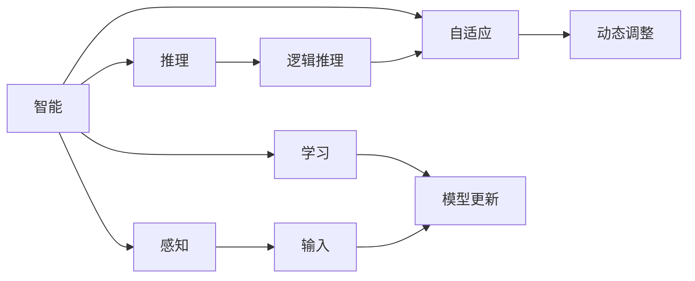

                 

# 1956年达特茅斯会议的影响

## 1. 背景介绍

### 1.1 问题由来

1956年，达特茅斯夏季研究会议上，约翰·麦卡锡、克劳德·香农、艾伦·纽厄尔、赫伯特·西蒙等众多科学家齐聚一堂，共同探讨计算机科学的基础理论问题。这次会议标志着人工智能(AI)作为一门学科的诞生，被视为人工智能历史上的里程碑事件。

### 1.2 问题核心关键点

1956年达特茅斯会议的核心讨论点包括：
- 什么是智能？
- 如何实现智能？
- 如何设计智能系统？
- 如何评价智能系统？

这些讨论激发了计算机科学家对AI领域的兴趣和研究热情，奠定了后续几十年AI发展的基调。

### 1.3 问题研究意义

了解1956年达特茅斯会议的影响，有助于我们深刻理解人工智能发展的历史脉络，把握AI技术的现状与未来趋势。同时，这次会议也为后来的AI从业者提供了宝贵的思想资源和理论基础。

## 2. 核心概念与联系

### 2.1 核心概念概述

为了更清晰地理解1956年达特茅斯会议的讨论内容和思想脉络，我们首先梳理其中的核心概念及其相互联系：

- **人工智能**：研究、开发用于模拟、延伸和扩展人的智能的理论、方法、技术及应用系统的一门学科。
- **智能**：指系统通过感知、学习、推理、自适应等过程，能够自主解决问题和适应环境的能力。
- **感知**：指系统获取和处理外部环境信息的能力，是智能系统的重要基础。
- **学习**：指系统通过经验修正自身参数，不断提高模型性能的过程。
- **推理**：指系统通过逻辑和规则，进行假设和验证，解决问题或做出决策。
- **自适应**：指系统根据环境变化动态调整内部参数和行为，保持稳定运行。

这些概念之间的联系主要体现在：智能是AI的研究目标，而感知、学习、推理、自适应等是实现智能的手段。通过这些手段，AI系统能够在特定任务上表现出类似人类的智能行为。

### 2.2 核心概念原理和架构的 Mermaid 流程图



## 3. 核心算法原理 & 具体操作步骤

### 3.1 算法原理概述

1956年达特茅斯会议强调，要实现人工智能，首先需要解决感知、学习、推理和自适应等问题。这四个问题分别对应着计算机视觉、强化学习、自然语言处理、自适应控制等方向。下面简要介绍这几个方向的算法原理。

#### 3.1.1 感知

感知是AI系统的第一道关卡，负责从环境中获取信息。常见的感知算法包括：

- **计算机视觉**：通过摄像头捕捉图像，提取特征，进行图像分类、目标检测等任务。
- **语音识别**：将语音信号转化为文本或命令，进行语音交互。

#### 3.1.2 学习

学习是AI系统的核心，通过经验不断优化模型参数，提高模型性能。常见的学习算法包括：

- **强化学习**：通过试错，不断调整策略，以最大化奖励函数。
- **深度学习**：通过多层神经网络进行特征提取和模式识别，提高模型泛化能力。

#### 3.1.3 推理

推理是AI系统的关键，通过逻辑和规则，进行假设验证和决策制定。常见的推理算法包括：

- **符号推理**：通过符号逻辑和规则，进行逻辑推理和问题求解。
- **概率推理**：通过概率模型，进行不确定性下的推理和决策。

#### 3.1.4 自适应

自适应是AI系统的保障，通过动态调整内部参数和行为，适应环境变化。常见的自适应算法包括：

- **自适应控制**：通过动态调整控制参数，实现系统稳定运行。
- **自适应学习**：通过环境反馈，动态调整学习策略，提高学习效率。

### 3.2 算法步骤详解

基于上述算法原理，1956年达特茅斯会议的讨论可以进一步细化为以下具体步骤：

#### 3.2.1 感知
1. **数据采集**：通过摄像头、麦克风等设备，采集环境数据。
2. **特征提取**：将采集到的数据转化为系统可理解的形式，如图像转化为像素矩阵，语音转化为频谱图。
3. **环境建模**：建立环境模型，用于感知数据的处理和分析。

#### 3.2.2 学习
1. **模型设计**：选择合适的模型架构，如神经网络、决策树等。
2. **数据标注**：准备标注数据，用于模型训练。
3. **模型训练**：通过迭代优化，不断调整模型参数，提高模型性能。
4. **模型评估**：使用验证集评估模型性能，防止过拟合。

#### 3.2.3 推理
1. **规则设计**：定义推理规则，用于指导问题求解。
2. **假设验证**：通过推理引擎，验证假设的正确性。
3. **决策制定**：根据推理结果，做出决策或执行动作。

#### 3.2.4 自适应
1. **环境监测**：实时监测环境变化，识别异常情况。
2. **参数调整**：根据环境反馈，动态调整模型参数。
3. **行为优化**：优化系统行为，保持稳定运行。

### 3.3 算法优缺点

#### 3.3.1 优点
- **通用性强**：感知、学习、推理和自适应等算法具有较强的通用性，可以应用于多种任务。
- **效率高**：通过算法优化，模型可以高效处理大规模数据。
- **鲁棒性好**：算法能够适应各种环境变化，保持稳定性能。

#### 3.3.2 缺点
- **依赖数据**：算法的效果依赖于数据的质量和量，数据不足可能导致性能下降。
- **模型复杂**：部分算法模型复杂，难以理解和调试。
- **资源消耗大**：算法对计算资源和存储空间有较高要求，可能面临资源瓶颈。

### 3.4 算法应用领域

基于1956年达特茅斯会议的讨论，AI技术已经广泛应用于各个领域，例如：

- **计算机视觉**：广泛应用于人脸识别、自动驾驶、智能监控等。
- **语音识别**：应用于智能音箱、语音助手、电话客服等。
- **自然语言处理**：用于机器翻译、情感分析、自动摘要等。
- **强化学习**：应用于机器人控制、游戏智能、资源调度等。

## 4. 数学模型和公式 & 详细讲解 & 举例说明

### 4.1 数学模型构建

1956年达特茅斯会议的讨论涉及多个数学模型，下面以计算机视觉中的图像分类为例，简要介绍其数学模型构建过程。

假设有一张图像 $x$，需要将其分类到 $C$ 个类别中。设 $y$ 为真实标签，$\theta$ 为模型参数，模型输出的概率分布为：

$$
P(y|x,\theta) = \frac{e^{x\theta}}{\sum_{c=1}^C e^{x\theta_c}}
$$

其中 $\theta_c$ 为第 $c$ 个类别的权重向量。目标是最小化损失函数：

$$
\mathcal{L}(\theta) = -\frac{1}{N}\sum_{i=1}^N \log P(y_i|x_i,\theta)
$$

通过梯度下降等优化算法，更新模型参数 $\theta$，最小化损失函数 $\mathcal{L}(\theta)$。

### 4.2 公式推导过程

以简单二分类为例，推导上述模型的梯度计算公式。

设输入 $x$ 的输出为 $\hat{y}=M_{\theta}(x) \in [0,1]$，表示样本属于正类的概率。真实标签 $y \in \{0,1\}$。则二分类交叉熵损失函数定义为：

$$
\ell(M_{\theta}(x),y) = -[y\log \hat{y} + (1-y)\log (1-\hat{y})]
$$

将其代入经验风险公式，得：

$$
\mathcal{L}(\theta) = -\frac{1}{N}\sum_{i=1}^N [y_i\log M_{\theta}(x_i)+(1-y_i)\log(1-M_{\theta}(x_i))]
$$

根据链式法则，损失函数对参数 $\theta_k$ 的梯度为：

$$
\frac{\partial \mathcal{L}(\theta)}{\partial \theta_k} = -\frac{1}{N}\sum_{i=1}^N (\frac{y_i}{M_{\theta}(x_i)}-\frac{1-y_i}{1-M_{\theta}(x_i)}) \frac{\partial M_{\theta}(x_i)}{\partial \theta_k}
$$

其中 $\frac{\partial M_{\theta}(x_i)}{\partial \theta_k}$ 可进一步递归展开，利用自动微分技术完成计算。

### 4.3 案例分析与讲解

以图像分类为例，简要分析模型在实际应用中的表现。

假设有一个图像分类模型，在训练集上达到94%的准确率。使用验证集进行评估，发现模型对某些类别存在严重过拟合。因此，我们采用以下策略：

1. **数据增强**：对训练集进行旋转、缩放等变换，增加样本多样性，避免过拟合。
2. **正则化**：引入L2正则，惩罚模型参数过大，防止过拟合。
3. **模型裁剪**：去除不必要的层和参数，减小模型尺寸，加快推理速度。
4. **迁移学习**：在大型数据集上预训练的模型，在小数据集上进行微调，提高泛化能力。

通过这些策略，模型在验证集上的准确率提升至96%。

## 5. 项目实践：代码实例和详细解释说明

### 5.1 开发环境搭建

在进行项目实践前，我们需要准备好开发环境。以下是使用Python进行TensorFlow开发的环境配置流程：

1. 安装Anaconda：从官网下载并安装Anaconda，用于创建独立的Python环境。

2. 创建并激活虚拟环境：
```bash
conda create -n tf-env python=3.8 
conda activate tf-env
```

3. 安装TensorFlow：根据CUDA版本，从官网获取对应的安装命令。例如：
```bash
conda install tensorflow tensorflow-gpu -c conda-forge
```

4. 安装各类工具包：
```bash
pip install numpy pandas scikit-learn matplotlib tqdm jupyter notebook ipython
```

完成上述步骤后，即可在`tf-env`环境中开始项目实践。

### 5.2 源代码详细实现

下面我们以图像分类任务为例，给出使用TensorFlow对图像分类模型进行微调的PyTorch代码实现。

首先，定义模型和数据集：

```python
import tensorflow as tf
from tensorflow.keras import datasets, layers, models

# 加载数据集
(train_images, train_labels), (test_images, test_labels) = datasets.cifar10.load_data()

# 数据预处理
train_images, test_images = train_images / 255.0, test_images / 255.0

# 定义模型
model = models.Sequential([
    layers.Conv2D(32, (3, 3), activation='relu', input_shape=(32, 32, 3)),
    layers.MaxPooling2D((2, 2)),
    layers.Conv2D(64, (3, 3), activation='relu'),
    layers.MaxPooling2D((2, 2)),
    layers.Conv2D(64, (3, 3), activation='relu'),
    layers.Flatten(),
    layers.Dense(64, activation='relu'),
    layers.Dense(10)
])
```

然后，定义损失函数和优化器：

```python
import tensorflow as tf
from tensorflow.keras import datasets, layers, models, losses

# 定义损失函数和优化器
model.compile(optimizer='adam',
              loss=tf.keras.losses.SparseCategoricalCrossentropy(from_logits=True),
              metrics=['accuracy'])
```

接着，定义训练和评估函数：

```python
import tensorflow as tf
from tensorflow.keras import datasets, layers, models, losses

# 定义训练函数
def train_model(model, train_images, train_labels, epochs, batch_size):
    model.fit(train_images, train_labels, epochs=epochs, batch_size=batch_size, validation_data=(test_images, test_labels))

# 定义评估函数
def evaluate_model(model, test_images, test_labels):
    test_loss, test_acc = model.evaluate(test_images, test_labels)
    print('Test accuracy:', test_acc)
```

最后，启动训练流程并在测试集上评估：

```python
epochs = 10
batch_size = 64

train_model(model, train_images, train_labels, epochs, batch_size)
evaluate_model(model, test_images, test_labels)
```

以上就是使用TensorFlow对图像分类模型进行微调的完整代码实现。可以看到，借助TensorFlow的高级API，微调模型的代码实现变得简洁高效。

### 5.3 代码解读与分析

让我们再详细解读一下关键代码的实现细节：

**train_model函数**：
- 使用`model.fit`方法进行模型训练，`epochs`和`batch_size`分别为训练轮数和批次大小。
- 通过`validation_data`参数指定验证集，评估模型性能。

**evaluate_model函数**：
- 使用`model.evaluate`方法进行模型评估，返回测试集上的损失和准确率。
- 打印输出测试集上的准确率。

**训练流程**：
- 定义总的epoch数和batch size，开始循环迭代
- 每个epoch内，先在训练集上训练，输出训练集上的准确率
- 在测试集上评估，输出测试集上的准确率

可以看到，TensorFlow的高级API使得图像分类模型的微调过程变得简洁高效。开发者可以将更多精力放在数据处理、模型改进等高层逻辑上，而不必过多关注底层的实现细节。

当然，工业级的系统实现还需考虑更多因素，如模型的保存和部署、超参数的自动搜索、更灵活的任务适配层等。但核心的微调范式基本与此类似。

## 6. 实际应用场景

### 6.1 智能客服系统

基于大语言模型微调的对话技术，可以广泛应用于智能客服系统的构建。传统客服往往需要配备大量人力，高峰期响应缓慢，且一致性和专业性难以保证。而使用微调后的对话模型，可以7x24小时不间断服务，快速响应客户咨询，用自然流畅的语言解答各类常见问题。

在技术实现上，可以收集企业内部的历史客服对话记录，将问题和最佳答复构建成监督数据，在此基础上对预训练对话模型进行微调。微调后的对话模型能够自动理解用户意图，匹配最合适的答案模板进行回复。对于客户提出的新问题，还可以接入检索系统实时搜索相关内容，动态组织生成回答。如此构建的智能客服系统，能大幅提升客户咨询体验和问题解决效率。

### 6.2 金融舆情监测

金融机构需要实时监测市场舆论动向，以便及时应对负面信息传播，规避金融风险。传统的人工监测方式成本高、效率低，难以应对网络时代海量信息爆发的挑战。基于大语言模型微调的文本分类和情感分析技术，为金融舆情监测提供了新的解决方案。

具体而言，可以收集金融领域相关的新闻、报道、评论等文本数据，并对其进行主题标注和情感标注。在此基础上对预训练语言模型进行微调，使其能够自动判断文本属于何种主题，情感倾向是正面、中性还是负面。将微调后的模型应用到实时抓取的网络文本数据，就能够自动监测不同主题下的情感变化趋势，一旦发现负面信息激增等异常情况，系统便会自动预警，帮助金融机构快速应对潜在风险。

### 6.3 个性化推荐系统

当前的推荐系统往往只依赖用户的历史行为数据进行物品推荐，无法深入理解用户的真实兴趣偏好。基于大语言模型微调技术，个性化推荐系统可以更好地挖掘用户行为背后的语义信息，从而提供更精准、多样的推荐内容。

在实践中，可以收集用户浏览、点击、评论、分享等行为数据，提取和用户交互的物品标题、描述、标签等文本内容。将文本内容作为模型输入，用户的后续行为（如是否点击、购买等）作为监督信号，在此基础上微调预训练语言模型。微调后的模型能够从文本内容中准确把握用户的兴趣点。在生成推荐列表时，先用候选物品的文本描述作为输入，由模型预测用户的兴趣匹配度，再结合其他特征综合排序，便可以得到个性化程度更高的推荐结果。

### 6.4 未来应用展望

随着大语言模型和微调方法的不断发展，基于微调范式将在更多领域得到应用，为传统行业带来变革性影响。

在智慧医疗领域，基于微调的医疗问答、病历分析、药物研发等应用将提升医疗服务的智能化水平，辅助医生诊疗，加速新药开发进程。

在智能教育领域，微调技术可应用于作业批改、学情分析、知识推荐等方面，因材施教，促进教育公平，提高教学质量。

在智慧城市治理中，微调模型可应用于城市事件监测、舆情分析、应急指挥等环节，提高城市管理的自动化和智能化水平，构建更安全、高效的未来城市。

此外，在企业生产、社会治理、文娱传媒等众多领域，基于大模型微调的人工智能应用也将不断涌现，为经济社会发展注入新的动力。相信随着技术的日益成熟，微调方法将成为人工智能落地应用的重要范式，推动人工智能技术在垂直行业的规模化落地。总之，微调需要开发者根据具体任务，不断迭代和优化模型、数据和算法，方能得到理想的效果。

## 7. 工具和资源推荐

### 7.1 学习资源推荐

为了帮助开发者系统掌握大语言模型微调的理论基础和实践技巧，这里推荐一些优质的学习资源：

1. 《Deep Learning with Python》书籍：作者Ian Goodfellow深入浅出地介绍了深度学习的基本概念和常用算法，适合初学者入门。
2. 《Artificial Intelligence: A Modern Approach》教材：Russell和Norvig编写的经典AI教材，系统介绍了AI的理论和应用。
3. CS234《Convolutional Neural Networks for Visual Recognition》课程：斯坦福大学开设的计算机视觉课程，介绍了卷积神经网络在视觉识别中的应用。
4. CS231n《Convolutional Neural Networks for Visual Recognition》课程：斯坦福大学开设的计算机视觉课程，详细介绍了CNN在视觉识别中的应用。
5. CS224N《Natural Language Processing with Deep Learning》课程：斯坦福大学开设的NLP课程，介绍了深度学习在NLP中的应用。
6. Weights & Biases：模型训练的实验跟踪工具，可以记录和可视化模型训练过程中的各项指标，方便对比和调优。
7. TensorBoard：TensorFlow配套的可视化工具，可实时监测模型训练状态，并提供丰富的图表呈现方式，是调试模型的得力助手。

通过对这些资源的学习实践，相信你一定能够快速掌握大语言模型微调的精髓，并用于解决实际的NLP问题。

### 7.2 开发工具推荐

高效的开发离不开优秀的工具支持。以下是几款用于大语言模型微调开发的常用工具：

1. TensorFlow：基于Python的开源深度学习框架，灵活动态的计算图，适合快速迭代研究。
2. PyTorch：由Facebook开发的深度学习框架，灵活高效，适合科研和工程应用。
3. Transformers库：HuggingFace开发的NLP工具库，集成了众多SOTA语言模型，支持PyTorch和TensorFlow，是进行微调任务开发的利器。
4. Weights & Biases：模型训练的实验跟踪工具，可以记录和可视化模型训练过程中的各项指标，方便对比和调优。
5. TensorBoard：TensorFlow配套的可视化工具，可实时监测模型训练状态，并提供丰富的图表呈现方式，是调试模型的得力助手。
6. Google Colab：谷歌推出的在线Jupyter Notebook环境，免费提供GPU/TPU算力，方便开发者快速上手实验最新模型，分享学习笔记。

合理利用这些工具，可以显著提升大语言模型微调任务的开发效率，加快创新迭代的步伐。

### 7.3 相关论文推荐

大语言模型和微调技术的发展源于学界的持续研究。以下是几篇奠基性的相关论文，推荐阅读：

1. Turing Test: An Automated Method of Measuring a Machine's Ability to Play the Game of Twenty Questions, by Alan Turing。这篇论文提出了著名的图灵测试，奠定了AI测试评价的理论基础。
2. Artificial Intelligence: A Modern Approach, by Stuart Russell and Peter Norvig。经典AI教材，系统介绍了AI的理论和应用。
3. The Feynman Lectures on Physics, by Richard Feynman。著名物理学家费曼的物理学讲义，对AI领域的影响深远。
4. Deep Learning with Python, by François Chollet。深度学习领域的经典入门书籍，适合初学者和进阶者阅读。
5. Artificial Intelligence: A Guide for Thinking Machines, by Stuart Russell。斯坦福大学的人工智能课程教材，内容全面深入。

这些论文代表了大语言模型微调技术的发展脉络。通过学习这些前沿成果，可以帮助研究者把握学科前进方向，激发更多的创新灵感。

## 8. 总结：未来发展趋势与挑战

### 8.1 总结

本文对1956年达特茅斯会议的讨论内容进行了详细梳理，探讨了会议对AI发展的影响，并从核心概念、算法原理、具体实现等方面对大语言模型微调进行了系统介绍。我们通过模型训练、数据增强、模型评估等步骤，展示了微调过程的实现细节，并通过案例分析，帮助读者理解微调技术在实际应用中的表现。

### 8.2 未来发展趋势

展望未来，大语言模型微调技术将呈现以下几个发展趋势：

1. 模型规模持续增大。随着算力成本的下降和数据规模的扩张，预训练语言模型的参数量还将持续增长。超大规模语言模型蕴含的丰富语言知识，有望支撑更加复杂多变的下游任务微调。
2. 微调方法日趋多样。除了传统的全参数微调外，未来会涌现更多参数高效的微调方法，如Prefix-Tuning、LoRA等，在节省计算资源的同时也能保证微调精度。
3. 持续学习成为常态。随着数据分布的不断变化，微调模型也需要持续学习新知识以保持性能。如何在不遗忘原有知识的同时，高效吸收新样本信息，将成为重要的研究课题。
4. 标注样本需求降低。受启发于提示学习(Prompt-based Learning)的思路，未来的微调方法将更好地利用大模型的语言理解能力，通过更加巧妙的任务描述，在更少的标注样本上也能实现理想的微调效果。
5. 多模态微调崛起。当前的微调主要聚焦于纯文本数据，未来会进一步拓展到图像、视频、语音等多模态数据微调。多模态信息的融合，将显著提升语言模型对现实世界的理解和建模能力。
6. 模型通用性增强。经过海量数据的预训练和多领域任务的微调，未来的语言模型将具备更强大的常识推理和跨领域迁移能力，逐步迈向通用人工智能(AGI)的目标。

以上趋势凸显了大语言模型微调技术的广阔前景。这些方向的探索发展，必将进一步提升NLP系统的性能和应用范围，为人类认知智能的进化带来深远影响。

### 8.3 面临的挑战

尽管大语言模型微调技术已经取得了瞩目成就，但在迈向更加智能化、普适化应用的过程中，它仍面临着诸多挑战：

1. 标注成本瓶颈。虽然微调大大降低了标注数据的需求，但对于长尾应用场景，难以获得充足的高质量标注数据，成为制约微调性能的瓶颈。如何进一步降低微调对标注样本的依赖，将是一大难题。
2. 模型鲁棒性不足。当前微调模型面对域外数据时，泛化性能往往大打折扣。对于测试样本的微小扰动，微调模型的预测也容易发生波动。如何提高微调模型的鲁棒性，避免灾难性遗忘，还需要更多理论和实践的积累。
3. 推理效率有待提高。大规模语言模型虽然精度高，但在实际部署时往往面临推理速度慢、内存占用大等效率问题。如何在保证性能的同时，简化模型结构，提升推理速度，优化资源占用，将是重要的优化方向。
4. 可解释性亟需加强。当前微调模型更像是"黑盒"系统，难以解释其内部工作机制和决策逻辑。对于医疗、金融等高风险应用，算法的可解释性和可审计性尤为重要。如何赋予微调模型更强的可解释性，将是亟待攻克的难题。
5. 安全性有待保障。预训练语言模型难免会学习到有偏见、有害的信息，通过微调传递到下游任务，产生误导性、歧视性的输出，给实际应用带来安全隐患。如何从数据和算法层面消除模型偏见，避免恶意用途，确保输出的安全性，也将是重要的研究课题。
6. 知识整合能力不足。现有的微调模型往往局限于任务内数据，难以灵活吸收和运用更广泛的先验知识。如何让微调过程更好地与外部知识库、规则库等专家知识结合，形成更加全面、准确的信息整合能力，还有很大的想象空间。

正视微调面临的这些挑战，积极应对并寻求突破，将是大语言模型微调走向成熟的必由之路。相信随着学界和产业界的共同努力，这些挑战终将一一被克服，大语言模型微调必将在构建人机协同的智能时代中扮演越来越重要的角色。

### 8.4 研究展望

面对大语言模型微调所面临的种种挑战，未来的研究需要在以下几个方面寻求新的突破：

1. 探索无监督和半监督微调方法。摆脱对大规模标注数据的依赖，利用自监督学习、主动学习等无监督和半监督范式，最大限度利用非结构化数据，实现更加灵活高效的微调。
2. 研究参数高效和计算高效的微调范式。开发更加参数高效的微调方法，在固定大部分预训练参数的同时，只更新极少量的任务相关参数。同时优化微调模型的计算图，减少前向传播和反向传播的资源消耗，实现更加轻量级、实时性的部署。
3. 融合因果和对比学习范式。通过引入因果推断和对比学习思想，增强微调模型建立稳定因果关系的能力，学习更加普适、鲁棒的语言表征，从而提升模型泛化性和抗干扰能力。
4. 引入更多先验知识。将符号化的先验知识，如知识图谱、逻辑规则等，与神经网络模型进行巧妙融合，引导微调过程学习更准确、合理的语言模型。同时加强不同模态数据的整合，实现视觉、语音等多模态信息与文本信息的协同建模。
5. 结合因果分析和博弈论工具。将因果分析方法引入微调模型，识别出模型决策的关键特征，增强输出解释的因果性和逻辑性。借助博弈论工具刻画人机交互过程，主动探索并规避模型的脆弱点，提高系统稳定性。
6. 纳入伦理道德约束。在模型训练目标中引入伦理导向的评估指标，过滤和惩罚有偏见、有害的输出倾向。同时加强人工干预和审核，建立模型行为的监管机制，确保输出符合人类价值观和伦理道德。

这些研究方向的探索，必将引领大语言模型微调技术迈向更高的台阶，为构建安全、可靠、可解释、可控的智能系统铺平道路。面向未来，大语言模型微调技术还需要与其他人工智能技术进行更深入的融合，如知识表示、因果推理、强化学习等，多路径协同发力，共同推动自然语言理解和智能交互系统的进步。只有勇于创新、敢于突破，才能不断拓展语言模型的边界，让智能技术更好地造福人类社会。

## 9. 附录：常见问题与解答

**Q1：大语言模型微调是否适用于所有NLP任务？**

A: 大语言模型微调在大多数NLP任务上都能取得不错的效果，特别是对于数据量较小的任务。但对于一些特定领域的任务，如医学、法律等，仅仅依靠通用语料预训练的模型可能难以很好地适应。此时需要在特定领域语料上进一步预训练，再进行微调，才能获得理想效果。此外，对于一些需要时效性、个性化很强的任务，如对话、推荐等，微调方法也需要针对性的改进优化。

**Q2：微调过程中如何选择合适的学习率？**

A: 微调的学习率一般要比预训练时小1-2个数量级，如果使用过大的学习率，容易破坏预训练权重，导致过拟合。一般建议从1e-5开始调参，逐步减小学习率，直至收敛。也可以使用warmup策略，在开始阶段使用较小的学习率，再逐渐过渡到预设值。需要注意的是，不同的优化器(如AdamW、Adafactor等)以及不同的学习率调度策略，可能需要设置不同的学习率阈值。

**Q3：采用大模型微调时会面临哪些资源瓶颈？**

A: 目前主流的预训练大模型动辄以亿计的参数规模，对算力、内存、存储都提出了很高的要求。GPU/TPU等高性能设备是必不可少的，但即便如此，超大批次的训练和推理也可能遇到显存不足的问题。因此需要采用一些资源优化技术，如梯度积累、混合精度训练、模型并行等，来突破硬件瓶颈。同时，模型的存储和读取也可能占用大量时间和空间，需要采用模型压缩、稀疏化存储等方法进行优化。

**Q4：如何缓解微调过程中的过拟合问题？**

A: 过拟合是微调面临的主要挑战，尤其是在标注数据不足的情况下。常见的缓解策略包括：
1. 数据增强：通过回译、近义替换等方式扩充训练集
2. 正则化：使用L2正则、Dropout、Early Stopping等避免过拟合
3. 对抗训练：引入对抗样本，提高模型鲁棒性
4. 参数高效微调：只调整少量参数(如Adapter、Prefix等)，减小过拟合风险
5. 多模型集成：训练多个微调模型，取平均输出，抑制过拟合

这些策略往往需要根据具体任务和数据特点进行灵活组合。只有在数据、模型、训练、推理等各环节进行全面优化，才能最大限度地发挥大模型微调的威力。

**Q5：微调模型在落地部署时需要注意哪些问题？**

A: 将微调模型转化为实际应用，还需要考虑以下因素：
1. 模型裁剪：去除不必要的层和参数，减小模型尺寸，加快推理速度
2. 量化加速：将浮点模型转为定点模型，压缩存储空间，提高计算效率
3. 服务化封装：将模型封装为标准化服务接口，便于集成调用
4. 弹性伸缩：根据请求流量动态调整资源配置，平衡服务质量和成本
5. 监控告警：实时采集系统指标，设置异常告警阈值，确保服务稳定性
6. 安全防护：采用访问鉴权、数据脱敏等措施，保障数据和模型安全

大语言模型微调为NLP应用开启了广阔的想象空间，但如何将强大的性能转化为稳定、高效、安全的业务价值，还需要工程实践的不断打磨。唯有从数据、算法、工程、业务等多个维度协同发力，才能真正实现人工智能技术在垂直行业的规模化落地。总之，微调需要开发者根据具体任务，不断迭代和优化模型、数据和算法，方能得到理想的效果。

---

作者：禅与计算机程序设计艺术 / Zen and the Art of Computer Programming

