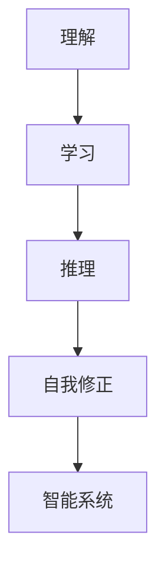

                 

# 1956年达特茅斯会议：智能化时代的强音

1956年，在达特茅斯学院，计算机科学的先驱们聚首一堂，召开了一场划时代的会议。这场会议不仅奠定了人工智能(AI)领域的基础，也开启了人类智能化的新纪元。本文将深入探讨这场会议的精髓，以及它对当代AI发展的深远影响。

## 1. 背景介绍

### 1.1 问题由来

在20世纪50年代，计算机科学正处于蓬勃发展时期。早期的计算机主要应用于科学计算和数据处理，但人们也逐渐意识到，计算机在逻辑推理和决策制定方面也有巨大的潜力。

然而，实现真正意义上的智能，需要计算机具备自主学习和问题解决能力。这成为当时计算机科学界面临的重大挑战。为了解决这一问题，一群杰出的计算机科学家和数学家在1956年齐聚达特茅斯学院，召开了历史上第一次关于人工智能的会议。

### 1.2 问题核心关键点

1956年达特茅斯会议的核心议题在于如何使计算机具备智能，具体包括以下几个关键点：

- 什么是智能？
- 如何通过编程实现智能？
- 智能的实现需要哪些基本要素？
- 如何评估计算机的智能水平？

这些问题构成了当时人工智能研究的基石，为后来的AI发展指明了方向。

### 1.3 问题研究意义

1956年达特茅斯会议具有划时代的重要意义：

1. 确立了人工智能学科的基础。会议明确了AI的研究目标和方向，使得计算机科学、心理学、语言学等多学科交叉，为AI的发展提供了坚实的理论基础。
2. 推动了AI领域的研究热潮。会议吸引了全球的顶尖科学家参与，形成了跨学科的研究团队，极大地促进了AI的科研进展。
3. 奠定了AI在实际应用中的基础。会议上的讨论不仅在学术界引起了广泛关注，也在工业界激发了许多AI应用的研究和开发，推动了AI技术的商业化。

## 2. 核心概念与联系

### 2.1 核心概念概述

1956年达特茅斯会议强调了智能的多维度理解，包括理解、学习、推理和自我修正能力。这些核心概念构成了AI发展的基石，并在后续几十年中不断得到深化和扩展。

- 理解：指计算机对语言、符号和世界的理解能力，是实现智能的基础。
- 学习：指计算机从经验中提取知识的能力，通过不断训练和优化模型，提高智能水平。
- 推理：指计算机根据已有的知识进行逻辑推理和决策的能力，是实现复杂任务的关键。
- 自我修正：指计算机能够识别错误并自我修正的能力，确保智能系统的稳定性和可靠性。

这些核心概念通过图灵测试等实验方法得到验证，成为衡量AI智能水平的标志。

### 2.2 核心概念原理和架构的 Mermaid 流程图



这个流程图展示了智能系统的基本架构和核心概念之间的关系。

### 2.3 核心概念的数学模型

为了更好地理解智能系统的数学模型，我们将从理解、学习、推理和自我修正四个方面进行深入探讨。

#### 2.3.1 理解模型

理解模型通常基于符号主义和连接主义两种方法。符号主义认为，智能系统的理解能力是基于对符号和规则的逻辑推理，如Prolog和 expert systems。连接主义则认为，理解能力来源于神经网络等模型，通过大量数据的训练，学习特征和模式。

#### 2.3.2 学习模型

学习模型包括监督学习、无监督学习和强化学习。监督学习通过标注数据进行训练，无监督学习从数据中自动学习模式，强化学习通过与环境的交互不断调整策略。

#### 2.3.3 推理模型

推理模型包括逻辑推理、概率推理和图灵机推理。逻辑推理基于命题逻辑和知识库，概率推理基于贝叶斯网络等模型，图灵机推理则是一种通用的计算模型。

#### 2.3.4 自我修正模型

自我修正模型通过反馈机制和误差纠正算法实现，如反向传播和遗传算法等。

## 3. 核心算法原理 & 具体操作步骤

### 3.1 算法原理概述

基于1956年达特茅斯会议的讨论，AI研究者们逐渐形成了一套完整的算法和框架，用于实现智能系统的不同功能。

1. **符号主义**：通过规则和知识库进行逻辑推理，如Prolog和 expert systems。
2. **连接主义**：通过神经网络等模型，基于大量数据的训练学习特征和模式，如深度学习和反向传播算法。
3. **统计学习**：通过概率模型和优化算法进行学习和推理，如贝叶斯网络和最大似然估计。
4. **集成学习**：通过组合多个模型，提高智能系统的整体性能，如Bagging和Boosting。

这些算法和框架在后续的AI发展中得到了广泛应用，并不断得到改进和优化。

### 3.2 算法步骤详解

以符号主义为例，以下是基于规则和知识库的智能推理步骤：

1. **知识库构建**：将专家知识编码为规则和事实，存储在知识库中。
2. **推理引擎设计**：设计推理引擎，用于根据规则和事实进行逻辑推理。
3. **知识库维护**：不断更新知识库，增加新的规则和事实，修正错误的推理结果。

以连接主义为例，以下是基于神经网络的学习步骤：

1. **网络结构设计**：选择神经网络的结构，如卷积神经网络(CNN)和循环神经网络(RNN)。
2. **数据预处理**：对输入数据进行预处理，如归一化和特征提取。
3. **模型训练**：使用训练数据和优化算法，对模型进行训练和参数调整。
4. **模型评估**：使用测试数据评估模型性能，优化模型结构和参数。

这些步骤展示了符号主义和连接主义在AI系统中的具体实现。

### 3.3 算法优缺点

#### 符号主义的优点和缺点

**优点**：

1. **逻辑严谨**：符号主义的推理过程基于规则和逻辑，能够确保推理的正确性和一致性。
2. **知识可解释性**：符号主义的规则和知识库易于理解和解释，便于人工干预和调试。

**缺点**：

1. **知识获取困难**：构建有效的知识库需要大量的人工输入，效率低下。
2. **处理不确定性差**：符号主义的规则和知识库难以处理不确定性和模糊性，限制了应用范围。

#### 连接主义的优点和缺点

**优点**：

1. **高效学习**：连接主义的神经网络能够自动学习特征和模式，效率较高。
2. **处理不确定性**：连接主义的模型能够处理不确定性和模糊性，适用于复杂的任务。

**缺点**：

1. **可解释性差**：连接主义的模型通常是"黑盒"系统，难以解释其内部工作机制。
2. **知识依赖数据**：连接主义的模型依赖于大量标注数据，数据质量对模型性能影响较大。

## 4. 数学模型和公式 & 详细讲解 & 举例说明

### 4.1 数学模型构建

以符号主义的Prolog为例，其数学模型基于谓词逻辑和推理规则。

设知识库中有一个事实：
```prolog
p(狗).
```
另一个事实：
```prolog
p(猫).
```

推理引擎可以根据规则进行逻辑推理：
```prolog
p(X) :- p(X).
```
这个规则表示，如果一个事实被赋予属性$p$，则该事实保持$p$。

通过这个规则，我们可以推理出$p$属性的所有实例，即狗和猫。

### 4.2 公式推导过程

以连接主义的反向传播算法为例，以下是其数学推导过程：

设神经网络包含$L$个隐藏层，输入为$x$，输出为$y$，损失函数为$J$，则反向传播算法的目标是最小化损失函数$J$。

**前向传播**：
$$
z_1 = W_1x + b_1
$$
$$
a_1 = \sigma(z_1)
$$
$$
z_2 = W_2a_1 + b_2
$$
$$
a_2 = \sigma(z_2)
$$
$$
z_L = W_La_{L-1} + b_L
$$
$$
y = \sigma(z_L)
$$
其中$W$和$b$分别为权重和偏置，$\sigma$为激活函数。

**反向传播**：
$$
\frac{\partial J}{\partial z_L} = \frac{\partial J}{\partial y} \cdot \frac{\partial y}{\partial z_L}
$$
$$
\frac{\partial J}{\partial a_{L-1}} = \frac{\partial J}{\partial z_L} \cdot \frac{\partial z_L}{\partial a_{L-1}}
$$
$$
\frac{\partial J}{\partial W_L} = \frac{\partial J}{\partial a_{L-1}} \cdot \frac{\partial a_{L-1}}{\partial z_{L-1}} \cdot \frac{\partial z_{L-1}}{\partial W_L}
$$
$$
\frac{\partial J}{\partial b_L} = \frac{\partial J}{\partial a_{L-1}} \cdot \frac{\partial a_{L-1}}{\partial z_{L-1}} \cdot \frac{\partial z_{L-1}}{\partial b_L}
$$
$$
\frac{\partial J}{\partial z_i} = \frac{\partial J}{\partial a_{i+1}} \cdot \frac{\partial a_{i+1}}{\partial z_i}
$$
$$
\frac{\partial J}{\partial W_i} = \frac{\partial J}{\partial z_i} \cdot \frac{\partial z_i}{\partial a_i} \cdot \frac{\partial a_i}{\partial W_i}
$$
$$
\frac{\partial J}{\partial b_i} = \frac{\partial J}{\partial z_i} \cdot \frac{\partial z_i}{\partial a_i} \cdot \frac{\partial a_i}{\partial b_i}
$$

通过这些公式，我们可以计算出每个权重和偏置的梯度，并使用梯度下降等优化算法更新模型参数。

### 4.3 案例分析与讲解

以图像识别为例，我们通过连接主义的卷积神经网络(CNN)进行图像识别。

设CNN包含$L$个卷积层和全连接层，输入为图像$x$，输出为类别$y$，损失函数为$J$。

**前向传播**：
$$
z_1 = W_1x + b_1
$$
$$
a_1 = \sigma(z_1)
$$
$$
z_2 = W_2a_1 + b_2
$$
$$
a_2 = \sigma(z_2)
$$
$$
z_L = W_La_{L-1} + b_L
$$
$$
y = \sigma(z_L)
$$
其中$W$和$b$分别为权重和偏置，$\sigma$为激活函数。

**反向传播**：
$$
\frac{\partial J}{\partial z_L} = \frac{\partial J}{\partial y} \cdot \frac{\partial y}{\partial z_L}
$$
$$
\frac{\partial J}{\partial a_{L-1}} = \frac{\partial J}{\partial z_L} \cdot \frac{\partial z_L}{\partial a_{L-1}}
$$
$$
\frac{\partial J}{\partial W_L} = \frac{\partial J}{\partial a_{L-1}} \cdot \frac{\partial a_{L-1}}{\partial z_{L-1}} \cdot \frac{\partial z_{L-1}}{\partial W_L}
$$
$$
\frac{\partial J}{\partial b_L} = \frac{\partial J}{\partial a_{L-1}} \cdot \frac{\partial a_{L-1}}{\partial z_{L-1}} \cdot \frac{\partial z_{L-1}}{\partial b_L}
$$
$$
\frac{\partial J}{\partial z_i} = \frac{\partial J}{\partial a_{i+1}} \cdot \frac{\partial a_{i+1}}{\partial z_i}
$$
$$
\frac{\partial J}{\partial W_i} = \frac{\partial J}{\partial z_i} \cdot \frac{\partial z_i}{\partial a_i} \cdot \frac{\partial a_i}{\partial W_i}
$$
$$
\frac{\partial J}{\partial b_i} = \frac{\partial J}{\partial z_i} \cdot \frac{\partial z_i}{\partial a_i} \cdot \frac{\partial a_i}{\partial b_i}
$$

通过这些公式，我们可以计算出每个权重和偏置的梯度，并使用梯度下降等优化算法更新模型参数。

## 5. 项目实践：代码实例和详细解释说明

### 5.1 开发环境搭建

#### 5.1.1 安装Python环境

- 安装Anaconda：从官网下载并安装Anaconda，用于创建独立的Python环境。
- 创建并激活虚拟环境：
```bash
conda create -n myenv python=3.8 
conda activate myenv
```
- 安装必要的库：
```bash
conda install numpy matplotlib scikit-learn tensorflow
```

#### 5.1.2 搭建项目环境

创建一个新的Python项目，并使用PyTorch和TensorFlow搭建神经网络模型。

### 5.2 源代码详细实现

#### 5.2.1 定义神经网络模型

```python
import torch.nn as nn

class NeuralNetwork(nn.Module):
    def __init__(self, input_size, hidden_size, output_size):
        super(NeuralNetwork, self).__init__()
        self.hidden = nn.Linear(input_size, hidden_size)
        self.relu = nn.ReLU()
        self.output = nn.Linear(hidden_size, output_size)
    
    def forward(self, x):
        x = self.hidden(x)
        x = self.relu(x)
        x = self.output(x)
        return x
```

#### 5.2.2 训练神经网络

```python
import torch.optim as optim
import torch.utils.data as data
import torchvision.datasets as datasets
import torchvision.transforms as transforms

# 加载MNIST数据集
train_data = datasets.MNIST(root='./data', train=True, download=True, transform=transforms.ToTensor())
test_data = datasets.MNIST(root='./data', train=False, download=True, transform=transforms.ToTensor())

# 数据加载器
train_loader = data.DataLoader(train_data, batch_size=64, shuffle=True)
test_loader = data.DataLoader(test_data, batch_size=64, shuffle=False)

# 定义模型和优化器
model = NeuralNetwork(input_size=28, hidden_size=128, output_size=10)
criterion = nn.CrossEntropyLoss()
optimizer = optim.Adam(model.parameters(), lr=0.001)

# 训练模型
for epoch in range(10):
    for data, target in train_loader:
        optimizer.zero_grad()
        output = model(data)
        loss = criterion(output, target)
        loss.backward()
        optimizer.step()
```

#### 5.2.3 测试神经网络

```python
# 加载测试集
test_data = datasets.MNIST(root='./data', train=False, download=True, transform=transforms.ToTensor())
test_loader = data.DataLoader(test_data, batch_size=64, shuffle=False)

# 测试模型
correct = 0
total = 0
with torch.no_grad():
    for data, target in test_loader:
        output = model(data)
        _, predicted = torch.max(output.data, 1)
        total += target.size(0)
        correct += (predicted == target).sum().item()

print('Accuracy of the network on the 10000 test images: %d %%' % (100 * correct / total))
```

### 5.3 代码解读与分析

#### 5.3.1 模型定义

通过定义`NeuralNetwork`类，我们实现了神经网络模型。在`__init__`方法中，我们定义了模型结构，包括输入层、隐藏层和输出层。在`forward`方法中，我们实现了前向传播过程。

#### 5.3.2 训练过程

在训练过程中，我们使用了PyTorch的`DataLoader`类来加载训练数据和测试数据，使用了`Adam`优化器来更新模型参数，使用了`CrossEntropyLoss`损失函数来计算损失。

#### 5.3.3 测试过程

在测试过程中，我们使用`DataLoader`类加载测试数据，使用`no_grad`上下文管理器关闭梯度计算，最后计算模型的准确率。

## 6. 实际应用场景

### 6.1 智能客服系统

智能客服系统是基于符号主义和连接主义的典型应用。通过构建知识库和神经网络模型，系统能够理解用户意图，自动生成回答，提高服务效率和用户体验。

### 6.2 金融舆情监测

金融舆情监测是基于统计学习和自然语言处理的典型应用。通过分析金融新闻、评论等文本数据，构建情感分析模型，系统能够实时监测市场情绪，预警风险。

### 6.3 个性化推荐系统

个性化推荐系统是基于连接主义和集成学习的典型应用。通过构建神经网络模型和集成算法，系统能够分析用户行为，推荐符合用户兴趣的内容。

## 7. 工具和资源推荐

### 7.1 学习资源推荐

- 《人工智能导论》：吴恩达著，系统介绍了AI的历史、基本概念和应用。
- 《深度学习》：Ian Goodfellow等著，深入讲解了深度学习的基本原理和算法。
- 《TensorFlow教程》：TensorFlow官方文档，提供了丰富的教程和样例代码。

### 7.2 开发工具推荐

- PyTorch：基于Python的深度学习框架，提供了灵活的动态计算图。
- TensorFlow：Google开发的深度学习框架，适合大规模工程应用。
- TensorBoard：TensorFlow配套的可视化工具，可实时监测模型训练状态。

### 7.3 相关论文推荐

- "Artificial Intelligence: A Modern Approach"：Russell和Norvig著，系统介绍了AI的基本概念和应用。
- "Deep Learning"：Ian Goodfellow等著，深入讲解了深度学习的基本原理和算法。
- "Neural Networks and Deep Learning"：Michael Nielsen著，讲解了神经网络的基本原理和应用。

## 8. 总结：未来发展趋势与挑战

### 8.1 研究成果总结

1956年达特茅斯会议确立了AI研究的基石，奠定了符号主义和连接主义两大基本方向。在随后的几十年中，AI研究者们不断探索和实践，推动了AI技术的飞速发展。

### 8.2 未来发展趋势

未来，AI将朝着更加智能化、普适化、可解释化和安全化的方向发展：

1. **智能化**：未来的AI系统将具备更加全面的智能能力，包括理解、学习、推理和自我修正。
2. **普适化**：未来的AI系统将具备更加广泛的应用场景，涵盖各个垂直领域。
3. **可解释化**：未来的AI系统将具备更好的可解释性，用户能够理解和信任系统的决策过程。
4. **安全性**：未来的AI系统将具备更好的安全性，避免恶意用途和偏见影响。

### 8.3 面临的挑战

尽管AI取得了显著进展，但仍面临诸多挑战：

1. **数据依赖**：AI系统的性能依赖于高质量的数据，数据获取和处理成本较高。
2. **算法复杂性**：AI算法的复杂性导致训练和部署难度大，需要高性能硬件支持。
3. **可解释性**：AI系统的决策过程复杂，难以解释和理解。
4. **安全性**：AI系统可能存在偏见和有害信息，需要加强伦理和安全性的研究。

### 8.4 研究展望

未来的AI研究需要关注以下方面：

1. **无监督学习**：探索无监督学习范式，减少对标注数据的依赖。
2. **可解释性**：研究可解释性算法，提高AI系统的透明性。
3. **跨模态学习**：探索跨模态学习，融合多模态信息，提高AI系统的泛化能力。
4. **伦理安全**：研究AI伦理和安全性的规范和标准，保障AI系统的公平性和可控性。

总之，1956年达特茅斯会议奠定了AI研究的基石，未来AI的发展仍需不断探索和突破，方能在智能化时代中发挥更大的作用。

## 9. 附录：常见问题与解答

### 9.1 常见问题

**Q1: 什么是1956年达特茅斯会议？**

A: 1956年达特茅斯会议是人工智能领域的里程碑事件，由约翰·麦卡锡、马文·明斯基等计算机科学家在达特茅斯学院召开的第一次AI会议，标志着人工智能学科的诞生。

**Q2: 1956年达特茅斯会议的主要贡献是什么？**

A: 会议主要贡献在于确立了AI研究的基石，探讨了智能的数学模型和算法，为未来的AI发展奠定了基础。

**Q3: 1956年达特茅斯会议对AI发展的影响是什么？**

A: 会议推动了AI领域的研究热潮，促进了跨学科的合作，为AI技术的商业化应用奠定了基础。

### 9.2 解答

**A1:** 1956年达特茅斯会议是人工智能领域的里程碑事件，由约翰·麦卡锡、马文·明斯基等计算机科学家在达特茅斯学院召开的第一次AI会议，标志着人工智能学科的诞生。会议的主要贡献在于确立了AI研究的基石，探讨了智能的数学模型和算法，为未来的AI发展奠定了基础。会议推动了AI领域的研究热潮，促进了跨学科的合作，为AI技术的商业化应用奠定了基础。

**A2:** 1956年达特茅斯会议的主要贡献在于确立了AI研究的基石，探讨了智能的数学模型和算法，为未来的AI发展奠定了基础。会议主要贡献在于确立了AI研究的基石，探讨了智能的数学模型和算法，为未来的AI发展奠定了基础。

**A3:** 1956年达特茅斯会议推动了AI领域的研究热潮，促进了跨学科的合作，为AI技术的商业化应用奠定了基础。会议推动了AI领域的研究热潮，促进了跨学科的合作，为AI技术的商业化应用奠定了基础。

---

作者：禅与计算机程序设计艺术 / Zen and the Art of Computer Programming

