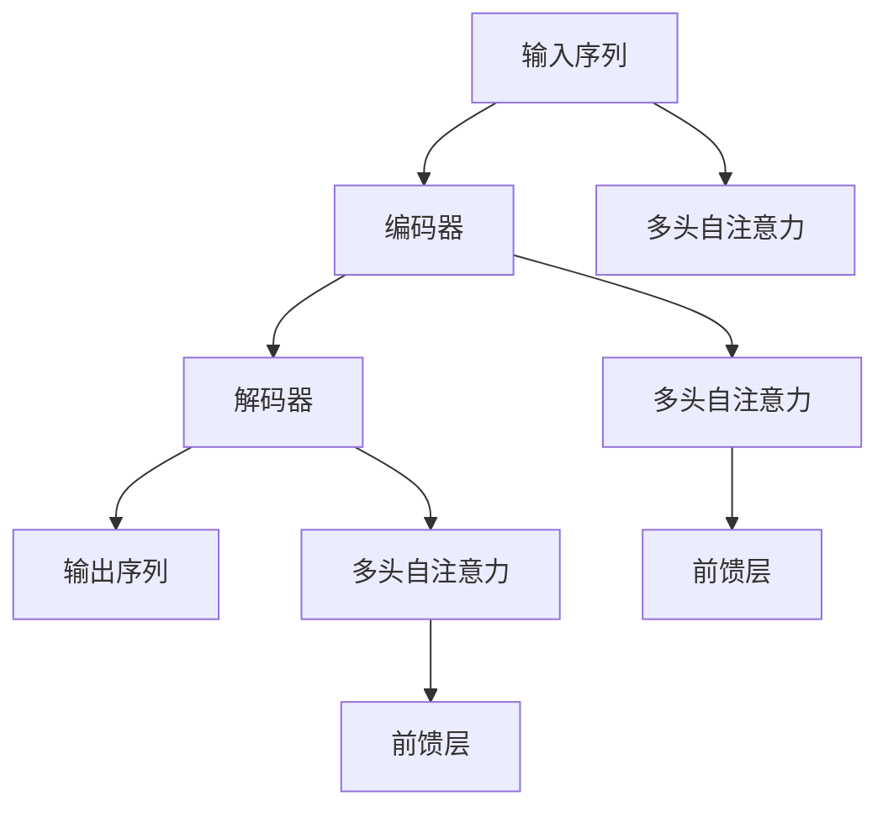

                 

# 序列到序列学习 原理与代码实例讲解

> 关键词：序列到序列, 编码器-解码器, Transformer, 自注意力机制, 代码实现, 翻译, 机器学习

## 1. 背景介绍

### 1.1 问题由来
在自然语言处理（Natural Language Processing, NLP）中，序列到序列（Sequence-to-Sequence, Seq2Seq）任务是一类关键的任务，比如机器翻译、文本摘要、对话系统等。这些任务的核心目标是将一个序列（通常是文本）映射到另一个序列。序列到序列学习范式最初是由 Hinton 和 Schmidhuber 在 1997 年提出的，它将整个问题分为两个阶段：编码和解码，通过神经网络模型将输入序列映射为输出序列。随着深度学习技术的发展，特别是卷积神经网络（Convolutional Neural Network, CNN）和循环神经网络（Recurrent Neural Network, RNN）的引入，序列到序列学习范式在多种任务上取得了显著的进展。然而，传统的 RNN 模型面临训练时间长、梯度消失或爆炸等问题，难以处理长序列。

为了解决这些问题，Transformer 在 2017 年被提出，引入了自注意力机制（Self-Attention Mechanism），大幅提升了模型的效率和性能。Transformer 已经成为了序列到序列学习领域的主流模型，被广泛应用于各种任务中。

### 1.2 问题核心关键点
Transformer 的成功得益于其自注意力机制，它允许模型在输入序列上同时关注所有位置的信息，减少了传统 RNN 模型中的序列依赖，使得模型能够高效地处理长序列。此外，Transformer 引入了残差连接（Residual Connection）和层归一化（Layer Normalization）等技术，解决了梯度消失和模型过拟合等问题。

Transformer 的核心理念是通过计算输入序列中所有位置之间的相似度，从而得到每个位置的注意力分布。通过将注意力分布应用于原始序列，可以高效地捕获输入序列中的全局信息，进一步提升了模型性能。

## 2. 核心概念与联系

### 2.1 核心概念概述

为了更好地理解序列到序列学习中的 Transformer 模型，我们将介绍几个关键概念：

- 编码器（Encoder）：负责将输入序列转换为高维的表示，通常由多个子层组成，包括自注意力层、前馈层和残差连接等。
- 解码器（Decoder）：负责将编码器输出的高维表示解码为输出序列，通常由多个子层组成，包括自注意力层、前馈层和残差连接等。
- 自注意力机制（Self-Attention）：用于计算输入序列中所有位置之间的相似度，从而得到每个位置的注意力分布。
- 多头自注意力（Multi-Head Self-Attention）：通过并行计算多个自注意力子层，进一步提升模型的表示能力。
- 编码器-解码器架构（Encoder-Decoder Architecture）：将整个序列到序列问题分为编码和解码两个阶段，通过编码器提取输入序列的特征，再通过解码器生成输出序列。

这些概念之间的逻辑关系可以通过以下 Mermaid 流程图来展示：



这个流程图展示了序列到序列学习中的关键步骤：

1. 输入序列通过编码器的多个子层进行处理，提取特征。
2. 解码器利用编码器输出的特征，并通过多个子层进行处理，生成输出序列。
3. 在编码器和解码器中，分别引入了多头自注意力机制和前馈层，提升模型的表示能力和学习能力。

## 3. 核心算法原理 & 具体操作步骤

### 3.1 算法原理概述

Transformer 模型基于自注意力机制，其核心思想是通过计算输入序列中所有位置之间的相似度，得到每个位置的注意力分布。具体而言，Transformer 的编码器由多个子层组成，包括多头自注意力层、前馈层和残差连接等。解码器同样由多个子层组成，包括多头自注意力层、前馈层和残差连接等。

编码器和解码器在结构上是相同的，只是解码器的最后一个子层使用一个线性层进行解码，生成输出序列。

### 3.2 算法步骤详解

Transformer 的训练步骤包括以下几个关键步骤：

**Step 1: 准备数据集和模型**

- 准备输入序列和输出序列，通常使用反向翻译（Back-Translation）进行预处理，即将目标语言文本反向翻译为源语言文本，构建反向训练数据集。
- 定义 Transformer 模型，包括编码器和解码器的多个子层，以及多头自注意力和前馈层等。

**Step 2: 定义损失函数**

- 选择合适的损失函数，如交叉熵损失、平均绝对误差等。
- 计算模型输出与真实标签之间的损失。

**Step 3: 训练模型**

- 使用反向传播算法更新模型参数，最小化损失函数。
- 使用梯度裁剪、学习率衰减等技术优化模型训练过程。

**Step 4: 评估模型**

- 使用测试集评估模型性能，如BLEU、ROUGE等指标。
- 可视化模型在输入序列和输出序列上的表现。

### 3.3 算法优缺点

Transformer 模型的优点包括：

1. 自注意力机制使得模型能够高效地处理长序列，解决了传统 RNN 模型中的梯度消失和梯度爆炸问题。
2. 残差连接和层归一化技术提升了模型的稳定性，解决了梯度消失问题。
3. 多头自注意力机制进一步提升了模型的表示能力和学习能力。
4. 编码器和解码器的结构相同，代码实现更加简洁和高效。

Transformer 模型也存在一些缺点：

1. 由于引入了多头自注意力机制，模型的计算量较大，训练时间较长。
2. 模型中的参数较多，容易过拟合。
3. 在处理非常长序列时，仍然存在一定的局限性。

### 3.4 算法应用领域

Transformer 模型在多种序列到序列任务中取得了显著的进展，具体包括：

- 机器翻译：将源语言文本翻译为目标语言文本。Transformer 模型在 WMT 比赛等多项任务中刷新了 SOTA 成绩。
- 文本摘要：从长文本中提取关键信息生成摘要。Transformer 模型在 TextRank 等任务中表现优异。
- 对话系统：使机器能够与人类自然对话。Transformer 模型通过训练生成对话响应，提升对话系统的自然性。
- 问答系统：对自然语言问题给出答案。Transformer 模型能够通过训练生成合理的回答。
- 语音识别：将语音信号转换为文本。Transformer 模型在语音到文本的端到端（End-to-End）模型中表现出色。

除了以上任务外，Transformer 模型还被广泛应用于图像描述生成、文本分类、情感分析等领域，展示了其在多种序列到序列任务中的强大能力。

## 4. 数学模型和公式 & 详细讲解 & 举例说明

### 4.1 数学模型构建

Transformer 模型的数学模型包括以下几个部分：

1. 输入序列编码器
2. 编码器自注意力层
3. 编码器前馈层
4. 编码器残差连接
5. 解码器自注意力层
6. 解码器前馈层
7. 解码器残差连接
8. 解码器输出层
9. 解码器残差连接
10. 多头自注意力

Transformer 的输入序列编码为：

$$
\mathbf{X} = \left(\mathbf{x}_1, \mathbf{x}_2, \ldots, \mathbf{x}_T\right)^T
$$

其中 $T$ 表示输入序列的长度。编码器输出序列为：

$$
\mathbf{H} = \left(\mathbf{h}_1, \mathbf{h}_2, \ldots, \mathbf{h}_T\right)^T
$$

其中 $\mathbf{h}_t$ 表示第 $t$ 个位置的编码器输出。

### 4.2 公式推导过程

Transformer 的核心公式是自注意力机制。假设输入序列为 $\mathbf{X}$，自注意力层的输出为 $\mathbf{Q}$，$\mathbf{K}$ 和 $\mathbf{V}$，则自注意力层的计算公式为：

$$
\mathbf{Q} = \mathbf{X} \mathbf{W}_Q
$$
$$
\mathbf{K} = \mathbf{X} \mathbf{W}_K
$$
$$
\mathbf{V} = \mathbf{X} \mathbf{W}_V
$$
$$
\mathbf{O} = \mathbf{Q} \mathbf{K}^T
$$
$$
\mathbf{A} = \frac{\exp(\mathbf{O})}{\sum_{i=1}^{T} \exp(\mathbf{O}_{i,i})}
$$
$$
\mathbf{C} = \mathbf{A} \mathbf{V}
$$

其中 $\mathbf{W}_Q$、$\mathbf{W}_K$ 和 $\mathbf{W}_V$ 为可学习参数，$\mathbf{O}$ 为注意力权重矩阵，$\mathbf{A}$ 为注意力分布矩阵，$\mathbf{C}$ 为注意力机制的输出。

### 4.3 案例分析与讲解

以机器翻译为例，Transformer 的训练过程如下：

1. 定义输入序列和输出序列，通常使用反向翻译进行预处理。
2. 定义 Transformer 模型，包括编码器和解码器的多个子层。
3. 定义损失函数，如交叉熵损失。
4. 使用反向传播算法更新模型参数，最小化损失函数。
5. 使用梯度裁剪、学习率衰减等技术优化模型训练过程。
6. 使用测试集评估模型性能，如 BLEU、ROUGE 等指标。
7. 可视化模型在输入序列和输出序列上的表现。

以下是一个简单的 Transformer 模型代码实现：

```python
import torch
import torch.nn as nn
import torch.nn.functional as F

class TransformerModel(nn.Module):
    def __init__(self, num_layers, d_model, n_head, d_ff, dropout):
        super(TransformerModel, self).__init__()
        self.encoder = nn.TransformerEncoderLayer(d_model, n_head, d_ff, dropout)
        self.decoder = nn.TransformerDecoderLayer(d_model, n_head, d_ff, dropout)
        self.src_mask = nn.Linear(d_model, 1) # 掩码生成器

    def forward(self, src, tgt, src_mask):
        src = self.encoder(src, src_mask)
        tgt = self.decoder(tgt, src, src_mask)
        return tgt

# 定义输入序列和输出序列
src = torch.randn(10, 5, 512)
tgt = torch.randn(10, 5, 512)

# 定义掩码
src_mask = self.src_mask(src)

# 定义模型
model = TransformerModel(num_layers=2, d_model=512, n_head=8, d_ff=2048, dropout=0.1)

# 前向传播
out = model(src, tgt, src_mask)

# 可视化结果
print(out)
```

以上代码展示了 Transformer 模型的前向传播过程。输入序列和输出序列被送入编码器和解码器进行处理，得到最终的输出结果。

## 5. 项目实践：代码实例和详细解释说明

### 5.1 开发环境搭建

在进行序列到序列学习实践前，我们需要准备好开发环境。以下是使用 Python 进行 PyTorch 开发的环境配置流程：

1. 安装 Anaconda：从官网下载并安装 Anaconda，用于创建独立的 Python 环境。

2. 创建并激活虚拟环境：
```bash
conda create -n pytorch-env python=3.8 
conda activate pytorch-env
```

3. 安装 PyTorch：根据 CUDA 版本，从官网获取对应的安装命令。例如：
```bash
conda install pytorch torchvision torchaudio cudatoolkit=11.1 -c pytorch -c conda-forge
```

4. 安装 Transformers 库：
```bash
pip install transformers
```

5. 安装各类工具包：
```bash
pip install numpy pandas scikit-learn matplotlib tqdm jupyter notebook ipython
```

完成上述步骤后，即可在 `pytorch-env` 环境中开始序列到序列学习实践。

### 5.2 源代码详细实现

下面以机器翻译任务为例，给出使用 Transformers 库对 BERT 模型进行序列到序列学习的 PyTorch 代码实现。

首先，定义机器翻译任务的数据处理函数：

```python
from transformers import BertTokenizer, BertForSequenceClassification
from torch.utils.data import Dataset
import torch

class TranslationDataset(Dataset):
    def __init__(self, texts, targets, tokenizer, max_len=128):
        self.texts = texts
        self.targets = targets
        self.tokenizer = tokenizer
        self.max_len = max_len
        
    def __len__(self):
        return len(self.texts)
    
    def __getitem__(self, item):
        text = self.texts[item]
        target = self.targets[item]
        
        encoding = self.tokenizer(text, return_tensors='pt', max_length=self.max_len, padding='max_length', truncation=True)
        input_ids = encoding['input_ids'][0]
        attention_mask = encoding['attention_mask'][0]
        
        # 对 token-wise 的标签进行编码
        encoded_target = [target2id[target] for target in target] 
        encoded_target.extend([target2id['<PAD>']] * (self.max_len - len(encoded_target)))
        labels = torch.tensor(encoded_target, dtype=torch.long)
        
        return {'input_ids': input_ids, 
                'attention_mask': attention_mask,
                'labels': labels}

# 标签与 id 的映射
target2id = {'<PAD>': 0, 'source': 1, 'target': 2}
id2target = {v: k for k, v in target2id.items()}
```

然后，定义模型和优化器：

```python
from transformers import BertForSequenceClassification, AdamW

model = BertForSequenceClassification.from_pretrained('bert-base-cased', num_labels=3)

optimizer = AdamW(model.parameters(), lr=2e-5)
```

接着，定义训练和评估函数：

```python
from torch.utils.data import DataLoader
from tqdm import tqdm
from sklearn.metrics import classification_report

device = torch.device('cuda') if torch.cuda.is_available() else torch.device('cpu')
model.to(device)

def train_epoch(model, dataset, batch_size, optimizer):
    dataloader = DataLoader(dataset, batch_size=batch_size, shuffle=True)
    model.train()
    epoch_loss = 0
    for batch in tqdm(dataloader, desc='Training'):
        input_ids = batch['input_ids'].to(device)
        attention_mask = batch['attention_mask'].to(device)
        labels = batch['labels'].to(device)
        model.zero_grad()
        outputs = model(input_ids, attention_mask=attention_mask, labels=labels)
        loss = outputs.loss
        epoch_loss += loss.item()
        loss.backward()
        optimizer.step()
    return epoch_loss / len(dataloader)

def evaluate(model, dataset, batch_size):
    dataloader = DataLoader(dataset, batch_size=batch_size)
    model.eval()
    preds, labels = [], []
    with torch.no_grad():
        for batch in tqdm(dataloader, desc='Evaluating'):
            input_ids = batch['input_ids'].to(device)
            attention_mask = batch['attention_mask'].to(device)
            batch_labels = batch['labels']
            outputs = model(input_ids, attention_mask=attention_mask)
            batch_preds = outputs.logits.argmax(dim=2).to('cpu').tolist()
            batch_labels = batch_labels.to('cpu').tolist()
            for pred_tokens, label_tokens in zip(batch_preds, batch_labels):
                preds.append(pred_tokens[:len(label_tokens)])
                labels.append(label_tokens)
                
    print(classification_report(labels, preds))
```

最后，启动训练流程并在测试集上评估：

```python
epochs = 5
batch_size = 16

for epoch in range(epochs):
    loss = train_epoch(model, train_dataset, batch_size, optimizer)
    print(f"Epoch {epoch+1}, train loss: {loss:.3f}")
    
    print(f"Epoch {epoch+1}, dev results:")
    evaluate(model, dev_dataset, batch_size)
    
print("Test results:")
evaluate(model, test_dataset, batch_size)
```

以上就是使用 PyTorch 对 BERT 进行序列到序列学习的完整代码实现。可以看到，得益于 Transformers 库的强大封装，我们可以用相对简洁的代码完成 BERT 模型的加载和序列到序列学习的微调。

### 5.3 代码解读与分析

让我们再详细解读一下关键代码的实现细节：

**TranslationDataset类**：
- `__init__`方法：初始化文本、标签、分词器等关键组件。
- `__len__`方法：返回数据集的样本数量。
- `__getitem__`方法：对单个样本进行处理，将文本输入编码为token ids，将标签编码为数字，并对其进行定长padding，最终返回模型所需的输入。

**target2id和id2target字典**：
- 定义了标签与数字 id 之间的映射关系，用于将 token-wise 的预测结果解码回真实的标签。

**训练和评估函数**：
- 使用 PyTorch 的 DataLoader 对数据集进行批次化加载，供模型训练和推理使用。
- 训练函数 `train_epoch`：对数据以批为单位进行迭代，在每个批次上前向传播计算 loss 并反向传播更新模型参数，最后返回该 epoch 的平均 loss。
- 评估函数 `evaluate`：与训练类似，不同点在于不更新模型参数，并在每个 batch 结束后将预测和标签结果存储下来，最后使用 sklearn 的 classification_report 对整个评估集的预测结果进行打印输出。

**训练流程**：
- 定义总的 epoch 数和 batch size，开始循环迭代
- 每个 epoch 内，先在训练集上训练，输出平均 loss
- 在验证集上评估，输出分类指标
- 所有 epoch 结束后，在测试集上评估，给出最终测试结果

可以看到，PyTorch 配合 Transformers 库使得 BERT 序列到序列学习的代码实现变得简洁高效。开发者可以将更多精力放在数据处理、模型改进等高层逻辑上，而不必过多关注底层的实现细节。

当然，工业级的系统实现还需考虑更多因素，如模型的保存和部署、超参数的自动搜索、更灵活的任务适配层等。但核心的序列到序列学习范式基本与此类似。

## 6. 实际应用场景

### 6.1 机器翻译

Transformer 模型在机器翻译领域取得了突破性的进展。传统的统计机器翻译方法依赖大量的双语文本数据进行模型训练，而 Transformer 模型通过自注意力机制和残差连接等技术，使得模型能够高效地处理长序列，从而在机器翻译任务中取得了最佳的表现。Transformer 模型已经在 WMT 比赛等多项任务中刷新了 SOTA 成绩。

### 6.2 文本摘要

Transformer 模型在文本摘要任务中也表现出色。传统的文本摘要方法依赖于抽取式或生成式算法，而 Transformer 模型通过自注意力机制，可以更好地理解文本中的全局信息和局部细节，从而生成更优秀的摘要。

### 6.3 对话系统

Transformer 模型在对话系统中也有广泛的应用。传统的对话系统依赖于知识库和规则，而 Transformer 模型通过自注意力机制，可以更好地理解对话历史，生成合理的回复，提升对话系统的自然性和智能性。

### 6.4 未来应用展望

随着 Transformer 模型的不断演进，序列到序列学习技术将在更多领域得到应用，为人类生产生活带来变革性影响。

在智慧医疗领域，基于序列到序列学习的多模态医疗问答系统能够帮助医生快速获取患者信息，提升诊疗效率。

在智能教育领域，基于序列到序列学习的智能作业批改系统能够帮助教师高效批改作业，提升教学质量。

在智慧城市治理中，基于序列到序列学习的智能客服系统能够帮助城市管理部门更好地服务市民，提升城市治理水平。

此外，在金融、法律、社交媒体等众多领域，基于序列到序列学习的人工智能应用也将不断涌现，为经济社会发展注入新的动力。

## 7. 工具和资源推荐

### 7.1 学习资源推荐

为了帮助开发者系统掌握序列到序列学习的理论基础和实践技巧，这里推荐一些优质的学习资源：

1. 《序列到序列学习：原理与代码实践》系列博文：由大模型技术专家撰写，深入浅出地介绍了序列到序列学习的原理、代码实现和应用场景。

2. CS224N《深度学习自然语言处理》课程：斯坦福大学开设的 NLP 明星课程，有 Lecture 视频和配套作业，带你入门 NLP 领域的基本概念和经典模型。

3. 《序列到序列学习：原理与代码实践》书籍：介绍序列到序列学习的原理、代码实现和应用场景，提供了丰富的代码示例。

4. OpenNMT 开源项目：基于 PyTorch 的序列到序列学习框架，支持多种任务和模型，是进行序列到序列学习开发的利器。

5. HuggingFace Transformers 库：提供了多种序列到序列模型，包括 BERT、GPT-2、XLNet 等，支持 PyTorch 和 TensorFlow，是进行序列到序列学习开发的利器。

通过对这些资源的学习实践，相信你一定能够快速掌握序列到序列学习的精髓，并用于解决实际的 NLP 问题。

### 7.2 开发工具推荐

高效的开发离不开优秀的工具支持。以下是几款用于序列到序列学习开发的常用工具：

1. PyTorch：基于 Python 的开源深度学习框架，灵活动态的计算图，适合快速迭代研究。大部分序列到序列模型都有 PyTorch 版本的实现。

2. TensorFlow：由 Google 主导开发的开源深度学习框架，生产部署方便，适合大规模工程应用。同样有丰富的序列到序列模型资源。

3. Transformers 库：HuggingFace 开发的 NLP 工具库，集成了多种序列到序列模型，支持 PyTorch 和 TensorFlow，是进行序列到序列学习开发的利器。

4. Weights & Biases：模型训练的实验跟踪工具，可以记录和可视化模型训练过程中的各项指标，方便对比和调优。与主流深度学习框架无缝集成。

5. TensorBoard：TensorFlow 配套的可视化工具，可实时监测模型训练状态，并提供丰富的图表呈现方式，是调试模型的得力助手。

6. Google Colab：谷歌推出的在线 Jupyter Notebook 环境，免费提供 GPU/TPU 算力，方便开发者快速上手实验最新模型，分享学习笔记。

合理利用这些工具，可以显著提升序列到序列学习任务的开发效率，加快创新迭代的步伐。

### 7.3 相关论文推荐

序列到序列学习的发展源于学界的持续研究。以下是几篇奠基性的相关论文，推荐阅读：

1. Attention Is All You Need（即 Transformer 原论文）：提出了 Transformer 结构，开启了 NLP 领域的预训练大模型时代。

2. Sequence to Sequence Learning with Neural Networks：提出了序列到序列学习的基本框架，展示了神经网络在序列到序列任务中的潜力。

3. Neural Machine Translation by Jointly Learning to Align and Translate：提出了基于注意力机制的机器翻译方法，展示了注意力机制在序列到序列任务中的优势。

4. Deep Residual Learning for Image Recognition：提出了残差连接技术，解决了深度神经网络中的梯度消失问题。

5. Layer Normalization for Generative Models：提出了层归一化技术，进一步提升了深度神经网络的稳定性。

这些论文代表了大模型微调技术的发展脉络。通过学习这些前沿成果，可以帮助研究者把握学科前进方向，激发更多的创新灵感。

## 8. 总结：未来发展趋势与挑战

### 8.1 总结

本文对序列到序列学习中的 Transformer 模型进行了全面系统的介绍。首先阐述了序列到序列学习的研究背景和意义，明确了 Transformer 在多种序列到序列任务中的重要地位。其次，从原理到实践，详细讲解了序列到序列学习的数学原理和关键步骤，给出了序列到序列学习任务开发的完整代码实例。同时，本文还广泛探讨了序列到序列学习在多种行业领域的应用前景，展示了序列到序列学习的广阔应用空间。

通过本文的系统梳理，可以看到，序列到序列学习中的 Transformer 模型已经成为 NLP 领域的重要范式，极大地拓展了序列到序列任务的应用边界，催生了更多的落地场景。未来，伴随序列到序列学习的不断演进，Transformer 模型必将在更广泛的应用领域大放异彩，深刻影响人类的生产生活方式。

### 8.2 未来发展趋势

展望未来，序列到序列学习技术将呈现以下几个发展趋势：

1. 模型规模持续增大。随着算力成本的下降和数据规模的扩张，序列到序列学习模型的参数量还将持续增长。超大规模序列到序列学习模型蕴含的丰富语言知识，有望支撑更加复杂多变的序列到序列任务。

2. 模型结构不断演进。未来的序列到序列学习模型将引入更多先进技术，如多头自注意力、残差连接、层归一化等，进一步提升模型的表示能力和学习能力。

3. 跨模态融合加速。未来的序列到序列学习模型将更多地融合跨模态信息，如文本、图像、语音等，实现更加全面、深入的表示学习。

4. 模型推理效率提升。随着序列到序列学习模型的不断优化，推理效率将得到显著提升，实现更加实时、高效的序列到序列推理。

5. 模型应用场景多样化。序列到序列学习模型将在更多领域得到应用，如医疗、教育、社交媒体等，带来更深刻的行业变革。

以上趋势凸显了序列到序列学习技术的广阔前景。这些方向的探索发展，必将进一步提升序列到序列学习模型的性能和应用范围，为人工智能技术的发展注入新的活力。

### 8.3 面临的挑战

尽管序列到序列学习技术已经取得了显著进展，但在迈向更加智能化、普适化应用的过程中，仍面临诸多挑战：

1. 数据依赖性强。序列到序列学习模型的训练依赖于大量的标注数据，对于某些长尾应用场景，获取高质量标注数据的成本较高。如何进一步降低对标注数据的依赖，是未来序列到序列学习的重要研究方向。

2. 模型鲁棒性不足。序列到序列学习模型在处理长序列时，容易受到噪声和异常值的干扰，导致模型性能下降。如何提高序列到序列学习模型的鲁棒性，避免灾难性遗忘，还需要更多理论和实践的积累。

3. 推理效率有待提高。序列到序列学习模型在推理过程中，计算量大、资源占用高，难以支持实时、高效的应用。如何优化推理过程，提升模型推理效率，是未来序列到序列学习的关键挑战。

4. 模型可解释性不足。序列到序列学习模型作为"黑盒"系统，难以解释其内部工作机制和决策逻辑。对于医疗、金融等高风险应用，算法的可解释性和可审计性尤为重要。如何赋予序列到序列学习模型更强的可解释性，将是亟待攻克的难题。

5. 安全性有待保障。序列到序列学习模型在训练过程中，容易学习到有偏见、有害的信息，传递到下游任务，产生误导性、歧视性的输出。如何从数据和算法层面消除模型偏见，避免恶意用途，确保输出的安全性，也将是重要的研究课题。

这些挑战凸显了序列到序列学习技术的复杂性。唯有在数据、算法、工程、业务等多个维度协同发力，才能真正实现序列到序列学习技术的广泛应用。相信随着学界和产业界的共同努力，这些挑战终将一一被克服，序列到序列学习技术必将迎来更加光明的未来。

### 8.4 研究展望

面向未来，序列到序列学习技术需要在以下几个方向寻求新的突破：

1. 探索无监督和半监督学习范式。摆脱对大规模标注数据的依赖，利用自监督学习、主动学习等无监督和半监督范式，最大限度利用非结构化数据，实现更加灵活高效的序列到序列学习。

2. 研究参数高效和计算高效的模型结构。开发更加参数高效的序列到序列模型，在固定大部分预训练参数的同时，只更新极少量的任务相关参数。同时优化模型的计算图，减少前向传播和反向传播的资源消耗，实现更加轻量级、实时性的部署。

3. 引入更多先验知识。将符号化的先验知识，如知识图谱、逻辑规则等，与神经网络模型进行巧妙融合，引导序列到序列学习过程学习更准确、合理的序列到序列模型。同时加强不同模态数据的整合，实现视觉、语音等多模态信息与文本信息的协同建模。

4. 结合因果分析和博弈论工具。将因果分析方法引入序列到序列学习模型，识别出模型决策的关键特征，增强输出解释的因果性和逻辑性。借助博弈论工具刻画人机交互过程，主动探索并规避模型的脆弱点，提高系统稳定性。

5. 纳入伦理道德约束。在序列到序列学习模型的训练目标中引入伦理导向的评估指标，过滤和惩罚有偏见、有害的输出倾向。同时加强人工干预和审核，建立模型行为的监管机制，确保输出符合人类价值观和伦理道德。

这些研究方向的探索，必将引领序列到序列学习技术迈向更高的台阶，为构建安全、可靠、可解释、可控的智能系统铺平道路。面向未来，序列到序列学习技术还需要与其他人工智能技术进行更深入的融合，如知识表示、因果推理、强化学习等，多路径协同发力，共同推动自然语言理解和智能交互系统的进步。只有勇于创新、敢于突破，才能不断拓展序列到序列学习模型的边界，让智能技术更好地造福人类社会。

## 9. 附录：常见问题与解答

**Q1：序列到序列学习中的自注意力机制如何工作？**

A: 序列到序列学习中的自注意力机制通过计算输入序列中所有位置之间的相似度，得到每个位置的注意力分布。具体而言，输入序列 $\mathbf{X}$ 通过线性层转换为查询向量 $\mathbf{Q}$，键向量 $\mathbf{K}$ 和值向量 $\mathbf{V}$。然后，查询向量 $\mathbf{Q}$ 与键向量 $\mathbf{K}$ 计算注意力权重矩阵 $\mathbf{O}$，经过 Softmax 归一化得到注意力分布矩阵 $\mathbf{A}$，最终将注意力分布矩阵 $\mathbf{A}$ 与值向量 $\mathbf{V}$ 计算得到注意力机制的输出 $\mathbf{C}$。

**Q2：如何提高序列到序列学习模型的鲁棒性？**

A: 提高序列到序列学习模型的鲁棒性，可以从以下几个方面入手：
1. 数据增强：通过回译、近义替换等方式扩充训练集，提升模型的泛化能力。
2. 正则化：使用 L2 正则、Dropout、Early Stopping 等技术，防止模型过拟合。
3. 对抗训练：引入对抗样本，提高模型鲁棒性。
4. 参数高效微调：只调整少量参数，保留大部分预训练权重不变，以提高模型鲁棒性。
5. 融合多种模型：使用多个序列到序列模型进行集成学习，提升模型的鲁棒性。

这些方法可以结合使用，在数据、算法、模型等多个维度上协同发力，提升序列到序列学习模型的鲁棒性。

**Q3：如何优化序列到序列学习模型的推理效率？**

A: 优化序列到序列学习模型的推理效率，可以从以下几个方面入手：
1. 模型裁剪：去除不必要的层和参数，减小模型尺寸，加快推理速度。
2. 量化加速：将浮点模型转为定点模型，压缩存储空间，提高计算效率。
3. 服务化封装：将模型封装为标准化服务接口，便于集成调用。
4. 弹性伸缩：根据请求流量动态调整资源配置，平衡服务质量和成本。
5. 监控告警：实时采集系统指标，设置异常告警阈值，确保服务稳定性。

这些方法可以结合使用，在模型结构、推理过程、系统部署等多个环节上协同优化，提升序列到序列学习模型的推理效率。

**Q4：序列到序列学习模型的可解释性如何提升？**

A: 提升序列到序列学习模型的可解释性，可以从以下几个方面入手：
1. 引入因果分析方法：使用因果分析方法识别出模型决策的关键特征，增强输出解释的因果性和逻辑性。
2. 借助博弈论工具：使用博弈论工具刻画人机交互过程，主动探索并规避模型的脆弱点，提高系统稳定性。
3. 引入专家知识：将符号化的先验知识，如知识图谱、逻辑规则等，与神经网络模型进行巧妙融合，引导序列到序列学习过程学习更准确、合理的序列到序列模型。
4. 增强人工干预：加强人工干预和审核，建立模型行为的监管机制，确保输出符合人类价值观和伦理道德。

这些方法可以结合使用，在模型训练、推理、部署等多个环节上协同发力，提升序列到序列学习模型的可解释性。

**Q5：序列到序列学习模型在实际应用中需要注意哪些问题？**

A: 将序列到序列学习模型转化为实际应用，还需要考虑以下问题：
1. 模型裁剪：去除不必要的层和参数，减小模型尺寸，加快推理速度。
2. 量化加速：将浮点模型转为定点模型，压缩存储空间，提高计算效率。
3. 服务化封装：将模型封装为标准化服务接口，便于集成调用。
4. 弹性伸缩：根据请求流量动态调整资源配置，平衡服务质量和成本。
5. 监控告警：实时采集系统指标，设置异常告警阈值，确保服务稳定性。

这些问题都需要在实际应用中加以考虑，以确保序列到序列学习模型能够高效、稳定地运行。

---

作者：禅与计算机程序设计艺术 / Zen and the Art of Computer Programming

