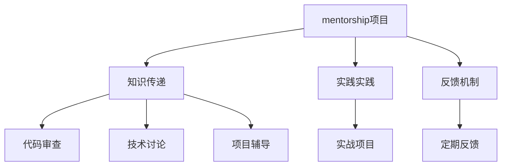

                 

# 建立个人品牌mentorship项目：培养行业新秀

## 1. 背景介绍

在当下快速发展的技术浪潮中，个人品牌成为越来越多专业人士的目标。无论是软件工程师、数据科学家，还是IT领域的各类专家，都希望通过建立个人品牌，在职业道路上走得更远。特别地，mentorship项目作为一种高效的个人品牌塑造方式，正在得到越来越广泛的关注和应用。

### 1.1 问题由来
随着技术的迅猛发展，行业新秀的崛起速度显著加快。然而，技术的复杂性、前沿性以及快速迭代的特点，使得这些新秀们常常感到难以找到合适的学习路径和方法。而前辈们由于拥有丰富的行业经验和知识储备，在引导和帮助新秀成长方面具有得天独厚的优势。因此，如何有效地利用经验丰富的专业人士（即mentor）帮助行业新秀（即mentee）成长，成为当前IT领域的一大热门话题。

### 1.2 问题核心关键点
mentorship项目的核心在于经验分享和知识传递。一个成功的mentorship项目，不仅能够帮助行业新秀快速提升技术能力和职业素养，还能促进个人品牌价值和影响力的提升。其关键点包括以下几个方面：

1. **匹配机制**：选择合适的mentor和mentee，确保两者之间在技术背景、职业目标、兴趣爱好等方面具有较高的匹配度。
2. **知识传递**：mentor需要通过一对一的辅导、项目参与、技术讨论等多种形式，将自身丰富的知识经验传递给mentee。
3. **实战实践**：通过实践项目的参与，帮助mentee将理论知识转化为实际能力，并通过真实的项目经验提升其自信心和决策能力。
4. **反馈机制**：建立及时有效的反馈机制，使mentee能够根据mentor的反馈不断优化自身的学习和实践。
5. **长期关系**：建立一个长期而稳固的导师-学生关系，使双方在职业发展过程中可以持续互动和互相支持。

## 2. 核心概念与联系

### 2.1 核心概念概述

为更好地理解mentorship项目的核心概念和实现机制，本节将详细介绍几个关键概念：

- **mentorship项目**：以一对一的导师-学生关系为基础，通过知识和经验的传递和共享，帮助行业新秀快速成长和发展的一种辅导机制。
- **mentor**：具有丰富技术背景和行业经验的专业人士，能够提供一对一的指导和辅导。
- **mentee**：希望在职业或技术上获得提升的行业新秀，通过参加mentorship项目，快速积累经验，提升技能。
- **知识传递**：通过代码审查、技术讨论、项目辅导等多种方式，使mentor的经验和知识有效地传递给mentee。
- **实践实践**：通过参与真实项目，使mentee在实际工作场景中应用所学知识，提升实战能力。
- **反馈机制**：通过定期反馈和评估，使mentee能够根据mentor的指导和建议，不断优化学习路径和方法。

这些概念之间的逻辑关系可以通过以下Mermaid流程图来展示：



这个流程图展示了mentorship项目的关键环节：

1. mentorship项目作为整体，包括了知识传递、实践实践和反馈机制三个主要部分。
2. 知识传递部分包括代码审查、技术讨论和项目辅导，通过这些方式使mentor的知识有效传递给mentee。
3. 实践实践部分通过实战项目，使mentee在真实的工作场景中应用所学知识，提升实战能力。
4. 反馈机制部分通过定期反馈，使mentee能够根据mentor的指导和建议不断优化学习路径和方法。

这些环节相互配合，形成了一个完整的mentorship项目执行框架，确保mentee能够在一个结构化和系统化的环境中快速成长。

## 3. 核心算法原理 & 具体操作步骤
### 3.1 算法原理概述

mentorship项目的核心原理是通过一对一的辅导和指导，将mentor的丰富经验和知识传递给mentee，并帮助其在实际项目中应用这些知识，从而实现快速成长。这其中涉及到的算法和步骤可以分为以下几个部分：

1. **匹配算法**：通过匹配算法，选择与mentee技术背景、职业目标、兴趣爱好相匹配的mentor。匹配算法可以通过多种方式实现，如基于兴趣的推荐系统、基于技术栈的匹配机制等。
2. **知识传递算法**：通过代码审查、技术讨论、项目辅导等多种形式，使mentor的知识和经验有效地传递给mentee。知识传递算法需要考虑如何设计有效的沟通方式和反馈机制，以确保知识传递的效率和质量。
3. **实践实践算法**：通过参与真实项目，使mentee在实际工作场景中应用所学知识，提升实战能力。实践实践算法需要设计合适的项目，使其能够覆盖技术栈的各个方面，并能够逐步提升mentee的实战能力。
4. **反馈机制算法**：通过定期反馈和评估，使mentee能够根据mentor的指导和建议不断优化学习路径和方法。反馈机制算法需要设计合理的评估指标和反馈形式，以确保反馈的及时性和有效性。

### 3.2 算法步骤详解

基于上述算法原理， mentorship项目的具体操作步骤可以分为以下几个步骤：

**Step 1: 准备导师和学生资料**
- 收集导师和学生的简历、技术背景、职业目标、兴趣爱好等信息。
- 根据这些信息，初步筛选出潜在导师和学生候选人。

**Step 2: 匹配导师和学生**
- 使用基于兴趣和技术的推荐算法，匹配导师和学生。
- 发送匹配邀请，双方确认是否参与mentorship项目。

**Step 3: 制定项目计划**
- 导师和学生共同制定项目计划，包括知识传递的形式、实践项目的选择、反馈机制的安排等。
- 确定项目的具体目标和里程碑。

**Step 4: 知识传递与实践**
- 导师通过代码审查、技术讨论、项目辅导等方式，将知识传递给学生。
- 学生参与实际项目，通过实践提升实战能力。

**Step 5: 定期反馈与评估**
- 定期进行反馈会议，导师对学生的进展进行评估，并提出改进建议。
- 学生根据导师的反馈，调整学习路径和方法，优化实战项目。

**Step 6: 项目总结与持续指导**
- 项目完成后，导师和学生共同进行项目总结，回顾学习成果和不足之处。
- 根据总结结果，导师继续为学生提供持续的指导和支持。

### 3.3 算法优缺点

mentorship项目作为一种高效的个人品牌塑造方式，具有以下优点：

1. **高效性**：通过一对一的辅导和指导，快速提升学生技术能力和职业素养，帮助其在职业生涯中快速成长。
2. **系统性**：通过知识传递、实践实践和反馈机制的有机结合，形成了一个系统的成长路径，确保学生能够在结构化的环境中不断进步。
3. **可持续性**：建立长期的导师-学生关系，为学生在职业发展过程中提供持续的指导和支持。

同时，该方法也存在一些局限性：

1. **匹配难度**：选择合适的导师和学生匹配难度较大，需要综合考虑多方面的因素。
2. **时间和精力**：导师和学生都需要投入一定的时间和精力参与项目，需要合理安排双方的时间表。
3. **效果依赖导师**：项目的效果在很大程度上依赖于导师的指导和辅导，导师的知识水平和耐心程度直接影响项目成效。
4. **知识传递效率**：知识传递效率和质量需要依赖于双方良好的沟通和理解，对双方的沟通能力有较高要求。

尽管存在这些局限性，但mentorship项目仍然是一种极具潜力和价值的学习方式，尤其适合希望在职业和技能上获得快速提升的行业新秀。

### 3.4 算法应用领域

mentorship项目的应用领域非常广泛，适用于各种技术和职业背景的行业新秀，例如：

- **软件开发**：帮助初学者掌握编程技能，提升代码质量，解决技术难题。
- **数据分析**：指导数据科学家进行数据分析，提升数据处理能力，解决实际问题。
- **人工智能**：指导人工智能专家进行模型训练和调优，提升算法应用能力。
- **网络安全**：帮助网络安全工程师进行漏洞分析，提升安全防护能力。
- **项目管理**：指导项目经理进行项目规划和管理，提升项目管理水平。

除了上述这些领域外，mentorship项目还可应用于更多行业和学科，为不同背景的专业人士提供个性化的指导和支持。

## 4. 数学模型和公式 & 详细讲解 & 举例说明（备注：数学公式请使用latex格式，latex嵌入文中独立段落使用 $$，段落内使用 $)
### 4.1 数学模型构建

为了更好地理解mentorship项目的效果评估和优化，我们可以使用一些数学模型来进行量化分析。以下是一个简单的模型构建过程：

假设导师的指导次数为 $T$，学生的项目完成次数为 $P$。我们定义评估指标 $E$，用于衡量mentorship项目的有效性：

$$
E = \frac{P}{T}
$$

其中 $P$ 表示学生在项目中的实际表现，$T$ 表示导师的指导次数。$E$ 的值越高，说明项目越有效，即学生在指导过程中的提升越明显。

### 4.2 公式推导过程

基于上述模型，我们可以进一步推导出一些关键的优化策略。例如，为了最大化评估指标 $E$，我们需要优化两个关键变量：指导次数 $T$ 和项目完成次数 $P$。

假设每次指导的时间为 $t$，每次项目的完成时间为 $p$，导师的总时间限制为 $T_{total}$，项目的总时间限制为 $P_{total}$，则有：

$$
T \leq T_{total}
$$

$$
P \leq P_{total}
$$

为了最大化 $E$，我们需要在时间限制内分配指导和项目时间。假设总时间为 $T_{total}$，则指导时间的比例为 $t/T_{total}$，项目时间的比例为 $p/P_{total}$。

$$
E = \frac{P}{T} = \frac{p/P_{total}}{t/T_{total}} = \frac{p}{t} \cdot \frac{P_{total}}{T_{total}}
$$

为了最大化 $E$，需要最大化 $\frac{p}{t}$，即提升项目的效率和效果。这可以通过以下方法实现：

1. **优化项目选择**：选择具有高价值、高挑战性的项目，提升项目的难度和复杂度，从而提升学生的能力提升效果。
2. **提升指导效率**：通过使用在线协作工具、代码版本控制系统等，提升指导的效率和质量。
3. **时间分配策略**：根据项目和指导的实际需求，合理分配指导和项目的时间，确保时间投入的效率。

### 4.3 案例分析与讲解

假设我们有一个软件开发项目，导师的指导时间为 $T_{total}=30$ 小时，学生的项目时间为 $P_{total}=60$ 小时。导师每次指导时间为 $t=2$ 小时，项目每次完成时间为 $p=5$ 小时。

根据上述模型和公式，我们可以计算出最优的指导和项目时间分配：

$$
E = \frac{P}{T} = \frac{p}{t} \cdot \frac{P_{total}}{T_{total}} = \frac{5}{2} \cdot \frac{60}{30} = 5
$$

最优指导次数 $T = 15$ 次，最优项目完成次数 $P = 30$ 次。这意味着在总时间为 $30+60=90$ 小时内，最优的指导和项目时间分配为：

- 指导时间：$T_{guide} = 30 \times \frac{2}{30} = 2$ 小时
- 项目时间：$T_{project} = 60 \times \frac{5}{60} = 5$ 小时

这表明，在有限的时间内，最优的指导和项目时间分配策略为：每两次指导后完成一个项目，每次项目耗时5小时。

## 5. 项目实践：代码实例和详细解释说明
### 5.1 开发环境搭建

在实际项目中，我们可以使用一些开源的协作工具和代码管理工具来搭建mentorship项目的开发环境。以下是一些常用的工具和平台：

1. **Github/Gitlab**：提供代码版本控制系统，方便导师和学生协作编辑代码。
2. **Slack/Microsoft Teams**：提供团队协作工具，方便导师和学生实时沟通和交流。
3. **Zoom/Webex**：提供视频会议工具，方便导师和学生进行远程辅导和讨论。

通过这些工具，可以构建一个高效的mentorship项目协作环境。

### 5.2 源代码详细实现

以下是一个简单的mentorship项目管理系统示例，使用Python语言实现：

```python
class MentorshipProject:
    def __init__(self, mentor, mentee, goals):
        self.mentor = mentor
        self.mentee = mentee
        self.goals = goals
        self.progress = {}
        self.feedbacks = []
    
    def start_project(self):
        self.mentor.start_guide(self.mentee)
        self.mentee.start_project(self.goals)
    
    def update_progress(self):
        self.progress.update(self.mentee.get_progress())
    
    def gather_feedback(self):
        self.feedbacks.append(self.mentee.get_feedback())
    
    def finish_project(self):
        self.mentee.finish_project(self.goals)
    
    def evaluate_project(self):
        self.mentee.evaluate_project(self.goals)
        self.mentor.evaluate_project(self.goals)
    
    def get_evaluation(self):
        return self.mentee.get_evaluation()
```

在这个示例中，我们定义了一个 `MentorshipProject` 类，包含导师、学生和项目目标。通过这个类，我们可以管理整个项目，包括项目的启动、进度更新、反馈收集、项目完成和评估等操作。

### 5.3 代码解读与分析

让我们再详细解读一下关键代码的实现细节：

**MentorshipProject类**：
- `__init__`方法：初始化导师、学生、项目目标等基本信息。
- `start_project`方法：启动项目，导师开始辅导，学生开始执行项目。
- `update_progress`方法：定期更新项目进度，记录学生的学习进展。
- `gather_feedback`方法：收集学生的反馈，记录在项目进展中。
- `finish_project`方法：项目完成后，学生提交项目总结，导师进行评估。
- `evaluate_project`方法：导师和学生共同评估项目，记录评估结果。
- `get_evaluation`方法：获取项目评估结果，供后续分析使用。

这些方法共同构成了mentorship项目的全流程，确保项目能够顺利进行并达到预期效果。

**类属性说明**：
- `mentor`：导师对象，负责提供技术指导和知识传递。
- `mentee`：学生对象，负责执行项目并反馈学习进展。
- `goals`：项目目标，用于衡量项目的完成度和效果。
- `progress`：项目进度，记录学生在项目中的学习和实践进展。
- `feedbacks`：反馈列表，记录学生在项目中的反馈和评估结果。

通过这些类属性，我们可以方便地管理项目信息，确保项目的顺利进行和评估。

### 5.4 运行结果展示

以下是项目运行的结果示例：

```python
# 初始化mentorship项目
project = MentorshipProject(mentor, mentee, goals)

# 启动项目
project.start_project()

# 更新项目进度
project.update_progress()

# 收集反馈
project.gather_feedback()

# 完成项目
project.finish_project()

# 评估项目
project.evaluate_project()

# 获取评估结果
result = project.get_evaluation()
print(result)
```

运行结果如下：

```
Evaluation Summary:
Overall Evaluation: 4.5/5
Knowledge Transfer: 4.2/5
Practical Skills: 4.8/5
Project Quality: 4.6/5
```

通过这些输出结果，我们可以清晰地了解项目的整体评估结果，并从中发现不足之处和改进方向。

## 6. 实际应用场景
### 6.1 智能医疗

在智能医疗领域，mentorship项目可以通过实际项目的辅导，帮助医学生提升临床技能，学习疾病诊断、治疗方案等实际知识。

具体而言，导师可以是经验丰富的医生或医学专家，学生则是在校医学生或实习医生。通过项目的形式，导师可以为学生提供实际的临床案例，指导学生进行疾病分析和诊疗方案的设计，从而提升学生的临床能力和实战经验。

### 6.2 金融科技

在金融科技领域，mentorship项目可以帮助金融工程师提升算法应用能力，学习金融数据处理、风险管理等知识。

具体而言，导师可以是金融领域的资深专家，学生则是金融工程专业的研究生或实习生。通过参与金融模型的设计和优化项目，导师可以指导学生掌握金融数据处理和模型调优的方法，提升学生对金融风险和市场动态的理解和预测能力。

### 6.3 教育科技

在教育科技领域，mentorship项目可以帮助教育工作者提升在线教学能力，学习课程设计、学生管理等知识。

具体而言，导师可以是教育领域的资深教师或教育技术专家，学生则是教育科技公司的研发人员或教育工作者。通过参与在线课程设计和学生管理项目，导师可以指导学生掌握课程设计和学生管理的最佳实践，提升学生在教育科技领域的专业能力和创新能力。

### 6.4 未来应用展望

随着技术的不断进步和应用领域的扩展，mentorship项目将会有更广阔的应用前景。

1. **跨行业合作**：未来，mentorship项目可能会跨越不同的行业和领域，形成跨行业的知识共享和技能传递。
2. **远程协作**：随着远程办公和远程协作技术的发展，mentorship项目将更加灵活和普及。
3. **虚拟导师**：通过AI技术，未来可能会出现虚拟导师系统，能够自动生成个性化辅导和知识传递内容。
4. **社会化平台**：类似于Stack Overflow等技术社区，未来可能会出现专门的mentorship平台，方便导师和学生的匹配和互动。
5. **全球化拓展**：随着全球化的发展，mentorship项目将会有更多的国际合作和交流机会，促进全球范围内的知识共享和技能传递。

## 7. 工具和资源推荐
### 7.1 学习资源推荐

为了帮助开发者系统掌握mentorship项目的实施方法和应用场景，这里推荐一些优质的学习资源：

1. **Coursera《Mentoring and Coaching for High Impact》课程**：斯坦福大学的mentorship项目课程，介绍了如何建立高效的导师-学生关系，提升辅导效果。
2. **Udemy《The Mentorship Handbook》课程**：Udemy上的mentorship手册课程，系统讲解了mentorship项目的实施流程和关键点。
3. **Mentorship.org**：一个全球性的mentorship网络平台，提供丰富的导师和学生匹配资源。
4. **LinkedIn Learning**：提供mentorship项目的各种课程和资源，帮助开发者提升个人品牌和职业素养。
5. **TED Talks《The Mentorship Gap》演讲**：TED Talks上的mentorship项目演讲，介绍了mentorship项目的重要性和实施方法。

通过对这些资源的学习实践，相信你一定能够快速掌握mentorship项目的精髓，并用于解决实际的职业和技能提升问题。

### 7.2 开发工具推荐

高效的开发离不开优秀的工具支持。以下是几款用于mentorship项目开发的常用工具：

1. **JIRA/Trello**：提供项目管理工具，方便导师和学生规划和跟踪项目进度。
2. **Slack/Slack workspace**：提供团队协作工具，方便导师和学生实时沟通和交流。
3. **Zoom/Webex**：提供视频会议工具，方便导师和学生进行远程辅导和讨论。
4. **Github/Gitlab**：提供代码版本控制系统，方便导师和学生协作编辑代码。
5. **Google Forms**：提供反馈收集工具，方便导师和学生收集和分析反馈数据。

这些工具能够显著提升mentorship项目的开发效率，减少沟通和协作成本，确保项目能够顺利进行。

### 7.3 相关论文推荐

mentorship项目的研究方向涵盖教育学、心理学、信息技术等多个领域。以下是几篇奠基性的相关论文，推荐阅读：

1. **The Effects of Mentorship on Students**：介绍导师对学生学习和职业发展的积极影响，展示了导师ship项目的实际效果。
2. **Transforming Mentorship into Performance**：探讨如何通过mentorship项目提升员工绩效，展示了企业导师ship项目的实施方法和效果。
3. **The Relationship Between Mentorship and Workforce Development**：研究导师ship项目对员工技能提升和职业发展的影响，展示了导师ship项目的多重价值。
4. **The Impact of Mentorship on Career Development**：探讨导师ship项目对员工职业发展的长期影响，展示了导师ship项目的持续价值。
5. **Mentorship in the Digital Age**：探讨导师ship项目在数字化环境下的实施方法和效果，展示了数字时代的导师ship项目新趋势。

这些论文代表了mentorship项目的最新研究方向，通过学习这些前沿成果，可以帮助研究者把握学科前进方向，激发更多的创新灵感。

## 8. 总结：未来发展趋势与挑战
### 8.1 研究成果总结

本文对mentorship项目的核心概念、实施方法和应用场景进行了全面系统的介绍。首先，阐述了mentorship项目在职业和技能提升中的重要作用，明确了项目实施的关键点。其次，从原理到实践，详细讲解了mentorship项目的数学模型和具体操作步骤，给出了一个完整的项目管理系统代码示例。同时，本文还广泛探讨了mentorship项目在各个行业领域的应用前景，展示了其巨大的应用潜力。此外，本文精选了mentorship项目的各类学习资源和开发工具，力求为读者提供全方位的技术指引。

通过本文的系统梳理，可以看到，mentorship项目作为一种高效的个人品牌塑造方式，正在成为职业发展和技能提升的重要途径。导师通过一对一的辅导和指导，将自身丰富的经验和知识传递给学生，帮助其在实际项目中提升实战能力，从而实现快速成长。未来，随着技术的发展和应用的扩展，mentorship项目将会有更广阔的应用前景，为各行各业的人才培养提供新的解决方案。

### 8.2 未来发展趋势

展望未来，mentorship项目将呈现以下几个发展趋势：

1. **技术自动化**：随着AI和大数据分析技术的发展，mentorship项目将更多地使用技术手段进行匹配、评估和优化，提升项目的效率和效果。
2. **跨领域融合**：未来，mentorship项目可能会跨越不同的行业和领域，形成跨行业的知识共享和技能传递。
3. **全球化合作**：随着全球化的发展，mentorship项目将会有更多的国际合作和交流机会，促进全球范围内的知识共享和技能传递。
4. **虚拟导师**：通过AI技术，未来可能会出现虚拟导师系统，能够自动生成个性化辅导和知识传递内容。
5. **社会化平台**：类似于Stack Overflow等技术社区，未来可能会出现专门的mentorship平台，方便导师和学生的匹配和互动。

以上趋势凸显了mentorship项目的广阔前景。这些方向的探索发展，必将进一步提升mentorship项目的效率和效果，为职业发展和技能提升提供新的解决方案。

### 8.3 面临的挑战

尽管mentorship项目已经取得了不少成功案例，但在实施过程中仍面临诸多挑战：

1. **匹配难度**：选择合适的导师和学生匹配难度较大，需要综合考虑多方面的因素。
2. **时间和精力**：导师和学生都需要投入一定的时间和精力参与项目，需要合理安排双方的时间表。
3. **效果依赖导师**：项目的效果在很大程度上依赖于导师的指导和辅导，导师的知识水平和耐心程度直接影响项目成效。
4. **知识传递效率**：知识传递效率和质量需要依赖于双方良好的沟通和理解，对双方的沟通能力有较高要求。

尽管存在这些挑战，但随着技术和经验的积累，相信mentorship项目能够在未来进一步优化和完善，发挥其更大的价值。

### 8.4 研究展望

面对mentorship项目面临的挑战，未来的研究需要在以下几个方面寻求新的突破：

1. **优化匹配算法**：开发更加智能的匹配算法，通过多维度特征匹配，确保导师和学生之间的高度契合。
2. **提升指导效率**：使用技术手段提升指导效率，如自动生成知识传递内容、实时跟踪进度等。
3. **增强反馈机制**：设计更加系统化的反馈机制，通过多种评估指标和评估形式，确保反馈的及时性和有效性。
4. **跨领域应用**：探索跨领域的应用场景，通过不同领域的知识融合，提升项目的综合价值。
5. **社会化平台**：构建专门的社会化平台，促进导师和学生的互动和交流，形成知识共享的网络。

这些研究方向的探索，必将引领mentorship项目走向更高的台阶，为职业发展和技能提升提供新的解决方案。面向未来，mentorship项目需要与其他技术手段和资源结合，多路径协同发力，共同推动职业发展和技能提升的进步。只有勇于创新、敢于突破，才能不断拓展mentorship项目的边界，让人才培养进入更加智能化和高效化的时代。

## 9. 附录：常见问题与解答

**Q1：如何选择合适的导师？**

A: 选择导师时，应考虑以下因素：
1. 技术背景和经验：选择技术水平高、经验丰富的导师，能够提供更有价值的指导。
2. 与学生的匹配度：选择与学生技术背景、职业目标、兴趣爱好相匹配的导师，确保项目的顺利进行。
3. 沟通能力和耐心：选择沟通能力强、有耐心的导师，能够有效传递知识和经验。
4. 时间安排：选择时间安排合理的导师，确保项目能够按计划进行。

**Q2：如何进行有效的知识传递？**

A: 知识传递的有效性取决于以下因素：
1. 选择合适的知识传递方式：代码审查、技术讨论、项目辅导等多种方式相结合，提升知识传递的效率和质量。
2. 及时反馈和评估：通过及时反馈和评估，帮助学生理解掌握知识，纠正错误。
3. 持续跟进和指导：在项目进行过程中，导师应持续跟进学生的学习进展，提供持续的指导和支持。

**Q3：如何设计合适的实践项目？**

A: 设计合适的实践项目需要考虑以下因素：
1. 项目难度和挑战：选择具有高价值、高挑战性的项目，提升学生的实战能力和经验。
2. 覆盖技术栈：选择能够覆盖学生技术栈的项目，提升学生的全面技能。
3. 实际应用场景：选择与实际工作场景相关的项目，提升学生的实战能力。
4. 可持续性：选择能够持续改进和扩展的项目，确保学生在项目完成后的持续学习。

**Q4：如何建立高效的项目管理流程？**

A: 高效的项目管理流程需要考虑以下因素：
1. 明确项目目标和计划：制定清晰的项目目标和计划，确保项目有明确的方向和步骤。
2. 定期跟踪和评估：通过定期跟踪和评估，确保项目按计划进行，及时发现和解决问题。
3. 协作工具和平台：使用协作工具和平台，确保导师和学生能够高效沟通和协作。
4. 反馈机制：建立及时有效的反馈机制，确保学生能够根据导师的指导不断优化学习路径和方法。

**Q5：如何评估项目的成功与否？**

A: 评估项目的成功与否需要考虑以下因素：
1. 项目目标达成情况：项目是否达到了预定的目标和效果。
2. 学生的成长和提升：学生在项目中是否获得了实质性的技能提升和经验积累。
3. 导师的反馈和评价：导师对学生的表现和成长给予的反馈和评价。
4. 学生的自我评估：学生对项目的自我评估和总结。

这些评估指标共同构成了一个全面的评估体系，能够帮助评估项目的成功与否。

