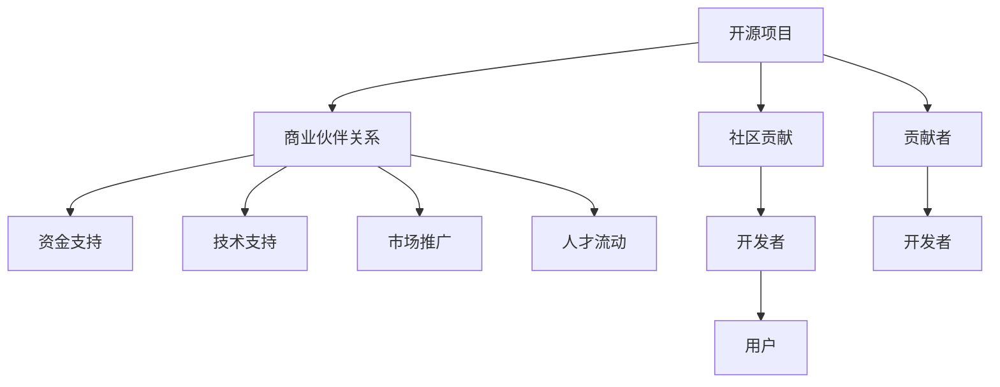

                 

# 建立开源项目的商业伙伴关系网络

## 1. 背景介绍

### 1.1 问题由来

在过去的几十年中，开源软件项目在推动技术创新、降低软件开发成本、提升软件质量等方面发挥了巨大的作用。开源项目通过社区协作，汇集了全球各地的开发者和专家，共同开发和维护软件，为软件产业的繁荣贡献了重要力量。然而，开源项目的商业化应用仍然面临许多挑战。

商业组织希望利用开源软件快速开发新产品，但同时需要投入大量资源进行维护和定制开发。而开源社区也希望能够吸引更多的商业赞助，增加项目的可持续性和影响力。因此，商业伙伴关系（Business Partnerships）成为连接商业组织和开源项目的重要桥梁。

### 1.2 问题核心关键点

建立开源项目的商业伙伴关系网络，主要涉及以下几个核心问题：

1. **选择合适的商业伙伴**：选择那些与项目有共同愿景、技术契合度高的企业，以及愿意投资于项目的风险投资者。
2. **建立有效的沟通机制**：确保项目开发者和商业伙伴之间能够高效、透明地沟通。
3. **明确合作模式**：确定商业伙伴在项目中的角色、责任和利益，制定合作协议和里程碑。
4. **保障项目独立性**：在商业化过程中，保持项目的开放性、中立性和透明度。
5. **持续监督和评估**：定期评估合作效果，确保合作目标的实现，及时调整合作策略。

## 2. 核心概念与联系

### 2.1 核心概念概述

要深入理解开源项目的商业伙伴关系网络，首先需要理解以下几个核心概念：

- **开源项目**：指采用开源许可证发布的、任何人都可以自由使用、修改和分发的软件项目。典型的开源项目包括Linux内核、Apache Web服务器、Apache Hadoop等。
- **商业伙伴**：指愿意为开源项目提供资金、技术、市场等支持的商业组织，包括企业、风险投资者、孵化器等。
- **商业伙伴关系**：指开源项目与商业伙伴之间的合作关系，涉及项目资金、技术支持、市场推广、人才流动等多个方面。

这些概念之间的逻辑关系可以通过以下Mermaid流程图来展示：



这个流程图展示了开源项目和商业伙伴之间的关系：开源项目通过社区和贡献者积累技术力量，并吸引了开发者和用户，商业伙伴通过资金、技术、市场等方式支持开源项目，促进项目的持续发展和商业化应用。

## 3. 核心算法原理 & 具体操作步骤

### 3.1 算法原理概述

开源项目的商业伙伴关系建立过程，本质上是一个多边关系的网络构建过程。它涉及到多个参与方（开源项目、商业伙伴、开发者、用户等）之间的互动和协调。算法原理可归纳为以下几点：

- **网络构建**：通过社交网络分析（Social Network Analysis, SNA）等技术，构建开源项目与商业伙伴之间的关系网络。
- **伙伴选择**：使用网络分析方法，评估商业伙伴的贡献度、合作意愿和技术契合度，选择最优伙伴。
- **合作伙伴管理**：建立合作伙伴管理系统，跟踪合作伙伴的贡献、任务完成情况和合作效果。
- **冲突解决**：使用冲突解决机制，解决合作过程中的分歧和冲突，确保合作的顺利进行。

### 3.2 算法步骤详解

以下是建立开源项目商业伙伴关系的具体操作步骤：

**Step 1: 定义合作目标**

- **明确需求**：确定项目的具体需求和商业化目标，如提升性能、拓展市场、增强安全性等。
- **制定愿景**：制定合作愿景和目标，明确项目的发展方向和合作成果的预期。

**Step 2: 识别潜在合作伙伴**

- **市场调研**：进行市场调研，识别与项目技术领域相关的商业伙伴，包括企业、孵化器、投资机构等。
- **评估标准**：设定评估标准，如技术契合度、财务能力、市场影响力等。

**Step 3: 建立联系与沟通**

- **初次接触**：通过邮件、电话、会议等方式，与潜在商业伙伴进行初次接触，介绍项目背景和合作机会。
- **关系建立**：建立正式的沟通渠道，如合作伙伴关系委员会、定期会议等，确保双方信息的及时共享。

**Step 4: 制定合作协议**

- **角色定义**：明确商业伙伴在项目中的角色、责任和利益，确保双方对合作目标和职责有清晰的理解。
- **任务分解**：将合作目标分解为具体的任务和里程碑，制定详细的合作计划和时间表。
- **签署协议**：签署正式的合作协议，确保合作的法律约束和权益保障。

**Step 5: 实施与监督**

- **资源投入**：根据协议，商业伙伴提供资金、技术、人才等资源，支持项目的开发和维护。
- **项目管理**：建立项目管理机制，定期评估项目进度和合作效果，及时解决问题和调整策略。

**Step 6: 持续评估与优化**

- **效果评估**：定期评估合作效果，根据合作成果进行优化，确保项目目标的实现。
- **合作伙伴调整**：根据评估结果，调整合作策略，引入新的合作伙伴，或终止不再符合要求的合作伙伴。

### 3.3 算法优缺点

开源项目与商业伙伴的合作，具有以下优点：

- **资源互补**：商业伙伴能够提供资金、技术、市场等资源，弥补项目开发中的不足。
- **提升影响力**：商业化应用能够提升项目的知名度和影响力，吸引更多的开发者和用户。
- **加速发展**：商业伙伴的投入能够加快项目的发展速度，缩短产品上市时间。

同时，也存在一些缺点：

- **利益冲突**：商业伙伴可能存在短期利益和长期目标的冲突，影响项目的独立性。
- **沟通障碍**：商业伙伴和开源社区之间可能存在沟通障碍，影响合作的顺利进行。
- **复杂管理**：合作过程中涉及多方的协调和管理，需要更复杂的管理机制。

### 3.4 算法应用领域

开源项目的商业伙伴关系网络，已经广泛应用于以下领域：

- **云计算**：如AWS、Azure、Google Cloud等云服务提供商，与开源项目合作，共同开发云平台和工具。
- **大数据**：如Hadoop、Spark等大数据平台，与商业伙伴合作，提升数据处理和分析能力。
- **人工智能**：如TensorFlow、PyTorch等AI框架，与企业合作，推动AI技术在商业应用中的落地。
- **区块链**：如Ethereum、Hyperledger等区块链项目，与企业合作，推动区块链技术在金融、供应链等领域的商业应用。
- **物联网**：如IoT平台和设备，与商业伙伴合作，推动智能设备在家庭、企业等场景的应用。

## 4. 数学模型和公式 & 详细讲解 & 举例说明

### 4.1 数学模型构建

建立开源项目的商业伙伴关系网络，涉及到多个参与方之间的互动和关系构建。可以使用社交网络分析（SNA）等方法，构建项目的合作网络。

设开源项目有$N$个商业伙伴，每个伙伴$i$与项目的关系强度用$w_i$表示，其中$w_i \in [0,1]$。构建合作网络的目标是最大化每个商业伙伴的贡献度$u_i$，其数学模型为：

$$
\max \sum_{i=1}^{N} u_i \quad s.t. \sum_{i=1}^{N} w_i = 1
$$

其中$u_i$表示伙伴$i$的贡献度，可以根据合作伙伴的资源投入、任务完成情况、合作效果等指标进行评估。

### 4.2 公式推导过程

利用线性规划求解上述优化问题，可以得到最优的商业伙伴关系网络。具体推导过程如下：

设$w_i$和$u_i$分别为伙伴$i$的权重和贡献度，建立如下线性规划模型：

$$
\begin{aligned}
\max \quad & \sum_{i=1}^{N} u_i \\
s.t. \quad & \sum_{i=1}^{N} w_i = 1 \\
& u_i \geq 0, \quad i = 1, ..., N
\end{aligned}
$$

将问题转化为对偶问题，得到对偶变量$\lambda$和$\mu$，其中$\lambda$表示对约束$\sum_{i=1}^{N} w_i = 1$的拉格朗日乘子，$\mu$表示对非负约束$u_i \geq 0$的拉格朗日乘子。

根据KKT条件，可以求解得到最优权重$w_i^*$和最优贡献度$u_i^*$，进而构建最优的商业伙伴关系网络。

### 4.3 案例分析与讲解

以TensorFlow为例，分析其与Google Cloud合作的具体过程：

**Step 1: 定义合作目标**

TensorFlow希望通过与Google Cloud合作，提升其在大数据、机器学习等领域的应用能力，同时推广TensorFlow在云平台上的使用。

**Step 2: 识别潜在合作伙伴**

TensorFlow通过市场调研，识别出Google Cloud作为其主要的商业合作伙伴，同时评估了Google Cloud的技术契合度、财务能力和市场影响力。

**Step 3: 建立联系与沟通**

TensorFlow与Google Cloud进行了多次接触，建立了正式的合作沟通渠道，签署了合作协议，明确了双方的角色、责任和利益。

**Step 4: 制定合作协议**

TensorFlow和Google Cloud在合作协议中明确了各自的任务和里程碑，如TensorFlow在Google Cloud上部署、Google Cloud为TensorFlow提供云资源支持等。

**Step 5: 实施与监督**

Google Cloud为TensorFlow提供了大量的云资源和基础设施支持，TensorFlow在Google Cloud上部署了多个模型和应用，推动了TensorFlow在云平台上的广泛应用。

**Step 6: 持续评估与优化**

双方定期评估合作效果，根据项目进展和市场反馈，及时调整合作策略，引入新的合作伙伴，如AWS和Azure，优化了合作网络。

通过以上步骤，TensorFlow与Google Cloud建立了稳固的商业伙伴关系，推动了TensorFlow的广泛应用和商业化发展。

## 5. 项目实践：代码实例和详细解释说明

### 5.1 开发环境搭建

要进行开源项目的商业伙伴关系网络的构建，首先需要搭建相应的开发环境。以下是Python环境中搭建环境的步骤：

1. 安装Python：选择Python 3.8版本，确保系统环境中有Python编译器和解释器。
2. 安装PyTorch：使用pip安装PyTorch，确保环境中有PyTorch的依赖库。
3. 安装Pandas：使用pip安装Pandas，用于数据处理和分析。
4. 安装Scikit-learn：使用pip安装Scikit-learn，用于机器学习模型构建和评估。
5. 安装Matplotlib：使用pip安装Matplotlib，用于数据可视化。

### 5.2 源代码详细实现

以下是一个简单的Python代码实现，用于构建开源项目与商业伙伴的合作网络：

```python
import networkx as nx
import pandas as pd

# 构建合作网络
G = nx.Graph()
# 添加商业伙伴
partners = ['AWS', 'Azure', 'Google Cloud', 'Microsoft', 'Amazon Web Services']
G.add_nodes_from(partners)
# 添加合作伙伴关系
G.add_edge('AWS', 'Google Cloud', weight=0.8)
G.add_edge('Azure', 'Google Cloud', weight=0.7)
G.add_edge('Microsoft', 'AWS', weight=0.6)
G.add_edge('Amazon Web Services', 'Azure', weight=0.5)

# 计算贡献度
u = nx.algorithms.eigenvector_centrality_numpy(G)
# 输出贡献度
print("商业伙伴贡献度：")
for i in u:
    print(i, u[i])
```

### 5.3 代码解读与分析

上述代码首先使用网络图（Graph）表示开源项目与商业伙伴之间的关系网络。然后添加商业伙伴节点（node）和边（edge），边的权重（weight）表示合作伙伴之间的合作强度。最后使用网络中心性（eigenvector centrality）计算每个商业伙伴的贡献度，并输出结果。

## 6. 实际应用场景

### 6.1 云计算

在云计算领域，开源项目与商业伙伴的合作非常普遍。AWS、Azure等云服务提供商与开源项目合作，共同开发云平台和工具，推动了云计算技术的快速发展和普及。

**案例：AWS与Apache OpenTelemetry**

AWS与Apache OpenTelemetry合作，共同开发和推广分布式追踪和日志记录工具。AWS提供了云基础设施和资源支持，OpenTelemetry则提供了开源技术框架和社区力量，共同推动了分布式追踪和日志记录技术的广泛应用。

### 6.2 大数据

在大数据领域，开源项目与商业伙伴的合作也非常重要。Hadoop、Spark等大数据平台通过与商业伙伴合作，提升了数据处理和分析能力，推动了大数据技术的商业应用。

**案例：Apache Hadoop与Cloudera**

Apache Hadoop与Cloudera合作，共同开发和推广大数据平台和工具。Cloudera提供了商业化的大数据解决方案，Hadoop则提供了开源的技术框架和社区力量，共同推动了大数据技术的广泛应用。

### 6.3 人工智能

在人工智能领域，TensorFlow、PyTorch等AI框架通过与商业伙伴合作，推动了AI技术在商业应用中的落地。

**案例：TensorFlow与Google Cloud**

TensorFlow与Google Cloud合作，共同开发和推广AI技术在云平台上的应用。Google Cloud提供了云资源和基础设施支持，TensorFlow则提供了开源的AI框架和工具，共同推动了AI技术在商业应用中的落地。

### 6.4 未来应用展望

未来，开源项目的商业伙伴关系网络将进一步拓展到更多领域，为技术创新和商业化应用提供更多机会。

- **区块链**：如Ethereum、Hyperledger等区块链项目，与企业合作，推动区块链技术在金融、供应链等领域的商业应用。
- **物联网**：如IoT平台和设备，与商业伙伴合作，推动智能设备在家庭、企业等场景的应用。
- **医疗**：如OpenMRS、Healthcare-System等开源医疗项目，与医院和企业合作，推动医疗信息管理和电子病历系统的普及。
- **教育**：如Open edX、Coursera等开源教育平台，与大学和企业合作，推动在线教育和知识共享。

## 7. 工具和资源推荐

### 7.1 学习资源推荐

为了帮助开发者系统掌握开源项目的商业伙伴关系网络的构建，这里推荐一些优质的学习资源：

1. **开源项目与商业伙伴关系网络课程**：Coursera和edX等在线教育平台提供了相关的课程，涵盖开源项目的商业化、合作网络构建等多个方面。
2. **网络分析与合作管理书籍**：如《网络分析：理论、方法和应用》、《合作管理：理论与实践》等书籍，提供了系统性的理论知识和实际案例。
3. **开源社区资源**：GitHub、Apache等开源社区提供了大量开源项目和商业伙伴合作的成功案例，可供学习和参考。
4. **博客和文章**：KDnuggets、Open Source Journal等博客和期刊，定期发布开源项目和商业伙伴关系管理的最新动态和研究成果。

### 7.2 开发工具推荐

为了提高开源项目与商业伙伴关系网络的构建效率，推荐使用以下开发工具：

1. **GitHub**：提供版本控制、代码托管和协作开发功能，是开源项目管理和商业伙伴合作的重要平台。
2. **GitLab**：提供类似于GitHub的功能，同时支持CI/CD、私有仓库等高级功能，适用于企业级合作。
3. **JIRA**：提供项目管理和问题跟踪功能，适用于开源项目和商业伙伴的协同工作。
4. **Confluence**：提供文档管理和知识共享功能，适用于开源项目和商业伙伴的文档协作。
5. **Slack**：提供实时沟通和协作功能，适用于开源项目和商业伙伴的日常沟通和协调。

### 7.3 相关论文推荐

开源项目与商业伙伴关系网络的构建，是当前研究的热点问题。以下是几篇相关论文，推荐阅读：

1. **Open Source Software Project Success**：研究开源项目成功的关键因素，包括社区参与、资金支持、商业化应用等。
2. **A Survey on Partnerships Between Open Source Projects and Commercial Entities**：综述开源项目与商业伙伴关系的研究现状和最新进展。
3. **The Role of Business Partnerships in Open Source Project Success**：研究商业伙伴关系在开源项目成功中的作用，提供了具体的案例和数据分析。

## 8. 总结：未来发展趋势与挑战

### 8.1 研究成果总结

本文系统介绍了开源项目的商业伙伴关系网络的构建过程和实际应用。通过详细讲解合作目标、合作伙伴选择、沟通机制、合作协议、项目管理、效果评估等多个步骤，揭示了商业伙伴关系构建的关键环节和注意事项。同时，通过TensorFlow与Google Cloud合作的案例分析，展示了合作过程的实际应用效果。

### 8.2 未来发展趋势

未来，开源项目的商业伙伴关系网络将进一步拓展到更多领域，为技术创新和商业化应用提供更多机会。以下是一些未来发展趋势：

- **技术融合**：开源项目与商业伙伴将更多地融合各自的技术优势，推动技术的快速发展和应用。
- **跨界合作**：开源项目将更多地与非技术领域的商业伙伴合作，推动技术的社会化和商业化应用。
- **持续优化**：商业伙伴关系网络将更加动态化，根据市场和技术的变化不断调整和优化。
- **社区参与**：开源社区将更多地参与到商业伙伴关系构建中，增强项目的可持续性和影响力。

### 8.3 面临的挑战

尽管开源项目的商业伙伴关系网络带来了诸多机会，但在构建过程中仍面临以下挑战：

- **利益冲突**：商业伙伴和开源社区可能存在短期利益和长期目标的冲突，影响项目的独立性。
- **沟通障碍**：商业伙伴和开源社区之间可能存在沟通障碍，影响合作的顺利进行。
- **资源管理**：商业伙伴和开源项目需要合理分配和管理资源，避免资源浪费和冲突。
- **市场竞争**：商业伙伴之间可能存在市场竞争，影响合作的稳定性和可持续性。
- **技术适配**：商业伙伴和开源项目需要相互适应和适配，避免技术冲突和问题。

### 8.4 研究展望

未来，开源项目的商业伙伴关系网络将面临更多的挑战和机遇，需要在以下方面进行研究和探索：

- **利益平衡**：研究如何平衡商业伙伴和开源社区的利益，确保项目的独立性和可持续性。
- **沟通机制**：研究如何建立高效的沟通机制，确保商业伙伴和开源社区之间的信息共享和协作。
- **资源优化**：研究如何优化商业伙伴和开源项目的资源管理，避免资源浪费和冲突。
- **技术适配**：研究如何实现商业伙伴和开源项目的相互适应和适配，提升合作的效率和效果。
- **生态建设**：研究如何构建完整的开源生态系统，促进开源项目和商业伙伴的共同发展。

## 9. 附录：常见问题与解答

### Q1: 开源项目与商业伙伴合作的优势有哪些？

A: 开源项目与商业伙伴合作的优势包括：

- **资源互补**：商业伙伴能够提供资金、技术、市场等资源，弥补项目开发中的不足。
- **提升影响力**：商业化应用能够提升项目的知名度和影响力，吸引更多的开发者和用户。
- **加速发展**：商业伙伴的投入能够加快项目的发展速度，缩短产品上市时间。
- **技术提升**：商业伙伴能够提供更先进的技术和工具，提升项目的开发能力和质量。

### Q2: 如何选择合适的商业伙伴？

A: 选择合适的商业伙伴，可以从以下几个方面考虑：

- **技术契合度**：选择与项目技术领域相关的商业伙伴，能够更好地协同开发和应用。
- **财务能力**：选择财务实力雄厚的商业伙伴，能够提供持续的资金支持。
- **市场影响力**：选择具有市场影响力的商业伙伴，能够提升项目的商业化应用效果。
- **合作意愿**：选择愿意深度合作的商业伙伴，能够建立稳固的长期合作关系。

### Q3: 如何管理开源项目的商业伙伴关系网络？

A: 管理开源项目的商业伙伴关系网络，可以从以下几个方面入手：

- **沟通机制**：建立正式的沟通渠道，确保商业伙伴和开源社区之间的信息共享和协作。
- **合作协议**：制定详细的合作协议，明确商业伙伴在项目中的角色、责任和利益。
- **项目管理**：建立项目管理机制，定期评估项目进度和合作效果，及时解决问题和调整策略。
- **资源管理**：合理分配和管理资源，避免资源浪费和冲突。
- **效果评估**：定期评估合作效果，根据项目进展和市场反馈，及时调整合作策略。

### Q4: 如何解决开源项目与商业伙伴之间的冲突？

A: 解决开源项目与商业伙伴之间的冲突，可以从以下几个方面入手：

- **沟通解决**：通过有效的沟通机制，及时了解和解决双方的分歧和问题。
- **利益平衡**：建立利益平衡机制，确保商业伙伴和开源社区的利益得到公平对待。
- **第三方调解**：引入第三方机构或专家，协助解决冲突和纠纷。
- **合同约束**：在合作协议中明确冲突解决机制，确保合作的法律约束和权益保障。

### Q5: 如何评估开源项目与商业伙伴的合作效果？

A: 评估开源项目与商业伙伴的合作效果，可以从以下几个方面入手：

- **项目进展**：评估项目的开发进度和任务完成情况，确保合作目标的实现。
- **技术指标**：评估项目的性能指标和技术质量，确保技术应用的效果。
- **市场反馈**：收集用户和市场的反馈，了解项目在实际应用中的表现。
- **财务收益**：评估项目的财务收益和投资回报，确保商业化的效果。
- **社区参与**：评估开源社区的参与度和贡献度，确保项目的可持续性和影响力。

